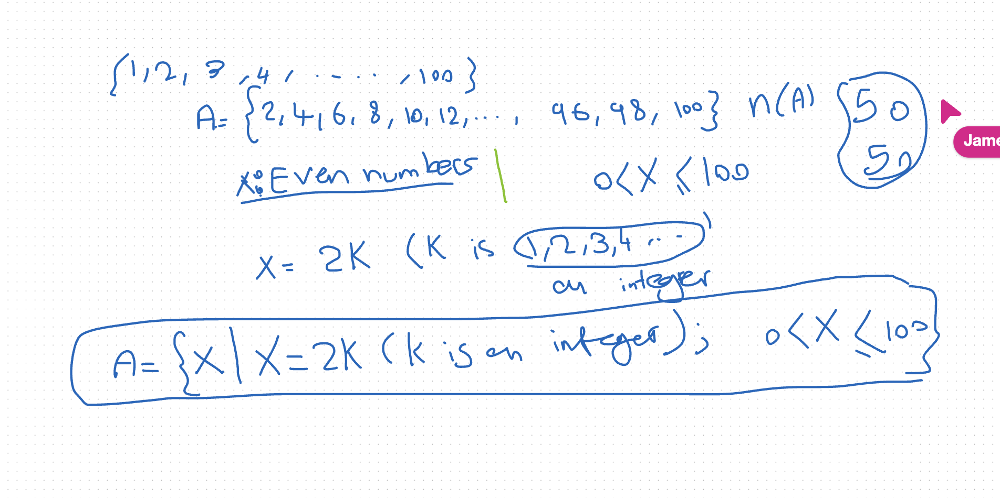
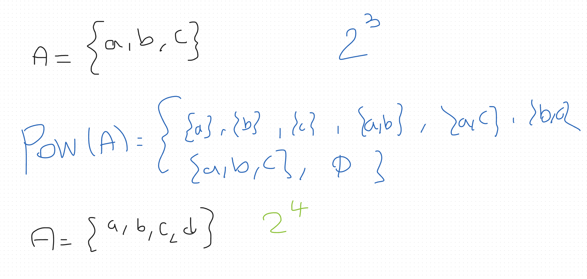
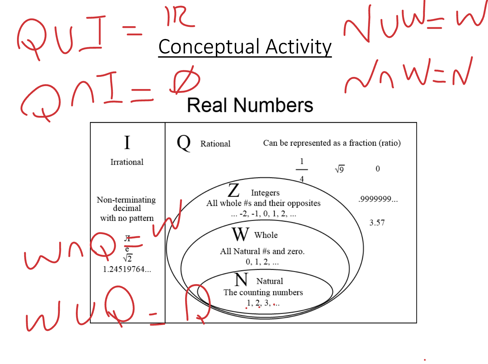
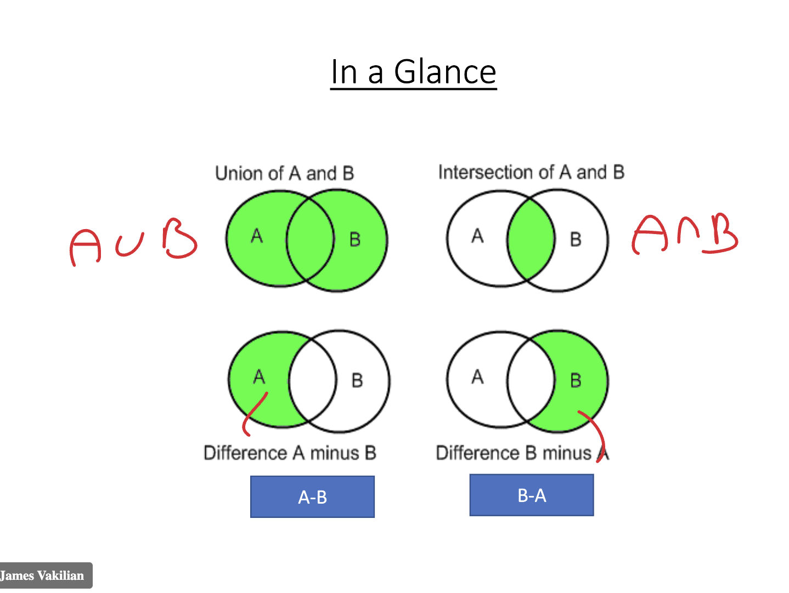

# Notes for MFA502

## Module 1 - Introduction to Machine Learning (MFA)

### I. Introduction to Set Theory
    - Set → A collection of objects.
        - A carpenter’s tool box → set.
        - All presidents of USA → set.
        - Your ten best friends → set.
        - All the programming languages → Set.
    - We understand sets intuitively.
    - The objects in a set may be similar or different.
    - A set may contain finite number of objects → Finite Sets
    - A set might contain infinite number of objects → Infinite Sets
> A set is a collection of items which have a common trait

Collection of tall boys: Not a set
Collection of boys higher than 1.8m: Set

{ x | x=2k (k is an integer); and 1<=x<=100 } is the set of even numbers


### Activity 1 - 15'
1) Identify three different sets
> set1 `even numbers less than 12` = { 2, 4, 6, 8, 10 }  
> set2 `common household pets` = { cat, dog, rabbit, guinea pig } 
> set3 `top 5 tech companies` = { apple, google, amazon, microsoft, meta } 

- how many elements does each have? 
> n(set1) = 5
> n(set2) = 4
> n(set3) = 5

- are they well-defined? 
> yes

- what are its elements?
> set1 = { 2, 4, 6, 8, 10 }
> set2 = { cat, dog, rabbit, guinea pig }
> set3 = { apple, google, amazon, microsoft, meta }

- would everyone agree with the elements?
> I believe so, since the membership is clear

2) Give two example of a null set
> Ø1 = {x | x is a natural number less than 0 } -> no such number meets this condition
> Ø2 = {x | x is a student who scored 11 out of a 10 exam } -> not possible

3) Give two example of a universal set
> context = numbers up to 20 -> U1 = {1, 2, …, 20}
> context = programming languages -> U2 = {Python, Javascript, Java, C++, C#, ...}

### II. Subsets
A = {1,2,3}
B = {x|0<=x<=50}
A⊆B // A is a subset of B

Conceptual Activity:
N⊆Z⊆Q⊆R

### III. Some Operations in Set Theory

Power set
If A has n members, then the power set of A has 2^n members
`pow(A) = {x | x⊆A}`

Example:
if A={a,b}
Then pow (A) has 2^2 = 4 members
That is: `pow({a,b}) = {{}, {a}, {b}, {a,b}}`

Intersection of sets:




### IV. Undefined Concepts and Program Syntax
### V. Tutorial

## Takeways:
- 

## Questions for Dr. James Vakilian:
- n/a

## Follow up
- ...

---

## Module 2 - Vector Spaces, Subspaces, and Linear Transformation

### I. Introduction to linear algebra 
W.2 → Vectors & vector spaces
W.3 → Introduction to Matrix theory
W.4 → Transformations
W.5 → Eigenvalues & Eigenvectors 

### II. Data & Information
it can be interpreted as
- Scalars
- Vectors
- Matrices
- Tensors

### III. Coordinate Systems 
x and y coordinates
N-D coordation system:
P (x,y,z,t) -> Space-Time (Minkowski space) 

### IV. Vectors
A vector has direction and magnitude (length)

### V. Vector space
A space with infinite number of vectors
The better the axioms are defined and covered, the better the vector space will be and the less glitches will be present at given space

### VI. Subspace
If V is a vector space
If W is a subset of V
AND W is a vector space
Then W is a Subspace of V

## Module 3A - Matrices

### I. An Introduction to Linear Algebra
- A branch of Abstract Mathematics
- Deals with linear relationships between variables
- Hermann Grassmann (1844): published his "Theory of Extension"
- Linear Algebra → deeper understanding of machine learning.
- The most important concept in linear algebra → Matrix Theory

### II. Introduction to Matrices
Matrices provide:
- a systematic approach for arranging large arrays of values
- simplify analysis of large amounts of data
- simplify analysis of large arrays of equations and their solutions
- simplify computer algorithms for manipulating large arrays of data

Matrices and Hard Disk Memory
Using matrices → we can correlate a unique address to every data point in memory of a hard disk

Definitions
Horizontal rows -> m
Vertical columns -> n
m x n = size of matrix
element (i,j) = element in row i and column j

### III. Few Important Matrices
- Scalar
- Row and Columns
- Square
- Diagonal
- Identity
- Zero
- Upper Triangular
- Lower Triangular

### IV. Fundamental Operations on Matrices
- Transpose of a Matrix
    - A' = T(A)
    - m x n will become n x m
    - T(T(A)) = A

- Equality of Matrices
    - A = B if and only if:
    - A and B have the same size
    - Corresponding elements of both matrices are equal

- Addition and Subtraction
    - Add: A2x2+B2x2 = a1+b1, a2+b2, a3+b3, a4+b4
    - Sub: A2x2-B2x2 = a1-b1, a2-b2, a3-b3, a4-b4

- Multiplication
    - Two matrices can be multiplied if and only if:
    - the number of columns in the first matrix 
    - **is equal** 
    - to the number of rows in the second matrix
    - Amxn * Bnxk = Cmxk

- Division?
    - There is no division of matrices
    - However, matrix inversion can be viewed in some sense as a procedure similar to division

- Important properties
    - AB != BA
    - (AB)C = A(BC)
    - A(B+C) = AB + AC
    - (B+C)A = BA + CA

### V. Determinants

- The determinant of a matrix A is defined only for a *square matrix*
- It is a *scalar* value
- Various representations are shown as:
    - det(A), |A|, *delta*

#### Determinant of a 2x2 matrix
A = [ a11 a12
     a21 a22 ]
    
det(A) = a11a22 - a12a21

#### Determinant of a 3x3 matrix
A = [ **a11** **a12** **a13**
     a21 a22 a23
     a31 a32 a33 ]

det(A) = **a11**(a22a33 - a23a32) - **a12**(a21a33 - a23a31) + **a13**(a21a32 - a22a31)

If det(A) = 0, then A is singular

### VI. Inverse Matrix
- The inversed of a matrix A is denoted as A^-1
- A matrix is inversible → det(A) ≠ 0
- If A is inversible, then A^-1 is also inversible = AA^-1 = A^-1A = I

#### Inverse of a 2x2 matrix
A = [ a11 a12
     a21 a22 ]

> 1) Change the location of elements on the main diagonal
> 2) Multiply the other two elements in (-1)
> 3) Divide the matrix by det(A)

A^-1 = [ (a22/det(A)) (-a12/det(A))
         (-a21/det(A)) (a11/det(A)) ]

### Extra Reading
https://www.linkedin.com/pulse/linear-algebra-fuels-artificial-intelligence-kayode-odeyemi/

## Module 3B - Fundamentals of Linear Algebra
Linear Transformations, Eigenvalues and Eigenvectors

### I. Image Processing
- Image processing → operations performed on images to improve quality or extract information.
- In real-world applications, images are represented as collections of pixels.

My take:
> "Instead of trying to make computers draw hyper-realistic images from scratch, this method uses real photos as puzzle pieces.
Each face of a 3D object (like the sides of a cube or the panels of a car) is captured as a real photo. 
> Using projective transformations (basically mathematical formulas that let you tilt, rotate, and scale images correctly in 3D space), the computer assembles these flat photos to make the full 3D object appear real.
> The result looks like a realistic model you can move or view from different angles, perfect for 3D vision (stereo) or animation.

### II. Transformation
T: S -> S'
P(x,y,z) -> P'(x',y',z')

### III. Two types of Transformation
- Linear: preservers linear relationships between variables
- Non-linear: changes linear relationships between variables

---

** Reflection **

1) What do you understand from transformation?

A transformation is a mathematical operation that changes an object’s position, size, or orientation while possibly preserving or altering its shape. In computing terms, it’s when input data (like coordinates, pixels, or signals) is mapped to a new form according to a specific rule — often expressed using matrices. For example, rotating, scaling, or translating an image are all forms of transformations.

⸻

2) Have you used transformation before? What was the case?

Yes, I’ve used transformations while converting and manipulating images — for instance, resizing, rotating, or converting formats (like JPG to PNG). I’ve also worked with coordinate transformations when positioning UI elements or plotting graphs in Python. These all involve some form of linear transformation where data points are mapped to new coordinate spaces.

⸻

3) In your opinion, where is linear transformation used in computer science?

Linear transformations are everywhere in computer science — especially in graphics, machine learning, and data processing. In 2D and 3D graphics, they’re used to rotate, scale, and project objects onto screens. In AI, they appear in matrix operations inside neural networks where weights transform input data into feature representations. They’re also used in simulations, robotics, and signal processing to model linear relationships.

⸻

4) In your opinion, where is non-linear transformation used in computer science?

Non-linear transformations appear when the relationship between input and output isn’t proportional or predictable. They’re used in route optimization, encryption, neural networks (activation functions), image enhancement, and computer vision. In these cases, data must be warped or mapped in complex ways that can’t be described by simple matrix multiplication — non-linear transformations capture that complexity.

---
### IV. Linear Transformation
Properties:
TBD

### V. Geometrical Interpretation of Matrices
Point A
Line segment AB
Triangle ABC
Square ABCD

### VI. Matrix Transformation
#### Exercise 3 - Linear Transformation by Matrices

1. Prove a 2×2 matrix is a linear transformation:
T(x) = A·x
A = [[a, b], [c, d]]
T(x) = [a*x1 + b*x2, c*x1 + d*x2]
→ T(x1 + x2) = T(x1) + T(x2)
→ T(c·x) = c·T(x)
✅ Linear

2. Prove a 3×3 matrix is linear:
Same logic applies. Matrix multiplication distributes over + and scalar *.

3. Conclusion:
Any n×n (or m×n) matrix represents a linear transformation, since:
A(x1 + x2) = A·x1 + A·x2
A(c·x) = c·A·x
✅ Linear for all dimensions.

#### VII. Different types of Matrix Transformation
- 2D Translation
- Scaling
- Rotation
- Shears
- Reflection
- Projections

## Module 4 - Eigenvalues and Eigenvectors

### I. Conceptual Analysis
- A matrix transforms a vector — usually changing both:
	1.	Magnitude (how long it is)
	2.	Direction (where it points)
- But some special vectors (called eigenvectors) are only stretched or shrunk, not rotated.
The scalar (number) that describes how much it is stretched or shrunk is the eigenvalue (λ).

In equation form:
A x = λx
where:
A = matrix,
x = eigenvector,
λ = eigenvalue.

### II. Parallel Vectors

Two vectors are parallel if one is a scalar multiple of the other:

V = λU
Examples:

- [2,1,5] and [10,5,25] → parallel
- [2,1,5] and [-2,-1,-5] → parallel (but opposite direction)

### III. Conceptual Examples

(General Case)

A 3×3 matrix multiplies a vector — both direction and magnitude change.
This is the “normal” transformation case.

(Special Case)

For certain vectors, the direction remains the same; only the length changes.
That’s where eigenvectors appear:

A V = λ V

If this holds true,
- λ → eigenvalue of A
- V → eigenvector of A

### IV. Meaning of “Eigen”
- The word “Eigen” comes from German — meaning “own” or “typical”.
→ “Eigenvector” = “own direction” of the matrix
→ “Eigenvalue” = “own scale” or “stretch factor” of the matrix

### V. Geometrical Intuition
- The matrix acts as a transformation that can:
- Rotate
- Stretch
- Compress
- Reflect
- But along certain axes, it just scales the vector:
- Blue arrow (eigenvector) keeps direction.
- Red arrow (regular vector) changes direction.

If eigenvalue λ = 1 → vector length unchanged.
If λ > 1 → stretched.
If 0 < λ < 1 → shrunk.
If λ < 0 → flipped direction.

### VI. Visual Analogy
- Imagine a rubber sheet being pulled — most directions bend, but some stretch straight.
Those straight lines are the eigen-directions.

### VII. Application in Machine Learning
- Big matrices (data) are computationally heavy.
- Using eigen decomposition, we can represent them with smaller sets of key components:
- Principal Component Analysis (PCA)
- Feature compression
- Dimensionality reduction
- Image and face recognition (“Eigenfaces”)

Eigenvalues + eigenvectors summarize large datasets efficiently.

### VIII. Reflection Questions (from slides)
1.	What is an eigenvector / eigenvalue?
→ An eigenvector is a direction that remains unchanged in orientation after transformation.
→ Its corresponding eigenvalue tells how much it’s scaled.
2.	Where is it used in AI/ML?
→ PCA, data compression, facial recognition, recommendation systems.
3.	What makes them special?
→ They do not rotate; they preserve direction.
4.	Geometrical interpretation?
→ Fixed-direction scaling.
5.	Have I coded this before?
→ Yes — in Python scripts for 2×2 and 3×3 matrices without using NumPy.

### Reflection
1. What is an eigenvector? What is an eigenvalue?
> Eigenvector → direction in space that remains unchanged in orientation after transformation.
> Eigenvalue (λ) → scale factor that defines how much the eigenvector is stretched, compressed or flipped.

2. What is the application of eigenvalues and eigenvectors in AI/ML?
> Eigenvalues and eigenvectors are used in AI/ML for reduction of dimensions and feature/data compression.

3. What is the characteristic that distinguishes between eigenvectors and other matrix transformations?
> Eigenvectors are special because they do not change direction under a transformation — they are only scaled. Other vectors are rotated or sheared, but eigenvectors preserve their alignment.

4. What is the geometrical interpretation of eigenvalues and eigenvectors?
> Geometrically, a matrix transformation can stretch, rotate, or reflect a shape. Eigenvectors represent the axes of pure scaling, where the transformation acts as a simple stretch or compression.
> The eigenvalue tells how much the vector is scaled along that axis:
>- λ > 1 → stretched
>- 0 < λ < 1 → compressed
>- λ < 0 → flipped to the opposite direction

5. Have you ever used this mathematical concept before?
> R: I believe so when training machine learning models using scikit-learn, but I imagine it abstracts the concept and math away from it.

## Module 6 - Derivatives and Integrals

Calculus is the mathematical study of continuous change. Geometry is the branch of mathematics that focuses on the study of shapes. 
The core concepts of calculus—differentiation and integration—are built on the idea of limits, which allows us to analyze how things change over infinitesimally small intervals. 

More to come...

## Module 5 - Derivatives and Integrals

### I. Introduction to Calculus
Branch of mathematics, originally from the calculus of infinitesimals.Developed by Isaac Newton and Gottfried Wilhelm Leibniz at the same time in the late 17th century.

Differential calculus: study of rates at which quantities change
Integral calculus: study the area under a curve

### II. Mapping & Relations

#### Conceptual example
set A: {Benz, Bentley, Jaguar}
set B: {Red, Blue, Green}

f: A -> B
f(Benz) = Red
f(Bentley) = Blue
f(Jaguar) = Green

#### Mapping
Correlating members of one set A with/to members of another set B
The relation R maps elements of set A to elements of set B:
R: A -> B

#### Ordered Pair
Cartesian product of two sets A and B
Denoted A x B
A x B = {(a, b) | a ∈ A, b ∈ B}

#### Cartesian Multiplication
- Note 1: (X,Y) != (Y,X)
- Note 2: RXR = R^2 (*Plane*)
- Note 3: RXRXR = R^3 (*Space*)
- Note 4: RxRxRx... = R^n (*n*)

#### Relation
- One to one mapping
- Many to one mapping
- One to many mapping (not interested on this in Calculus)
- Many to many mapping (not interested on this in Calculus)

### III. Functions

#### Conceptual example
- set A: {Milk, Sugar, Flavor} -> inputs(x)
- Ice Cream Machine (f: A -> B)
- set B: {Vanilla, Chocolate, Strawberry} -> outputs(y)

`f: A -> B`
- x is the input -> independent variable
- y is the output -> dependent variable

> The same input can't generate different outputs

#### Variables
- A function may have several independent variable, set of all inputs = A
- A function may have several dependent variable, set of all outputs = B

#### Function vs Relations
It can be one-to-one or many-to-one mapping, meaning they have a well-behaved relation.

#### Domain and Range
Domain: set of all possible inputs
Range: set of all possible outputs

#### Rules for functions
1. Not divide by zero
2. Not take the square root of a negative number
3. Not defined

### IV. Limits

Limits study the behavior of function. Thinki about y = 1/x
How to find? Starting from a point, example:
x = 0,01
x = 0,00001
x = 0,0000001
...

#### Concept of limit - informal
As x approaches 0, y approaches infinity.

#### Definition of limit - informal
If x -> value c from either sides -> the value of (fx) approaches a real number L, then:
Lim f(x) = L (as x -> c)

#### Definition of limit - formal
If for every positive number epsilon, there exists a positive number delta such that for all x in the domain of f, if 0 < |x - c| < delta, then |f(x) - L| < epsilon, then:
Lim f(x) = L (as x -> c)

### V. Continuity
It is a function that does not have any abrupt changes in value, known as discontinuities.

#### Types of discontinuities
1. Removable discontinuity
2. Jump discontinuity
3. Essential discontinuity

#### Continuity Test
```python
1. f(c) exists              # c lies in the domain of f
2. lim x->c f(x) exists     # f has a limit as x -> c
3. lim x->c f(x) = f(c)     # the limit equals the function value at c
```

## Module 5B - Differential Calculus

### I - Derivatives
Derivatives are used to calculate the rate of change of a function at a given point.

### II - Derivative of functions
The derivative of a function f at a point x is defined as:
f'(x) = lim[Δx->0] [f(x+Δx) - f(x)] / Δx

We can calculate the derivative of common functions using rules like:
- Power rule: d/dx[x^n] = nx^(n-1)
- Constant rule: d/dx[c] = 0
- Sum/Difference rule: d/dx[f(x) ± g(x)] = f'(x) ± g'(x)
- Product rule: d/dx[f(x)g(x)] = f'(x)g(x) + f(x)g'(x)
- Chain rule: d/dx[f(g(x))] = f'(g(x))g'(x)
> Master these five and solve most problems!

### III - Differentiability of a function
A function is differentiable at a point if its derivative exists at that point.

### IV - Some applications
- Absolute and local maxima/minima
- Monotonic functions
- Maximum, Minimum & Slope
- Concavity and convexity
- Applied optimization problems

### V - Exercises
Define the following:

1. Absolute maximum: global **peak** on an interval
2. Absolute minimum: global **valley** on an interval
3. Local maximum: x = c, means f(c) is the **biggest** value in the neighborhood around c
4. Local minimum: x = c, means f(c) is the **smallest** value in a neighborhood around c
5. Critical points: x-values where f'(x) = 0 or f'(x) is undefined
6. First derivative test for local extreme values: 
    - If f'(x) changes from positive to negative at x = c, then f(c) is a local maximum
    - If f'(x) changes from negative to positive at x = c, then f(c) is a local minimum
7. Increasing functions: if x1 < x2, then f(x1) < f(x2), meaning **if x goes up, y goes up**
8. Decreasing functions: if x1 < x2, then f(x1) > f(x2), meaning **if x goes up, y goes down**
9. Monotonic functions: a function that is either increasing or decreasing on the given interval I
10. First derivative test for monotonic functions: we find f'(x) and check if it is positive or negative on the interval I to define if the function is increasing or decreasing
11. Determine local maxima or minima of function: y = f(x) = x^5 - 8x^3 + x + 2

#### Refs
Critical Points intro: https://www.youtube.com/watch?v=lDY9JcFaRd4
First derivative test: https://www.youtube.com/watch?v=G5wlKltW7pM

## Module 6 - Optimization
Lecture by Dr. Niusha Shafiabady

Hill climbing, Simulated Annealing, Genetic Algorithms, S.T.

### Hill Climbing 
Main idea: keep a single current node and move to a neighboring node that improves the objective function value.

- Greedy local search, steepest ascent/descent variants
- Drawback: Can get stuck in local optima; no guarantee of global optimum
- Cure: Random restarts, random mutations, or probabilistic acceptance of worse solutions

> **Note**: Hill climbing is an iterative optimization algorithm used to find the maximum/minimum value of a function. It explores the search space by moving to the best neighboring solution at each step, but can easily become trapped in local optima.

### Simulated Annealing
Main idea: probabilistic technique for approximating global optimization in a large search space.

- Inspired by metallurgy: slowly cool a material to achieve a low-energy crystalline structure
- Accepts worse solutions with a certain probability that decreases over time (temperature schedule)
- Helps escape local optima by allowing uphill moves early in the process
- Temperature parameter controls the probability of accepting worse solutions

- Drawback: Can still get trapped in local optima if the cooling schedule is too fast or the initial temperature is too low. Solution to that can also rely on random restarts or adaptive cooling schedules

> **Note**: Simulated Annealing is a probabilistic optimization algorithm that mimics the physical process of heating and slowly cooling a material to achieve a low-energy state. It accepts worse solutions with a certain probability that decreases over time, helping to escape local optima and potentially find better global solutions.

### Genetic Algorithm
Main idea: population-based metaheuristic inspired by natural selection and genetics

- Uses a population of candidate solutions (chromosomes)
- Evolutionary operators: selection, crossover (recombination), mutation
- Selection: choose better solutions to survive and reproduce
- Crossover: combine parts of two parent solutions to create offspring
- Mutation: introduce random changes to maintain diversity
- Iteratively improves population over generations to find optimal solutions

> **Note**: Genetic Algorithms are population-based optimization methods that mimic natural selection. They maintain a diverse set of candidate solutions and use evolutionary operators to gradually improve the population toward better solutions.

#### Stopping Criteria
f(x) = x_1^2 + x_2^2 + ... + x_n^2 

while f(x_best) > 0.00001
{ 
    for each generation in population:
        evaluate fitness of all individuals
        select parents based on fitness
        apply crossover and mutation to create offspring
        replace worst individuals with offspring
    update best solution found so far
}

> **Note**: The stopping criteria for a Genetic Algorithm can be based on multiple conditions such as reaching a maximum number of generations, achieving a satisfactory fitness level, or when the improvement over several generations falls below a threshold. We define it when we want to terminate the algorithm based on these conditions to avoid unnecessary computation.

## Module 5 - Integral Calculus

**Differential calculus** is a subfield of calculus that studies the rates at which quantities change.
**Integral calculus** is a subfield of calculus that studies the area under a curve.

Outline:
### I. Antiderivatives
A function F is an antiderivative of f on an interval I if F'(x) = f(x) for all x in I.
y = f(x) has its antiderivative y = F(x) + C, where C is an arbitrary constant.

> Definition: Indefinite integral is the collection of all antiderivatives of f representing the indefinite integral of f with respect to x, and is denoted by  ∫f(x)dx
> The symbol ∫ is an integral sign. The function ∫ is the integrand of the integral, and x is the variable of integration.

**∫f(x)dx = F(x) + C.**

### II. Definite Integrals
Definite integral of f from a to b is denoted by ∫[a to b] f(x)dx and represents the signed area between the graph of f and the x-axis from x = a to x = b.

**∫[a to b] f(x)dx = F(b) - F(a)**

where F is any antiderivative of f.

> Definition: If y = f(x) is nonnegative and integrable over a closed interval [a. b], then the area under the curve y = f(x) over [a, b] is the integral of f(x) from a to b, denoted as ∫[a to b] f(x)dx.

Summary: to find the area between the graph of y = f(x) and the x-axis over the interval [a, b]:
1. Subdivide [a, b] at the zeros of f
2. Integrate f over each subinterval
3. Add the absolute values of the integrals

### III. Fundamental Theorem of Calculus
The Fundamental Theorem of Calculus establishes the relationship between differentiation and integration, showing that they are inverse processes.

**Part 1**: if f is continuous on [a, b] then F(x) = ∫[a to x] f(t)dt is continuous on [a, b] and differentiable on (a, b) and differentiable on (a, b) and its derivative is f(x):
F'(x) = d/dx ∫[a to x] f(t)dt = f(x)

**Part 2**: if f is continuous at every point of [a, b] and F is any antiderivative of f on [a, b], then:
∫[a to b] f(x)dx = F(b) - F(a).

### IV. Integration by Substitution
Integration by substitution (u-substitution) is a technique used to simplify integrals by changing variables. If u = g(x) is a differentiable function whose range is an interval I and f is continuous on I, then:
∫f(g(x))g'(x)dx = ∫f(u)du

### V. Integration by Parts
Integration by parts is based on the product rule of differentiation. The formula is:
∫u dv = uv - ∫v du

### VI. Other Integration Methods
### VII. Tutorials

## Module 10 - Foundations of Probability, Theorem & Statistics For AI

### Reflection I
1. What are the different types of phenomena? Define each and give some examples
- Deterministic: predictable, modeled mathematically
- Non-deterministic: unpredictable; divided into random (statistical pattern) and chaotic (no pattern).

2. What is the main distinguishable characteristic for each phenomena.
- Deterministic: outcome certainty
- Random: uncertain short-term but stable long-term
- Chaotic: unpredictable at all levels

3. How is each phenomena modeled?
- Deterministic: differential equations
- Random: probability theory
- Chaotic: nonlinear dynamic systems

4. What is Probability Theorem? Why is it important?
It is the mathematical study of uncertainty, which assigns numerical likelihood to events.

5. What are the application of Probability Theorem? Give 3 examples.
Finances, weather forecasting, machine learning

6. What is probabilistic reasoning?
It is about using probability and logic to predict outcomes from known population structure.

7. Write a 500-word report on the application and significance of each type of phenomenon in computer science.
Computer science relies on all three classes of phenomena: deterministic, random, and chaotic. Each playing distinct and critical roles.

Deterministic phenomena form the backbone of classical computing...
Non-deterministic random phenomena (and Probability Theory) dominate modern computer science, espcially artificial intelligence and machine learning...
Chaotic phenomena, though less commonly acknowledged, are increasingly important...

In summary, deterministic phenomena give computer science its reliable core, random phenomena (via probability) power modern AI and scalable algorithms, and chaotic phenomena remind us of fundamental predictability limits while opening new computational paradigms (e.g., chaotic neural networks, analog/quantum computing). Mastering all three is essential for building robust, intelligent, and realistic systems in contemporary computer science and artificial intelligence.

### Reflection II
1. What is a probability experiment?
Action/process through which specific results (outcomes) are obtained. Where there are multiple possible outcomes, the experiment can be repeate and the outcome of any single trial is random. Example: flipping a coin.

2. What is an outcome of a probability experiment?
The result of a single trial of a probability experiment.

3. What is sample space?
It is the set of all possible outcomes of a probability experiment. Denoted S or Ω.
Example 1: coin → S = {H, T}
Example 2: die → S = {1,2,3,4,5,6}

4. What is av event? What is a simple event?
- Event: Any subset of the sample space (one or more outcomes we are interested in). Denoted with capital letters (A, B, E, …).
- Simple event: An event that contains exactly one outcome. and cannot be broken down further. Example (die): simple event = {5} / composite event = {2,4,6} (even numbers)

5. Sample Space S has n outcomes. How many events can S have? (Hint: try for n=2 and n=3, then generalize)
Every event is a subset of S.
If n=2, then there are 2^2 = 4 events.
If n=3, then there are 2^3 = 8 events.

6. Give an example of a null event?
The empty event ∅ = { } — an event that contains no outcomes.
Example: rolling a die and getting a 7 (impossible) → ∅.
P(∅) = 0 → it never occurs.

7. Give an example of the entire event?
The sample space itself S — the event that contains all possible outcomes.
Example: rolling a die and getting a number between 1 and 6 → S.
P(S) = 1 → it always occurs.

8. What are the different relationships between events?
- Dependent events: the occurrence of one event affects the probability of the other event.
- Independent events: the occurrence of one event does not affect the probability of the other event.
- Mutually exclusive events: the occurrence of one event precludes the occurrence of the other event.
- We don't know...

9. In your opinion, how should we calculate probability?
There are several valid approaches, but the two main formal ways introduced in the lecture are:
- **Classical probability** (when all outcomes are equally likely and the sample space is finite):
P(A) = (number of favourable outcomes for A) / (total number of possible outcomes) = n(A)/N
- **Axiomatic probability** (Kolmogorov’s modern foundation): we assign probabilities satisfying the three axioms (non-negative, P(S)=1, additivity for disjoint events) — this is the most general and rigorous way and underpins everything else in probability theory.

### Reflection IV
1. What does the probability of the union of two events mean? How can we do it?
The probability of the union P(A ∪ B) is the probability that at least one of the events A or B (or both) occurs – i.e., “A or B or both”.
Formula (additive rule): **P(A ∪ B) = P(A) + P(B) - P(AB)**

2. How can we calculate the probability of the union of two mutually exclusive events?
If A and B are mutually exclusive (disjoint), they cannot happen at the same time, so P(A ∩ B) = 0.
Therefore: **P(A ∪ B) = P(A) + P(B)**

3. What does the probability of the complement of an event mean? How can we calculate the probability of the complement of an event?
The complement Aᶜ (or “not A”) is the event that A does not occur. Since either A has to happen or it doesn’t, the total probability is 1.
Formula: **P(Aᶜ) = 1 – P(A)** (also written as P(not A) = 1 – P(A))

4. What is Conditional Probability? How is it calculated?
Conditional probability P(A|B) is the probability that event A occurs given that event B has already occurred.
Formula: **P(A|B) = P(A ∩ B) / P(B)**    (provided P(B) ≠ 0)

5. What is the probability of two independent events?
If A and B are independent, the occurrence of one does not affect the other.
The probability that both happen (intersection) is the product of their individual probabilities: **P(A ∩ B) = P(A) × P(B).** (Note: independence also implies P(A|B) = P(A) and P(B|A) = P(B))

6. What is the probability of event A & B, both happening?
This is the probability of the intersection P(A ∩ B).
- If A and B are independent: **P(A ∩ B) = P(A) × P(B)**
- If A and B are dependent: **P(A ∩ B) = P(A|B) × P(B)**  or equivalently  **P(A ∩ B) = P(B|A) × P(A)**

## Module 11 - Prepositional Logic

**Reasoning**: asking why, making sense of things
**mythos → logos**: from stories and tradition to rational explanation and logic

### Logical Reasoning
1. Deductive: one or more statements lead to a conclusion. *Example: All men are mortal. Socrates is a man. Therefore, Socrates is mortal.*
2. Inductive: generalization from specific observations. *Example: Every swan I have seen is white, therefore all swans are white.*
3. Abductive: one or various possible explanations are considered, and the most plausible one is selected. *Example: The grass is wet, so it probably rained (even though other explanations are possible).*

### Types of Logic
- propositional
- predicate
- syllogistic
- modal
- informal reasoning
- mathematical
- philosophical

### Activity 1, individual
1. What is reasoning? Is reasoning always right?
R: The process of using existing knowledge to form new conclusions or make sense of information. Not always right, as it can be influenced by biases, incomplete information, or flawed logic.

2. What is logic?
R: The systematic study of the principles/criteria of valid inference and demonstration. It provides a framework for distinguishing correct from incorrect reasoning.

3. What's the difference between reasoning and logic?
R: Reasoning is the process of drawing conclusions from premises, while logic is the study of the principles that govern (Rules/methods) valid reasoning.

4. What are the different types of logical reasoning? Give an example for each
R: 
- Deductive: All men are mortal. Socrates is a man. Therefore, Socrates is mortal.
- Inductive: Every swan I have seen is white, therefore all swans are white.
- Abductive: The grass is wet, so it probably rained (even though other explanations are possible).

5. What are the different types of logic
R: 
- Propositional
- Predicate
- Syllogistic
- Modal
- Informal reasoning
- Mathematical
- Philosophical

6. What is the application of Logic in Artificial Intelligence?
R: Logic is used in AI for knowledge representation, automated reasoning, and decision-making. It helps AI systems to draw conclusions from given information and make logical inferences.

7. What is a fallacy? Give examples.
R: A fallacy is an error in reasoning that results in an invalid argument. Examples include:
- Ad hominem: attacking the person instead of the argument
- Strawman: misrepresenting someone's argument to make it easier to attack
- False dichotomy: presenting only two options when more exist

#### Propositional Logic
- either true or false
example:
p: 2 + 2 = 4 (True)
q: Toronto is the capital of Canada (False)
r: There is an infinite number of primes (True)

not proposition:
s: what time is it?
t: have a nice day!

Variable: represents a proposition for convenience
Value: True or False (boolean type)
Compound Proposition: formed by combining two or more simple propositions using logical connectives (AND, OR, NOT, IF-THEN, IFF)
Example: 
p: students are kids
q: students are learning
p AND q: students are kids and learning

Truth table: shows all possible combinations of truth values for the propositions and the resulting truth value of the compound proposition

### Activity 2, individual
1. What is a proposition? Give an example
R: A proposition is a statement that is either true or false.

2. What are values of a proposition?
R: The values of a proposition are True or False.

3. What is truth table?
R: A truth table is a table that shows all possible combinations of truth values for the propositions and the resulting truth value of the compound proposition.

4. How can we make compound propositions? Give an example
R: We can make compound propositions by combining two or more simple propositions using logical connectives (AND, OR, NOT, IF-THEN, IFF). Example: p = "It is raining" and q = "I will stay inside", then p AND q = "It is raining and I will stay inside".

5. Why the values of a proposition may change in language? Can this happen in a program? Give reason for answer
R: The values of a proposition may change in language because the same statement can have different meanings in different contexts. This can happen in a program if the program is not designed to handle all possible contexts.

6. Truth table for p, q, r, s, t
R: A truth table for 5 propositions (p, q, r, s, t) would have 2^5 = 32 rows, showing all possible combinations of truth values.

| p | q | r | s | t |
|---|---|---|---|---|
| T | T | T | T | T |
| T | T | T | T | F |
| T | T | T | F | T |
| T | T | T | F | F |
| T | T | F | T | T |
| T | T | F | T | F |
| T | T | F | F | T |
| T | T | F | F | F |
| T | F | T | T | T |
| T | F | T | T | F |
| T | F | T | F | T |
| T | F | T | F | F |
| T | F | F | T | T |
| T | F | F | T | F |
| T | F | F | F | T |
| T | F | F | F | F |
| F | T | T | T | T |
| F | T | T | T | F |
| F | T | T | F | T |
| F | T | T | F | F |
| F | T | F | T | T |
| F | T | F | T | F |
| F | T | F | F | T |
| F | T | F | F | F |
| F | F | T | T | T |
| F | F | T | T | F |
| F | F | T | F | T |
| F | F | T | F | F |
| F | F | F | T | T |
| F | F | F | T | F |
| F | F | F | F | T |
| F | F | F | F | F |

### Propositional logic again
Negation: NOT p (¬p) - reverses the truth value of p
p: dogs are humans
¬p: dogs are not humans

Conjunction: p AND q (p ∧ q) - both must be true
p: dogs are humans
q: cats are animals
p ∧ q: dogs are humans and cats are animals

Inclusive disjunction: p OR q (p ∨ q) - at least one must be true
p: dogs are humans
q: cats are animals
p ∨ q: dogs are humans or cats are animals

Exclusive disjunction: p XOR q (p ⊕ q) - exactly one must be true
p: dogs are humans
q: cats are animals
p ⊕ q: dogs are humans or cats are animals, but not both

Implication: p → q (if p then q) - p implies q
p: dogs are humans
q: cats are animals
p → q: if dogs are humans, then cats are animals

Biconditional: p ↔ q (p if and only if q) - p and q have the same truth value
p: dogs are humans
q: cats are animals
p ↔ q: dogs are humans if and only if cats are animals

### Activity 3, Individual  
Using the truth table, show:

1. (p ⇒ q) ≡ (¬p ∨ q)  
R:  

| p | q | p ⇒ q | ¬p | ¬p ∨ q | (p ⇒ q) ≡ (¬p ∨ q) |
|---|---|-------|----|--------|---------------------|
| T | T |   T   | F  |   T    |          T          |
| T | F |   F   | F  |   F    |          T          |
| F | T |   T   | T  |   T    |          T          |
| F | F |   T   | T  |   T    |          T          |

The two columns (p ⇒ q) and (¬p ∨ q) are identical → equivalence proven.

2. (p ⇔ q) ≡ (q ⇔ p)  
R:  

| p | q | p ⇒ q | q ⇒ p | (p ⇒ q) ∧ (q ⇒ p) | p ⇔ q | q ⇒ p | p ⇒ q | (q ⇒ p) ∧ (p ⇒ q) | q ⇔ p | (p ⇔ q) ≡ (q ⇔ p) |
|---|---|-------|-------|-------------------|-------|-------|-------|-------------------|-------|-------------------|
| T | T |   T   |   T   |        T          |   T   |   T   |   T   |        T          |   T   |         T         |
| T | F |   F   |   T   |        F          |   F   |   T   |   F   |        F          |   F   |         T         |
| F | T |   T   |   F   |        F          |   F   |   F   |   T   |        F          |   F   |         T         |
| F | F |   T   |   T   |        T          |   T   |   T   |   T   |        T          |   T   |         T         |

Both biconditional columns are identical → equivalence proven (biconditional is symmetric).

3. What is the truth table for: (p ∨ ¬q) ∨ (p ∧ q)  
R:  

| p | q | ¬q | p ∨ ¬q | p ∧ q | (p ∨ ¬q) ∨ (p ∧ q) |
|---|---|----|--------|-------|---------------------|
| T | T | F  |   T    |   T   |          T          |
| T | F | T  |   T    |   F   |          T          |
| F | T | F  |   F    |   F   |          F          |
| F | F | T  |   T    |   F   |          T          |

Bonus simplification: (p ∨ ¬q) ∨ (p ∧ q) ≡ p ∨ ¬q

4. Complete the following truth table:  
R:  

| p | q | ¬p | ¬q | ¬p ∨ ¬q | ¬p ⊕ q        | (¬p ⊕ q) → p |
|---|---|----|----|---------|---------------|--------------|
| T | T | F  | F  |    F    | F ⊕ T = **T** | T → T = **T** |
| T | F | F  | T  |    T    | F ⊕ F = **F** | F → T = **T** |
| F | T | T  | F  |    T    | T ⊕ T = **F** | F → F = **T** |
| F | F | T  | T  |    T    | T ⊕ F = **T** | T → F = **F** |

## Module 12 - First Order Logic

Questions to heat up:
1. How to train AI agent for context?
2. How does it learn?

### Types of Logic:
1. Propositional Logic
2. Predicate Logic
3. Boolean Logic

### Classes of Logic:
- Classic Logics
- Non-Classical Logics
- Modal Logics
- Fuzzy Logics
- Temporal Logics
- Probabilistic Logics