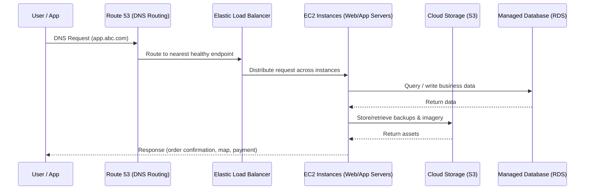

# Cloud Computing for ABC Enterprise: Key Contributions to Business Automation
*CCF501 Cloud Computing Fundamentals - Assessment 1 Report*

## Executive Summary
Cloud computing has become a core business utility — email, storage, and smart devices all run on someone else's infrastructure, delivered on demand (Nishimura, 2022). For ABC Enterprise, this model translated directly into results: start-up IT costs dropped by ~80% and the platform absorbed a 10x customer surge within a month, without a matching increase in headcount (Eliaçık, 2022; McHaney, 2021). This report outlines three key benefits of cloud adoption, the main challenges to manage, and a practical recommendation for service model, deployment model, cost model, and cloud provider. Where ABC needs a provider beyond "XYZ", AWS is recommended for its maturity, global reach, and automation-ready managed services (Amazon Web Services, n.d.).

## 1. Benefits of Cloud Computing vs. Traditional IT Infrastructure
Traditional IT means owning everything — servers, cooling, procurement cycles, and the staff to keep it running (McHaney, 2021). For a high-growth start-up like ABC, that model is a strategic handicap. Cloud flips it: instead of buying capacity, ABC rents capability, aligned to the NIST essential characteristics of on‑demand self‑service, measured service, rapid elasticity, and resource pooling (Mell & Grance, 2011).

### 1.1 Cost Efficiency and Pay-as-you-grow Model
Cloud shifts spend from CAPEX to OPEX — no upfront servers, no idle hardware costs (Eliaçık, 2022). ABC's ~80% reduction in start-up IT costs is the "measured service" characteristic in action: pay for compute-hours, storage GB-months, and data transfer actually consumed (Mell & Grance, 2011). As McHaney (2021) notes, operational overhead — personnel, training, upgrades, and security — often exceeds hardware cost over time, making pay-as-you-go a structural advantage. Beyond the bill, standard tasks like patching, backups, and scaling can be codified and automated, reducing human toil across the delivery pipeline (Accenture Technology, 2020).

*Figure 1: ABC Enterprise cloud traffic flow — from user request through Route 53, load balancing, compute, storage, and database layers.*

### 1.2 Rapid Scalability for Business Growth
A 10x customer surge in a single month exposes the core weakness of on-premises infrastructure: procurement lead times mean hardware arrives after the opportunity has passed (McHaney, 2021). Cloud's rapid elasticity lets ABC scale compute up during campaigns or city launches and scale down when demand normalises — automatically, not reactively (Mell & Grance, 2011). Eliaçık (2022) highlights that this "endless scalability" protects against outages from traffic spikes, keeping latency low and availability high. For an app handling delivery, taxi bookings, and payments, that's not a nice-to-have — it's a retention strategy.

### 1.3 Reduced IT Management Overhead
In on-premises environments, more customers means more infrastructure, which means more people to maintain it (McHaney, 2021). Cloud breaks that linear relationship. Through resource pooling and virtualisation, providers consolidate physical resources across tenants — Manvi and Shyam (2021) describe this as partitioning, isolation, and consolidation that allows multiple workloads to share hardware without interference. ABC borrows that operational maturity: automated maintenance, managed monitoring, and resilient architectures that would be expensive to replicate in-house (Accenture Technology, 2020).

## 2. Challenges and Mitigation Strategies
Cloud adoption is not risk-free. Three challenges are most relevant for ABC (Eliaçık, 2022):

**Security and privacy:** ABC handles payments and customer PII. Eliaçık (2022) notes that entrusting sensitive data to a third party means breaches may not be detected immediately. Mitigation: least privilege IAM, mandatory MFA, encryption at rest/in transit, and continuous alerting. The shared responsibility model means the provider secures the cloud infrastructure — ABC must secure what it deploys on top.

**Cost volatility:** Pay-as-you-go can spiral without guardrails — overprovisioned instances and excessive egress generate surprise bills (Bittok, 2022). Mitigation: FinOps habits from day one — resource tagging, budget alerts, rightsizing, and reserved pricing for stable workloads.

**Vendor lock-in and skills gap:** Deeper managed-service adoption makes provider migration expensive (Eliaçık, 2022), and cloud requires a different operating mindset — infrastructure-as-code, monitoring-first, shared responsibility (McHaney, 2021). Mitigation: prioritise portability (containers, standard databases) and invest in targeted upskilling. Manvi and Shyam (2021) highlight that chain dependency in virtualised environments is a key risk teams must understand to operate effectively.

## 3. Recommended Cloud Models for ABC Enterprise
Cloud service models span a control-vs-responsibility spectrum (McHaney, 2021): IaaS ("leasing a car" — full flexibility, full maintenance responsibility), PaaS ("taking a taxi" — managed platform, focus on code), and SaaS ("taking the bus" — fully managed, minimal control). Deployment models range from public cloud (shared infrastructure, maximum scalability) to private (dedicated, more control, higher cost) and hybrid (mix of both for regulatory or legacy needs) (McHaney, 2021; Nishimura, 2022).

**Recommendation:** Public cloud deployment with a blended IaaS/PaaS service model. ABC should use IaaS for core compute where flexibility matters and PaaS for managed databases, load balancing, autoscaling, and serverless jobs — capturing automation and elasticity benefits without rebuilding operational maturity from scratch (Accenture Technology, 2020).

## 4. Recommended Cost Model
Cloud providers offer three levers: pay-as-you-go (maximum flexibility, highest unit price), reserved/committed pricing (discounts for baseline commitments), and spot/preemptible (deep discounts for interruption-tolerant workloads) (Bittok, 2022; Amazon Web Services, n.d.-b).

**Recommendation:** A hybrid cost model — reserved capacity for stable customer-facing tiers (web/app, databases), pay-as-you-go autoscaling for demand spikes, and spot instances for background jobs and analytics pipelines. TCO modelling should include not just cloud fees but also migration cost, security tooling, and engineering effort (Bittok, 2022). As Bittok (2022) notes, cloud adoption is rarely about the cheapest bill — it's about better ROI: less downtime, faster launches, and automation that avoids linear headcount growth.

## 5. Cloud Provider Recommendation: AWS
The realistic shortlist is AWS, Azure, or GCP. All three cover the technical baseline, but differentiate by ecosystem strength (Nishimura, 2022). AWS is the strongest fit for ABC: the scenario already references Route 53 (an AWS service), implying existing AWS-aligned architecture patterns. AWS pioneered affordable cloud infrastructure for start-ups — S3 and EC2 launched in 2006 — and offers the broadest managed-service catalogue for automation (Nishimura, 2022; Amazon Web Services, n.d.-a).

Two essential AWS elements for ABC's automation requirements:

1) **Elastic Load Balancing + Auto Scaling** — keeps the app responsive during demand surges by distributing traffic and scaling instances automatically, directly implementing rapid elasticity (Mell & Grance, 2011; Amazon Web Services, n.d.-a).

2) **AWS Lambda** — serverless compute for event-driven automation: order events, payment webhooks, image processing, notifications. No servers to manage; costs align with actual execution (Amazon Web Services, n.d.-b). Together, these turn operational workflows into policy-driven, event-driven systems — reusable, modular services consistent with SOA principles (McHaney, 2021).

## 6. Conclusion
Cloud computing is the right strategic move for ABC: measured service, rapid elasticity, and resource pooling (Mell & Grance, 2011) directly translate into business automation outcomes — scaling without procurement delays, operations without linear headcount growth, and faster time-to-market (Accenture Technology, 2020). The recommended stack is public cloud deployment, blended IaaS/PaaS service model, hybrid cost model, and AWS as provider. Managed well, ABC's infrastructure stops being a bottleneck and becomes a competitive advantage — scaling as far as product-market fit allows (Eliaçık, 2022).

## References
Accenture Technology. (2020, June 5). *Why cloud matters* [Video]. YouTube. https://www.youtube.com/watch?v=p1Nr03gtkyU

Amazon Web Services. (n.d.-a). *AWS Well-Architected Framework.* https://aws.amazon.com/architecture/well-architected/

Amazon Web Services. (n.d.-b). *AWS Pricing.* https://aws.amazon.com/pricing/

Bittok, T. (2022, January 22). *Cloud total cost of ownership.* LinkedIn Pulse. https://www.linkedin.com/pulse/cloud-total-cost-ownership-theophilus-bittok/

Eliaçık, E. (2022). *The good, bad, and ugly sides of cloud computing.* Dataconomy. https://dataconomy.com/2022/05/pros-and-cons-of-cloud-computing-2022/

Manvi, S., & Shyam, G. K. (2021). *Cloud computing: Concepts and technologies* (Chapter 4). CRC Press. https://learning-oreilly-com.torrens.idm.oclc.org/library/view/cloud-computing/9781000338058/

McHaney, R. (2021). *Cloud technologies: An overview of cloud computing technologies for managers.* Wiley. https://ieeexplore-ieee-org.torrens.idm.oclc.org/servlet/opac?bknumber=9820907

Mell, P., & Grance, T. (2011). *The NIST definition of cloud computing* (Special Publication 800-145). National Institute of Standards and Technology. https://doi.org/10.6028/NIST.SP.800-145

Nishimura, H. (2022, August 30). *Introduction to AWS for non-engineers: 1 cloud concepts* [Video]. LinkedIn Learning. https://www.linkedin.com/learning/introduction-to-aws-for-non-engineers-1-cloud-concepts-2/

Rahman, M. S., & Raza, M. (2021). Cloud computing security challenges and its potential solution. *International Journal of Computer Applications, 174*(6), 29–33. https://doi.org/10.5120/ijca2021921167

Singh, S., & Chana, I. (2016). Cloud resource provisioning: Survey, status and future research directions. *Knowledge and Information Systems, 49*(3), 1005–1069. https://doi.org/10.1007/s10115-016-0922-3
