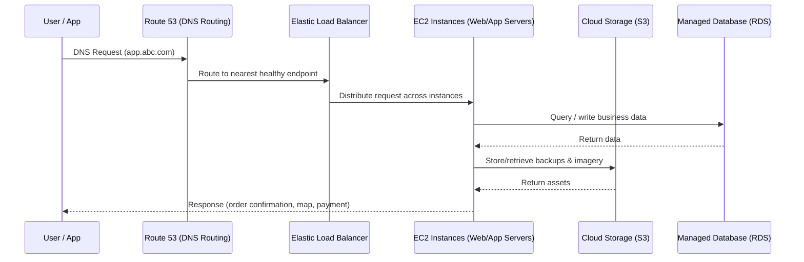
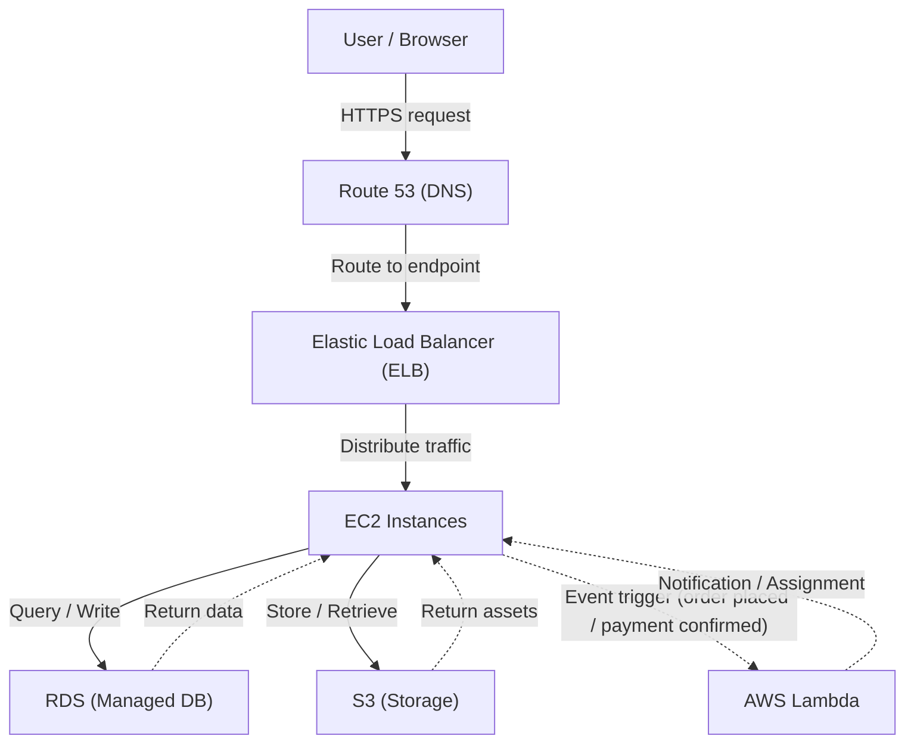

# Cloud Computing for ABC Enterprise: Key Contributions to Business Automation
*CCF501 Cloud Computing Fundamentals - Assessment 1 Report*

## 1. Executive Summary
Cloud computing has become a core business utility - email, storage, and smart devices all run on someone else's infrastructure, delivered on demand (Nishimura, 2022). For ABC Enterprise from our case study, this model translated directly into results: start-up IT costs dropped by ~80% and the platform absorbed a 10x customer surge within a month, without a matching increase in headcount (Eliaçık, 2022; McHaney, 2021). This report outlines three key benefits of cloud adoption, the main challenges to manage, and a practical recommendation for service model, deployment model, cost model, and cloud provider. Where ABC needs a provider beyond "XYZ", AWS is recommended for its maturity, global reach, and automation-ready managed services (Amazon Web Services, n.d.).

## 2. Benefits of Cloud Computing vs. Traditional IT Infrastructure
Traditional IT means owning everything - servers, cooling, procurement cycles, and the staff to keep it running (McHaney, 2021). For a high-growth start-up like ABC, that model is a strategic handicap. Cloud flips it: instead of buying capacity, ABC rents capability, aligned to the NIST essential characteristics of on‑demand self‑service, measured service, rapid elasticity, and resource pooling (Mell & Grance, 2011).

### 2.1 Cost Efficiency and Pay-as-you-grow Model
Cloud shifts spend from CAPEX to OPEX - no upfront servers, no idle hardware costs (Eliaçık, 2022). ABC's ~80% reduction in start-up IT costs is the "measured service" characteristic in action: pay for compute-hours, storage GB-months, and data transfer actually consumed (Mell & Grance, 2011). As McHaney (2021) notes, operational overhead - personnel, training, upgrades, and security - often exceeds hardware cost over time, making pay-as-you-go a structural advantage. Beyond the bill, standard tasks like backups, patching, and scaling can be codified and automated, reducing human toil across the delivery pipeline (Accenture Technology, 2020; Carpenter, 2020). Figure 1 illustrates ABC's end-to-end request flow across the AWS stack.

```mermaid
sequenceDiagram
    participant U as User / App
    participant R53 as Route 53 (DNS Routing)
    participant ELB as Elastic Load Balancer
    participant EC2 as EC2 Instances (Web/App Servers)
    participant S3 as Cloud Storage (S3)
    participant DB as Managed Database (RDS)

    U->>R53: DNS Request (app.abc.com)
    R53->>ELB: Route to nearest healthy endpoint
    ELB->>EC2: Distribute request across instances
    EC2->>DB: Query / write business data
    DB-->>EC2: Return data
    EC2->>S3: Store/retrieve backups & imagery
    S3-->>EC2: Return assets
    EC2-->>U: Response (order confirmation, map, payment)
```
*Figure 1: ABC Enterprise cloud traffic flow — from user request through Route 53, load balancing, compute, storage, and database layers.*

### 2.2 Rapid Scalability for Business Growth
A 10x customer surge in a single month exposes the core weakness of on-premises infrastructure: procurement lead times mean hardware arrives after the opportunity has passed (McHaney, 2021). Cloud's rapid elasticity lets ABC scale compute up during campaigns or city launches and scale down when demand normalizes - automatically, not reactively (Mell & Grance, 2011). Eliaçık (2022) highlights that this "endless scalability" protects against outages from traffic spikes, keeping latency low and availability high. For an app handling delivery, taxi bookings, and payments, that's not a `nice-to-have` - it's a retention strategy.

### 2.3 Reduced IT Management Overhead
In on-premises environments, more customers mean more infrastructure, which means more people to maintain it (McHaney, 2021). Cloud breaks that linear relationship. Through resource pooling and virtualization, providers consolidate physical resources across tenants - Manvi and Shyam (2021) describe this as partitioning, isolation, and consolidation that allows multiple workloads to share hardware without interference. ABC borrows that operational maturity: automated maintenance, managed monitoring, and resilient architectures that would be expensive to replicate in-house (Accenture Technology, 2020; Naved et al., 2022).

## 3. Challenges and Mitigation Strategies
Cloud adoption is not risk-free. Three challenges are most relevant for ABC (Eliaçık, 2022):

### 1. **Security and privacy:**
ABC handles payments and customer PII. Security is the top concern for cloud adopters — 90% of security professionals cite it as a challenge, alongside governance (71%) and compliance (68%) (Manvi & Shyam, 2021). Eliaçık (2022) notes that entrusting sensitive data to a third party means breaches may not be detected immediately. Mitigation: least privilege IAM, mandatory MFA, encryption at rest/in transit, and continuous alerting. The shared responsibility model clarifies the division: the provider secures the cloud infrastructure — ABC secures what it deploys on top (Shore, 2020).

### 2. **Cost volatility:** 
Pay-as-you-go can spiral without guardrails - overprovisioned instances and excessive egress generate surprise bills (Bittok, 2022). Mitigation: FinOps habits from day one: budget alerts, resource tagging, rightsizing, and reserved pricing for stable workloads.

### 3. **Vendor lock-in and skills gap:** 
Deeper managed-service adoption makes provider migration expensive (Eliaçık, 2022), and cloud requires a different operating mindset - infrastructure-as-code, monitoring-first, shared responsibility (McHaney, 2021). Mitigation: prioritize portability (containers, standard databases) and invest in targeted upskilling. Manvi and Shyam (2021) note that chain dependency in virtualized environments is a key operational risk.

## 4. Recommended Cloud Models for ABC Enterprise
Cloud service models sit on a control-versus-responsibility spectrum (IBM, n.d.-a; Linthicum, 2021; McHaney, 2021). IaaS gives ABC full flexibility over compute and configuration, but it also means managing operating systems and scaling policies. PaaS reduces that burden by abstracting infrastructure management, allowing the team to focus on building and improving the application itself. SaaS, while efficient, offers limited customization and is therefore less appropriate for a start-up that must differentiate its digital platform.

Deployment models also affect scalability and automation. NIST's fourth model — community cloud, shared among sector-specific organisations — does not apply to ABC's consumer platform (Manvi & Shyam, 2021). Private cloud increases control but sacrifices elasticity and cost efficiency. Hybrid cloud can support cloud bursting and workload portability, yet introduces architectural complexity that exceeds ABC's current operational maturity (Manvi & Shyam, 2021). For ABC — public cloud is the most strategically aligned option: Gartner data shows IaaS workloads experience 60% fewer security incidents than traditional data centres (IBM, n.d.-b), with the scalability and automation ABC requires (Mell & Grance, 2011; Nishimura, 2022) (see Table 1).

| Deployment Model | Cost | Elasticity | ABC Fit |
| --- | --- | --- | --- |
| Public Cloud | Low — OPEX only | High — Auto Scaling | ✅ Recommended |
| Private Cloud | High — CAPEX + ops staff | Limited — fixed capacity | ❌ Over-engineered for start-up |
| Hybrid Cloud | Medium — dual infrastructure | Moderate — complex to manage | ⚠️ Premature for current maturity |

*Table 1: Deployment model trade-offs for ABC Enterprise.*

**Recommendation:** A blended IaaS/PaaS approach — IaaS for compute flexibility, PaaS for managed databases, load balancing, and serverless functions — preserves rapid elasticity and measured service (Mell & Grance, 2011) without rebuilding operational maturity from scratch (Accenture Technology, 2020). A Virtual Private Cloud (VPC) can address future network isolation needs (IBM, n.d.-c).

## 5. Recommended Cost Model
Cloud providers offer three levers: 
### 1. Pay-as-you-go (maximum flexibility, highest unit price), 
### 2. Reserved/committed pricing (discounts for baseline commitments), 
### 3. Spot/preemptible (deep discounts for interruption-tolerant workloads) (Bittok, 2022; Amazon Web Services, n.d.-b). 

**Recommendation:** A hybrid cost model - reserved capacity for stable customer-facing tiers (web/app, databases), pay-as-you-go autoscaling for demand spikes, and spot instances for background jobs and analytics pipelines. TCO modelling should include not just cloud fees but also migration cost, security tooling, and engineering effort (Bittok, 2022). As Bittok (2022) notes, cloud adoption is rarely about the cheapest bill - it's about better ROI: less downtime, faster launches, and automation that avoids linear headcount growth.

## 6. Cloud Provider Recommendation: AWS
Azure suits Microsoft-aligned enterprises; GCP leads in analytics. AWS best fits ABC: Route 53 already anchors the described architecture, and AWS offers the broadest automation-ready managed-service catalogue (Nishimura, 2022; Amazon Web Services, n.d.-a) (see Table 2).

| Provider | Ecosystem Fit | Load Balancing | Serverless | ABC Alignment |
| --- | --- | --- | --- | --- |
| AWS | Broadest managed-service catalogue | ELB — native Route 53 integration | Lambda — event-driven, zero idle cost | ✅ Best fit — Route 53 in stack |
| Azure | Microsoft / enterprise-aligned | Application Gateway — extra config | Azure Functions — separate ecosystem | ⚠️ No Microsoft signals in ABC |
| GCP | Analytics and ML-first | Cloud Load Balancing — GKE-oriented | Cloud Run / Functions — container-first | ❌ No analytics-heavy workloads yet |

*Table 2: Cloud provider comparison for ABC Enterprise.*

### 1. Elastic Load Balancing (ELB)
Automates traffic routing and health-checks across EC2 instances without operator intervention — critical for ABC's delivery and taxi services where latency causes churn. ELB integrates natively with Route 53 and Auto Scaling already in ABC's stack (Amazon Web Services, n.d.).

### 2. Auto Scaling
Provisions or terminates EC2 instances based on demand signals, directly implementing NIST's rapid elasticity (Mell & Grance, 2011). The 10x surge required no manual intervention because capacity becomes policy-driven, not operator-driven — a fundamental shift from traditional IT (Amazon Web Services, n.d.).

### 3. AWS Lambda
Event-driven compute for ABC's workflow automation: order placed → delivery assigned; payment confirmed → restaurant notified. Lambda requires no server management and scales to zero when idle, charging only per invocation (Amazon Web Services, n.d.; McHaney, 2021).

## 7. Conclusion
Cloud computing is the right strategic move for ABC: measured service, rapid elasticity, and resource pooling (Mell & Grance, 2011) translate directly into automation outcomes — scaling without procurement delays, zero headcount growth, faster time-to-market (Accenture Technology, 2020). Recommended stack: public cloud, blended IaaS/PaaS, hybrid cost model, AWS. Managed well, ABC's infrastructure stops being a bottleneck and becomes a competitive advantage (Eliaçık, 2022).

## 8. Appendices

### Appendix A - Cloud vs Traditional IT Comparison Table
| Dimension | Traditional IT | Cloud (ABC Case) |
| ---- | ---- | ---- |
| Cost model | CAPEX heavy | OPEX elastic |
| Scaling | Hardware procurement | Auto Scaling | 
| Deployment speed | Weeks/months | Minutes |
| Automation | Manual ops | Policy-driven |

### Appendix B – High-Level Architecture Diagram

```mermaid
graph TD
    A["User / Browser"] -->|"HTTPS request"| B["Route 53 (DNS)"]
    B -->|"Route to endpoint"| C["Elastic Load Balancer (ELB)"]
    C -->|"Distribute traffic"| D["EC2 Instances"]
    D -->|"Query / Write"| E["RDS (Managed DB)"]
    E -.->|"Return data"| D
    D -->|"Store / Retrieve"| F["S3 (Storage)"]
    F -.->|"Return assets"| D
    D -.->|"Event trigger (order placed / payment confirmed)"| G["AWS Lambda"]
    G -.->|"Notification / Assignment"| D
```

*Figure 2: ABC Enterprise high-level cloud architecture on AWS — replace with generated image (Nano Banana #1).*

### Appendix C – Cost Model Breakdown Example
| Cost Category | On-Prem | Cloud |
| ---- | ---- | ---- |
| Hardware | High upfront | None | 
| Maintenance | Internal team | Managed |
| Scaling | Hardware purchase | Auto scaling |
| Downtime cost | High | Reduced |

### Appendix D – Shared Responsibility Model Diagram

| Cloud Provider secures | ABC secures |
| ------ | ------ |
| Physical infra | IAM |
| Networking | Applications |
| Hypervisor | Data governance |

### Appendix E — NIST Five Essential Characteristics Mapped to ABC

| NIST Characteristic | ABC Use Case | AWS Service |
| --- | --- | --- |
| On-Demand Self-Service | Dev team provisions EC2 and RDS instances via console — no vendor call required | EC2, RDS, S3 |
| Broad Network Access | App accessible via mobile, browser, and API across delivery and taxi service regions | Route 53, CloudFront |
| Resource Pooling | ABC shares AWS physical hardware; workloads logically isolated per tenant via VPC | VPC, EC2 |
| Rapid Elasticity | 10× customer surge absorbed automatically — no procurement delay or manual intervention | Auto Scaling |
| Measured Service | ~80% reduction in start-up IT costs — pay only for compute-hours and GB-months consumed | AWS Cost Explorer, CloudWatch |

*Table 3: NIST essential cloud characteristics mapped to ABC Enterprise (Mell & Grance, 2011) — replace with generated image (Nano Banana #2).*

### Appendix F – Glossary of Terms

| Term | Meaning |
| ---- | ---- |
| CAPEX | Capital Expenditure |
| OPEX | Operational Expenditure |
| IAM | Identity and Access Management |
| TCO | Total Cost of Ownership |
| SOA | Service-Oriented Architecture |
| PaaS | Platform as a Service |
| IaaS | Infrastructure as a Service |
| SaaS | Software as a Service |

*Table 4: Glossary of Terms*

## References
Accenture Technology. (2020, June 5). *Why cloud matters* [Video]. YouTube. https://www.youtube.com/watch?v=p1Nr03gtkyU

Amazon Web Services. (n.d.-a). *AWS Well-Architected Framework.* https://aws.amazon.com/architecture/well-architected/

Amazon Web Services. (n.d.-b). *AWS Pricing.* https://aws.amazon.com/pricing/

Bittok, T. (2022, January 22). *Cloud total cost of ownership.* LinkedIn Pulse. https://www.linkedin.com/pulse/cloud-total-cost-ownership-theophilus-bittok/

Carpenter, T. (2020, May 27). *AWS Certified Solutions Architect – Associate (SAA-C02) Cert Prep 1: Cloud services overview* [Video]. LinkedIn Learning. https://www.linkedin.com/learning/aws-certified-solutions-architect-associate-saa-c02-cert-prep-1-cloud-services-overview/benefits-of-cloud-computing

Eliaçık, E. (2022). *The good, bad, and ugly sides of cloud computing.* Dataconomy. https://dataconomy.com/2022/05/pros-and-cons-of-cloud-computing-2022/

IBM. (n.d.-a). *SaaS, PaaS, IaaS explained.* IBM Cloud. https://www.ibm.com/cloud/learn/iaas-paas-saas

IBM. (n.d.-b). *What is a public cloud?* IBM. https://www.ibm.com/think/topics/public-cloud

IBM. (n.d.-c). *What is private cloud?* IBM. https://www.ibm.com/think/topics/private-cloud

Linthicum, D. (2021). *Learning cloud computing: Core concepts* [Video]. LinkedIn Learning. https://www.linkedin.com/learning/learning-cloud-computing-core-concepts-13966302/overview-of-cloud-computing

Manvi, S., & Shyam, G. K. (2021). *Cloud computing: Concepts and technologies* (Chapter 4). CRC Press. https://learning-oreilly-com.torrens.idm.oclc.org/library/view/cloud-computing/9781000338058/

McHaney, R. (2021). *Cloud technologies: An overview of cloud computing technologies for managers.* Wiley. https://ieeexplore-ieee-org.torrens.idm.oclc.org/servlet/opac?bknumber=9820907

Mell, P., & Grance, T. (2011). *The NIST definition of cloud computing* (Special Publication 800-145). National Institute of Standards and Technology. https://doi.org/10.6028/NIST.SP.800-145

Naved, M., Sanchez, D. T., Dela Cruz, A. P., Jr., Peconcillo, L. B., Jr., Peteros, E. D., & Tenerife, J. J. L. (2022). Identifying the role of cloud computing technology in management of educational institutions. *Materials Today: Proceedings, 51*(8), 2309–2312. https://doi.org/10.1016/j.matpr.2021.11.414

Nishimura, H. (2022, August 30). *Introduction to AWS for non-engineers: 1 cloud concepts* [Video]. LinkedIn Learning. https://www.linkedin.com/learning/introduction-to-aws-for-non-engineers-1-cloud-concepts-2/

Rahman, M. S., & Raza, M. (2021). Cloud computing security challenges and its potential solution. *International Journal of Computer Applications, 174*(6), 29–33. https://doi.org/10.5120/ijca2021921167

Shore, J. (2020). *Cybersecurity with cloud computing: Service models* [Video]. LinkedIn Learning. https://www.linkedin.com/learning/cybersecurity-with-cloud-computing-service-models

Singh, S., & Chana, I. (2016). Cloud resource provisioning: Survey, status and future research directions. *Knowledge and Information Systems, 49*(3), 1005–1069. https://doi.org/10.1007/s10115-016-0922-3
