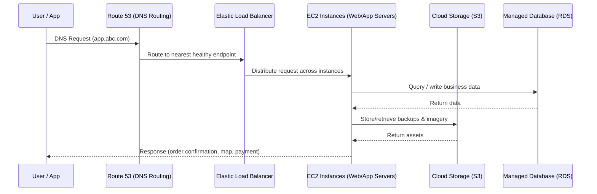
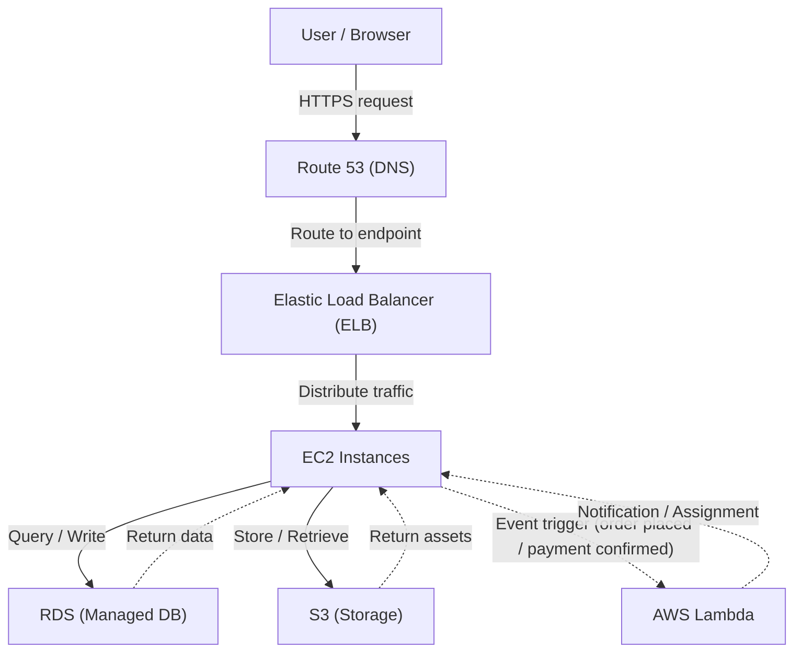

# Cloud Computing for ABC Enterprise: Key Contributions to Business Automation
*CCF501 Cloud Computing Fundamentals - Assessment 1 Report*

## 1. Executive Summary
Cloud computing has become a core business utility - email, storage, and smart devices all run on someone else's infrastructure, delivered on demand (Nishimura, 2022). For ABC Enterprise from our case study, this model translated directly into results: start-up IT costs dropped by ~80% and the platform absorbed a 10x customer surge within a month, without a matching increase in headcount (Eliaçık, 2022; McHaney, 2021). This report outlines three key benefits of cloud adoption, the main challenges to manage, and a practical recommendation for service model, deployment model, cost model, and cloud provider. Where ABC needs a provider beyond "XYZ", AWS is recommended for its maturity, global reach, and automation-ready managed services (Amazon Web Services, n.d.-a).

## 2. Benefits of Cloud Computing vs. Traditional IT Infrastructure
Traditional IT means owning servers, cooling, and the staff to keep it running (McHaney, 2021). For a high-growth start-up like ABC, that model is a strategic handicap. Cloud flips it: instead of buying capacity, ABC rents capability, aligned to the NIST characteristics of on-demand self-service, measured service, rapid elasticity, and resource pooling (Mell & Grance, 2011).

### 2.1 Cost Efficiency and Pay-as-you-grow Model
Cloud shifts spend from CAPEX to OPEX - no upfront servers, no idle hardware costs (Eliaçık, 2022). ABC's ~80% reduction in start-up IT costs is the "measured service" characteristic in action: pay for compute-hours, storage GB-months, and data transfer actually consumed (Mell & Grance, 2011). As McHaney (2021) notes, operational overhead - personnel, training, upgrades, and security - often exceeds hardware cost over time, making pay-as-you-go a structural advantage. Beyond the bill, standard tasks like backups, patching, and scaling can be codified and automated, reducing human toil across the delivery pipeline (Carpenter, 2020).

```mermaid
sequenceDiagram
    participant U as User / App
    participant R53 as Route 53 (DNS Routing)
    participant ELB as Elastic Load Balancer
    participant EC2 as EC2 Instances (Web/App Servers)
    participant S3 as Cloud Storage (S3)
    participant DB as Managed Database (RDS)

    U->>R53: DNS Request (app.abc.com)
    R53->>ELB: Route to nearest healthy endpoint
    ELB->>EC2: Distribute request across instances
    EC2->>DB: Query / write business data
    DB-->>EC2: Return data
    EC2->>S3: Store/retrieve backups & imagery
    S3-->>EC2: Return assets
    EC2-->>U: Response (order confirmation, map, payment)
```
*Figure 1: ABC Enterprise cloud traffic flow — from user request through Route 53, load balancing, compute, storage, and database layers.*

### 2.2 Rapid Scalability for Business Growth
A 10x customer surge in a single month exposes the core weakness of on-premises infrastructure: procurement lead times mean hardware arrives after the opportunity has passed (McHaney, 2021). Cloud's rapid elasticity lets ABC scale compute up during campaigns or city launches and scale down when demand normalizes - automatically, not reactively (Mell & Grance, 2011). Eliaçık (2022) highlights that this scalability protects against outages from traffic spikes — critical for an app handling delivery, taxi bookings, and payments.

### 2.3 Reduced IT Management Overhead
In on-premises environments, more customers mean more infrastructure and more staff to maintain it (McHaney, 2021). Cloud breaks that linear relationship. Through resource pooling, providers consolidate physical resources across tenants — Manvi and Shyam (2021) describe this as partitioning and isolation that allows multiple workloads to share hardware. ABC gains automated maintenance and resilient architectures that would be expensive to replicate in-house (Naved et al., 2022).

## 3. Challenges and Mitigation Strategies
Cloud adoption is not risk-free. Three challenges are most relevant for ABC (Eliaçık, 2022):

### 1. **Security and privacy:**
ABC handles payments and customer PII. Security is the top concern for cloud adopters — 90% of security professionals cite it as a challenge, alongside governance (71%) and compliance (68%) (Manvi & Shyam, 2021). Mitigation: least privilege IAM, mandatory MFA, encryption at rest/in transit, and continuous alerting — the shared responsibility model clarifies the provider/customer division (Shore, 2020).

### 2. **Cost volatility:** 
Pay-as-you-go can spiral without guardrails - overprovisioned instances and excessive egress generate surprise bills (Bittok, 2022). Mitigation: FinOps habits from day one: budget alerts, resource tagging, rightsizing, and reserved pricing for stable workloads.

### 3. **Vendor lock-in and skills gap:** 
Deeper managed-service adoption makes provider migration expensive (Eliaçık, 2022). Mitigation: prioritize portability (containers, standard databases) and invest in targeted upskilling (McHaney, 2021).

## 4. Recommended Cloud Models for ABC Enterprise
Cloud service models sit on a control-versus-responsibility spectrum (IBM, n.d.-a; Linthicum, 2021; McHaney, 2021). IaaS provides full compute flexibility; PaaS abstracts infrastructure so the team can focus on development; SaaS offers limited customisation — less suited to a start-up that must differentiate its platform.

Deployment models vary in elasticity and cost. Community cloud does not apply to ABC's consumer use case. Private cloud sacrifices elasticity; hybrid introduces complexity that exceeds ABC's current maturity (Manvi & Shyam, 2021). Public cloud is the most strategically aligned option: IBM (n.d.-b) reports IaaS workloads experience 60% fewer security incidents than traditional data centers (see Table 1).

| Deployment Model | Cost | Elasticity | ABC Fit |
| --- | --- | --- | --- |
| Public Cloud | Low — OPEX only | High — Auto Scaling | ✅ Recommended |
| Private Cloud | High — CAPEX + ops staff | Limited — fixed capacity | ❌ Over-engineered for start-up |
| Hybrid Cloud | Medium — dual infrastructure | Moderate — complex to manage | ⚠️ Premature for current maturity |

*Table 1: Deployment model trade-offs for ABC Enterprise.*

**Recommendation:** A blended IaaS/PaaS approach — IaaS for compute flexibility, PaaS for managed databases and serverless functions — preserves rapid elasticity and measured service (Mell & Grance, 2011). A Virtual Private Cloud (VPC) can address future network isolation needs (IBM, n.d.-c).

## 5. Recommended Cost Model
Cloud providers offer three levers: 
### 1. Pay-as-you-go (maximum flexibility, highest unit price), 
### 2. Reserved/committed pricing (discounts for baseline commitments), 
### 3. Spot/preemptible (deep discounts for interruption-tolerant workloads) (Bittok, 2022; Amazon Web Services, n.d.-b). 

**Recommendation:** A hybrid cost model - reserved capacity for stable customer-facing tiers (web/app, databases), pay-as-you-go autoscaling for demand spikes, and spot instances for background jobs and analytics pipelines. TCO modelling should include not just cloud fees but also migration cost, security tooling, and engineering effort (Bittok, 2022). As Bittok (2022) notes, cloud adoption is rarely about the cheapest bill - it's about better ROI: less downtime, faster launches, and automation that avoids linear headcount growth.

## 6. Cloud Provider Recommendation: AWS
Azure suits Microsoft-aligned enterprises; GCP leads in analytics. AWS best fits ABC: Route 53 already anchors the described architecture, and AWS offers the broadest automation-ready managed-service catalogue (Nishimura, 2022; Amazon Web Services, n.d.-a) (see Table 2).

| Provider | Ecosystem Fit | Load Balancing | Serverless | ABC Alignment |
| --- | --- | --- | --- | --- |
| AWS | Broadest managed-service catalogue | ELB — native Route 53 integration | Lambda — event-driven, zero idle cost | ✅ Best fit — Route 53 in stack |
| Azure | Microsoft / enterprise-aligned | Application Gateway — extra config | Azure Functions — separate ecosystem | ⚠️ No Microsoft signals in ABC |
| GCP | Analytics and ML-first | Cloud Load Balancing — GKE-oriented | Cloud Run / Functions — container-first | ❌ No analytics-heavy workloads yet |

*Table 2: Cloud provider comparison for ABC Enterprise.*

### 1. Elastic Load Balancing (ELB)
Automates traffic routing and health-checks across EC2 instances — critical for ABC's latency-sensitive services. Integrates natively with Route 53 and Auto Scaling (Amazon Web Services, n.d.-a).

### 2. Auto Scaling
Provisions or terminates EC2 instances on demand signals, directly implementing NIST's rapid elasticity (Mell & Grance, 2011). The 10x surge required no manual intervention — capacity becomes policy-driven, not operator-driven (Amazon Web Services, n.d.-a).

### 3. AWS Lambda
Event-driven compute for ABC's workflow automation: order placed → delivery assigned; payment confirmed → restaurant notified. Scales to zero when idle, charging only per invocation (Amazon Web Services, n.d.-a).

## 7. Conclusion
Cloud computing is the right strategic move for ABC: measured service, rapid elasticity, and resource pooling (Mell & Grance, 2011) translate directly into automation outcomes — scaling without procurement delays, zero headcount growth, faster time-to-market. Recommended stack: public cloud, blended IaaS/PaaS, hybrid cost model, AWS. Managed well, ABC's infrastructure stops being a bottleneck and becomes a competitive advantage (Eliaçık, 2022).

## 8. Appendices

### Appendix A - Cloud vs Traditional IT Comparison Table
| Dimension | Traditional IT | Cloud (ABC Case) |
| ---- | ---- | ---- |
| Cost model | CAPEX heavy | OPEX elastic |
| Scaling | Hardware procurement | Auto Scaling | 
| Deployment speed | Weeks/months | Minutes |
| Automation | Manual ops | Policy-driven |

*Table 3 – Cloud vs Traditional IT Comparison.*

### Appendix B – High-Level Architecture Diagram

```mermaid
graph TD
    A["User / Browser"] -->|"HTTPS request"| B["Route 53 (DNS)"]
    B -->|"Route to endpoint"| C["Elastic Load Balancer (ELB)"]
    C -->|"Distribute traffic"| D["EC2 Instances"]
    D -->|"Query / Write"| E["RDS (Managed DB)"]
    E -.->|"Return data"| D
    D -->|"Store / Retrieve"| F["S3 (Storage)"]
    F -.->|"Return assets"| D
    D -.->|"Event trigger (order placed / payment confirmed)"| G["AWS Lambda"]
    G -.->|"Notification / Assignment"| D
```

*Figure 2: ABC Enterprise high-level cloud architecture on AWS*

### Appendix C – Cost Model Breakdown Example
| Cost Category | On-Prem | Cloud |
| ---- | ---- | ---- |
| Hardware | High upfront | None | 
| Maintenance | Internal team | Managed |
| Scaling | Hardware purchase | Auto scaling |
| Downtime cost | High | Reduced |

*Table 4 – Cost Model Breakdown.*

### Appendix D – Shared Responsibility Model Diagram

| Cloud Provider secures | ABC secures |
| ------ | ------ |
| Physical infra | IAM |
| Networking | Applications |
| Hypervisor | Data governance |

*Table 5 – Shared Responsibility Model.*

### Appendix E — NIST Five Essential Characteristics Mapped to ABC

| NIST Characteristic | ABC Use Case | AWS Service |
| --- | --- | --- |
| On-Demand Self-Service | Dev team provisions EC2 and RDS instances via console — no vendor call required | EC2, RDS, S3 |
| Broad Network Access | App accessible via mobile, browser, and API across delivery and taxi service regions | Route 53, CloudFront |
| Resource Pooling | ABC shares AWS physical hardware; workloads logically isolated per tenant via VPC | VPC, EC2 |
| Rapid Elasticity | 10× customer surge absorbed automatically — no procurement delay or manual intervention | Auto Scaling |
| Measured Service | ~80% reduction in start-up IT costs — pay only for compute-hours and GB-months consumed | AWS Cost Explorer, CloudWatch |

*Table 6 – NIST essential cloud characteristics mapped to ABC Enterprise (Mell & Grance, 2011).*

### Appendix F – Cloud Resources Provisioned ("What We Are Hiring")

| AWS Service | Role | Baseline Config | Auto-Scale Ceiling |
|---|---|---|---|
| EC2 (web/app tier) | Serve API requests for all three verticals | 2× t3.medium (2 vCPU, 4 GB RAM) | 20× c5.xlarge (4 vCPU, 8 GB RAM) |
| Auto Scaling | Scale EC2 fleet up/down on demand signals | Policy-driven (CloudWatch triggers) | Absorbed 10× surge with zero manual intervention |
| Elastic Load Balancer (ELB) | Distribute inbound traffic across EC2 fleet | Always-on (hourly charge) | Scales transparently — no manual config |
| RDS (PostgreSQL) | Structured data: orders, rides, payments, users | db.r5.large (2 vCPU, 16 GB) — Multi-AZ | Read replicas added on demand |
| S3 | Receipt storage, media assets, backups | Pay-per-GB — no provisioned minimum | Unlimited (object storage) |
| AWS Lambda | Event-driven workflows: order assignment, payment notifications, driver dispatch | 128 MB / 3s timeout per function | 1,000 concurrent executions (default limit, raisable) |
| Route 53 | DNS routing and health checks | Always-on (per-query billing) | Globally redundant by default |
| VPC | Network isolation — multi-tenant segmentation per vertical | Single VPC with subnet per workload tier | Peering and private endpoints as needed |
| CloudFront | CDN — low-latency delivery of static assets to distributed users | Global edge network (always-on) | Scales to any volume; invalidation on deploy |
| CloudWatch | Monitoring, alerting, autoscale triggers | Always-on (free tier + paid metrics) | Retains 15 months of metrics |
| Cost Explorer | FinOps — cost tracking, rightsizing, usage analysis | Always-on (no provisioning needed) | Validates ~80% cost reduction claim |
| AWS WAF + Shield Standard | Security layer — DDoS mitigation, traffic filtering | Included (Shield Standard free) | Shield Advanced available for high-volume attacks |

*Table 7 – AWS services provisioned for ABC Enterprise — baseline configuration and scaling ceiling.*

### Appendix G – Glossary of Terms

| Term | Meaning |
| ---- | ---- |
| CAPEX | Capital Expenditure |
| OPEX | Operational Expenditure |
| IAM | Identity and Access Management |
| TCO | Total Cost of Ownership |
| SOA | Service-Oriented Architecture |
| PaaS | Platform as a Service |
| IaaS | Infrastructure as a Service |
| SaaS | Software as a Service |
| VPC | Virtual Private Cloud |
| ELB | Elastic Load Balancer |
| EC2 | Elastic Compute Cloud |
| RDS | Relational Database Service |
| Route 53 | AWS DNS service |
| Auto Scaling | AWS service for automatic scaling of compute resources |
| Shared Responsibility Model | Cloud security model defining provider vs customer security obligations |
| Measured Service | Cloud characteristic where resource usage is monitored and billed accordingly |
| Rapid Elasticity | Cloud characteristic allowing resources to scale up/down automatically based on demand |

*Table 8 – Glossary of Terms*

---

## References
Amazon Web Services. (n.d.-a). AWS Well-Architected Framework. https://aws.amazon.com/architecture/well-architected/

Amazon Web Services. (n.d.-b). AWS Pricing. https://aws.amazon.com/pricing/ 

Bittok, T. (2022, January 22). Cloud total cost of ownership. LinkedIn Pulse. https://www.linkedin.com/pulse/cloud-total-cost-ownership-theophilus-bittok-/

Carpenter, T. (2020, May 27). AWS Certified Solutions Architect – Associate (SAA-C02) Cert Prep 1: Cloud services overview. LinkedIn Learning. https://www.linkedin.com/learning/aws-certified-solutions-architect-associate-saa-c02-cert-prep-1-cloud-services-overview/benefits-of-cloud-computing

Eliaçık, E. (2022). Pros and cons of cloud computing. Dataconomy. https://dataconomy.com/2022/05/pros-and-cons-of-cloud-computing-2022/

IBM. (n.d.-a). SaaS, PaaS, IaaS explained. IBM Cloud. https://www.ibm.com/think/topics/iaas-paas-saas

IBM. (n.d.-b). What is a public cloud? IBM. https://www.ibm.com/think/topics/public-cloud 

IBM. (n.d.-c). What is a virtual private cloud (VPC)? IBM. https://www.ibm.com/think/topics/vpc

Linthicum, D. (2021, May 25). Learning cloud computing: Core concepts. LinkedIn Learning. https://www.linkedin.com/learning/learning-cloud-computing-core-concepts-13710481/

Manvi, S., & Shyam, G. K. (2021). Cloud computing: Concepts and technologies (Chapter 4). CRC Press. https://learning-oreilly-com.torrens.idm.oclc.org/library/view/cloud-computing/9781000338058/ 

McHaney, R. (2021). Cloud technologies: An overview of cloud computing technologies for managers. Wiley. https://ieeexplore-ieee-org.torrens.idm.oclc.org/servlet/opac?bknumber=9820907 

Mell, P., & Grance, T. (2011). The NIST definition of cloud computing (Special Publication 800-145). National Institute of Standards and Technology. https://doi.org/10.6028/NIST.SP.800-145 

Naved, M., Sanchez, D. T., Dela Cruz, A. P., Jr., Peconcillo, L. B., Jr., Peteros, E. D., & Tenerife, J. J. L. (2022). Identifying the role of cloud computing technology in management of educational institutions. Materials Today: Proceedings, 51(8), 2309–2312. https://doi.org/10.1016/j.matpr.2021.11.414

Nishimura, H. (2022, August 30). Introduction to AWS for non-engineers: 1 cloud concepts. LinkedIn Learning. https://www.linkedin.com/learning/introduction-to-aws-for-non-engineers-1-cloud-concepts-2/ 

Shore, M. (2020). Cybersecurity with cloud computing: Service models. LinkedIn Learning. https://www.linkedin.com/learning/cybersecurity-with-cloud-computing-2/

