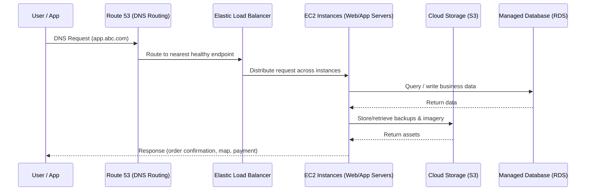

# Cloud Computing for ABC Enterprise: Key Contributions to Business Automation
*CCF501 Cloud Computing Fundamentals - Assessment 1 Report*

## Executive Summary
Cloud computing is already embedded in our daily life: email, streaming, file storage, smart home devices — all running on someone else's infrastructure, delivered as a utility (Nishimura, 2022). In a business context, this "utility model" becomes a direct enabler of automation: workloads scale when demand spikes, routine operations get offloaded to managed services, and teams can ship faster without being blocked by procurement and infrastructure constraints (McHaney, 2021).

In the ABC Enterprise scenario, the company intentionally avoided an on‑premises approach due to upfront capital costs and operational overhead. Their decision to run the ABC app on a cloud provider (with traffic routing, elastic compute, and cloud storage for backups/imagery) already paid off: start-up IT costs dropped by ~80%, and the platform absorbed a 10x customer surge within a month — a direct result of the cloud's pay-as-you-grow model (Eliaçık, 2022).

This report outlines three concrete benefits of cloud computing for ABC, the major challenges to manage (security, cost control, and vendor lock-in), and a practical recommendation for service/deployment models and cost model. Finally, if ABC chooses a provider other than "XYZ", this report recommends AWS due to strong maturity around scalability, global reliability, and automation-friendly managed services (Amazon Web Services, n.d.-a).

## 1. Benefits of Cloud Computing vs. Traditional IT Infrastructure
Traditional IT infrastructure usually means owning and operating everything: servers, storage, networking, cooling, physical security, procurement cycles, and the people required to keep it all alive (McHaney, 2021). That can make sense for very large enterprises with stable demand and strict data residency constraints, but for a start-up like ABC (with high growth uncertainty and low tolerance for downtime), the "buy hardware first, hope demand follows" model is a strategic handicap.

Cloud computing flips the model: instead of buying capacity, ABC rents capability. This maps directly to the essential cloud characteristics defined by Mell and Grance (2011): on‑demand self‑service, measured service, rapid elasticity, and resource pooling. In practical business terms, these are the building blocks that allow automation and scale without matching increases in headcount (Accenture Technology, 2020).

### 1.1 Cost Efficiency and Pay-as-you-grow Model
ABC reduced IT start‑up costs by ~80% because cloud spending is primarily operational expenditure (OPEX) rather than capital expenditure (CAPEX). There is no upfront purchase of servers, storage arrays, networking equipment, or data-centre setup. Instead, ABC consumes resources as needed, and the bill is aligned with actual usage (Eliaçık, 2022). As McHaney (2021) notes, operational overhead (personnel, training, upgrades, utilities, and security) often exceeds upfront investment over time, making the cloud's pay-as-you-go model a significant cost advantage for growing businesses.

In the scenario, traffic is routed via a managed DNS/routing service (Route 53) into cloud infrastructure running web/app servers on elastic compute instances (virtual machines). Backups and imagery are pushed to cloud storage. This is the "measured service" characteristic in action: ABC pays for compute-hours, storage GB-months, and data transfer — not for idle hardware (Mell & Grance, 2011). Combined with on-demand provisioning, ABC can spin up or down environments quickly (e.g., dev/staging/production), which reduces time-to-market and limits waste.

From an automation perspective, the cost benefit is not just "cheaper servers." It's that standard operational tasks (patching, scaling policies, backups, monitoring) can be codified and repeated. That reduces human toil and stabilises delivery (Accenture Technology, 2020).

*Figure 1: ABC Enterprise cloud traffic flow — from user request through Route 53, load balancing, compute, storage, and database layers.*

### 1.2 Rapid Scalability for Business Growth
ABC's 10x customer growth in a single month is exactly the scenario where on‑premises infrastructure breaks down. In a traditional environment, scaling means procurement lead time (quotes, purchase approvals, shipping, racking, networking, installing, testing). By the time the hardware arrives, the market opportunity may have moved on (McHaney, 2021).

Cloud enables rapid elasticity: capacity can scale up automatically during spikes (campaigns, peak meal times, new city launches) and scale down when demand normalises (Mell & Grance, 2011). For an app that includes delivery, taxi bookings, and payments, elasticity is non‑negotiable. Users do not "wait patiently" for a start-up — they churn. Eliaçık (2022) highlights that cloud's "endless scalability" allows businesses to scale RAM, CPU, and disk on demand without over-provisioning, protecting against outages from traffic spikes. The ability to keep latency low and availability high during demand surges is a direct business automation win: the platform responds to demand with policies and automation, not with emergency meetings.

### 1.3 Reduced IT Management Overhead
One of the most underrated benefits in early-stage companies is avoiding a matching increase in IT management costs as the company scales. In on‑prem environments, more customers typically means more infrastructure, which typically means more people to maintain it (McHaney, 2021).

Cloud providers operate at massive economies of scale through resource pooling and virtualisation. As Manvi and Shyam (2021) explain, virtualisation enables partitioning, isolation, and consolidation of physical resources — allowing multiple workloads to share the same hardware without interference. ABC effectively "borrows" that operational maturity: standardised infrastructure, automated maintenance, managed monitoring, and resilient architectures that are difficult to replicate in-house. Accenture Technology (2020) reinforces this point: building proprietary IT infrastructure and staffing it is incredibly expensive and may not be fully utilised — cloud lets companies pay only for what they use while focusing on core business.

## 2. Challenges of Cloud Migration and Mitigation Strategies
### 2.1 Potential Migration Challenges
Cloud adoption is not a free lunch. Even in the ABC scenario where the company already chose cloud early, there are clear risks that must be actively managed (Eliaçık, 2022):

First, security and privacy: ABC handles payments and likely stores customer PII, which increases compliance and incident-response requirements. Eliaçık (2022) notes that entrusting sensitive data to a third party means organisations may not detect breaches immediately — a significant concern for companies handling financial transactions.

Second, cost volatility: pay-as-you-go is powerful, but without guardrails it can spiral. Overprovisioned instances, excessive data egress, and "always-on" environments can lead to bills that surprise the business (Bittok, 2022).

Third, vendor lock‑in and operational dependency: managed services boost speed, but deeper adoption can make migration between providers expensive and slow (Eliaçık, 2022). For a competitive market, dependency on provider outages is also a real risk — even 99.99% availability is not 100%.

Finally, skills and operating model: cloud requires a different mindset (infrastructure-as-code, monitoring-first, shared responsibility). If teams treat cloud like "someone else's data centre," the organisation will not capture the automation benefits (McHaney, 2021).

### 2.2 Mitigation Strategies
Mitigation should be practical and staged:

From a security perspective, ABC should adopt a baseline "secure by default" posture: least privilege IAM, mandatory MFA for privileged roles, secrets management, encryption at rest/in transit, and continuous logging/alerting. Eliaçık (2022) points out that a cloud host's full-time job is monitoring security — more efficient than in-house teams splitting attention across IT issues — but ABC must still take responsibility for what they deploy within the provider's environment.

From a cost perspective, ABC should implement FinOps habits early: tagging resources, budgets/alerts, rightsizing, and using reserved/committed pricing for predictable baseline workloads (Bittok, 2022). That keeps agility while preventing uncontrolled spend.

From an architecture perspective, ABC should prioritise portability where it matters (containers, standard databases, abstraction of provider-specific dependencies), while still leveraging managed services when they deliver clear ROI (Amazon Web Services, n.d.-a).

From a people perspective, ABC should invest in short, targeted upskilling: core cloud foundations, security fundamentals, and operational excellence. Manvi and Shyam (2021) highlight that chain dependency — where multiple links must work together — is a key virtualisation risk that teams must understand to operate cloud environments effectively.

## 3. Cloud Service and Deployment Models
### 3.1 Service Models Analysis
Cloud service models are essentially a spectrum of control vs responsibility (McHaney, 2021):

IaaS (Infrastructure as a Service) provides virtualised compute, networking, and storage. ABC manages the OS and application stack. McHaney (2021) uses the analogy of "leasing a car" — you have flexibility and control, but you are also responsible for maintenance.

PaaS (Platform as a Service) provides managed runtimes and platforms (e.g., managed databases, managed container platforms, serverless). ABC focuses more on code and less on infrastructure maintenance. McHaney (2021) likens this to "taking a taxi" — the platform handles the driving.

SaaS (Software as a Service) delivers fully managed applications (e.g., email, CRM). McHaney (2021) describes this as "taking the bus" — maximum convenience, minimum control. For ABC, SaaS is relevant mainly for internal back-office functions, not the core ABC app.

### 3.2 Deployment Models Analysis
Deployment models describe where workloads run (McHaney, 2021):

Public cloud (most likely for ABC) runs on shared provider infrastructure and delivers maximum speed and scalability. It is best suited for organisations with less confidential data and a need for shared overhead (McHaney, 2021).

Private cloud runs on dedicated infrastructure (often on-premises). It offers more control but reintroduces cost and operational complexity — best suited for large organisations with sensitive data and in-house IT expertise (McHaney, 2021).

Hybrid cloud mixes both, commonly used when a subset of systems must remain on-prem due to regulation or legacy constraints (Nishimura, 2022).

### 3.3 Recommended Models for ABC Enterprise
For ABC's scenario, a public cloud deployment is the best fit. ABC is a start-up with high growth uncertainty and cannot afford downtime, so the operational maturity and global infrastructure footprint of a major public cloud provider is a strategic advantage (McHaney, 2021).

For service model, ABC should use a blended approach:

- Use IaaS for core web/app compute where flexibility is required (especially if they already run on VMs).
- Use PaaS wherever it reduces operational load without blocking engineering velocity (managed databases, managed caches, managed load balancing, autoscaling, serverless jobs).

This combination keeps control where ABC needs it, but still captures the main cloud value: automation, elasticity, and reduced toil (Accenture Technology, 2020).

## 4. Cost Model Analysis
### 4.1 Cloud Cost Model Options
Cloud providers typically offer three practical cost levers (Bittok, 2022; Amazon Web Services, n.d.-b):

Pay‑as‑you‑go (on‑demand) offers maximum flexibility and is ideal for experimentation, unknown growth, and spiky workloads — but it is usually the most expensive unit price. Bittok (2022) notes that the on-demand model is the most popular but also the most expensive cloud consumption model.

Reserved/committed pricing offers discounts in exchange for committing to a baseline level of usage (e.g., 1–3 years). This is ideal once ABC understands its steady-state workload, aligning with Bittok's (2022) recommendation to use savings plans or prepaid options to reduce unit costs.

Spot/preemptible compute offers deep discounts for workloads that can tolerate interruption (batch jobs, async processing, non-critical workloads).

### 4.2 Recommended Cost Model for ABC Enterprise
ABC should adopt a hybrid cost model that reflects how the business actually behaves:

- Keep the customer-facing baseline on reserved/committed capacity once usage stabilises (predictable web/app tiers, databases). This drives down unit cost without sacrificing reliability.
- Use pay-as-you-go autoscaling for demand spikes (campaigns, seasonal effects, growth bursts). This preserves agility.
- Use spot/preemptible for background processing and automation workloads where interruption is acceptable (analytics pipelines, non-real-time jobs).

To control total cost of ownership (TCO), ABC should model not only direct cloud fees (compute, storage, data transfer), but also migration/refactoring cost, security/monitoring tooling, and cloud engineering effort across the workload lifetime (Bittok, 2022). As Bittok (2022) emphasises, "cloud adoption is rarely about pure cost savings — often the end result is a larger ROI and better business outcomes." The win is rarely "cheapest monthly bill." The win is better ROI: less downtime, faster launches, and automation that avoids linear headcount growth.

## 5. Cloud Service Provider Recommendation
### 5.1 Provider Comparison (AWS, Azure, GCP)
If ABC chooses a provider other than XYZ, the shortlist is realistically AWS, Azure, or Google Cloud Platform (GCP). All three can meet the technical baseline (global compute, storage, networking), but they tend to differentiate by ecosystem strength and operational maturity (Nishimura, 2022).

AWS has the broadest service catalogue and strong maturity across reliability patterns, global infrastructure, and automation tooling. Nishimura (2022) highlights that AWS pioneered making cloud infrastructure affordable and accessible — directly relevant to a start-up like ABC. Azure integrates deeply with Microsoft enterprise ecosystems. GCP is particularly strong in data/analytics and is highly competitive for container and Kubernetes-native architectures.

### 5.2 Recommended Provider for ABC Enterprise
For ABC's specific scenario, AWS is the strongest recommendation. The scenario already references Route 53, which is an AWS service; this implies AWS-like architecture patterns and reduces migration friction. AWS also provides mature building blocks for high-availability architectures, auto-scaling, and managed services that directly support business automation (Amazon Web Services, n.d.-a). As Nishimura (2022) notes, AWS launched S3 for storage and EC2 for compute in 2006, making cloud accessible to start-ups and enterprises alike — the same infrastructure ABC is leveraging today.

### 5.3 Essential Computing Elements for Industry Automation
Two essential AWS computing elements that best address ABC’s requirements (scalability, reliability, minimal downtime, lean ops) are:

1) **Elastic Load Balancing + Auto Scaling** (compute elasticity). This combination keeps the app responsive during demand surges by scaling out instances and distributing traffic safely (Amazon Web Services, n.d.-a). It's the operational "anti-panic button": instead of manually provisioning, the system reacts automatically — directly addressing the rapid elasticity characteristic defined by Mell and Grance (2011).

2) **AWS Lambda** (serverless compute) for automation workflows. ABC can use Lambda for background jobs and event-driven automation (e.g., order events, payment webhooks, image processing, notifications). Serverless reduces operational burden because there are no servers to manage, and costs align tightly with actual execution (Amazon Web Services, n.d.-b).

Together, these elements support "industry automation" by turning operational tasks and business workflows into policy-driven, event-driven systems — consistent with the SOA principles described by McHaney (2021): reusable, modular services that communicate over networks.

## 6. Conclusion
ABC Enterprise is a strong fit for cloud computing because the business requires low downtime, rapid scaling, and cost control while growing aggressively. Cloud characteristics such as measured service, rapid elasticity, and resource pooling (Mell & Grance, 2011) directly translate into business automation outcomes: scaling without procurement, operations without linear headcount growth, and faster delivery (Accenture Technology, 2020).

The recommendation is a public cloud deployment with a blended IaaS/PaaS approach, plus a hybrid cost model (reserved baseline + on‑demand burst + spot for non-critical jobs). If ABC selects a provider beyond XYZ, AWS is recommended due to maturity, global reliability patterns, and automation-friendly managed services (Amazon Web Services, n.d.-a). Done well, ABC's next growth jump is not 10x — it's "scale as far as product-market fit allows" (Eliaçık, 2022), without the infrastructure becoming the bottleneck.

## References
Accenture Technology. (2020, June 5). *Why cloud matters* [Video]. YouTube. https://www.youtube.com/watch?v=p1Nr03gtkyU

Amazon Web Services. (n.d.-a). *AWS Well-Architected Framework.* https://aws.amazon.com/architecture/well-architected/

Amazon Web Services. (n.d.-b). *AWS Pricing.* https://aws.amazon.com/pricing/

Bittok, T. (2022, January 22). *Cloud total cost of ownership.* LinkedIn Pulse. https://www.linkedin.com/pulse/cloud-total-cost-ownership-theophilus-bittok/

Eliaçık, E. (2022). *The good, bad, and ugly sides of cloud computing.* Dataconomy. https://dataconomy.com/2022/05/pros-and-cons-of-cloud-computing-2022/

Manvi, S., & Shyam, G. K. (2021). *Cloud computing: Concepts and technologies* (Chapter 4). CRC Press. https://learning-oreilly-com.torrens.idm.oclc.org/library/view/cloud-computing/9781000338058/

McHaney, R. (2021). *Cloud technologies: An overview of cloud computing technologies for managers.* Wiley. https://ieeexplore-ieee-org.torrens.idm.oclc.org/servlet/opac?bknumber=9820907

Mell, P., & Grance, T. (2011). *The NIST definition of cloud computing* (Special Publication 800-145). National Institute of Standards and Technology. https://doi.org/10.6028/NIST.SP.800-145

Nishimura, H. (2022, August 30). *Introduction to AWS for non-engineers: 1 cloud concepts* [Video]. LinkedIn Learning. https://www.linkedin.com/learning/introduction-to-aws-for-non-engineers-1-cloud-concepts-2/

Rahman, M. S., & Raza, M. (2021). Cloud computing security challenges and its potential solution. *International Journal of Computer Applications, 174*(6), 29–33. https://doi.org/10.5120/ijca2021921167

Singh, S., & Chana, I. (2016). Cloud resource provisioning: Survey, status and future research directions. *Knowledge and Information Systems, 49*(3), 1005–1069. https://doi.org/10.1007/s10115-016-0922-3
