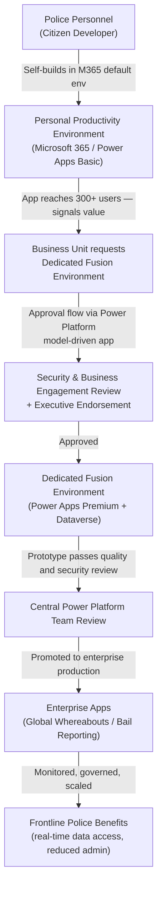
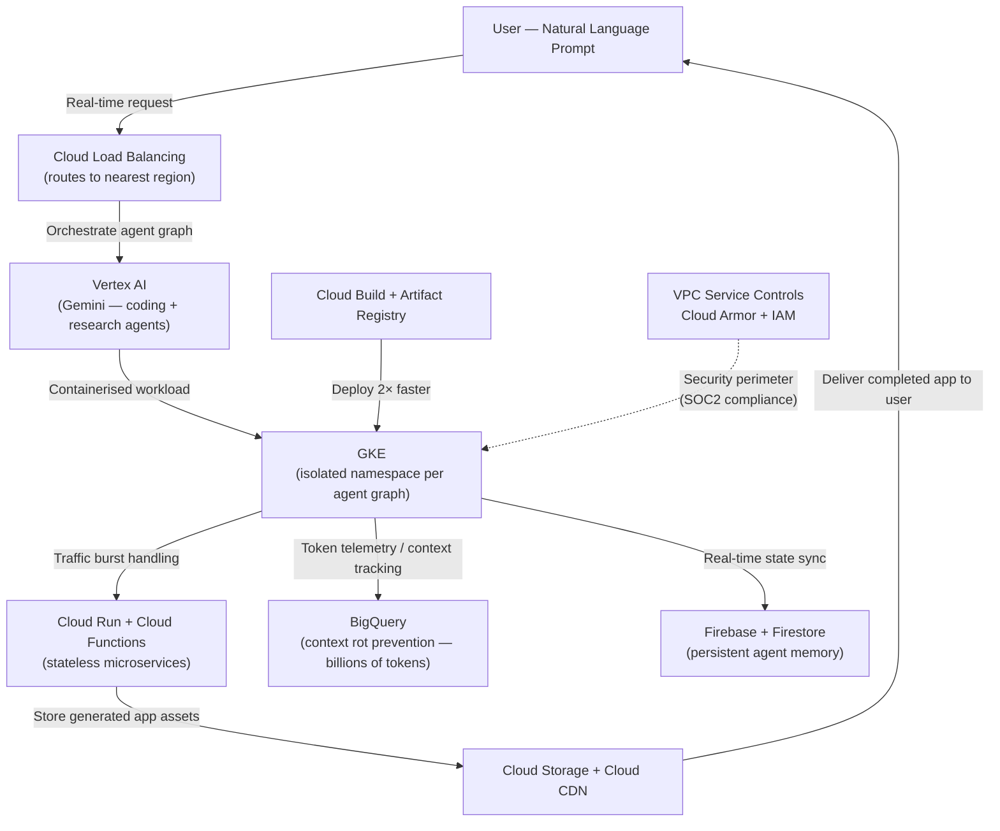
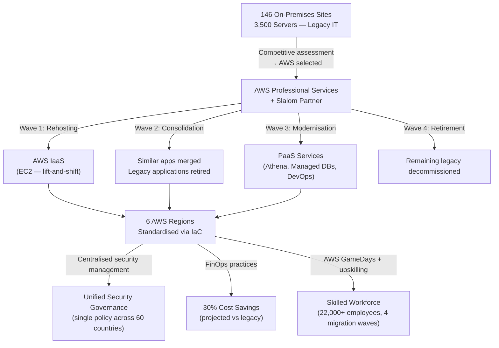

# Cloud Services and Deployment Models: A Cross-Sector Case Study Analysis
*CCF501 Cloud Computing Fundamentals — Assessment 2 Case Study Report*

<!-- RUBRIC: Content, audience and purpose 10% — Introduction must establish cloud context and link to all three case studies; written in complete sentences and paragraphs -->
<!-- WORD COUNT TARGET: ~2,900 words (±10%), excluding references -->
<!-- STRUCTURE: Introduction (~400w) + 3 × Case Study (~750w each) + Conclusion (~250w) = 2,900w -->

---

## 1. Introduction (~400 words)

<!-- RUBRIC: Content, audience and purpose 10% — Set the scene: what is cloud computing, why does it matter across sectors, preview all three case studies -->
<!-- SLO a, b, c — introduce NIST characteristics, name the three cases, state report purpose -->

Cloud computing has fundamentally reshaped how organisations across every sector deliver services, manage infrastructure, and drive automation. Rather than owning and operating physical data centres, enterprises now consume compute, storage, networking, and intelligence on demand — scaling elastically, paying only for what they use, and offloading infrastructure management to specialist providers (Mell & Grance, 2011). The shift from Capital Expenditure (CAPEX)-heavy on-premises environments to Operational Expenditure (OPEX)-driven cloud models is no longer a trend exclusive to technology companies — it is a cross-industry imperative that spans government agencies, AI-native startups, and century-old industrial manufacturers alike (Linthicum, 2021; McHaney, 2021).

This report analyses three real-world case studies drawn from distinct sectors — government law enforcement (Victoria Police), artificial intelligence and software startup (ChatAndBuild), and industrial manufacturing (Voith) — each provided by the subject facilitator and representing a different combination of cloud service model, deployment model, and provider ecosystem. By examining how cloud was applied in each context, this report aims to: describe the essential cloud elements that enabled business automation in each case (SLO a); distinguish cloud adoption from traditional IT infrastructure approaches (SLO b); and identify the key cloud service offerings that made each outcome possible (SLO c).

The three cases collectively illustrate how cloud computing is not a single, monolithic technology but a spectrum of services and deployment strategies calibrated to organisational context, risk appetite, and automation goals. Victoria Police leveraged Microsoft Power Platform (PaaS) within a hybrid multi-environment model to democratise application development across a law enforcement agency — transforming previously invisible, ungoverned Microsoft Access databases into a governed, scalable innovation ecosystem (Microsoft, 2026). ChatAndBuild, an AI-native startup based in Singapore, migrated to Google Cloud Platform to eliminate the manual infrastructure burden that was impeding real-time AI agent creation, achieving a 45% reduction in infrastructure overhead and a 30–70% improvement in generation latency (Google Cloud, n.d.). Voith, a 150-year-old manufacturing company operating across 60 countries, selected AWS following a competitive provider assessment to consolidate 3,500 servers distributed across 146 global locations into six AWS regions — projecting 30% cost savings compared to the legacy setup (Amazon Web Services, n.d.).

The following sections examine each case in turn — analysing service and deployment model choices, mapping specific cloud services to their automation outcomes, and reflecting on the contrast with traditional IT approaches — before synthesising the findings in a concluding analysis.

---

## 2. Case Study 1 — Victoria Police & Microsoft Power Platform (~750 words)

<!-- RUBRIC: Service offerings + deployment model comparison 40% — Identify specific services, compare deployment models in a table, analyse outcomes -->
<!-- SLO a: essential computing elements for automation | SLO b: cloud vs traditional IT | SLO c: key service offerings -->

### 2.1 Case Overview (~100 words)

Victoria Police — Australia's principal state law enforcement agency — adopted Microsoft Power Platform to establish a **fusion development framework**: a governed model enabling non-professional developers (police personnel across business units) to build data-driven applications safely, without depending on a constrained central IT team (Microsoft, 2026). The catalyst was a pandemic-era surge in self-directed app-building, when employees teaching themselves Power Apps revealed both the appetite for low-code tooling and the risk of ungoverned 'shadow' applications built on standalone Microsoft Access databases. Rather than restricting this behaviour, Victoria Police channelled it — creating structured pathways from personal productivity through to enterprise-grade production, with two fusion-born applications already progressing to enterprise adoption (Microsoft, 2026).

### 2.2 Service Model Analysis (~150 words)

<!-- RUBRIC: 40% — Identify and justify the service model (IaaS/PaaS/SaaS); explain how provider services addressed the business challenge -->
<!-- SLO c: key service offerings -->

Victoria Police's cloud adoption aligns primarily with a **Platform as a Service (PaaS)** model. Power Apps and Power Platform abstract the underlying infrastructure — Microsoft manages the compute, networking, and database layers of Dataverse and the Power Platform runtime — while Victoria Police's developers focus on application logic, data models, and user experience (McHaney, 2021). This is the defining characteristic of PaaS: the provider controls the platform, the customer controls the application (IBM, n.d.-a). Some Microsoft 365 productivity workloads (SharePoint, Teams, Outlook) sit at the **SaaS** layer — fully managed software delivered over the network. There is no IaaS footprint in this case; Victoria Police has not provisioned raw virtual machines or unmanaged storage — all development occurs within the abstracted Power Platform environment (Microsoft, 2026).

| Service Model | Characteristic | Fit for Victoria Police |
|---|---|---|
| IaaS | Customer manages OS, runtime, storage | Not applicable — no raw compute provisioned |
| **PaaS** | Provider manages platform; customer builds applications | ✅ **Primary model** — Power Apps, Dataverse, Power Platform runtime |
| SaaS | Provider manages everything; customer uses software | Partial — Microsoft 365 (SharePoint, Teams) as data and collaboration substrate |

*Table 1: Service model analysis for Victoria Police (Microsoft, 2026).*

### 2.3 Deployment Model Comparison (~150 words)

<!-- RUBRIC: 40% — Compare and contrast deployment models; table must be present and substantiated -->
<!-- SLO b: cloud vs traditional IT -->

Victoria Police operates a **hybrid, multi-environment deployment model**: a personal productivity environment (the default Microsoft 365 tenant available to all staff), dedicated fusion environments (isolated, governed Power Platform environments provisioned on request by business units with executive endorsement), and enterprise production environments (reviewed and approved by the central Power Platform team) (Microsoft, 2026). This tiered model is a practical application of hybrid cloud architecture — multiple environment tiers serving different governance, security, and scale requirements simultaneously (Manvi & Shyam, 2021).

| Deployment Model | Governance | Security | Scalability | Fit for Victoria Police |
|---|---|---|---|---|
| On-Premises (MS Access) | Low — invisible to IT | High risk — unaudited shadow apps | None | ❌ Prior state — ungoverned shadow apps |
| **Hybrid (Multi-env Power Platform)** | High — tiered approval flow with exec endorsement | High — centralised standards, security review | Moderate | ✅ **Adopted** — governed innovation pathway |
| Public Cloud (ungoverned) | Low | Low | High | ❌ Same shadow IT risk as before |
| Private Cloud | High | High | Limited | ⚠️ High cost; no low-code ecosystem |

*Table 2: Deployment model comparison for Victoria Police (Microsoft, 2026; Manvi & Shyam, 2021).*

### 2.4 Cloud Services Analysis (~200 words)

<!-- RUBRIC: 40% — Demonstrate understanding of specific services; map to automation outcomes; SLO a and SLO c -->

The fusion framework relies on a layered set of Microsoft Power Platform services, each enabling a distinct stage of the application lifecycle (Microsoft, 2026):

| Service | Purpose | Business Outcome |
|---|---|---|
| Power Apps (Low-code / PaaS) | Enable non-professional developers to build data-driven apps without code | Personnel build and iterate solutions without the central IT bottleneck |
| Microsoft Dataverse | Model-driven, structured data store underpinning enterprise apps | Replaces isolated MS Access databases with a governed, transparent, auditable data layer |
| Power Platform Governance Framework (Environments + Approval Flow) | Isolated workspaces per business unit; approval flow with executive endorsement before promotion | Tiered pathway from personal productivity to enterprise production; prevents ungoverned shadow apps |
| Microsoft 365 (SharePoint) | Data substrate and collaboration layer for initial prototypes | Familiar toolset lowers the barrier to entry for non-technical builders |

*Table 3: Microsoft Power Platform services utilised by Victoria Police and their business outcomes (Microsoft, 2026).*

*Figure 1: Victoria Police fusion development lifecycle — from citizen developer prototype through tiered governance to enterprise production (Microsoft, 2026).*

### 2.5 Reflection (~150 words)

<!-- RUBRIC: 20% SLO a — NIST essential characteristics; 20% SLO b — cloud vs traditional IT -->

The Victoria Police case demonstrates cloud's **on-demand self-service** characteristic (Mell & Grance, 2011) applied beyond technical teams — extending it to non-professional developers under tiered governance. In a traditional IT model, every application request queued behind a constrained central team, driving staff toward ungoverned Microsoft Access solutions outside IT visibility. Power Platform inverts this: it governs the _pathway_ to production while allowing distributed development (Microsoft, 2026) — a structural distinction that on-premises tooling cannot replicate (McHaney, 2021). The primary risk is data residency: sensitive law enforcement data in a PaaS environment requires compliance with the Australian Protective Security Policy Framework (PSPF), and the risk surface expands as adoption scales to thousands of officers across regions — a challenge Efrain Tionko (Head of Digital Delivery, Victoria Police) explicitly acknowledged (Microsoft, 2026).

---

## 3. Case Study 2 — ChatAndBuild & Google Cloud (~750 words)

<!-- RUBRIC: Service offerings + deployment model comparison 40% -->
<!-- SLO a: essential computing elements | SLO b: cloud vs traditional IT | SLO c: key service offerings -->

### 3.1 Case Overview (~100 words)

ChatAndBuild is a Singapore-based AI-native startup whose platform enables anyone to turn natural language into working applications and AI agents instantly, serving over 140,000 users globally (Google Cloud, n.d.). The company's previous infrastructure imposed 30–70% higher latency on real-time generation and caused context rot in long-lived AI agents — loss of user history that eroded platform trust. Global hackathon events required engineers to manually provision servers days in advance to prevent crashes from IP surges, making elasticity a critical business requirement. ChatAndBuild migrated to Google Cloud to establish a fully AI-native, elastically scalable infrastructure capable of operating at global speed (Google Cloud, n.d.).

### 3.2 Service Model Analysis (~150 words)

<!-- RUBRIC: 40% — Identify and justify the service model; specify which layer each GCP service represents -->
<!-- SLO c: key service offerings -->

ChatAndBuild's architecture spans **IaaS and PaaS** layers. Google Compute Engine provides the raw virtual machine infrastructure (IaaS) that enables elastic scaling of the worker fleet from approximately 10 to 100+ instances during global hackathon events — handled automatically through instance groups and autoscaling policies (Google Cloud, n.d.). On top of this, a rich suite of managed PaaS services handles AI orchestration, containerised workload management, data analytics, state synchronisation, and CI/CD — abstracting operational complexity so the engineering team can focus on product development rather than infrastructure management (McHaney, 2021).

| Service Model | Characteristic | Fit for ChatAndBuild |
|---|---|---|
| **IaaS** | Raw compute provisioned on demand; customer manages OS and runtime | ✅ Google Compute Engine — elastic worker fleet scaling for burst demand |
| **PaaS** | Managed platform; provider handles runtime and infrastructure operations | ✅ **Primary layer** — Vertex AI, GKE, Cloud Run, BigQuery, Cloud SQL, Firebase |
| SaaS | Fully managed software | Partial — Firebase and Firestore as managed backend services |

*Table 4: Service model analysis for ChatAndBuild (Google Cloud, n.d.).*

### 3.3 Deployment Model Comparison (~150 words)

<!-- RUBRIC: 40% — Compare deployment models; justify the recommended model with evidence -->
<!-- SLO b: cloud vs traditional IT -->

ChatAndBuild operates on **public cloud** across multiple Google Cloud regions — a model in which cloud infrastructure is owned and managed by a third-party provider and delivered over the internet on a consumption basis (IBM, n.d.-b). Cloud Load Balancing routes each request to the nearest available region, ensuring sub-second response times globally. The multi-region model was the only viable option for a startup serving over 140,000 users across time zones, where hackathon spikes require instantly elastic capacity and prior on-premises approaches demanded days of manual server provisioning (Google Cloud, n.d.).

| Deployment Model | Elasticity | Global Reach | Latency | Fit for ChatAndBuild |
|---|---|---|---|---|
| On-Premises | None — fixed servers | Single geography | High | ❌ Prior state — 30–70% higher latency |
| Private Cloud | Limited | Single geography | Medium | ❌ No global edge or elastic capacity |
| **Public Cloud (Multi-region)** | High — auto-scale 10→100+ instances in minutes | Global PoP via Cloud Load Balancing | Low — sub-second | ✅ **Adopted** — auto-scale, zero downtime |
| Multi-Cloud | Highest | Highest | Lowest | ⚠️ Premature for current startup scale |

*Table 5: Deployment model comparison for ChatAndBuild (Google Cloud, n.d.; Manvi & Shyam, 2021).*

### 3.4 Cloud Services Analysis (~200 words)

<!-- RUBRIC: 40% — Map services to business outcomes; SLO a and SLO c -->

The Google Cloud architecture forms an integrated "idea-to-app" engine where each service layer contributes to the real-time generation pipeline (Google Cloud, n.d.):

| Service | Purpose | Business Outcome |
|---|---|---|
| Vertex AI + Gemini models | Routes prompts to specialised coding and research agents; multimodal generation | Core AI engine — 30–70% latency reduction vs previous setup |
| Google Kubernetes Engine (GKE) | Isolated namespaces per agent graph; manages thousands of concurrent builder sessions | Zero-downtime scaling — 13B+ tokens processed at a global hackathon |
| Cloud Run + Cloud Functions | Stateless microservices that auto-spin for traffic bursts; Load Balancing routes to nearest region | Demand spikes handled without idle compute; sub-second response times globally |
| Data & State Layer (BigQuery + Cloud SQL + Firestore + Firebase) | Token telemetry to prevent context rot; structured data management; real-time user state sync | Persistent, coherent agent sessions; eliminates loss of user history |
| Security & Delivery (VPC Service Controls + Cloud Armor + IAM + Cloud CDN) | Security perimeter for regulated markets; delivers generated assets globally | SOC2 compliance; strict audit logging; low-latency asset delivery to end users |

*Table 6: Google Cloud services utilised by ChatAndBuild and their business outcomes (Google Cloud, n.d.).*

*Figure 2: ChatAndBuild Google Cloud architecture — natural language prompt through Vertex AI orchestration, GKE execution, and CDN delivery to end user (Google Cloud, n.d.).*

### 3.5 Reflection (~150 words)

<!-- RUBRIC: 20% SLO a — NIST characteristics; 20% SLO b — cloud vs traditional IT -->

ChatAndBuild's migration exemplifies NIST's **rapid elasticity** and **on-demand self-service** characteristics (Mell & Grance, 2011) at their most extreme. Scaling a worker fleet from 10 to 100+ Compute Engine instances in minutes — autonomously, based on load — is structurally impossible with on-premises infrastructure, where capacity must be physically provisioned days in advance (Google Cloud, n.d.). In the prior architecture, engineers acted as manual autoscalers; any instability meant broken agent sessions and eroded user trust. The 45% infrastructure overhead reduction reflects **measured service** in practice: consumption-based billing replaced fixed infrastructure costs, freeing the team to ship product rather than manage servers (Google Cloud, n.d.). Key ongoing risks include data sovereignty for AI-generated content across multi-region deployments and long-term vendor dependency on GCP's AI ecosystem.

---

## 4. Case Study 3 — Voith & AWS (~750 words)

<!-- RUBRIC: Service offerings + deployment model comparison 40% -->
<!-- SLO a: essential computing elements | SLO b: cloud vs traditional IT | SLO c: key service offerings -->

### 4.1 Case Overview (~100 words)

Voith is a 150-year-old family-owned manufacturing company with over 22,000 employees across 60 countries, producing machinery for the hydroelectric, papermaking, and transportation industries (Amazon Web Services, n.d.). Its legacy IT footprint was vast and fragmented: 3,500 servers across 146 global locations managing applications that were difficult and expensive to maintain. Seeking to lower costs, improve productivity, and access modern cloud capabilities, Voith conducted a competitive provider assessment — evaluating providers against criteria including service portfolio depth, global regional availability, and partner support capability (Kuijpers, 2022) — before selecting AWS based on its solution maturity and collaborative approach (Amazon Web Services, n.d.). The migration proceeds in four structured waves — rehosting (migrating workloads as-is), consolidation, modernisation, and retirement of legacy applications (Linthicum, 2023) — supported by AWS Professional Services and Slalom as the AWS Implementation Partner.

### 4.2 Service Model Analysis (~150 words)

<!-- RUBRIC: 40% — Identify and justify the service model; analyse how provider services addressed the business challenge -->
<!-- SLO c: key service offerings -->

Voith's migration spans **IaaS and PaaS** service models, reflecting the phased, multi-wave approach to cloud adoption. In the initial rehosting wave, legacy applications are lifted and shifted to AWS virtual machine infrastructure (IaaS) — maintaining the existing operating model while immediately achieving data centre consolidation. As the migration progresses into modernisation waves, Voith transitions workloads to managed PaaS services — such as Amazon Athena for serverless analytics — reducing the operational effort of running systems and eliminating the need for dedicated database administration staff (Amazon Web Services, n.d.).

| Service Model | Characteristic | Fit for Voith |
|---|---|---|
| **IaaS** | Virtual machines, storage; customer manages OS and runtime | ✅ Rehosting wave — lift-and-shift of 3,500 servers to AWS virtual infrastructure |
| **PaaS** | Managed services; provider handles platform operations | ✅ Modernisation wave — Amazon Athena, managed databases, DevOps tooling |
| SaaS | Fully managed software | Partial — AWS GameDays (training); future SaaS productivity tooling |

*Table 7: Service model analysis for Voith (Amazon Web Services, n.d.).*

### 4.3 Deployment Model Comparison (~150 words)

<!-- RUBRIC: 40% — Compare deployment models; justify chosen model with evidence -->
<!-- SLO b: cloud vs traditional IT -->

Voith migrated to a **public cloud** model deployed across **six AWS regions**, replacing 146 globally dispersed on-premises locations. The choice of public cloud was driven by the need for global standardisation, centralised security management, and access to modern managed services — objectives that a private or hybrid model could not deliver at the required global scale (Amazon Web Services, n.d.; McHaney, 2021). Infrastructure as Code (IaC) enforces consistent configuration standards across all regions, eliminating the policy fragmentation inherent in managing 146 independent sites.

| Deployment Model | Cost | Standardisation | Global Reach | Fit for Voith |
|---|---|---|---|---|
| On-Premises (146 sites) | High CAPEX — 3,500 servers | Low — fragmented legacy systems per site | Global but ungovernable | ❌ Prior state — fragmented, costly |
| Private Cloud | High CAPEX + ops | Moderate | Limited to owned data centres | ❌ Cannot consolidate 60-country footprint |
| **Public Cloud (6 AWS regions)** | OPEX — 30% projected savings | High — IaC enforces standards globally | ✅ 6 regions cover global operations | ✅ **Adopted** — consolidation + savings |
| Hybrid Cloud | Medium — dual infrastructure | Medium | High | ⚠️ May be needed for OT/SCADA |

*Table 8: Deployment model comparison for Voith (Amazon Web Services, n.d.; McHaney, 2021).*

### 4.4 Cloud Services Analysis (~200 words)

<!-- RUBRIC: 40% — Map services to automation outcomes; SLO a and SLO c -->

Voith's AWS engagement combines migration services, managed analytics, DevOps tooling, skills development infrastructure, and FinOps practices to deliver both immediate consolidation benefits and long-term operational modernisation (Amazon Web Services, n.d.):

| Service | Purpose | Business Outcome |
|---|---|---|
| Migration Execution Support (AWS Professional Services + Slalom) | Expert-led migration planning, execution, and on-the-ground upskilling across four waves | Structured migration with increasing velocity; embedded partner expertise reduces time-to-cloud |
| Amazon Athena | Serverless analytics — queries data in S3 without provisioning servers | Eliminates database administration overhead; pay-per-query cost model |
| Infrastructure as Code (IaC) | Automated, version-controlled infrastructure provisioning through reusable scripts rather than manual configuration (Chapple, 2022) | Central quality standards enforced globally; eliminates configuration drift from 146 sites to 6 |
| Operational Standardisation (Centralised DevOps + Security Management) | Scattered business unit operations moved to shared DevOps model; unified security governance | Standardised pipelines and single security posture replace 146 fragmented site policies |
| FinOps Practices | Continuous cost governance — identify, optimise, and attribute cloud spend | Tracks and validates 30% savings target; informs rightsizing decisions |

*Table 9: AWS services utilised by Voith and their business outcomes (Amazon Web Services, n.d.).*

*Figure 3: Voith AWS migration architecture — four-wave migration from 146 on-premises sites to 6 standardised AWS regions (Amazon Web Services, n.d.).*

### 4.5 Reflection (~150 words)

<!-- RUBRIC: 20% SLO a — NIST characteristics; 20% SLO b — cloud vs traditional IT -->

Voith's case illustrates NIST's **resource pooling** and **measured service** characteristics at enterprise scale (Mell & Grance, 2011). Consolidating 3,500 servers across 146 locations into six AWS regions replaces fragmented hardware with shared, logically isolated cloud infrastructure — resource pooling at an organisational level. The projected 30% cost savings reflects measured service: Voith pays for consumption, with FinOps practices providing visibility to optimise spend continuously (Amazon Web Services, n.d.). The contrast with traditional IT is structural: each of 146 sites previously maintained its own servers and security policies, producing inconsistent governance across 60 countries. Cloud consolidation resolves this with a single IaC configuration enforcing standards globally and centralised security replacing fragmented site policies (McHaney, 2021). A residual risk is operational technology integration — manufacturing SCADA systems may require on-premises infrastructure long-term, creating a hybrid architecture requirement outside the current migration scope.

---

## 5. Conclusion (~250 words)

<!-- RUBRIC: Content and purpose 10% — Summary only; no new information introduced; no tables, graphs, diagrams, or dot points -->
<!-- NOTE: Brief requires complete sentences and paragraphs throughout — no lists, tables, or diagrams -->
<!-- SLO a, b, c — synthesise key insights from all three cases -->

Across all three case studies, a consistent set of cloud principles underpinned the outcomes: on-demand self-service enabled each organisation to provision capability without manual IT intervention; rapid elasticity allowed both ChatAndBuild and Voith to scale resources to match demand — whether a global hackathon spike or a 146-site migration wave; and measured service translated consumption directly into financial and operational accountability, from Victoria Police's governed fusion environments to Voith's 30% projected cost savings (Mell & Grance, 2011). Despite operating in radically different sectors — government law enforcement, AI startup, and industrial manufacturing — each organisation achieved outcomes that were structurally impossible under their prior on-premises configurations, confirming that the essential cloud elements of automation are sector-agnostic even as their application is highly context-specific (McHaney, 2021).

In each case, fixed on-premises infrastructure represented a ceiling — on developer throughput (Victoria Police's constrained IT queue driving shadow application risk), on real-time AI generation capacity (ChatAndBuild's manual provisioning bottleneck degrading agent reliability), and on global standardisation (Voith's fragmented 146-site estate producing inconsistent governance). Cloud removed these ceilings by decoupling capacity from physical hardware procurement and enabling OPEX-aligned, consumption-driven cost models in place of CAPEX-constrained, fixed-capacity traditional IT (McHaney, 2021; Mell & Grance, 2011).

Key areas warranting further investigation across these cases include cloud cost governance at enterprise scale, compliance frameworks for regulated sectors (law enforcement data residency, manufacturing OT system integration), and multi-cloud portability strategies as vendor dependency on Microsoft, Google Cloud, and AWS ecosystems deepens. The three case studies collectively demonstrate that cloud adoption is not a single transition event but an evolving capability requiring continuous governance, workforce skills development, and architectural adaptation to remain strategically effective.

---

## Appendices

### Appendix A: Cross-Case Comparison Summary

*Table A1: Side-by-side comparison of the three case studies across provider, service model, deployment model, key services, and business outcomes.*

| Attribute | Case Study 1 — Victoria Police | Case Study 2 — ChatAndBuild | Case Study 3 — Voith |
|---|---|---|---|
| **Sector** | Government / Law Enforcement | AI / Software Startup | Industrial Manufacturing |
| **Cloud Provider** | Microsoft (Azure ecosystem) | Google Cloud Platform (GCP) | Amazon Web Services (AWS) |
| **Service Model** | PaaS (primary) + SaaS (partial) | IaaS + PaaS | IaaS + PaaS |
| **Deployment Model** | Hybrid — multi-environment (personal → fusion → enterprise) | Public cloud — multi-region | Public cloud — 6 AWS regions |
| **Prior State** | Ungoverned MS Access shadow apps; central IT bottleneck | 30–70% higher latency; engineers manually provisioning servers days before events | 3,500 servers across 146 locations; fragmented legacy applications |
| **Key Services** | Power Apps, Dataverse, Power Platform Environments, Power Automate, Copilot Studio | Vertex AI, GKE, Cloud Run, BigQuery, Firebase, Cloud CDN, Cloud Build, Cloud Armor | AWS Professional Services, Amazon Athena, IaC, Centralised DevOps, AWS GameDays, FinOps |
| **Primary Automation Outcome** | Governed fusion framework — citizen developers build enterprise-grade apps via tiered approval | Real-time AI code and agent generation at sub-second latency for 140,000+ users | Consolidated global operations; IaC-enforced standards across 60 countries |
| **Headline Result** | 2 enterprise apps in production (Global Whereabouts; Bail Reporting) | 45% infrastructure overhead ↓; 30–70% latency ↓; 2× faster feature delivery | 30% projected cost savings; 146 → 6 site consolidation |
| **SLO Alignment** | SLO a: PaaS automation; SLO b: shadow IT → governed cloud; SLO c: Power Platform | SLO a: AI-native cloud elements; SLO b: manual ops → elastic cloud; SLO c: GCP services | SLO a: migration automation; SLO b: on-prem → public cloud; SLO c: AWS managed services |

---

### Appendix B: NIST Essential Characteristics — Cross-Case Mapping

*Table B1: Mapping of NIST's five essential cloud characteristics (Mell & Grance, 2011) to each case study, showing which characteristics were primary drivers of the outcomes achieved.*

| NIST Characteristic | Victoria Police | ChatAndBuild | Voith |
|---|---|---|---|
| **On-demand self-service** | ✅ Primary — police personnel provision their own Power Platform environments and build applications without central IT intervention (Microsoft, 2026) | ✅ Autoscaling policies provision and terminate Compute Engine instances automatically without engineer intervention (Google Cloud, n.d.) | ✅ IaC enables automated, consistent provisioning of infrastructure across 6 regions without manual configuration per site (Amazon Web Services, n.d.) |
| **Broad network access** | ✅ Officers across all stations access Global Whereabouts and Bail Reporting from any device via Microsoft 365 (Microsoft, 2026) | ✅ 140,000+ users globally access the platform via browser; Cloud Load Balancing routes to the nearest region for sub-second response (Google Cloud, n.d.) | ✅ 22,000+ employees across 60 countries access centralised systems via 6 standardised AWS regions (Amazon Web Services, n.d.) |
| **Resource pooling** | ✅ Multiple business units share Power Platform infrastructure; Dataverse pools structured data storage across all fusion applications (Microsoft, 2026) | ✅ GKE clusters pool compute across thousands of concurrent agent graphs and user sessions (Google Cloud, n.d.) | ✅ **Primary driver** — 3,500 servers across 146 sites pooled into 6 shared, logically isolated AWS regions (Amazon Web Services, n.d.) |
| **Rapid elasticity** | ⚠️ Limited — Power Platform environments scale within Microsoft's managed bounds; not the primary driver for this case | ✅ **Primary driver** — worker fleet scales from 10 → 100+ Compute Engine instances within minutes during global hackathon events with zero downtime (Google Cloud, n.d.) | ⚠️ Wave-based migration progressively expands the cloud footprint; real-time elasticity is not the primary driver for this manufacturing workload |
| **Measured service** | ✅ Tiered governance tracks app usage and adoption; Power Platform visibility surfaces which apps reach 300+ users and warrant promotion (Microsoft, 2026) | ✅ 45% infrastructure overhead reduction reflects consumption-based billing replacing fixed legacy infrastructure costs (Google Cloud, n.d.) | ✅ **Primary driver** — FinOps practices provide continuous cost visibility and track progress toward 30% savings target; OPEX model replaces CAPEX-heavy 146-site estate (Amazon Web Services, n.d.) |

*Legend: ✅ Present and significant &nbsp;|&nbsp; ⚠️ Partial / limited &nbsp;|&nbsp; ❌ Not applicable*

## References

<!-- APA 7th edition — 12 references, alphabetical order by first author surname -->
<!-- RUBRIC: Citations 10% — in-text citations must appear throughout; min 10 resources; meticulous APA with no errors -->
<!-- NOTE: URLs for the three case study PDFs must be retrieved from the source documents before final submission -->

Amazon Web Services. (n.d.). *Voith saves 30% by improving operations and consolidating workloads on AWS* [Case study]. Amazon Web Services. https://aws.amazon.com/solutions/case-studies/voith-case-study/

Chapple, M. (2022). Cloud orchestration [Video]. In *CCSP Cert Prep: 1 Cloud concepts, architecture, and design*. LinkedIn Learning. https://www.linkedin.com/learning/ccsp-cert-prep-1-cloud-concepts-architecture-and-design

Google Cloud. (n.d.). *ChatAndBuild: Building the future of ownable, evolving AI agents* [Case study]. Google Cloud. https://cloud.google.com/customers/chatandbuild

IBM. (n.d.-a). *IaaS, PaaS, SaaS: What's the difference?*. IBM. https://www.ibm.com/think/topics/iaas-paas-saas

IBM. (n.d.-b). *What is a public cloud?* IBM. https://www.ibm.com/think/topics/public-cloud

Kuijpers, M. (2022, January 7). AWS vs Azure vs Google Cloud: How to choose the right cloud platform. Touchtribe. https://www.touchtribe.nl/en/blog/aws-vs-azure-vs-google-cloud

Linthicum, D. (2021, May 25). *Learning cloud computing: Core concepts* [Video]. LinkedIn Learning. https://www.linkedin.com/learning/learning-cloud-computing-core-concepts-13966302/

Linthicum, D. (2023). *An insider's guide to cloud computing*. Addison-Wesley Professional. https://learning-oreilly-com.torrens.idm.oclc.org/library/view/an-insiders-guide/9780137935819/

Manvi, S., & Shyam, G. K. (2021). *Cloud computing: Concepts and technologies* (Chapter 4). CRC Press. https://learning-oreilly-com.torrens.idm.oclc.org/library/view/cloud-computing/9781000338058/

McHaney, R. (2021). *Cloud technologies: An overview of cloud computing technologies for managers*. Wiley. https://ieeexplore-ieee-org.torrens.idm.oclc.org/servlet/opac?bknumber=9820907

Mell, P., & Grance, T. (2011). *The NIST definition of cloud computing* (Special Publication 800-145). National Institute of Standards and Technology. https://doi.org/10.6028/NIST.SP.800-145

Microsoft. (2026, February 18). *How Victoria Police created a fusion framework to scale PowerApps innovation* [Case study]. Microsoft. https://www.microsoft.com/en/customers/story/26103-victoria-police-microsoft-power-platform