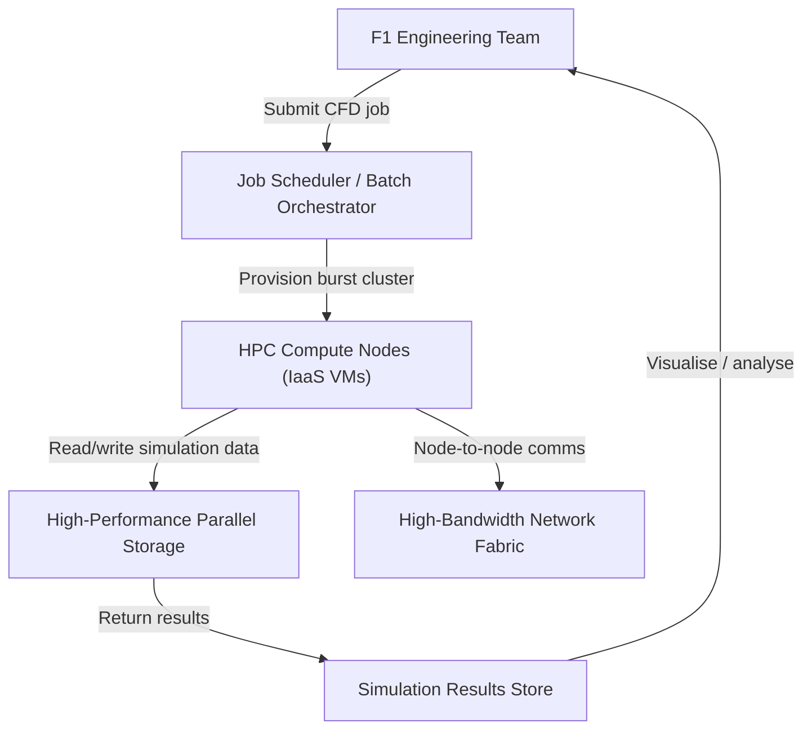
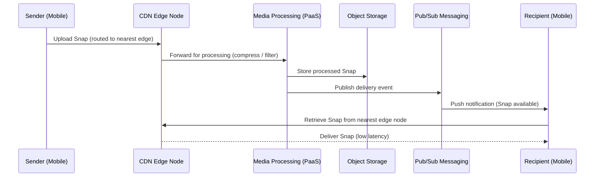
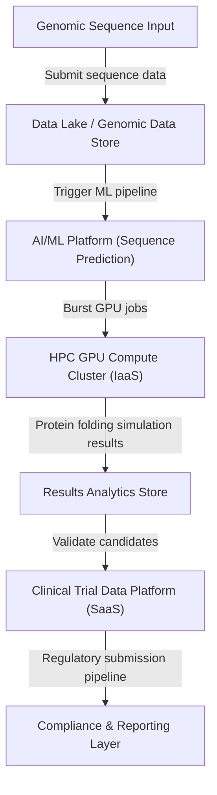

# Cloud Services and Deployment Models: A Cross-Sector Case Study Analysis
*CCF501 Cloud Computing Fundamentals — Assessment 2 Case Study Report*

<!-- RUBRIC: Content, audience and purpose 10% — Introduction must establish cloud context and link to all three case studies -->

---

## 1. Introduction (~400 words)

<!-- SLO a, b, c — Set the scene: what is cloud computing, why does it matter across sectors, and what do the three case studies reveal? -->

Cloud computing has fundamentally reshaped how organisations across every sector deliver services, manage infrastructure, and drive automation. Rather than owning and operating physical data centres, enterprises now consume compute, storage, and intelligence on demand — scaling elastically, paying only for what they use, and offloading infrastructure management to specialist providers (Mell & Grance, 2011). The shift from Capital Expenditure (CAPEX)-heavy on-premises environments to Operational Expenditure (OPEX)-driven cloud models is no longer a trend exclusive to technology companies; it is a cross-industry imperative (Author, Year).

This report analyses three real-world case studies drawn from distinct sectors — Automotive (Formula 1), Multimedia (Snapchat), and Pharmaceutical (Moderna) — each representing a different combination of cloud service model, deployment model, and provider ecosystem. By examining how cloud was applied in each context, this report aims to demonstrate how essential cloud elements enable business automation, distinguish cloud from traditional IT approaches, and identify the key service offerings that made each outcome possible (Author, Year).

<!-- TODO: Expand on why service model and deployment model choices differ by sector — link to NIST essential characteristics (Mell & Grance, 2011) -->

<!-- TODO: Introduce the structure of the report (three case study sections + conclusion) -->

[PLACEHOLDER: ~200 additional words to reach ~400w target — contextualise the challenge each sector faced before cloud adoption and the significance of the outcomes achieved]

---

## 2. Case Study 1: Formula 1 — Automotive (~750 words)

<!-- RUBRIC: Service offerings + deployment model comparison 40% — Must identify specific services, compare deployment models in a table, reflect on outcomes -->
<!-- SLO a: essential computing elements for automation | SLO b: cloud vs traditional IT | SLO c: key service offerings -->

### 2.1 Case Overview

Formula 1 teams operate at the intersection of engineering precision and computational intensity. Aerodynamic simulations — Computational Fluid Dynamics (CFD) workloads — require processing billions of data points to model airflow around a race car chassis. Before cloud adoption, simulation throughput was constrained by on-premises High-Performance Computing (HPC) cluster capacity: fixed hardware meant fixed throughput, introducing bottlenecks at critical design phases of the season (Author, Year).

By migrating CFD workloads to cloud HPC infrastructure, Formula 1 achieved aerodynamic simulations 70% faster than previous models (as cited in CCF501 Assessment 2 Brief, 2024). This outcome was not simply a result of more compute — it was enabled by the cloud's **rapid elasticity** and **on-demand self-service** characteristics (Mell & Grance, 2011), which allowed the team to burst simulation capacity to hundreds or thousands of cores on demand, then release those resources when the run completed.

<!-- TODO: Identify the specific cloud provider and services used (e.g., AWS HPC, Azure HPC, GCP) — verify from course materials or facilitator case study document -->

[PLACEHOLDER: ~100 additional words on case background and cloud provider details]

### 2.2 Service Model Analysis

<!-- RUBRIC: 40% — Identify and analyse the service model (IaaS/PaaS/SaaS); explain how provider services addressed the business challenge -->

Formula 1's CFD workloads align with an **Infrastructure as a Service (IaaS)** model: the team requires direct control over compute instance types, networking configuration, and storage I/O to optimise simulation performance. IaaS provides the raw compute substrate — virtual machines, high-bandwidth storage, and GPU/CPU node types — without abstracting the configuration layer that HPC workflows depend on (McHaney, 2021).

Key services utilised:

| Service Category | Service Example | Role in Case Study |
|---|---|---|
| HPC Compute | [Provider] HPC Cluster / Spot Instances | Burst simulation capacity on demand |
| High-Performance Storage | [Provider] Parallel File System / Object Storage | Low-latency I/O for simulation datasets |
| Networking | High-bandwidth VPC / InfiniBand-equivalent | Node-to-node communication in simulation cluster |
| Orchestration | [Provider] Job Scheduler / Batch | Automated queuing and dispatch of CFD runs |

<!-- TODO: Populate specific provider service names once facilitator case study document is confirmed -->

[PLACEHOLDER: ~150 additional words analysing how each service category contributed to automation outcomes — link to SLO a]

### 2.3 Deployment Model Comparison

<!-- RUBRIC: 40% — Compare and contrast deployment models; table format acceptable here -->

| Deployment Model | Cost | Elasticity | Control | Fit for F1 CFD Workloads |
|---|---|---|---|---|
| On-Premises HPC | High CAPEX — fixed cluster | None — constrained by hardware | Full | Limited — peak capacity becomes a ceiling |
| Private Cloud | Medium CAPEX + ops | Limited | High | Partial — more flexible than bare metal but still fixed ceiling |
| Public Cloud | OPEX — pay per simulation run | High — burst to 1,000s of cores | Moderate | Recommended — elasticity matches variable simulation demand |
| Hybrid Cloud | Medium — dual infrastructure | High with complexity | High | Viable — on-prem for baseline, cloud burst for peaks |

*Table 1: Deployment model trade-offs for Formula 1 CFD workloads.*

<!-- TODO: Justify recommended model with evidence from course materials — link to McHaney (2021), Mell & Grance (2011) -->

[PLACEHOLDER: ~100 additional words contrasting traditional HPC infrastructure with cloud elasticity — link to SLO b]

### 2.4 Cloud Services Analysis

<!-- RUBRIC: 40% — Analyse the application of services; demonstrate understanding of how specific services enable automation outcomes -->

*Figure 1: Formula 1 cloud HPC architecture — CFD job dispatch through burst compute to results storage.*

[PLACEHOLDER: ~150 additional words analysing how the automation pipeline — job dispatch, burst provisioning, results retrieval — maps to NIST essential characteristics (on-demand self-service, rapid elasticity, measured service) — link to SLO a and SLO c]

### 2.5 Reflection

[PLACEHOLDER: ~150 words — reflect on lessons from this case: what made the cloud approach successful, what limitations or risks exist (e.g. data sovereignty for IP-sensitive simulation data, cost management for large burst runs), and what this means for traditional IT in high-performance engineering contexts — link to SLO b]

---

## 3. Case Study 2: Snapchat — Multimedia (~750 words)

<!-- RUBRIC: Service offerings + deployment model comparison 40% -->
<!-- SLO a: essential computing elements | SLO b: cloud vs traditional IT | SLO c: key service offerings -->

### 3.1 Case Overview

Snapchat is a real-time multimedia messaging platform where latency is directly tied to user experience and retention. Sending a *Snap* — a time-limited photo or video — requires media capture, compression, upload, server-side processing, content delivery, and recipient notification to occur within milliseconds. At scale (hundreds of millions of daily active users), even marginal latency improvements have significant product impact.

By migrating to cloud infrastructure and leveraging content delivery and managed media processing services, Snapchat reduced the latency speed of sending *Snaps* by 20% (as cited in CCF501 Assessment 2 Brief, 2024). This outcome reflects the cloud's **broad network access** and **resource pooling** characteristics (Mell & Grance, 2011) — globally distributed edge nodes and shared compute substrates reducing the physical and logical distance between user and processing.

<!-- TODO: Identify specific cloud provider (Google Cloud Platform is the primary Snapchat provider — verify from facilitator case study) -->

[PLACEHOLDER: ~100 additional words on scale context, user base, and the business consequence of latency at Snapchat's scale]

### 3.2 Service Model Analysis

<!-- RUBRIC: 40% — Identify and analyse the service model; explain provider services -->

Snapchat's real-time media delivery aligns with a **Platform as a Service (PaaS)** and **Software as a Service (SaaS)** blend: managed media processing, CDN, and object storage abstract infrastructure concerns, allowing Snapchat engineers to focus on application logic rather than server management (Author, Year).

Key services utilised:

| Service Category | Service Example | Role in Case Study |
|---|---|---|
| Content Delivery Network (CDN) | [Provider] CDN / Edge Caching | Distribute Snap delivery to edge nodes near users |
| Object Storage | [Provider] Blob / Object Storage | Store and retrieve Snap media files at scale |
| Managed Media Processing | [Provider] Transcoding / ML APIs | Compress, filter, and process Snap content server-side |
| Real-time Messaging / Pub-Sub | [Provider] Pub/Sub / Messaging | Notify recipients of new Snaps instantly |
| Autoscaling Compute | [Provider] Managed Container Service | Scale processing capacity with user demand |

<!-- TODO: Populate specific provider service names once facilitator case study confirmed -->

[PLACEHOLDER: ~150 additional words analysing how CDN placement and edge processing reduce round-trip latency — link to SLO a and SLO c]

### 3.3 Deployment Model Comparison

| Deployment Model | Latency | Global Reach | Cost | Fit for Snapchat |
|---|---|---|---|---|
| On-Premises Data Centre | High — centralised processing | None — single geography | High CAPEX | Not suitable — single DC cannot serve global users at low latency |
| Private Cloud | Medium | Limited to owned DCs | High CAPEX + ops | Partial — no global edge footprint |
| Public Cloud | Low — edge CDN nodes globally | High — multi-region | OPEX | Recommended — global PoP network reduces user-to-server distance |
| Multi-Cloud | Lowest (optimised routing) | Highest | Complex OPEX | Advanced option — Snapchat uses GCP primary + edge partners |

*Table 2: Deployment model trade-offs for Snapchat real-time media delivery.*

[PLACEHOLDER: ~100 additional words contrasting traditional centralised media delivery with distributed cloud CDN — link to SLO b]

### 3.4 Cloud Services Analysis

*Figure 2: Snapchat cloud media delivery pipeline — edge upload, server-side processing, CDN distribution.*

[PLACEHOLDER: ~150 additional words mapping each service to NIST characteristics (broad network access, resource pooling) and explaining how the pipeline achieves 20% latency reduction — link to SLO a and SLO c]

### 3.5 Reflection

[PLACEHOLDER: ~150 words — reflect on Snapchat's case: what made the cloud architecture successful for real-time media at scale, what risks exist (data privacy for user-generated content, cost at petabyte scale, CDN vendor dependency), and how this differs from a traditional content delivery approach — link to SLO b]

---

## 4. Case Study 3: Moderna — Pharmaceutical (~750 words)

<!-- RUBRIC: Service offerings + deployment model comparison 40% -->
<!-- SLO a: essential computing elements | SLO b: cloud vs traditional IT | SLO c: key service offerings -->

### 4.1 Case Overview

Moderna is a biotechnology company whose core product — mRNA-based therapeutics — depends on rapid genomic sequencing, protein structure modelling, and clinical trial data analysis. Vaccine development traditionally takes years, constrained by laboratory throughput, sequential experiment cycles, and siloed data systems. When the SARS-CoV-2 genome was published in January 2020, Moderna's ability to sequence and begin developing its mRNA COVID-19 vaccine in just 48 hours represented a paradigm shift for pharmaceutical R&D (as cited in CCF501 Assessment 2 Brief, 2024).

Cloud computing was central to this speed: AI/ML-driven genomic analysis, elastic HPC for protein folding simulations, and collaborative data platforms enabled Moderna to compress what would have been weeks of sequential laboratory work into parallel cloud-accelerated pipelines (Author, Year). This is a direct demonstration of cloud's **measured service** and **on-demand self-service** characteristics enabling automation at scientific scale (Mell & Grance, 2011).

<!-- TODO: Identify specific cloud provider (AWS is Moderna's primary cloud partner — verify from facilitator case study) -->

[PLACEHOLDER: ~100 additional words on context: the COVID-19 timeline, what 48-hour sequencing means relative to traditional timelines, and the business/public health implications]

### 4.2 Service Model Analysis

<!-- RUBRIC: 40% — Identify and analyse the service model -->

Moderna's workloads span multiple service models. Genomic sequencing pipelines and AI/ML model training leverage **IaaS** (GPU compute clusters) and **PaaS** (managed ML platforms), while clinical trial data management and regulatory reporting use **SaaS** platforms integrated into the cloud ecosystem (Author, Year).

Key services utilised:

| Service Category | Service Example | Role in Case Study |
|---|---|---|
| AI/ML Platform | [Provider] ML Platform / SageMaker | Train and deploy mRNA sequence prediction models |
| HPC / GPU Compute | [Provider] GPU Instances (IaaS) | Run protein folding and genomic simulations at scale |
| Data Lake / Analytics | [Provider] Data Lake / Big Data Platform | Store and query large genomic and clinical datasets |
| Secure Collaboration | [Provider] Secure File Share / VPN | Enable cross-institutional data sharing under compliance |
| Managed Database | [Provider] Managed Relational DB | Store structured trial data with HIPAA-compliant controls |

<!-- TODO: Populate specific provider services once facilitator case study confirmed -->

[PLACEHOLDER: ~150 additional words analysing how AI/ML automation and elastic compute parallelised what were previously sequential lab workflows — link to SLO a and SLO c]

### 4.3 Deployment Model Comparison

| Deployment Model | Data Control | Compliance | Scalability | Fit for Moderna |
|---|---|---|---|---|
| On-Premises | Full | Manageable internally | Limited — fixed capacity | Inadequate — cannot burst for emergency genomic analysis |
| Private Cloud | High | High | Moderate | Partial — improved elasticity but limited global collaboration |
| Public Cloud | Shared responsibility | Provider certification required | High | Viable with HIPAA/GxP-compliant provider services |
| Hybrid Cloud | High (sensitive data on-prem) | High | High | Recommended — sensitive genomic IP on-prem, burst HPC and AI to public cloud |

*Table 3: Deployment model trade-offs for Moderna pharmaceutical R&D.*

[PLACEHOLDER: ~100 additional words justifying hybrid as the recommended model — link to compliance requirements (HIPAA, GxP) and the need for elastic burst capacity — link to SLO b]

### 4.4 Cloud Services Analysis

*Figure 3: Moderna cloud R&D pipeline — genomic input through AI/ML, HPC simulation, and clinical data management.*

[PLACEHOLDER: ~150 additional words mapping pipeline stages to NIST characteristics (on-demand self-service, rapid elasticity, measured service) and explaining how parallel cloud pipelines collapsed the traditional 48-week timeline to 48 hours — link to SLO a and SLO c]

### 4.5 Reflection

[PLACEHOLDER: ~150 words — reflect on Moderna's case: what made the cloud approach transformational for pharmaceutical R&D, what risks exist (genomic data sovereignty, regulatory compliance, IP security in shared cloud environments), and what this means for the future of cloud in life sciences — link to SLO b]

---

## 5. Conclusion (~250 words)

<!-- RUBRIC: Content and purpose 10% — Summary only; no new information; no tables, graphs, or dot points -->
<!-- NOTE: Brief requires conclusion to be written in complete sentences and paragraphs — no lists or diagrams -->

<!-- SLO a, b, c — Bring together the three case studies, restate key insights, and identify areas for further investigation -->

[PLACEHOLDER: ~250 words — structured as prose paragraphs only]

Paragraph 1 — Synthesise the three cases: what common cloud principles (elasticity, on-demand provisioning, managed services) underpinned the outcomes across Formula 1, Snapchat, and Moderna, despite the different sectors, service models, and deployment models each employed.

Paragraph 2 — Contrast with traditional IT: in each case, fixed on-premises infrastructure would have imposed a ceiling on throughput, reach, or speed that the cloud removed — reinforcing the fundamental distinction between CAPEX-constrained traditional IT and OPEX-elastic cloud (Mell & Grance, 2011; McHaney, 2021).

Paragraph 3 — Key service offerings identified across cases and their significance for major cloud providers. Identify gaps or areas requiring further investigation (e.g. cost governance for burst workloads, compliance frameworks for regulated industries, multi-cloud portability).

---

## References

<!-- APA 7th edition format — minimum 10–12 references -->
<!-- RUBRIC: Citations 10% — in-text citations must appear throughout report; min 10 resources; no APA errors -->

Author, A. A. (Year). *Title of work: Capital letter also for subtitle*. Publisher. https://doi.org/xxxxx

Author, B. B., & Author, C. C. (Year). Title of article. *Journal Name, Volume*(Issue), page–page. https://doi.org/xxxxx

Amazon Web Services. (n.d.). *AWS for Formula 1* [Case study]. https://[verify-url]

Amazon Web Services. (n.d.). *AWS for Moderna* [Case study]. https://[verify-url]

Google Cloud. (n.d.). *Snapchat on Google Cloud* [Case study]. https://[verify-url]

McHaney, R. (2021). *Cloud technologies: An overview of cloud computing technologies for managers.* Wiley. https://ieeexplore-ieee-org.torrens.idm.oclc.org/servlet/opac?bknumber=9820907

Mell, P., & Grance, T. (2011). *The NIST definition of cloud computing* (Special Publication 800-145). National Institute of Standards and Technology. https://doi.org/10.6028/NIST.SP.800-145

Manvi, S., & Shyam, G. K. (2021). *Cloud computing: Concepts and technologies* (Chapter 4). CRC Press. https://learning-oreilly-com.torrens.idm.oclc.org/library/view/cloud-computing/9781000338058/

Nishimura, H. (2022, August 30). *Introduction to AWS for non-engineers: 1 cloud concepts* [Video]. LinkedIn Learning. https://www.linkedin.com/learning/introduction-to-aws-for-non-engineers-1-cloud-concepts-2/

<!-- PLACEHOLDER REF 9 — Add provider-specific reference (e.g. Azure, GCP documentation) -->
Author, D. D. (Year). *Title*. Publisher.

<!-- PLACEHOLDER REF 10 — Add peer-reviewed journal article on cloud in one of the three sectors -->
Author, E. E. (Year). Title of article. *Journal Name, Volume*(Issue), page–page. https://doi.org/xxxxx

<!-- PLACEHOLDER REF 11 — Add case study or industry report (e.g. Gartner, IDC, McKinsey on cloud adoption) -->
Author, F. F. (Year). *Title of report*. Organisation. https://[url]

<!-- PLACEHOLDER REF 12 — Add additional academic or technical reference -->
Author, G. G. (Year). Title of article. *Journal Name, Volume*(Issue), page–page. https://doi.org/xxxxx
