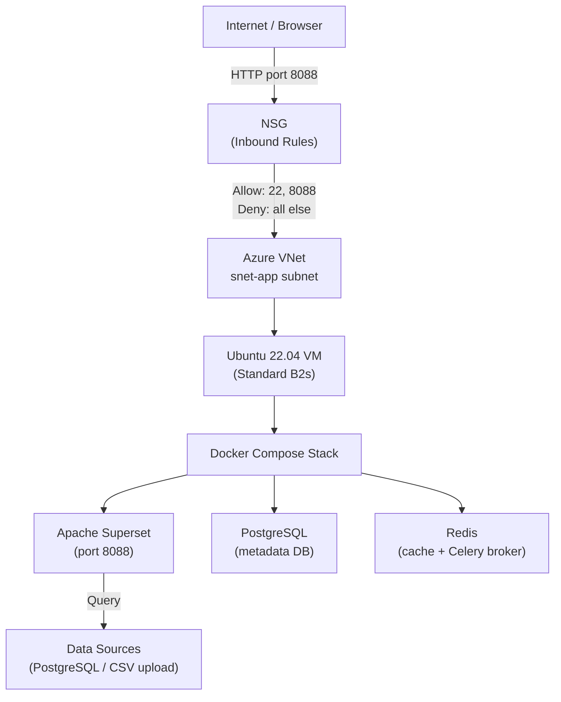

# Deploying Apache Superset on Microsoft Azure: A Cloud Application Deployment Report
*CCF501 Cloud Computing Fundamentals — Assessment 3 Report*

<!-- WORD COUNT TARGET: ~1,500 words (±10%), excluding references and appendices -->
<!-- STRUCTURE: Introduction (~100w) + Background (~200w) + Body 2a–2e (~1,000w) + Conclusion (~200w) -->
<!-- RUBRIC WEIGHTS: Cloud concepts 20% | Practical skills 40% | Cloud services 10% | Security/governance 20% | References 10% -->

---

## 1. Introduction (~100 words)

<!-- RUBRIC: Content, audience, purpose — state what is being deployed and why Azure was selected -->
<!-- SLO c, d: provider selection rationale; deployment overview -->
<!-- NOTE: No tables, diagrams, or dot points in this section -->

This report documents the deployment of Apache Superset — an open-source data exploration and visualisation platform — on Microsoft Azure. Superset was selected for its direct relevance to data engineering workflows and its Python-native architecture, which aligns with the author's professional background and academic trajectory. Azure was chosen as the cloud provider to build familiarity ahead of the AZ-900 and DP-900 certification pathway, as recommended during academic advising in March 2026. The deployment covers the provisioning of a virtual machine, virtual network, firewall security policy, and a fully operational Superset instance accessible via public URL.

---

## 1.2 Background (~200 words)

<!-- RUBRIC: 20% — Describe cloud computing essentials; distinguish from traditional IT -->
<!-- SLO a, b: NIST characteristics; cloud vs on-premises -->
<!-- NOTE: Complete sentences and paragraphs only — no tables, diagrams, or dot points -->

In a traditional IT environment, standing up a data visualisation platform would require procuring physical server hardware, configuring a local network, applying firewall rules at the rack level, and maintaining that infrastructure indefinitely. For an individual developer or small team, that overhead makes self-hosted analytics tooling impractical outside enterprise settings.

Cloud computing removes that barrier. The National Institute of Standards and Technology (NIST) defines cloud computing as on-demand network access to a shared pool of configurable computing resources, characterised by five essential properties: on-demand self-service, broad network access, resource pooling, rapid elasticity, and measured service (Mell & Grance, 2011). These properties shift infrastructure from a capital expenditure to an operational one — organisations pay only for what they use, without fixed-capacity procurement or physical hardware management (McHaney, 2021).

This deployment uses an **Infrastructure as a Service (IaaS)** model: Azure provides the virtual machine, virtual network, and compute layer; the operating system, container runtime, and application stack are managed by the author. The deployment model is **public cloud** — hosted on Azure's shared global infrastructure and secured through network-level access policies. Where a traditional server setup requires weeks of procurement and physical installation, the same outcome here was achieved through a browser-based portal at effectively zero capital cost (IBM, n.d.-a).

---

## 2. Body (~1,000 words)

### 2a. Service Provider Selection Rationale (~150 words)

<!-- RUBRIC: 10% — Identify key cloud services; compare providers; justify selection -->
<!-- SLO c: key service offerings and comparison -->

Microsoft Azure was selected for three reasons. First, its data and analytics ecosystem — Azure SQL, Synapse Analytics, and Data Factory — directly complements Superset's role as a query and visualisation layer, relevant to current data engineering work and the BDA601 subject ahead. Second, Azure is the target certification platform (AZ-900 → DP-900), making hands-on deployment a practical study activity. Third, Azure's free-tier eligibility lowers the barrier; the deployment uses B2s (2 vCPU, 4 GB RAM) as Superset's Docker stack requires more RAM than the free B1s allows, covered by student credits.

| Criterion | AWS | Microsoft Azure | GCP |
|---|---|---|---|
| Free tier VM | t2.micro (750h/mo) | B1s (750h/mo) | e2-micro (always free) |
| Cost model | PAYG / Reserved (75% off) / Spot | PAYG / Reserved (72% off) / Spot | PAYG / Committed use (70% off) / Spot |
| Resource elasticity | Auto Scaling + ELB | VM Scale Sets + ALB | Managed Instance Groups + CLB |
| Data/ML integration | RDS, Redshift, SageMaker | Azure SQL, Synapse, Azure ML | BigQuery, Vertex AI |
| Cert alignment | ❌ | ✅ AZ-900 / DP-900 | ❌ |

*Table 1: Cloud provider comparison for Apache Superset deployment.*

---

### 2b. Deployment Model and Architecture Diagram (~150 words)

<!-- RUBRIC: 40% practical skills — block diagram required; describe deployment model -->
<!-- SLO d: implement cloud services -->

The deployment follows a **public cloud IaaS** model. All resources are provisioned within a single Azure Resource Group, logically isolated by a Virtual Network (VNet) with a dedicated application subnet. A Network Security Group (NSG) enforces inbound traffic rules, restricting access to SSH (port 22, source IP restricted) and the Superset web interface (port 8088). HTTP (port 80) and HTTPS (port 443) are intentionally excluded — Superset is accessed directly on port 8088, and TLS termination is identified as a future improvement in Section 2e. Apache Superset runs inside a Docker Compose stack on an Ubuntu 22.04 virtual machine, with PostgreSQL as the metadata database and Redis as the caching and Celery task broker.

*Figure 1: Azure deployment architecture — resource group, VNet, NSG, VM, and Superset Docker Compose stack.*

---

### 2c. Deployment Procedure (~400 words)

<!-- RUBRIC: 40% — Document all four tasks with screenshots; clear flow of steps and arguments -->
<!-- SLO d: implement cloud services via major cloud providers -->

The deployment followed the account setup and four tasks specified in the assessment brief.

**Account registration and Azure portal setup**

An Azure account was activated at portal.azure.com using the student enrolment email. Azure's free account provides USD $200 in credits for 30 days alongside always-free services, covering the compute and networking requirements for this project (Microsoft, n.d.-d). The portal confirmed an active subscription in Australia East, providing the foundation for all subsequent resource provisioning.

*Figure 2: Azure portal — active subscription confirmed in Australia East.*

**Task a — Create a resource group**

A resource group (`rg-superset-ccf501`) was created in the Azure portal under Australia East. Resource groups are logical containers for cloud resources, enabling unified billing, access control, and lifecycle management (Microsoft, n.d.-a). Australia East was selected to minimise latency and maintain local data residency.

*Figure 3: Resource group rg-superset-ccf501 in Australia East.*

**Task b — Add a virtual network**

A Virtual Network (`vnet-superset`, `10.0.0.0/16`) was created with a dedicated application subnet (`snet-app`, `10.0.1.0/24`). VNets provide private network isolation — resources communicate internally without traversing the public internet (Microsoft, n.d.-b). This reflects NIST's resource pooling characteristic: shared physical infrastructure partitioned into isolated, private network boundaries (Mell & Grance, 2011).

*Figure 4: VNet vnet-superset with subnet snet-app.*

**Task c — Protect the network with a firewall / security policy**

A Network Security Group (`nsg-superset`) was attached to the `snet-app` subnet. Inbound rules allow SSH (port 22, restricted to the author's IP) and the Superset port (8088); all other inbound traffic is denied by default. Ports 80 and 443 are intentionally excluded — this implements the principle of least privilege, exposing only the minimum required access (Shore, 2020).

*Figure 5: NSG inbound rules — allow 22 (restricted to author IP) and 8088, deny all else.*

**Task d — Deploy Apache Superset**

An Ubuntu 22.04 VM (Standard B2s: 2 vCPU, 4 GB RAM) was provisioned within `snet-app` and assigned a public IP. Docker and Docker Compose were installed via SSH, and the Superset Docker Compose stack was launched with `docker-compose up -d`. Superset was then accessible at `http://[PUBLIC_IP]:8088`; an admin account was created and a PostgreSQL data source connected to confirm end-to-end functionality.

*Figure 6: Azure virtual machine overview showing Ubuntu host, running status, and public IP used for deployment access.*

*Figure 7: Apache Superset login screen accessible at the Azure VM public IP on port 8088.*

*Figure 8: Apache Superset running successfully with a connected dataset and working analytics interface.*

---

### 2d. Cloud Services Security Policies (~150 words)

<!-- RUBRIC: 20% — Appraise IT governance; identify threats; draft and implement security policy -->
<!-- SLO e: appraise IT governance requirements to safeguard cloud-driven business solutions -->

Security was addressed at three layers. At the **network layer**, the NSG enforces least-privilege access: port 22 is restricted to a single authorised IP, with all other inbound traffic blocked by default. At the **application layer**, Superset's RBAC provides three roles: Admin (full access), Alpha (create dashboards and run queries), and Gamma (view-only). At the **credential layer**, the secret key and database connection string are injected via environment variables — never hardcoded in source files.

| Security Layer | Control | Threat Mitigated |
|---|---|---|
| Network (NSG) | Port allowlist + IP restriction on SSH | Unauthorised access, port scanning |
| Application (RBAC) | Admin / Alpha / Gamma roles | Privilege escalation, data exfiltration |
| Credentials | Environment variables (`.env` file) | Credential exposure in source control |
| OS | SSH key-based auth only (password disabled) | Brute-force attacks |

*Table 2: Security controls applied across network, application, credential, and OS layers.*

*Figure 9: Apache Superset RBAC role configuration.*

---

### 2e. Application Analysis and Robustness (~150 words)

<!-- RUBRIC: 40% practical skills — analyse application; propose improvements -->
<!-- SLO c, d: identify cloud services; implement improvements -->

The current deployment is functional but represents a minimal viable configuration. The primary limitation is a **single point of failure**: one VM hosts the entire stack — if the VM becomes unavailable, the service is offline. A production-grade architecture would introduce the following improvements.

**HTTPS / TLS termination:** An Azure Application Gateway or Let's Encrypt certificate via nginx would encrypt traffic in transit. Currently, credentials are sent over HTTP.

**Managed PostgreSQL:** Replacing the Docker-hosted PostgreSQL instance with Azure Database for PostgreSQL provides automated backups, point-in-time restore, and high availability — eliminating the metadata loss risk if the VM disk fails.

**Async query workers:** Production Superset separates the web server from Celery workers for long-running queries, reusing the Redis broker already present in the Docker Compose stack. This pattern was previously applied by the author in Konquista — a WhatsApp automation platform built in Django + Celery + Redis that handled 1,000+ daily messages — where separating async workers from the web process eliminated UI blocking under load.

**Azure Monitor + alerts:** Attaching Azure Monitor to the VM provides CPU, memory, and disk metrics — enabling proactive alerting before resource exhaustion causes downtime.

| Improvement | Azure Service | Benefit |
|---|---|---|
| HTTPS | Application Gateway / Let's Encrypt | Encrypts traffic in transit |
| Managed DB | Azure Database for PostgreSQL | Automated backups, HA |
| Async queries | Celery + Redis (existing in Docker Compose) | Prevents UI blocking on long queries |
| Monitoring | Azure Monitor + Alerts | Proactive resource and availability alerting |
| Auto-scaling | Azure VM Scale Sets | Handles traffic spikes without manual intervention |

*Table 3: Proposed production improvements for the Superset deployment.*

---

## 3. Conclusion (~200 words)

<!-- RUBRIC: Content, purpose — summary only; no new info; no tables, diagrams, or dot points -->
<!-- SLO a, b, c, d, e — synthesise deployment outcomes -->
<!-- NOTE: Complete sentences and paragraphs only -->

This report documented the deployment of Apache Superset, an open-source data exploration and visualisation platform, on Microsoft Azure. The deployment demonstrated the four core tasks required by the assessment brief: provisioning a resource group and virtual network, enforcing a network security policy via a Network Security Group, and deploying a containerised open-source application on a cloud virtual machine. Each task was supported by screenshots and aligned with NIST's essential cloud characteristics — on-demand self-service in the provisioning process, resource pooling in Azure's shared infrastructure model, and measured service through consumption-based billing (Mell & Grance, 2011).

Microsoft Azure was selected for its data and analytics service ecosystem and its alignment with the author's AZ-900 and DP-900 certification pathway. The deployment reinforces the distinction between cloud and traditional IT infrastructure: resources that would require physical procurement and installation in an on-premises environment were provisioned, configured, secured, and running within [X] hours, at effectively zero capital cost. Areas identified for further investigation include TLS certificate automation, managed database integration for metadata persistence, and the separation of Celery workers for production-scale async query execution — improvements that would bring this deployment in line with enterprise-grade analytics infrastructure.

---

## References

<!-- APA 7th edition — minimum 10–12 references, alphabetical by first author surname -->
<!-- RUBRIC: 10% — meticulous APA, min 10 resources, in-text citations throughout -->

Amazon Web Services. (n.d.). *AWS free tier*. Amazon Web Services. https://aws.amazon.com/free/

Apache Software Foundation. (n.d.). *Apache Superset documentation*. Apache Superset. https://superset.apache.org/docs/intro

Google Cloud. (n.d.). *Google Cloud free program*. Google Cloud. https://cloud.google.com/free

IBM. (n.d.-a). *SaaS, PaaS, IaaS explained*. IBM. https://www.ibm.com/think/topics/iaas-paas-saas

IBM. (n.d.-b). *What is a virtual network?* IBM. https://www.ibm.com/think/topics/virtual-network

Linthicum, D. (2021, May 25). *Learning cloud computing: Core concepts* [Video]. LinkedIn Learning. https://www.linkedin.com/learning/learning-cloud-computing-core-concepts-13710481/

Manvi, S., & Shyam, G. K. (2021). *Cloud computing: Concepts and technologies* (Chapter 4). CRC Press. https://learning-oreilly-com.torrens.idm.oclc.org/library/view/cloud-computing/9781000338058/

McHaney, R. (2021). *Cloud technologies: An overview of cloud computing technologies for managers*. Wiley. https://ieeexplore-ieee-org.torrens.idm.oclc.org/servlet/opac?bknumber=9820907

Mell, P., & Grance, T. (2011). *The NIST definition of cloud computing* (Special Publication 800-145). National Institute of Standards and Technology. https://doi.org/10.6028/NIST.SP.800-145

Microsoft. (n.d.-a). *What is Azure Resource Manager?* Microsoft Learn. https://learn.microsoft.com/en-us/azure/azure-resource-manager/management/overview

Microsoft. (n.d.-b). *Azure Virtual Network documentation*. Microsoft Learn. https://learn.microsoft.com/en-us/azure/virtual-network/

Microsoft. (n.d.-c). *Network security groups*. Microsoft Learn. https://learn.microsoft.com/en-us/azure/virtual-network/network-security-groups-overview

Microsoft. (n.d.-d). *Create your Azure free account today*. Microsoft Azure. https://azure.microsoft.com/en-au/free/

Nishimura, H. (2022, August 30). *Introduction to AWS for non-engineers: 1 cloud concepts* [Video]. LinkedIn Learning. https://www.linkedin.com/learning/introduction-to-aws-for-non-engineers-1-cloud-concepts-2/

Shore, M. (2020). *Cybersecurity with cloud computing: Service models* [Video]. LinkedIn Learning. https://www.linkedin.com/learning/cybersecurity-with-cloud-computing-2/

---

## Appendices

### Appendix A — Deployment Task Checklist

| Task | Description | Status | Screenshot |
|---|---|---|---|
| 0 | Register Azure account / verify active subscription | 🕐 | Figure 2 |
| a | Create resource group (`rg-superset-ccf501`) | 🕐 | Figure 3 |
| b | Add virtual network (`vnet-superset` + `snet-app`) | 🕐 | Figure 4 |
| c | Apply NSG inbound rules (22/8088) | 🕐 | Figure 5 |
| d | Deploy Apache Superset via Docker Compose | 🕐 | Figures 6–8 |

>*Table A1: Deployment task checklist with status and corresponding screenshots.*

### Appendix B — Glossary

| Term | Meaning |
|---|---|
| IaaS | Infrastructure as a Service |
| NSG | Network Security Group |
| VNet | Virtual Network |
| RBAC | Role-Based Access Control |
| Docker Compose | Tool for defining and running multi-container Docker applications |
| Celery | Distributed task queue for Python applications |
| TLS | Transport Layer Security — encrypts data in transit |
| NIST | National Institute of Standards and Technology |
| AZ-900 | Microsoft Azure Fundamentals certification |
| DP-900 | Microsoft Azure Data Fundamentals certification |
| SPOF | Single Point of Failure |

> *Table B1: Glossary of technical terms used in the report.*