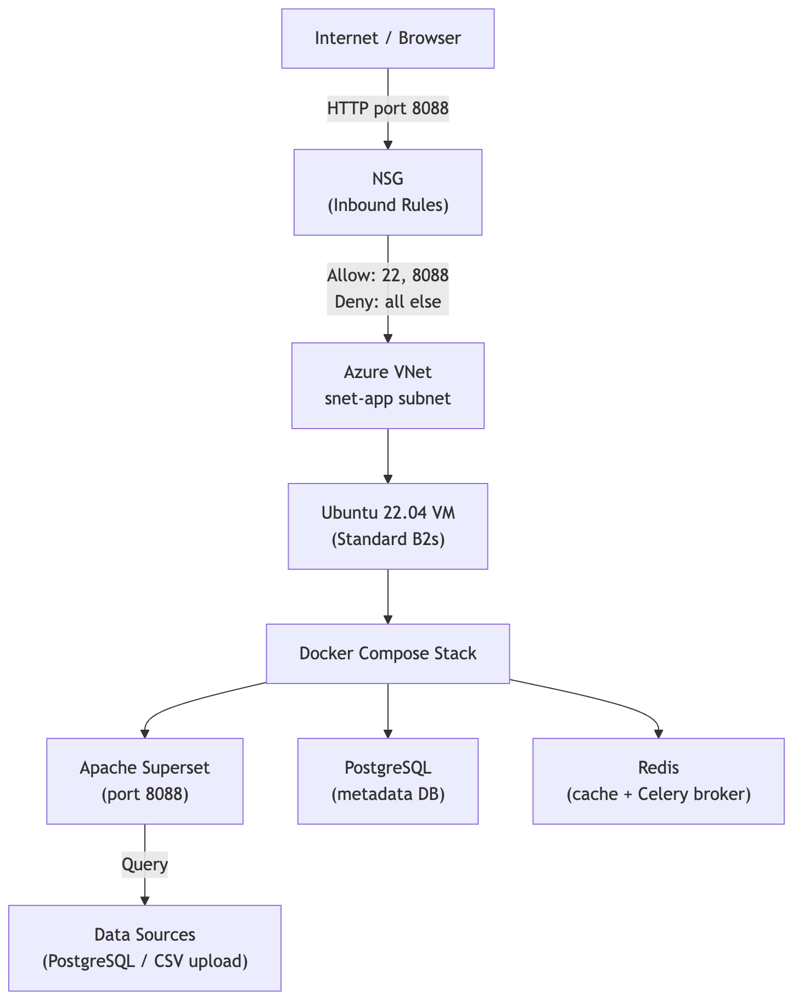
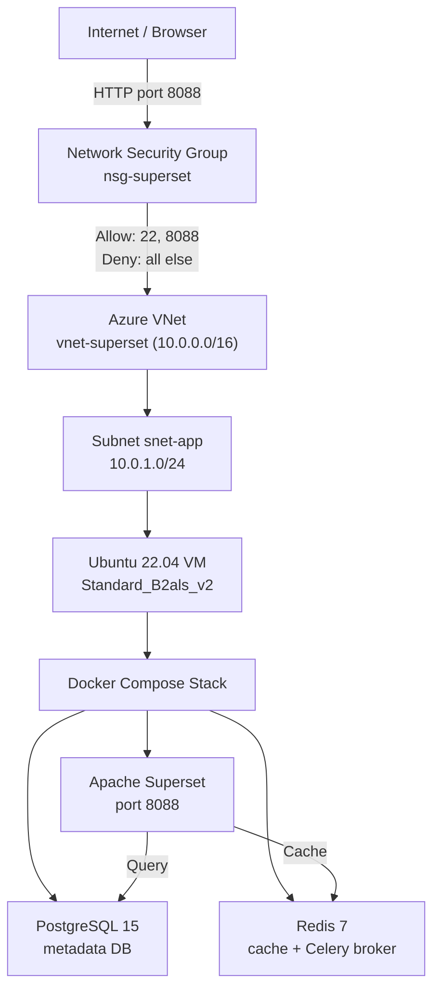
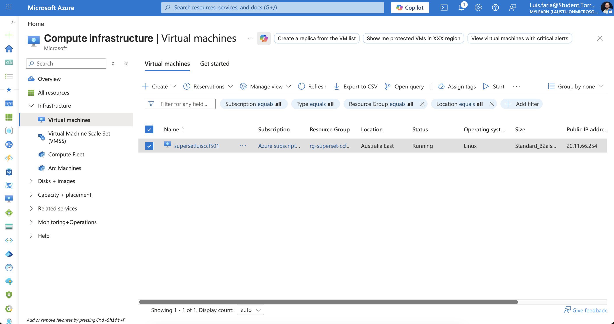
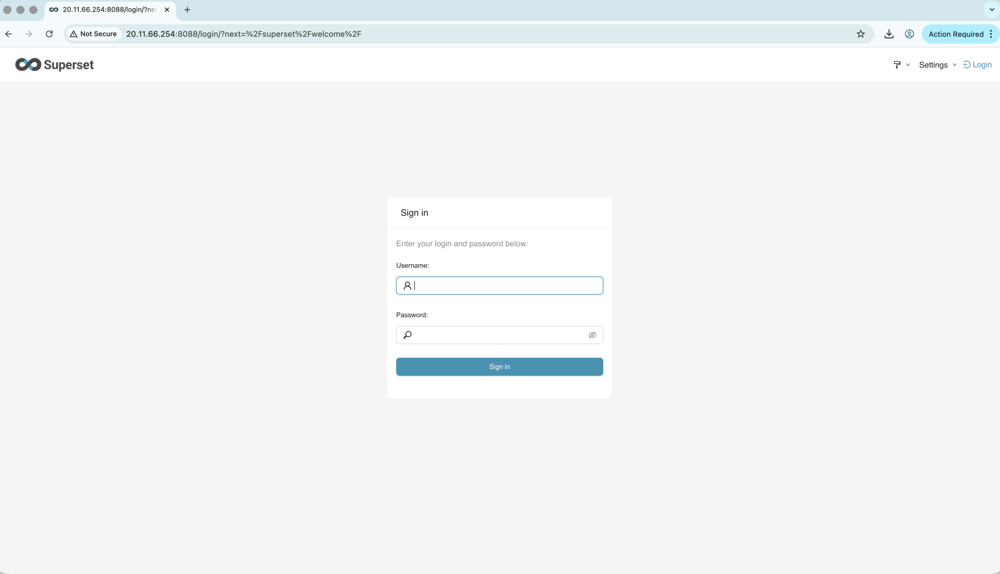
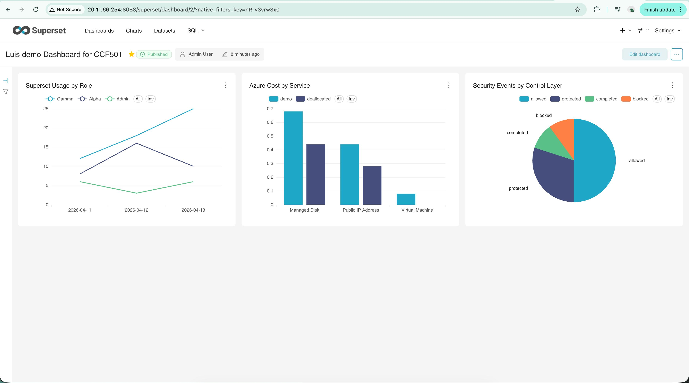
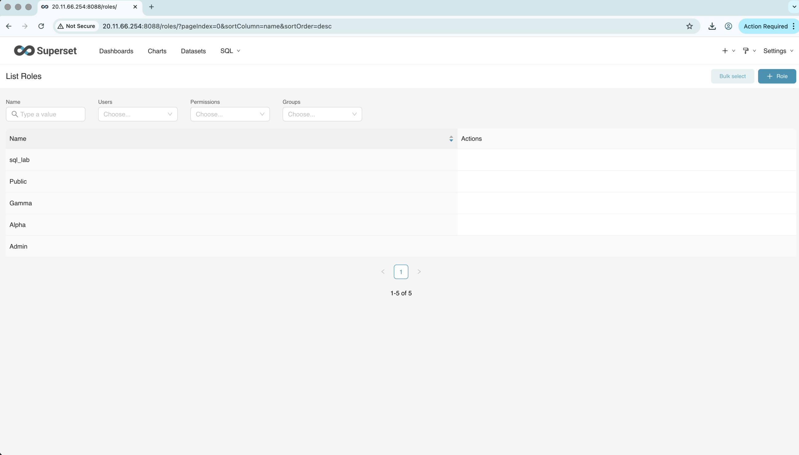
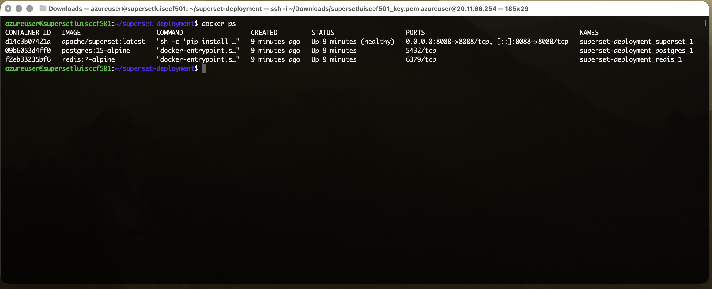

# Deploying Apache Superset on Azure From Scratch: My CCF501 Assessment 3

Tags: #cloudcomputing #azure #apache #superset #dataengineering

---

**Assessment 1 taught me how to *reason* about cloud architecture. Assessment 3 forced me to *put one on the wire* - and prove it works.**

---

## The Jump From Diagrams to Reality

A couple of weeks ago I wrote my Cloud Computing Fundamentals (CCF501) Assessment 1, a 1,500-word architecture proposal for a fictional startup, full of NIST characteristics and Mermaid diagrams (read: [CCF501 Assessment 1 write-up](https://dev.to/lfariaus/designing-a-cloud-architecture-from-scratch-my-ccf501-assessment-1-4c25)).

Assessment 3 was different. The brief gave me four tasks: resource group, virtual network, firewall, application - and asked me to actually do them on a real cloud, with real screenshots, on a public IP. No more reasoning about Auto Scaling: provision the VM, open the port and make the application return a 200.

This article is the deployment story documenting what I built, why I picked an open-source tool nobody else in my cohort was deploying, and the security and governance choices I had to defend with evidence instead of paragraphs.


*Deployment architecture — single Azure Resource Group containing the VNet, NSG, VM, and the Superset / Postgres / Redis Docker stack.*

---

## Course Context: CCF501 in 12 Weeks

I'm doing my Master's in Software Engineering & AI ([open-sourced repo with +1000 commits in ~1 year of work](https://github.com/lfariabr/masters-swe-ai)) at Torrens University Australia. **[CCF501 - Cloud Computing Fundamentals](https://github.com/lfariabr/masters-swe-ai/tree/master/2026-T1/CCF/)** is one of the two subjects in my current term (T1-2026). The 12-week ride covers ground in this order:

1. Traditional vs modern computing
2. Cloud essentials (NIST 5)
3. Deployment models (public / private / hybrid)
4. Service models (IaaS / PaaS / SaaS)
5. Major providers (AWS / Azure / GCP)
6. Advanced cloud concepts (XaaS, hands-on AWS/Azure lab)
7. Public/private/hybrid trade-offs
8. Deployment case studies
9. Governance and legal obligations
10. Cloud security threats
11. Security policy planning
12. Implementation of security policy at various providers

The assessments mirror that arc. Assessment 1 (week 4): a technology report on cloud's contribution to business automation; Assessment 2 (week 8): a case study comparing deployment models; Assessment 3 (week 12): build something. The whole subject converges on one question: *can you actually deploy and secure a real application?*

In parallel, I'm taking [**ISY503 Intelligent Systems**](https://github.com/lfariabr/masters-swe-ai/tree/master/2026-T1/ISY), and the more I sit with that coursework, the more obvious it gets: an ML model on a laptop helps nobody: deployment is the work and CCF501 makes that real.

---

## Why Apache Superset (The Off-List Bet)

The brief suggested apps like [Moodle](https://moodle.org/), [ThingsBoard](https://thingsboard.io/), [KaaIOT](https://kaaiot.com/), or [Jira](https://www.atlassian.com/software/jira), but I didn't pick any of them.

I picked [**Apache Superset**](https://superset.apache.org/) - an open-source data exploration and visualisation platform originally built at Airbnb, now an Apache top-level project. SQL Lab, 40+ chart types, dashboards, role-based access control, connectors for everything from PostgreSQL to BigQuery to Snowflake.

4 reasons it was the right call for me:

1. **Python-native.** Python is my primary stack. Reading the source, debugging containers, extending it later, all roads stay on familiar ground.
2. **RBAC depth.** Superset ships with 3 meaningful roles out of the box (Admin / Alpha / Gamma). The assessment rubric weights security and governance at 20%, and rich RBAC writes that section for you instead of forcing it.
3. **Career fit.** I work as a Data Analyst at a school in Sydney, building SQL pipelines and reports. Superset is the cloud-deployed version of that exact work, and it feeds directly into my T4 subject **BDA601 Big Data & Analytics** in T2-2026. The deployment becomes infrastructure for the next subject, not a throwaway.
4. **Differentiation.** Nobody else in the cohort is deploying Superset. Off-list choice → harder to defend → deeper learning → stronger portfolio piece.

I considered Metabase (simpler, faster) and MLflow (better long-term MLOps story). Both are legit. Superset won because the trade: slightly higher complexity for a richer governance story and a Python-aligned platform, was the one I wanted to make. See my [*brainstorm notes here*](https://github.com/lfariabr/masters-swe-ai/tree/master/2026-T1/CCF/assignments/Assessment3/brainstorm.md).

---

## The Architecture

Here's what got deployed:



The whole thing lives in a single Azure Resource Group (`rg-superset-ccf501`) in **Australia East**. One VNet, one subnet, one NSG, one VM. Superset, PostgreSQL 15, and Redis 7 run as 3 containers via Docker Compose on the VM.


VM size landed on `Standard_B2als_v2` — the always-free B1s tier (1 vCPU, 1 GiB RAM) does not have enough memory to reliably run the full Superset + PostgreSQL + Redis stack. 

I spun up the VM only when capturing evidence, then immediately stopped and deallocated it. According to the Azure Retail Prices API (checked 30 April 2026), the `Standard_B2als_v2` in Australia East costs roughly **US$0.0475 per hour** (compute only).

| Window | Rough compute cost |
|------------|---|
| 4 hours (one capture session) | ~US$0.19 |
| 48 hours (two-day evidence window) | ~US$2.28 |
| 730 hours (left running for a full month) | ~US$34.68 |

This reinforced a key practical lesson: cloud resources are cheap when deliberately managed, and surprisingly expensive when forgotten.


*Azure VM `supersetluisccf501` — Ubuntu 22.04, `Standard_B2als_v2`, public IP attached, running state visible in the portal.*

---

## Why IaaS, Not PaaS?

I could have used [Azure Container Instances](https://learn.microsoft.com/en-us/azure/container-instances/), [App Service for Containers](https://learn.microsoft.com/en-us/azure/app-service/configure-custom-container), or [AKS](https://learn.microsoft.com/en-us/azure/aks/). I chose IaaS because the assessment was explicitly about provisioning a VM, VNet, firewall policy, and application stack. The trade-off was more operational responsibility, but more visibility into the cloud fundamentals the subject was assessing.

| Option | Service model | What's managed for you | Why I didn't pick it (this assessment) |
|---|---|---|---|
| **Azure Container Instances** | Serverless containers | Hosts, OS, scaling | Hides the VNet/NSG/VM layer the rubric was testing |
| **App Service for Containers** | PaaS (managed runtime) | OS, runtime, TLS, autoscaling | Geared at single-container web apps; awkward for a 3-container Superset/Postgres/Redis stack |
| **AKS** | Managed Kubernetes | Control plane, node patching | Operational overkill for one short-lived demo |
| **VM + Docker Compose** *(chosen)* | IaaS | Hardware only | Forces every NIST and security decision into view |

PaaS would have hidden the things CCF501 was teaching me to see. For real production work — long-running, multi-tenant, money on the line — App Service for Containers or AKS would be the better answer.

---

## From-Scratch Deployment

I deployed **Apache Superset 6.0.0** (the latest stable version at the start of the assessment in April 2026). The stack was pinned to this version for stability during evidence capture.

The 5 steps to get Superset running on [Azure](https://azure.microsoft.com/), with the security and governance layers in place:
> **Tip:** As of April 2026, Azure is still offering a free tier with limited resources — enough for an evaluation VM, not enough to host the full Superset stack on the always-free B1s.

### 1. Provision Azure infrastructure

In the Azure portal:

- Create resource group `rg-superset-ccf501` in Australia East.
- Add VNet `vnet-superset` (10.0.0.0/16) with subnet `snet-app` (10.0.1.0/24).
- Attach NSG `nsg-superset` with three rules:

| Priority | Name | Port | Source | Action |
|---|---|---|---|---|
| 100 | Allow-SSH | 22 | My IP / 32 | Allow |
| 110 | Allow-Superset | 8088 | Any | Allow |
| 65000 | DenyAllInbound | * | * | Deny |

> **Important note:** In a production environment, never expose port 8088 to `Any` (0.0.0.0/0). For a real deployment I'd restrict this rule to a specific IP range, or — better — place an Azure Application Gateway or Front Door with WAF in front of the VM and remove the public IP from the Superset container entirely. This broad allow rule was used only because the deployment was extremely short-lived (demo data only, deallocated immediately after screenshots).

- Launch a Linux VM (`Standard_B2als_v2`, Ubuntu 22.04 LTS) inside `snet-app` and attach a public IP.

> **Tip:** The NSG rules are the first line of defence. Deny-all by default means every open port has to earn its place — SSH on 22 (locked to my single IP) and 8088 for Superset. Opening 8088 to `Any` on a public IP is **not** something I'd do for real data: it exposes the Superset login screen to the internet, and without TLS the credentials cross the wire in plaintext. This was only acceptable here because the VM was short-lived and served demo CSVs only. No port 80, no port 443; TLS is queued up for v2.

### 2. SSH in and install Docker

```bash
sudo apt update && sudo apt upgrade -y
sudo apt install -y docker.io docker-compose-plugin git
sudo usermod -aG docker $USER
newgrp docker
```

> **Tip:** Docker encapsulates the application and its dependencies, so the same `docker compose up` works on Ubuntu, Amazon Linux, or a colleague's laptop. Reproducibility is the whole point.

### 3. Drop in the Docker Compose stack

A trimmed version of the working `docker-compose.yml` (real secrets pulled, replace with environment variables before you ever push this anywhere):

```yaml
services:
  redis:
    image: redis:7-alpine
    networks: [superset-network]

  postgres:
    image: postgres:15-alpine
    environment:
      POSTGRES_DB: superset
      POSTGRES_USER: superset
      POSTGRES_PASSWORD: <db-password>
    volumes:
      - postgres-data:/var/lib/postgresql/data
    networks: [superset-network]

  superset:
    image: apache/superset:6.0.0
    depends_on: [postgres, redis]
    environment:
      SUPERSET_SECRET_KEY: <openssl-rand-base64-42>
      SUPERSET_METADATA_DB_URI: "postgresql+psycopg2://superset:<db-password>@postgres:5432/superset"
      REDIS_HOST: redis
      REDIS_PORT: "6379"
    ports: ["8088:8088"]
    volumes:
      - ./superset_home:/app/superset_home
      - ./config.py:/app/pythonpath/superset_config.py:ro
    networks: [superset-network]

volumes:
  redis-data:
  postgres-data:

networks:
  superset-network:
    driver: bridge
```

```python
# config.py
import os

SECRET_KEY = os.environ["SUPERSET_SECRET_KEY"]
SQLALCHEMY_DATABASE_URI = os.environ["SUPERSET_METADATA_DB_URI"]

CACHE_CONFIG = {
    "CACHE_TYPE": "RedisCache",
    "CACHE_DEFAULT_TIMEOUT": 300,
    "CACHE_KEY_PREFIX": "superset_",
    "CACHE_REDIS_HOST": os.environ.get("REDIS_HOST", "redis"),
    "CACHE_REDIS_PORT": int(os.environ.get("REDIS_PORT", "6379")),
    "CACHE_REDIS_DB": 1,
}

DATA_CACHE_CONFIG = CACHE_CONFIG
```

The `config.py` mount wires Superset to use Redis as the cache backend and reads the Postgres URI from the environment. Generate the secret with `openssl rand --base64 42` — never commit the real value.

> **Tip:** `depends_on` makes the Superset container wait for Postgres and Redis. The `ports` line publishes 8088 from the container to the VM's public IP — the NSG rule from step 1 is what makes it actually reachable from a browser.

### 4. Bring it up and validate

```bash
docker compose up -d
docker compose logs -f superset   # wait for "Listening at: http://0.0.0.0:8088"
curl -I http://localhost:8088     # expect: HTTP/1.1 302 FOUND
```

Then in a browser, the Azure VM's public IP on port 8088 - `http://<public-ip>:8088` - and the Superset login screen renders.


*Apache Superset login page rendered through `http://<public-ip>:8088` — proof the application is reachable end-to-end.*

> **Tip:** `curl -I` is the cheapest health check there is. A `302 FOUND` is the right answer — Superset redirects unauthenticated requests to its login page.

### 5. Use the application

This is the step that turns "the server responded" into "the application works": upload three CSVs, build a real dashboard, and configure the three RBAC roles.

The sample datasets I used ([data here](https://github.com/lfariabr/masters-swe-ai/tree/master/2026-T1/CCF/assignments/Assessment3/ApacheSuperset/sample-data)):

- `cloud_costs_demo.csv` — Azure cost by service / environment.
- `superset_usage_demo.csv` — Superset activity by user role.
- `security_events_demo.csv` — security events by control layer.

Three charts: a bar chart of Azure cost by service, a line chart of Superset usage by role over time, and a stacked bar of security events by control layer. Then create three users: `admin` (Admin), `analyst` (Alpha), `viewer` (Gamma), and confirm each one sees only what their role allows.


*Working dashboard combining Azure cost by service, Superset usage by role, and security events by control layer — proof the app ingests data and renders charts, not just that the server returned 200.*

> **Tip:** This is where Superset's RBAC earns its keep. Admin sees everything. Alpha (analyst) creates and edits dashboards but can't manage users. Gamma (viewer) only sees what's been published.

---

## Security and Governance: Defence in Layers

Cloud security is a stack of decisions, each one narrowing the attack surface a little more.

#### **Network layer (NSG):** 
Deny-all default inbound. Two explicit allows: SSH on port 22 (source-restricted to my IP only) and Superset on port 8088. No port 80, no port 443, TLS is intentionally out of scope for v1, called out as an improvement (more below). The point is that *every open port must have a reason*.

#### **OS layer:** 
SSH key-based authentication only. Password auth disabled in `/etc/ssh/sshd_config`. The IP allowlist on port 22 already limits exposure; key-only auth means even an exposed port won't fall to a brute-force.

#### **Application layer (Superset RBAC):**

| Role | What they can do | Who gets it |
|---|---|---|
| Admin | Full control: users, databases, all dashboards | System administrator |
| Alpha | Create/edit own dashboards, run SQL Lab queries | Data analyst |
| Gamma | View dashboards only, no edit access | Business viewer |

This is where Superset earns its keep over a simpler tool. The 20% governance criterion stops being theoretical when you can show three actual users, three actual permission sets, and three different views of the same dashboard.

#### **Credential layer:** 
the Superset secret key, the Postgres password, and the admin password all live in environment variables, never hardcoded, never committed to the repo. The version of `docker-compose.yml` checked into the project uses placeholders.


*Superset RBAC users page — three accounts (`admin`, `analyst`, `viewer`) bound to the three out-of-the-box roles, evidencing the governance layer.*

#### **The honest gap — and only acceptable for this context:** 
No TLS in v1. Opening 8088 to `Any` on a public IP is not something I would do for real data. It exposes the Superset login screen to the internet, and without TLS the login flow travels over plaintext HTTP. Superset can become a gateway to queryable datasets, so this was only acceptable here because the VM was short-lived, used demo CSVs, and was deallocated after evidence capture.

For anything touching real business or school data, the production-grade next step is mandatory: Azure Application Gateway or an nginx reverse proxy with Let's Encrypt for TLS, the public IP pulled in behind Front Door or a WAF, and the Superset container itself moved off a public-internet-exposed port — already called out explicitly in the report's robustness section.

Other production improvements queued up: Azure Database for PostgreSQL instead of a containerised Postgres (automated backups, HA), Celery workers off the Redis broker for long async queries (the [*Konquista*](https://dev.to/lfariaus/from-google-sheets-to-a-scalable-saas-building-konquista-with-python-and-django-46mh) pattern I built before with Django + Celery + Redis), Azure Monitor for alerts before the VM falls over.

---

## AWS Portability Note

After the Azure deployment was finished, I ran the same stack on **AWS ([*Amazon Web Services*](https://aws.amazon.com/)) EC2 / Amazon Linux 2023** to test how portable the architecture really was. Same VPC + Security Group + EC2 + Docker Compose pattern with the same three-container stack and the same RBAC.

Three things bit me on AWS that did not bite on Azure:

1. **Amazon Linux 2023 is RPM-based**, not Debian. `apt update` fails. Switch to `dnf`.
2. **The Docker Compose plugin isn't bundled** in the default `docker` package on AL2023, and there's no `docker-compose-plugin` in the AL2023 repo either. `docker compose up` returns "command not found." Install the official plugin into Docker's CLI plugins directory:

   ```bash
   sudo mkdir -p /usr/libexec/docker/cli-plugins
   sudo curl -SL "https://github.com/docker/compose/releases/latest/download/docker-compose-linux-x86_64" \
     -o /usr/libexec/docker/cli-plugins/docker-compose
   sudo chmod +x /usr/libexec/docker/cli-plugins/docker-compose
   docker compose version
   ```
3. **University's ISP silently blocks outbound port 8088.** The Security Group was open. Curl on the VM returned 302. The browser timed out. Fix: an SSH tunnel through port 22, which every network allows:
   ```bash
   ssh -i ~/Downloads/your-key.pem -L 8088:localhost:8088 ec2-user@<public-ip> -N
   ```
   Then `http://localhost:8088` in the browser. Port 22 carries it.

That third one cost an extra hour of debugging, and produced one of the term's most useful lessons. Azure is the main story. The AWS variant proves portability and logs the pitfalls — both implementations live in the repo.


*`docker ps` on the Azure VM — Apache Superset, PostgreSQL 15, and Redis 7 all in `Up` state, the container-level proof that the Compose stack is healthy.*

---

## What This Term Taught Me

Three things I'm taking forward:

1. **Architecture diagrams are useful, but deployment is honest.** Cloud theory let me draw a clean architecture in Mermaid. Deployment exposed the trade-offs that don't show up in a diagram, VM RAM ceilings, Compose plugin differences across distros, ISPs that filter non-standard ports, the gap between "the server is up" and "the application is usable."

> **Tip:** [Mermaid Live Editor](https://mermaid.live/) is the open-source tool I used for every diagram in this article — flowcharts, sequence diagrams, the lot. The syntax is plain text, and the output drops straight into Markdown.

2. **Cloud security is layered, not bolted on.** Network, OS, application, credentials — each one is a decision. Skip any layer and the attack surface widens. The exercise of *justifying* every open port has been more useful than memorising the OWASP Top 10.

3. **Open-source analytics tools are excellent portfolio projects.** They sit at the intersection of infrastructure (deployment), data (connections, datasets), security (RBAC), and usability (dashboards that real people read). One project, four learning surfaces.

And a practical one: **stop and deallocate cloud resources** the moment you finish capturing evidence. Free credits run out faster than you expect when you forget that a B2als_v2 VM is metered by the second.

---

## Building in Public

Studying for a Master's while working a 9-5 job means assignments stop being abstract: the same patterns - IaaS, NSGs, RBAC, deny-by-default firewalls, env-var secrets - show up at work the same week I learn them. I'm sharing this publicly because the learning compounds when it's open.

- 📋 [Assessment Brief - CCF501 Assessment 3](https://github.com/lfariabr/masters-swe-ai/tree/master/2026-T1/CCF/assignments/Assessment3/CCF501_Assessment3.md)
- 🛠️ [Deployment notes + technical artifacts](https://github.com/lfariabr/masters-swe-ai/tree/master/2026-T1/CCF/assignments/Assessment3/ApacheSuperset)
- 🔀 [AWS variant - pitfall log included](https://github.com/lfariabr/masters-swe-ai/tree/master/2026-T1/CCF/assignments/Assessment3/ApacheSuperset/IMPLEMENTATION-PLAN-AWS.md)
- 📄 [CCF501 Assessment 1 article](https://dev.to/lfariaus/designing-a-cloud-architecture-from-scratch-my-ccf501-assessment-1-4c25) - the architecture-design predecessor to this one
- [Assessment 1 submission](https://github.com/lfariabr/masters-swe-ai/blob/master/2026-T1/CCF/assignments/Assessment1/drafts/report/vf_CCF501_Faria_L_Assessment_1.pdf)
- [Assessment 2 submission](https://github.com/lfariabr/masters-swe-ai/blob/master/2026-T1/CCF/assignments/Assessment2/drafts/vf_CCF501_Faria_L_Assessment_2.pdf)
- [Assessment 3 submission](https://github.com/lfariabr/masters-swe-ai/tree/master/2026-T1/CCF/assignments/Assessment3/CCF501_Faria_L_Assessment_3.pdf) covering the case in granular detail.

If you're deploying something open-source on a cloud provider for the first time, what surprised you most: the infrastructure, the security choices, or the network getting in your way?

---

## Let's Connect

- **LinkedIn:** [linkedin.com/in/lfariabr](https://www.linkedin.com/in/lfariabr/)
- **GitHub:** [github.com/lfariabr](https://github.com/lfariabr)
- **Portfolio:** [luisfaria.dev](https://luisfaria.dev)

---

## References

Apache Software Foundation. (n.d.). *Apache Superset documentation*. https://superset.apache.org/docs/intro

IBM. (n.d.). *SaaS, PaaS, IaaS explained*. https://www.ibm.com/think/topics/iaas-paas-saas

Mell, P., & Grance, T. (2011). *The NIST definition of cloud computing* (Special Publication 800-145). National Institute of Standards and Technology. https://doi.org/10.6028/NIST.SP.800-145

Microsoft. (n.d.-a). *Azure Virtual Network documentation*. Microsoft Learn. https://learn.microsoft.com/en-us/azure/virtual-network/

Microsoft. (n.d.-b). *Network security groups overview*. Microsoft Learn. https://learn.microsoft.com/en-us/azure/virtual-network/network-security-groups-overview

Microsoft. (n.d.-c). *Create your Azure free account today*. https://azure.microsoft.com/en-au/free/

Sandhu, R. S., Coyne, E. J., Feinstein, H. L., & Youman, C. E. (1996). Role-based access control models. *Computer*, 29(2), 38–47. https://doi.org/10.1109/2.485845