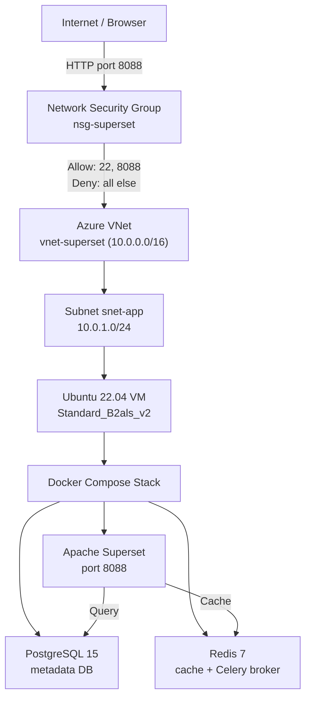

# Deploying Apache Superset on Azure From Scratch: My CCF501 Assessment 3

Tags: #cloudcomputing #azure #apache #superset #dataengineering

---

**Assessment 1 taught me how to *reason* about cloud architecture. Assessment 3 forced me to *put one on the wire* — and prove it works.**

---

## The Jump From Diagrams to Reality

Six weeks ago I wrote my CCF501 Assessment 1 — a 1,500-word architecture proposal for a fictional startup, full of NIST characteristics and Mermaid diagrams (read: [CCF501 Assessment 1 write-up](https://github.com/lfariabr/masters-swe-ai/blob/master/docs/refs/devToRefs/CCFAssessment1.md)). The grade was 81/100. The grade did not deploy anything.

Assessment 3 was different. The brief gave me four tasks — resource group, virtual network, firewall, application — and asked me to actually do them on a real cloud, with real screenshots, on a public IP. No more reasoning about Auto Scaling. Provision the VM. Open the port. Make the application return a 200.

This article is the deployment story — what I built, why I picked an open-source tool nobody else in my cohort was deploying, and the security and governance choices I had to defend with evidence instead of paragraphs.


---

## Course Context: CCF501 in 12 Weeks

I'm doing my Master's in Software Engineering & AI at Torrens University Australia. **CCF501 Cloud Computing Fundamentals** is one of the two subjects in my current term (T1-2026). The 12-week ride covers ground in this order:

1. Traditional vs modern computing
2. Cloud essentials (NIST 5)
3. Deployment models — public / private / hybrid
4. Service models — IaaS / PaaS / SaaS
5. Major providers — AWS / Azure / GCP
6. Advanced cloud concepts (XaaS, hands-on Azure lab)
7. Public/private/hybrid trade-offs
8. Deployment case studies
9. Governance and legal obligations
10. Cloud security threats
11. Security policy planning
12. Implementation of security policy at various providers

The assessments mirror that arc. Assessment 1 (week 4): a technology report on cloud's contribution to business automation. Assessment 2 (week 8): a case study comparing deployment models. Assessment 3 (week 12): build something. The whole subject converges on one question — *can you actually deploy and secure a real application?*

In parallel, I'm taking **ISY503 Intelligent Systems** — and the more I sit with that coursework, the more obvious it gets: an ML model on a laptop helps nobody. Deployment is the work. CCF501 makes that real.

---

## Why Apache Superset (The Off-List Bet)

The brief suggested apps like Moodle, ThingsBoard, KaaIOT, or Jira. I didn't pick any of them.

I picked **Apache Superset** — an open-source data exploration and visualisation platform originally built at Airbnb, now an Apache top-level project. SQL Lab, 40+ chart types, dashboards, role-based access control, connectors for everything from PostgreSQL to BigQuery to Snowflake.

Four reasons it was the right call for me:

- **Python-native.** Python is my primary stack. Reading the source, debugging containers, extending it later — all roads stay on familiar ground.
- **RBAC depth.** Superset ships with three meaningful roles out of the box (Admin / Alpha / Gamma). The assessment rubric weights security and governance at 20%, and rich RBAC writes that section for you instead of forcing it.
- **Career fit.** I work as a Data Analyst at St Catherine's School in Sydney — building SQL pipelines and reports. Superset is the cloud-deployed version of that exact work, and it feeds directly into my T4 subject **BDA601 Big Data & Analytics** in T1-2027. The deployment becomes infrastructure for the next subject, not a throwaway.
- **Differentiation.** Nobody else in the cohort is deploying Superset. Off-list choice → harder to defend → deeper learning → stronger portfolio piece.

I considered Metabase (simpler, faster) and MLflow (better long-term MLOps story). Both are legit. Superset won because the trade — slightly higher complexity for a richer governance story and a Python-aligned platform — was the one I wanted to make.

---

## The Architecture

Here's what got deployed:



The whole thing lives in a single Azure Resource Group (`rg-superset-ccf501`) in **Australia East**. One VNet, one subnet, one NSG, one VM. Superset, PostgreSQL 15, and Redis 7 run as three containers via Docker Compose on the VM.

VM size landed on `Standard_B2als_v2` — the free-tier B1s (1 vCPU, 1 GB RAM) doesn't have enough memory to start the Superset stack reliably. Spin it up, capture evidence, then **stop and deallocate** to stop burning credits.


---

## From-Scratch Deployment

Five things, in order. Not nine, not three. Five.

### 1. Provision Azure infrastructure

In the Azure portal:

- Create resource group `rg-superset-ccf501` in Australia East.
- Add VNet `vnet-superset` (10.0.0.0/16) with subnet `snet-app` (10.0.1.0/24).
- Attach NSG `nsg-superset` with three rules:

| Priority | Name | Port | Source | Action |
|---|---|---|---|---|
| 100 | Allow-SSH | 22 | My IP / 32 | Allow |
| 110 | Allow-Superset | 8088 | Any | Allow |
| 65000 | DenyAllInbound | * | * | Deny |

- Launch a Linux VM (`Standard_B2als_v2`, Ubuntu 22.04 LTS) inside `snet-app` and attach a public IP.

### 2. SSH in and install Docker

```bash
sudo apt update && sudo apt upgrade -y
sudo apt install -y docker.io docker-compose-plugin git
sudo usermod -aG docker $USER
newgrp docker
```

### 3. Drop in the Docker Compose stack

A trimmed version of the working `docker-compose.yml` (real secrets pulled — replace with environment variables before you ever push this anywhere):

```yaml
services:
  redis:
    image: redis:7-alpine
    networks: [superset-network]

  postgres:
    image: postgres:15-alpine
    environment:
      POSTGRES_DB: superset
      POSTGRES_USER: superset
      POSTGRES_PASSWORD: <db-password>
    volumes:
      - postgres-data:/var/lib/postgresql/data
    networks: [superset-network]

  superset:
    image: apache/superset:latest
    depends_on: [postgres, redis]
    environment:
      SUPERSET_SECRET_KEY: <openssl-rand-base64-42>
      SUPERSET_METADATA_DB_URI: "postgresql+psycopg2://superset:<db-password>@postgres:5432/superset"
      REDIS_HOST: redis
      REDIS_PORT: "6379"
    ports: ["8088:8088"]
    volumes:
      - ./superset_home:/app/superset_home
      - ./config.py:/app/pythonpath/superset_config.py:ro
    networks: [superset-network]

volumes:
  redis-data:
  postgres-data:

networks:
  superset-network:
    driver: bridge
```

The `config.py` mount wires Superset to use Redis as the cache backend and reads the Postgres URI from the environment. Generate the secret with `openssl rand --base64 42` — never commit the real value.

### 4. Bring it up and validate

```bash
docker compose up -d
docker compose logs -f superset       # wait for "Listening at: http://0.0.0.0:8088"
curl -I http://localhost:8088          # expect: HTTP/1.1 302 FOUND
```

Then in a browser, the Azure VM's public IP on port 8088 — `http://<public-ip>:8088` — and the Superset login screen renders.


### 5. Use the application

This is the step that turns "the server responded" into "the application works": upload three CSVs, build a real dashboard, and configure the three RBAC roles.

The datasets I used:

- `cloud_costs_demo.csv` — Azure cost by service / environment.
- `superset_usage_demo.csv` — Superset activity by user role.
- `security_events_demo.csv` — security events by control layer.

Three charts: a bar chart of Azure cost by service, a line chart of Superset usage by role over time, and a stacked bar of security events by control layer. Then create three users — `admin` (Admin), `analyst` (Alpha), `viewer` (Gamma) — and confirm each one sees only what their role allows.


---

## Security and Governance: Defense in Layers

Cloud security is not one switch. It's a stack of decisions, each one narrowing the attack surface a little more.

**Network layer (NSG):** Deny-all default inbound. Two explicit allows: SSH on port 22 (source-restricted to my IP only) and Superset on port 8088. No port 80, no port 443 — TLS is intentionally out of scope for v1, called out as an improvement (more below). The point isn't that this is production-grade. The point is that *every open port has a reason*.

**OS layer:** SSH key-based authentication only. Password auth disabled in `/etc/ssh/sshd_config`. The IP allowlist on port 22 already limits exposure; key-only auth means even an exposed port won't fall to a brute-force.

**Application layer (Superset RBAC):**

| Role | What they can do | Who gets it |
|---|---|---|
| Admin | Full control: users, databases, all dashboards | System administrator |
| Alpha | Create/edit own dashboards, run SQL Lab queries | Data analyst |
| Gamma | View dashboards only, no edit access | Business viewer |

This is where Superset earns its keep over a simpler tool. The 20% governance criterion stops being theoretical when you can show three actual users, three actual permission sets, and three different views of the same dashboard.

**Credential layer:** the Superset secret key, the Postgres password, and the admin password all live in environment variables — never hardcoded, never committed to the repo. The version of `docker-compose.yml` checked into the project uses placeholders.


**The honest gap:** no TLS in v1. Credentials travel in plaintext over HTTP. For a marked deployment that lives two days then gets deallocated, the risk is contained. For anything real, the next step is Azure Application Gateway or an nginx reverse proxy with Let's Encrypt — called out explicitly in the report's robustness section.

Other production improvements queued up: Azure Database for PostgreSQL instead of a containerised Postgres (automated backups, HA), Celery workers off the Redis broker for long async queries (the Konquista pattern I built before — Django + Celery + Redis), Azure Monitor for alerts before the VM falls over.

---

## AWS Portability Note

After the Azure deployment was finished, I ran the same stack on **AWS EC2 / Amazon Linux 2023** to test how portable the architecture really was. Same VPC + Security Group + EC2 + Docker Compose pattern. Same three-container stack. Same RBAC.

Three things bit me on AWS that did not bite on Azure:

1. **Amazon Linux 2023 is RPM-based**, not Debian. `apt update` fails. Switch to `dnf`.
2. **The Docker Compose plugin isn't bundled** in the default `docker` package on AL2023. `docker compose up` returns "command not found." Install the standalone binary manually:
   ```bash
   sudo curl -L "https://github.com/docker/compose/releases/latest/download/docker-compose-linux-x86_64" \
     -o /usr/local/bin/docker-compose
   sudo chmod +x /usr/local/bin/docker-compose
   ```
3. **My ISP silently blocks outbound port 8088.** The Security Group was open. Curl on the VM returned 302. The browser timed out. Fix: an SSH tunnel through port 22, which every network allows:
   ```bash
   ssh -i ~/Downloads/your-key.pem -L 8088:localhost:8088 ec2-user@<public-ip> -N
   ```
   Then `http://localhost:8088` in the browser. Port 22 carries it.

That third one was an hour of debugging that produced one of the most useful "huh, the network *does* think for itself" lessons of the term.

This isn't a dual-cloud article. Azure is the main story. The AWS variant exists to prove the deployment is portable and to capture the pitfalls for next time. Both implementations live in the repo.


---

## The AI-Assisted Workflow (Yes, I'm Going to Be Honest About It)

This article — and a meaningful chunk of the deployment plan — leaned on AI assistants. I'm going to call that out plainly because pretending otherwise is silly and the workflow itself is now part of how I work.

- **Codex** built the dev.to article plan: structure, length target, tag suggestions, source-file inventory.
- **Claude** read the source files (deployment notes, technical artifacts, AWS pitfalls, the assessment brief) and produced this draft.
- **I** made every architecture decision, ran every command, captured every screenshot, fixed the `IsADirectoryError` from a bind-mount that didn't exist yet, debugged the port-8088 ISP problem, and reviewed every word before this article went public.

AI is a planning and drafting accelerator. It is not a replacement for understanding what you deployed or why. Anyone who can't defend their own architecture verbally has skipped the part of the process that actually matters.

---

## What This Term Taught Me

Three things I'm taking forward:

**Architecture diagrams are useful, but deployment is honest.** Cloud theory let me draw a clean architecture in Mermaid. Deployment exposed the trade-offs that don't show up in a diagram — VM RAM ceilings, Compose plugin differences across distros, ISPs that filter non-standard ports, the gap between "the server is up" and "the application is usable."

**Cloud security is layered, not bolted on.** Network, OS, application, credentials — each one is a decision. Skip any layer and the attack surface widens. The exercise of *justifying* every open port is more useful than memorising the OWASP Top 10.

**Open-source analytics tools are excellent portfolio projects.** They sit at the intersection of infrastructure (deployment), data (connections, datasets), security (RBAC), and usability (dashboards that real people read). One project, four learning surfaces.

And one practical one: **stop and deallocate cloud resources** the moment you finish capturing evidence. Free credits run out faster than you expect when you forget that a B2als_v2 VM is metered by the second.

---

## Building in Public

Studying for a Master's while working full-time means assignments stop being abstract. The same patterns — IaaS, NSGs, RBAC, deny-by-default firewalls, env-var secrets — show up at work the same week I learn them. I'm sharing this publicly because the learning compounds when it's open.

- 📋 [Assessment Brief — CCF501 Assessment 3](https://github.com/lfariabr/masters-swe-ai/blob/master/2026-T1/CCF/assignments/Assessment3/CCF501_Assessment3.md)
- 🛠️ [Deployment notes + technical artifacts](https://github.com/lfariabr/masters-swe-ai/tree/master/2026-T1/CCF/assignments/Assessment3/ApacheSuperset)
- 🐧 [AWS variant — pitfall log included](https://github.com/lfariabr/masters-swe-ai/blob/master/2026-T1/CCF/assignments/Assessment3/ApacheSuperset/IMPLEMENTATION-PLAN-AWS.md)
- 📄 [My CCF501 Assessment 1 article](https://github.com/lfariabr/masters-swe-ai/blob/master/docs/refs/devToRefs/CCFAssessment1.md) — the architecture-design predecessor to this one

If you're deploying something open-source on a cloud provider for the first time — what surprised you most: the infrastructure, the security choices, or the network getting in your way?

---

## Let's Connect

- **LinkedIn:** [linkedin.com/in/lfariabr](https://www.linkedin.com/in/lfariabr/)
- **GitHub:** [github.com/lfariabr](https://github.com/lfariabr)
- **Portfolio:** [luisfaria.dev](https://luisfaria.dev)

---

## References

Apache Software Foundation. (n.d.). *Apache Superset documentation*. https://superset.apache.org/docs/intro

IBM. (n.d.). *SaaS, PaaS, IaaS explained*. https://www.ibm.com/think/topics/iaas-paas-saas

Mell, P., & Grance, T. (2011). *The NIST definition of cloud computing* (Special Publication 800-145). National Institute of Standards and Technology. https://doi.org/10.6028/NIST.SP.800-145

Microsoft. (n.d.-a). *Azure Virtual Network documentation*. Microsoft Learn. https://learn.microsoft.com/en-us/azure/virtual-network/

Microsoft. (n.d.-b). *Network security groups overview*. Microsoft Learn. https://learn.microsoft.com/en-us/azure/virtual-network/network-security-groups-overview

Microsoft. (n.d.-c). *Create your Azure free account today*. https://azure.microsoft.com/en-au/free/

Sandhu, R. S., Coyne, E. J., Feinstein, H. L., & Youman, C. E. (1996). Role-based access control models. *Computer*, 29(2), 38–47. https://doi.org/10.1109/2.485845
