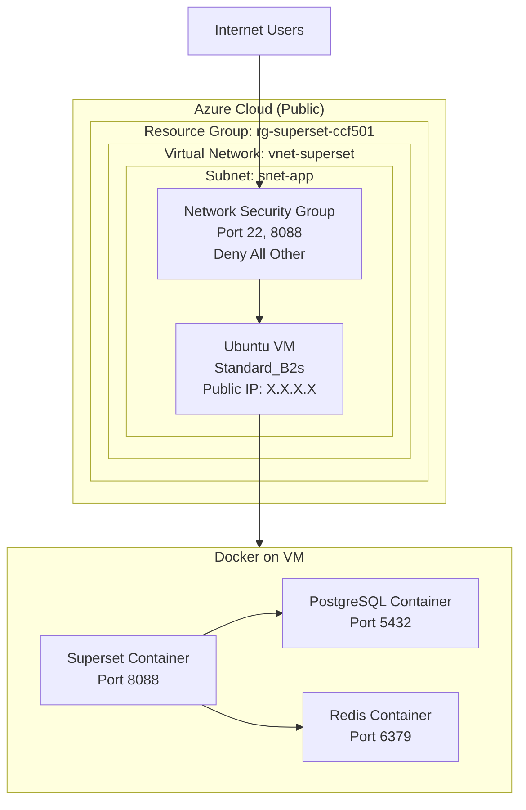

# Technical Artifacts — Apache Superset Deployment

## 1. Docker Compose Configuration

Create `docker-compose.yml`:

```yaml
services:
  redis:
    image: redis:7-alpine
    restart: unless-stopped
    volumes:
      - redis-data:/data
    networks:
      - superset-network

  postgres:
    image: postgres:15-alpine
    restart: unless-stopped
    environment:
      POSTGRES_DB: superset
      POSTGRES_USER: superset
      POSTGRES_PASSWORD: <db-password>
    volumes:
      - postgres-data:/var/lib/postgresql/data
    networks:
      - superset-network

  superset:
    image: apache/superset:latest
    restart: unless-stopped
    depends_on:
      - postgres
      - redis
    environment:
      - SUPERSET_SECRET_KEY=<output-of-openssl-rand-base64-42>
      - SUPERSET__SQLALCHEMY_DATABASE_URI=postgresql+psycopg2://superset:<db-password>@postgres:5432/superset
      - REDIS_HOST=redis
      - REDIS_PORT=6379
    ports:
      - "8088:8088"
    volumes:
      - ./superset_home:/app/superset_home
    networks:
      - superset-network
    command: ["sh", "-c", "superset db upgrade && superset fab create-admin --username admin --firstname Admin --lastname User --email admin@superset.com --password <secure-admin-password> || true && superset init && superset run -h 0.0.0.0 -p 8088 --with-threads"]

volumes:
  redis-data:
  postgres-data:

networks:
  superset-network:
    driver: bridge
```

**Generate secret key:**
```bash
openssl rand --base64 42
```
Replace `SUPERSET_SECRET_KEY` in the yaml above.

---

## 2. Azure NSG Rules

| Priority | Name | Port | Protocol | Source | Action |
|----------|------|------|----------|--------|--------|
| 100 | Allow-SSH | 22 | TCP | Your-IP/32 | Allow |
| 110 | Allow-Superset | 8088 | TCP | * | Allow |
| 65000 | DenyAllInbound | * | * | * | Deny |

**Security rationale:** Deny-by-default with explicit allows. SSH restricted to your IP only.
Port 80 (HTTP) and 443 (HTTPS) are omitted — no reverse proxy or TLS is configured in this deployment. Superset is accessed directly on port 8088. Adding Nginx + TLS via Let's Encrypt or Azure Application Gateway is noted as a robustness improvement in section 2e.

---

## 3. RBAC User Roles Matrix

| Role | Permissions | Use Case |
|------|-------------|----------|
| **Admin** | Full access: manage users, databases, all dashboards | System administrators |
| **Alpha** | Create/edit own dashboards, run SQL queries | Data analysts |
| **Gamma** | View dashboards only, no edit permissions | Business users, executives |

---

## 4. Deployment Commands

```bash
# 1. Update system and install Docker
sudo apt update && sudo apt upgrade -y
sudo apt install docker.io docker-compose git -y
sudo usermod -aG docker $USER
newgrp docker

# 2. Create project directory
mkdir ~/superset-deployment && cd ~/superset-deployment

# 3. Create docker-compose.yml
nano docker-compose.yml
# Paste the configuration above, save and exit

# 4. Start Superset stack
docker-compose up -d

# 5. Wait for initialization (60-90 seconds)
docker-compose logs -f superset
# Press Ctrl+C when you see "Listening at: http://0.0.0.0:8088"

# 6. Get VM public IP
curl ifconfig.me

# 7. Access Superset in browser
# Navigate to: http://<azure-vm-public-ip>:8088
# Default login: admin / admin (change immediately)

# 8. Create additional users (optional)
docker-compose exec superset superset fab create-user \
  --username analyst --firstname Data --lastname Analyst \
  --email analyst@example.com --password <secure-analyst-password> --role Alpha

docker-compose exec superset superset fab create-user \
  --username viewer --firstname View --lastname Only \
  --email viewer@example.com --password <secure-viewer-password> --role Gamma
```

---

## 5. Screenshot Checklist

### Required (Rubric: 40% practical skills)

- [ ] **Screenshot 1:** Azure resource group creation
- [ ] **Screenshot 2:** VNet + subnet configuration
- [ ] **Screenshot 3:** NSG inbound rules table
- [ ] **Screenshot 4:** Azure VM creation summary
- [ ] **Screenshot 5:** Superset login screen
- [ ] **Screenshot 6:** Superset dashboard (Admin logged in)
- [ ] **Screenshot 7:** User management (Admin/Alpha/Gamma roles)
- [ ] **Screenshot 8:** SQL Lab query execution
- [ ] **Screenshot 9:** Chart creation interface
- [ ] **Screenshot 10:** Published dashboard with charts

### Optional (Enhance to HD)

- [ ] **Screenshot 11:** Docker containers (`docker ps` output)
- [ ] **Screenshot 12:** Row-level security config
- [ ] **Screenshot 13:** Azure PostgreSQL connection

---

## 6. Report Structure Template

```
1. Introduction (300w)
   1.1 Introduction (100w)
       - Assessment purpose: deploy Superset on Azure
       - Career alignment: Data Analyst → Data Engineer
       - Azure for AZ-900 certification prep
   
   1.2 Background (200w)
       - Cloud computing advantages
       - IaaS service model
       - Public cloud deployment model
       - NIST characteristics

2. Body (1,000w)
   2a. Service Provider Selection (200w + table)
       - Why Azure over AWS/GCP
       - Comparison: Azure SQL vs AWS RDS vs GCP Cloud SQL
   
   2b. Deployment Model (150w + diagram)
       - Mermaid block diagram
       - Resource Group → VNet → NSG → VM → Docker
   
   2c. Deployment Procedure (300w + screenshots)
       - Task 1: Resource group (Figure 1)
       - Task 2: VNet + subnet (Figure 2)
       - Task 3: NSG config (Figure 3)
       - Task 4: Superset deployment (Figures 4-8)
   
   2d. Security Policies (250w + screenshots)
       - NSG deny-by-default
       - Superset RBAC (Admin/Alpha/Gamma)
       - Secrets management (env vars)
       - Principle of least privilege
   
   2e. Application Analysis (100w)
       - Current: Single VM (SPOF)
       - Improvements: Load Balancer, Celery+Redis, Synapse

3. Conclusion (200w)
   - Summarize deployment
   - Restate Azure rationale
   - Link to career goals

References (12+ APA entries)

Appendices
   A. Deployment checklist
   B. Glossary
```

---

## 7. Mermaid Deployment Diagram



---

## 8. APA Reference Starters

1. Apache Software Foundation. (2024). *Apache Superset documentation*. https://superset.apache.org/docs/intro
2. Microsoft Azure. (2024). *Azure Virtual Machines documentation*. https://learn.microsoft.com/en-us/azure/virtual-machines/
3. Mell, P., & Grance, T. (2011). *The NIST definition of cloud computing* (NIST Special Publication 800-145). National Institute of Standards and Technology.
4. Sandhu, R. S., Coyne, E. J., Feinstein, H. L., & Youman, C. E. (1996). Role-based access control models. *Computer*, 29(2), 38-47. https://doi.org/10.1109/2.485845
5. Armbrust, M., Fox, A., Griffith, R., Joseph, A. D., Katz, R., Konwinski, A., ... & Zaharia, M. (2010). A view of cloud computing. *Communications of the ACM*, 53(4), 50-58.

*[Add 7 more peer-reviewed sources on cloud security, IaaS, Azure architecture]*

---

## 9. Troubleshooting Guide

### Issue: Superset won't start

```bash
# Check logs
docker-compose logs superset

# Common fix: Delete volumes and restart
docker-compose down -v
docker-compose up -d
```

### Issue: Can't connect from browser

```bash
# Check VM public IP
curl ifconfig.me

# Verify NSG allows port 8088
# Check: Azure Portal → NSG → Inbound security rules

# Test locally on VM first
curl http://localhost:8088
```

### Issue: PostgreSQL connection fails

```bash
# Check postgres container is running
docker ps | grep postgres

# Test connection
docker-compose exec postgres psql -U superset -d superset
```

---

## 10. Time Estimates

| Phase | Time | Buffer |
|-------|------|--------|
| Phase 1: Prep | 2-3h | +1h |
| Phase 2: Azure | 1-2h | +0.5h |
| Phase 3: Deploy | 2-3h | +1h |
| Phase 4: Security | 1h | +0.5h |
| Phase 5: Report | 3-4h | +1h |
| Phase 6: Screencast | 1h | +0.5h |
| **Total** | **10-14h** | **+4.5h** |

---

## 11. Provider Comparison Table (for Section 2a)

| Criterion | Azure | AWS | GCP |
|-----------|-------|-----|-----|
| **Database Service** | Azure SQL Database | Amazon RDS | Cloud SQL |
| **Free Tier VM** | B1s (750h/month) | t2.micro (750h/month) | f1-micro |
| **Data Integration** | Azure Synapse, Power BI | Redshift, QuickSight | BigQuery, Looker |
| **Certification Path** | AZ-900 (fundamentals) | AWS CCP | GCP ACE |
| **Cost (VM)** | ~$8/month (B2s) | ~$8.5/month (t3.small) | ~$7/month (e2-small) |
| **Education Focus** | High (recommended by lecturers) | Medium | Medium |

**Conclusion:** Azure selected for certification alignment (AZ-900), data platform integration (Synapse), and lecturer recommendation.
