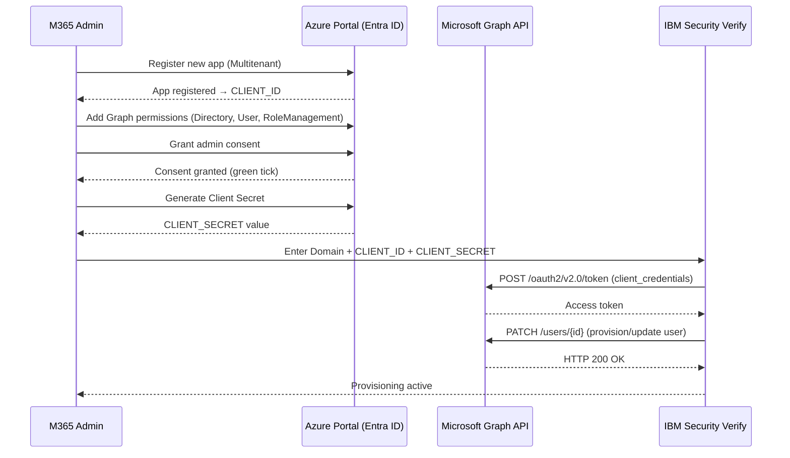

# Module 4 — Cloud Computing Service Models

## Task List

> Tip: ✅ = Done, 🔥 = WIP, 🕐 = Not started

| # | Task | Status |
|---|------|--------|
| 1 | Watch & summarise Linthicum (2021) — SaaS, IaaS, PaaS intro (LinkedIn Learning) | 🔥 WIP — LinkedIn auth required |
| 2 | Watch & summarise IBM (n.d.) — SaaS, PaaS, IaaS explained (IBM media + YouTube) | 🔥 WIP — video, no transcript |
| **3** | **Read & summarise Manvi & Shyam (2021) — IaaS (Ch. 5), SaaS & PaaS (Ch. 6)** | **✅** |
| 4 | Read & summarise Christina (2021) — 21 SaaS product videos (Blue Carrot) | 🔥 WIP — JS-heavy page, content not extractable |
| 5 | Watch & summarise Shore (2020) — Cybersecurity with Cloud, service models (LinkedIn Learning) | 🔥 WIP — LinkedIn auth required |
| **6** | **Read & summarise IBM (2022) — Configuring provisioning for Microsoft 365** | **✅** |
| 7 | Activity 1: Your Favourite SaaS Application | 🕐 |
| 8 | Activity 2: Thinking Exercise — No Crowd, No Cloud | 🕐 |

---

## Key Highlights

### 3. Manvi, S., & Shyam, G. K. (2021). Cloud computing: Concepts and technologies (Ch. 5 & 6). CRC Press.

**Citation:** Manvi, S., & Shyam, G. K. (2021). *Cloud computing: Concepts and technologies*. CRC Press. https://learning-oreilly-com.torrens.idm.oclc.org/library/view/cloud-computing/9781000338058/

**Purpose:** Chapters 5 and 6 provide a detailed technical and conceptual breakdown of all three cloud service models — IaaS (Ch. 5) and SaaS & PaaS (Ch. 6) — covering characteristics, implementation approaches, major providers, advantages, and challenges.

---

#### 1. IaaS — Key Terminology (Ch. 5 Preliminaries)

| Term | Definition |
|------|-----------|
| **Virtual Machine (VM)** | Basic compute unit. *Non-persistent*: state lost on stop. *Persistent*: backed by permanent storage, survives restart. |
| **Virtual Disk** | Size-configurable, block-level permanent storage; mounted to one VM at a time but reusable across multiple VMs over its lifetime. |
| **Geographic Region** | Physical location where the virtual resources reside. |
| **Failure-insulated Zone** | Sub-division of a region; isolated from localized failures (disk or power supply). |
| **Archival Storage** | Long-term blob-level storage; not mounted to any VM; accessible by multiple VMs simultaneously; exists outside any geographic region; durable but not always available. |

#### 2. IaaS Characteristics (Section 5.1)

- **Dynamic scaling**: Resources auto-scale up/down to match workload demand; providers optimize hardware, OS, and automation for large concurrent workloads
- **Service levels**: SLAs define availability guarantees (e.g., 99.999% uptime); higher premiums buy mirrored services with near-zero interruptions
- **Rental model**: Public IaaS = pay-per-use (immediate virtual access); Private IaaS = charge-back model (department budget allocation based on actual usage)
- **Licensing**: BYOL (bring your own license) OR PAYG (pay as you go — software license bundled into hourly rate, e.g., a few cents/hour for Windows Server on EC2)
- **Metering**: Transparent usage measurement; billing models:
  1. **Pay-as-you-go (PAYG)** — billed per instance, on-demand pricing
  2. **Reserved pricing** — upfront fee + discounted hourly rate; best for predictable workloads
  3. **Trial/free tier** — "try before you buy" (e.g., AWS Free Tier)

  Amazon EC2 example charges: storage (~$0.00015/hour per GB), data transfer (~$0.15/GB), optional services (VPN, reserved IPs, monitoring).

#### 3. IaaS Benefits (Section 5.2)

Top 5 reasons to use IaaS:
1. Cost savings on hardware and infrastructure
2. Capacity management (scale on demand)
3. Disaster recovery / business continuity
4. Cost savings on IT staffing and administration
5. Access to new skills and capabilities

**Summary:** lower upfront costs, predictable costs, simple scalability, increased reliability, improved physical security.

#### 4. VM Management in IaaS (Section 5.3)

VMs can be created from:
- ISO files in a repository (hardware virtualized only)
- Mounted ISO files on NFS/HTTP/FTP server (paravirtualized only)
- VM templates (by cloning a template)
- Existing VMs (by cloning)
- VM assemblies

Key VM operations: view info/events → edit parameters (including paravirtualization conversion) → move between repositories → migrate between servers (requires same CPU architecture).

#### 5. IaaS Providers Comparison (Section 5.4)

| Provider | Key Differentiators |
|----------|---------------------|
| **Amazon AWS (EC2)** | AMI + instances; Regions & Zones; Storage; Networking & Security; Monitoring; Auto Scaling; Load Balancer. Elastic and pay-as-you-go. |
| **Windows Azure** | Cross-OS (Windows + Linux); SQL Server integration; virtual networks + service buses; started as PaaS, expanded to IaaS. |
| **Google Compute Engine** | Predefined + custom machine types; sustained use discounts (>25% monthly usage = automatic discount up to 30%); minimum 10-min billing increment. |
| **Rackspace Open Cloud** | Mission-critical workload specialists; custom architecture support from server to data center; dedicated solution specialists. |
| **HP Enterprise (HPE Helion CloudSystem)** | Lifecycle management; security; multi-cloud app build/deploy tools; updated marketplace and service design. |

#### 6. Keys to Successfully Moving to IaaS (Section 5.5)

Five considerations before signing an IaaS contract:
1. Assess current workload and processes
2. Select provider with adequate **data sovereignty** guarantees
3. Review **SLAs** carefully
4. Evaluate storage capacity, network bandwidth, and compute power
5. Ensure **financial stability** of the provider

#### 7. IaaS Challenges (Section 5.6)

- **Governance**: Prevent rogue employee misuse (e.g., sales accessing restricted data, uncontrolled VM spin-up); policy enforcement critical
- **Regulatory compliance**: Finance needs usage records; **Cloud Service Broker (CSB)** provides an independent audit trail
- **Data center location risk**: Natural disasters may cause downtime; verify certifications and past clientele
- **Vendor lock-in**: Significant adoption barrier; mitigated when providers increase service transparency

---

#### 8. SaaS — Characteristics (Section 6.2)

| SaaS Characteristic | Description |
|--------------------|-------------|
| **Configuration & customization** | Each tenant configures look-and-feel, branding within predefined options; structural layout changes not typically allowed |
| **Accelerated feature delivery** | Weekly/monthly updates; single codebase = faster regression testing; agile methodologies; provider access to user behaviour data speeds improvement |
| **Open integration protocols** | HTTP, REST, SOAP APIs; enables **mashups** — lightweight apps combining data and functionality from multiple SaaS services |
| **Collaborative ("social") functionality** | Real-time sharing, co-editing, commenting, voting on features; implicit collaboration only possible with centrally hosted software |

#### 9. SaaS Advantages vs Disadvantages (Section 6.5)

| Advantages | Disadvantages |
|-----------|---------------|
| Flexible pay-as-you-go payments (OpEx not CapEx) | Vendor dependency for uptime, security, and availability |
| On-demand scalable usage (more/fewer features) | Risk of forced changes, service interruptions, or security breaches |
| Automatic updates and patch management | SLA compliance must be verified and enforced by customer |
| Access from any internet-connected device | Integration limited to provider APIs (no internal system access) |

Evaluation dimensions for SaaS providers: (i) **delivery capability** — can they maintain the required service level? (ii) **functionality** — does the software meet document management, security, and compliance needs?

#### 10. SaaS Examples (Section 6.4)

| SaaS App | Category | Key Insight |
|---------|---------|-------------|
| **HubSpot** | CRM | Freemium model; leads → prospects → customers pipeline management |
| **Shopify** | E-commerce | Full store (site + cart + catalog + payments) operational in hours |
| **Skubana** | Inventory management | Multi-channel distribution; SaaS at fraction of custom solution cost |
| **G Suite (Google Workspace)** | Productivity | Best real-time collaboration; fraction of Office 365 price |
| **Zendesk** | Customer support | Centralised ticket management; tracks, allocates, and resolves issues |
| **Dropbox** | Cloud storage | Free 2GB → 2TB business; encryption + version history + permission management |
| **Slack** | Business messaging | Integrates with Asana, Trello, Basecamp; freemium |
| **Adobe Creative Cloud** | Creative suite | Shifted from $1,500+ perpetual license to $49.99/month in 2013; dramatically increased accessibility |
| **Microsoft Office 365** | Productivity | Enterprise-grade; works offline; superior Excel; familiar interface |

#### 11. SaaS Implementation Architecture (Section 6.3)

Cloud-based SaaS architecture considerations:
- **Programming language**: Choose modern language (Python widely used for readability/flexibility)
- **Database selection**: Document-oriented DB (MongoDB) preferred — schema-less, flexible, smaller sizes
- **Queuing system (MSMQ)**: Asynchronous communication; enables 3rd-party integrations/APIs
- **Web Storage (S3)**: Amazon S3 for highly scalable object storage as user base grows
- **CDN**: Geographically distributed content delivery — route users to nearest server (e.g., US, Europe, Singapore)

---

#### 12. PaaS — Definition and Delivery (Section 6.6)

**PaaS** = Cloud computing services that provide a platform for developing, running, and managing applications without the complexity of building and maintaining the underlying infrastructure.

PaaS ≈ **Middleware**: acts as a hidden translation layer enabling communication and data management for distributed applications.

Delivery modes:
- **Public Cloud PaaS**: Provider manages networks, servers, storage, OS, middleware, DB; customer controls software deployment
- **Private PaaS**: Inside firewall, or deployed on public IaaS
- **Hybrid PaaS**: Mix of public and private (e.g., IBM Bluemix)

PaaS offerings also include: app design/testing/deployment, team collaboration, web service integration, database integration, security, scalability, storage, application versioning, instrumentation, monitoring, and workflow management.

#### 13. PaaS Characteristics (Section 6.7)

| PaaS Characteristic | Description |
|--------------------|-------------|
| **Runtime Framework** | The "software stack"; executes end-user code per policies set by app owner and cloud provider; supports multiple language runtimes |
| **Abstraction** | Higher-level than IaaS; user deploys to a "limitless pool" of resources without managing individual VMs |
| **Automation** | Automates deployment, load balancer/DB configuration, system changes across the full dev/deploy/manage lifecycle |
| **Cloud Services** | Built-in APIs for distributed caching, queuing/messaging, workload management, file/data storage, user identity, analytics |

> Key distinction: IaaS shifts CapEx → OpEx. PaaS slashes costs across the **entire** development, deployment, and management lifecycle.

#### 14. PaaS Operational Architecture (Stackato — Sections 6.6, 6.8)

PaaS deployed application roles:

| Role | Function |
|------|---------|
| **Router** | Directs all web traffic to appropriate application containers on DEA nodes |
| **Controller** | Exposes API endpoint; runs Management Console; coordinates all nodes and roles |
| **DEA (Droplet Execution Agent)** | Runs user apps in ephemeral Linux containers; immutable approach lowers attack vectors and speeds startup |
| **Service Roles** | Databases, cache, port forwarding, message queue, persistent filesystem |

PaaS implementation team roles: **Project Owner** (champion), **Executive Sponsor** (VP/C-level oversight), **System Administrator** (Linux/UNIX + network config), **Architects** (middleware + strategy alignment).

#### 15. PaaS Examples and Types (Sections 6.9, 6.10)

| PaaS Type | Examples |
|-----------|---------|
| **Public PaaS** | Salesforce Heroku, AWS Elastic Beanstalk, Microsoft Azure, Engine Yard |
| **Enterprise PaaS (CEAP)** | Apprenda, VMware, Pivotal, Red Hat OpenShift |
| **Private PaaS** | Red Hat OpenShift, Pivotal Cloud Foundry |
| **Mobile PaaS (mPaaS)** | Kinvey, CloudMine, AnyPresence, FeedHenry, FatFractal |
| **Open PaaS** | AppScale (deploys Google App Engine apps on own servers; SQL or NoSQL) |
| **Rapid Development PaaS** | Mendix, Salesforce.com, OutSystems, Acquia |

**PaaS Advantages/Disadvantages:**

| Advantages | Disadvantages |
|-----------|---------------|
| Higher-level programming; reduced complexity | May not support full conventional tools (e.g., unrestricted relational DB joins) |
| Built-in infrastructure; more effective development | Possible platform vendor lock-in (though most PaaS are relatively lock-in free) |
| Easier maintenance and enhancement | |
| Supports distributed, multi-location dev teams | |

---

#### 16. Service Model Comparison — Summary Table

| Dimension | IaaS | PaaS | SaaS |
|-----------|------|------|------|
| **What you manage** | OS, middleware, runtime, apps | Apps and data only | Nothing |
| **What provider manages** | Hardware, networking, storage | Hardware + OS + middleware + runtime | Everything |
| **Who uses it** | IT admins, DevOps engineers | Developers | End users |
| **Figure 6.1 label** | Build | Deploy | Buy |
| **Key benefit** | Infrastructure flexibility and control | Developer productivity | Immediate use, no setup |
| **Key risk** | Management overhead | Tool restrictions | Vendor dependency |
| **Cost model** | PAYG / reserved / BYOL | PAYG per app/deployment | Subscription (monthly/annual) |
| **Examples** | AWS EC2, Azure VMs, GCP Compute | Heroku, Azure App Service, AWS Beanstalk | Salesforce, Office 365, Slack |

#### Key Takeaways for CCF501

1. The IaaS → PaaS → SaaS stack represents **increasing abstraction and decreasing customer responsibility** — critical framing for Assessment 1 service model slides
2. IaaS pricing models (PAYG, reserved, trial) and metering directly connect to Module 3's TCO discussions and cost optimisation challenges
3. SaaS characteristics (open APIs, collaborative features) explain why enterprise adoption has grown — and why governance/compliance (Ch. 5.6) remain top concerns
4. The **Adobe Creative Cloud** case (perpetual → subscription 2013) is a strong real-world anchor for Activity 1's "Favourite SaaS Application" discussion
5. PaaS vs IaaS distinction: IaaS gives you VMs to configure; PaaS gives you a deployment target — developers push code, provider handles the rest

---

### 6. IBM (2022). Configuring provisioning for Microsoft 365. IBM Security Verify.

**Citation:** IBM. (2022). *Configuring provisioning for Microsoft 365*. IBM. https://www.ibm.com/docs/en/security-verify?topic=endpoints-configuring-provisioning-microsoft-365

**Purpose:** Demonstrates SaaS provisioning in practice — how IBM Security Verify automates user lifecycle management (create, update, suspend, restore, deprovision) within Microsoft 365, a real-world SaaS application.

---

#### 1. SaaS Provisioning — Core Concept

**Provisioning** = automated management of user accounts within a SaaS application, driven by entitlements defined in an identity platform.

Core lifecycle operations in IBM Verify → Microsoft 365:

| Operation | Trigger | Result |
|-----------|---------|--------|
| **Create** | User entitled to M365 in Verify | New M365 account created |
| **Update** | Profile changed in Verify | Changes auto-synced to M365 |
| **Suspend** | User suspended in Verify | M365 account deactivated |
| **Restore** | User restored in Verify | M365 account reactivated |
| **Deprovision** | Entitlement removed in Verify | M365 access revoked |

#### 2. Microsoft 365 Specific Provisioning Features

| Feature | Description |
|---------|-------------|
| **Guest User Support** | Unique to M365; set `userType=Guest` + include email; enables external collaboration provisioning |
| **Fine-Grained Entitlements** | Admin roles, licenses, and service plans sync as individual permissions assignable to users and groups |
| **Remediation Policies** | Three policy options handle attribute discrepancies between Verify and M365 |
| **Schema Extension Mapping** | Map M365 custom schema attributes to IBM Verify attribute fields |

#### 3. Configuration Process (Azure Portal → IBM Verify)

**Purpose:** Register an Azure app and connect it to IBM Security Verify so that Verify can automate M365 user lifecycle operations (create, update, suspend, deprovision) via the Microsoft Graph API.

**Assumptions:**
- You hold **Microsoft 365 Global Administrator** (or Application Administrator) rights
- You hold **IBM Security Verify Administrator** rights
- Your M365 tenant domain name is known (e.g. `contoso.onmicrosoft.com`)
- No existing app registration for IBM Verify is present in Azure Entra ID

**Expected outcome:** An Azure app registration with a client secret, admin consent granted for Graph API scopes, and the resulting credentials (Domain, Client ID, Client Secret) entered in IBM Security Verify — enabling full automated provisioning.

**Step-by-step:**

1. Sign in to the [Azure Portal](https://portal.azure.com) → navigate to **Microsoft Entra ID → App registrations → New registration**
2. Enter a display name (e.g. `IBM-Verify-M365-Provisioning`), select **Accounts in any organizational directory (Multitenant)**, leave redirect URI blank, click **Register**
3. Copy the **Application (client) ID** — this is your `CLIENT_ID`
4. Navigate to **API permissions → Add a permission → Microsoft Graph → Application permissions**, then add:
   - `Directory.ReadWrite.All`
   - `User.ReadWrite.All`
   - `RoleManagement.ReadWrite.Directory`
5. Click **Grant admin consent for [your tenant]** — all three permissions must show a green tick
6. Navigate to **Certificates & secrets → New client secret**, enter a description and expiry, click **Add**; copy the **Value** immediately — this is your `CLIENT_SECRET`
7. In **IBM Security Verify**, navigate to the M365 application entry → **Provisioning tab** → enter:
   - Domain name: `contoso.onmicrosoft.com`
   - Client ID: `<APPLICATION_CLIENT_ID>`
   - Client Secret: `<CLIENT_SECRET_VALUE>`
8. In the **Schema Extension Mapping** section, map any M365 custom attributes to the corresponding IBM Verify attribute fields, then click **Save**

**Example: Register app via MS Graph API (alternative to portal UI)**

```bash
# Requires az CLI logged in as Global Admin
az ad app create \
  --display-name "IBM-Verify-M365-Provisioning" \
  --sign-in-audience AzureADMultipleOrgs

# Grant required Graph permissions (replace <APP_ID> with the output above)
az ad app permission add \
  --id <APP_ID> \
  --api 00000003-0000-0000-c000-000000000000 \
  --api-permissions \
    19dbc75e-c2e2-444c-a770-ec69d8559fc7=Role \
    741f803b-c850-494e-b5df-cde7c675a1ca=Role \
    9e3f62cf-ca93-4989-b6ce-bf83c28f9fe8=Role

# Grant admin consent
az ad app permission admin-consent --id <APP_ID>
```

**Validate token exchange (curl)**

```bash
# Request an OAuth2 access token using client credentials
curl -X POST \
  "https://login.microsoftonline.com/<TENANT_ID>/oauth2/v2.0/token" \
  -H "Content-Type: application/x-www-form-urlencoded" \
  -d "client_id=<CLIENT_ID>" \
  -d "client_secret=<CLIENT_SECRET>" \
  -d "scope=https://graph.microsoft.com/.default" \
  -d "grant_type=client_credentials"
# Expected: HTTP 200 with { "access_token": "eyJ0...", "token_type": "Bearer", ... }
```

**Sequence diagram**



**Validation checks**

| Check | What to look for |
|-------|-----------------|
| Token exchange | `POST /oauth2/v2.0/token` returns HTTP 200 with `access_token` |
| User provisioning | New user appears in **M365 Admin Center → Active Users** within ~5 minutes |
| Sync log | IBM Verify provisioning log shows `Status: Success` with no error codes |
| Permission scope | Decoded JWT (`access_token`) includes `Directory.ReadWrite.All` in `roles` claim |

**Prerequisites:** Microsoft 365 Global Administrator account + IBM Verify admin permissions + tenant domain name, Client ID, and Client Secret.

#### Key Takeaways for CCF501

1. Demonstrates **SaaS provisioning in practice** — the theoretical user management characteristics of SaaS (§6.2) implemented as a real enterprise configuration
2. **Fine-grained entitlements** (admin roles, licenses, service plans) show how SaaS governance is operationalised — linking back to IaaS governance challenges (§5.6)
3. The Azure API permissions model (`Directory.ReadWrite.All`) illustrates how SaaS applications expose APIs for integration — directly related to the "open integration protocols" SaaS characteristic
4. Personal relevance: provisioning patterns here are analogous to FreshService automation workflows — useful for framing security documentation and compliance levels at Saint Catherine
