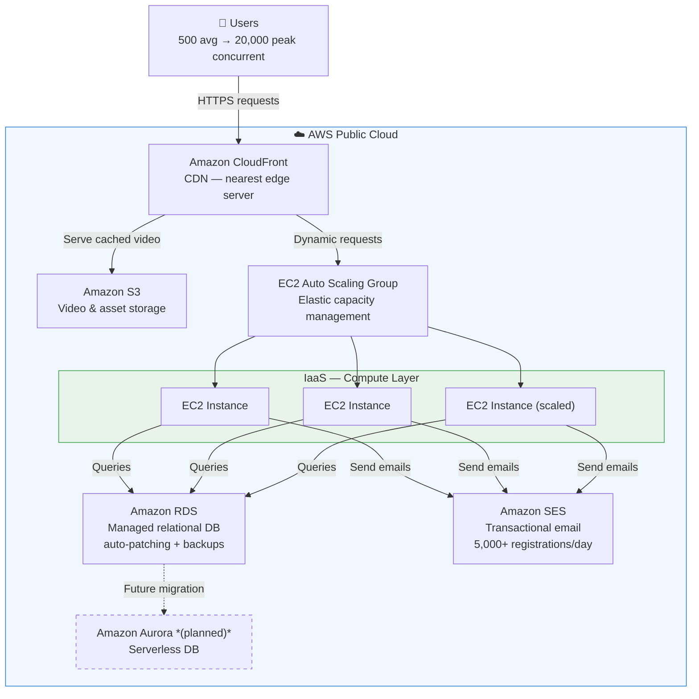
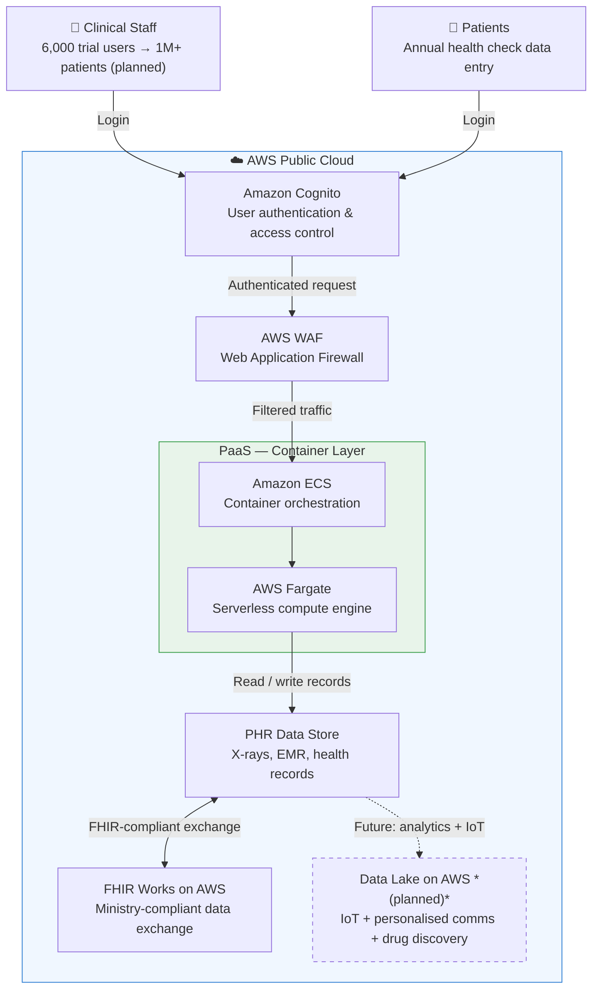

# Module 05 — Major Public Cloud Providers and their comparison

## Task List

> Tip: ✅ = Done, 🔥 = WIP, 🕐 = Not started

| # | Task | Status |
|---|------|--------|
| **1** | Read & summarise Manvi & Shyam (2021) — IaaS, SaaS, PaaS chapters | ✅ |
| **2** | Read & summarise Kuijpers (2022) — AWS vs Azure vs GCP platform comparison | ✅ |
| **3** | Read & summarise Winchester (2022) — Big 3 cloud comparison for enterprise | ✅ | 
| **4** | Watch & summarise Linthicum (2021) — Cloud migration business case videos | ✅ |
| **5** | Activity 1: Case Study — Rumah Siap Kerja e-learning platform on AWS | ✅ |
| **6** | Activity 2: Case Study — Fujita Health University patient records on AWS | ✅ |

---

## Key Highlights

### 1. Manvi, S., & Shyam, G. K. (2021). Cloud computing: Concepts and technologies. CRC Press. ✅

**Citation:** Manvi, S., & Shyam, G. K. (2021). *Cloud computing: Concepts and technologies*. CRC Press.

**Purpose:** Chapters 5–7 cover IaaS, SaaS, and PaaS delivery models with concrete provider examples and pros/cons. Forms the academic backbone for understanding what each service tier looks like in practice, and which providers are associated with each.

---

#### 1. IaaS Providers (Ch. 5)

- **IaaS model:** Provider maintains equipment; users rent on "pay as you go" — flexible, elastic, scales easily
- **Use case:** Organisations scaling new or existing applications to larger audiences

| Provider | Key Characteristics |
|----------|---------------------|
| **Amazon AWS (EC2)** | AMI + Instances, Regions & Zones, Storage, Networking & Security, Monitoring, **Auto Scaling**, **Load Balancer** |
| **Windows Azure** | Started as PaaS, now also IaaS; supports Linux + Windows VMs; traits: scalability, data protection, smart decision-making |
| **Google Compute Engine** | No upfront investment; thousands of virtual CPUs; 10-min minimum billing; **sustained use discounts** up to 30% for full-month instances; **inferred instances** maximise discount across non-concurrent VMs |
| **Rackspace** | Custom architecture for mission-critical apps; dedicated server bundles; specialist support |
| **HP Enterprise (Helion CloudSystem)** | Enhanced networking/storage/lifecycle management; multi-cloud app deployment tools |

#### 2. SaaS Examples and Trade-offs (Ch. 6)

- **SaaS definition:** Software hosted in cloud — no local install, accessed over internet, provider manages everything

| Product | Category | Notable Feature |
|---------|----------|----------------|
| HubSpot | CRM + marketing | Freemium model; scales pricing with business |
| Shopify | E-commerce | Full store in hours; cart + catalogue + payments |
| G Suite | Collaboration | Best real-time co-editing; fraction of Office 365 cost |
| Dropbox | Cloud storage | 2 GB free → 2 TB+ business; cross-OS sync |
| Slack | Team messaging | Integrates with Asana, Trello, Basecamp; freemium |
| Adobe Creative Cloud | Creative suite | Shifted from $1,500/licence to $49.99/month in 2013 |
| Microsoft Office 365 | Enterprise productivity | Works offline; advanced Excel; larger enterprise feature set |
| Zendesk | Customer support | Centralised ticket tracking and resolution |

**SaaS Advantages:** Flexible pay-as-you-go, scalable usage on demand, automatic updates (no patching), accessible from any device
**SaaS Disadvantages:** Vendor dependency for uptime/billing/security, limited customisation, internet-dependent

#### 3. PaaS Types and Examples (Ch. 7)

- **PaaS definition:** Provider manages the server; developer manages the application. Sits between SaaS (fully managed) and IaaS (user manages server).

| Type | Description | Examples |
|------|-------------|---------|
| **Public PaaS** | Delivered by cloud provider for app building | Salesforce Heroku, AWS Elastic Beanstalk, Azure, Engine Yard |
| **Enterprise PaaS** | Central IT delivers to internal developers | Apprenda, Red Hat OpenShift, Pivotal Cloud Foundry, VMware |
| **Private PaaS** | Installed on-premise or on public cloud | Apprenda, OpenShift |
| **Hybrid PaaS** | Mix of public + private deployments | IBM Bluemix |
| **Mobile PaaS (mPaaS)** | Mobile app development capabilities | Kinvey, CloudMine, FeedHenry |
| **Open PaaS** | Open-source, no hosting bundled | AppScale (Google App Engine compatible) |

**PaaS Advantages:** Higher-level programming, reduced complexity, built-in infrastructure, good for distributed teams
**PaaS Disadvantages:** Tool restrictions possible (e.g., relational DB joins), vendor lock-in risk (though most PaaS are relatively lock-in free)

#### Key Takeaways for CCF501
1. The IaaS/PaaS/SaaS stack is the primary framework for Activity 1 and 2 case study analysis — identify which tier each service belongs to
2. AWS's Auto Scaling and Load Balancer (IaaS characteristics) appear directly in the RSK case study
3. Adobe's SaaS pivot (perpetual licence → subscription) is a concrete example of how SaaS reduces barriers and scales user bases
4. Google's sustained use discounts and inferred instances are a GCE-specific differentiator not covered in comparison articles

---

### 2. Kuijpers, M. (2022, January 7). AWS vs Azure vs Google Cloud: How to choose the right cloud platform. Touchtribe. ✅

**Citation:** Kuijpers, M. (2022, January 7). AWS vs Azure vs Google Cloud: How to choose the right cloud platform. Touchtribe. https://www.touchtribe.nl/en/blog/aws-vs-azure-vs-google-cloud

**Purpose:** Practitioner-oriented comparison from a cloud-native development agency. Frames the Big 3 decision around serverless architecture and cloud-native development rather than purely technical specs — useful for justifying provider selection based on application type.

---

#### 1. Key Terminology

- **Cloud:** Applications and data delivered via the internet; storage location varies
- **Cloud native:** Application built and delivered through a public cloud provider's services — developer uses provider's services directly, has no infrastructure control
- **Serverless:** Application does not reside on its own server; uses cloud functions (AWS Lambda, Google Functions) that scale dynamically with demand

#### 2. Serverless: Advantages vs Disadvantages

| Advantage | Disadvantage |
|-----------|-------------|
| **Lower costs** — pay only when used; zero cost at zero usage | **Complex integration** — APIs more complex; requires microservice architecture |
| **High scalability** — grows automatically with demand | **Vendor lock-in** — switching Lambda to Azure Functions is non-trivial |
| **Less worries** — patches, security, OS managed by provider | **Cold start** — unused functions start slowly after idle period; keep functions small to mitigate |
| **Positive UX** — dev team focuses on features, not infrastructure | **Less control** — provider decides which services stay or are deprecated |

#### 3. Provider Comparison (4 Dimensions)

| Dimension | AWS | Azure | GCP |
|-----------|-----|-------|-----|
| **Price (starting ~)** | ~$70/month | ~$70/month | ~$52/month ✅ |
| **Availability zones** | 88 ✅ | 54 | 22 |
| **Enterprise clients** | Netflix, AirBnB, Samsung, BMW | 80% of Fortune 500 (Apple, HP, Fuji) | Domino's, PayPal, Twitter |
| **Services count** | 200+ ✅ | 100+ | 60+ |
| **AI/ML strength** | General | Azure ML, Databricks, PowerBI, Genomics ✅ | Kubernetes origin ✅ |

#### 4. Provider Positioning
- **AWS:** Best for scalability + broadest catalogue + lowest downtime — clear market leader
- **Azure:** Best for Microsoft-first enterprises; strong Big Data and AI/ML (Azure ML, Bot Services, Microsoft Genomics)
- **GCP:** Best price; strong Kubernetes heritage; security-first (all data encrypted; never had a documented outage)

#### Key Takeaways for CCF501
1. The 4-dimension framework (price, availability, enterprises, services) is a ready-made comparison structure for Assessment 2 provider recommendations
2. Serverless cold-start latency is a real limitation for latency-sensitive apps — relevant when evaluating Lambda architectures
3. Azure's AI/ML strength is the counter-argument to defaulting to AWS when a case study organisation has analytics/AI workloads
4. GCP's pricing advantage (~25% cheaper at base) matters for cost-sensitive startups

---

### 3. Winchester, D. S. (2022, February 1). Comparison of the BIG 3 cloud [Article]. LinkedIn. #init6.

**Citation:** Winchester, D. S. (2022, February 1). Comparison of the BIG 3 cloud [Article]. LinkedIn. https://www.linkedin.com/pulse/comparison-big-3-cloud-init6-networks

**Purpose:** Enterprise-focused pros/cons comparison with harder market data — market share, revenue figures, client portfolios, pricing mechanics. More commercially-oriented than Kuijpers (2022). Useful for grounding provider recommendations in real numbers.

---

#### 1. AWS

| Attribute | Data |
|-----------|------|
| **Market share** | **34%** of cloud hosting providers — largest globally |
| **Services** | 170+ featured services |
| **Service models** | IaaS + PaaS + SaaS combined |
| **Availability zones** | 55+ zones in 24 regions |
| **Storage** | S3: 0 bytes – 5 TB per object; 5 GB upload per request |
| **Analytics** | Elastic MapReduce, Data Pipeline, Kinesis Streams, Kinesis Firehouse |
| **Pricing** | Pay-per-use / reserved instances / pay-per-hour |
| **Major clients** | Netflix, BBC, Spotify, Facebook, LinkedIn |

**Disadvantages:** Resource limits on EC2/EBS/ELB (expandable); staff training required; additional fees for advanced support

---

#### 2. Microsoft Azure

| Attribute | Data |
|-----------|------|
| **Revenue** | Q1 2021 Intelligent Cloud division: >$6B |
| **Services** | 100+ services |
| **Regions** | 54 regions in **140 countries** |
| **Storage** | Blob Storage (elastic, unstructured data); 5 TB upload |
| **Analytics** | Synapse Analytics (data integration + big data + warehousing); HDInsight; Power BI; Azure Cognitive Services |
| **Pricing** | Per-minute billing, rounded up per minute; volume discounts |

**Disadvantages:** Complexity → redundant software; stand-alone software add-ons increase cost; per-minute billing can surprise without oversight

---

#### 3. GCP

| Attribute | Data |
|-----------|------|
| **Revenue** | Q1 2021: ~$4B (includes Google Workspace) |
| **Services** | 100+ services |
| **Regions/Zones** | 25 regions, 76 zones |
| **Storage** | Resumable uploads; superior cross-cloud interoperability; 5 TB objects |
| **Analytics** | BigQuery (enterprise data warehouse), Cloud Dataflow, Cloud BigTable |
| **Pricing** | Per-minute billing, rounds up per **10 minutes** |
| **Clients** | PayPal, Toyota, Twitter |

**Disadvantages:** Google proprietary tech lock-in; limited programming language choice; fewer services/regions than AWS/Azure; complex vendor migration

---

#### 4. Cross-Provider Decision Framework

- **Kubernetes:** All three platforms support it — but Google **originated** Kubernetes (heritage advantage for container-heavy architectures)
- **Decision factors:** Analytics needs + storage + existing ecosystem + total cost (services + training)
- **Bottom line:** No universal best — all three are enterprise-grade; selection is context-specific

#### Key Takeaways for CCF501
1. AWS 34% market share and Azure >$6B / GCP ~$4B quarterly revenues are citable as commercial evidence for provider dominance
2. Kubernetes origin (Google) is a differentiator for container-first organisations — relevant to modern microservice architectures
3. Azure's 140-country regional reach is a geographic differentiator for multinational scenarios vs AWS's 24 regions
4. Per-minute (Azure) vs pay-per-hour (AWS) vs per-10-minute-rounded (GCP) pricing models have direct TCO implications — connects to Module 4 cost model

---

### 4. Linthicum, D. (2021). Understanding the business case. In Learning cloud computing: Application migration. LinkedIn Learning.

**Status: ✅**

*Videos to watch:*
- Understanding the Business Case
- Understanding the Risks
- Private Cloud Migration

*Key themes from resource overview:*
- **Public cloud:** reduces data centre costs
- **Private cloud:** edge computing solutions, better application management, faster bandwidth for clients
- **Trade-off:** private cloud may not save upfront costs but can increase long-term profitability
- David Linthicum is a Deloitte cloud consultant — expect commercial/enterprise TCO lens

---

## Activity Case Studies

### Activity 1: Rumah Siap Kerja — Cloud-Based E-Learning Platform on AWS

**Source:** AWS Customer Stories (2022). *Rumah Siap Kerja pivots to a cloud-based e-learning platform in 2 months on AWS.*

#### Situation
- Indonesian edtech startup, founded 2019, originally 100% offline with 50+ trainers
- COVID-19 triggered Indonesia's highest unemployment in a decade → surge in demand for online professional training
- Needed to pivot to e-learning rapidly without overcommitting budget

#### Service Model Chosen
**IaaS + PaaS blend on public AWS cloud:**
- **IaaS core:** Amazon EC2 (compute) + EC2 Auto Scaling (elastic capacity management)
- **PaaS layer:** Amazon RDS (managed DB), CloudFront + S3 (CDN + storage), Amazon SES (email)
- **Future direction:** Amazon Aurora serverless — moving further toward fully managed PaaS

#### AWS Services Used

| Service | Role | Characteristic |
|---------|------|---------------|
| **Amazon EC2** | Hosts the LMS | Scalable on-demand compute |
| **Amazon EC2 Auto Scaling** | Elastic capacity | Scales from 500 average → 20,000 peak concurrent users |
| **Amazon RDS** | Managed relational database | Automates provisioning, patching, backups |
| **Amazon CloudFront** | CDN — content delivery | Distributed servers; low-latency video delivery |
| **Amazon S3** | Object storage | Scalable, secure storage for training videos |
| **Amazon SES** | Email at scale | User registration + marketing; scales past 5,000 registrations/day |
| **Amazon Aurora** *(planned)* | Serverless DB | Fully managed; zero capacity management |

#### Method to Improve End-User Experience
**Amazon CloudFront (CDN) + Amazon S3** — distributes video content from geographically nearest server, ensuring high performance during traffic spikes. This **halved RSK's data transfer charges** and eliminated video delivery bottlenecks.

#### Architecture Diagram

#### Outcomes
- Full LMS built and deployed in **2 months**
- User base grew **300%** within one year
- **500,000+ users**; **3,700,000+ hours** of training delivered
- **1,496 courses**, 2,000 training videos
- IT team saves **10 hours/week** on admin tasks
- *"With AWS, everything from security to scalability is built-in and fully managed in the cloud."* — Risyad, Head of IT, RSK

---

### Activity 2: Fujita Health University Hospital — PHR System on AWS

**Source:** Amazon Web Services. (2022). *Fujita Health University aims to improve continuity of patient care and deliver higher quality healthcare with patient records on AWS.* https://aws.amazon.com/solutions/case-studies/fujita-health-university-case-study/

#### Situation
- Japanese university hospital situated on a major seismic fault line — DR was a business continuity requirement, not optional
- Handwritten and paper-based medical notes were the norm → clinicians spent more time on admin than on patients
- Goal: digital PHR (Personal Health Record) system to centralise X-rays, EMR data, and AI diagnostic models at scale
- Hard compliance requirement: 3 Japanese ministries (Health, Labour & Welfare; Internal Affairs; Economy, Trade & Industry)

#### Service Model Chosen
**PaaS on public AWS cloud:**
- **Container layer:** Amazon ECS (orchestration) + AWS Fargate (serverless compute) — no server management; PHR app deployed as containers
- **Security layer:** Amazon Cognito (user access control) + AWS WAF (web application firewall)
- **Compliance framework:** FHIR Works on AWS — pre-built toolkit for health data exchange interfaces aligned to ministry requirements
- **Future direction:** Data lake on AWS for personalised patient communications and IoT integration

#### AWS Services Used

| Service | Role | Characteristic |
|---------|------|---------------|
| **FHIR Works on AWS** | Health data exchange compliance toolkit | Pre-built framework aligned to 3 Japanese ministries; accelerated compliant setup |
| **Amazon ECS** | Container orchestration for PHR application | Fully managed; no cluster infrastructure to operate |
| **AWS Fargate** | Serverless compute for containers | No EC2 provisioning; scales to workload; zero idle cost |
| **Amazon Cognito** | User authentication & access control | Manages login for staff and patients |
| **AWS WAF** | Web Application Firewall | Protects patient records against common web exploits |
| **Data Lake on AWS** *(planned)* | Patient analytics + IoT integration | Enables personalised outreach, drug discovery APIs, omnichannel health tracking |

#### Why AWS Over On-Premises
The FHIR-compliant framework was already in place at AWS — no custom compliance build required. Weekly co-design sessions with AWS engineers + third-party audit of the on-premises → cloud data transfer reduced migration risk. Cloud storage also eliminated the physical disaster risk from the university's seismic location.

#### Architecture Diagram

#### Outcomes
- PHR system trialled with **6,000 staff** before public rollout
- Target: **1,000,000 patient records** within 3–4 years of deployment
- Doctors spending more time on patient interaction vs. administrative work
- Higher record reliability; reduced risk of diagnostic errors
- DR risk eliminated — data protected from on-site seismic events
- API-driven innovation pipeline: drug discovery, medical devices, omnichannel health tracking
- *"Everyone is rowing in the same direction, which gives us confidence for the next step in migrating our EMR to AWS."* — Nobuyuki Kobayashi, Head of IT, Fujita Health University

#### 200 word summary:
Fujita Health University Hospital in Japan was still relying on handwritten medical notes — clinicians spending more time on paperwork than on patients. On top of that, the hospital sits on a major fault line, making on-premises data storage a physical risk, not just a technical one.

They moved to AWS to build a digital PHR (Personal Health Record) system. The compliance requirement was strict: three Japanese ministries with overlapping standards. FHIR Works on AWS already had the compliant framework in place, which cut setup time significantly. The hospital worked weekly with AWS engineers and brought in a third-party auditor to make sure the migration from on-premises was clean.

The architecture runs on PaaS — Amazon ECS and AWS Fargate handle the containerised app without any server management. Amazon Cognito controls access, AWS WAF sits in front to filter traffic. No EC2 instances to provision or patch.

The system launched with 6,000 staff in trial. Target is 1 million patient records within a few years. Future plans include a data lake for personalised communications and drug discovery APIs. The cloud move also solved the DR problem — seismic risk gone.

---

## Class Notes

### 16/03/2026 - 11:30