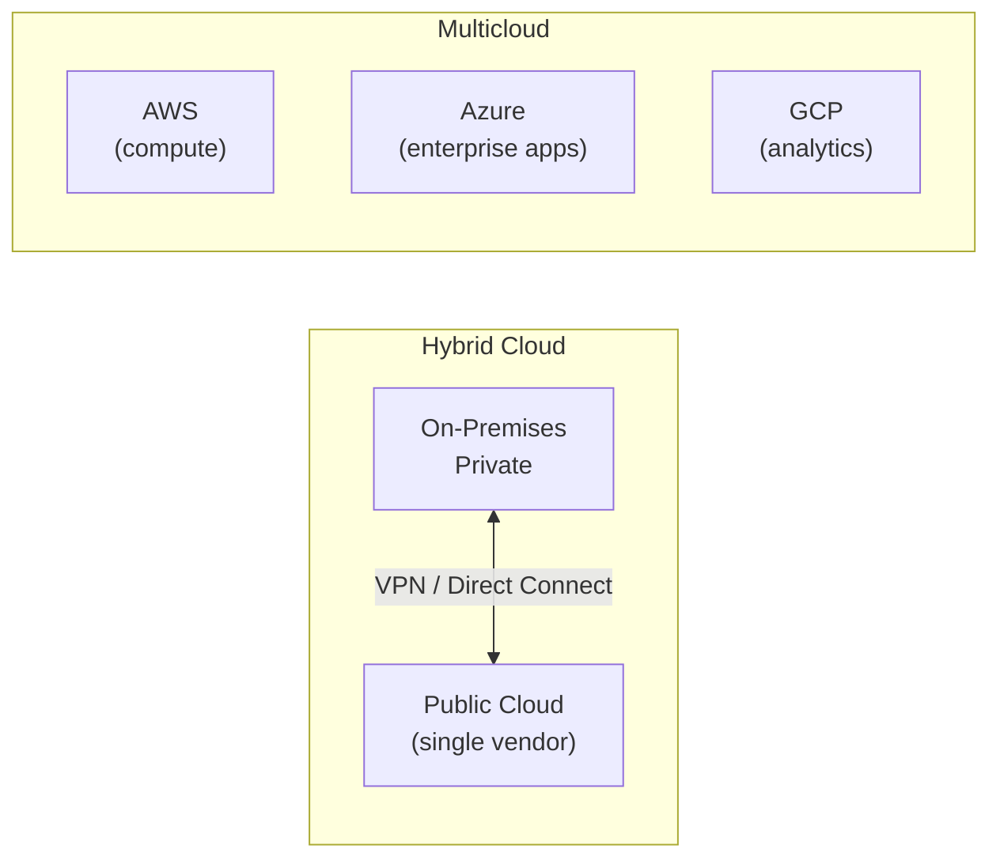
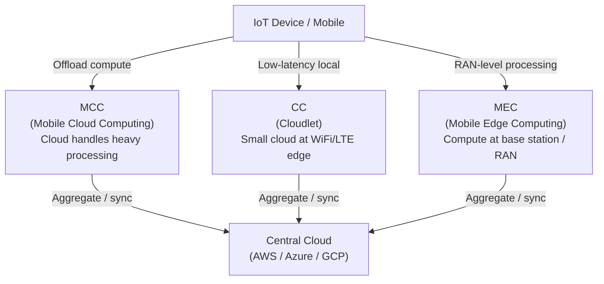
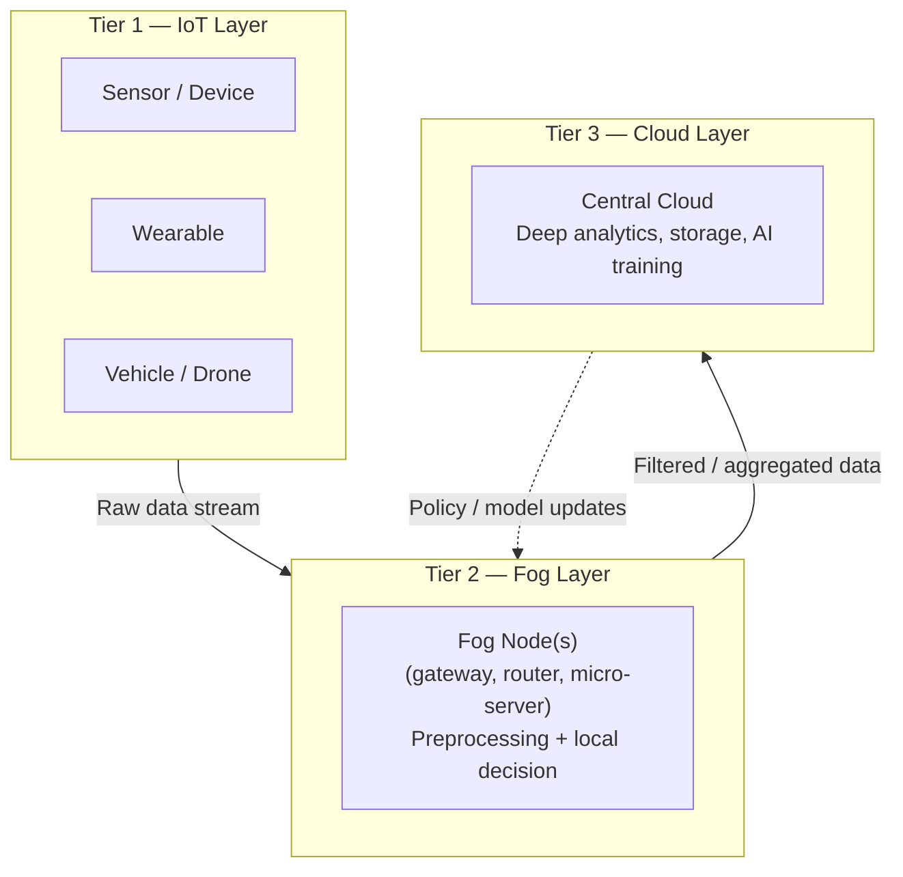

# Module 06 — Advanced Cloud Models and Concepts

## Task List

> Tip: ✅ = Done, 🔥 = WIP, 🕐 = Not started

| **#** | Task | Status |
|---|------|--------|
| **1** | Read & summarise McHaney, R. (2021) — What Is the Cloud Future? | ✅ |
| 2 | Watch & summarise AWS Online Tech Talks (2020) — Computing at the Edge | 🔥 WIP |
| 3 | Watch & summarise Atchison, L. (2022) — Microservices & Serverless | 🔥 WIP |
| 4 | Watch & summarise Chapple, M. (2022) — Cloud Orchestration | 🔥 WIP |
| **5** | Read & summarise Clinthicum, D. (2023) — Agility & Cloud Storage | ✅ |
| 6 | Activity 1: Try It for Yourself — Core Cloud Services (Azure) | 🕐 |
| 7 | Activity 2: Collaborative Learning — Everything as a Service (XaaS) | 🕐 |

---

## Key Highlights

### 1. McHaney, R. (2021). Cloud Technologies: An Overview of Cloud Computing Technologies for Managers, Ch. 10.

**Citation:** Manvi, S., & Shyam, G. K. (2021). Cloud computing: Concepts and technologies. CRC Press. (PDF on file: `r1_What_Is_the_Cloud_Future.pdf` — Chapter 10, pp. 225–234, from McHaney, R. (2021). *Cloud Technologies: An Overview of Cloud Computing Technologies for Managers.* John Wiley & Sons.)

**Purpose:** Surveys the major emerging cloud computing trends — from serverless and edge computing to ML and IoT integration — giving cloud professionals a forward-looking map of where the field is heading.

---

#### 1. Automation Trends: NoOps

- **NoOps** ("No Operations") = IT infrastructure so automated that dedicated ops staff become unnecessary
- Realistic interpretation: *more automation*, not zero humans — someone must set up the automation
- Enabled by DevOps movement, cloud-native tooling, and ML-driven anomaly detection
- New roles emerging: integrating secure cloud operations with business needs, rather than traditional ops roles

#### 2. Everything as a Service (EaaS)

- **EaaS** = practically all computing now runs in the cloud as subscription services
- Consumer examples: Netflix, music streaming, mobile apps
- Business value: **predictable cost**, steady cash flows, attractive to investors
- Trend shows no signs of slowing; "X as a Service" encompasses business software, productivity, and consumer products

#### 3. Security Innovation: Zero Knowledge Cloud Storage

- **Zero-knowledge cloud storage** = all data encrypted *before* leaving the client; the cloud provider cannot read it
- Only the **data owner holds the encryption key** — if key is lost, data is irretrievable
- Current limitations: **slower speeds** (encrypt/decrypt operations add latency), management complexity
- Future: providers working to speed up ZK storage and find better approaches for ultra-secure scenarios

#### 4. Serverless Architecture

- **Serverless** = dynamically automating provisioning/deprovisioning of infrastructure in real-time
- Cloud clients don't manage servers; the model *automatically* scales resources to demand
- Already powering Gmail and YouTube (Google)
- Consistent with NoOps philosophy — aligns with DevOps momentum
- Challenges: **latency** (delay between resource need and availability), security, ensuring deprovisioned servers leave no data residue

#### 5. Multicloud

| Concept | Definition |
|---|---|
| **Hybrid Cloud** | Mix of on-premises, private, and public cloud |
| **Multicloud** | Multiple *public* cloud vendors used simultaneously |

*Figure: Hybrid Cloud (on-prem + one public vendor) vs Multicloud (multiple public vendors).*

- Motivation: avoid vendor lock-in, improve negotiating leverage on SLAs, meet governance requirements, optimise for geographic proximity or speed
- Best-in-class approach: e.g. Salesforce for CRM, Office 365 for productivity, AWS for compute

#### 6. Machine Learning in the Cloud
<!-- here -->
- ML packages offered as cheap SDKs/APIs by all major cloud vendors
- **Supervised learning**: human-guided training, then prediction model
- **Unsupervised learning**: algorithmic iteration; suits complex domains (speech recognition, image classification)
- Cloud ML use cases:

| Domain | Example Application |
|---|---|
| IaaS | Predict optimal VM provisioning time to avoid latency |
| Security | Detect security breach patterns from usage data |
| SaaS | Predict customer churn from email patterns |
| Manufacturing | Optimal purchase timing for goods/services |

#### 7. Internet of Things (IoT) + Cloud

- IoT generates massive data from fitness bands, smart assistants (Echo), GPS, social media, sensors, mobile
- Cloud provides **scalable storage + variable processing power** for IoT data
- Natural fit: cloud elasticity meets IoT's unpredictable data bursts
- ML + IoT = key driver for new cloud architectural demands

#### 8. Edge Computing

- **Edge computing** = computation happens at the *network edge*, closer to IoT devices, reducing round-trips to central cloud
- Implementations:

| Model | Description |
|---|---|
| **MCC** (Mobile Cloud Computing) | Mobile devices offload storage/compute |
| **CC** (Cloudlet Computing) | Small trusted cloud at network edge, near mobile devices |
| **MEC** (Mobile Edge Computing) | Compute/storage via Radio Access Network edge |

*Figure: Three edge computing models (MCC, CC, MEC) and their relationship to the central cloud.*

- Benefits: low latency, high bandwidth, location awareness, scalability

#### 9. Fog Computing

- **Fog computing** = higher evolution of edge — distributed layer *between* IoT and Cloud, not just at the edge
- Fog nodes can be *anywhere* between end devices and the cloud
- Three-tier architecture: **IoT Layer → Fog Layer → Cloud Layer**
- Advantages acronym **SCALE**: **S**ecurity, **C**ognition, **A**gility, **L**atency, **E**fficiency
- Key distinction: Fog is not a replacement for cloud — it's a structured intermediary that *improves* IoT-Cloud interaction

*Figure: Three-tier Fog computing architecture — IoT devices feed fog nodes for local preprocessing before reaching the central cloud (De Donno et al., 2019).*

#### 10. Other Emerging Trends

| Trend | Key Idea |
|---|---|
| **Cloud as a Utility** | Pay-per-use model like electricity metering; auto-provisioning |
| **Cloud Streaming** | Explosive demand for video, games, VR, digital books — driving bandwidth/storage innovation |
| **Small Business Clouds** | NoOps + subscription models enable SMEs to avoid capital expenditure on IT staff |

#### Key Takeaways for Cloud Computing Fundamentals
1. **Serverless and NoOps** are the architectural embodiment of cloud's elasticity principle — they take automation to its logical conclusion
2. **Edge/Fog computing** directly addresses the bottleneck between IoT data volume and centralised cloud: data preprocessing at the edge reduces latency and bandwidth costs
3. **Multicloud vs Hybrid cloud** is a distinction likely to appear in assessments — know the definitions precisely
4. Activity 2 (XaaS discussion) is directly supported here: EaaS and the proliferation of "as a service" models is the contextual foundation
5. The progression NoOps → Serverless → Edge/Fog → Multicloud shows how cloud architecture is decentralising to meet real-world demands

---

### 2. AWS Online Tech Talks. (2020). Computing at the edge.

**Citation:** AWS Online Tech Talks. (2020, October 27). Computing at the edge: Choosing the best option for your application. YouTube. https://www.youtube.com/watch?v=hms0IkNqNJo

> *Status: 🔥 WIP — needs manual watch (YouTube video, no transcript available via fetch)*

---

### 3. Atchison, L. (2022). Microservices & Serverless Computing.

**Citation:** Atchison, L. (2022). 2. Microservices [Videos]. In Cloud architecture: Advanced concepts. LinkedIn Learning.

> *Status: 🔥 WIP — requires LinkedIn Learning authentication (manual access needed)*

---

### 4. Chapple, M. (2022). Cloud Orchestration.

**Citation:** Chapple, M. (2022). Cloud orchestration [Video]. In CCSP Cert Prep: 1 Cloud concepts, architecture, and design. LinkedIn Learning.

> *Status: 🔥 WIP — requires LinkedIn Learning authentication (manual access needed)*

---

### 5. Clinthicum, D. (2023). An Insider's Guide to Cloud Computing — Chapters 1 & 2.

**Citation:** Clinthicum, D. (2023). *An insider's guide to cloud computing*. Addison-Wesley Professional. https://learning-oreilly-com.torrens.idm.oclc.org/library/view/an-insiders-guide/9780137935819/ch01.html#ch01lev1sec1

**Purpose:** Reframes cloud value from operational cost savings to "soft values" — agility, speed, and innovation. Chapter 2 then anchors this in the practical problem of data quality: migrating bad data to the cloud makes things worse, not better.

---

#### 1. The Cloud Value Curve (Ch. 1)

- Most organisations misunderstand when cloud ROI materialises
- **Value curve is non-linear**: inflection point at ~30–40% migration, value increases rapidly, then plateaus in maintenance mode
- Operational cost savings are the *least* important value; **soft values are the real payoff**

| Soft Value | Definition |
|---|---|
| **Agility** | Business's ability to *change direction* around new requirements (acquisitions, new product lines) |
| **Speed** | Ability to move *fast in a single direction* — e.g. scale production to meet explosive demand |
| **Innovation** | Most underrated value; enables new capabilities previously impossible at current org scale |

#### 2. Agility Deep-Dive

- Agility = value multiplier: it enables more revenue, faster market entry, improved stock prices
- **The challenge**: value of agility is unknown until observed — requires best/worst-case scenario modelling
- Best-case example: electric lawnmowers see explosive demand → cloud scale-up captures revenue
- Worst-case example: economic downturn reduces demand for the same product
- Rule of thumb: *the more your business depends on change, the more valuable cloud is to it*
- **Operational savings should NOT be the primary cloud justification** — this was the key missed insight in early cloud adoption

#### 3. Speed vs Agility

- **Speed** = fast movement in *one direction* (e.g. scale up production for trending product)
- **Agility** = fast movement *across directions* (e.g. pivot business model, enter new market)
- Speed-to-market typically exists *within* agility as a sub-component

#### 4. Junk Data on Premises → Junk Data in Cloud (Ch. 2)

- Core mistake: migrating applications and data in a **poor as-is state**
- Common issues:
  - Redundant data → excess storage costs
  - No single source of truth
  - Tightly coupled applications to databases (change one, break many)
- Cloud does *not* fix bad data — it makes it **more expensive** (you now pay cloud rates for bad data)

#### 5. Lift-Fix-and-Shift vs Lift-and-Shift

| Approach | Description | Outcome |
|---|---|---|
| **Lift-and-Shift** | Move data/apps as-is to cloud | Cheap short-term; problems follow you |
| **Lift-Fix-and-Shift** | Fix data issues *during* migration | Higher initial effort; better long-term efficiency and agility |

- Goal of lift-fix-and-shift: **unified data layer**
- Unified data layer properties:
  - **Common views**: single view of customer, invoice, inventory across all systems
  - **Common access**: API/microservices layer decoupled from physical databases
  - **Common security & governance**: unified policy across multicloud + on-premises
  - **Common metadata**: master data management spanning all platforms

#### 6. Shared Responsibility in Storage

- Cloud providers supply well-maintained storage services; *how you use them is your responsibility*
- Providers have **no financial incentive** to increase your storage efficiency — inefficiency makes them more money
- Analogy: electric utility doesn't fix your HVAC for you; you pay for inefficiency
- "Shared responsibility" = you own the design decisions; cloud owns the infrastructure reliability

#### Key Takeaways for Cloud Computing Fundamentals
1. **Agility as primary cloud value** flips the typical ROI conversation — this is the nuanced perspective assessors look for in Analysis/Evaluation questions
2. **Data quality before migration** is a practical engineering concern: Activity 1 (Azure VM lab) is about provisioning, but real-world cloud work begins with data architecture decisions
3. **Lift-fix-and-shift** aligns with software engineering principles: technical debt addressed *before* migration is cheaper than patching it after
4. **Shared responsibility model** introduced here in the storage context directly relates to security and governance topics — reinforces the CSP boundary concept
5. The unified data layer concept (common views, common access, common security) is the data architecture equivalent of cloud's service model abstraction
