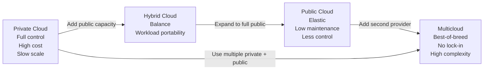
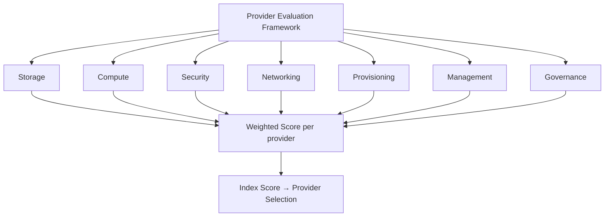
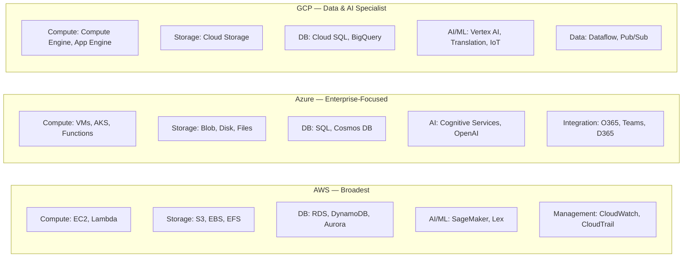
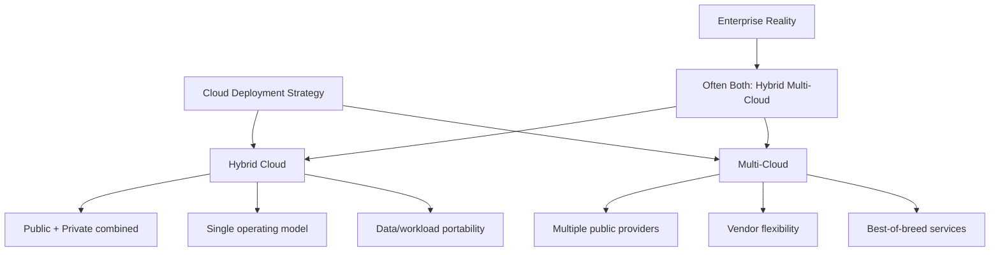
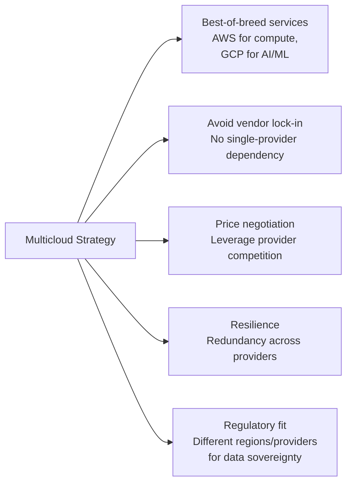
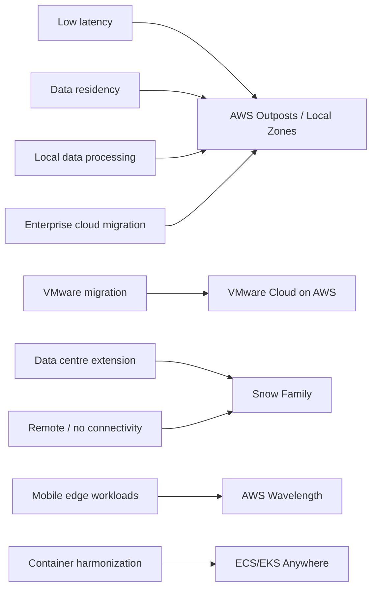
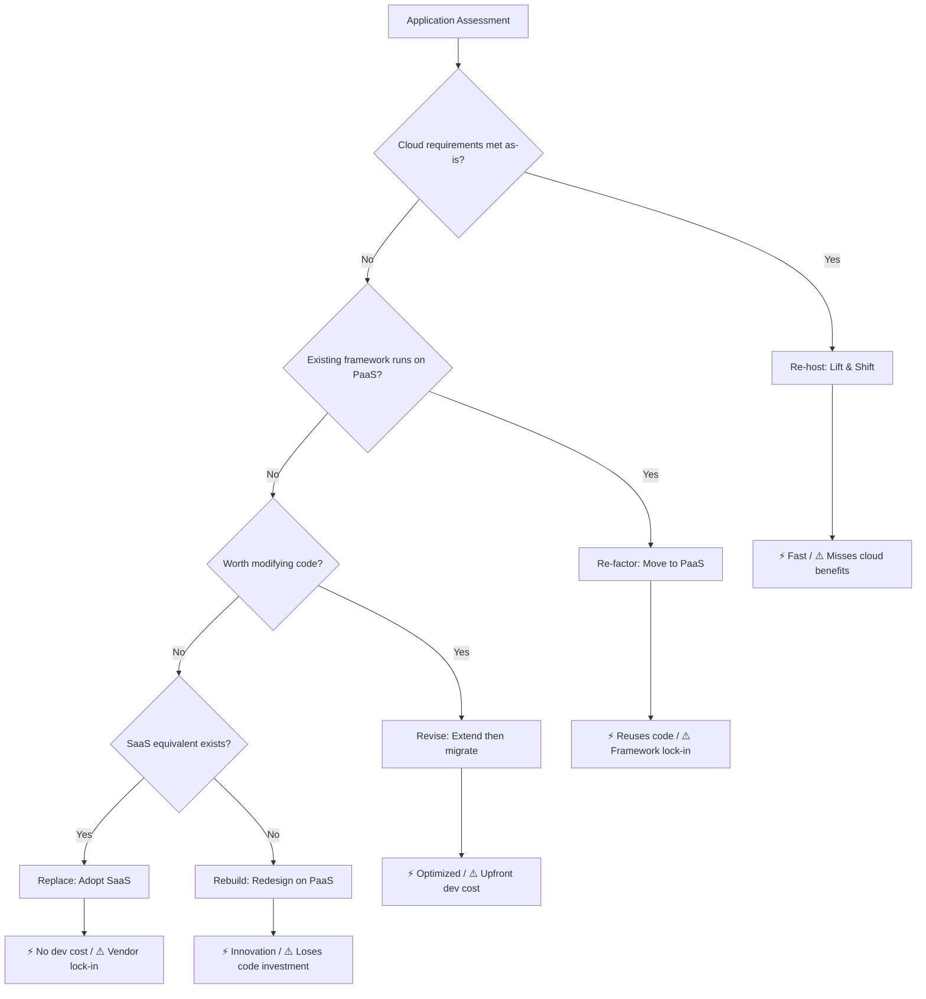
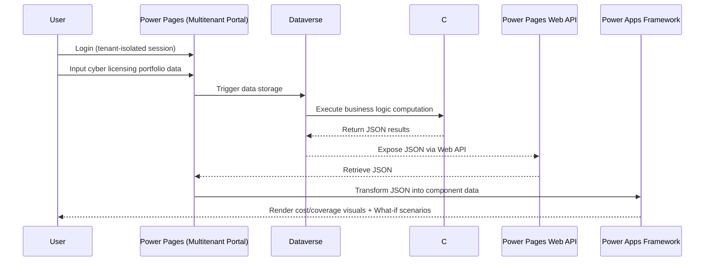

# Module 07 — Public, Private and Hybrid Deployment Models, Key Considerations

## Task List

> Tip: ✅ = Done, 🔥 = WIP, 🕐 = Not started

| **#** | Task | Status |
|---|------|--------|
| **1** | Watch & summarise Linthicum (2021) — Public, Private, Multicloud (LinkedIn Learning) | ✅ |
| **2** | Watch & summarise Linthicum (2019) — Selecting Public Cloud Platforms (LinkedIn Learning) | ✅ |
| **3a** | Read & summarise VMware (n.d.) — What is Hybrid Cloud? | ✅ |
| **3b** | Watch & summarise Linthicum (2022) — What is Multicloud? (LinkedIn Learning) | ✅ |
| 4 | Read & summarise Amazon Web Services (n.d.) — Understanding Hybrid Cloud With AWS | ✅ |
| 5 | Read & summarise Dignan (2019) — Top Cloud Providers 2019 (ZDNet) | ✅ |
| **6** | Activity 1: Analysing a Real-Life Cloud Strategy Document — Discussion Forum | ✅ |
| 7 | Activity 2: Case Study — PwC builds multitenant enterprise decision support site | ✅ |

> All resources completed. ✅

---

## Key Highlights

### 1. Linthicum, D. (2021). Public clouds, private clouds, multicloud [Video]. LinkedIn Learning.

**Citation:** Linthicum, D. (2021). Public clouds [Video]. In Learning cloud computing: Application migration. LinkedIn Learning. https://www.linkedin.com/learning/learning-cloud-computing-application-migration/public-clouds

**Purpose:** Compares public, private, and multicloud deployment strategies across agility, cost, control, and security dimensions — helping practitioners choose the right model for a given workload.

---

#### 1. Deployment Model Comparison

| Dimension | Public Cloud | Private Cloud | Multicloud |
|-----------|-------------|--------------|-----------|
| **Where it runs** | Outside the enterprise (provider DC) | Inside the enterprise (own DC or dedicated hosted) | Mix of any of the above |
| **Hardware ownership** | Provider owns and maintains | Organisation owns and maintains | Depends on combination |
| **Scalability** | ⚡ High — elastic on demand | ⚠️ Low — hardware provisioning takes weeks to months | ⚡ High — leverage best provider per workload |
| **Control** | ⚠️ Low — limited to what provider exposes | ✅ High — full stack ownership | Variable |
| **Security posture** | ⚠️ Shared responsibility; potential residency issues | ✅ Stronger — data stays on-prem | Complexity increases attack surface |
| **Data residency** | ⚠️ Harder to enforce | ✅ Easily enforced | Requires careful governance |
| **Cost model** | OpEx — pay-as-you-go | CapEx — upfront hardware investment | Mixed |
| **Maintenance burden** | ✅ None — provider managed | ⚠️ High — organisation manages everything | Shared across providers |
| **Key strength** | Feature-rich, global reach, agility | Compliance, control, customisation | Avoid lock-in, best-of-breed services |
| **Key risk** | Vendor dependency, cost unpredictability | Slower response to demand spikes | Operational complexity, integration overhead |

#### 2. The Deployment Spectrum

#### 3. When to Choose Each Model

| Use case | Best fit |
|----------|---------|
| Sensitive government or regulated data (healthcare, finance) | **Private cloud** |
| Startup or SaaS product needing rapid global scale | **Public cloud** |
| Enterprise with legacy on-prem systems + cloud growth | **Hybrid cloud** |
| Large org wanting AWS for compute and GCP for AI/ML | **Multicloud** |
| Application with FORTRAN/COBOL legacy and complex database layers | **Private first** — tangled architecture is hard to migrate without refactoring |

> 💡 **Key quiz insight:** Scaling a private cloud takes **weeks to months** — this is the fundamental reason enterprises adopt public or hybrid cloud for variable demand.

#### 4. Migration Readiness Checklist

Before choosing a deployment model for migration:
- [ ] Understand the **business drivers and risk tolerance** for moving to cloud
- [ ] Identify **workload characteristics** — latency sensitivity, data classification, compliance requirements
- [ ] Select the **right platform** based on workload fit, not default preference
- [ ] Design the **migration process**: phased, big-bang, or parallel run
- [ ] Plan for **scaling**: how will the new environment handle growth?
- [ ] Address **security and governance** from day one, not as an afterthought

#### Key Takeaways for CCF501

1. Private cloud = control and compliance; public cloud = agility and scale — hybrid is the practical middle ground for most enterprises
2. The scaling lag of private cloud (weeks to months) is a key driver for hybrid adoption — directly relevant to Activity 1 (govt dept moving to hybrid)
3. Multicloud avoids lock-in but adds management complexity — this trade-off underpins the module's "key considerations" theme

---

### 2. Linthicum, D. (2019). Application and data compatibility [Video]. LinkedIn Learning.

**Citation:** Linthicum, D. (2019). Application and data compatibility [Video]. In Learning cloud computing: Public cloud platforms. LinkedIn Learning. https://www.linkedin.com/learning/learning-cloud-computing-public-cloud-platforms-2/normalizing-the-offerings

**Purpose:** Teaches a structured, weighted evaluation framework for selecting a public cloud provider, applied to AWS, Azure, and GCP across storage, compute, security, networking, provisioning, management, and governance dimensions.

---

#### 1. The Evaluation Framework

Linthicum uses a **weighted scoring system** (called "disruptive vectors") to objectively rank providers rather than relying on brand preference. Each dimension is scored and weighted based on organisational priorities.

> The key insight: cloud selection should be **data-driven**, not marketing-driven. Score what matters to your organisation, then compare.

#### 2. Provider Comparison — The Big Three

| Evaluation Dimension | AWS | Microsoft Azure | Google Cloud Platform |
|---------------------|-----|----------------|----------------------|
| **Market position** | 🥇 Leader — most services, largest ecosystem | 🥈 Strong #2 — especially in enterprise | 🥉 Solid #3 — specialises in AI/data |
| **Storage** | Block, object, file + all major DBs | Strong storage and provisioning | Object (Cloud Storage), BigQuery for big data |
| **Compute** | EC2, ECS, Lambda (serverless) | VMs, AKS (Kubernetes), Functions | Compute Engine, App Engine (PaaS), GKE |
| **Databases** | DynamoDB, RDS, Aurora, DocumentDB | SQL Server, Cosmos DB, Azure SQL | Cloud SQL, BigQuery, Dataflow (data integration) |
| **Security** | IAM, encryption, HIPAA + SOX compliance | Average — improving rapidly | Strong governance and compliance features |
| **AI / ML** | SageMaker, Rekognition, Lex | Cognitive Services, Azure ML, OpenAI partnership | Best-in-class: BigQuery ML, Vertex AI, Translation |
| **Best for** | Broad enterprise, developer ecosystem, first cloud | Microsoft-centric orgs (.NET, SQL Server, Office 365) | Data-heavy, AI-driven, IoT, edge computing |
| **Evaluation score (example)** | Highest index overall | ~2.7 index score (Linthicum example) | Strong in specialised AI/data vectors |

#### 3. AWS vs Azure vs GCP — Service Breadth

#### 4. How to Apply the Framework

| Step | Action |
|------|--------|
| **1. Define priorities** | Weight dimensions by business need (e.g. if compliance is critical, weight Security × 2) |
| **2. Score each provider** | Rate each provider 1–5 on every dimension |
| **3. Apply weights** | Multiply score × weight for each dimension |
| **4. Sum index scores** | Compare total weighted scores |
| **5. Validate shortlist** | Test top candidates with a proof-of-concept on your actual workloads |

> Not all AWS services will be used by every organisation — evaluate fit for *your* specific requirements, not service count.

#### Key Takeaways for CCF501

1. A structured evaluation framework beats gut feeling — this is the professional approach to cloud platform selection covered in the module's "key considerations" theme
2. Azure wins when the org is already Microsoft-centric; AWS wins on breadth; GCP wins on AI/data — knowing this helps argue provider choice in assignments
3. Security, governance, and data residency should be **weighted higher** for regulated industries (government, healthcare, finance) — directly applicable to Activity 1 and Assessment 2

### 3a. VMware. (n.d.). What is hybrid cloud?

**Citation:** VMware. (n.d.). What is hybrid cloud? https://www.vmware.com/topics/glossary/content/hybrid-cloud.html

**Purpose:** Defines hybrid cloud, explains how it works, outlines its benefits and challenges, discusses security concerns, and draws the critical distinction between hybrid and multi-cloud architectures.

---

#### 1. Definition and How It Works

- **Hybrid cloud**: a computing model combining at least one **private cloud** and one **public cloud** that work together as a single flexible entity
- Data and application workloads move seamlessly between platforms using:
  - **Virtualisation** of data and workloads
  - **Network Function Virtualisation (NFV)** or VPNs
  - Connectivity to one or more cloud providers
- Hybrid infrastructure = mix of on-premises data centres + private cloud + public cloud

#### 2. Benefits

| Benefit | Description |
|---------|-------------|
| **Workload migration** | Move workloads without costly refactoring |
| **Application modernisation** | Deploy microservices/containers alongside legacy VMs on the same platform |
| **Scalability** | Leverage public cloud elasticity in near-real time |
| **Security & compliance** | Policies tied to workloads, enforced consistently everywhere |
| **Reduced IT workload** | Self-service for developers; unburdened IT staff |
| **Flexibility** | Deploy data/workloads where and when needed |
| **Reduced complexity** | Single operating model across all environments |
| **Cloud utility** | Shifts from infrastructure-centric to service-based operations |

#### 3. Challenges

A single operating model must address:
- **Migration without refactoring** — dissimilar environments force costly app rework
- **VM and container workloads** — IT must manage both legacy VMs and modern containerised apps simultaneously
- **Consistent security and policies** — security policies often tied to infrastructure, not workloads
- **Siloed tools and processes** — using different tools per environment creates skill gaps and inefficiencies

#### 4. Security

- Requires **Software-Defined Networking (SDN)**, virtualisation, and service mesh support across all layers
- Goal: "**single pane of glass**" administration covering traditional network management + real-time analytics
- Key challenge: supporting new software platforms not yet battle-tested in production
- Solution approach: **embedded SIEM** with real-time data packet scanning and network analytics

#### 5. Hybrid Cloud vs Multi-Cloud

| Aspect | Hybrid Cloud | Multi-Cloud |
|--------|-------------|-------------|
| **Definition** | Public + private cloud combined | More than one public cloud provider |
| **Goal** | Consistent infrastructure across environments | Flexibility across multiple public vendors |
| **Can they overlap?** | Yes — an environment can be both | Yes — multi-cloud can include a hybrid layer |
| **Management complexity** | Single operating model | Needs additional tools beyond hybrid foundation |

> Key insight: A hybrid cloud can be part of a multi-cloud strategy, but multi-cloud ≠ hybrid.

#### Key Takeaways for CCF501

1. **Activity 1** (Australian Govt cloud strategy) will likely involve evaluating a hybrid cloud deployment — the VMware framework provides vocabulary for that critique
2. Hybrid cloud selection factors (security, compliance, workload type) directly map to the module's "key considerations" theme
3. The hybrid vs multi-cloud distinction is critical for Assessment 2 (service model analysis)

### 3b. Linthicum, D. (2022). What is Multicloud? [Video]. LinkedIn Learning.

**Citation:** Linthicum, D. (2022). What is Multicloud? [Video]. In Planning a multicloud solution. LinkedIn Learning. https://www.linkedin.com/learning/planning-a-multicloud-solution-15038994/what-is-multicloud?autoplay=true&resume=false&u=56744473

**Purpose:** Defines multicloud, distinguishes it clearly from hybrid cloud, and frames the business case — when multicloud delivers real value vs when it adds unnecessary complexity.

---

#### 1. Multicloud vs Hybrid Cloud — The Critical Distinction

| Dimension | Multicloud | Hybrid Cloud |
|-----------|-----------|-------------|
| **Definition** | Multiple **public** cloud providers in one architecture | Mix of **different cloud types** (private + public + community) or legacy + cloud |
| **Typical providers** | AWS + Azure, or AWS + GCP, etc. | On-prem data centre + AWS, or private cloud + Azure |
| **Primary driver** | Best-of-breed services; avoid lock-in | Data residency, compliance, legacy app support |
| **Complexity** | High — managing multiple vendor APIs and billing | Medium — single operating model goal |
| **Overlap possible?** | Yes — a multicloud can also be hybrid | Yes — a hybrid often includes multiple public clouds |

> 💡 Multicloud = **which** public clouds. Hybrid = **what types** of cloud environments.

#### 2. Why Businesses Choose Multicloud

#### 3. The Business Value Test

Multicloud is not a default — it should be justified. Linthicum frames it as a deliberate business decision:

| Question | If YES → | If NO → |
|----------|----------|---------|
| Do different workloads need genuinely different provider strengths? | Multicloud adds value | Single cloud is simpler |
| Is vendor lock-in a real strategic risk? | Multicloud is warranted | Lock-in risk may be overstated |
| Can the organisation manage multi-vendor complexity? | Proceed with multicloud | Stick to single or hybrid |
| Does the cost of integration exceed the savings? | Reconsider | Multicloud is viable |

#### 4. Multicloud Trade-offs at a Glance

| Advantage | Disadvantage |
|-----------|-------------|
| Best-of-breed service selection | Higher operational complexity |
| No single-vendor dependency | More tooling, skills, and training required |
| Improved negotiating leverage on pricing | Harder to achieve a unified management plane |
| Geographic and regulatory flexibility | Integration and data transfer costs can add up |
| Resilience through provider redundancy | Security posture harder to enforce consistently |

#### Key Takeaways for CCF501

1. Multicloud ≠ hybrid — a common exam trap; the distinction is tested in the module's learning activities
2. The business value test is the right framing for Activity 1 (does the Australian Govt dept's hybrid approach deliver real value?) and Assessment 2 (justify the service model choice)
3. Complexity is the main cost of multicloud — always weigh it against the strategic benefit before recommending it

---

### 4. Amazon Web Services. (n.d.). Understanding hybrid cloud with AWS.

**Citation:** Amazon Web Services. (n.d.). Understanding hybrid cloud with AWS. https://pages.awscloud.com/rs/112-TZM-766/images/Understanding-Hybrid-Cloud-With-AWS.pdf

**Purpose:** Explains why pure cloud migration isn't always possible, identifies the hybrid cloud challenges organisations face, and details the AWS portfolio of hybrid services designed to extend cloud capabilities to on-premises, edge, and remote locations.

---

#### 1. Why Hybrid Cloud Exists — Common Challenges

| Challenge | Examples |
|-----------|---------|
| **Low latency** | Manufacturing automation, real-time gaming, financial trading, ML inference at the edge |
| **Local data processing** | Datasets too large or costly to migrate to cloud |
| **Data residency** | Regulations requiring data to stay in a country/state (healthcare, financial services, oil & gas) |
| **VMware migration** | Enterprises with significant VMware investment want to leverage existing tools |
| **Enterprise cloud migration** | Complex apps with components spanning on-premises and cloud |
| **Data centre extension** | Cloud bursting, backup, disaster recovery |

#### 2. AWS's Redefinition of Hybrid Cloud

- Traditional hybrid = connecting legacy data centre to cloud
- AWS vision: **extend cloud infrastructure to wherever data is generated** — restaurants, oil rigs, 5G networks, branch offices
- Benefits of this approach:
  - **Same tools, APIs, and services** across cloud and on-premises → avoids re-platforming
  - **Single management platform** → reduces operational overhead
  - Supports **latency-sensitive applications**: AR/VR, gaming, smart factories, live streaming

#### 3. AWS Hybrid Service Portfolio

| Service | What it does |
|---------|-------------|
| **AWS Outposts** | Deploys native AWS infrastructure into customer data centres, colocation sites, or on-premises — full racks or single compute units |
| **AWS Local Zones** | Extends an AWS Region into a metro area for low-latency workloads (media, gaming, content creation) |
| **AWS Wavelength** | Puts AWS compute/storage at the 5G edge — sub 10ms latency for mobile applications |
| **AWS Snow Family** | Portable devices for storage/compute in remote locations without persistent connectivity |
| └ Snowcone | Smallest unit; rugged; edge compute + data transfer |
| └ Snowball | Larger; Storage Optimized (80TB) or Compute Optimized (52 vCPUs + GPU) |
| └ Snowmobile | Shipping-container data centre; up to 100PB |
| **VMware Cloud on AWS** | Runs VMware SDDC on bare-metal AWS; enables cold/live (vMotion) migrations |
| **ECS/EKS Anywhere** | Extends container management (ECS or EKS) into customer-managed infrastructure |

#### 4. Real-World Customer Use Cases

| Company | Challenge | AWS Solution | Outcome |
|---------|-----------|-------------|---------|
| **Morningstar** | Too much time managing on-premises compute, slowing dev teams | AWS Outposts in data centre | Developers focus on building; faster time-to-market |
| **Tipico** | US gaming regulations required data on-premises within state boundaries | AWS Outposts in US colocation facility | Met compliance; launched US market with same stack |
| **Riot Games** | Latency differences gave players unfair advantages; needed fast edge deployments | AWS Outposts rack at remote sites | 10–20ms latency reduction; improved fairness |

#### Key Takeaways for CCF501

1. AWS Outposts is the flagship answer to the "data residency and latency" problem — relevant for any case study involving regulated industries
2. The Snow Family shows that hybrid cloud extends far beyond traditional data centres — useful context for Activity 1 (cloud strategy for a government department)
3. The Tipico case (regulatory compliance → on-premises data) directly mirrors the challenges government agencies face — good evidence for Activity 1 discussion

---

### 5. Dignan, L. (2019, August 15). Top cloud providers 2019.

**Citation:** Dignan, L. (2019, August 15). Top cloud providers 2019: AWS, Microsoft Azure, and Google Cloud; IBM makes hybrid move; Salesforce dominates SaaS. ZDNET. https://www.zdnet.com/article/top-cloud-providers-2019-aws-microsoft-azure-google-cloud-ibm-makes-hybrid-move-salesforce-dominates-saas/

**Purpose:** Surveys the competitive cloud landscape in 2019, comparing the "big three" IaaS providers (AWS, Azure, GCP), emerging players (Alibaba), and hybrid/multi-cloud specialists (IBM+Red Hat, VMware, Dell, Cisco), with key themes around multi-cloud, AI differentiation, and lock-in concerns.

---

#### 1. Market Structure and Key 2019 Themes

- Cloud wars are "not zero sum" — market growth lifts all players (Gartner: $3.76T global IT spend)
- **IaaS market largely decided**: AWS > Azure > GCP — but AI/ML has reopened competitive dynamics
- Emerging categorisation:
  - **Big 4 IaaS**: AWS, Azure, GCP, Alibaba
  - **Hybrid/multi-cloud players**: IBM+Red Hat, VMware, Dell, Cisco
  - **SaaS giants**: Salesforce, Oracle, Microsoft (commercial cloud)

**Key themes:**
- **Pricing power** — compute/storage race to bottom; AI/ML add-ons drive revenue
- **Multi-cloud adoption** — 97% of surveyed companies use AWS, but 35% also use Azure; 24% use AWS + GCP
- **AI as the upsell** — AWS, Azure, GCP all land on compute then upsell AI/ML differentiation
- **Financial opacity** — only AWS breaks out cloud revenue clearly; others bundle it

#### 2. The Big Three IaaS Providers

| Provider | 2019 Revenue Run Rate | Strengths | Differentiators |
|----------|----------------------|-----------|----------------|
| **AWS** | $33B | Ecosystem, developer tools, breadth of services | IaaS leader; ML/AI platform (SageMaker, Athena); VMware partnership for hybrid |
| **Microsoft Azure** | $11B (estimated) | Enterprise relationships, hybrid (AzureStack), full stack (Azure + O365 + D365) | Industry verticals; wins over AWS for retailers competing with Amazon |
| **Google Cloud Platform** | $8B | AI/ML leadership, Anthos (multi-cloud management) | Open-source friendly; Kubernetes/Istio/Apigee; Looker acquisition for analytics |
| **Alibaba Cloud** | $4.5B | Dominant in China; global expansion | Salesforce partnership in China; IOC partnership; strong ecosystem buildout |

#### 3. Hybrid and Multi-Cloud Players

| Player | Strategy | Key Asset |
|--------|----------|-----------|
| **IBM + Red Hat** | Be the "management console" across all clouds | Red Hat OpenShift (Kubernetes); $34B Red Hat acquisition; Watson AI across clouds |
| **VMware** | Bridge data centres to cloud via AWS partnership | vSphere, vRealize Suite; VMware Cloud on AWS; HCX for migrations |
| **Dell Technologies** | Unified Dell Cloud Platform spanning private + hybrid + public | Dell + VMware integration as the glue across its portfolio |
| **Cisco** | "Data centre anywhere" via ACI plugged into multiple clouds | Cisco-Google partnership (Kubernetes + Istio + Apigee) |

#### 4. Competitive Dynamics Worth Noting

- **Retailer displacement**: Large retailers avoid AWS because Amazon is a direct competitor — Azure wins these deals
- **Lock-in concerns**: Cost optimisation and vendor lock-in are top concerns for cloud customers (RightScale survey)
- **IBM's bet**: Red Hat acquisition positions IBM as infrastructure/management layer above all clouds — "Switzerland" of cloud
- **Azure's bundling advantage**: Azure + Office 365 + Dynamics 365 = hard to unbundle for enterprise customers

#### Key Takeaways for CCF501

1. The "big three + one" framework maps directly to the module's theme of choosing a cloud deployment platform — understanding provider strengths is the first step
2. The multi-cloud statistic (97% AWS + 35% Azure) shows why enterprises end up hybrid/multi-cloud by default, not by design
3. IBM's Red Hat strategy and Cisco/VMware's hybrid plays show that the deployment model decision extends beyond choosing one cloud provider — it involves an ecosystem
4. Assessment 2 will likely require analysing a cloud provider's service model — this article provides the competitive context for framing that analysis

---

> Resources 1, 2, 3b — LinkedIn Learning videos (no public transcript available). Watch manually and add highlights.

---

## Activity Highlights

### Activity 1. Australian Government Department of the Environment and Energy. (2019). Cloud strategy.

**Citation:** Australian Government Department of the Environment and Energy. (2019). Cloud strategy. Commonwealth of Australia. https://www.environment.gov.au/system/files/resources/210c5b71-85c4-414f-853e-359655a44445/files/cloud-strategy.pdf

**Purpose:** A real government cloud strategy document outlining why an Australian federal department adopted cloud, what principles guide that adoption, and how it structured decision-making around deployment model selection — including a Hybrid Cloud Decision Framework.

---

#### 1. Cloud Definitions and Deployment Models

The document uses the **NIST definition** of cloud computing and maps all major service and deployment types:

**Five essential cloud characteristics (NIST):**
| Characteristic | Description |
|----------------|-------------|
| **On-demand self-service** | Provision resources without admin interaction |
| **Network access** | Available over the network via any device |
| **Resource pooling** | Multi-tenant model with dynamic allocation |
| **Elasticity** | Scale in and out rapidly; appears unlimited |
| **Measured service** | Usage monitored and reported (pay-as-you-go) |

**Service models:**
| Model | Who manages what |
|-------|----------------|
| **IaaS** | Provider manages hardware/virtualisation; dept controls OS, storage, apps |
| **PaaS** | Provider manages infrastructure + platform; dept uses managed services |
| **SaaS** | Provider manages everything; dept only configures/subscribes |

**Deployment models used:**
- **Private cloud** — exclusive to the department (on-prem or third-party hosted)
- **Community cloud** — shared among agencies with common security requirements (e.g. Australian Government Protected level)
- **Public cloud** — open use; exists on cloud provider premises
- **Hybrid cloud** — composition of two or more of the above, bound by standardised technology enabling data/app portability

**CapEx → OpEx shift:** Cloud moves spending from capital assets (servers, storage) to operational consumption — changes the financial model and balance sheet treatment.

#### 2. Key Drivers (Why the Department Moved to Cloud)

Three driver categories:

| Category | Driver |
|----------|--------|
| **Whole of Government** | DTA Secure Cloud Strategy (2017) mandated agencies develop a cloud strategy by early 2019; 7 cloud principles issued |
| **Business** | Corporate Plan 2018–19 identified need for improved digital capabilities across 8 strategic focus areas |
| **Technology** | Steeply increasing ICT demand; need to rationalise and modernise; shrinking resources |

**DTA's 7 Cloud Principles (Whole of Government guidance):**
1. Make risk-based decisions when applying cloud security
2. Design services for the cloud
3. Use public cloud as the default
4. Use as much of the cloud as possible
5. Avoid customisation — use services "as they come"
6. Take full advantage of cloud automation practices
7. Monitor health and usage in real time

#### 3. Department's 8 Cloud Principles

| Principle | Intent |
|-----------|--------|
| **Consider Cloud First** | Evaluate cloud before any other option (not a mandate — a directive to consider) |
| **Cloud Choice** | Support multi-cloud, multi-provider; avoid lock-in via open standards |
| **Rationalise and Standardise** | Inventory, assess, and modernise the app portfolio before migrating |
| **Seamless and Efficient Operations** | Unified operating model across on-prem and cloud |
| **Secure and Governed Consumption** | Automated security/governance framework aligned to cyber strategy |
| **Modernised Datacentre** | Make on-prem cloud-ready with native integration |
| **Ease of Consumption** | Self-service catalogue of pre-approved services |
| **Business Process Alignment** | Transform business processes to leverage cloud, not just lift-and-shift |

#### 4. Cloud Foundations — 4 Key Initiatives

| Initiative | What it addresses |
|------------|------------------|
| **ICT Operating Model Transformation** | ICT role shifts from *builder* to *broker*; adopt SIAM (Service Integration and Management) to orchestrate multi-vendor environments |
| **Data and Information Management** | Update policies on what data can live in the cloud; address data governance, quality, residency, and records management |
| **Operational Service Readiness** | Transform support services (identity, backup, DR, security, financial management) to be hybrid-cloud capable |
| **Workforce Skills Alignment** | Upskill in cloud architecture, security, automation, infrastructure-as-code, service management |

#### 5. Cloud Adoption — Hybrid Cloud Decision Framework

The department's adoption strategy prioritises: **SaaS → PaaS → Commercial off-the-shelf → Configurable → Customised**

**Application Transformation types (the "5 Rs"):**

| Option | Description | Key trade-off |
|--------|-------------|--------------|
| **Re-host** | Lift-and-shift to cloud infrastructure | Fast migration, but misses cloud benefits (scalability) |
| **Re-factor** | Run on PaaS using existing languages/frameworks | Reuses investments; risk of framework lock-in |
| **Revise** | Extend/modify code before re-hosting or re-factoring | Optimized for cloud; requires upfront dev cost and time |
| **Rebuild** | Discard and redesign on PaaS | Access to innovative features; loses existing code investment |
| **Replace** | Discard and adopt SaaS equivalent | Avoids dev cost; risks data semantics issues and vendor lock-in |

Prime candidates for cloud migration: customer-facing portals, online training/forms/docs, partner integrations, e-commerce payment gateways, cloud management/brokerage systems.

#### Key Takeaways for CCF501 — Activity 1 Discussion

1. **Deployment model choice**: The department chose a **hybrid cloud** — aligning with regulatory requirements (Australian Government Protected classification), data sovereignty needs, and the "consider cloud first" directive
2. **Staff and business transformation**: The 4 Cloud Foundations (especially Workforce Skills and ICT Operating Model) show the department recognised cloud is not just a technology change — it's an organisational transformation
3. **Hybrid cloud migration approach**: The Hybrid Cloud Decision Framework provides structured criteria for workload placement; the "5 Rs" show the migration approach is iterative, not big-bang
4. Strong alignment with Module 7 resources: the department's approach mirrors VMware's hybrid model and AWS's "extend cloud to where data lives" philosophy

#### Forum Discussion:
I agree with the department's chosen approach to migrating to hybrid cloud, as expressed through its Hybrid Cloud Decision Framework and the 5Rs application transformation strategy.

Rather than a big-bang migration, the department proposed an iterative, workload-by-workload evaluation — prioritising SaaS before PaaS, commercial off-the-shelf before custom builds, and applying the 5Rs (Re-host, Re-factor, Revise, Rebuild, Replace) to guide each application's path to the cloud. This is a pragmatic approach: it acknowledges that not all systems are cloud-ready, avoids the costly refactoring trap, and preserves optionality at each stage.

This aligns directly with VMware's (n.d.) observation that migration without refactoring is one of the central challenges of hybrid cloud adoption — dissimilar environments force costly rework if the operating model isn't consistent from the start. The department's framework addresses this by establishing governance criteria — compliance, security, business value, and consumption preference — before any workload moves, rather than retrofitting governance afterwards.

One limitation worth noting is that the strategy dates from 2019. The SaaS-first priority order remains sound, but the multicloud management tooling available today (such as AWS Outposts or Azure Arc) has matured considerably, which may open more flexible Re-host and Re-factor paths than the department originally anticipated.

Overall, the iterative, criteria-driven migration approach reflects industry best practice and positions the department to modernise without exposing itself to unnecessary operational risk.

---

### Activity 2. Microsoft. (2022). PwC builds multitenant enterprise decision support site with Power Pages.

**Citation:** Microsoft. (2022). PwC builds multitenant enterprise decision support site with Power Pages. https://customers.microsoft.com/en-us/story/1558972627174665363-pricewaterhousecoopers-banking-and-capital-markets-power-pages

> **Note:** Students are advised against using this case study for Assessment 2 (per module instructions).

**Purpose:** A Microsoft customer story showing how PwC replaced a complex full-stack application with a low-code Microsoft Power Platform solution, achieving significant cost and time savings while improving scalability and maintainability.

---

#### 1. The Challenge PwC Was Having

PwC's clients — including CIOs and CTOs — needed a decision support tool to **forecast costs for cybersecurity risk management and compliance**. The existing tool was:
- A **full-stack custom application** (React + Node.js + PostgreSQL)
- **Cumbersome to update** — business logic was embedded in stored procedures in PostgreSQL
- Required **specialised developers** for every change
- Lacked **self-sufficiency for clients** — users couldn't explore scenarios independently

PwC's two priorities for the replacement: (1) a **low-code solution** for better maintainability, and (2) **reusability** — build once, deploy for many clients (multitenant).

#### 2. Service Model Analysis

| Layer | Service | Cloud Model |
|-------|---------|-------------|
| **Frontend / Website** | Microsoft Power Pages | **SaaS / PaaS** (low-code web portal) |
| **Data layer** | Microsoft Dataverse | **PaaS** (managed database with API) |
| **Business logic** | C# plugins in Dataverse | **PaaS** (custom code running on managed platform) |
| **Component reuse** | Microsoft Power Apps framework | **PaaS** (component framework) |
| **Security & compliance** | Microsoft Azure (underlying) | **IaaS/PaaS** (identity, access control, data sovereignty) |

This is primarily a **PaaS/SaaS hybrid** deployment — PwC consumes managed platform services and builds on top, rather than managing infrastructure.

#### 3. Different Services Used and Their Applications

| Service | Application in the solution |
|---------|-----------------------------|
| **Microsoft Power Pages** | Hosts the multitenant Cyber Technology Rationalizer website; enforces tenant isolation (each user associated with one environment only) |
| **Microsoft Dataverse** | Stores user data and application data; provides the Web API for data retrieval |
| **C# plugins (Dataverse)** | Handles business logic computations; produces JSON output consumed by the frontend |
| **Power Apps component framework** | Integrates legacy React components into the new system without rewriting them |
| **Microsoft Azure** | Provides underlying security, compliance, and data management infrastructure |

#### 4. Architecture Flow

#### 5. Outcomes

- Built the **Cyber Technology Rationalizer in 6 weeks**
- **85% cost savings**, **30% time savings** vs the legacy system
- Existing React components reused as Power Apps framework components → no rework
- Reusable elements: user data management, master data structure, client management, data visualisations

#### Key Takeaways for CCF501 — Activity 2 Analysis

1. **Challenges**: Legacy full-stack app with embedded business logic was unmaintainable and developer-dependent
2. **Service model**: Primarily **PaaS** (Dataverse + Power Pages + C# plugins) with **SaaS** elements (Power Platform licensing); underlying **Azure IaaS** for security and compliance
3. **Different services**: Power Pages (web), Dataverse (data + API), C# plugins (logic), Power Apps framework (UI components), Azure (security)
4. **Application of services**: Each service plays a distinct architectural role — separation of concerns across presentation, data, and logic layers — demonstrating the multi-tier cloud architecture pattern central to CCF501
