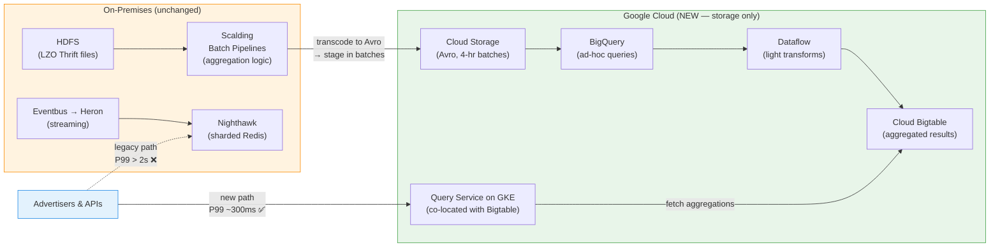
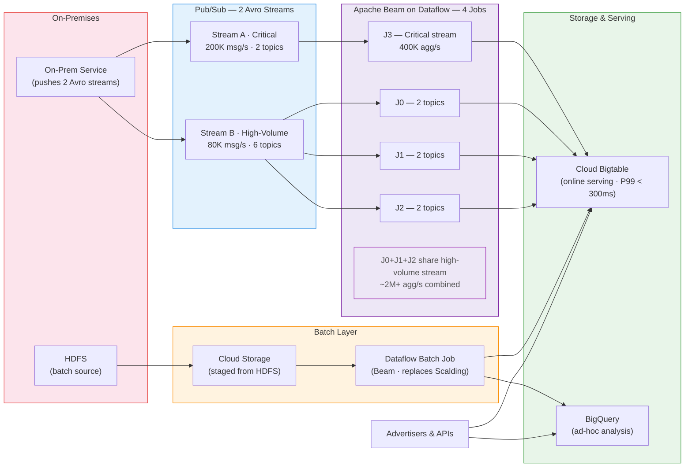

# Module 08 — Deployment Case Studies

## Task List

> Tip: ✅ = Done, 🔥 = WIP, 🕐 = Not started

| **#** | Task | Status |
|---|------|--------|
| 1 | Read & summarise Amazon Web Services (2022) — eHealth NSW cloud migration | ✅ |
| 2 | Read & summarise Phalip & Niemitz (2020) — Twitter ad analytics on Google Cloud | ✅ |
| 3 | Read & summarise Amazon Web Services (2021) — City of Charles Sturt on AWS | ✅ |
| **4** | Watch & summarise IBM (n.d.) — Innocens BV predictive AI for neonatal care | ✅ |
| 5 | Activity 1: A Cloud Deployment Success Story — Vitaldent discussion forum | ✅ |
| 6 | Activity 2: Hands-On Lab — Set up and deploy Amazon EC2 Linux instances | ✅ |
| **7** | Activity 3: Lab Reflections — EC2 configuration reflection post | ✅ |

---

## Key Highlights

### 1. Amazon Web Services. (2022). eHealth NSW transforms public health system with the cloud.

**Citation:** Amazon Web Services. (2022). *eHealth NSW transforms public health system with the cloud.* https://aws.amazon.com/solutions/case-studies/ehealth-nsw-case-study/

**Purpose:** Documents how NSW Health's ICT arm migrated 10 mission-critical clinical applications from on-premises infrastructure to AWS, realising measurable performance, cost, and workforce improvements.

---

#### 1. The Migration Context

- **eHealth NSW** is the ICT service provider for NSW's public health system — 8.2 million residents, 160,000 staff, 228 hospitals
- Migrated **10 clinical applications** (2021–2022), with a strategy to **refactor** rather than just lift-and-shift — adopting managed AWS services along the way
- Cloud migration was driven by three goals: **operational efficiency**, **patient data access**, and **digital workforce upskilling**

#### 2. Key AWS Services Used

| Service | Purpose |
|---------|---------|
| AWS Security Hub + Amazon GuardDuty | Automated security checks, continuous monitoring, early threat detection |
| Amazon FSx for NetApp ONTAP | Hosts Enterprise Image Repository (EIR) — 1.6 PB of diagnostic images, growing 25%/year |
| Amazon RDS | High availability, encrypted DB, automated patching/backups |
| Amazon Connect | Built a COVID-19 testing call centre in 2 weeks; peaked at 40,000 tickets/week |
| Amazon Pinpoint | SMS bot for COVID test result notifications (from 10 days → hours) |

#### 3. Measured Outcomes

| Metric | Before | After |
|--------|--------|-------|
| Enterprise Patient Records performance | Baseline | **10× improvement** |
| Critical incidents | Baseline | **70% reduction** |
| Time to create new environments | 6–8 weeks | **Under 4 hours** |
| Enhancement delivery speed | Baseline | **50% faster** |
| Cost/benefit recognised | — | **US$16M avoided costs** |
| Clinician productivity recovered | — | **144,000 collective hours** |
| Video conferencing capacity during COVID | Baseline | **18× scale increase** |

#### 4. Workforce Upskilling — Digital Academy

- **Digital Academy (DA)** launched 2020 with 9 pillars: Agile, Cloud, Cybersecurity, Analytics, Human-Centred Design, Integration, Safety & Quality, Service Management, and Customer-first
- AWS added as a multi-technology cloud stream; targets enterprise architects, cloud engineers, clinicians, project managers, and others
- **1,500+ staff** trained by October 2022 (target: majority of 2,000 by 2023)
- Notable outcome: increased confidence in tech among women staff

#### Key Takeaways for CCF501
1. Demonstrates all five NIST cloud characteristics in practice: on-demand provisioning, scalability, measured service, broad access, resource pooling
2. Refactoring vs. lift-and-shift is the difference between moderate and transformational benefit — relevant for Assessment 3 cloud strategy discussions
3. Security (GuardDuty, Security Hub) and compliance are non-negotiable in health data — maps to Module 7's key deployment considerations
4. Staff training is as critical as the technical migration — cloud success is a people and culture challenge, not just a technology one

---

### 2. Phalip, J., & Niemitz, S. (2020). Modernizing Twitter's ad engagement analytics platform.

**Citation:** Phalip, J., & Niemitz, S. (2020, March 19). *Modernizing Twitter's ad engagement analytics platform.* Google Cloud. https://cloud.google.com/blog/products/data-analytics/modernizing-twitters-ad-engagement-analytics-platform

**Purpose:** Details Twitter's two-phase migration of its ad engagement analytics platform from a bespoke on-premises Hadoop stack to a fully managed Google Cloud architecture, achieving billions of events processed in near-real time.

---

#### 1. The Legacy Architecture (Pre-Migration)

- **Input**: Real-time ad engagement events streamed to HDFS as LZO-compressed Thrift files
- **Batch**: Scalding pipelines aggregated data; results stored in **Manhattan** (Twitter's homegrown key-value store)
- **Streaming**: Eventbus (messaging) → Heron (stream processing) → Nighthawk (sharded Redis)
- **Pain points**: Difficult to extend; long-running jobs were unreliable; serving system was expensive and couldn't support large queries

#### 2. First Iteration (2017) — Storage Migration



| Component | Before | After |
|-----------|--------|-------|
| Aggregation | Scalding (on-prem, unchanged) | Scalding (on-prem, unchanged) |
| Ad-hoc/batch storage | Manhattan | **BigQuery** (serverless data warehouse) |
| Serving/APIs storage | Manhattan | **Cloud Bigtable** (low-latency NoSQL) |
| Query service | Expensive legacy system | New service on **GKE**, co-located with Bigtable |
| Serving P99 latency | 2+ seconds | **300 ms** |

- **What moved**: only storage and serving — Scalding aggregation logic stayed on-prem entirely untouched
- **What advertisers felt**: immediate, zero-ambiguity improvement — P99 latency dropped from 2+ seconds to ~300ms thanks to Bigtable's linear scalability and the GKE query service co-located with it
- **Why it worked**: Bigtable + GKE is purpose-built for low-latency key lookups at scale; the old Manhattan serving layer simply couldn't compete
- De-risked the overall migration — by validating the serving layer first, the team could tackle the aggregation logic rewrite with confidence in iteration 2

#### 3. Second Iteration (2019) — Full Pipeline Migration to Apache Beam / Dataflow

**Why Apache Beam?**
- Built-in **exactly-once semantics** at massive scale across clusters
- **Unified batch + streaming** model — one job codebase handles both inputs (Cloud Storage) and streaming inputs (Pub/Sub)
- Deep integration with BigQuery, Bigtable, and Pub/Sub
- Deployable on **Dataflow** (fully managed)



**New Architecture:**

| Layer | Technology | Scale |
|-------|-----------|-------|
| Data ingestion (streaming) | **Pub/Sub** — two Avro-formatted message streams | 200K + 80K messages/sec |
| Data processing | **4 Dataflow jobs (J0–J3)** running Beam pipelines | 3M+ aggregations/sec |
| Batch layer | Dataflow batch job from Cloud Storage → BigQuery + Bigtable | Dual-write |
| Serving | Cloud Bigtable (unchanged from iteration 1) | Sub-300ms P99 |
| Ad-hoc analysis | BigQuery | Serverless |

**Stream partitioning strategy:**
- High-volume stream split into **6 Pub/Sub topics**, processed by 3 parallel Dataflow jobs
- Hash-based partitioning ensures **per-key grouping is scoped to a single partition** — required for consistent aggregation
- Allows individual job draining/updates without affecting the others
- Horizontal scale path: up to 6 independent jobs if needed

#### 4. Developer Experience Improvements

- Custom **pystachio DSL** for declarative job configuration (tuning, sources, sinks, code location)
- Custom CLI tool automates job updates: drains old job, polls for watermark, launches new job
- Eliminates boilerplate for orchestration — developers focus on transformation logic only

#### Key Takeaways for CCF501
1. Real-world example of cloud agility and scalability — Twitter's platform went from unreliable and expensive to processing 3M+ aggregations/second reliably
2. Phased migration is a risk management strategy — validate gains at each step before committing further
3. Managed services (Dataflow, Pub/Sub, Bigtable) eliminated operational overhead that custom infrastructure was creating — a direct cost and reliability win
4. The move from homegrown tools (Manhattan, Heron, Nighthawk) to managed cloud services illustrates why cloud adoption is often about **reducing complexity**, not just adding features

---

### 3. Amazon Web Services. (2021). The City of Charles Sturt transforms public service delivery for its community using the AWS cloud.

**Citation:** Amazon Web Services. (2021). *The City of Charles Sturt transforms public service delivery for its community using the AWS cloud.* https://aws.amazon.com/solutions/case-studies/city-of-charles-sturt/

**Purpose:** Case study of a South Australian local government council's first full data centre migration to AWS, completed on time and budget despite a global pandemic — with measurable improvements in resilience, security, and agility.

---

#### 1. The Organisation

- **City of Charles Sturt (CCS)**: Council serving 120,000 residents between Adelaide CBD and sea; 550+ staff; Civic Centre at Woodville, works depot, 5 library branches, community centres
- **IT environment**: 80+ applications, 1,700 IT assets, 50 TB of data
- IT partner: **Comunet** — 25-year IT strategy consultancy; AWS Partner

#### 2. The Challenge

| Problem | Detail |
|---------|--------|
| Aging on-premises infrastructure | Significant portion scheduled for replacement |
| Security posture | Needed resilience improvement and cyber security uplift |
| Operational risk | Single-point-person risk and weak disaster recovery practices |
| Innovation gap | Needed cloud agility to support Smart City initiative |
| Resource constraint | ICT team needed to shift from operational to value-add work |

#### 3. The Approach — AWS MAP (Migration Acceleration Program)

- **Lift and Shift** methodology: servers and storage migrated to **AWS Sydney Region**
- Comunet used the **AWS Professional Services MAP Methodology** — based on best practices from hundreds of customer migrations
- Emphasis on skills transfer: CCS wanted to upskill its own team, not just outsource and hand over

#### 4. The Outcome

| Metric | Result |
|--------|--------|
| Applications migrated | **48 applications** |
| Time to migrate | **93 days** |
| Portfolios migrated | Asset Management, City Services, Corporate Services |
| Uptime achieved | **99%** |
| Security guardrails implemented | **35** detective + preventative guardrails |
| AWS security services deployed | **10** (covering IAM, logging, monitoring, infrastructure, data protection) |
| Award | **Local Government IT SA — Excellence in IT Service Delivery (October 2020)** |
| Pandemic context | Completed on time and budget despite COVID-19 hitting mid-project |

#### 5. Cloud Value Drivers Demonstrated

- **Agility**: Faster server provisioning and deployment of new applications
- **Resilience**: 99% uptime + disaster recovery capability
- **Security**: Guardrails and monitoring services previously unavailable on-prem
- **Smart City readiness**: Cloud foundation enables future innovation initiatives

#### Key Takeaways for CCF501
1. Smaller organisations (local government) can achieve enterprise-grade resilience through cloud — cloud democratises access to infrastructure that was previously only viable for large enterprises
2. The AWS MAP methodology provides a structured, low-risk migration path — useful to reference in cloud strategy assessments
3. Agility is a recurring theme across all Module 8 case studies — cloud removes the slow provisioning cycles that constrain on-prem environments
4. Staff upskilling and partnership (Comunet) were as important as the technology — mirrors eHealth NSW's Digital Academy investment

---

### 4. IBM. (n.d.). Innocens BV uses predictive AI to protect the most vulnerable newborns [Video].

**Citation:** IBM. (n.d.). *Innocens BV uses predictive AI to protect the most vulnerable newborns* [Video]. IBM Media Center. https://mediacenter.ibm.com/media/Innocens+BV+uses+predictive+AI+to+protect+the+most+vulnerable+newborns./1_zs73psgr/61201542

**Purpose:** Demonstrates how a Belgian healthcare startup leveraged IBM Cloud and edge computing to build a real-time AI solution that detects neonatal sepsis hours earlier than traditional bedside monitoring, with implications for life-saving intervention.

---

#### 1. The Problem

- **Neonatal sepsis** is a bloodstream infection that is particularly dangerous in premature infants
- Symptoms are subtle; by the time it's clinically obvious, it may be too late for effective intervention
- Traditional monitoring requires continuous bedside observation — human attention is finite and inconsistent
- Innocens founder trained in Sydney and observed: "Nothing changed at the bedside for my patients and parents"

#### 2. The Solution — Edge Computing + Predictive AI

| Component | Description |
|-----------|-------------|
| **Data source** | Real-time vital signs from medical sensors (monitors at the bedside) |
| **Processing** | Edge computing device at the bedside — processes data locally for low latency |
| **AI model** | Machine learning model trained on vital sign patterns correlated to sepsis onset |
| **Cloud platform** | **IBM Cloud** — provides secure data environment and computational power for model training |
| **Output** | Risk score / alert to clinicians when patterns match known sepsis indicators |

#### 3. Performance Metrics

| Metric | Value |
|--------|-------|
| Severe sepsis detection accuracy | **~75%** |
| False alarm rate | **Less than 1 per week** |
| Time saved in diagnosis | **Up to several hours earlier** detection vs. standard care |
| Training data | University Hospital of Antwerp (cross-validated) |

#### 4. Federated Learning — Scaling Without Compromising Privacy

- Different NICUs (Neonatal Intensive Care Units) hold sensitive patient data that cannot be easily centralised
- Innocens + IBM Research are building a **federated learning model**: each centre trains locally; models are **aggregated in IBM Cloud** without sharing raw patient data
- This is a direct application of **cloud + AI for privacy-preserving healthcare at scale**

#### 5. IBM Cloud's Role

- **Trusted infrastructure**: Secure environment for sensitive healthcare data
- **Compute at scale**: Computational power to run heavy ML training iterations quickly
- **Trustworthy AI principles**: IBM's position is that AI in healthcare must be explainable and reliable

#### 6. Human-Centred Design

- Design sprints for the clinical dashboard **involve parents** — not just clinicians
- Surfaces insights about how families interact with health information at the bedside
- Reflects that cloud-hosted AI products must be designed for real human contexts, not just technical performance

#### Key Takeaways for CCF501
1. Edge computing + cloud is a powerful hybrid: data is processed locally for real-time speed, but the cloud handles model training, storage, and federation — connects back to Module 6's edge computing and hybrid models
2. AI-in-cloud is not hypothetical — Innocens shows a production system with measurable life outcomes (75% sepsis detection, <1 false alarm/week)
3. Federated learning is the cloud-native answer to healthcare data privacy — enables cross-institutional learning without centralising sensitive data
4. "Trusted tech partner" (IBM) is a recurring theme — cloud adoption is a partnership, not just a product purchase

---

## Learning Activities

### Activity 1: A Cloud Deployment Success Story — Vitaldent / Microsoft Dynamics 365

**Source:** Microsoft. (2021). *Vitaldent is smiling with better customer insights, quality patient interactions on Dynamics 365.* https://customers.microsoft.com/en-us/story/1333893572939563840-vitaldent-health-provider-dynamics-365

---

#### 1. Challenges for the Microsoft Dynamics 365 Migration

Vitaldent — Spain's leading dental health group with 300+ clinics and 7.5 million patients per year — needed to unify patient data and communication across its entire clinic network. The core challenges were:

- **Fragmented data sources**: Patient histories, CRM, and ERP systems were siloed, making a 360° patient view impossible
- **Inconsistent clinic-patient communication**: Each clinic operated in isolation; there was no unified channel for follow-up, feedback, or treatment tracking
- **Scaling across geographies and languages**: Vitaldent was expanding nationally and internationally, requiring a platform that could handle multiple languages and cultures
- **Manual campaign development**: Marketing relied on disconnected data, making targeted campaigns slow and inefficient

#### 2. How the Challenges Were Solved

| Challenge | Solution |
|-----------|---------|
| Fragmented patient data | **Dynamics 365 Customer Insights** unified data from disparate sources into a single platform |
| Poor clinic-patient communication | **Dynamics 365 Customer Voice** enabled automated, personalised questionnaires and real-time feedback collection |
| Scaling internationally | Dynamics 365's multi-language, multi-region capabilities provided a growth-ready foundation |
| Slow marketing campaigns | Customer Insights fed directly into **Dynamics 365 Marketing**, cutting campaign development time by **70%** |
| Implementation complexity | **Prodware** (Microsoft Gold Partner) delivered the patient management system built on Dynamics 365, integrating clinical data and treatment workflows |

The solution was adopted immediately — non-technical staff described it as easy to use from day one.

#### 3. Applications and Services Used

| Service | Purpose |
|---------|---------|
| **Microsoft Dynamics 365 Finance** | Financial management (deployed 2019, first phase) |
| **Microsoft Dynamics 365 Supply Chain Management** | Back-office process productivity (first phase) |
| **Prodware Item Lifecycle Management accelerator** | Integrated accelerator for clinical supply workflows (first phase) |
| **Dynamics 365 Customer Insights** | Unified patient data platform — single source of truth for patient history and interactions |
| **Dynamics 365 Customer Voice** | Patient satisfaction surveys and real-time feedback collection |
| **Dynamics 365 Marketing** | Targeted campaigns driven by Customer Insights data |
| **Custom patient management system (via Prodware)** | Handles complexity of multi-stage dental treatment management and patient histories |

#### Key Takeaways for CCF501
1. Vitaldent shows SaaS (Microsoft Dynamics 365) delivering business transformation — aligns with Module 4's SaaS service model
2. The two-phase approach (ERP first → CRM second) mirrors the phased migration strategy seen in Twitter and eHealth NSW — a pattern for managing risk in cloud adoption
3. 70% reduction in campaign development time is a concrete productivity metric — useful for framing the ROI argument in cloud strategy assessments
4. Data unification through cloud (Customer Insights) is a direct demonstration of Module 6's cloud agility value: previously siloed operations became responsive and connected

#### Forum Discussion:
- List the challenges mentioned in the case study for the Microsoft Dynamic 365 migration.
- How were the challenges solved?
- List the applications of the different services used in the case study.
Post your response of no more than 250 words in the Module 8 discussion forum.

The challenges mentioned in the case study vary from fragmented patient data, poor clinic-patient communication, scaling internationally, slow marketing campaigns, and implementation complexity. The solutions to these challenges was the implementation of Microsoft Dynamics 365 features to pinpoint the issues and provide an unified platform for the company, examples below:

Customer insights unified data from disparate sources into a single platform, Customer Voice enabled automated, personalised questionnaires and real-time feedback collection, Dynamics 365's multi-language, multi-region capabilities provided a growth-ready foundation, Customer Insights fed directly into Dynamics 365 Marketing, cutting campaign development time by 70%, and Prodware (Microsoft Gold Partner) delivered the patient management system built on Dynamics 365, integrating clinical data and treatment workflows.

Finally, the applications of the different services used in the case study are:
- Microsoft Dynamics 365 Finance for financial management
- Microsoft Dynamics 365 Supply Chain Management for back-office process productivity
- Prodware Item Lifecycle Management accelerator for integrated accelerator for clinical supply workflows
- Dynamics 365 Customer Insights for unified patient data platform
- Dynamics 365 Customer Voice for patient satisfaction surveys and real-time feedback collection
- Dynamics 365 Marketing for targeted campaigns driven by Customer Insights data
- Custom patient management system (via Prodware) to handle complexity of multi-stage dental treatment management and patient histories.


---

### Activity 2: Hands-On Lab — Setting Up and Deploying Amazon EC2 Linux Instances

**Sources:**
- Amazon Web Services. (n.d.). *Set up to use Amazon EC2.* https://docs.aws.amazon.com/AWSEC2/latest/UserGuide/get-set-up-for-amazon-ec2.html
- Amazon Web Services. (n.d.). *Tutorial: Get started with Amazon EC2 Linux instances.* https://docs.aws.amazon.com/AWSEC2/latest/UserGuide/EC2_GetStarted.html

---

#### What is Amazon EC2?

**Amazon Elastic Compute Cloud (EC2)** provides on-demand, scalable virtual servers (instances) in the AWS Cloud. It eliminates upfront hardware investment and enables elastic capacity — scale up or down based on demand.

#### Core EC2 Concepts

| Concept | Description |
|---------|-------------|
| **Instance** | A virtual server in the AWS Cloud |
| **AMI (Amazon Machine Image)** | Pre-configured template (OS + software) used to launch an instance |
| **Instance type** | Defines the CPU, memory, storage, and network configuration (e.g., `t2.micro` is Free Tier eligible) |
| **Key pair** | SSH credentials: AWS stores the public key; you keep the private key (`.pem` file) |
| **Security group** | Virtual firewall controlling inbound/outbound traffic by port, protocol, and source IP |
| **EBS volume** | Persistent block storage; root volume is required, data volumes are optional |
| **VPC / Subnet** | Virtual network; default VPC and default subnet assigned automatically |

#### EC2 Pricing Models

| Model | How it works |
|-------|-------------|
| **On-Demand** | Pay per second (min 60s), no commitment |
| **Savings Plans** | Commit to hourly spend for 1–3 years, lower rate |
| **Reserved Instances** | Commit to specific instance config for 1–3 years |
| **Spot Instances** | Bid on unused capacity — lowest cost, but can be interrupted |
| **Dedicated Hosts** | Physical server reserved for you — for compliance/licensing |
| **Free Tier** | `t2.micro` free for 12 months (accounts created before July 2025) |

#### Stage 1: Pre-Launch Setup (Set up to use Amazon EC2)

Three prerequisites before launching:
1. **Sign up for AWS** — create an account at aws.amazon.com
2. **Create a key pair** — navigate to EC2 → Key Pairs → Create key pair; download the `.pem` file; store securely (cannot be re-downloaded)
3. **Create a security group** — set inbound rules: allow SSH (port 22) from your IP; principle of least privilege applies — never open `0.0.0.0/0` in production

#### Stage 2: Launch, Connect, and Clean Up (Getting Started Tutorial)

**Step 1 — Launch an instance:**
1. Open EC2 console → Launch instance
2. Enter a name for the instance
3. Select an **AMI** — Amazon Linux (Free Tier eligible) recommended for first instance
4. Select **instance type** — `t2.micro` (Free Tier eligible)
5. Select or create a **key pair** — required for SSH access
6. Configure **network settings** — default VPC + subnet; security group rule allows SSH (port 22)
7. Configure **storage** — root EBS volume (default is sufficient for testing)
8. Review Summary panel → **Launch instance**
9. Monitor status: `pending` → `running`; wait for status checks to pass

**Step 2 — Connect to the instance (Linux via SSH):**
```bash
chmod 400 key-pair-name.pem
ssh -i key-pair-name.pem ec2-user@<public-dns-name>
```
- Verify SSH fingerprint against system log if prompted (man-in-the-middle protection)
- For Windows instances: retrieve administrator password via EC2 console → RDP connection

**Step 3 — Clean up (terminate the instance):**
- EC2 console → Instances → select instance → Instance state → **Terminate (delete) instance**
- Termination is **permanent and irreversible** — all instance store data is lost; EBS volumes configured to delete on termination are also deleted
- Charges stop when status changes to `shutting down`

#### EC2 Best Practices Summary

| Category | Practice |
|----------|---------|
| **Security** | Use IAM roles + identity federation; least-permissive security groups; patch OS regularly |
| **Storage** | Separate OS and data volumes; encrypt EBS; use instance store only for temporary data |
| **Resource management** | Tag resources; monitor EC2 service quotas; use AWS Trusted Advisor |
| **Backup & recovery** | Regular EBS snapshots; deploy across Availability Zones; test recovery procedures |
| **Networking** | Set TTL to 255 for IPv4/IPv6; use Elastic IPs for stable addressing |

#### Related AWS Services

| Service | Purpose with EC2 |
|---------|-----------------|
| EC2 Auto Scaling | Maintain correct instance count under varying load |
| Elastic Load Balancing | Distribute traffic across multiple instances |
| Amazon CloudWatch | Monitor instance metrics and EBS volumes |
| Amazon GuardDuty | Detect unauthorised or malicious EC2 usage |
| AWS Backup | Automated backups for EC2 and EBS |
| AWS Systems Manager | Secure end-to-end management at scale |

---

### Activity 3: Lab Reflection — EC2 Configuration Steps and Working Experience

*The following is a 200-word reflection draft for the Module 8 discussion forum.*

---

Setting up my first Amazon EC2 Linux instance was a practical, hands-on introduction to what cloud infrastructure actually means beyond the theory. The pre-launch setup — creating a key pair and configuring a security group — made the concept of identity and access control tangible. Downloading the `.pem` file and understanding that it cannot be retrieved again was a genuine reminder that security decisions in the cloud are permanent.

Launching the instance itself was straightforward: selecting a Free Tier-eligible AMI, choosing `t2.micro`, and configuring the VPC defaults took under five minutes. The state transition from `pending` to `running`, followed by status checks passing, gave me a clear mental model of the EC2 instance lifecycle.

Connecting via SSH reinforced the key pair mechanism — without the `.pem` file, there is no access, which maps directly to the least-privilege principle covered in earlier modules. Terminating the instance felt more deliberate once I understood the consequences: data on instance store is gone, and any EBS volumes configured to delete on termination are permanently removed.

The exercise made the elastic, on-demand nature of cloud computing concrete. What used to take weeks of hardware provisioning was done in minutes — exactly the agility argument that runs through every case study in this module.
