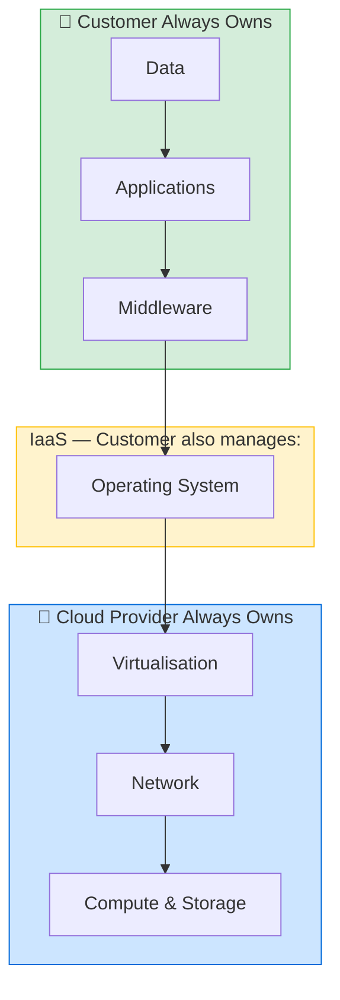
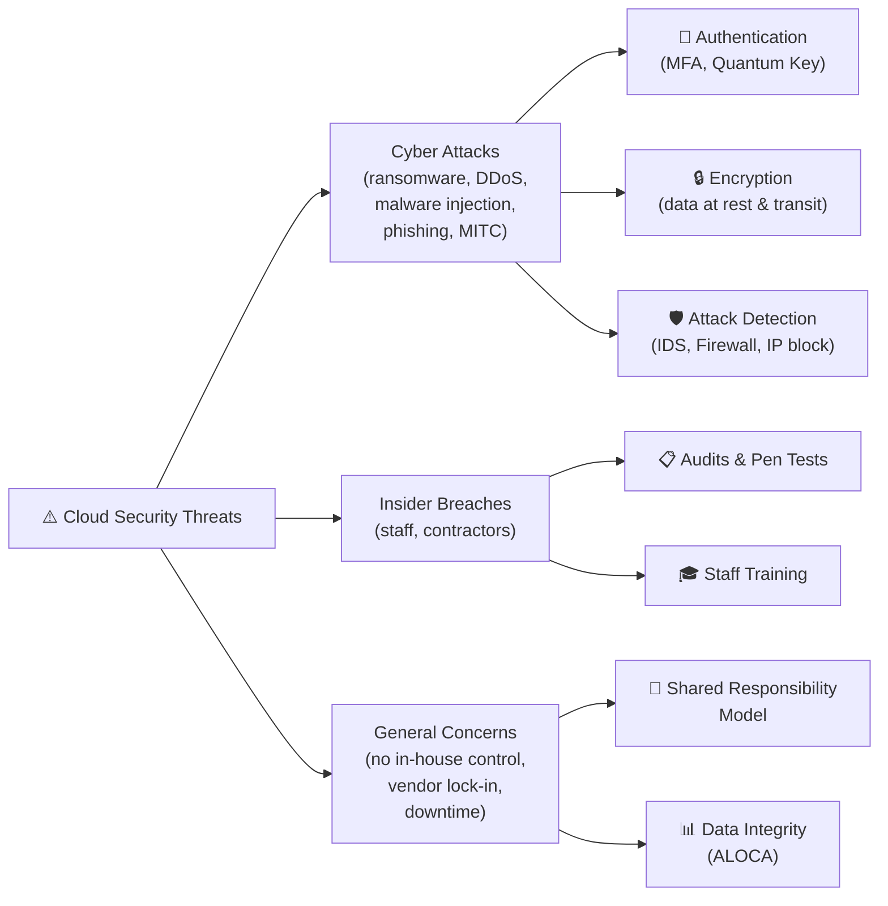
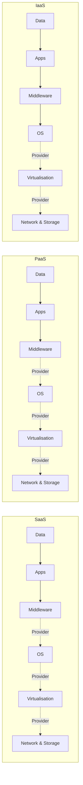

# ☁️ Cloud Security — Study Notes
*Torrens University Australia | CCF501 Cloud Computing Fundamentals | Module 10*

---

## Course Overview

**Course:** Cloud Security Short Course
**Delivered by:** Steve Sharma — Senior Cyber Security Architect, Digital Frontier Partners (20+ years in IT, 17 in Information Security)

**Learning Objectives:**
- Recognise cloud computing characteristics and definitions
- Understand the main cloud services and deployment models
- Understand vulnerabilities and common security concerns
- Distinguish different techniques, technologies and best practices in cloud security

---

## 1. Introduction to Cloud Computing

Cloud computing is a model for **on-demand network access** to a shared pool of configurable computing resources (servers, storage, networks, apps) that can be rapidly provisioned with minimal management effort.

> *"Cloud computing is a model for enabling ubiquitous, convenient, on-demand network access to a shared pool of configurable computing resources (e.g., networks, servers, storage, applications, and services) that can be rapidly provisioned and released with minimal management effort or service provider interaction."*
> — NIST (Mell & Grance, 2011)

Rather than storing/processing data on local servers, everything lives **remotely** and is accessible via the internet. Over 90% of US businesses now use some cloud service (Patrick, 2016).

### Why Cloud Exists

The exponential growth of digital data created problems for traditional IT:
- Difficult to store large volumes without overloading local systems
- Hard to protect great volumes of digital data
- Expensive to manage and maintain accurately

Cloud computing solves these issues by keeping and safeguarding digital information in a remote location, accessible anywhere via the internet.

---

## 2. Cloud Drawbacks vs. Benefits

### Drawbacks

| Drawback | Description |
|---|---|
| **Service Outages** | CSP controls all resources; downtime can happen anytime; critical processes cannot tolerate interruption |
| **Limited Flexibility & Control** | CSP administers resources; customers lose control over physical inspection, cybersecurity config, networking |
| **Vendor Lock-in** | Hard to migrate between different CSPs |
| **Security & Privacy Risks** | Resources typically available to anyone; no public service is 100% immune to attacks |

### Benefits

| Benefit | Description |
|---|---|
| **Centralised Security** | Centralising resources leads to centralised, stronger security; fewer policies and hardware to protect |
| **Less Administration** | Fewer security configurations required vs traditional systems; provider handles public cloud security |
| **More Reliability** | Best security standards make cloud more reliable, especially for compliance-heavy industries |
| **Cost Reduction** | Security is built-in; no need for dedicated security software; provider handles operation and maintenance |

> Key stat: 64% of organisations consider cloud *more* secure than traditional IT, yet 31% still cite security as their main challenge. (Patrick, 2016)

### Notable Historical Security Breaches

| Year | Incident |
|---|---|
| **2012** | Dropbox — 69 million user accounts hacked, credentials stolen |
| **2013** | Vodafone Germany — 2 million customer records stolen by a contractor (insider threat) |
| **2014** | Apple iCloud — celebrities' private photos exposed to the internet |
| **2016** | LinkedIn — ~170 million email addresses and passwords stolen |

---

## 3. Cloud Service Models

Security concerns differ by service model. Understanding each is key to understanding responsibility.

### SaaS — Software as a Service
The consumer uses the provider's applications running on cloud infrastructure. Accessible via web browser or program interface. The consumer does **not** manage or control the underlying infrastructure (network, servers, OS, storage). Example: Gmail, Office 365.

### PaaS — Platform as a Service
The consumer deploys their own applications using programming languages and tools supported by the provider. The consumer does **not** manage the underlying infrastructure but **does** control their deployed applications. Example: AWS Elastic Beanstalk, Google App Engine.

### IaaS — Infrastructure as a Service
The consumer provisions raw processing, storage, and network resources. The consumer **does** control the operating systems, storage, and deployed applications. Example: AWS EC2, Azure VMs.

---

## 4. Cloud Deployment Models

### Public Cloud
Resources are accessible to anyone via the internet. The service provider manages all hardware and software. Higher security risk due to public exposure, but state-of-the-art security technologies are employed.

### Private Cloud
Dedicated pool of resources exclusive to one business. Shared only within the organisation's departments. Greater control, less public exposure risk.

### Hybrid Cloud
A mix of both public and private clouds. The private part addresses specific business needs; the public part addresses others. Organisations get flexibility while maintaining control over sensitive data.

---

## 5. Security Concerns in Cloud Computing

Security concerns divide into two classes: **Specific** (tied to service models) and **General** (apply to all clouds).

### SaaS-Specific Concerns
- Difficulty complying with regulatory requirements (some countries restrict where patient/sensitive data can be stored)
- No control over security management of public clouds
- Higher probability of cyberattacks due to public internet exposure
- Higher probability of insider data breaches (large provider staff = more risk)
- Difficulty tracking data transfers to/from cloud resources
- Lack of visibility of users, data access, and applications

### PaaS & IaaS-Specific Concerns
- Lack of monitoring ability on cloud workload systems and applications
- Difficulty maintaining consistent security control across multiple clouds/platforms
- Higher probability of insider data breaches
- Lack of data visibility
- Lack of control on user access grants
- Bypassing authentication and encryption
- Hacking and attacks
- Abusing cloud services

### General Security Concerns (All Cloud Types)

**Loss of In-House Control**
When migrating to cloud, the in-house IT team loses control over data and hardware. The cloud provider manages security. This is more of a concern in public clouds. However, a public cloud Tier 5 data centre with redundancy can actually exceed a company's aging in-house Tier 1 data centre.

**Cyber Attacks**
Anything accessible via the internet is prone to cyberattacks. Cloud resources make attractive targets. Security technologies advance, but cyberattacks evolve and become harder to detect simultaneously.

**Insider Security Breaches**
Internal staff or contractors can pose threats. A breach for one client can (without proper isolation like a virtual private cloud) expose all other clients' data. Clients have no control over provider-side insider threats.

---

## 6. Cloud Security Alliance (CSA)

The **Cloud Security Alliance (CSA)** is a non-profit organisation whose mission is to promote best practices for security assurance within cloud computing and provide education on cloud computing security.

**CSA Services:**
- Security products
- Research on security
- Security education and guidance
- Certification
- Conferences and events

CSA has targeted **38 security domains** across all cloud computing aspects.

---

## 7. Cloud Security Techniques

Cloud security includes a wide range of **preventive, detective, and corrective** methods.

### Authentication
Verifying the identity of a person or computer before granting access to cloud resources.
- **Physical methods:** Access cards, fingerprint scanning, retina scanning, access keys
- **Digital methods:** Passwords, CAPTCHA, patterns, audio recognition
- **Advanced:** Cloud cryptography using the Quantum Direct key system (adds an additional security layer)

### Encryption
The process of encoding data into a non-recognisable format. If hackers access the data, they need the encryption key to decrypt it. Can be done via the cloud provider or third-party applications.

### Data Integrity — The ALOCA Model
Ensures data represents what it is expected to represent.

| Letter | Principle | Description |
|---|---|---|
| **A** | Attributable | Data must be linked to its creator via digital signatures |
| **L** | Legible | Data must be readable and permanent |
| **O** | Original | Must be the first instance; not a copy or modification |
| **C** | Contemporaneous | Date and time of creation must be recorded |
| **A** | Accurate | Data must be error-free and complete |

### Attack Solutions
Common cloud attack types: ransomware, Denial of Service (DoS), malware injection, side-channel attacks, authentication attacks, phishing, man-in-the-cloud attacks.

**Detection & Prevention methods:**
- Monitor for excess bandwidth usage
- Regular system checks
- Intrusion Detection Systems (IDS)
- Firewalls (bounce/block attacks)
- Block malicious IP addresses
- Disable vulnerable ports (e.g. port 22)
- Install and update anti-virus software

---

## 8. Cloud Security Best Practices

For both clients and cloud providers, best practices ensure safe and reliable services:

1. **Endpoint Security** — Secure all system components (in-house and cloud) using state-of-the-art tools for attack detection, intrusion detection, and unauthorised access detection
2. **Regular Audits & Pen Tests** — Constantly check security methods and policies to find issues before attackers do
3. **Client-Side Security Policies** — Regardless of provider security level, clients must enforce their own high-level endpoint security policies
4. **Policy Updates** — Regularly update and enforce cloud security policies based on world best standards
5. **Staff Training** — Systematic training to recognise attacks, especially phishing emails and messages
6. **Shared Responsibility Awareness** — Understand what you vs. your CSP are responsible for

> *"Security is a process, not a product."* — Bruce Schneier, security technologist

---

## 9. Shared Responsibility Model

In traditional IT, security was solely the organisation's responsibility. In cloud computing, it is a **combined responsibility** between the client and the CSP.

The amount of shared responsibility depends on the service model (IaaS, PaaS, SaaS).

### Responsibility Table

| Security Layer | IaaS | PaaS | SaaS |
|---|---|---|---|
| **Data** | ✅ Customer | ✅ Customer | ✅ Customer |
| **Applications** | ✅ Customer | ✅ Customer | ✅ Customer |
| **Middleware** | ✅ Customer | ✅ Customer | ✅ Customer |
| **Operating System** | ✅ Customer | 🏢 Provider | 🏢 Provider |
| **Virtualisation** | 🏢 Provider | 🏢 Provider | 🏢 Provider |
| **Network** | 🏢 Provider | 🏢 Provider | 🏢 Provider |
| **Compute & Storage** | 🏢 Provider | 🏢 Provider | 🏢 Provider |

> **Key insight:** In SaaS, the provider has the highest responsibility. In IaaS, the customer has the most responsibility. Data is **always** the customer's responsibility.

### The 7 Security Areas

**1. User Security**
Any preventive, protective, detective, and corrective security activities done at the user level. Examples: access restriction, authentication, physical constraints.

**2. Data Security (CIA Triad)**
- **Integrity** — Data is processed properly and hasn't been changed
- **Availability** — Data and processing are accessible to authorised users at all times
- **Confidentiality** — Data is disclosed only to authorised people

**3. Application Security**
Making all cloud applications as secure as possible.

**4. Middleware Security**
Middleware is the layer between the OS and other software. Middleware security ensures a secure interface for application components to interact with the OS and other applications. Includes: authorisation and control management, authentication, automatic configuration.

**5. Operating System Security**
Managing and ensuring all hardware resources and the OS are safe. Focuses on preventing unauthorised access, malicious activities, and destructive behaviours.

**6. Virtualisation Security**
Main objective is to secure all APIs (Application Programming Interfaces). Different applications and computers communicate through APIs — securing these is essential. Virtual network transmissions are secured using firewalls and anti-cyber-attack systems.

**7. Infrastructure Security**
Divided into:
- **Network security** — Monitor and control access to resources; prevent, detect and correct suspicious actions
- **Physical security** — Personnel authorisation, access cards, security cameras, security personnel

---

## 10. Mermaid Diagrams

### Diagram 1 — Cloud Service Models & Shared Responsibility

---

### Diagram 2 — Cloud Security Threat Landscape & Mitigations

---

### Diagram 3 — Shared Responsibility Across Service Models

*Green/solid = Customer responsibility | Dotted = Provider responsibility*

---

## 11. Quick-Reference Cheat Sheet

| Concept | One-liner |
|---|---|
| **SaaS** | You use apps, provider manages everything else |
| **PaaS** | You deploy apps, provider handles the platform |
| **IaaS** | You get raw infrastructure, you manage OS and upward |
| **Public Cloud** | Anyone can access; provider manages all hardware |
| **Private Cloud** | Dedicated to one org; more control |
| **Hybrid Cloud** | Mix of public + private |
| **ALOCA** | Framework to ensure data integrity (Attributable, Legible, Original, Contemporaneous, Accurate) |
| **CIA Triad** | Confidentiality, Integrity, Availability |
| **CSA** | Non-profit setting cloud security standards across 38 domains |
| **Shared Responsibility** | Security is split between you and your CSP depending on service model |
| **IDS** | Intrusion Detection System — monitors for suspicious activity |
| **Endpoint Security** | Securing all devices/points that connect to the cloud |

---

## 12. Self-Test Quiz (5 Questions)

**Q1.** The biggest cloud computing providers (e.g. Amazon) are 100% secure?
> **Answer: False** — No cloud computing system is 100% immune to attacks.

**Q2.** We can see security as both a benefit AND a drawback of cloud computing at the same time.
> **Answer: True** — Cloud provides centralised security (benefit), but public resources are always a risk (drawback).

**Q3.** Understanding the Shared Responsibility Model is a best practice in cloud security.
> **Answer: True** — It is one of the most important best practices in cloud computing.

**Q4.** In the Shared Responsibility Model, which service model gives the cloud provider *more* responsibility?
> **Answer: SaaS** — In Software-as-a-Service, cloud providers have higher security responsibility than clients.

**Q5.** In the Shared Responsibility Model, there is always a *minimum* responsibility for clients.
> **Answer: False** — In a private cloud, the client's responsibility to secure the cloud is 100%.

---

## References

- Bradford, C. (2019). *7 Most Infamous Cloud Security Breaches*. StorageCraft.
- Mell, P., & Grance, T. (2011). *The NIST Definition of Cloud Computing* (SP 800-145). NIST.
- Messmer, E. (2009). *Cloud Security Alliance aims to promote best practices*. Network World.
- Mimoso, M. (2013). *Contractor Accesses 2 Million Vodafone Germany Customer Records*. Threatpost.
- Patrick, S. (2016). *Security and the Cloud: Trends in Enterprise Cloud Computing*. Clutch.co.
- Popović, K., & Hocenski, Ž. (2010). Cloud computing security issues and challenges. *33rd International Convention MIPRO*, pp. 344–349.
- Shahzad, F. (2014). State-of-the-art survey on cloud computing security challenges, approaches and solutions. *Procedia Computer Science, 37*, 357–362.
- Violino, B. (2019). *12 top cloud security threats: The dirty dozen*. CSO Online.

---

> *"There's no silver bullet solution with cyber security — a layered defence is the only viable defence."*
> — James Scott, Senior Fellow at the Institute for Critical Infrastructure Technology
