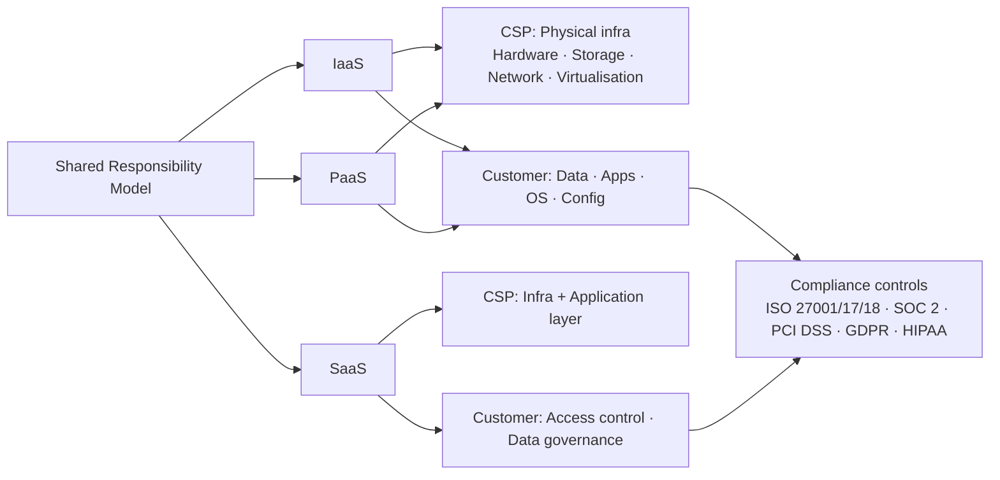

# Module 11 — Security Policy – Planning and Management

## TL;DR

Cloud security is built on policy before it is built on tools. This module shifts the mindset from reactive threat response (Module 10) to proactive security planning — defining requirements, governance frameworks, and compliance obligations *before* threats arrive.

**Key concepts:**
- **Two policy archetypes**: centralized (uniform baseline for all data) vs. classification-based (controls scaled to sensitivity tier — the enterprise standard)
- **Governance tooling**: Azure Policy, AWS Config, and GCP Security Command Center implement policy-as-code across cloud estates
- **Compliance frameworks**: ISO 27001/17/18, SOC 2 Type 2, CSA STAR, PCI DSS, GDPR, HIPAA — each maps to a specific data type, industry, or regulatory jurisdiction

**Practical applications:**
- When drafting a cloud security policy, start with a data classification taxonomy, then map controls per tier — don't apply the same rules to a public marketing blog and a PII database
- When evaluating a cloud provider, request their SOC 2 Type 2 report (not just Type 1) — it proves effectiveness of controls, not just design intent
- GDPR obligations trigger the moment you serve or track EU/UK users — cloud deployments must account for data residency, encryption key management, and 72-hour breach notification by design

---

## Task List

| # | Task | Status |
|---|------|--------|
| **1** | Watch & summarise Linthicum (2021) — Planning Cloud Security (LinkedIn Learning) | 🔥 WIP — needs manual watch |
| **2** | Read & summarise Microsoft (2022) — Security Governance (Azure CAF) | ✅ |
| **3** | Read & summarise Page (2022) — How GDPR has inspired a global arms race | ✅ |
| **4** | Read & summarise Thompson (2020) — Examples of Cloud Security Policy (CCSK guide) | ✅ (synthesised from CSA guidance + AWS/Azure docs) |
| 4b | Read & summarise Infrastructure and Networking chapter (CCSK-style, R4 PDF) | ✅ |
| 5 | Watch & summarise Linthicum (2019) — Introduction to Cloud Governance (LinkedIn Learning) | 🔥 WIP — needs manual watch |
| **6** | Read & summarise Estrin (2022) — Ch9: Handling Compliance and Regulation | ✅ |
| 7 | Activity 1: Interactive Knowledge Check (quiz) | 🕐 |
| 8 | Activity 2: GDPR vs Australian Privacy Principles (read article + answer questions) | 🕐 |

---

## Key Highlights

### 1. Linthicum, D. (2021). 4. Planning cloud security [Videos]. LinkedIn Learning.

**Citation:** Linthicum, D. (2021). 4. Planning cloud security [Videos]. In *Learning cloud computing: Cloud security*. LinkedIn Learning.

**Purpose:** A Deloitte cloud computing expert walks through what to consider when planning cloud security — requirements, steps, and best practices (~9 min video).

> *Status: 🔥 WIP — needs manual watch. Highlights below are based on the resource overview.*

**Key planning questions:**
- What are the security **requirements** for the organisation?
- What **steps** should be taken proactively (before a threat occurs)?
- What are the **best practices** for cloud security planning?

#### Key Takeaways for Cloud Computing Fundamentals
1. Connects directly to Module 10 (security threats) — this resource shifts from reactive to proactive stance.
2. Planning security is the foundation before selecting governance tools (see Resource 5).
3. Pairs with the Microsoft Governance resource (R2) which gives the framework once planning is done.

---

### 2. Microsoft. (2022). Security governance. Microsoft Learn / Azure Cloud Adoption Framework.

**Citation:** Microsoft. (2022, February 12). *Security governance*. https://learn.microsoft.com/en-us/azure/cloud-adoption-framework/secure/security-governance

**Purpose:** Explains how governance connects business priorities to technical cloud security — covering posture modernisation, incident preparedness, and the CIA Triad (Confidentiality, Integrity, Availability) from a governance lens.

---

#### 1. Security Posture Modernisation

- **Old way**: periodic, static snapshots of on-premises environments → often stale
- **Cloud way**: on-demand, real-time visibility → dynamic governance

Three key governance principles:

| Principle | What it means |
|---|---|
| **Continuous discovery** | Cloud is dynamic; inventory never stops changing — governance must keep up |
| **Continuous improvement** | Attackers evolve; defences must adapt constantly |
| **Policy-driven governance** | Define once, apply automatically (e.g., Azure Policy) — avoid manual repetition |

**Azure tools:** Microsoft Defender for Cloud (VM discovery), Defender for Cloud Apps (SaaS discovery).

---

#### 2. Incident Preparedness and Response Governance

| Area | Key practice |
|---|---|
| **Automate governance** | Use tooling for policies, hardening, data protection, IAM |
| **Security baselines** | Follow Microsoft's Secure Future Initiative (SFI) recommendations |
| **Incident response plan** | Version-controlled, highly available, reviewed regularly |
| **Training materials** | Also version-controlled; updated whenever the plan changes |

---

#### 3. Confidentiality Governance (CIA Triad — C)

| Policy type | Purpose |
|---|---|
| **Technical policies** | Access control, encryption, data masking/tokenisation |
| **Written policies** | Framework documents for data handling, access, protection |
| **DLP (Data Loss Prevention)** | Continuous monitoring + enforcement; programmatic org-wide deployment |

**Enforcement mechanisms:**
- **Regular audits and assessments** — third-party assessors for unbiased evaluation
- **Automated compliance monitoring** — Azure Policy for real-time alerts
- **Training and awareness programs** — updated regularly as policies change

---

#### 4. Integrity Governance (CIA Triad — I)

- **Automated data quality governance** — off-the-shelf solutions (Microsoft Purview Data Quality uses AI/no-code rules at column level)
- **Automated system integrity governance** — centralised tools like Azure Arc (governs across multi-cloud, on-prem, edge)

---

#### 5. Availability Governance (CIA Triad — A)

| Area | Governance requirement |
|---|---|
| **Design patterns** | Codify infrastructure/app standards; automate enforcement (e.g., restrict region deployments) |
| **Disaster recovery plans** | Version-controlled, highly available, reviewed regularly |
| **DR drills** | Documented for audit and continuous improvement |

---

#### 6. Modern Service Management (MSM)

- **Unified security management**: integrates security functions for a holistic view
- **Policy management and compliance**: create, enforce, monitor policies across cloud estate
- **Continuous monitoring and improvement**: proactive identification and resolution of issues

#### Key Takeaways for Cloud Computing Fundamentals
1. Governance is the glue between business goals and technical cloud security controls.
2. Real-time visibility is what makes cloud governance fundamentally different from on-prem.
3. Policy-as-code (Azure Policy, AWS Config) is the practical implementation of proactive governance.
4. Connects to Module 9 (Governance and Legal) and Module 10 (threats) — this module bridges those into a coherent security management system.

---

### 3. Page, R. (2022). How GDPR has inspired a global arms race on privacy regulations. CSO Australia.

**Citation:** Page, R. (2022, April 7). *How GDPR has inspired a global arms race on privacy regulations*. CSO Australia. https://www.csoonline.com/article/3655969/how-gdpr-has-inspired-a-global-arms-race-on-privacy-regulations.html

**Purpose:** Explores how GDPR's penalty regime triggered a worldwide wave of privacy law reform, how Australia fits into this picture, and the pitfalls of increasingly divergent national regulations.

---

#### 1. GDPR as the Global Trigger

- **GDPR's biggest change**: radical enforcement — penalties, not just principles — made organisations worldwide pay attention
- Countries adopting GDPR-style laws: Japan, South Korea, Thailand, Sri Lanka, Pakistan (bills pending), India (bill pending), Australia (under review), Canada (Québec leading), California/Maine/Nevada (US states)
- **US federal government**: largely resistant — GDPR-flavoured bills exist but show no signs of passing; states are leading instead

---

#### 2. Australia's Position

| Element | Status |
|---|---|
| Privacy Act review | Ongoing — actively considering GDPR-style adoption |
| Consumer Data Right (CDR) | Existing Australian mechanism for data portability |
| GDPR compliance | Required if targeting/tracking EU/UK individuals |

- Australia currently sits between the US (reactive, state-level) and Europe (proactive, rights-based)
- The core question: does Australia treat privacy as a **fundamental human right** (European view) or a **commercial consideration** (US view)?

---

#### 3. Data-Protection Trends Beyond GDPR

| Trend | Description |
|---|---|
| **Data localisation** | >100 countries requiring local storage; risks fragmented infrastructure and security gaps |
| **Breach notification** | US is the global leader — tight timelines for critical infrastructure and public companies |
| **Data security focus** | Asia-Pacific leaders (Japan, Singapore, South Korea) pushing requirements beyond privacy into active data security |
| **Cheap storage risk** | Organisations retaining data indefinitely → bigger blast radius when breaches occur |

---

#### 4. Pitfalls of the Arms Race

- **Divergence vs. consumer intent**: consumers don't want more disclosures — they want data **not to be misused** and **protected**
- **Over-bureaucratisation**: listing every service provider with whom data is shared creates compliance burden with no privacy benefit
- **Core principles exist** (notice, choice, access/correction, service provider supervision, data security) but get lost in nation-specific detail
- Wugmeister's warning: "Return to core principles — ratcheting up requirements or just matching another country isn't necessarily helpful"

---

#### 5. Towards an International Treaty?

- **Convention 108** (Council of Europe, 1980s) — the only actual international data privacy treaty; 55 parties including major economies; 8 non-European signatories (Africa + Latin America)
- Prof. Greenleaf (UNSW): expanding Convention 108 is better than creating a new treaty — it's a moderate GDPR equivalent with existing signatories
- GDPR is **not** a treaty — it's regional legislation — hence its enforceability outside the EU is indirect (market access leverage, not treaty obligation)

#### Key Takeaways for Cloud Computing Fundamentals
1. Cloud data flows across borders by default — regulatory fragmentation directly affects cloud architecture decisions.
2. Data localisation requirements can reverse cloud economics (back to distributed servers, not centralised cloud).
3. Australia's pending Privacy Act reform will likely affect how Australian cloud deployments handle personal data.
4. Links directly to Activity 2 (GDPR vs Australian Privacy Principles) and Resource 4 (CCSK security policy examples).

---

### 4. Thompson, G. (2020). CCSK Certificate of Cloud Security Knowledge All-in-One Exam Guide. McGraw Hill.

**Citation:** Thompson, G. (2020). *CCSK certificate of cloud security knowledge all-in-one exam guide*. McGraw Hill. (Appendix A — Cloud Security Policy Examples)

**Purpose:** Presents two concrete cloud security policy templates — centralized and classification-based — and provides the framework for understanding how organisations document their cloud security requirements. Supplemented with AWS and Azure real-world security policy comparisons.

> *Note: O'Reilly link requires institutional login. Content synthesised from CSA guidance, AWS/Azure documentation, and CCSK curriculum sources.*

---

#### 1. The Two Policy Types — Overview

A cloud security policy is a documented set of rules, guidelines, and procedures that govern how an organisation protects its data, systems, and users in cloud environments. The CCSK guide presents two distinct approaches:

| Dimension | Centralized Policy | Classification-Based Policy |
|---|---|---|
| **Core idea** | One uniform ruleset applied to all cloud assets | Controls scaled to data sensitivity tier |
| **Who it suits** | Small/homogeneous orgs, early cloud adopters | Large enterprises, regulated industries, diverse data |
| **Advantage** | Simple to enforce, audit, and govern | Proportionate risk management, cost-efficient |
| **Disadvantage** | Over-protects cheap data; may under-protect sensitive data | Complex to implement; requires disciplined classification |
| **Governance tool** | Single policy document, applied globally | Classification taxonomy + per-tier control matrix |

---

#### 2. Centralized Cloud Security Policy

A **centralized security policy** applies a single, uniform baseline of security controls across all cloud data, workloads, and services — regardless of data type or sensitivity.

**Typical structure:**

```text
Purpose and scope
↓
Roles and responsibilities (RACI)
↓
Acceptable use rules (applies to ALL data)
↓
Access control baseline (MFA, RBAC for all users)
↓
Encryption requirements (all data at rest + in transit)
↓
Incident response procedures
↓
Compliance and audit schedule
```

**When it works well:**
- Organisation has a small, relatively homogeneous dataset
- IT team lacks capacity to maintain a multi-tier classification system
- Regulatory environment mandates uniform controls (e.g., HIPAA — all patient data treated as sensitive)
- Early cloud migration phase where governance maturity is low

**Risk:** Applying top-tier controls to all data drives unnecessary cost; applying baseline controls to all data leaves sensitive assets under-protected.

---

#### 3. Classification-Based Cloud Security Policy

A **classification-based policy** first categorises data by sensitivity, then applies differentiated controls per tier. It is the dominant approach in enterprise cloud environments.

**Common classification tiers:**

| Tier | Label | Examples | Controls |
|---|---|---|---|
| 1 | **Public** | Marketing content, product documentation | Read access open; no encryption mandate |
| 2 | **Internal** | Internal memos, CRM data, vendor records | RBAC; encryption at rest; no external sharing without approval |
| 3 | **Confidential** | PII, financial records, HR data | MFA + RBAC; AES-256 encryption at rest + TLS in transit; DLP monitoring |
| 4 | **Restricted** | Trade secrets, M&A data, regulated health data | Strict need-to-know; customer-managed keys; third-party audit trail; data residency controls |

**Classification process:**
1. **Data inventory** — map all data assets and their locations in cloud
2. **Sensitivity assessment** — apply classification criteria (regulatory, competitive, personal)
3. **Labelling** — tag resources with classification metadata (e.g., AWS resource tags, Azure Purview labels)
4. **Control mapping** — assign access, encryption, logging, and retention rules per tier
5. **Automated enforcement** — use policy-as-code to enforce controls (Azure Policy, AWS SCPs)

---

#### 4. Real-World Comparison: Microsoft Azure vs. AWS Security Policies

The resource overview asks you to compare the CCSK examples with Azure or AWS security policies. Here's a structured comparison:

| Feature | Azure Security Policy | AWS Security Policy |
|---|---|---|
| **Governance engine** | Microsoft Defender for Cloud | AWS Security Hub + AWS Config |
| **Policy enforcement** | Azure Policy (automated, at-scale) | Service Control Policies (SCPs) via AWS Organizations |
| **Classification tool** | Microsoft Purview (automated PII detection, labelling) | Amazon Macie (automated PII/sensitive data discovery in S3) |
| **Compliance frameworks** | Built-in initiatives: NIST 800-53, ISO 27001, PCI DSS, GDPR | Conformance packs: NIST, PCI DSS, CIS Benchmarks |
| **Approach** | Centralized defender posture + classification via Purview | Centralized SCP guardrails + classification via Macie + tagging |
| **Audit trail** | Azure Monitor + Log Analytics | AWS CloudTrail + CloudWatch |

**Key observation:** Both Azure and AWS implement a *hybrid* of the two CCSK policy models:
- **Centralized** at the governance/guardrail level (one policy engine enforces baseline controls across all accounts)
- **Classification-based** at the data level (Purview/Macie detect sensitivity and apply differentiated controls)

---

#### 5. Cloud Security Policy — Key Components (Exabeam / CSA framework)

Any cloud security policy — centralized or classification-based — should include these seven components:

| # | Component | What it covers |
|---|---|---|
| 1 | **Purpose and scope** | Which assets, users, and environments the policy applies to |
| 2 | **Roles and responsibilities** | Cloud security officer, IT teams, data owners, end users |
| 3 | **Data classification and control** | Sensitivity tiers, access permissions, encryption per tier |
| 4 | **Access control** | RBAC + MFA; least privilege principle |
| 5 | **Data encryption** | At rest (AES-256) and in transit (TLS 1.2+); key management |
| 6 | **Incident response and reporting** | Detection, escalation, breach notification (GDPR 72h, NDB scheme) |
| 7 | **Compliance and auditing** | Regulatory mapping (GDPR, HIPAA, PCI DSS); audit schedule |

#### Key Takeaways for Cloud Computing Fundamentals
1. The choice between centralized and classification-based policy is a risk/cost trade-off — classification-based is the mature enterprise standard.
2. Both Azure and AWS implement the classification-based approach through automation (Purview, Macie) — manual classification doesn't scale.
3. Policy components from the CCSK framework map directly onto compliance requirements from Module 11's other resources: GDPR (data classification + breach notification), HIPAA (all data treated as sensitive = effectively centralized), PCI DSS (cardholder data environment isolated = classification-based).
4. Start centralized when cloud governance is immature; evolve to classification-based as data volume and regulatory obligations grow.

---

### 4b. Infrastructure and Networking — Cloud Security (CCSK-style resource, R4 PDF)

**Citation:** (From R4 PDF — Chapter 7: Infrastructure and Networking, CCSK-aligned cloud security resource)

**Purpose:** Covers how cloud providers build secure infrastructure, what security controls are exposed to customers, and how customers use those controls to meet their own security policies. Also covers zero trust, SASE, and resilience models.

---

#### 1. Shared Responsibility in Infrastructure Security

**Cloud Customer responsibilities:**

| Technique | Description |
|---|---|
| **Secure architecture** | Segregation of resources/networks, least privilege, secure storage/comms |
| **Secure deployment & configuration** | CIS benchmarks, Well-Architected Frameworks; "shoulders of giants" |
| **Continuous monitoring and guardrails** | Real-time tracking; automated policy controls (preventive, detective, reactive) |

**Guardrails vs. Controls:**
- **Control**: "no public buckets allowed" — addresses a risk, can be manual or automated
- **Guardrail**: proactively *prevents* anyone from making a bucket public in the first place

**CSP responsibilities:** Physical facilities, employees (background checks), physical compute, virtualisation layers (hypervisor), management plane, PaaS/SaaS services.

---

#### 2. Infrastructure Resilience Models

| Model | Description | Trade-off |
|---|---|---|
| **Single-region** | Multiple AZs in one region; auto-scaling + load balancing | Cheapest; vulnerable to regional outages |
| **Multi-region** | Replicate across regions; CSP charges for cross-region data copy | More complex/costly; must check service availability + jurisdictional rules |
| **Multi-provider** | Replicate across different CSPs | Most complex/costly; containers help portability but network/storage/security models differ |

**OVHcloud case study**: Fire in Strasbourg (March 2021) — SGB2 destroyed, SGB1 partially damaged; customers using SGB3/4 had downtime only; those in SGB2 lost everything. Key lesson: even "backups" were stored in the same datacenter despite contract stating otherwise. **Risk-based planning must precede a disaster.**
*(Source: Pinguet, V. (2021, March 10). OVHcloud Strasbourg fire — what happened and lessons learned. OVHcloud Blog. https://blog.ovhcloud.com/ovhcloud-strasbourg-fire-what-happened-and-lessons-learned/)*

**UniSuper case study**: Google accidentally deleted all data (AUD $135B pension fund). Multi-provider resiliency saved the organisation — recovered in ~2 weeks.
*(Source: UniSuper. (2024, May). A message to our members about the Google Cloud incident. https://www.unisuper.com.au/about-us/media-centre/2024/a-joint-statement-from-unisuper-and-google-cloud)*

---

#### 3. Software-Defined Networking (SDN)

**SDN architecture layers:**

| Plane | Role |
|---|---|
| **Application plane** | Defines desired network behaviour/policies (load balancing, traffic shaping) |
| **Control plane** | SDN controller — translates policies into device instructions via northbound interface |
| **Data/Forwarding plane** | Executes actual data forwarding via southbound interface (e.g., OpenFlow) |

- **Controllers**: open source (OpenDayLight, Floodlight), commercial (Cisco ACI, VMware NSX)
- SDN enables **logical isolation** through packet encapsulation — virtual segments share physical infrastructure

#### Key Takeaways for Cloud Computing Fundamentals
1. The guardrail concept is the infrastructure-level implementation of cloud security policy.
2. Resilience model choice is a *risk-based* decision — critical to document in security policy.
3. OVHcloud + UniSuper are real-world cases showing consequences of inadequate vs. excellent resiliency planning.
4. SDN is foundational to understanding how cloud providers enforce network isolation (relevant to Module 7 and security policy design).

---

### 5. Linthicum, D. (2019). 1. Introduction to cloud governance [Videos]. LinkedIn Learning.

**Citation:** Linthicum, D. (2019). 1. Introduction to cloud governance [Videos]. In *Learning cloud computing: Cloud governance*. LinkedIn Learning.

**Purpose:** Covers areas a business needs to consider when building a policy to monitor, protect, and address cloud security threats — including accountability structures and governance tools (~31 min combined: units 1 + 3).

> *Status: 🔥 WIP — needs manual watch. Highlights below are based on the resource overview.*

**Key coverage areas:**
- What cloud governance is and why it matters
- Who (or what) is accountable for cloud security decisions
- Governance tools demo — how tools are used to enforce policies programmatically

#### Key Takeaways for Cloud Computing Fundamentals
1. Governance tools make the Microsoft Azure CAF governance principles (R2) operational.
2. Accountability structures in governance directly address the "who is responsible?" question from the shared responsibility model.
3. Combined with R2, this unit provides both the *why* (governance framework) and the *how* (governance tools).

---

### 6. Estrin, E. (2022). Chapter 9: Handling Compliance and Regulation. In *Cloud security handbook*. Packt.

**Citation:** Estrin, E. (2022). *Cloud security handbook: Find out how to effectively secure cloud environments using AWS, Azure, and GCP*. Packt.

**Purpose:** Covers compliance frameworks and regulations applicable to cloud services — ISO standards, SOC reports, CSA STAR, PCI DSS, GDPR, and HIPAA — with concrete implementation guidance for AWS, Azure, and GCP.

---

#### 1. Compliance and the Shared Responsibility Model

The diagram below shows how compliance obligations are distributed across service models (see diagram):



- **IaaS/PaaS**: CSP responsible for physical aspects (datacenters, hardware, storage, networking, virtualisation); customer responsible for data, apps, OS configuration
- **SaaS**: provider also owns application layer; customers expect both compliance *and* high security standards
- Third-party assessors (neutral auditors like major accounting firms) are essential — self-assessment alone is insufficient proof

---

#### 2. ISO Standards for Cloud

| Standard | Scope | Who needs it |
|---|---|---|
| **ISO 27001** | Information Security Management System (ISMS) — foundation | Any cloud provider or customer in public cloud |
| **ISO 27017** | Cloud-specific controls on top of ISO 27002 | Cloud providers offering services to customers |
| **ISO 27018** | PII protection for cloud services | Cloud providers storing/processing personal data |

**Additional ISO 27017 controls** (beyond ISO 27002):
- Shared roles in cloud environments
- Removal of customer assets
- Segregation in virtual environments
- VM hardening
- Monitoring of cloud services

**Additional ISO 27018 controls** (beyond ISO 27002):
- Customer rights: access, erase, know purpose of processing
- SP obligations: document/audit all access, notify about sub-contractors + breaches, encrypt at rest (including backups), data deletion procedures

**Customer guidance**: for any PII-handling cloud service, demand ISO 27001 + ISO 27017 + ISO 27018 compliance from providers.

---

#### 3. SOC Reports

| Report | Type | Purpose |
|---|---|---|
| SOC 1 Type 1 | Financial statement | Attestation of controls at a specific point in time |
| SOC 1 Type 2 | Financial statement | Controls + effectiveness over ≥6-month period |
| SOC 2 Type 1 | Security/availability/integrity/confidentiality/privacy | Design of controls description |
| **SOC 2 Type 2** | Security/availability/integrity/confidentiality/privacy | **Design + actual effectiveness** — most relevant for customers |
| SOC 3 | Management report | High-level assurance; publicly shared |

> Customer priority: demand **SOC 2 Type 2** from any public cloud provider — it shows actual effectiveness, not just design.

---

#### 4. CSA STAR Program

| Component | Description |
|---|---|
| **CCM** (Cloud Control Matrix) | Cybersecurity control framework for cloud computing |
| **CAIQ** (Consensus Assessment Initiative Questionnaire) | Industry-accepted security controls for IaaS/PaaS/SaaS |
| **STAR Level 1** | Self-assessment — good starting point for low-risk environments |
| **STAR Level 2** | Third-party audited — for medium-to-high-risk environments |

---

#### 5. PCI DSS (Payment Card Industry Data Security Standard)

- Created by: MasterCard, American Express, Visa, JCB, Discover
- **Applies to**: any organisation storing, transferring, or processing credit card data

Key requirements include:
- Firewall protection of PCI environment
- Strong password policies
- Encrypt stored + in-transit credit card data
- Anti-virus + patch management
- Unique IDs per person accessing card data
- Log management + vulnerability assessments + penetration tests
- Risk assessments

---

#### 6. GDPR (General Data Protection Regulation)

- **Applies to**: any org worldwide that collects/processes personal data of EU citizens (regardless of where the org is located)
- **Personal data**: any information relating to an identified or identifiable natural person

Key technical practices:
- Encrypt data **in transit** (TLS 1.2) and **at rest** (AES-256)
- **Customer-managed keys** for encryption — ensure provider offers this
- Enforce **MFA** for users accessing personal data
- **Need-to-know principle** — restrict access
- Keep EU citizens' data in EU or adequately-protected countries
- Sign a **Data Processing Agreement** with cloud provider
- Third-party security audits before processing personal data
- **Data minimisation** + ability to locate and erase data on request

---

#### 7. HIPAA (Health Insurance Portability and Accountability Act)

- **Applies to**: US organisations dealing with electronic healthcare transactions and PII in healthcare/health insurance

Four main security rule categories:
1. Administrative Safeguards
2. Physical Safeguards
3. Technical Safeguards
4. Organizational, Policies, Procedures and Documentation

Best practices:
- Encrypt healthcare data in transit (TLS 1.2) and at rest (AES-256)
- Audit log for all healthcare data access
- Authentication + authorisation for all access requests
- **Principle of Least Privilege (POLP)**
- Penetration testing for healthcare data systems
- Patch management + backups

---

#### 8. Compliance Tooling by CSP

| CSP | Compliance tool | Reference registry |
|---|---|---|
| **AWS** | AWS Config (conformance packs) | AWS Artifact |
| **Azure** | Microsoft Defender for Cloud | Azure Trust Center |
| **GCP** | Google Security Command Center | Google Compliance Reports Manager |

#### Key Takeaways for Cloud Computing Fundamentals
1. Compliance is not optional — regulations like GDPR and HIPAA carry legal force; ISO/SOC/STAR are market-facing signals of maturity.
2. The shared responsibility model defines *who* is responsible for which compliance aspects — CSP for infrastructure, customer for data and app layer.
3. SOC 2 Type 2 is the customer's most valuable audit artefact — design + effectiveness of controls over time.
4. Every major cloud provider (AWS, Azure, GCP) provides built-in compliance tooling — knowing which tool to use on which platform is a practical skill.
5. GDPR and PCI DSS have direct cloud architecture implications: data residency, encryption key management, MFA, and data minimisation aren't just policy words — they constrain infrastructure design.

---

## Activity 1 — Interactive Knowledge Check (quiz)

1. Insider threats can be initiated by:
a. An outsider
*b.* Cloud provider’s employees
*c.* Company’s employees

2. Security Policies that need to meet privacy regulations should:
a. Be approved by the local government body
b. Include identification, treatment and monitoring plans
*c.* Be written by a qualified Cloud Security professional 

3. The GDPR does NOT apply to data:
*a.* Stored outside the EU and does not sell to or collect data from EU individuals
b. Stored physically in the EU
c. Stored outside the EU but contains data about individuals in the EU

4. Which of the following questions relate to addressing cloud security governance?
a. How are we dealing with the attacks facing our organisation?
b. Are employees made aware of the security risks of the cloud?
*c.* All answers are correct
d. What are the risks facing the business today?

5. A shared responsibility model requires:
a. Negotiable responsibilities to be split between the cloud provider and customer.
b. Neither answer is correct.
*c.* Clear responsibilities to be split between the cloud provider and customer.

6. A security policy is most like a:
a. Terms and conditions
*b.* Legal contract
c. Requirements document

7. Cloud security-as-a-service helps businesses by:
*a.* All answers are correct
b. Providing threat specific security solutions 
c. Offering automated detection and remediation processes
d. Offering cloud-provider specific security solutions 

## Activity 2 — GDPR vs Australian Privacy Principles (reading notes)

**Source article (A2 PDF):** Yogarajah, A. (2025, January 11). *What do Australian businesses need to know about the GDPR?* Sprint Law.

### Key Differences: GDPR vs Australian Privacy Principles (APP)

| Dimension | GDPR | Australian Privacy Act / APP |
|---|---|---|
| **Applicability** | Extraterritorial — applies if targeting/tracking EU/UK individuals | Applies if AU annual turnover >$3M or handling health/sensitive data |
| **Lawful bases** | Must assign a specific legal basis per processing activity (consent, contract, legitimate interests, etc.) | Less prescriptive — no mandatory legal basis mapping |
| **Consent standards** | Stricter — no pre-ticked boxes; granular cookie consent required | Less stringent consent requirements |
| **Individual rights** | Access, rectification, erasure, restriction, portability, objection, automated decision-making rights | Access and correction; no portability or erasure rights |
| **Breach notification** | 72-hour regulator notification if risk to individuals | Notifiable Data Breaches (NDB) scheme — different thresholds and timelines |
| **International transfers** | Specific mechanisms required (SCCs, adequacy decisions) | Less specific requirements |

### Practical GDPR compliance checklist for Australian businesses:
1. **Map your data** — what, from where, where stored, who shares it, retention period
2. **Identify lawful bases** — document rationale per processing activity
3. **Update policies and notices** — Privacy Policy covering GDPR transparency requirements + cookie banner
4. **Data Processing Agreements (DPAs)** — with all third-party processors (hosting, analytics, CRM, email)
5. **Security measures** — encryption, access controls, breach response plan
6. **Records of Processing** + DPIAs for high-risk processing

> Activity questions (to answer in Discussion Forum, ≤200 words total):
> 1. How does APP differ from GDPR?
> 2. Do you think Australia needs a GDPR-style data privacy law? Justify in the context of cloud data handling.

*How does APP differ from GDPR?*
Australia's Privacy Principles (APP) and the EU's General Data Protection Regulation (GDPR) share a foundation — transparency, purpose limitation, and data security — but GDPR goes further in several areas. GDPR requires organisations to map each data processing activity to a specific lawful basis (consent, contract, legitimate interest), whereas the APP is less prescriptive. GDPR also grants individuals stronger rights: data portability, the right to erasure, and broader objection rights are not matched by the APP. Breach notification timelines also differ — GDPR mandates regulator notification within 72 hours, while Australia's Notifiable Data Breaches scheme has more flexibility. Finally, GDPR imposes specific international transfer mechanisms (Standard Contractual Clauses) for data leaving the EU/UK — a directly relevant constraint for cloud deployments.

*Does Australia need a GDPR-style data privacy law?*
Yes. Cloud platforms transfer data across borders by default, and Australian organisations using AWS, Azure, or GCP routinely process data from EU customers — triggering GDPR obligations anyway. A GDPR-aligned Privacy Act reform would create a single, higher standard rather than forcing organisations to navigate two divergent frameworks. It would also drive better cloud security hygiene: mandatory lawful bases would force data minimisation, stronger consent rules would reduce over-collection, and tighter breach notification would incentivise proactive incident response. The cost of alignment is low; the cost of a breach under fragmented rules is not.