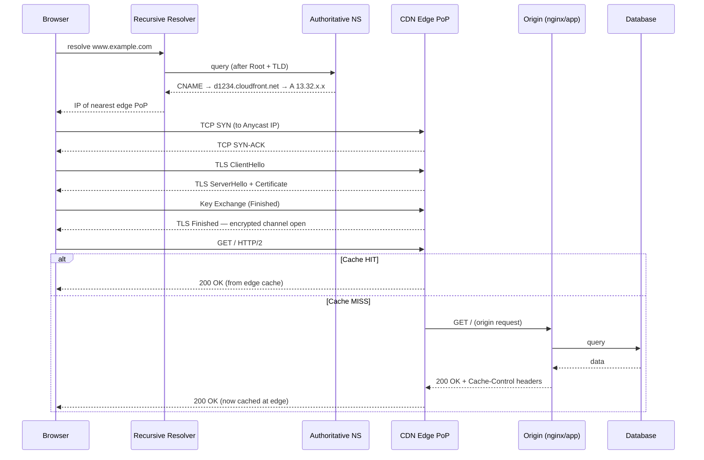
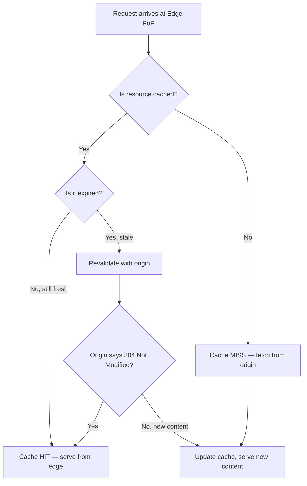
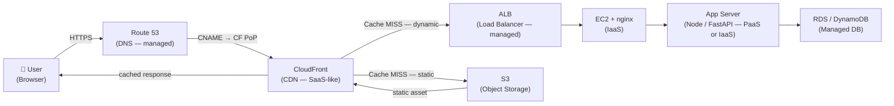

# Web Request Flow — DNS → CDN → TLS → nginx/apache

> **Reference note** — general explainer, not tied to a specific module. Cross-references CCF501 Modules 03–05.

---

## TL;DR

Every web request is a detective story: first you find *who has the answer* (DNS resolves the hostname to an IP), then you get it *from the closest place possible* (CDN intercepts and serves from a nearby edge node), *securely* (TLS handshake encrypts the channel and verifies identity), and finally the actual content is *served by software that speaks HTTP* (nginx or Apache at the origin). Understanding this chain demystifies almost everything about cloud web delivery — latency, caching, certificates, CloudFront, reverse proxies.

---

## 1. The Full Flow — Step by Step

```
[You type https://www.example.com in the browser]

1. Browser checks its own DNS cache
2. OS checks /etc/hosts + system DNS cache
3. OS asks Recursive Resolver (your ISP or 8.8.8.8)
4. Recursive Resolver checks its cache
5. If not cached → asks Root NS → TLD NS (.com) → Authoritative NS
6. Authoritative NS returns: www.example.com CNAME d1234.cloudfront.net → A 13.32.x.x
7. TCP connection to nearest CDN Edge PoP (via Anycast)
8. TLS Handshake at the Edge
9. Browser sends HTTP GET /
10. CDN checks edge cache
    ├── CACHE HIT  → response served from edge memory, done
    └── CACHE MISS → CDN makes origin request
                     → nginx/apache at origin
                     → app server (Node, FastAPI, etc.)
                     → database if needed
                     → response flows back: DB → app → nginx → CDN → caches it → browser
```

### Sequence Diagram



---

## 2. DNS Deep Dive

### Record Types

| Record | Purpose | Example |
|--------|---------|---------|
| **A** | Hostname → IPv4 address | `example.com A 93.184.216.34` |
| **AAAA** | Hostname → IPv6 address | `example.com AAAA 2606:2800::1` |
| **CNAME** | Hostname → another hostname | `www.example.com CNAME d1234.cloudfront.net` |
| **TXT** | Arbitrary text (used for SPF, DKIM, site verification) | `"v=spf1 include:..."` |
| **NS** | Delegation to authoritative name servers | `example.com NS ns1.awsdns-01.com` |

### TTL — Why It Matters

TTL (Time to Live) is the number of seconds a DNS answer can be cached by resolvers. Low TTL (e.g., 60s) → changes propagate fast but generate more DNS queries. High TTL (e.g., 86400s = 1 day) → efficient, but slow to update.

**CDN implication:** When you first point a domain at CloudFront, you lower the TTL before the change so old records expire quickly. Once stable, you raise TTL for efficiency.

### How CDN Hijacks the Request via CNAME

```
www.example.com  CNAME  d1234.cloudfront.net
d1234.cloudfront.net  A  13.32.45.67   ← IP of nearest CloudFront PoP
```

The browser resolves `www.example.com`, but DNS leads it to a CloudFront IP. The CDN intercepts the request *before it ever reaches your origin*. This is the fundamental mechanism that makes CDNs transparent to end users.

### Anycast Routing

Most CDN providers assign the *same IP block* to multiple data centres globally. The internet's BGP routing protocol automatically directs your traffic to the *topologically nearest* PoP — no application logic needed. This is Anycast: one IP, many physical destinations.

---

## 3. CDN — What It Actually Does

### Edge Points of Presence (PoPs)

A CDN operator runs hundreds of servers in data centres distributed across cities worldwide. When a user in Sydney requests content, they hit the Sydney PoP — not a data centre in Virginia. This geographic proximity directly reduces latency.

### Cache Decision Flow



### Cache-Control Headers

The origin server controls caching behaviour via HTTP headers:

| Header | Meaning |
|--------|---------|
| `Cache-Control: public, max-age=3600` | Anyone (including CDN) can cache for 1 hour |
| `Cache-Control: private, max-age=0` | Only the browser caches; CDN must not cache |
| `Cache-Control: s-maxage=86400` | CDN-specific max-age (overrides `max-age` for shared caches) |
| `Cache-Control: no-store` | Nothing gets cached anywhere |
| `Vary: Accept-Encoding` | CDN stores separate versions per encoding (gzip vs brotli) |

### HIT / MISS / BYPASS

- **HIT** — served from edge cache; fastest possible response
- **MISS** — not in cache; CDN fetches from origin and caches the response
- **BYPASS** — cache explicitly skipped (e.g., authenticated request, `Cache-Control: private`)

### Modern CDN Capabilities

| Provider | Edge Compute | Notes |
|----------|-------------|-------|
| AWS CloudFront | Lambda@Edge, CloudFront Functions | Run JS at edge — A/B testing, auth, redirects |
| Cloudflare | Workers | V8 isolates — extremely low cold start |
| Fastly | Compute@Edge | WebAssembly-based edge compute |

### Module 05 Connection — RSK e-Learning (Rumah Siap Kerja)

The Module 05 Activity 1 case study describes an e-learning platform on AWS. The architecture fits this flow exactly:

```
Students (globally) → Route 53 DNS → CloudFront Edge PoP
                                         ↓ MISS
                               S3 (static assets: videos, HTML)
                               or ELB → EC2 (dynamic content)
```

- **S3** stores course videos and static pages — perfect CDN origin (immutable, cacheable)
- **CloudFront** distributes them globally with low latency
- **Cache-Control** headers on S3 objects control how long CloudFront caches each file

---

## 4. TLS Handshake (Simplified)

### Why TLS Matters

TLS (Transport Layer Security) does two things:
1. **Encryption** — nobody in the middle can read the traffic
2. **Authentication** — you verify you're talking to the real server, not an impersonator

HTTPS = HTTP running over a TLS-encrypted connection. TLS is the protocol; HTTPS is the application.

### TLS 1.2 vs TLS 1.3

| | TLS 1.2 | TLS 1.3 |
|---|---------|---------|
| Handshake round-trips | 2-RTT | **1-RTT** (faster) |
| Cipher suites | Many, including weak ones | Only strong forward-secret suites |
| 0-RTT resumption | No | Yes (with caveats — replay risk) |
| Adoption | Widely deployed | Current standard, supported since ~2018 |

TLS 1.3 removes the bulk of the handshake overhead that made TLS 1.2 feel slow. Most modern browsers and CDNs use TLS 1.3 by default.

### Certificate Chain

```
[Your browser trusts]
  Root CA (e.g. DigiCert, Let's Encrypt ISRG Root)
    └── Intermediate CA
          └── Domain Certificate (example.com)
```

The server sends the domain cert + intermediate CA during the handshake. Your browser validates the chain up to a root CA it already trusts (built into the OS/browser). If any link is invalid or expired, the browser shows a warning.

### CDN Terminates TLS at the Edge

This is one of the biggest performance wins CDNs provide:

```
Browser ←──── TLS ────→ CDN Edge PoP ←── (optional TLS or HTTP) ──→ Origin
```

The TLS handshake happens at the *nearest edge node*, not at your origin server in a distant data centre. This means:
- Lower latency for the handshake (geographically closer)
- Origin server is relieved of TLS CPU overhead
- CDN manages certificate renewal (e.g., CloudFront + ACM = automatic cert renewal)

---

## 5. nginx / Apache — Where They Live

### Role in the Stack

Both nginx and Apache are **HTTP servers** and **reverse proxies**. In a cloud-native CDN setup, they sit at the *origin* — behind the CDN, not directly facing the internet.

```
Internet → CloudFront → [Origin]
                           ├── nginx (HTTP server / reverse proxy)
                           └── App server (Node.js, FastAPI, Gunicorn...)
                                  └── Database
```

### nginx vs Apache

| | nginx | Apache |
|---|-------|--------|
| Architecture | Event-driven, async, non-blocking | Process/thread per request |
| Concurrency | Very high (10k+ simultaneous connections) | Lower (limited by worker count) |
| Static files | Extremely fast | Good, but slower than nginx |
| Config | `nginx.conf` — central, structured | `httpd.conf` + `.htaccess` — distributed |
| Dynamic modules | Compiled in or `load_module` | `mod_*` — large ecosystem |
| Use case | Modern high-traffic workloads, reverse proxy | Legacy apps, shared hosting, `.htaccess` flexibility |

### nginx as Reverse Proxy (Example Config Sketch)

```nginx
server {
    listen 80;
    server_name example.com;

    location / {
        proxy_pass http://localhost:3000;   # forwards to Node.js app
        proxy_set_header Host $host;
        proxy_set_header X-Real-IP $remote_addr;
    }

    location /static/ {
        root /var/www;                      # serves static files directly
        expires 1d;
    }
}
```

nginx receives the request from CloudFront, applies rules, and forwards to the app server. It also serves static files without involving the app.

### In Kubernetes / Docker

In containerised deployments, nginx is often replaced (or complemented) by:
- **nginx-ingress controller** — Kubernetes Ingress resource backed by nginx
- **Traefik** — cloud-native reverse proxy with automatic service discovery
- **AWS ALB** — Application Load Balancer handles routing before traffic even reaches a pod

---

## 6. Performance Considerations

### Latency Breakdown

```
Total latency = DNS lookup + TCP handshake + TLS handshake + TTFB + data transfer
```

| Component | Typical range | CDN impact |
|-----------|--------------|------------|
| DNS lookup | 1–100 ms | Low TTL = repeated lookup cost |
| TCP handshake | 10–200 ms | CDN edge is geographically closer |
| TLS handshake | 10–200 ms | TLS termination at edge, TLS 1.3 1-RTT |
| TTFB | 20–500 ms | Cache HIT = near-zero origin TTFB |
| Data transfer | Varies | Compression + HTTP/2 multiplexing |

**TTFB (Time to First Byte)** is the most important single metric — it's the delay between the browser sending a request and receiving the first byte of the response. A cache HIT from a nearby edge PoP can bring TTFB from 200 ms down to under 10 ms.

### How CDN Reduces Latency

1. **Geographic proximity** — edge PoP is near the user
2. **Connection reuse (keep-alive)** — CDN maintains persistent TCP connections to origin; each new request doesn't need a new handshake
3. **HTTP/2 multiplexing** — multiple requests over one TCP connection (no head-of-line blocking)
4. **Compression** — gzip or brotli applied at edge before delivery
5. **Cache HIT** — eliminates origin round-trip entirely

### Cache-Control Strategy

```
Static assets (images, JS, CSS with hashed filenames):
  Cache-Control: public, max-age=31536000, immutable

HTML pages (may change frequently):
  Cache-Control: public, s-maxage=300, stale-while-revalidate=60

API responses (user-specific):
  Cache-Control: private, no-store

API responses (public, cacheable):
  Cache-Control: public, s-maxage=60
```

---

## 7. Full Cloud Architecture — Putting It Together

This diagram maps the full flow to CCF501 service model concepts:



### CCF501 Service Model Mapping

| Layer | AWS Service | CCF Service Model |
|-------|------------|-------------------|
| DNS | Route 53 | Managed service (PaaS-adjacent) |
| CDN | CloudFront | Managed service / SaaS-like |
| Load Balancer | ALB | PaaS (managed infrastructure) |
| Web server | EC2 + nginx | IaaS (you manage the OS and nginx) |
| App server | Elastic Beanstalk | PaaS (you provide code; AWS manages runtime) |
| Storage | S3 | PaaS / Object Storage |
| Database | RDS | PaaS (managed DB engine) |

This maps directly to Module 03 (deployment models) and Module 04 (service models): even a "simple" website spans multiple service tiers.

---

## Sources

- Manvi, S., & Shyam, G. K. (2021). *Cloud computing: Concepts and technologies*. CRC Press. (CCF501 Module 05 reading)
- Kuijpers, C. (2022). AWS vs Azure vs GCP platform comparison. (CCF501 Module 05 reading)
- AWS Documentation. (2024). *Amazon CloudFront Developer Guide*. Amazon Web Services.
- Nginx, Inc. (2024). *nginx documentation*. https://nginx.org/en/docs/
- IETF RFC 8446. (2018). *The Transport Layer Security (TLS) Protocol Version 1.3*.
- MDN Web Docs. (2024). *HTTP caching*. Mozilla Developer Network.
