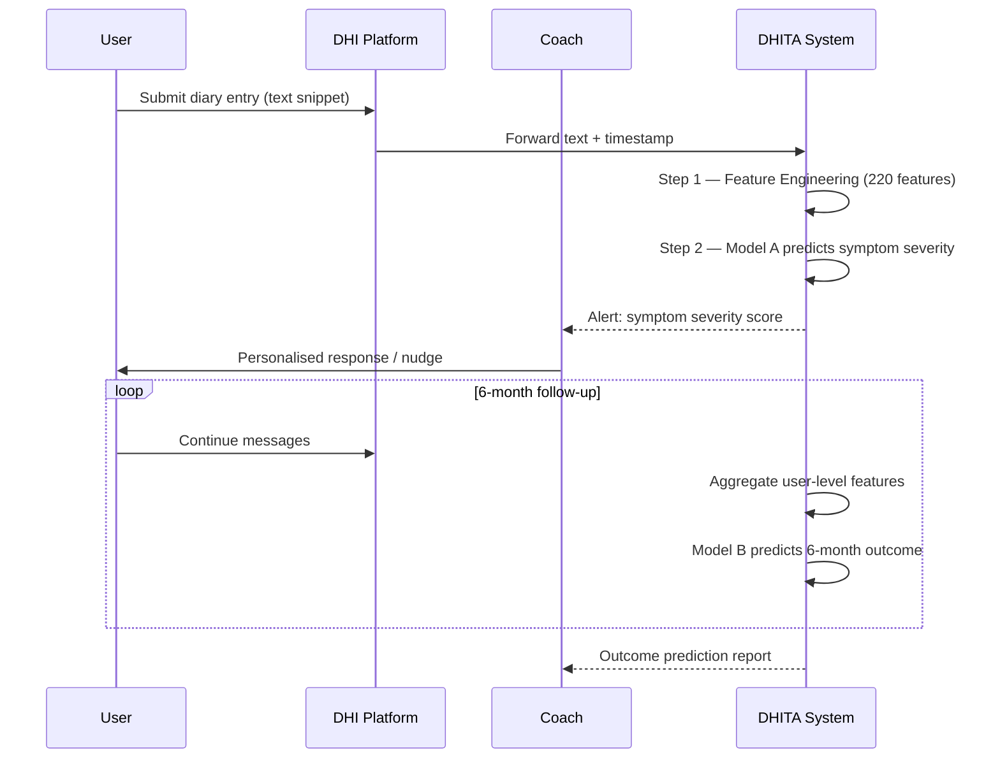

# ISY503 Assessment 1 - Case Study Report
## Intelligent Systems Application

---

## Case Study Selection
> **Choose ONE:**
> - [ ] Computer Vision Case Study
Sapiro, G., Hashemi, J., & Dawson, G. (2019). Computer vision and behavioral phenotyping: an autism case study. Current opinion in biomedical engineering, 9, 14–20. https://doi.org/10.1016/j.cobme.2018.12.002

> - [x] Natural Language Processing (NLP) Case Study
Funk, B., Sadeh-Sharvit, S., Fitzsimmons-Craft, E. E., Trockel, M. T., Monterubio, G. E., Goel, N. J., Balantekin, K. N., Eichen, D. M., Flatt, R. E., Firebaugh, M. L., Jacobi, C., Graham, A. K., Hoogendoorn, M., Wilfley, D. E., & Taylor, C. B. (2020). A Framework for Applying Natural Language Processing in Digital Health Interventions. Journal of medical Internet research, 22(2), e13855. https://doi.org/10.2196/13855

**Selected Case Study:** Funk, B., et al. (2020). A Framework for Applying Natural Language Processing in Digital Health Interventions. *Journal of Medical Internet Research, 22*(2), e13855.

---

## 1. Introduction
> **Purpose:** Introduce the case study and highlight the significance of the problem it addresses.

### 1.1 Case Study Overview

Digital health interventions (DHIs) — including smartphone apps, online coaching platforms, and web-based therapy programs — generate large volumes of unstructured text through participant journals, coach-user messages, and self-monitoring logs. Extracting clinically meaningful insights from this text manually is time-intensive and does not scale to the thousands of users these platforms serve.

Funk et al. (2020) addressed this gap by proposing the Digital Health Intervention Text Analytics (DHITA) framework: a reusable two-step natural language processing (NLP) pipeline designed to automate feature extraction from DHI text and apply those features to supervised machine learning models for clinical outcome prediction. The framework was validated on data from two randomized controlled trials (RCTs) targeting eating disorders among college-age women.

### 1.2 Problem Significance

Mental health conditions affect over 970 million people globally, yet specialist care access remains severely constrained (World Health Organization, 2022). DHIs offer a scalable route to evidence-based support, but their clinical value depends on monitoring user progress at scale — a task manual review cannot sustain. Intelligent NLP systems can bridge this gap by transforming unstructured language into actionable clinical signals.

### 1.3 Report Structure

This report examines the DHITA framework as a case study in applying intelligent systems to high-stakes health data. Section 2 provides technical background on the system's architecture, ML models, and feature engineering methods. Section 3 describes the research methodology, data sources, and ethical considerations. Section 4 presents quantitative results, Section 5 discusses limitations, and Section 6 offers recommendations for improvement.

**Target Word Count:** ~200-250 words

---

## 2. Background
> **Purpose:** Provide sufficient background information on and explain the application of the intelligent system including machine learning models and methods.

### 2.1 Intelligent System Overview

DHITA is a supervised ML system for text analytics operating as a two-step pipeline: (1) feature engineering — transforming raw DHI text into numerical representations — and (2) predictive modeling — applying those features to trained classifiers and regressors.

### 2.2 Machine Learning Models

Two predictive models are deployed. **Model A** — a Random Forest classifier (Breiman, 2001) with 200 decision trees — predicts session-level symptom severity from post-session text entries. Random Forest is well-suited to this task because it handles high-dimensional, mixed-type feature sets without requiring feature scaling and reduces overfitting through ensemble aggregation. **Model B** — a Logistic Regression classifier — predicts long-term clinical outcomes (eating disorder remission) at six-month follow-up. Logistic Regression was chosen for interpretability, which is critical in clinical contexts where prediction rationale must be auditable.

Feature selection is performed using the Least Absolute Shrinkage and Selection Operator (LASSO) with 50-fold cross-validation (Tibshirani, 1996). LASSO imposes L1 regularization that drives irrelevant feature coefficients to zero, selecting a compact interpretable subset from the 220 available features — necessary given the limited sample size.

### 2.3 Methods and Techniques

The feature engineering layer produces 220 features per user across seven categories (Table 1). Each group captures a distinct linguistic or behavioural dimension, ensuring non-redundant representations.

**Table 1.** DHITA Feature Engineering Strategies

| Feature Type | Count | Method / Tool | Key Reference |
|---|---:|---|---|
| Metadata | 5 | Message length, response time, session statistics | — |
| Word frequency | 79 | MINOCC/MAXOCC threshold filtering | — |
| Word embeddings | 50 | GloVe 50-dim averaged vectors | Pennington et al. (2014) |
| POS tags | 44 | Apache OpenNLP (~95% accuracy) | — |
| Topic model | 10 | LDA, 8 latent topics | Blei et al. (2003) |
| Sentiment lexicons | 30 | NRC, AFINN, Bing | — |
| Communication stats | 2 | average response rate and average response time | — |

Area Under the ROC Curve (AUC) serves as the primary evaluation metric, selected for robustness to class imbalance.

> 📸 **[Figure 1 — Suggested]** DHITA two-step pipeline architecture
> **Nano Banana prompt:** "Minimalist technical flow diagram. Left box: 'DHI Text Input (journals + coach messages)'. Centre: 7 parallel feature extraction boxes (Metadata n=5, Word Frequency n=79, GloVe Embeddings n=50, POS Tags n=44, LDA Topics n=10, Sentiment Lexicons n=30, Communication Stats n=2) all converging into one '220-dim Feature Vector' box. Right: two output branches — 'Model A: Random Forest → Symptom Severity AUC 0.72' and 'Model B: Logistic Regression → 6-month Outcome'. Clean academic style, blue-grey palette, white background, sans-serif labels."

### 2.4 Related Work

Prior health NLP work focused on clinical notes and social media (Sarker, 2021); DHIs present a distinct type — longitudinal coach-participant dialogues within structured therapeutic contexts. Earlier DHI studies used isolated sentiment scores or word counts. DHITA is the first framework to systematically combine all major NLP feature classes in a single replicable pipeline.

**Target Word Count:** ~350-400 words

---

## 3. Method
> **Purpose:** Elaborate on the method(s) used and explain how the research was undertaken. Include data sources and identify ethical issues.

### 3.1 Research Methodology

The study employed a retrospective observational design, re-analyzing text data from two previously conducted RCTs: the Self-Monitoring of Body, Eating, and Dieting (SBED) program and the Healthy Body Image (HBI) program, both targeting eating disorders in college-age women. This cross-sectional approach allowed evaluation of DHITA's predictive validity against established clinical measures without new data collection.

### 3.2 Data Sources

The dataset comprised 37,228 intervention text snippets from SBED participant journals and 4,285 coach-user messages from the HBI program, contributed by 372 users in total. Of these, 100 users with complete six-month follow-up assessments using the Eating Disorder Examination Questionnaire (EDE-Q) were used for outcome prediction. The study population was homogeneous: predominantly college-age females with subclinical eating disorders — a deliberate clinical design choice that simultaneously limits external validity.

Text preprocessing followed standard NLP practices: tokenization, stemming (Porter stemmer), and vocabulary filtering via MINOCC/MAXOCC thresholds to remove rare and overly common tokens. GloVe vectors were averaged across tokens per document. Model evaluation used a within-user protocol for Model A (training and testing on the same user's temporal data) and a cross-user protocol for Model B (evaluation across 100 users). LASSO with 50-fold cross-validation was applied for feature selection prior to final model fitting.

### 3.3 Ethical Considerations

Four interdependent ethical dimensions arise from DHITA's design and data (Table 3).

**Table 3.** Ethical Considerations

| Dimension | Issue | Risk Level |
|---|---|---|
| Privacy & consent | RCT consent ≠ secondary NLP analysis; re-identification risk in small cohorts | High |
| Bias & fairness | Dataset limited to college-age females; cross-population performance unvalidated | High |
| Explainability | Random Forest lacks native interpretability; LASSO provides partial audit trail only | Medium |
| Clinical safety | AUC 0.57–0.72 insufficient for autonomous decisions; human oversight mandatory | Critical |

Ethical deployment demands updated consent protocols, mandatory human-in-the-loop review, and population-diverse replication before any clinical use.

> 📸 **[Figure 3 — Suggested]** Ethical risk quadrant
> **Nano Banana prompt:** "2×2 risk quadrant. X-axis: 'Severity of Harm (Low → High)'. Y-axis: 'Likelihood of Occurrence (Low → High)'. Four labelled points: top-right 'Clinical Over-reliance' (red dot), top-left 'Re-identification Risk' (orange dot), bottom-right 'Algorithmic Bias' (orange dot), bottom-left 'Explainability Gap' (yellow dot). Clean academic infographic, white background, minimal style."

### 3.4 Implementation Process

The pipeline was implemented using an R package called Digital Health Interventions Text Analytics (DHITA), with Apache OpenNLP providing POS tagging. No deep learning frameworks were required; computational demands were modest and hardware constraints are not reported as a limiting factor.

**Target Word Count:** ~350-400 words

---

## 4. Results
> **Purpose:** Present the outcomes of the case study with clear metrics and analysis.

### 4.1 Performance Metrics

Table 2 summarises model performance; both models outperformed the random baseline (AUC 0.50).

**Table 2.** DHITA Predictive Model Performance

| Model | Algorithm | Task | Protocol | AUC |
|---|---|---|---|---:|
| A | Random Forest (200 trees) | Symptom severity | Within-user | **0.72** |
| A | Logistic Regression | Symptom severity | Cross-user | 0.57 |
| B | Logistic Regression | 6-month outcome | Cross-user | ~10 features selected |

> 📸 **[Figure 2 — Suggested]** Model AUC comparison bar chart
> **Nano Banana prompt:** "Simple horizontal bar chart. Three bars: 'Model A Within-User' (AUC 0.72, highlighted in teal), 'Model A Cross-User' (AUC 0.57, mid-blue), 'Random Baseline' (AUC 0.50, grey). X-axis: 0.0 to 1.0. Vertical dashed line at 0.85 labelled 'Clinical Decision Support Threshold'. Clean academic style, white background, minimal grid lines."

### 4.2 Key Findings

The most discriminative features for outcome prediction centered on thematic and behavioral signals: body-image and diet-related language, references to program content ("help," "program" terms), and temporal engagement metrics such as message response rate and response time. This suggests that linguistic engagement with program content predicts treatment trajectory, not just emotional tone.

Feature group counts are detailed in Table 1 (Background); correlation analysis confirmed low inter-feature overlap across all seven groups.

### 4.3 Visual Analysis

The original paper reports ROC curves for both models, with Model A's within-user curve showing the most pronounced departure from the diagonal. Feature importance rankings derived from LASSO coefficients are documented in the paper, with the body/diet/program lexical cluster and response time metrics appearing as the highest-weighted predictors.

**Target Word Count:** ~200-250 words

---

## 5. Discussion
> **Purpose:** Explain the relevance and significance of the study, identify obstacles, and mention constraints.

### 5.1 Relevance and Significance

DHITA demonstrates that NLP-derived features from digital health text carry predictive signal for clinical outcomes. The framework's modular design is a genuine contribution: by standardizing the feature engineering and modeling pipeline, it provides a replicable scaffold for DHI researchers, reducing the barrier to applying NLP in new health domains. The AUC of 0.72 confirms that linguistic signals in DHI text carry clinically informative content.

### 5.2 Obstacles and Limitations

**Technical Obstacles:** The within-user/cross-user performance gap — from AUC 0.72 to 0.57 — is the study's most critical finding. It reveals that the model learns idiosyncratic patterns specific to individuals rather than generalizable population-level signals, fundamentally limiting scalability to new users.

**Methodological Limitations:** The dataset is drawn exclusively from college-age females with eating disorders enrolled in structured RCTs. This narrow population restricts external validity and raises equity concerns: the model may perform poorly on demographically distinct groups. The 100-user outcome prediction sample is small, increasing variance in cross-user evaluation. Beyond accuracy, the framework's narrow training population means its deployment would primarily benefit users demographically similar to the RCT cohort, reinforcing existing health inequity.

**Constraints Reported in Article:** The authors explicitly acknowledge the preliminary status of the results, the absence of deep learning methods, and the need for validation across additional conditions and populations.

### 5.3 Comparison with State-of-the-Art

The study predates the broad adoption of transformer-based NLP. Since 2020, BERT and its clinical variants — notably BioBERT (Lee et al., 2020) and MentalBERT (Ji et al., 2022) — have substantially advanced clinical text mining. Averaged GloVe embeddings cannot capture contextual meaning; replacing them with transformer representations would likely yield measurable AUC improvements and is the most actionable technical upgrade available today.

**Target Word Count:** ~250-300 words

---

## 6. Recommendations
> **Purpose:** Provide critical perspectives and recommendations to improve or enhance the system.

### 6.1 Technical Improvements

Replacing GloVe embeddings with contextual representations from transformer models — such as MentalBERT (Ji et al., 2022) or BioBERT (Lee et al., 2020) — would capture semantic nuance that averaged static vectors cannot represent, likely pushing AUC toward the ≥0.85 threshold required for clinical decision support. Expanding the corpus to diverse populations (age groups, genders, comorbid conditions) would directly address the generalizability gap.

### 6.2 Ethical and Practical Recommendations

Any clinical deployment must incorporate mandatory human-in-the-loop review; no triage decision should rely solely on algorithmic output. SHAP or LIME explainability tools would enable clinicians to audit predictions. Consent frameworks must be updated to explicitly cover secondary NLP analysis. Integrating passive sensing signals — app usage frequency, session timing, response latency — alongside text features could improve predictive power without requiring additional sensitive disclosures. Future work could explore federated learning (Rieke et al., 2020) to enable multi-site training while preserving participant privacy. Longer term, accurate predictions could trigger automated coaching nudges, providing timely support without requiring constant clinician availability.

**Target Word Count:** ~150-200 words

---

## 7. Conclusion
> **Purpose:** Summarize key insights and final thoughts.

Funk et al.'s DHITA framework represents a meaningful step toward scalable clinical insight extraction from digital health text. By combining seven NLP feature engineering strategies with interpretable ML models and LASSO feature selection, the framework achieves an AUC of 0.72 for within-user symptom severity prediction — a promising proof-of-concept for NLP in mental health. However, the cross-user performance drop to AUC 0.57, the narrow study population, and the absence of contextual deep learning methods limit immediate clinical translation. The field has since advanced considerably; replicating DHITA with transformer-based embeddings and diverse, multicondition datasets represents the most productive path forward. Any deployment must prioritize human oversight to ensure predictive models complement rather than replace clinical judgment.

**Target Word Count:** ~100-150 words

---

## Appendices

### Appendix A: Glossary of Technical Terms
| Term | Definition |
|---|---|
| GloVe | Global Vectors for Word Representation; a method for generating word embeddings based on co-occurrence statistics. |
| DHI | Digital Health Intervention; technology-based programs designed to support health outcomes. |

---

### Appendix B: DHITA vs Transformer Architecture Comparison

> 📸 **[Figure B — Suggested]** DHITA classical pipeline vs. transformer upgrade (side-by-side)
> **Nano Banana prompt:** "Two-column side-by-side. Left column header: 'DHITA (2020)'. Pipeline: Raw Text → [GloVe avg | LDA | POS | Sentiment] → 220-dim vector → Random Forest / Logistic Regression → AUC 0.57–0.72. Right column header: 'Transformer Upgrade'. Pipeline: Raw Text → [BERT/MentalBERT tokenizer] → Contextual Embeddings → Fine-tuned Classification Head → AUC target ≥0.85. Both columns same height, separated by vertical line. Header: 'Feature Representation Strategy'. Academic style, blue-grey palette."

---

### Appendix C: Exploratory Pipeline Notebook Skeleton

> 📸 **[Figure C — Suggested]** Six-step pipeline flow diagram (classical + transformer branches)
> **Nano Banana prompt:** "Vertical flow diagram with 6 numbered steps, each a rounded rectangle. Steps 1–3 in blue ('Classical'), steps 4–6 split: left branch blue (classical), right branch teal (transformer). Converge at Step 6 'AUC Comparison'. Clean notebook-style layout, monospace labels, white background."

```
Step 1 — Load & Inspect Data
Step 2 — Preprocessing (tokenise, stem, MINOCC/MAXOCC filter)
Step 3 — Classical Feature Engineering (metadata, word freq, GloVe avg, POS, LDA, sentiment)
Step 4 — Transformer Features (HuggingFace MentalBERT embeddings, no averaging)
Step 5 — Model Training (RF, LR, fine-tuned transformer)
Step 6 — Evaluation (ROC/AUC comparison, LASSO feature selection)
```

---

### Appendix D: LASSO Regularisation Concept Diagram

> 📸 **[Figure D — Suggested]** Before/after feature selection via LASSO
> **Nano Banana prompt:** "Two-panel diagram. Left panel: bar chart with 220 bars (represent features), all varying heights, labelled 'All 220 Features'. Right panel: same chart but 210 bars collapsed to zero (grey), 10 bars tall and highlighted in teal, labelled '10 Selected Features (λ≈0.15)'. Arrow between panels labelled 'LASSO Regularisation'. Below right panel: small U-curve labelled 'MSE vs λ' with dashed line at minimum. Academic style, clean white background."

---

### Appendix E: User Journey Sequence Diagram



---

### Appendix F: Explain Like I'm Five (Non-Assessable)

> This appendix is a personal learning aid — not part of the submitted assessment.

**What is DHITA, really?**

Imagine you're keeping a diary about your eating habits and how you're feeling. You write in it every day, and an online coach sends you encouraging messages back. Now imagine a computer program that reads all those diary entries and messages — not to judge you, but to spot hidden patterns.

That's DHITA. It reads thousands of diary entries from people getting help with eating disorders. Instead of a human having to read everything (which would take forever and couldn't scale), DHITA does three things:

1. **Breaks the writing into clues** — which words come up most, what mood the writing suggests, how quickly someone replies to their coach.
2. **Bundles the clues into 220 numbers** — a unique "fingerprint" that describes each person's communication style at a given point in time.
3. **Feeds the numbers into a prediction machine** — essentially a very sophisticated pattern-matcher that says: "based on these signals, this person is likely struggling today" or "this person is at risk of not recovering in six months."

**The catch?** DHITA was trained only on data from college-age women with eating disorders. It's like a recipe written for one specific dish — if you try to cook something different with it, the results might not be reliable. That's why the report recommends testing it on more diverse populations before any real clinical use.

**Why does AUC 0.72 matter?**

Imagine flipping a coin to predict whether someone will improve — that's AUC 0.50. DHITA scores 0.72, meaning it's meaningfully better than guessing. But the bar for clinical tools is usually ≥0.85, so it's promising, not ready.

---

## References
> **Format:** APA 7th Edition
> **Requirement:** Support report with additional peer-reviewed journal articles

1. Funk, B., Sadeh-Sharvit, S., Fitzsimmons-Craft, E. E., Trockel, M. T., Monterubio, G. E., Goel, N. J., Balantekin, K. N., Eichen, D. M., Flatt, R. E., Firebaugh, M. L., Jacobi, C., Graham, A. K., Hoogendoorn, M., Wilfley, D. E., & Taylor, C. B. (2020). A framework for applying natural language processing in digital health interventions. *Journal of Medical Internet Research, 22*(2), e13855. https://doi.org/10.2196/13855

2. Blei, D. M., Ng, A. Y., & Jordan, M. I. (2003). Latent Dirichlet allocation. *Journal of Machine Learning Research, 3*, 993–1022. https://www.jmlr.org/papers/v3/blei03a.html

3. Pennington, J., Socher, R., & Manning, C. D. (2014). GloVe: Global vectors for word representation. *Proceedings of the 2014 Conference on Empirical Methods in Natural Language Processing (EMNLP)*, 1532–1543. https://doi.org/10.3115/v1/D14-1162

4. Tibshirani, R. (1996). Regression shrinkage and selection via the lasso. *Journal of the Royal Statistical Society: Series B (Methodological), 58*(1), 267–288. https://doi.org/10.1111/j.2517-6161.1996.tb02080.x

5. Breiman, L. (2001). Random forests. *Machine Learning, 45*(1), 5–32. https://doi.org/10.1023/A:1010933404324

6. Sarker, A. (2021). Machine learning: Algorithms, real-world applications and research directions. *SN Computer Science, 2*(3), 160. https://doi.org/10.1007/s42979-021-00592-x

7. Calvo, R. A., Milne, D. N., Hussain, M. S., & Christensen, H. (2017). Natural language processing in mental health applications using non-clinical texts. *Natural Language Engineering, 23*(5), 649–685. https://doi.org/10.1017/S1351324916000383

8. World Health Organization. (2022). *World mental health report: Transforming mental health for all*. WHO Press. https://www.who.int/publications/i/item/9789240049338

9. Devlin, J., Chang, M.-W., Lee, K., & Toutanova, K. (2019). BERT: Pre-training of deep bidirectional transformers for language understanding. *Proceedings of NAACL-HLT 2019*, 4171–4186. https://doi.org/10.18653/v1/N19-1423

10. Lee, J., Yoon, W., Kim, S., Kim, D., Kim, S., So, C. H., & Kang, J. (2020). BioBERT: A pre-trained biomedical language representation model for biomedical text mining. *Bioinformatics, 36*(4), 1234–1240. https://doi.org/10.1093/bioinformatics/btz682

11. Ji, S., Pan, S., Li, G., Cambria, E., Long, G., & Huang, Z. (2022). MentalBERT: Publicly available pretrained language models for mental healthcare. *Proceedings of the 13th Language Resources and Evaluation Conference (LREC 2022)*, 7184–7190.

12. Rieke, N., Hancox, J., Li, W., Milletarì, F., Roth, H. R., Albarqouni, S., Bakas, S., Galtier, M. N., Landman, B. A., Maier-Hein, K., Ourselin, S., Sheller, M., Summers, R. M., Trask, A., Xu, D., Baust, M., & Cardoso, M. J. (2020). The future of digital health with federated learning. *npj Digital Medicine, 3*(1), 119. https://doi.org/10.1038/s41746-020-00323-1

---

## Statement of Acknowledgment
I acknowledge that I have used the following AI tool(s) in the creation of this report:
- OpenAI ChatGPT (GPT-5)
- Anthropic Claude Sonnet 4.6

Both have been used to assist with outlining, refining structure, improving clarity of academic language, and supporting APA 7th referencing conventions. 

Prompt examples:
1. *"I'm writing a 1,500-word case study report on Funk et al. (2020) — a framework for applying NLP in digital health interventions. Here is the assessment rubric [pasted]. Help me write a 200–250 word Introduction section that covers the problem significance and outlines the report structure. Do not add content I haven't asked for."*
2. *"Here is a numbered list of seven DHITA feature engineering categories with counts and methods. Convert this into a clean markdown table with four columns: Feature Type, Count, Method/Tool, Key Reference. Preserve all existing data exactly."*
3. *"My §3.3 ethics section is one dense 90-word paragraph. Rewrite it as a one-sentence framing statement followed by a four-row table. Rows: Privacy & consent, Bias & fairness, Explainability, Clinical safety — each with an Issue column and a Risk Level (High / Medium / Critical). Keep total word count similar to the original."*

I confirm that the use of the AI tool has been in accordance with the Torrens University Australia Academic Integrity Policy and TUA, Think and MDS’s Position Paper on the Use of AI. I confirm that the final output is authored by me and represents my own critical thinking, analysis, and synthesis of sources. I take full responsibility for the final content of this report.

---

## Submission Checklist
- [ ] Word count within 1350-1650 words (1500 ± 10%)
- [ ] All sections completed with sufficient depth
- [ ] Ethical considerations thoroughly addressed
- [ ] At least 8 peer-reviewed references in APA format
- [ ] Technical language used appropriately
- [ ] Proofread for grammar and clarity
- [ ] File named: `ISY503_Faria_L_Assessment_1.pdf`
- [ ] Submitted via MyLearn before 22/03/2026 11:55pm AEST
- [ ] **[Post-submission]** Run Appendix C notebook skeleton locally (DHITA R package + Python MentalBERT via HuggingFace) to deepen implementation understanding and build a portfolio prototype

---

## Assessment Rubric Alignment

| Criterion | Weight | Focus Areas |
|-----------|--------|-------------|
| **Introduction** | 15% | Problem significance, clarity |
| **Background** | 20% | Technical depth, ML models explanation |
| **Method** | 20% | Research methodology, ethical issues |
| **Results** | 15% | Clear outcomes, metrics |
| **Discussion** | 15% | Relevance, obstacles, constraints |
| **Recommendations** | 10% | Critical analysis, improvements |
| **References & Writing** | 5% | APA style, academic writing quality |

---

## Learning Outcomes Addressed
- ✅ **SLO a)** Determine suitable approaches towards the construction of AI systems
- ✅ **SLO b)** Determine ethical challenges distinctive to AI
- ✅ **SLO d)** Communicate clearly using technical language

---

## Notes & Research Ideas
> Use this space for brainstorming, key quotes, and research notes

### Key Technical Concepts to Cover
- GloVe embeddings (Pennington et al., 2014) — averaged 50-dim vectors as document representation
- Latent Dirichlet Allocation (LDA) topic modeling — 8 latent topics extracted from DHI corpus
- Part-of-speech (POS) tagging via Apache OpenNLP (~95% accuracy)
- LASSO regularization (L1) for feature selection — 50-fold cross-validation, 220 → ~10 features
- Logistic Regression for interpretable binary outcome prediction
- Random Forest (200 trees) for symptom severity prediction
- Sentiment lexicons: NRC Emotion Lexicon, AFINN, Bing

### Ethical Issues to Explore
- Consent scope: RCT participants consented to intervention, not secondary NLP analysis
- Privacy: sensitive mental health disclosures (eating disorders, body image, suicide risk scales)
- Algorithmic bias: model trained on college-age females — reduced generalizability
- Clinical over-reliance risk: AUC 0.57–0.72 insufficient for autonomous clinical decisions
- Equity: framework benefits scale only if population coverage is expanded beyond narrow cohorts
- Explainability: Random Forest lacks native interpretability — clinicians need audit trail

### Strong Peer-Reviewed Sources
- Funk et al. (2020) — primary case study paper
- Blei et al. (2003) — LDA foundational paper
- Pennington et al. (2014) — GloVe embeddings
- Tibshirani (1996) — LASSO regression
- Breiman (2001) — Random Forests
- Sarker (2021) — ML overview (already in module notes)
- Calvo et al. (2017) — NLP in mental health applications
- WHO (2022) — mental health burden statistics
- Devlin et al. (2019) — BERT (for future directions comparison)
- Lee et al. (2020) — BioBERT, biomedical language model (§5.3, §6.1)
- Ji et al. (2022) — MentalBERT, mental health language model (§5.3, §6.1)
- Rieke et al. (2020) — Federated learning for digital health (§6.2)

---

**Last Updated:** 2026-03-03
**Status:** 🔥 Work in Progress