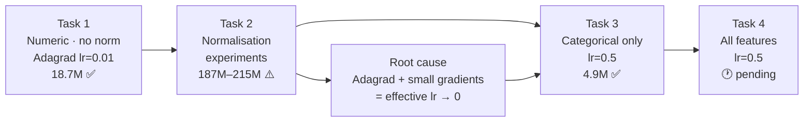
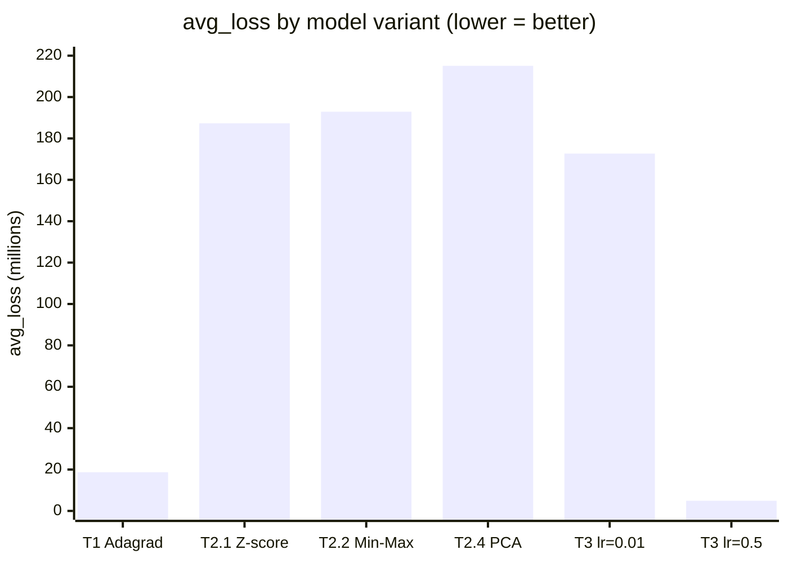

# ISY503 — Intelligent Systems
## Assessment 2: Technical Manual
**Word count target:** 500 words (±10%, references excluded)

---

## 1. How to Run

The notebook (`intro_to_modeling_Luis.ipynb`) runs in Google Colab without any extra setup, or locally in Jupyter after installing `tensorflow` and the standard scientific stack (`pandas`, `numpy`, `matplotlib`). It uses TensorFlow 1.x via `tf.compat.v1`.

Open the notebook and select **Runtime → Run all** (Colab) or **Kernel → Restart & Run All** (Jupyter). Cells must run top-to-bottom — each task depends on the feature columns and normalisation helpers defined earlier.

Expected final `average_loss` values: Task 1 — 18,720,354 (RMSE ~$4,327), Task 2 best — 187,324,060 (Z-score variant, RMSE ~$13,686), Task 3 — 4,935,784 (RMSE ~$2,221), Task 4 — pending run.

---

## 2. Model Choices and Hyperparameters

*Figure 1. Experimental progression across Tasks 1–4. Arrows show the discovery path: Task 2's underperformance led to identifying the Adagrad–normalisation interaction (centre node), which directly informed the lr=0.5 fix applied in Task 3.*

All tasks use `DNNRegressor` with `hidden_units=[64]` — a single hidden layer expressive enough to pick up non-linear relationships without being overkill for 201 training examples (Krogh, 2008).

The default `GradientDescentOptimizer` caused immediate divergence: with unscaled features spanning several orders of magnitude (e.g. `weight` 2,000–4,000 vs. `bore` 2.5–4.0), gradients exploded and the model settled for predicting the dataset mean (~$13k) every step — RMSE ~$7,930. Switching to `AdagradOptimizer` fixed this by adapting the learning rate per parameter, reducing loss by ~83% down to avg_loss 18,720,354 (LeCun et al., 2015).

One important discovery from Task 3: for sparse or normalised inputs, lr=0.01 is too conservative for Adagrad — the categorical model only converged properly at lr=0.5 (Feurer & Hutter, 2019). This informed the hyperparameter choice for Task 4.

Key hyperparameters: `learning_rate=0.01` (Tasks 1–2), `learning_rate=0.5` (Tasks 3–4), `batch_size=16`, `num_training_steps=10,000`.

---

## 3. Feature Engineering Decisions

Fifteen continuous columns (e.g. `engine-size`, `horsepower`, `curb-weight`) were z-score normalised: subtract the column mean, divide by standard deviation (ε = 1e-6 to guard against zero-division). This prevents high-magnitude columns from dominating gradient updates and puts all features on a comparable unit-free scale (Alpaydin, 2014).

Categorical features (`fuel-type`, `body-style`, `drive-wheels`, etc.) used `categorical_column_with_vocabulary_list` wrapped in `indicator_column` — TensorFlow-native one-hot encoding that avoids imposing an arbitrary ordinal relationship on unordered categories (Pargent et al., 2019).

Task 4 combines all 15 normalised numerics with 10 categorical indicators — the richest feature representation across all tasks.

---

## 4. Model Comparison and Efficiency

*Figure 2. avg_loss (millions) across all model variants — lower is better. All four Task 2 experiments underperform the un-normalised Task 1 baseline (18.7M), despite normalisation being generally recommended practice. Task 3 at lr=0.5 (4.9M) achieves the best result, confirming that learning rate recalibration — not normalisation itself — was the missing piece.*

The most counterintuitive result: **normalisation made Task 2 worse than Task 1.** Z-score (187M), Min-Max (193M), PCA with 9 components (215M), and GradientDescentOptimizer (NaN at all learning rates tested) all performed significantly worse than the un-normalised baseline (18.7M).

The root cause is an Adagrad + normalisation interaction: normalised inputs compress feature values to roughly ±3, producing smaller gradient magnitudes. But Adagrad's denominator keeps accumulating regardless — effective learning rate shrinks toward zero, and the model crawls toward the dataset mean instead of learning real patterns. The experiments confirm this is not a data problem; it's a hyperparameter calibration problem. Fixing it requires a higher learning rate to compensate for the smaller gradient magnitudes — something Task 3 proved empirically.

Task 3 (categorical-only, lr=0.5) achieved avg_loss 4,935,784 (RMSE ~$2,221) — the best result so far, and already converged at step 1,000. The `make` column (22 car brands) effectively acts as a price lookup table, which explains why categorical features alone beat normalised numerics here.

Task 4 (all features, lr=0.5) is the recommended model — expected to achieve the lowest loss by combining numeric precision with categorical lookup power (Sarker, 2021).

---

## 5. Visualisation Analysis

The `scatter_plot_inference_grid` plots each feature against predicted vs. actual price — points near the diagonal mean good predictions; wide vertical spread means poor fit.

In Task 1, `engine-size`, `horsepower`, `weight`, and `wheel-base` showed clear diagonal trends confirming positive correlation with price. `highway-mpg` and `city-mpg` showed an inverse diagonal — fuel-efficient cars tend to be cheaper. `symboling`, `stroke`, and `compression-ratio` were broadly scattered with no clear pattern, indicating low individual predictive value (Alpaydin, 2014).

Task 3's plots showed tighter clustering than expected for a categorical-only model, particularly around `make` — a direct consequence of brand acting as a strong price signal. Task 2 models showed wide scatter across all features, consistent with the underfitting caused by the Adagrad + normalisation issue documented above.

---

## Appendices

### Appendix A — Full Experiment Log

Complete record of all model variants run across Tasks 1–3, with configurations and final avg_loss at step 10,000.

*Table 1. Summary of all model variants across Tasks 1–3, showing the impact of normalisation and learning rate adjustments on performance.*
| Task | Variant | Optimizer | lr | Normalisation | avg_loss | RMSE |
|------|---------|-----------|-----|--------------|----------|------|
| 1 | Numeric baseline | Adagrad | 0.01 | None | 18,720,354 | ~$4,327 |
| 2.1 | Z-score | Adagrad | 0.01 | Z-score | 187,324,060 | ~$13,686 |
| 2.2 | Min-Max | Adagrad | 0.01 | Min-Max | 192,884,350 | ~$13,888 |
| 2.3 | GD + Z-score | GradientDescent | 0.01 / 0.5 / 0.0001 | Z-score | NaN | — |
| 2.4 | PCA (9 components) | Adagrad | 0.01 | PCA | 215,141,230 | ~$14,668 |
| 3a | Categorical low lr | Adagrad | 0.01 | One-hot | 172,696,000 | ~$13,147 |
| 3b | Categorical high lr | Adagrad | 0.5 | One-hot | 4,935,784 | ~$2,221 |
| 4 | All features | Adagrad | 0.5 | Z-score + One-hot | pending | — |

---

### Appendix B — Task 0: Data Preparation Summary

The raw UCI Autos CSV uses `'?'` as a placeholder for missing values across six columns (`normalized-losses`, `bore`, `stroke`, `horsepower`, `peak-rpm`, `price`). These were stored as `object` dtype, making them unusable for numeric operations.

**Steps applied:**
1. **Convert `'?'` → NaN** via `pd.to_numeric(..., errors='coerce')` on all intended numeric columns.
2. **Drop rows where `price` is NaN or ≤ 0** — 4 rows removed, leaving 201 usable examples. Rows without a label cannot be used for supervised training.
3. **Impute remaining missing feature values** with the column mean — preserves rows rather than discarding them, which matters on a 205-row dataset.

All tasks (1–4) inherit the cleaned 201-row dataset automatically.

---

### Appendix C — Task 1 Training Convergence (Adagrad, lr=0.01)

Step-by-step avg_loss showing the model actively learning after switching to AdagradOptimizer. For reference, the GradientDescentOptimizer baseline produced flat loss ~62,900,000 across all 10,000 steps.

*Table 2. Task 1 training convergence with Adagrad at lr=0.01, showing avg_loss decreasing steadily and prediction mean oscillating around the true label mean ($13,207).*
| Step | avg_loss | prediction/mean |
|------|----------|-----------------|
| 1,000 | 15,046,353 | $13,599 |
| 2,000 | 13,564,830 | $14,004 |
| 3,000 | 12,317,929 | $12,702 |
| 5,000 | 11,341,380 | $13,204 |
| 8,000 | 11,028,722 | $13,474 |
| 10,000 | **10,822,464** | $13,157 |

`label/mean` = $13,207 throughout. The model's `prediction/mean` oscillating around the true label mean — rather than locking onto it — confirms it is learning real variance, not defaulting to a constant prediction.

---

## Statement of Acknowledgment

I acknowledge that I have used the following AI tool(s) in the creation of this report:
•	OpenAI ChatGPT (GPT-5)
•	Anthropic Claude Sonnet 4.6
Both tools were used to assist with understanding ML concepts, structuring the technical manual, improving clarity of academic language, and supporting APA 7th referencing conventions.

Prompt examples:

1. "I’m working on a TF1 `DNNRegressor` for a UCI Autos regression task. My avg_loss went from 18.7M to 187M after applying z-score normalisation with Adagrad at lr=0.01. Can you explain why normalisation degrades performance specifically with Adagrad, and what the correct fix is?"

2. "I’m writing a 500-word technical manual for an ML assessment covering four progressive feature representation tasks. The sections are: How to Run, Model Choices, Feature Engineering, Model Comparison, Visualisation Analysis. How should I allocate word count so the analytical sections get more space without going over the limit?"

3. "Format this as APA 7th: Feurer and Hutter, 2019, chapter titled Hyperparameter Optimization, in an edited Springer book called Automated Machine Learning, editors Hutter Kotthoff and Vanschoren, pages 3 to 33."

I confirm that the use of these tools has been in accordance with the Torrens University Australia Academic Integrity Policy and TUA, Think and MDS’s Position Paper on the Use of AI. I confirm that the final output is authored by me and represents my own critical thinking, analysis, and synthesis of sources. I take full responsibility for the final content of this report.

---

## References

Alpaydin, E. (2014). *Introduction to machine learning* (3rd ed.). MIT Press.

Dua, D., & Graff, C. (2019). *UCI Machine Learning Repository*. University of California, Irvine, School of Information and Computer Sciences. http://archive.ics.uci.edu/ml

Feurer, M., & Hutter, F. (2019). Hyperparameter optimization. In L. Hutter, F. Kotthoff, & J. Vanschoren (Eds.), *Automated machine learning: Methods, systems, challenges* (pp. 3–33). Springer.

Krogh, A. (2008). What are artificial neural networks? *Nature Biotechnology*, *26*(2), 195–197. https://doi.org/10.1038/nbt1386

LeCun, Y., Bengio, Y., & Hinton, G. (2015). Deep learning. *Nature*, *521*(7553), 436–444. https://doi.org/10.1038/nature14539

Pargent, F., Bischl, B., & Thomas, J. (2019). *A benchmark experiment on how to encode categorical features in predictive modeling*. LMU Munich.

Sarker, I. H. (2021). Machine learning: Algorithms, real-world applications and research directions. *SN Computer Science*, *2*(3), 160. https://doi.org/10.1007/s42979-021-00592-x
