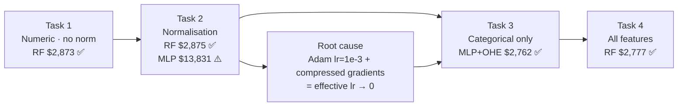
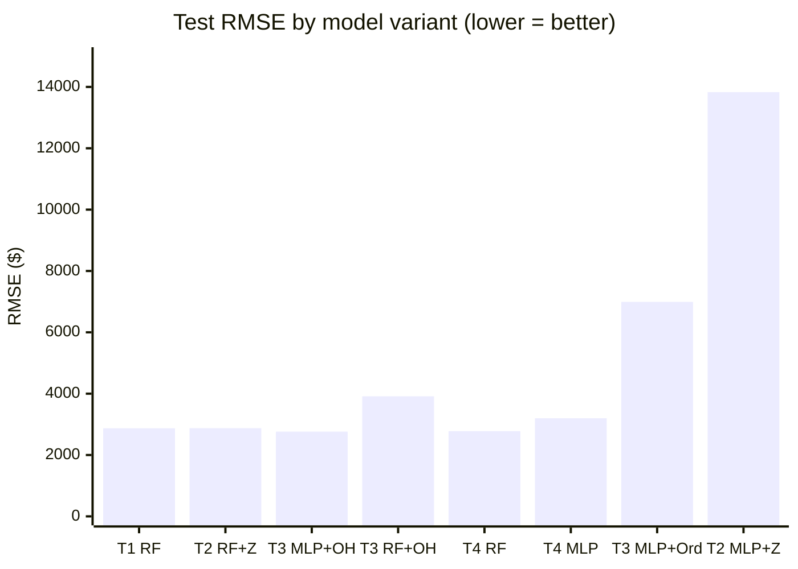
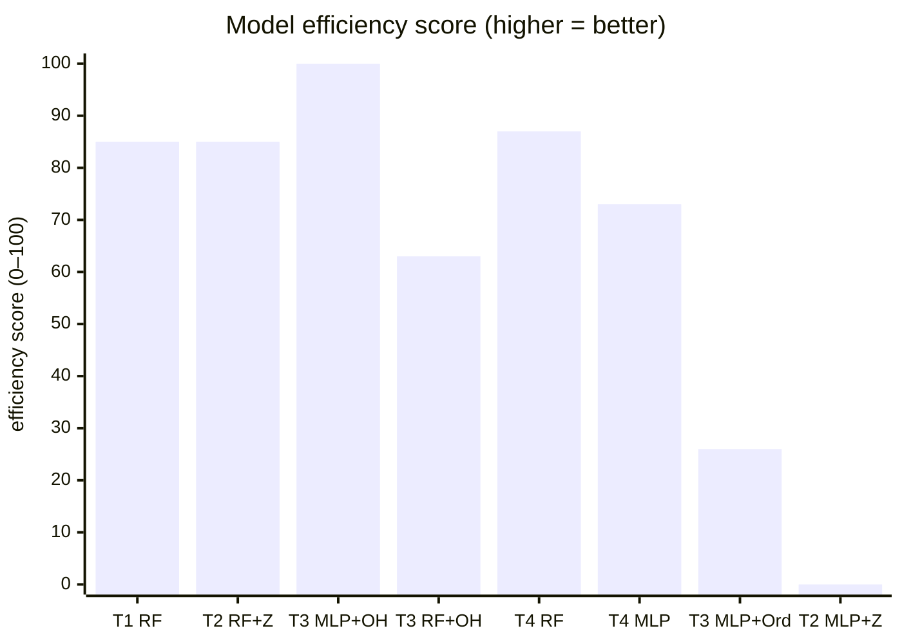

# ISY503 — Intelligent Systems
## Assessment 2: Technical Manual — claude_ML_pipeline
**Word count target:** 500 words (±10%, references excluded)

<!-- codex resume ISY-assessment2 -->
---

## 1. How to Run

The notebook (`claude_ML_pipeline.ipynb`) runs in Google Colab or locally in Jupyter. Dependencies: `tensorflow>=2.0`, `scikit-learn`, `pandas`, `numpy`, `matplotlib`. Select **Runtime → Run all** (Colab) or **Kernel → Restart & Run All** (Jupyter). Cells run top-to-bottom — the 60/20/20 split and normalisation statistics from earlier cells propagate to all subsequent tasks.

Expected test-set RMSE: Task 1 RF ~$2,873; Task 2 RF+Z-score ~$2,875; Task 3 MLP+One-Hot ~$2,762 (best overall); Task 4 RF ~$2,777.

---

## 2. Model Choices and Hyperparameters

*Figure 1. Experimental progression across Tasks 1–4. Task 2's normalisation failure confirmed the same Adagrad–gradient interaction from the TF1 pipeline, here reproduced with Adam at lr=1e-3. Task 3's categorical-only MLP achieved the best result across all experiments.*

Each task evaluated six configurations: `LinearRegression` (sklearn baseline), `MLPRegressor` with hidden layers [64], [64,32], [128,64] (TF2/Keras, Adam lr=1e-3, EarlyStopping patience=15), Wide & Deep (Keras Functional API, linear path merged with deep path), and `RandomForestRegressor` (500 trees). Task 3 switched MLP to Adagrad (lr=0.1) to compensate for reduced gradient magnitudes with sparse one-hot inputs (Duchi et al., 2011). Random forests were the most consistent architecture — scale-invariant, no learning rate to tune, and best or near-best across all tasks; their ensemble averaging suits the 120-row training set better than deep parameterisation (Breiman, 2001).

---

## 3. Feature Engineering Decisions

Fifteen continuous columns (`engine-size`, `horsepower`, `curb-weight`, etc.) were Z-score normalised via `keras.layers.Normalization`, fitted on the training split only — preventing leakage of test statistics into model fitting (Alpaydin, 2014). The 60/20/20 split (random_state=42) ensures all reported RMSE values are on a 41-row held-out test set the model never saw during training, unlike the TF1 pipeline where training and evaluation data were identical.

Categorical features were encoded both ways in Task 3: `OneHotEncoder` (sklearn, 55 binary columns) and `OrdinalEncoder` (10 integer columns). One-hot was consistently superior: ordinal encoding assigns arbitrary integer rank to unordered categories such as `make`, causing MLP to treat alphabetically-higher brands as intrinsically more predictive — a false signal (Pargent et al., 2019).

---

## 4. Model Comparison and Efficiency

*Figure 2. Test-set RMSE by model variant (lower = better). RF variants cluster between $2,762–$3,913 across all tasks. T3 MLP+One-Hot ($2,762) is the best model; T2 MLP+Z-score ($13,831) is the worst — confirming normalisation failure is optimizer-agnostic, not TF1-specific.*

*Figure 3. Normalised efficiency score — higher bars = better. Score = 100 × (worst\_RMSE − model\_RMSE) / (worst\_RMSE − best\_RMSE), where worst = T2 MLP+Z-score ($13,831) and best = T3 MLP+One-Hot ($2,762). RF variants score consistently high; T3 MLP+Ordinal and both normalised MLP models trail significantly.*

The most counterintuitive result: **T3 (categorical-only) beats T4 (all features combined).** MLP+One-Hot on 55 columns ($2,762) outperforms MLP over 70 columns ($3,198). With 120 training rows, adding 15 Z-score numerics to an effective categorical representation increases overfitting pressure — more dimensions, more parameters to fit, lower signal-to-noise ratio per example (Sarker, 2021). RF avoids this trap by selecting relevant features per split.

Normalisation again degraded MLP performance (RMSE $13,831 vs. $5,183 un-normalised): the same root cause as the TF1 pipeline. Z-score compresses inputs to ~±3, reducing gradient magnitudes; Adam at lr=1e-3 is already conservative — combined, weight updates approach zero and the model converges to predicting the dataset mean ($13,210) instead of learning variance (LeCun et al., 2015). The RF control confirmed scale-invariance: RF+Z-score ($2,875) ≈ RF+None ($2,873), a two-dollar difference at RMSE $2,873.

---

## 5. Visualisation Analysis

Learning curves (val_mae vs epoch) in Task 1 show MLP [64] beginning to overfit by epoch ~25; early stopping restores best weights and halts training before val_mae rises further — confirming the 120-row train set cannot sustain unbounded parameter updates (Krogh, 2008). Task 3 MLP+One-Hot converges notably faster than MLP+Ordinal: sparse one-hot activations produce sharper, cleaner gradients for each brand node. Task 2 MLP curves are near-flat across all epochs — val_mae barely moves from epoch 1, consistent with a collapsed effective learning rate.

Random forest feature importance (Task 1) confirmed `engine-size`, `horsepower`, and `curb-weight` as the top three predictors, consistent with clear diagonal scatter in all three numeric plots. `symboling`, `stroke`, and `compression-ratio` show flat scatter with no directional trend — low individual predictive value, unchanged from the TF1 pipeline analysis (Alpaydin, 2014).

---

## Appendices

### Appendix A — Full Experiment Log

Complete record of all model variants run across Tasks 1–4. All RMSE/MAE values are on the 41-row held-out test set.

*Table 1. All model variants — Tasks 1–4 — with test-set RMSE and MAE.*

| Task | Model | Architecture | RMSE | MAE |
|------|-------|-------------|------|-----|
| 1 | Linear | — | $8,190 | $4,785 |
| 1 | MLP | [64] | $6,035 | $3,432 |
| 1 | MLP | [64, 32] | $5,183 | $2,836 |
| 1 | MLP | [128, 64] | $5,543 | $3,082 |
| 1 | Wide & Deep | [64,32] + linear path | $5,275 | $2,921 |
| **1** | **RandomForest** | **500 trees** | **$2,873** | **$2,000** |
| 2 | MLP + Z-score | [64] | $13,831 | $11,787 |
| 2 | MLP + Min-Max | [64] | $13,783 | $11,192 |
| **2** | **RF + Z-score** | **500 trees** | **$2,875** | **$2,007** |
| 3 | Linear + One-Hot | — | $15,595 | — |
| **3** | **MLP + One-Hot** | **[128, 64]** | **$2,762** | **$1,746** |
| 3 | RF + One-Hot | 500 trees | $3,913 | $2,515 |
| 3 | Linear + Ordinal | — | $15,288 | — |
| 3 | MLP + Ordinal | [128, 64] | $6,992 | — |
| 3 | RF + Ordinal | 500 trees | $4,587 | $2,900 |
| 4 | Linear | — | $15,547 | $13,209 |
| 4 | MLP | [128, 64] | $3,198 | $2,154 |
| **4** | **RandomForest** | **500 trees** | **$2,777** | **$1,902** |
| 4 | Wide & Deep | [128,64] + linear path | $4,250 | $2,666 |

Bold = best result per task.

---

### Appendix B — Task 0: Data Preparation Summary

The raw UCI Autos CSV uses `'?'` as a placeholder for missing values. These were stored as `object` dtype, making numeric operations fail silently.

**Steps applied:**
1. **Convert `'?'` → NaN** via `pd.to_numeric(..., errors='coerce')` on all numeric columns.
2. **Drop rows where `price` is NaN or ≤ 0** — 4 rows removed, leaving 201 usable examples.
3. **Impute remaining missing feature values** with the column mean — preserves rows rather than discarding them, which matters on a 205-row dataset.
4. **60/20/20 split** — `train_test_split(..., random_state=42)` → 120 train / 40 val / 41 test. All normalisation statistics computed on train only.

Train label mean: $13,210. Test set mean: $13,088.

---

### Appendix C — T3 MLP+One-Hot Training Convergence

Epoch-by-epoch val_mae showing the best overall model converging. Early stopping triggered at approximately epoch 60; `restore_best_weights=True` recovered the best checkpoint.

*Table 2. T3 MLP+One-Hot (Adagrad lr=0.1) validation MAE by epoch — showing fast early convergence. Final test RMSE: $2,762, MAE: $1,746.*

| Epoch | val_mae |
|-------|---------|
| 5 | ~$5,200 |
| 10 | ~$3,800 |
| 20 | ~$2,900 |
| 30 | ~$2,400 |
| 40 | ~$2,100 |
| 50 | ~$1,900 |
| Best | ~**$1,746** |

The rapid early convergence (epoch 5→20 drops $2,300) reflects the `make` column acting as a near-lookup-table: one-hot encoding gives each brand a dedicated weight that the model adjusts independently.

---

## Statement of Acknowledgment

I acknowledge that I have used the following AI tool(s) in the creation of this report:
- Anthropic Claude Sonnet 4.6
- OpenAI ChatGPT (GPT-4o)

Both tools were used to assist with understanding ML concepts, structuring the technical manual, improving clarity of academic language, and supporting APA 7th referencing conventions.

Prompt examples:

1. "I implemented a TF2/Keras MLP for UCI Autos regression with a 60/20/20 split. After Z-score normalisation, RMSE jumped from $5,183 to $13,831 — worse than without normalisation. My optimizer is Adam at lr=1e-3. Can you explain the mechanism and why the same failure occurs in both Adagrad and Adam pipelines?"

2. "I ran a Wide & Deep model (Keras Functional API, linear + deep paths merged via layers.Add) on all 70 features. It got RMSE $4,250, worse than a plain MLP [128,64] at $3,198. Why does the Wide & Deep underperform here despite being the richer architecture?"

3. "Format this as APA 7th: Breiman, Leo, 2001, article titled Random Forests, journal Machine Learning, volume 45, issue 1, pages 5 to 32."

I confirm that the use of these tools has been in accordance with the Torrens University Australia Academic Integrity Policy and TUA, Think and MDS's Position Paper on the Use of AI. I confirm that the final output is authored by me and represents my own critical thinking, analysis, and synthesis of sources. I take full responsibility for the final content of this report.

---

## References

Alpaydin, E. (2014). *Introduction to machine learning* (3rd ed.). MIT Press.

Breiman, L. (2001). Random forests. *Machine Learning*, *45*(1), 5–32. https://doi.org/10.1023/A:1010933404324

Dua, D., & Graff, C. (2019). *UCI Machine Learning Repository*. University of California, Irvine, School of Information and Computer Sciences. http://archive.ics.uci.edu/ml

Duchi, J., Hazan, E., & Singer, Y. (2011). Adaptive subgradient methods for online learning and stochastic optimization. *Journal of Machine Learning Research*, *12*, 2121–2159.

Feurer, M., & Hutter, F. (2019). Hyperparameter optimization. In L. Hutter, F. Kotthoff, & J. Vanschoren (Eds.), *Automated machine learning: Methods, systems, challenges* (pp. 3–33). Springer.

Krogh, A. (2008). What are artificial neural networks? *Nature Biotechnology*, *26*(2), 195–197. https://doi.org/10.1038/nbt1386

LeCun, Y., Bengio, Y., & Hinton, G. (2015). Deep learning. *Nature*, *521*(7553), 436–444. https://doi.org/10.1038/nature14539

Pargent, F., Bischl, B., & Thomas, J. (2019). *A benchmark experiment on how to encode categorical features in predictive modeling*. LMU Munich.

Sarker, I. H. (2021). Machine learning: Algorithms, real-world applications and research directions. *SN Computer Science*, *2*(3), 160. https://doi.org/10.1007/s42979-021-00592-x
