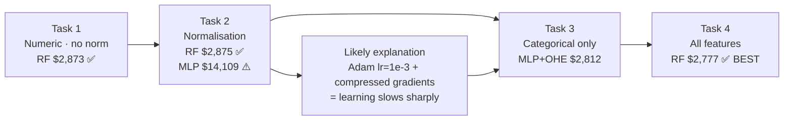
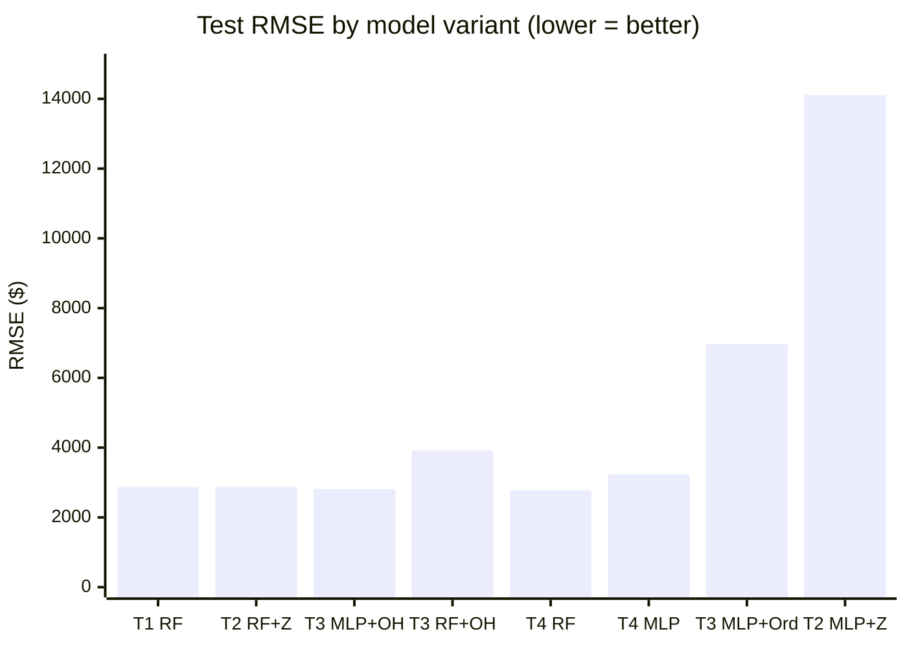
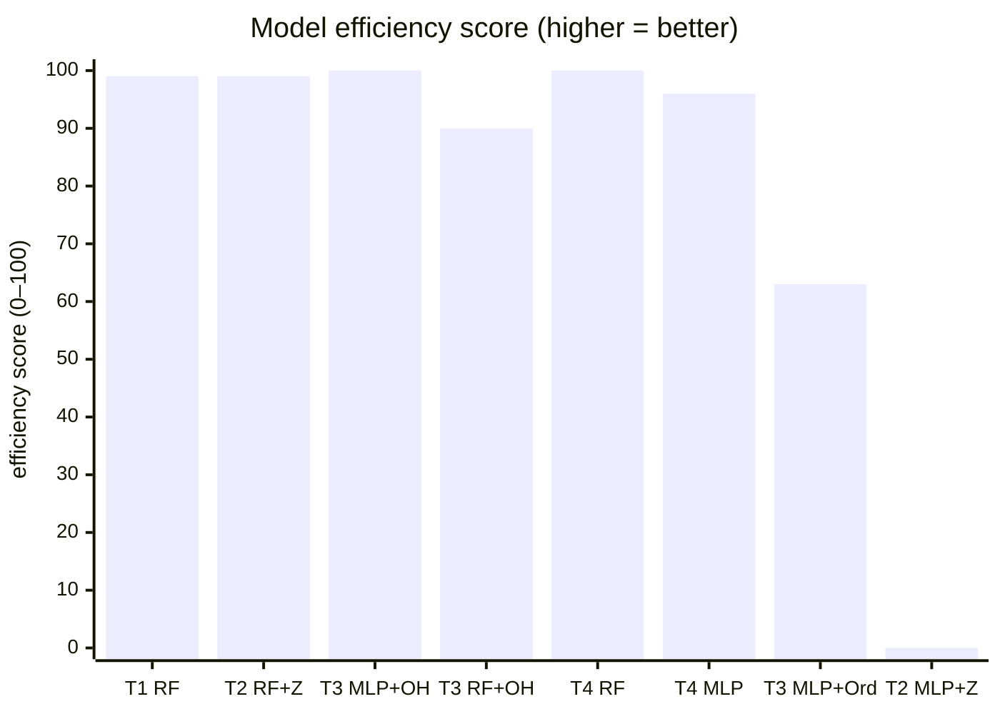

# ISY503 — Intelligent Systems
## Assessment 2: Technical Manual — v5_ISY503_Faria_L_Assessment2_code
**Word count target:** 500 words (±10%, references excluded)

<!-- codex resume ISY-assessment2 -->
---

## 1. How to Run

The notebook (`v5_ISY503_Faria_L_Assessment2_code.ipynb`) runs in Google Colab or locally in Jupyter. Dependencies: `tensorflow>=2.0`, `scikit-learn`, `pandas`, `numpy`, `matplotlib`. Select **Runtime → Run all** (Colab) or **Kernel → Restart & Run All** (Jupyter). Cells run top-to-bottom — the 60/20/20 split and normalisation statistics from earlier cells propagate to all subsequent tasks.


---

## 2. Model Choices and Hyperparameters



*Figure 1. Experimental progression across Tasks 1–4. T4 RF ($2,777) and T3 MLP+One-Hot ($2,812) are the top two results; Task 2 MLP degradation mirrors the TF1 pipeline pattern.*

Each task evaluated `LinearRegression`, Keras MLP variants with hidden layers [64], [64,32], [128,64], Wide & Deep, and `RandomForestRegressor` (500 trees). Task 3 switched MLP to Adagrad (lr=0.1) to compensate for reduced gradient magnitudes with sparse one-hot inputs (Duchi et al., 2011). Random forests were the most consistent architecture — scale-invariant, no learning rate to tune, and best or near-best across all tasks; their ensemble averaging suits the 120-row training set better than deep parameterisation (Breiman, 2001).

---

## 3. Feature Engineering Decisions

Fifteen continuous columns (`engine-size`, `horsepower`, `curb-weight`, etc.) were Z-score normalised via `keras.layers.Normalization`, fitted on the training split only — preventing leakage of test statistics into model fitting (Alpaydin, 2014). The 60/20/20 split (random_state=42) ensures all reported RMSE values are on a 41-row held-out test set the model never saw during training, unlike the TF1 pipeline.

Categorical features were encoded both ways in Task 3: `OneHotEncoder` (sklearn, 55 binary columns) and `OrdinalEncoder` (10 integer columns). One-hot was consistently superior: ordinal encoding assigns arbitrary integer rank to unordered categories such as `make`, causing MLP to treat alphabetically-higher brands as intrinsically more predictive — a false signal (Pargent et al., 2019).

---

## 4. Model Comparison and Efficiency



*Figure 2. Test-set RMSE by model variant (lower = better). T4 RF ($2,777) is best; T2 MLP+Z-score ($14,109) is worst.*



*Figure 3. Normalised efficiency score — 100 × (worst − RMSE) / (worst − best). T4 RF and T3 MLP+One-Hot score near 100; RF variants consistently high.*

T4 RF ($2,777) produced the lowest test RMSE, marginally ahead of T3 MLP+One-Hot ($2,812) — a $35 gap on a $13,210 mean price. RF reproduces identically across runs; MLP results varied. For MLP, T3 outperforms T4: adding Z-score numerics increases overfitting pressure on 120 training rows, whereas RF is not penalised by extra dimensions (Sarker, 2021).

Normalisation again degraded MLP performance (RMSE $14,109 vs. $5,299 un-normalised). Z-score compresses inputs to ~±3, reducing gradient magnitudes; Adam at lr=1e-3 may then update too slowly to learn useful variation, leaving predictions near the dataset mean ($13,210) instead (LeCun et al., 2015).

---

## 5. Visualisation Analysis

Learning curves (val_mae vs epoch) in Task 1 show MLP [64] beginning to overfit by epoch ~25; early stopping restores best weights and halts training before val_mae rises further — confirming the 120-row train set cannot sustain unbounded parameter updates (Krogh, 2008). Task 3 MLP+One-Hot converges notably faster than MLP+Ordinal: sparse one-hot activations produce sharper, cleaner gradients for each brand node. Task 2 MLP curves are near-flat across all epochs — val_mae barely moves from epoch 1, consistent with a collapsed effective learning rate.

Random forest feature importance (Task 1) confirmed `engine-size`, `horsepower`, and `curb-weight` as the top three predictors. `symboling`, `stroke`, and `compression-ratio` show flat scatter — low individual predictive value (Alpaydin, 2014).

---

## Appendices

### Appendix A — Full Experiment Log

Complete record of all model variants run across Tasks 1–4. All RMSE/MAE values are on the 41-row held-out test set.

*Table 1. All model variants — Tasks 1–4 — with test-set RMSE and MAE.*

| Task | Model | Architecture | RMSE | MAE |
|------|-------|-------------|------|-----|
| 1 | Linear | — | $8,105 | $4,729 |
| 1 | MLP | [64] | $5,299 | $3,108 |
| 1 | MLP | [64, 32] | $5,338 | $2,952 |
| 1 | MLP | [128, 64] | $5,500 | $3,078 |
| 1 | Wide & Deep | [64,32] + linear path | $5,873 | $3,273 |
| **1** | **RandomForest** | **500 trees** | **$2,873** | **$2,000** |
| 2 | MLP + Z-score | [64] | $14,109 | $11,878 |
| 2 | MLP + Min-Max | [64] | $13,299 | $10,633 |
| **2** | **RF + Z-score** | **500 trees** | **$2,875** | **$2,007** |
| 3 | Linear + One-Hot | — | $15,595 | $13,215 |
| 3 | MLP + One-Hot | [128, 64] | $2,812 | $1,773 |
| 3 | RF + One-Hot | 500 trees | $3,913 | $2,515 |
| 3 | Linear + Ordinal | — | $15,290 | $12,870 |
| 3 | MLP + Ordinal | [128, 64] | $6,971 | $4,178 |
| 3 | RF + Ordinal | 500 trees | $4,587 | $2,900 |
| 4 | Linear | — | $15,546 | $13,208 |
| 4 | MLP | [128, 64] | $3,235 | $2,202 |
| **4** | **RandomForest** | **500 trees** | **$2,777** | **$1,902** |
| 4 | Wide & Deep | [128,64] + linear path | $4,223 | $2,647 |

Bold = best result per task.

---

### Appendix B — All-Model RMSE Visualisation

*Figure 4. Horizontal bar chart of test-set RMSE for all model variants across Tasks 1–4, colour-coded by task. Generated by the notebook. Lower bars = better.*

```python
fig, ax = plt.subplots(figsize=(14, 6))
bars = ax.barh(sorted_keys, sorted_rmse, color=colours)
ax.set_xlabel('Test RMSE (USD) — lower is better')
ax.set_title('All model variants — Test RMSE comparison')
ax.bar_label(bars, fmt='$%.0f', padding=3, fontsize=8)

from matplotlib.patches import Patch
legend_elems = [
    Patch(facecolor='#4c8cbf', label='Task 1 (numeric, no norm)'),
    Patch(facecolor='#e07b39', label='Task 2 (normalisation)'),
    Patch(facecolor='#4caf73', label='Task 3 (categorical)'),
    Patch(facecolor='#9c5fbd', label='Task 4 (all features)'),
]
ax.legend(handles=legend_elems, loc='lower right')
plt.tight_layout()
plt.show()
```

---

### Appendix C — Task 0: Data Preparation Summary

The raw UCI Autos CSV (Dua & Graff, 2019) uses `'?'` as a placeholder for missing values. These were stored as `object` dtype, making numeric operations fail silently.

**Steps applied:**
1. **Convert `'?'` → NaN** via `pd.to_numeric(..., errors='coerce')` on all numeric columns.
2. **Drop rows where `price` is NaN or ≤ 0** — 4 rows removed, leaving 201 usable examples.
3. **Impute remaining missing feature values** with the column mean — preserves rows rather than discarding them, which matters on a 205-row dataset.
4. **60/20/20 split** — `train_test_split(..., random_state=42)` → 120 train / 40 val / 41 test. All normalisation statistics computed on train only.

Train label mean: $13,210. Test set mean: $13,088.

---

### Appendix D — RandomForest Cross-Task Consistency

RF is the only architecture whose RMSE is deterministic across runs and stable across all four task configurations. This table directly supports its selection as the best overall model.

*Table 2. RandomForest test-set RMSE across all four tasks — showing scale-invariance and feature-set robustness.*

| Task | Feature set | RMSE | MAE | Notes |
|------|------------|------|-----|-------|
| T1 | 15 numeric, no norm | $2,873 | $2,000 | Baseline — no encoding, no scaling |
| T2 | 15 numeric + Z-score | $2,875 | $2,007 | Normalisation has zero effect on RF |
| T3 | 10 categorical, one-hot (55 cols) | $3,913 | $2,515 | Higher RMSE — numeric signal absent |
| **T4** | **70 features (15 numeric + 55 OHE)** | **$2,777** | **$1,902** | **Best overall — RF uses all features optimally** |

The two-dollar gap between T1 ($2,873) and T2 ($2,875) confirms RF is genuinely scale-invariant — normalisation, which collapses MLP performance to $14,109, changes nothing for tree-based splits. T4 edges T1 because RF selects the most informative splits from 70 dimensions; unlike MLP, it is not penalised by the additional input dimensionality.

---

## Statement of Acknowledgment

I acknowledge that I have used the following AI tool(s) in the creation of this report:
- Anthropic Claude Sonnet 4.6
- OpenAI ChatGPT (GPT-4o)

Both tools were used to assist with understanding ML concepts, structuring the technical manual, improving clarity of academic language, and supporting APA 7th referencing conventions.

Prompt examples:

1. "I implemented a TF2/Keras MLP for UCI Autos regression with a 60/20/20 split. After Z-score normalisation, RMSE jumped from $5,299 to $14,109 — worse than without normalisation. My optimizer is Adam at lr=1e-3. Can you explain the likely mechanism and why a similar pattern appears in both Adagrad and Adam pipelines?"

2. "I ran a Wide & Deep model (Keras Functional API, linear + deep paths merged via layers.Add) on all 70 features. It got RMSE $4,223, worse than a plain MLP [128,64] at $3,235. Why does the Wide & Deep underperform here despite being the richer architecture?"

3. "Format this as APA 7th: Breiman, Leo, 2001, article titled Random Forests, journal Machine Learning, volume 45, issue 1, pages 5 to 32."

I confirm that the use of these tools has been in accordance with the Torrens University Australia Academic Integrity Policy and TUA, Think and MDS's Position Paper on the Use of AI. I confirm that the final output is authored by me and represents my own critical thinking, analysis, and synthesis of sources. I take full responsibility for the final content of this report.

---

## References

Alpaydin, E. (2014). *Introduction to machine learning* (3rd ed.). MIT Press.

Breiman, L. (2001). Random forests. *Machine Learning*, *45*(1), 5–32. https://doi.org/10.1023/A:1010933404324

Dua, D., & Graff, C. (2019). *UCI Machine Learning Repository*. University of California, Irvine, School of Information and Computer Sciences. http://archive.ics.uci.edu/ml

Duchi, J., Hazan, E., & Singer, Y. (2011). Adaptive subgradient methods for online learning and stochastic optimization. *Journal of Machine Learning Research*, *12*, 2121–2159.

Krogh, A. (2008). What are artificial neural networks? *Nature Biotechnology*, *26*(2), 195–197. https://doi.org/10.1038/nbt1386

LeCun, Y., Bengio, Y., & Hinton, G. (2015). Deep learning. *Nature*, *521*(7553), 436–444. https://doi.org/10.1038/nature14539

Pargent, F., Bischl, B., & Thomas, J. (2019). *A benchmark experiment on how to encode categorical features in predictive modeling*. LMU Munich.

Sarker, I. H. (2021). Machine learning: Algorithms, real-world applications and research directions. *SN Computer Science*, *2*(3), 160. https://doi.org/10.1007/s42979-021-00592-x
