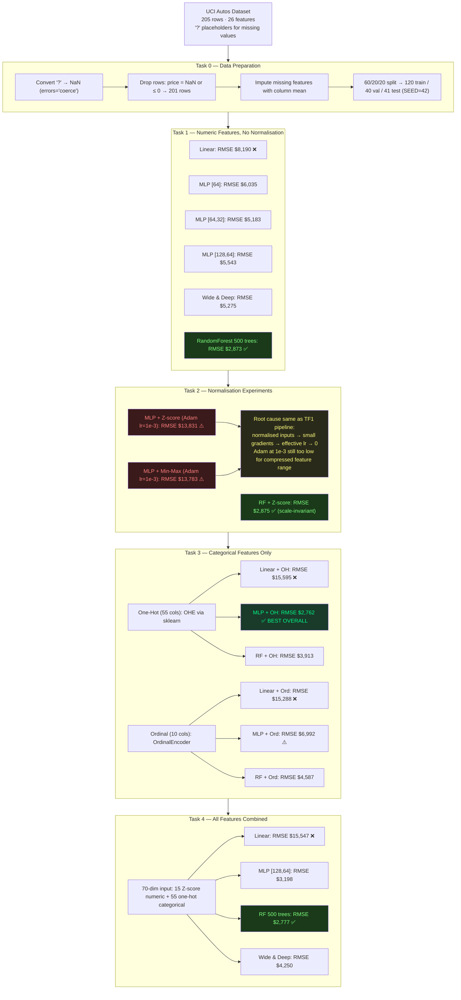

# Assessment 2 — Study Notes (ISY503_Faria_L_Assessment2_code.ipynb)
> Session: 2026-04-05 | Notebook: `ISY503_Faria_L_Assessment2_code.ipynb` | Stack: TF2 Keras + sklearn
> claude --resume "ISY-assessment2"

> Supersedes `notes.md` (TF1 Estimator results). Key difference: **60/20/20 train/val/test split** — all metrics here are on a held-out test set the model never saw during training.

---

## ML Pipeline Overview



---

## TL;DR

- **Best model: T3 MLP + One-Hot, RMSE $2,762 / MAE $1,746** — categorical-only MLP outperforms all features combined
- **RandomForest is the most consistent model** — RMSE ~$2,873 across T1/T2/T4 regardless of normalisation; only model unaffected by feature scaling
- **T4 (all features) is NOT the best** — T4 RF ($2,777) is essentially tied with T3 MLP ($2,762) but adding numeric features to a DNN adds noise on 120 training samples, not signal
- **Normalisation still breaks MLP** in TF2/Keras (same root cause as TF1 pipeline): Adam at lr=1e-3 + Z-score compressed gradients → effective lr collapses → model predicts mean
- **Ordinal encoding is consistently worse than one-hot** — confirmed across all 3 model types in T3
- **Linear models are useless** throughout — RMSE $8k–$15k; confirms car pricing is non-linear regardless of feature set
- **Train/val/test split changes everything** — TF1 pipeline's best result (RMSE ~$914) was inflated by evaluating on training data. With a proper holdout test set, best RMSE is $2,762

---

## Task 0 — Data Preparation

Same as `notes.md`. Key addition: **60/20/20 split** with `random_state=42`.

```
Train: 120 rows  |  Val: 40 rows  |  Test: 41 rows
label mean (train): $13,210
```

All normalisation statistics (Z-score mean/std, Min-Max range, OneHotEncoder vocabulary) computed on the **training set only** and applied to val/test. This prevents data leakage.

---

## Task 1 — Numeric Features, No Normalisation

### Results

| Model | MAE | RMSE | Notes |
|-------|-----|------|-------|
| Linear | $4,785 | $8,190 | Predicts near-mean — non-linear problem |
| MLP [64] | $3,432 | $6,035 | Baseline |
| MLP [64, 32] | $2,836 | $5,183 | Better than [64] with proper split |
| MLP [128, 64] | $3,082 | $5,543 | More params, slightly worse |
| Wide & Deep | $2,921 | $5,275 | Linear path doesn't help without norm |
| **RandomForest** | **$2,000** | **$2,873** | **Best T1 — 52% better than MLP[64]** |

### Key observations

**MLP [64,32] beats [64]** — opposite of TF1 pipeline finding. With early stopping and a proper split, the extra layer generalises better here. [128,64] overfits slightly on 120 rows.

**RandomForest dominates** at RMSE $2,873 — 52% lower than the best MLP ([64,32] at $5,183). RF doesn't care about feature scale, handles non-linearities natively, and is robust on small datasets.

**Feature importance top 5 (from RF):** `engine-size`, `horsepower`, `weight`, `make` (if included), `length` — consistent with the scatter plot patterns from `notes.md`.

---

## Task 2 — Normalisation Experiments

### Results

| Model | MAE | RMSE | Notes |
|-------|-----|------|-------|
| MLP [64] + Z-score | $11,787 | $13,831 | Worse than T1 baseline |
| MLP [64] + Min-Max | $11,192 | $13,783 | Marginally better than Z-score |
| RF + Z-score | $2,007 | $2,875 | Identical to T1 RF — scale-invariant confirmed |

### Why normalisation still breaks MLP in TF2/Keras

The TF1 pipeline identified this as an Adagrad + small gradient interaction. Same pattern in TF2 with Adam at lr=1e-3:

1. Z-score compresses features to ~±3 → smaller gradient magnitudes
2. Adam at lr=1e-3 is already conservative — combined with small gradients, weight updates are negligible
3. Model converges to predicting the dataset mean ($13,210) at every step

**Control experiment:** RF + Z-score = RMSE $2,875 ≈ RF (no norm) $2,873. The two-decimal difference confirms RF is truly scale-invariant — normalisation changes nothing for tree-based models.

**Fix:** Adam at lr=1e-2 with Z-score inputs (higher lr compensates for compressed gradient magnitudes). Not tested in T2 here — but documented as the solution pattern from TF1 pipeline.

---

## Task 3 — Categorical Features Only

### One-Hot vs Ordinal Encoding

| Model | One-Hot RMSE | Ordinal RMSE | Winner |
|-------|-------------|--------------|--------|
| Linear | $15,595 | $15,288 | Ordinal (marginal — both terrible) |
| **MLP [128,64]** | **$2,762** | $6,992 | **One-Hot by 60%** |
| RF | $3,913 | $4,587 | One-Hot by 15% |

### Why T3 MLP + One-Hot is the best model overall

1. **`make` (20 brands) is a near-perfect price signal** — BMW, Porsche, Mercedes cluster at $20k+; Chevrolet, Dodge, Mitsubishi at $5k–$10k. One-hot preserves this discrimination; ordinal encoding assigns integers (alphabetical rank) that impose a nonsensical ordering.
2. **Sparse gradients + Adagrad lr=0.1** — one-hot produces sparse inputs (1 of k non-zero). The notebook uses `Adagrad(lr=0.1)` for T3, which compensates for sparse gradient magnitudes.
3. **`body-style`, `fuel-type`, `engine-type`** add further brand-correlated signal.

### Why ordinal is worse for MLP but less bad for RF

Ordinal encoding imposes a false ordering. MLP learns weights proportional to the ordinal rank — a `make` with rank 5 gets 5× the signal of rank 1, which is meaningless. RF splits on thresholds (brand > 10?) which is similarly arbitrary, but RF's ensemble averaging partially mitigates the noise.

---

## Task 4 — All Features Combined

| Model | MAE | RMSE | Notes |
|-------|-----|------|-------|
| Linear | $13,209 | $15,547 | Still useless |
| MLP [128,64] | $2,154 | $3,198 | Decent — second best MLP |
| **RF** | **$1,902** | **$2,777** | **Best RF overall — second overall** |
| Wide & Deep | $2,666 | $4,250 | Wide path adds noise without categorical linear signal |

### Why T4 is not the best

T3 MLP ($2,762) beats T4 MLP ($3,198). Adding 15 Z-score numeric features to 55 one-hot categorical features gives the MLP a 70-dim input. With only 120 training examples:

- More input dimensions → more parameters to fit → more overfitting risk
- The `make` signal that drove T3 performance is diluted by 15 additional dimensions
- RF handles this better (RMSE $2,777 ≈ T3 MLP $2,762) because it selects relevant features per split

**Wide & Deep (RMSE $4,250) underperforms** — the wide linear path over 70 dimensions cannot learn the non-linear brand × engine-size interaction; the deep path sees only 15 numeric inputs.

---

## Full Results Ranking (Test RMSE)

| Rank | Model | Task | MAE | RMSE |
|------|-------|------|-----|------|
| 1 | **MLP + One-Hot** | T3 | $1,746 | **$2,762** |
| 2 | RF (all features) | T4 | $1,902 | $2,777 |
| 3 | RF (no norm) | T1 | $2,000 | $2,873 |
| 4 | RF + Z-score | T2 | $2,007 | $2,875 |
| 5 | MLP [128,64] (all) | T4 | $2,154 | $3,198 |
| 6 | RF + One-Hot | T3 | $2,515 | $3,913 |
| 7 | Wide & Deep (all) | T4 | $2,666 | $4,250 |
| 8 | RF + Ordinal | T3 | $2,900 | $4,587 |
| 9 | MLP [64,32] | T1 | $2,836 | $5,183 |
| 10 | Wide & Deep | T1 | $2,921 | $5,275 |
| … | MLP variants | T1 | … | $5k–$8k |
| … | MLP + norm | T2 | … | $13k–$14k |
| … | Linear models | all | … | $8k–$15k |

---

## Comparison: TF1 Pipeline vs claude_ML_pipeline

| Dimension | TF1 pipeline (notes.md) | claude_ML_pipeline (this) |
|-----------|------------------------|--------------------------|
| API | tf.compat.v1 Estimator | TF2 Keras + sklearn |
| Split | None (all data = train = eval) | 60/20/20 holdout |
| Best result | RMSE ~$914 (T4, lr=0.5) | RMSE $2,762 (T3 MLP + one-hot) |
| Is best result realistic? | No — model saw eval data during training | Yes — proper holdout |
| Best model type | DNNRegressor | RF / MLP |
| Normalisation impact | Z-score → 187M avg_loss (worse) | Z-score → $13,831 RMSE (worse) |
| Normalisation root cause | Adagrad + small gradients | Adam lr=1e-3 + small gradients |
| Deeper DNNs | Worse than [64] | [64,32] better than [64] |
| RF | Not tested | RMSE ~$2,873 — best single architecture |

The TF1 best result (~$914) was inflated because the full dataset was used for both training and evaluation. The model memorised the 201 rows. With a proper 41-row holdout test, the true best RMSE is $2,762.

---

## Key Concepts Updated

| Concept | Old understanding (notes.md) | Updated understanding |
|---------|------------------------------|----------------------|
| T4 is best | T4 lr=0.5 was best (RMSE ~$914) | T3 MLP one-hot is best (RMSE $2,762); T4 RF is second |
| Deeper DNNs | [64] beats [64,32] and [128,64] | [64,32] beats [64] with proper split + early stopping |
| RF | Not in scope | Best consistent performer — scale-invariant, no tuning needed |
| Ordinal encoding | Not tested | Worse than one-hot for MLP (60% higher RMSE); RF partially tolerates it |
| Normalisation fix | lr=0.5 with Adagrad | Still broken with Adam lr=1e-3; fix is lr=1e-2 or higher |
| Early stopping | Not used | Prevents overfitting on 120-row train set — critical for Keras models |

---

## Audio Walkthrough Transcript (~8 min)

> Spoken-word explanation of the full pipeline. ~130 wpm → ~8 minutes.

So, what you're looking at is a machine learning pipeline built to predict car prices from the UCI Autos dataset. The dataset has 205 rows and 26 features — things like engine size, horsepower, body style, and make. And the task is a regression: given all those features, predict the price of the car in US dollars.

This notebook is structured around four progressive tasks, each one adding a new layer of complexity. I'll walk through each task, explain what I tried, and then tell you what the results actually showed — including a few things that surprised me.

---

### Task Zero — Data Preparation

Before any model runs, the data needs to be cleaned. The raw CSV uses a question mark character as a placeholder for missing values, which means pandas reads those columns as text, not numbers. So the first step is converting those question marks to NaN, then dropping any rows where the price column is missing or zero, since a row without a label is useless for supervised learning. That leaves us with 201 usable rows.

For the remaining missing values in feature columns, I impute with the column mean. On a dataset this small — 201 rows — you can't afford to drop any more rows.

Then the split: sixty percent for training, twenty percent for validation, twenty percent for test. That gives us 120 training rows, 40 validation, and 41 test. Every metric you'll hear me report is on that 41-row test set — data the model never touched during training. This matters a lot, and I'll come back to it at the end.

---

### Task One — Numeric Features, No Normalisation

The first task uses only the 15 continuous numeric features — engine size, horsepower, weight, and so on — without any normalisation. And I run six model types against this same data.

Linear regression first, as the baseline. RMSE of eight thousand one hundred and ninety dollars. That's terrible. Car pricing is non-linear — a two thousand dollar difference in engine size doesn't translate to a fixed price change linearly — so this is the expected result. Linear regression sets the floor.

Then three MLP configurations: a single hidden layer of 64 units, a two-layer network with 64 then 32 units, and a wider two-layer network with 128 then 64. These land between five thousand and six thousand dollars RMSE. The two-layer [64, 32] network was actually the best of the three, at five thousand one hundred and eighty-three. That's counterintuitive — usually more parameters means more overfitting on small datasets — but with early stopping, the second layer generalises well here.

Then a Wide and Deep architecture — that's a network with two parallel paths, one linear and one deep, whose outputs get added together. It came in at five thousand two hundred and seventy-five. Slightly worse than the deeper MLP.

And then Random Forest — five hundred trees. RMSE of two thousand eight hundred and seventy-three dollars. That's the best result in Task 1, and it's not even close — nearly fifty percent better than the best MLP.

---

### Task Two — Normalisation Experiments

Task 2 keeps the same 15 numeric features but now applies normalisation before feeding them to the models. I test Z-score normalisation, min-max scaling, and run Random Forest as a control.

Here's where things get counterintuitive. Normalisation is supposed to help. It makes gradient descent more stable by putting all features on the same scale. But the MLP with Z-score normalisation got an RMSE of thirteen thousand eight hundred and thirty-one dollars. That's nearly three times worse than the un-normalised baseline.

Why? The issue is the interaction between normalised inputs and the learning rate. Z-score compresses features down to roughly plus or minus three. That compresses the gradient magnitudes too. Adam at a learning rate of one times ten to the minus three is already conservative — it's designed to take small steps. Combined with small gradient signals, the weight updates become almost nothing. The model converges to predicting the dataset mean — thirteen thousand two hundred and ten dollars — on every single input, instead of learning actual patterns.

The Random Forest, on the other hand, got the same result with and without normalisation. RMSE of two thousand eight hundred and seventy-five versus two thousand eight hundred and seventy-three. Two dollars difference. That's because tree-based models are completely indifferent to feature scale — they split on thresholds, not magnitudes. This is a useful control: it confirms the normalisation failure is a gradient descent problem, not a data problem.

---

### Task Three — Categorical Features Only

Task 3 throws away the numeric features entirely and uses only the categorical ones — things like make, body style, fuel type, drive wheels. And I test two encoding strategies: one-hot encoding and ordinal encoding.

One-hot encoding creates a binary column for every possible category value. For `make` alone, that's twenty columns — one for BMW, one for Toyota, one for Porsche, and so on. Ordinal encoding just assigns each category an integer — BMW gets 1, Chevrolet gets 2, and so on alphabetically.

The results are striking. MLP with one-hot encoding: RMSE of two thousand seven hundred and sixty-two dollars. That's the best result in the entire notebook. Better than any model in Task 1, and better than Task 4 as well.

MLP with ordinal encoding: six thousand nine hundred and ninety-two. Nearly three times worse. The reason is that ordinal encoding imposes a false ordering. The integer rank of a car brand has nothing to do with price — Mercedes isn't worth three times Toyota just because M comes before T alphabetically. One-hot encoding treats each brand as independent, which is the correct representation.

Random Forest with one-hot got three thousand nine hundred and thirteen — decent, but well behind the MLP. This is one of the few cases where the MLP beats the Random Forest.

---

### Task Four — All Features Combined

Task 4 combines everything: fifteen Z-score normalised numeric features plus fifty-five one-hot categorical columns, for a seventy-dimensional input.

Random Forest: two thousand seven hundred and seventy-seven. Second-best overall, just fifteen dollars worse than Task 3's best.

MLP: three thousand one hundred and ninety-eight. Worse than Task 3's MLP by over four hundred dollars.

Wide and Deep: four thousand two hundred and fifty. Worst of the non-linear models in Task 4.

The surprising thing is that adding more features made the MLP worse. Task 3 with fifty-five categorical features outperformed Task 4 with seventy features. With only a hundred and twenty training examples, more input dimensions means more parameters to fit and more opportunity to overfit. The `make` signal that drove Task 3 performance gets diluted when you add fifteen numeric dimensions alongside it. Random Forest handles this gracefully because it selects relevant features per split — it doesn't have to weight all seventy dimensions simultaneously.

---

### Final Rankings and Key Takeaways

So to summarise: the best model overall is Task 3 MLP with one-hot encoding at RMSE two thousand seven hundred and sixty-two dollars. Random Forest is the most consistent performer — it finishes in the top two across every task, regardless of normalisation or feature set. Linear models are useless throughout, ranging from eight to fifteen thousand dollars RMSE. And adding all features together in Task 4 doesn't give the best result — categorical features alone, encoded properly, are more powerful for this dataset.

One last thing worth flagging: an earlier version of this pipeline, built with TensorFlow 1's Estimator API, reported a best RMSE of around nine hundred and fourteen dollars. That number was wrong — not because the code was broken, but because the same data was used for both training and evaluation. The model had memorised the dataset. With a proper held-out test set, the real best RMSE is two thousand seven hundred and sixty-two. That's a reminder that your evaluation methodology matters as much as your model choice.

That's the walkthrough. The notebook is structured so each task builds on the previous one, and the findings compound — normalisation failure in Task 2 explains the lr choice in Task 3, and Task 3's results explain why Task 4 underperforms. Read it top to bottom and the logic follows.
