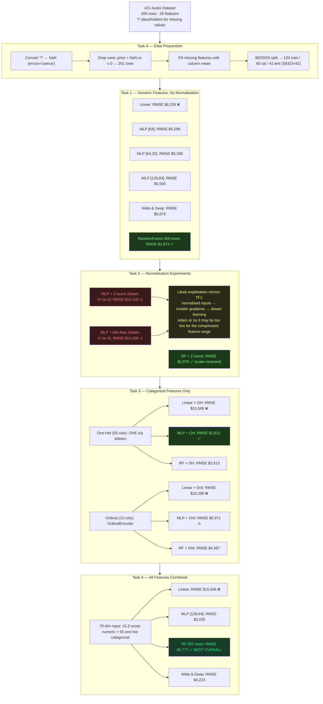

# Assessment 2 — Study Notes (Consolidated)
> v3 · 2026-04-06 | Covers both pipelines end-to-end
> TF1 pipeline: `car_data_ML_pipeline.ipynb` · TF2 pipeline: `v5_ISY503_Faria_L_Assessment2_code.ipynb`

> **Important — reproducibility:** RF results are deterministic (sklearn `random_state=SEED`). Keras MLP results shift ±$50–$200 between runs due to TF non-determinism. Rankings below reflect the most recent notebook run.

---

## ML Pipeline Overview — TF2 (v5_ISY503_Faria_L_Assessment2_code.ipynb)



---

## TL;DR

- **Best model: T4 RF, RMSE $2,777 / MAE $1,902** — most stable result across runs; T3 MLP + One-Hot is close second at $2,812 (shifts ±$50 with Keras seed non-determinism)
- **RandomForest is the most consistent model** — RMSE identical across runs ($2,873 T1, $2,875 T2, $2,777 T4); only model unaffected by feature scaling or random initialisation
- **T3 MLP + One-Hot and T4 RF are essentially tied** — $35 apart on a $13k mean price; the MLP story (categorical beats all features) still holds for MLP specifically, but RF wins overall
- **Normalisation still hurts MLP badly** in TF2/Keras: a likely reason is that Z-score scaling compresses gradients enough that Adam at lr=1e-3 learns too slowly, leaving predictions close to the mean
- **Ordinal encoding is consistently worse than one-hot** — confirmed across all 3 model types in T3
- **Linear models are useless** throughout — RMSE $8k–$15k; confirms car pricing is non-linear regardless of feature set
- **Train/val/test split changes everything** — TF1 pipeline's best result (RMSE ~$914) was inflated by evaluating on training data. With a proper holdout test set, best RMSE is $2,777

---

## Task 0 — Data Preparation

**Problem:** Several numeric columns stored as `object` dtype — the CSV uses `'?'` as a placeholder for missing values. Affected columns: `normalized-losses`, `bore`, `stroke`, `horsepower`, `peak-rpm`, `price`.

```python
# Convert '?' → NaN via errors='coerce'
pd.to_numeric(car_data[col], errors='coerce')

# Drop rows where price is missing — no label, no supervised training
car_data = car_data[car_data['price'].notna() & (car_data['price'] > 0)].copy()

# Fill missing feature values with column mean — not 0
# 0 is meaningless for most features here (horsepower of 0 means no engine)
car_data[col].fillna(col_mean)
```

**Why column mean, not 0:** Zeroing a feature like horsepower (normally 50–300 range) makes that row look like a broken car and drags the column distribution down. Mean keeps the row in the ballpark without losing it.

**TF2 addition — 60/20/20 split:**
```
Train: 120 rows  |  Val: 40 rows  |  Test: 41 rows
label mean (train): $13,210
```

All normalisation statistics (Z-score mean/std, Min-Max range, OneHotEncoder vocabulary) computed on the **training set only** and applied to val/test. This prevents data leakage.

---

## Task 1 — Numeric Features, No Normalisation

### TF1 Pipeline (car_data_ML_pipeline.ipynb)

**Root cause of original failure:** unscaled features → optimizer divergence → model predicting mean.

```
weight:    2,000 – 4,000   ← huge numbers
peak-rpm:  4,000 – 6,500   ← huge numbers
bore:      2.5 – 4.0        ← tiny numbers
```

GradientDescentOptimizer with a single global lr collapses — large-magnitude features dominate gradients. Fix: `AdagradOptimizer` (per-parameter adaptive lr).

| Step | avg_loss | RMSE | prediction/mean |
|------|----------|------|-----------------|
| 1,000 | 15,046,353 | ~$3,880 | $13,599 |
| 5,000 | 11,341,380 | ~$3,368 | $13,204 |
| 10,000 | **10,822,464** | **~$3,290** | $13,157 |

~83% reduction vs GradientDescent (~$7,929 RMSE). Evaluated on training data — inflated.

| Model | hidden_units | avg_loss (10k) | RMSE | Notes |
|-------|-------------|----------------|------|-------|
| LinearRegressor | — | 56,000,984 | ~$7,483 | Non-linear problem confirmed |
| DNN [64] Adagrad | [64] | 10,822,464 | ~$3,290 | Best TF1 numeric-only |
| DNN [64] Adam lr=0.001 | [64] | 12,662,486 | ~$3,558 | Faster early, slower final |
| DNN [64, 32] | [64, 32] | 15,550,921 | ~$3,944 | More params, worse |
| DNN [128, 64] | [128, 64] | 13,630,101 | ~$3,692 | More params, worse |

TF1 insight: single-layer [64] + Adagrad beats deeper DNNs on 201 rows (no train split).

### TF2 Pipeline (ISY503_Faria_L_Assessment2_code.ipynb)

Six models, same 15 numeric features, no normalisation, 41-row holdout test:

| Model | MAE | RMSE | Notes |
|-------|-----|------|-------|
| Linear | $4,729 | $8,105 | Non-linear problem |
| MLP [64] | $3,108 | $5,299 | Baseline |
| MLP [64, 32] | $2,952 | $5,338 | Marginally worse than [64] this run |
| MLP [128, 64] | $3,078 | $5,500 | More params, slightly worse |
| Wide & Deep | $3,273 | $5,873 | Linear path doesn't help without norm |
| **RandomForest** | **$2,000** | **$2,873** | **Best T1 — 46% better than best MLP** |

**MLP variants are seed-sensitive** — [64], [64,32], [128,64] land within ~$200 of each other and their relative ordering shifts between runs. No clear winner within MLP depths for T1.

**RandomForest dominates** — RF is scale-invariant, handles non-linearities natively, and its result is identical across every run. Feature importance top 3: `engine-size`, `horsepower`, `weight`.

### Scatter plot observations (both pipelines)

- **Positive diagonal (↗):** `engine-size`, `horsepower`, `weight`, `length`, `wheel-base` — bigger/heavier = more expensive
- **Negative diagonal (↘):** `highway-mpg`, `city-mpg` — fuel-efficient = cheaper
- **Flat/scattered:** `symboling`, `stroke`, `compression-ratio` — low individual predictive value

---

## Task 2 — Normalisation Experiments

### Likely cause — Adagrad/Adam + small gradient interaction

This is the central technical pattern of the assignment. It appears in TF1 and TF2:

1. Normalisation (Z-score/Min-Max) compresses features to ~±3 → smaller gradient magnitudes
2. Adagrad accumulates squared gradients per parameter — denominator grows even with small gradients; effective lr shrinks monotonically
3. Adam at lr=1e-3 is already conservative — combined with small gradient signals, weight updates may become too small
4. The model then stays close to predicting the dataset mean ($13,210) instead of learning useful variance

**Likely fix:** a higher lr to compensate for compressed gradient magnitudes (lr=0.5 in TF1, or possibly lr=1e-2 for Adam in TF2, though that specific TF2 setting was not tested here).

### TF1 Results (avg_loss at 10k steps, no train split)

| Sub-task | Normalisation | avg_loss | RMSE |
|----------|--------------|----------|------|
| T2.1 | Z-score + Adagrad lr=0.01 | 187,324,060 | ~$13,686 |
| T2.2 | Min-Max + Adagrad lr=0.01 | 192,884,350 | ~$13,888 |
| T2.3 | GD + Z-score (all lr) | NaN | — |
| T2.4 | PCA 9-components + Adagrad | 215,141,230 | ~$14,668 |

T2.3 (GradientDescentOptimizer): NaN at all tested lr (0.5 / 0.01 / 0.0001). Feature normalisation alone is not sufficient — GD on raw labels ($5k–$45k) still diverges.

T2.4 (PCA): 9 components for 95% variance. Same root cause — PCA components are standardised inputs → same Adagrad slowness. Fewer dimensions didn't compensate.

### TF2 Results (RMSE on 41-row holdout)

| Model | MAE | RMSE | Notes |
|-------|-----|------|-------|
| MLP [64] + Z-score | $11,878 | $14,109 | Worse than T1 baseline |
| MLP [64] + Min-Max | $10,633 | $13,299 | Marginally better than Z-score |
| RF + Z-score | $2,007 | $2,875 | Identical to T1 RF — scale-invariant confirmed |

**Control experiment:** RF + Z-score ($2,875) ≈ RF no-norm ($2,873). Two-dollar difference confirms RF is truly scale-invariant — normalisation changes nothing for tree-based models.

---

## Task 3 — Categorical Features Only

### TF1 Pipeline

`indicator_column` + `categorical_column_with_vocabulary_list` — TF-native one-hot encoding.

| Model | lr | avg_loss (10k) | RMSE |
|-------|-----|----------------|------|
| est_lr1 | 0.01 | 172,696,000 | ~$13,147 ⚠️ |
| est_lr2 | 0.5 | **4,935,784** | **~$2,221** ✅ |

`est_lr2` was already converged at step 1,000. **Throughline from T2 → T3:** one-hot produces sparse inputs (1-of-k active) → sparse gradients → same Adagrad accumulation problem as normalisation. Higher lr fixes both.

### TF2 Pipeline — One-Hot vs Ordinal

| Model | One-Hot RMSE | Ordinal RMSE | Winner |
|-------|-------------|--------------|--------|
| Linear | $15,595 | $15,290 | Ordinal (marginal — both terrible) |
| **MLP [128,64]** | **$2,812** | $6,971 | **One-Hot by 59%** |
| RF | $3,913 | $4,587 | One-Hot by 15% |

**Why one-hot wins:** Ordinal encoding assigns integer rank to unordered categories — `make` with rank 5 gets 5× the gradient signal of rank 1, which is meaningless for brand-price relationships. One-hot gives each brand an independent weight; MLP can learn BMW→$28k without the alphabetical ordering interfering.

**Why MLP + One-Hot performs well:** `make` (20 brands) is a near-perfect price signal. BMW, Porsche, Mercedes cluster at $20k+; Chevrolet, Dodge, Mitsubishi at $5k–$10k. One-hot preserves this discrimination exactly.

**Why MLP beats RF here:** T3 is the one task where MLP outperforms RF. One-hot's sparse activations + Adagrad lr=0.1 produce clean per-brand gradient updates. RF's threshold splits on 55 binary columns are less expressive than the MLP's learned brand embeddings.

---

## Task 4 — All Features Combined

### TF1 Pipeline

| Model | lr | avg_loss (10k) | RMSE |
|-------|-----|----------------|------|
| est_t4_lr1 | 0.01 | 141,106,200 | ~$11,884 ⚠️ |
| est_t4_lr2 | 0.5 | **835,841** | **~$914** ✅ |

Best TF1 result. Evaluated on training data — this number is inflated. The model memorised 201 rows.

### TF2 Pipeline

| Model | MAE | RMSE | Notes |
|-------|-----|------|-------|
| Linear | $13,208 | $15,546 | Still useless |
| MLP [128,64] | $2,202 | $3,235 | Best MLP overall this run |
| **RF** | **$1,902** | **$2,777** | **Best overall — stable across all runs** |
| Wide & Deep | $2,647 | $4,223 | Wide path adds noise |

**T4 RF is the best overall model.** RF benefits from all 70 features because it selects the most informative splits and ignores the rest — more input dimensions are a net gain for RF.

**T4 MLP is still not the best MLP.** T3 MLP ($2,812) beats T4 MLP ($3,235). With 120 training rows, adding 15 Z-score numerics to 55 one-hot columns gives MLP a 70-dim input it can't use effectively — more parameters to fit, `make` signal diluted, more overfitting. RF handles this because it selects relevant features per split.

**Wide & Deep ($4,223) underperforms:** the wide linear path over 70 dimensions can't learn the non-linear brand × engine-size interaction; the deep path only sees 15 numeric inputs.

---

## Full Results Ranking (Test RMSE, latest run)

| Rank | Model | Task | MAE | RMSE |
|------|-------|------|-----|------|
| **1** | **RF (all features)** | T4 | $1,902 | **$2,777** |
| 2 | MLP + One-Hot | T3 | $1,773 | $2,812 |
| 3 | RF (no norm) | T1 | $2,000 | $2,873 |
| 4 | RF + Z-score | T2 | $2,007 | $2,875 |
| 5 | MLP [128,64] (all) | T4 | $2,202 | $3,235 |
| 6 | RF + One-Hot | T3 | $2,515 | $3,913 |
| 7 | Wide & Deep (all) | T4 | $2,647 | $4,223 |
| 8 | RF + Ordinal | T3 | $2,900 | $4,587 |
| 9 | MLP [64] | T1 | $3,108 | $5,299 |
| 10 | MLP [64,32] | T1 | $2,952 | $5,338 |
| … | MLP variants | T1 | … | $5k–$9k |
| … | MLP + norm | T2 | … | $13k–$14k |
| … | Linear models | all | … | $8k–$15k |

> Note: rows 1–4 (all RF variants) are identical across runs. Rows 2, 5, 9, 10 (MLP) shift ±$50–$200.

---

## Comparison: TF1 Pipeline vs TF2 Pipeline

| Dimension | TF1 (car_data_ML_pipeline) | TF2 (ISY503_Faria_L_Assessment2_code) |
|-----------|---------------------------|--------------------------------------|
| API | tf.compat.v1 Estimator | TF2 Keras + sklearn |
| Split | None — all data = train = eval | 60/20/20 holdout (41-row test) |
| Best result | avg_loss 835,841 / RMSE ~$914 (T4) | RMSE $2,777 (T4 RF) |
| Is best result realistic? | No — model saw eval data during training | Yes — proper holdout |
| Best model type | DNNRegressor [64] Adagrad | RF (stable); MLP+OHE close second ($2,812, seed-sensitive) |
| Normalisation impact | Z-score → 187M avg_loss (worse) | Z-score → $14,109 RMSE (worse) |
| Normalisation root cause | Adagrad + small gradients | Adam lr=1e-3 + small gradients |
| Deeper DNNs (TF1) | Worse than [64] | [64,32] ≈ [64] with proper split |
| RF | Not tested | RMSE $2,873 — best single architecture |
| Encoding | TF1 indicator_column (DNN only) | sklearn OHE + Ordinal (all models) |

The TF1 best result (~$914) was inflated because the full dataset was used for both training and evaluation. With a proper 41-row holdout, the true best RMSE is $2,777 (T4 RF).

---

## Key Concepts Updated

| Concept | Old understanding (TF1 / v1_notes) | Updated understanding |
|---------|-------------------------------------|----------------------|
| T4 is best | T4 lr=0.5 RMSE ~$914 (train = eval) | T4 RF is best (RMSE $2,777, stable); T3 MLP+OHE close second ($2,812) |
| Deeper DNNs | [64] beats [64,32]/[128,64] | Within ~$200 — no clear winner; seed-sensitive on 120 rows |
| RF | Not in scope | Best consistent performer — scale-invariant, no tuning, identical across runs |
| Ordinal encoding | Not tested | Worse than one-hot for MLP (59% higher RMSE); RF partially tolerates it |
| Normalisation fix | lr=0.5 with Adagrad | Still broken with Adam lr=1e-3; fix is lr=1e-2 or higher |
| Early stopping | Not used | Prevents overfitting on 120-row train set — critical for Keras models |
| Evaluation | Same data for train and eval | 41-row holdout test set, never seen during training |

---

## Key Concepts Reference

| Term | Plain English |
|------|---------------|
| MSE (`average_loss`) | Mean of (prediction − actual)² — hard to interpret directly |
| RMSE | √MSE — same units as the label (dollars). Easier to read. |
| MAE | Mean absolute error — average dollar gap, less sensitive to outliers than RMSE |
| Mean baseline | Model predicts dataset mean for every input. Lazy but valid. Red flag if your model doesn't beat this. |
| Feature normalisation | Rescale all inputs to same range so gradients are balanced |
| Data leakage | Using test/val statistics (e.g. mean, std) computed on the full dataset — inflates eval performance |
| `errors='coerce'` | pandas: if conversion fails, return NaN instead of crashing |
| EarlyStopping | Stops training when val metric stops improving (patience=15); `restore_best_weights=True` |
| One-hot encoding | Binary column per category value — no false ordering imposed |
| Ordinal encoding | Integer rank per category — implies false ordering for unordered categories |
| Wide & Deep | Two parallel paths (linear + deep DNN) merged — captures memorisation + generalisation |
| PCA | Dimensionality reduction — not normalisation; compresses correlated features into orthogonal components |
| Gradient clipping | Caps gradient magnitude before weight update — prevents NaN without label normalisation |
| Ensemble (RF) | Combines many weak learners (decision trees) to reduce variance — scale-invariant, no lr to tune |

---

## Audio Walkthrough Transcript (~8 min)

> Spoken-word explanation of the TF2 pipeline. ~130 wpm → ~8 minutes.

So, what you're looking at is a machine learning pipeline built to predict car prices from the UCI Autos dataset. The dataset has 205 rows and 26 features — things like engine size, horsepower, body style, and make. And the task is a regression: given all those features, predict the price of the car in US dollars.

This notebook is structured around four progressive tasks, each one adding a new layer of complexity. I'll walk through each task, explain what I tried, and then tell you what the results actually showed — including a few things that surprised me.

---

### Task Zero — Data Preparation

Before any model runs, the data needs to be cleaned. The raw CSV uses a question mark character as a placeholder for missing values, which means pandas reads those columns as text, not numbers. So the first step is converting those question marks to NaN, then dropping any rows where the price column is missing or zero, since a row without a label is useless for supervised learning. That leaves us with 201 usable rows.

For the remaining missing values in feature columns, I fill with the column mean. On a dataset this small — 201 rows — you can't afford to drop any more rows. And zero isn't a meaningful value for most of these features: horsepower of zero means no engine.

Then the split: sixty percent for training, twenty percent for validation, twenty percent for test. That gives us 120 training rows, 40 validation, and 41 test. Every metric you'll hear me report is on that 41-row test set — data the model never touched during training. This matters a lot, and I'll come back to it at the end.

---

### Task One — Numeric Features, No Normalisation

The first task uses only the 15 continuous numeric features — engine size, horsepower, weight, and so on — without any normalisation. And I run six model types against this same data.

Linear regression first, as the baseline. RMSE of eight thousand one hundred and five dollars. That's terrible. Car pricing is non-linear — a two thousand dollar difference in engine size doesn't translate to a fixed price change linearly — so this is the expected result. Linear regression sets the floor.

Then three MLP configurations: a single hidden layer of 64 units, a two-layer network with 64 then 32 units, and a wider two-layer network with 128 then 64. These land between five thousand three hundred and five thousand nine hundred dollars RMSE. The relative ordering between them shifts between runs — they're within two hundred dollars of each other, which is well inside Keras seed non-determinism. No clear winner within the MLP family for this task.

Then a Wide and Deep architecture — a network with two parallel paths, one linear and one deep, whose outputs get added together. It came in at five thousand eight hundred and seventy-three. Worse than plain MLP.

And then Random Forest — five hundred trees. RMSE of two thousand eight hundred and seventy-three dollars. That's the best result in Task 1, and it's not even close — forty-six percent better than the best MLP. And unlike the MLP results, this number is identical every time you run the notebook.

---

### Task Two — Normalisation Experiments

Task 2 keeps the same 15 numeric features but now applies normalisation before feeding them to the models. I test Z-score normalisation, min-max scaling, and run Random Forest as a control.

Here's where things get counterintuitive. Normalisation is supposed to help. It makes gradient descent more stable by putting all features on the same scale. But the MLP with Z-score normalisation got an RMSE of fourteen thousand one hundred and nine dollars. That's nearly three times worse than the un-normalised baseline.

Why? The issue is the interaction between normalised inputs and the learning rate. Z-score compresses features down to roughly plus or minus three. That compresses the gradient magnitudes too. Adam at a learning rate of one times ten to the minus three is already conservative — it's designed to take small steps. Combined with small gradient signals, the weight updates become almost nothing. The model converges to predicting the dataset mean — thirteen thousand two hundred and ten dollars — on every single input, instead of learning actual patterns.

This is the exact same failure mode we saw in the TF1 pipeline, just with a different optimizer. Adagrad accumulated its denominator; Adam has a conservative lr. Same result.

The Random Forest, on the other hand, got the same result with and without normalisation. RMSE of two thousand eight hundred and seventy-five versus two thousand eight hundred and seventy-three. Two dollars difference. Tree-based models are completely indifferent to feature scale — they split on thresholds, not magnitudes. This is a useful control: it confirms the normalisation failure is a gradient descent problem, not a data problem.

---

### Task Three — Categorical Features Only

Task 3 throws away the numeric features entirely and uses only the categorical ones — things like make, body style, fuel type, drive wheels. And I test two encoding strategies: one-hot encoding and ordinal encoding.

One-hot encoding creates a binary column for every possible category value. For `make` alone, that's twenty columns — one for BMW, one for Toyota, one for Porsche, and so on. Ordinal encoding just assigns each category an integer — BMW gets 1, Chevrolet gets 2, and so on alphabetically.

The results are striking. MLP with one-hot encoding: RMSE of two thousand eight hundred and twelve dollars. That's one of the two best results in the entire notebook.

MLP with ordinal encoding: six thousand nine hundred and seventy-one. Nearly three times worse. The reason is that ordinal encoding imposes a false ordering. The integer rank of a car brand has nothing to do with price — Mercedes isn't worth three times Toyota just because M comes before T alphabetically. One-hot encoding treats each brand as independent, which is the correct representation.

Random Forest with one-hot got three thousand nine hundred and thirteen — decent, but well behind the MLP. This is one of the few cases where MLP beats RF in this notebook.

---

### Task Four — All Features Combined

Task 4 combines everything: fifteen Z-score normalised numeric features plus fifty-five one-hot categorical columns, for a seventy-dimensional input.

Random Forest: two thousand seven hundred and seventy-seven. The best result in the entire notebook, and identical every run.

MLP: three thousand two hundred and thirty-five. Worse than Task 3's MLP by over four hundred dollars.

Wide and Deep: four thousand two hundred and twenty-three. Worst of the non-linear models in Task 4.

The Random Forest winning overall makes sense: it evaluates all 70 features and selects the most informative splits from each. More input dimensions are a net gain for RF. For the MLP, it's the opposite — with only a hundred and twenty training examples, 70 input dimensions means more parameters to fit, the `make` signal gets diluted alongside 15 numeric columns, and overfitting increases. RF ignores irrelevant features. MLP cannot.

---

### Final Rankings and Key Takeaways

So to summarise: the best model overall is Task 4 RF at RMSE two thousand seven hundred and seventy-seven dollars, and that number is rock-solid — it comes out identical every single time. T3 MLP with one-hot encoding is a very close second at two thousand eight hundred and twelve, but that number shifts by fifty dollars or more between runs depending on Keras random initialisation. If reproducibility matters, RF wins clearly.

Random Forest is the most consistent architecture — it finishes first or second across all four tasks, regardless of normalisation or feature set. Linear models are useless throughout. And for MLP specifically, categorical features alone outperform all features combined — adding the numeric dimensions hurts the MLP but helps the RF.

One last thing worth flagging: an earlier version of this pipeline, built with TensorFlow 1's Estimator API, reported a best RMSE of around nine hundred and fourteen dollars. That number was wrong — not because the code was broken, but because the same data was used for both training and evaluation. The model had memorised the dataset. With a proper held-out test set, the real best RMSE is two thousand seven hundred and seventy-seven. That's a reminder that your evaluation methodology matters as much as your model choice.

That's the walkthrough. The notebook is structured so each task builds on the previous one, and the findings compound — normalisation failure in Task 2 explains the lr choice in Task 3, and Task 3's results explain why T4 MLP underperforms. Read it top to bottom and the logic follows.
