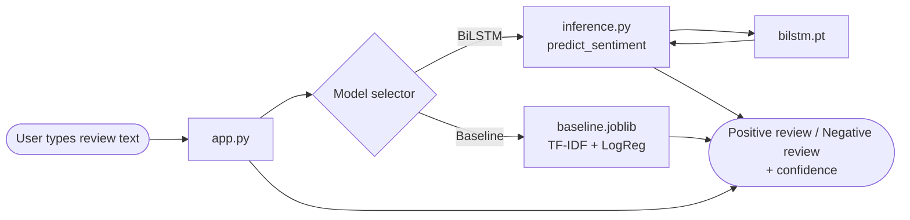
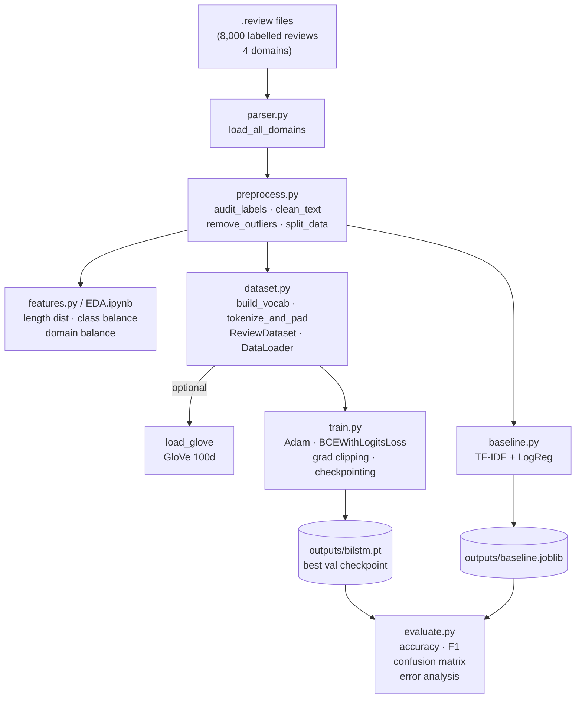
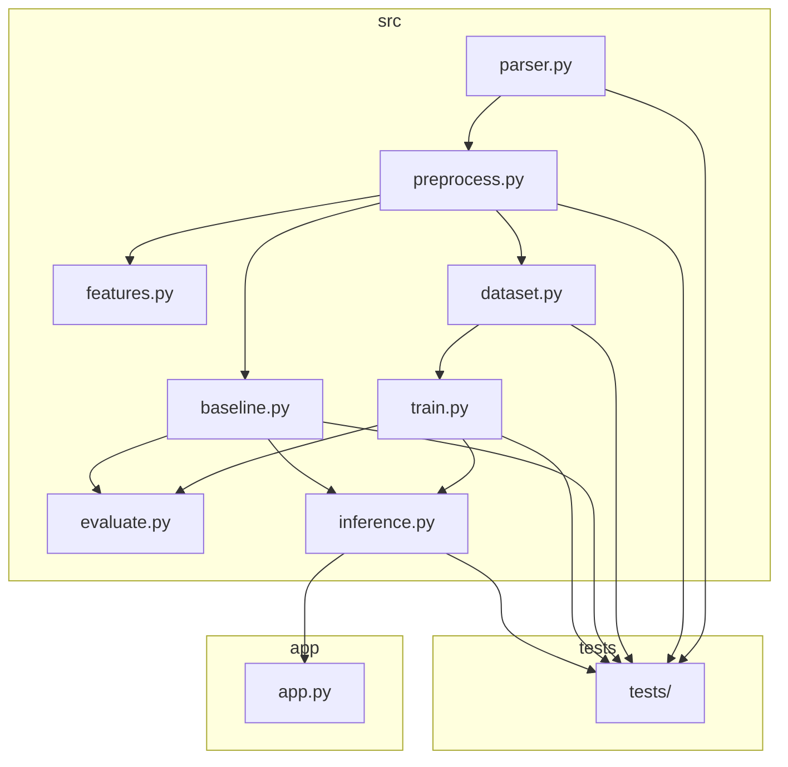
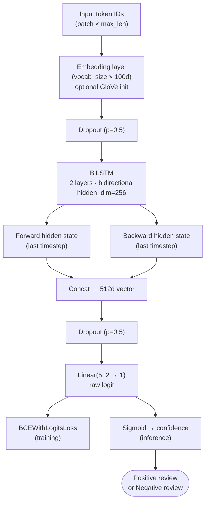
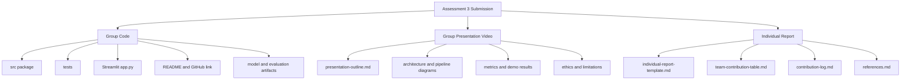
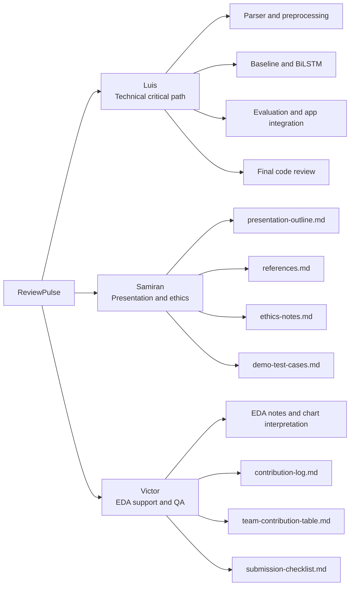
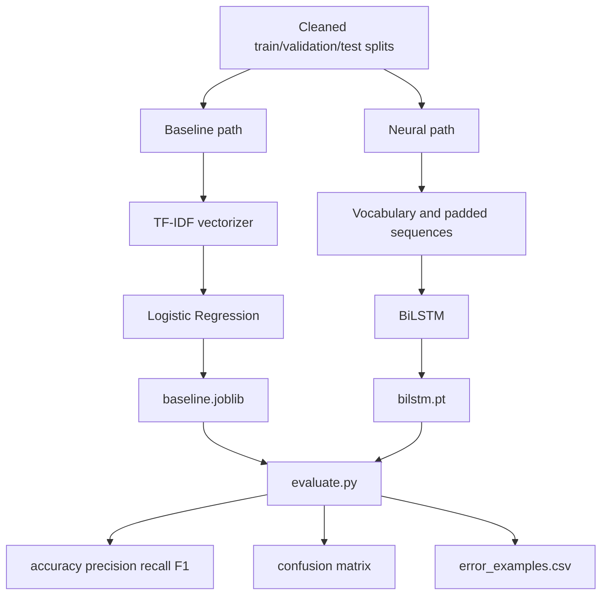

# ReviewPulse — Diagrams

Use these diagrams in the README, presentation, and teammate handoff. Each diagram has a one-line purpose so Samiran and Victor can quickly understand where it fits.

## 1. Inference Data Flow

**Purpose:** Shows how a user's review moves through the Streamlit app, selected model, inference layer, and final sentiment output.

---

## 2. Training Pipeline

**Purpose:** Shows the end-to-end ML workflow from raw `.review` files through preprocessing, model training, evaluation, and saved artifacts.

---

## 3. Project Module Architecture

**Purpose:** Shows the main source modules and how data/model responsibilities connect across the codebase.

---

## 4. BiLSTM Model Architecture

**Purpose:** Shows the required neural-network path: encoded review tokens become embeddings, sequence features, a raw logit, and a positive/negative prediction.

---

## 5. Assessment Submission Coverage

**Purpose:** Shows how the project artifacts map to the three required Assessment 3 submissions.

---

## 6. Team Ownership Split

**Purpose:** Gives the team a low-risk ownership model where Luis owns the technical critical path and Samiran/Victor own bounded submission artifacts.

---

## 7. Baseline vs Neural Model Comparison

**Purpose:** Shows the comparison story for the presentation: a simple classical model establishes a benchmark, then the BiLSTM provides the required neural-network solution.

