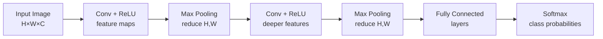
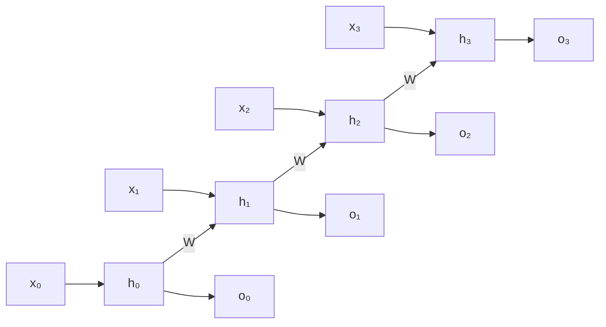
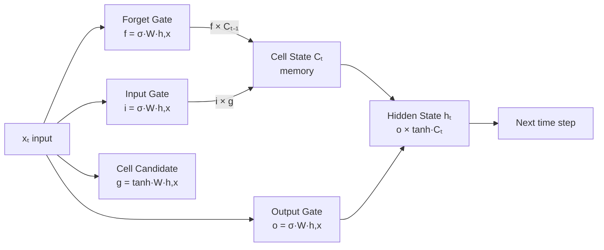

# Module 04 — Introduction to Deep Learning
## ISY503 Intelligent Systems

---

## Task List

| # | Resource / Activity | Type | Status |
|---|---------------------|------|--------|
| **1** | Gupta, D. (2020) — Activation Functions and When to Use Them | Reading | ✅ |
| **2** | Krogh, A. (2008) — What are Artificial Neural Networks? | Reading | ✅ |
| **3** | LeCun, Y. et al. (2015) — Deep Learning (CNNs & RNNs) | Reading | ✅ |
| **4** | Hulten, G. (2018) — Building Intelligent Systems (ProQuest eBook) | Reading | ✅ |
| **A1** | Deep Learning Discussion Forum Post | Activity | ✅ |
| **A2** | ANN Details (learning rate, loss fn, batch, epoch, dropout) | Activity | ✅ |

---

## Key Highlights

---

### Resource 1 — Gupta, D. (2020): Activation Functions and When to Use Them

**Source:** Gupta, D. (2020, 30 January). Fundamentals of deep learning—Activation functions and when to use them? [Blog post]. Analytics Vidhya. Retrieved from https://www.analyticsvidhya.com/blog/2020/01/fundamentals-deep-learning-activation-functions-when-to-use-them/

#### 1. What is an Activation Function?

- A neuron applies a **linear transformation** on its inputs: `x = (weight × input) + bias`
- An **activation function** then applies a **non-linear transformation**: `Y = Activation(Σ(weight × input) + bias)`
- Without activation functions, a neural network is equivalent to a **linear regression model** — it cannot learn complex patterns
- Activation functions introduce **non-linearity**, enabling networks to represent intricate relationships in data

#### 2. Forward and Back Propagation

- **Forward propagation**: input flows through each layer; every neuron applies linear transformation + activation, passing the result to the next layer
- **Back-propagation**: the output error is computed; weights and biases are updated by propagating the gradient backwards through the network
- The **gradient** of the activation function determines how effectively weights update during backprop — zero gradients block learning

#### 3. Activation Functions Compared

| Function | Formula | Range | Key Trait | Best Use Case |
|----------|---------|-------|-----------|---------------|
| Binary Step | f(x) = 1 if x≥0, else 0 | {0,1} | Zero gradient — blocks backprop | Binary classifiers only (legacy) |
| Linear | f(x) = ax | (−∞, ∞) | Constant gradient — no improvement per layer | Simple/interpretable tasks |
| Sigmoid | f(x) = 1/(1+e^−x) | (0, 1) | Non-linear; vanishing gradient for \|x\|>3 | Binary classification (output layer) |
| Tanh | tanh(x) = 2sigmoid(2x)−1 | (−1, 1) | Zero-centred; steeper than sigmoid | Hidden layers (preferred over sigmoid) |
| ReLU | f(x) = max(0, x) | [0, ∞) | Fast; sparse activation; dying ReLU for x<0 | Hidden layers (default choice) |
| Leaky ReLU | f(x) = 0.01x if x<0, else x | (−∞, ∞) | Fixes dying ReLU; non-zero gradient for x<0 | When dead neurons are a problem |
| Param. ReLU | f(x) = ax if x<0, else x | (−∞, ∞) | Learnable slope 'a'; network tunes it | When Leaky ReLU still underperforms |
| ELU | f(x) = a(e^x−1) if x<0, else x | (−∞, ∞) | Log curve for negatives; no dead neurons | Deeper networks needing smooth negatives |
| Swish | f(x) = x · sigmoid(x) | (−∞, ∞) | Smooth, non-monotonic; outperforms ReLU on deep models | Deep networks (Google-discovered) |
| Softmax | e^xi / Σe^xj | (0, 1) summing to 1 | Probability distribution over all classes | Multi-class output layer |

#### 4. Choosing the Right Activation Function

- **Sigmoid / Tanh**: good classifiers but suffer from **vanishing gradient** — avoid in deep hidden layers
- **ReLU**: the modern default for hidden layers — computationally efficient and fast convergence
- **Leaky ReLU / Parameterised ReLU / ELU / Swish**: use when dead neurons appear or ReLU underperforms in very deep networks
- **Softmax**: always use at the output layer for **multi-class classification**
- **Rule of thumb**: start with ReLU in hidden layers; switch to variants if training stalls

#### Key Takeaways for ISY503

- Activation functions are what make neural networks capable of learning non-linear relationships — without them, a deep network collapses into linear regression
- Two key failure modes: **vanishing gradient** (sigmoid/tanh) and **dying ReLU** (standard ReLU with negative inputs)
- **ReLU** is the modern default for hidden layers; **Softmax** for multi-class outputs
- Choice of activation function directly impacts convergence speed, model depth feasibility, and final accuracy

---

### Resource 2 — Krogh, A. (2008): What are Artificial Neural Networks?

**Source:** Krogh, A. (2008). What are artificial neural networks? *Nature Biotechnology*, 26(2), 195–197. https://www.proquest.com/scholarly-journals/what-are-artificial-neural-networks/docview/222305221/se-2?accountid=176901

#### 1. Biological Inspiration

- The human brain performs sophisticated pattern recognition through a **highly interconnected network of neurons** communicating via electric pulses along axons, synapses, and dendrites
- Key biological analogy: dendrites (inputs) → nucleus/cell body (processing) → axon terminals (output)
- In ANNs, a **model neuron** (McCulloch-Pitts, 1943) receives N weighted inputs; if the total exceeds a **threshold**, output = 1; otherwise = 0
- Synaptic **weights** can be positive (excitatory) or negative (inhibitory)

#### 2. How a Threshold Unit Learns

- Each neuron computes: **total input = Σ(weight_i × x_i)**
- If total ≥ threshold → output = 1; otherwise → output = 0
- The **decision boundary** is a **hyperplane** (a line in 2D, a plane in 3D)
- **Linear separability**: a threshold unit can only classify problems where classes are separable by a hyperplane
- **Non-linearly separable** problems (e.g., XOR) require multi-layer networks with hidden layers

#### 3. Multi-Layer Networks and Back-Propagation

- **Perceptrons** (Rosenblatt, 1969): early single-layer networks — limited to linearly separable problems; Minsky & Papert (1969) showed this limitation
- **Multi-layer perceptrons (MLPs)**: hidden layers between input and output enable solving non-linear problems
- **Back-propagation** (Rumelhart, Hinton & Williams, 1986): the key algorithm that unlocked deep learning
  - Initialise all weights to small random numbers
  - For each training example: compute output, measure error (sum of squared differences), update weights to reduce error
  - Gradient descent iteratively minimises the total error across all training examples
  - Repeats until the error no longer decreases significantly

#### 4. Over-fitting and Generalisation

- **Over-fitting**: the network learns training data too well (too many parameters relative to training examples) → poor performance on new data
- Example: a network with 10 hidden units solving a 2-class, 100-example problem has 221 free parameters — too many
- **Cross-validation**: split data into k folds; train on k-1, test on 1; repeat → unbiased estimate of generalisation
- **Regularisation** and **ensemble averaging** over several networks help limit over-fitting

#### 5. Extensions and Applications

- Multi-class classification: add one output unit per class
- Regression: replace step function with a continuous function; minimise squared error
- **Applications demonstrated**: speech recognition (NETtalk), protein secondary structure prediction, cancer classification, gene prediction
- Other related architectures: Boltzmann machines, unsupervised networks, Kohonen nets, support vector machines

#### Key Takeaways for ISY503

- **Back-propagation** is the cornerstone of ANN training — gradient-based weight updates propagate error signals backward through the network
- **Hidden layers** give ANNs the power to solve non-linear classification and regression problems
- **Over-fitting** is a persistent risk — always evaluate on independent test data; use cross-validation
- ANNs achieve state-of-the-art performance across biology, medicine, engineering and language when properly trained and regularised

---

### Resource 3 — LeCun, Y., Bengio, Y. & Hinton, G. (2015): Deep Learning

**Source:** LeCun, Y., Bengio, Y. & Hinton, G. (2015). Deep learning. *Nature*, 521(7553), 436–444. https://www.proquest.com/scholarly-journals/deep-learning/docview/1685003444/se-2?accountid=176901

#### 1. What is Deep Learning?

- **Deep learning**: representation-learning methods with multiple levels of representation — each layer transforms its input into a more abstract representation
- Key advantage: **features are learned automatically from raw data**, not hand-engineered by experts
- Enabled breakthroughs in: speech recognition, visual object recognition, object detection, drug discovery, genomics, NLP
- A deep-learning system may have **hundreds of millions of adjustable weights** trained on millions of labelled examples

#### 2. Supervised Learning and Optimisation

- **Supervised learning**: the model is shown labelled examples and learns to map input → output
- **Objective (loss) function**: measures error (distance) between the model's output scores and the desired output
- **Stochastic Gradient Descent (SGD)**: most common optimisation method; shows the model a mini-batch of examples, computes gradients, adjusts weights in the direction that reduces error
- The **weight vector** is adjusted in the opposite direction to the gradient — equivalent to moving downhill on the error landscape

#### 3. Backpropagation in Multilayer Networks

- **Backpropagation**: applies the **chain rule of calculus** to compute gradients through all layers efficiently
- At each layer: compute the total input z, apply non-linear function f(z), propagate activation forward
- On the backward pass: compute the derivative of the error with respect to each unit's input, propagate back layer by layer
- **ReLU** (f(z) = max(0, z)) is the preferred non-linearity — learns much faster than tanh/sigmoid in deep networks

#### 4. Convolutional Neural Networks (CNNs) — p.439

CNNs are designed for **array-structured data**: images (2D pixel arrays), audio spectrograms (2D), video (3D), sequences (1D).

**Four key design principles:**

1. **Local connections**: each unit connects to a small local patch of the previous layer's feature map — not all units (reduces parameters)
2. **Shared weights (filter banks)**: all units in a feature map share the same filter weights — the same pattern is detected regardless of its position in the input
3. **Pooling**: merges semantically similar features into one; **max-pooling** takes the maximum over a local patch — creates spatial invariance to small shifts and distortions, reduces dimensionality
4. **Many layers**: 2–3 stages of [convolution + non-linearity (ReLU) + pooling], followed by fully-connected layers and a Softmax output

**Architecture flow:**
```
Input Image → [Conv + ReLU + Pool] × N → Fully Connected → Softmax Output
```

*CNN architecture (convolutional stack):*


- **Why CNNs work**: natural signals (images, audio) have local statistics that repeat across positions; pooling provides robustness to small transformations
- **ImageNet 2012 breakthrough**: deep CNN (AlexNet) halved error rates → triggered the modern computer vision revolution

#### 5. CNN Applications

| Domain | Application |
|--------|-------------|
| Computer Vision | Image classification, object detection, semantic segmentation |
| Face Recognition | Near human-level performance in face verification |
| Autonomous Vehicles | Traffic sign recognition, pedestrian/object detection |
| Medical Imaging | Biological image segmentation, connectomics |
| Industry | Real-time chips from NVIDIA, Mobileye, Intel, Qualcomm |

#### 6. Recurrent Neural Networks (RNNs) — p.441

RNNs are designed for **sequential data**: speech, text, time series, language.

- Process input **one element at a time**, maintaining a hidden **state vector** that encodes the history of all past elements
- The state vector is updated at each time step: information from earlier in the sequence influences processing of later elements
- Can be unfolded in time to look like a very deep feedforward network where all layers share the same weights
- **Training challenge — Backpropagation Through Time (BPTT)**: gradients either **explode** or **vanish** as they propagate over many time steps — standard RNNs struggle to learn long-range dependencies

*RNN temporal unrolling — same weights W reused at every time step:*


#### 7. Long Short-Term Memory (LSTM) — p.442

**LSTM** (Hochreiter & Schmidhuber, 1997) directly addresses the vanishing gradient problem.

- Introduces special hidden units called **memory cells** that act like gated accumulators
- **Forget gate**: a separate unit that decides when to reset (clear) the memory cell's contents
- The memory cell has a **self-connection** that is multiplicatively gated — allowing it to maintain information for long periods without the gradient decaying
- **Why LSTMs work**: gradient can flow through the memory cell without vanishing, enabling learning of long-range dependencies
- LSTMs with multiple layers subsequently proved far more effective than conventional RNNs

*LSTM memory cell — gates control information flow:*


**LSTM Applications:**

| Application | Description |
|-------------|-------------|
| Speech recognition | Maps acoustics all the way to character sequences (end-to-end) |
| Machine translation | English 'encoder' LSTM → French 'decoder' LSTM |
| Image captioning | CNN extracts image features → LSTM generates text caption |
| Language modelling | Predicts next word in a sequence |

#### 8. Distributed Representations and Language Processing — p.440

- Deep nets learn **distributed representations**: words mapped to dense real-valued vectors (**word vectors / word embeddings**)
- Semantically similar words end up **close together in vector space** (e.g., "Tuesday" and "Wednesday" have similar vectors)
- Traditional **N-grams**: count short symbol sequences; cannot generalise beyond seen contexts; need huge training corpora
- **Neural language models**: associate each word with a vector; the network learns to convert input word vectors into an output word vector predicting the next word

#### Key Takeaways for ISY503

- **CNNs** exploit spatial structure through local connections, shared filter banks, and pooling — the dominant approach for computer vision
- **RNNs** exploit temporal/sequential structure; standard RNNs suffer from vanishing gradients over long sequences
- **LSTMs** are the state-of-the-art RNN variant — gated memory cells enable learning of long-range dependencies essential for language and speech
- The deep learning revolution was enabled by three factors: **more data** (ImageNet), **faster hardware** (GPUs), and **algorithmic advances** (ReLU, dropout, SGD)
- Combining CNNs + RNNs enables powerful multimodal systems (e.g., image captioning: vision CNN → language RNN)


---

## Module Summary: Core Vocabulary

| Term | Definition |
|------|------------|
| Supervised Learning | Learns a mapping from inputs to outputs using labelled training data. |
| Classification | Supervised task where the output is a discrete class label. |
| Regression | Supervised task where the output is a continuous numeric value. |
| Overfitting | Model fits training data too closely; fails to generalise to unseen data. |
| Hyperparameter | Model setting chosen *before* training; not learned from data (e.g. K in KNN, C in SVM). |
| Model Selection | Process of choosing the best model/pipeline from a set of candidates. |
| Model Assessment | Estimating how well the chosen model will generalise to new data. |
| Cross-Validation (CV) | Estimates generalisation error by averaging performance over multiple train/validation splits. |
| K-Fold CV | Splits data into K folds; each fold serves as validation once; requires K model fits. |
| Leave-One-Out (LOO) | CV where n−1 samples train the model and 1 is validated; unbiased but O(n) compute. |
| Bagging | Bootstrap aggregating — trains each model on a random data subset; used by Random Forest to reduce variance. |
| Ensemble | Combines predictions from multiple models to improve accuracy and reduce variance. |
| Grid Search | Evaluates all hyperparameter combinations (Cartesian product); grows exponentially with number of HPs. |
| Random Search | Randomly samples hyperparameter configs; outperforms grid search when HPs have unequal importance. |
| Bayesian Optimisation | Builds a surrogate model of the objective function to guide the next evaluation; state-of-the-art for HPO. |
| AIC / BIC | Probabilistic model selection criteria; penalise model complexity to correct for optimistic training error. |

---

## Activities

### Activity 1: Deep Learning Discussion Forum Post

I would use deep learning to solve a problem where:
- the input data is unstructured, like processing images, audio, or NLP
- manual feature engineering is too difficult
- we have vast amounts of data available (hundreds of thousands or millions of data points)
- need the model that automatically learns features directly from raw data, without human intervention

A concrete use case is autonomous driving: a self-driving car needs to process raw camera images to identify pedestrians, traffic signs, and other vehicles. This maps directly to CNNs, which exploit local spatial structure through shared filter banks and pooling — exactly the kind of task where hand-engineering features is infeasible.

I would not use deep learning if:
- the dataset is small (1000-10000s of samples). Deep learning would overfit and methods like SVM or Random Forest would generalise better.
- the dataset is small and structured or tabular — simpler models win here, though large structured datasets with complex interactions can still benefit from DL
- interpretability is a requirement. Deep learning models are often considered "black boxes" and may not provide insights into how decisions are made.
- limited computational resources. Training deep learning models can be resource-intensive and may not be feasible in all environments.

Task example is credit risk assessment model for a bank: to predict whether a loan applicant is a good or bad credit risk based on structured data (income, credit history, etc.). A simpler model like logistic regression or a decision tree would be more appropriate here due to the structured nature of the data and the need for interpretability.


> *Status: ✅ Done*

### Activity 2: ANN Details (learning rate, loss function, batch size, epoch, dropout)

High level detail:

```python
# **Learning rate** — controls the step size of weight updates during gradient descent (SGD). Typical range: 0.0001–0.01.
- Too high → overshoots the error minimum, training diverges or oscillates
- Too low → extremely slow convergence, may get stuck in local minima
- Common practice: start at 0.001 and use a learning rate scheduler to decay over epochs
# ANALOGY: Like adjusting your stride when walking downhill in thick fog.
# Giant steps → you overshoot the valley floor and stumble up the other side.
# Tiny steps → you'll get there eventually, but it takes all day.
# The right step size lets you descend steadily without overshooting the bottom.

# **Loss function** — measures the difference between the model's predictions and the true labels; its gradient drives backpropagation.
- Cross-entropy loss → classification tasks (output is a probability distribution via Softmax)
- Mean Squared Error (MSE) → regression tasks (output is a continuous value)
- Choice of loss function must match the task; a mismatch will produce nonsensical gradients
# ANALOGY: Like a GPS telling you how far off-route you are.
# Without it, you have no idea if you're getting closer to the destination or drifting further away.
# The type of GPS also matters — one built for hiking trails (classification) vs motorways (regression)
# will guide you completely differently, even on the same journey.

# **Batch size** — number of training examples used in one forward/backward pass before updating weights. Typical values: 32, 64, 128.
- Large batch → stable gradient estimates, faster per-epoch wall-clock time, but may generalise worse (sharp minima)
- Small batch → noisier gradients, acts as implicit regularisation, often generalises better
- Mini-batch SGD (32–256) is the standard compromise
# ANALOGY: Like getting editorial feedback on your writing.
# Send one sentence at a time (batch=1) → feedback is noisy and painfully slow.
# Send the entire manuscript at once (full batch) → you wait ages for a single response.
# Sending it chapter by chapter (mini-batch) → regular, useful feedback without overwhelming anyone.

# **Epoch** — one full pass of the entire training dataset through the network.
- Too few epochs → underfitting; the model has not converged
- Too many epochs → overfitting; the model memorises training data
- Early stopping (monitor validation loss and halt when it stops improving) is the standard mitigation
# ANALOGY: Like re-reading a textbook.
# Each full read-through = one epoch. One pass is rarely enough to learn the material.
# But read the same book 500 times and you stop understanding it — you start reciting it word for word.
# That's overfitting. Early stopping is the moment you realise you're no longer learning, just memorising.

# **Dropout** — regularisation technique: during each training forward pass, randomly zeroes a fraction of neuron activations, forcing the network to learn redundant representations. Disabled at inference time.
- Typical rate: 0.2–0.5 (drop 20–50% of units per layer)
- Too high → underfitting (too much information is discarded)
- Too low → insufficient regularisation, overfitting persists
- Particularly effective in fully-connected layers; less common in convolutional layers
# CLAUDEX ANALOGY: Like studying for an exam with random pages of your notes removed each session.
# You can't rely on memorising specific notes, so you're forced to understand the concepts deeply enough
# to reconstruct them from different starting points each time.
# On exam day (inference) all your notes are back — but you've built real understanding,
# not a dependence on a specific set of cues.
```

**Learning rate** — controls the step size taken when updating weights during gradient descent. 
- Set too high, the model overshoots the optimal minimum and training diverges or oscillates. 
- Set too low, convergence is slow and the model may get stuck in a local minimum. 
A typical starting value is 0.001, often reduced gradually using a learning rate scheduler as training progresses and the loss landscape flattens.

**Loss function** — measures the gap between the model's predictions and the true labels, producing a scalar error value that drives backpropagation. 
- Cross-entropy loss is standard for classification tasks, penalising confident wrong predictions heavily. 
- Mean Squared Error (MSE) is the default for regression. 
The loss function must match the task — a mismatch produces meaningless gradients and a model that cannot learn effectively regardless of architecture.

**Batch size** — determines how many training examples are processed together before weights are updated. Large batches produce stable gradient estimates but can generalise poorly due to sharp minima; small batches introduce noise that acts as implicit regularisation. 
Mini-batch sizes of 32–128 are the standard compromise, balancing computational efficiency with the stochastic behaviour of gradient descent that helps the model escape poor local minima.

**Epoch** — think of it like re-reading a textbook. Each time you read the whole thing cover to cover, that is one epoch. The network sees every training example once, adjusts its weights, and then starts over from the beginning. One read-through is rarely enough to learn — the model needs multiple passes to gradually improve. But if you read the same book 500 times, you stop understanding it and start reciting it word for word: that is overfitting. The sweet spot is the number of epochs where the model has genuinely learned the patterns without memorising the specific examples it trained on. Early stopping monitors performance on unseen validation data and halts training the moment improvement stalls.

**Dropout** — a regularisation technique that randomly deactivates a fraction of neurons during each training forward pass, forcing the network to develop distributed, redundant representations rather than relying on specific pathways. It is disabled at inference time so all neurons contribute to the final prediction. Typical rates range from 0.2 to 0.5. Too high a rate causes underfitting by discarding too much information; too low provides insufficient protection against overfitting in deep fully-connected layers.

> *Status: ✅ Done*

---

## Class Notes

### 11/03/2026 - 11:30AM

#### Exercises