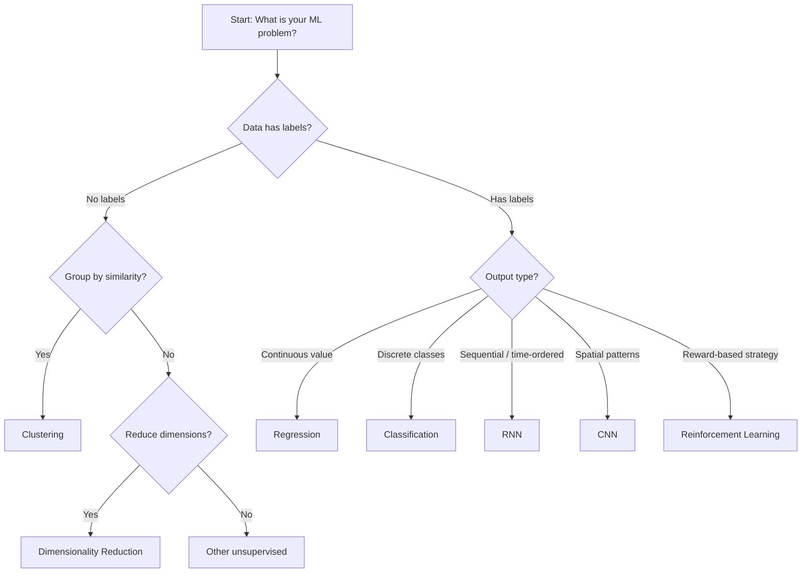
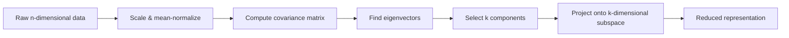

# Module 06 — Machine Learning in Practice
## ISY503 Intelligent Systems

---

## Task List

| # | Resource / Activity | Type | Status |
|---|---------------------|------|--------|
| **1** | Watch & summarise Edureka! (2019) — Best Python Libraries for Data Science & ML | Video | 🔥 WIP — needs manual watch |
| **2** | Watch & summarise blondiebytes (2019) — Learn Matplotlib in 6 minutes | Video | 🔥 WIP — needs manual watch |
| **3** | Read & summarise Bonnin, R. (2017) — Dataset preprocessing | Chapter | ✅ |
| **4** | Read & summarise Julian, D. (2016) — Features: How Algorithms See the World | Chapter | ✅ |
| **5** | Read & summarise Paul, S. (2018) — Hyperparameter Optimization in ML Models | Article | ✅ |
| 6 | Read & summarise Ng, R. (n.d.) — Evaluating a classification model | Article | 🔥 WIP — URL returns 404 |
| 7 | Watch & summarise Jedamski, D. (2019) — Measuring Success | Video | 🔥 WIP — needs authentication (LinkedIn Learning) |
| 8 | Activity 1: Discussion Forum Post — best metric to compare models | Activity | 🕐 |

---

## Key Highlights

---

### 3. Bonnin, R. (2017). Machine Learning for Developers.

**Citation:** Bonnin, R. (2017). *Machine Learning for Developers*. England: Packt Publishing. Retrieved from https://search.ebscohost.com/login.aspx?direct=true&AuthType=shib&db=nlebk&AN=1637915

**Purpose:** Covers the complete ML pipeline — from dataset pre-processing and model selection through to fitting, evaluation, and deployment — with concrete Python/scikit-learn examples for each step.

---

#### 1. Normalization and Feature Scaling

- **Why it matters:** Raw data distributions are often skewed; optimization algorithms (especially iterative ones like gradient descent) converge much better when data is normalized.
- **Standardization (z-score normalization):** Transforms data to mean = 0, standard deviation = 1 using z-scores.
- **Scikit-learn tool:** `sklearn.preprocessing.StandardScaler`

```python
from sklearn import preprocessing
std_scale = preprocessing.StandardScaler().fit(data)
data_std = std_scale.transform(data)
```

> Important: keep track of normalization parameters so you can **denormalize** predictions (especially for regression tasks).

#### 2. Model Selection Decision Framework



| Question | Answer → Model type |
|----------|---------------------|
| Group data by similarity, no labels? | **Clustering** |
| Predict continuous output? | **Regression** |
| Assign data to discrete classes? | **Classification** |
| Sequential / time-ordered data? | **Recurrent Neural Networks (RNN)** |
| Spatially located patterns? | **Convolutional Neural Networks (CNN)** |
| Reduce dimensions / extract key features? | **Dimensionality reduction** |
| Learn strategy via reward/penalty? | **Reinforcement Learning** |

#### 3. Loss Functions

- **Purpose:** Measures how far the model's predicted value is from the true value.
- Must be **differentiable** so gradient-based optimization can work.
- As models grow more complex, derivatives become more complex → iterative approximations (e.g., **gradient descent**) are required.

#### 4. Dataset Partitioning and Training Terminology

- **Standard split:** 70% training / 20% validation / 10% test
- **Key terms:**

| Term | Definition |
|------|-----------|
| **Iteration** | One pass of calculating gradients and updating weights |
| **Batch** | Subset of data fed to the model per iteration |
| **Mini-batch** | Small subset; more memory-efficient than full batching |
| **Epoch** | One complete pass through the entire dataset |
| **Batch size** | Number of samples per batch |

- **Parameter initialization:** Don't initialize weights to 0 (prevents optimization). Use a random normal distribution instead.

```python
mu, sigma = 0, 1
weights = np.random.normal(mu, sigma, num_params)
```

#### 5. Regression Evaluation Metrics

| Metric | Formula description | Sensitivity to outliers |
|--------|---------------------|------------------------|
| **MAE** (Mean Absolute Error) | Average of absolute differences | Moderate |
| **Median AE** | Median of absolute differences | **Robust** (best for outlier-heavy data) |
| **MSE** (Mean Squared Error) | Average of squared differences | **High** (penalises large errors) |

#### 6. Classification Evaluation Metrics

- **Accuracy:** Fraction of correct predictions. Simple but misleading on imbalanced datasets.
- **Precision:** `TP / (TP + FP)` — How many predicted positives are actually positive?
- **Recall:** `TP / (TP + FN)` — How many actual positives were found?
- **F1 / Fβ:** Harmonic mean of precision and recall. Balances both.
- **Confusion Matrix:** Grid of [predicted label × true label] — the main diagonal represents correct predictions.

```python
from sklearn.metrics import confusion_matrix
y = confusion_matrix(y_true, y_pred)
```

#### 7. Clustering Quality Metrics

| Metric | What it measures |
|--------|-----------------|
| **Silhouette coefficient** | Separation between clusters (no ground truth needed) |
| **Homogeneity** | Each cluster contains only one class |
| **Completeness** | All members of a class are in the same cluster |
| **V-measure** | Harmonic mean of homogeneity and completeness |

#### Key Takeaways for ISY503
1. **Activity 1 connection:** The metrics in sections 5 and 6 directly apply to choosing the "best metric" for the discussion forum — Accuracy vs. Precision/Recall/F1 tradeoffs are the core debate.
2. **Links to Module 5:** The "Garbage in, garbage out" principle from Module 5 is operationalised here through normalization and dataset partitioning.
3. **Practical implication:** Always normalize data before applying iterative models; always partition datasets before training to avoid data leakage.

---

### 4. Julian, D. (2016). Designing Machine Learning Systems with Python.

**Citation:** Julian, D. (2016). *Designing Machine Learning Systems with Python*. Birmingham, England: Packt.

**Purpose:** Chapter 7 explores feature types and engineering transformations — including PCA — to prepare datasets for optimal ML model performance.

---

#### 1. The Three Feature Types

| Feature Type | Order | Scale | Best central tendency | Used by |
|-------------|-------|-------|----------------------|---------|
| **Quantitative** | Yes | Yes | Mean | Geometric & all models |
| **Ordinal** | Yes | No | Median | Tree models, distance-based |
| **Categorical** | No | No | Mode | Probabilistic, tree models |
| **Boolean** | — | — | Mode | Subtype of categorical |

- **Key rule:** Models treat features differently based on type — tree models treat quantitative as ordinal; probabilistic models discretize quantitative into categorical bins.

#### 2. Statistics of Features

Three dimensions of feature statistics:

| Dimension | Metrics | Applicable to |
|-----------|---------|---------------|
| **Central tendency** | Mean, Median, Mode | Mode → all; Mean → quantitative only |
| **Dispersion** | Variance, Std dev, Range, Percentiles | Quantitative & ordinal |
| **Shape** | Skewness (3rd moment), Kurtosis (4th moment) | Quantitative |

- **Positive skew:** More instances above the mean (distribution tail to the right)
- **Kurtosis:** Normal distribution = 3; higher → more peaked; lower → flatter

#### 3. Feature Transformations (sklearn.preprocessing)

| Problem | Solution | sklearn function |
|---------|----------|-----------------|
| Features on different scales | Standardization | `StandardScaler()` |
| Sparse data (mean centering harmful) | Max-abs scaling | `MaxAbsScaler()` |
| Outliers present | Robust scaling | `RobustScaler()` |
| Adding non-linear complexity | Polynomial features | `PolynomialFeatures(degree=N)` |
| Missing values | Imputation | `Imputer(strategy='mean')` |

#### 4. Principal Component Analysis (PCA)

- **Purpose:** Dimensionality reduction — projects n-dimensional data onto k-dimensional subspace while **minimizing projection error** (not vertical error as in regression).
- **Process:** Calculate covariance matrix → find eigenvectors → project data.
- **Requirement:** Features must be **scaled and mean-normalized** before applying PCA.
- **PCA ≠ Linear Regression:** PCA minimizes orthogonal distance to the projection line; regression minimizes vertical distance to the target variable.

```python
from sklearn.decomposition import PCA
pca = PCA(n_components=1)
pca.fit(X)
X_reduced = pca.transform(X)
```



#### 5. Model-Feature Type Interactions

| Model type | Quantitative | Ordinal | Categorical |
|-----------|-------------|---------|-------------|
| **Tree models** | Binary split (threshold) | Binary split | Multi-way split |
| **Linear/Geometric** | Direct (Cartesian coordinates) | Limited | Must encode |
| **Probabilistic (Naïve Bayes)** | Must discretize → categorical | Treated as categorical | Native |
| **Distance-based (k-NN)** | Native | Integer-encoded | Hamming distance |

#### Key Takeaways for ISY503
1. **Assessment connection:** Feature engineering decisions directly impact the preprocessing step in Assessment 2. Choose feature transformations based on feature type first.
2. **Links to Module 2:** PCA is the dimensionality reduction technique introduced for individual research in Module 2 — this chapter provides the mathematical grounding.
3. **Practical implication:** Always check feature types before choosing a model; a mismatch (e.g., categorical features in a geometric model without encoding) will silently produce poor results.

---

### 5. Paul, S. (2018). Hyperparameter Optimization in Machine Learning Models.

**Citation:** Paul, S. (2018, August 15). Hyperparameter Optimization in Machine Learning Models. Retrieved from https://www.datacamp.com/community/tutorials/parameter-optimization-machine-learning-models

**Purpose:** Distinguishes model parameters from hyperparameters and demonstrates two practical tuning strategies — grid search and random search — using scikit-learn on a real dataset.

---

#### 1. Parameters vs. Hyperparameters

| | **Parameter** | **Hyperparameter** |
|---|---|---|
| **Definition** | Internal configuration learned from data | External configuration set by the practitioner |
| **Set by** | Training algorithm | Human / search algorithm |
| **Examples** | Neural network weights, SVM support vectors, regression coefficients | Learning rate, k in k-NN, C in SVM, max_iter in LR |
| **Saved in model?** | Yes | No (search log only) |

> **Rule of thumb:** If you have to manually specify it, it's probably a hyperparameter.

#### 2. Why Hyperparameter Tuning Matters

- Models have many hyperparameters; choosing suboptimal values limits performance even with good data.
- Framed as a **search problem** over a hyperparameter space.
- The right settings are problem-specific — no universal optimal values.

#### 3. Grid Search

- **Method:** Define a discrete grid of values for each hyperparameter; train and evaluate a model for **every combination**.
- **Pros:** Exhaustive, guaranteed to find the best configuration within the grid.
- **Cons:** Computationally expensive — grows exponentially with grid size and number of hyperparameters.
- **Scikit-learn:** `GridSearchCV`

```python
from sklearn.model_selection import GridSearchCV
param_grid = dict(dual=[True, False], max_iter=[100, 110, 120])
grid = GridSearchCV(estimator=lr, param_grid=param_grid, cv=3, n_jobs=-1)
grid_result = grid.fit(X, y)
print("Best:", grid_result.best_score_, grid_result.best_params_)
```

#### 4. Random Search

- **Method:** Sample hyperparameter values from statistical distributions rather than a fixed grid.
- **Key insight (Bergstra & Bengio):** Most datasets have only a few hyperparameters that truly matter; grid search wastes time on unimportant ones.
- **Pros:** Often finds equally good or better results in far less time.
- **Scikit-learn:** `RandomizedSearchCV`

```python
from sklearn.model_selection import RandomizedSearchCV
random = RandomizedSearchCV(estimator=lr, param_distributions=param_grid, cv=3)
random_result = random.fit(X, y)
```

#### 5. Grid Search vs. Random Search Comparison

| Aspect | Grid Search | Random Search |
|--------|------------|---------------|
| Coverage | Exhaustive | Probabilistic |
| Computation | High (all combos) | Lower (controlled iterations) |
| Best for | Small hyperparameter spaces | Large spaces with few important params |
| Risk | Misses non-grid values | May miss optimal by chance |

**Case study result:** Grid search achieved 0.763 accuracy in 0.79ms; Random search achieved the **same accuracy in 0.29ms** — ~2.7× faster.

#### 6. Practical ML Pipeline Steps (from case study)

1. Load data
2. Handle missing values (zero-values that are invalid)
3. Split features and target
4. Apply `KFold` cross-validation (baseline score)
5. Define hyperparameter grid
6. Run `GridSearchCV` / `RandomizedSearchCV`
7. Report best params and score

#### Key Takeaways for ISY503
1. **Assessment connection:** Hyperparameter tuning is explicitly listed as a step in Assessment 2's ML pipeline — use `GridSearchCV` or `RandomizedSearchCV` in the Jupyter notebook.
2. **Links to Module 3:** Model selection from Module 3 determines which hyperparameters are relevant; tuning comes after model choice.
3. **Practical implication:** Start with random search for initial exploration; switch to grid search for fine-tuning a narrow, promising region of hyperparameter space.
