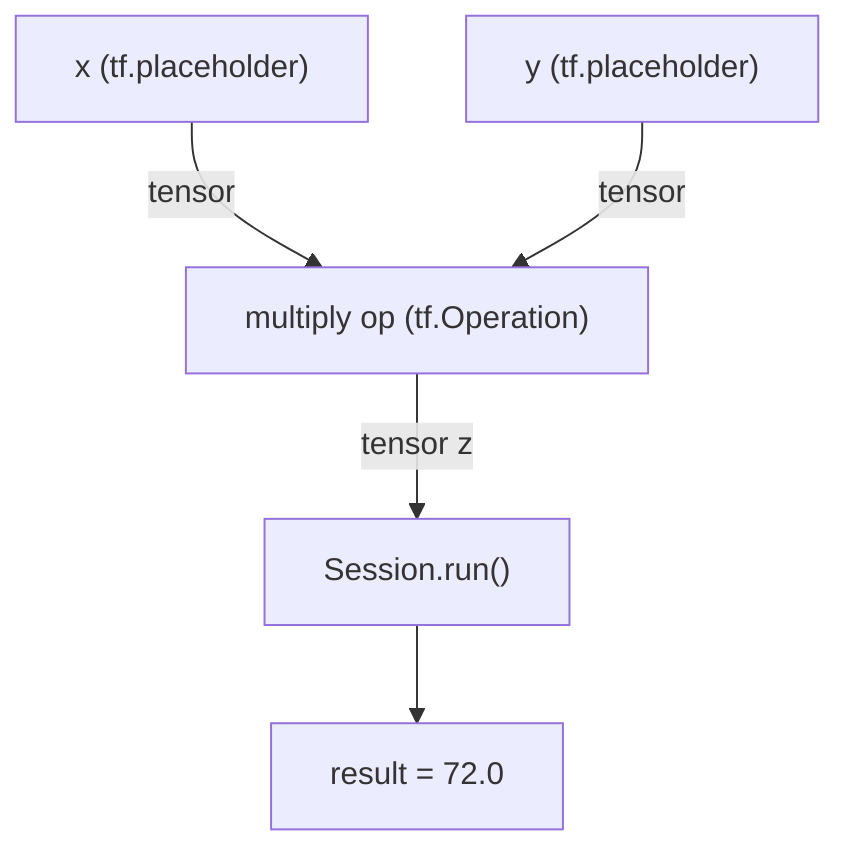
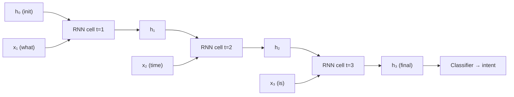

# Module 07 — Deep Learning in Practice
## ISY503 Intelligent Systems

## TL;DR

- **TensorFlow** programs are built as a **computational graph** (define ops/tensors) then executed inside a **Session**; Keras wraps this into a clean Sequential API
- **Perceptrons** are the building blocks of ANNs — single-layer networks can only solve linearly separable problems; multi-layer networks (≥2 hidden layers) with back-propagation overcome all such limits
- **CNNs** (convolutional + pooling + dense layers) excel at spatial pattern recognition (images); **RNNs/LSTMs** capture temporal patterns (sequences) — the **vanishing gradient** problem is why vanilla RNNs forget early context, motivating LSTMs
- **Regularisation** (L2, data augmentation, early stopping) fights overfitting; tune `λ` (regularisation rate) to balance fitting the data vs. keeping weights small
- Quick recipe: `Sequential → Dense/Conv2D → compile(Adam, sparse_categorical_crossentropy) → fit → evaluate` — train/val accuracy gap is your first overfitting signal

---

## Task List

| # | Resource / Activity | Type | Status |
|---|---------------------|------|--------|
| **1** | **Read & summarise Zaccone & Karim (2018) — A First Look at TensorFlow (Ch. 2)** | Reading | **✅** |
| **2** | **Read & summarise Graupe (2013) — ANN Principles & Perceptron (Ch. 3–4)** | Reading | **✅** |
| 3 | **Watch & summarise Sentdex (2018) — Deep learning with Python, TensorFlow & Keras** | Video | **✅** |
| 4 | Read & summarise Zaccone et al. (2017) — CNNs (Ch. 4) | Reading | 🔥 WIP |
| **5** | **Watch & summarise Phi (2018) — Illustrated guide to RNNs** | Video | **✅** |
| **6** | **Watch & summarise Google (2020) — Regularisation for Simplicity** | Video | **✅** |
| **7** | **Watch & summarise Deeplearning.ai (2017) — Other regularisation methods** | Video | **✅** |
| 8 | Activity 1: CNN Modification | Activity | 🕐 |
| 9 | Activity 2: RNN Visualisation | Activity | 🕐 |

---

## Key Highlights

---

### 1. Zaccone, G. & Karim, M. (2018). Deep learning with TensorFlow (2nd ed.), Ch. 2.

**Citation:** Zaccone, G. & Karim, M. (2018). *Deep learning with Tensorflow: Explore neural networks and build intelligent systems with Python* (2nd ed., pp. 31–73). Birmingham, England: Packt. Retrieved from https://ebookcentral-proquest-com.torrens.idm.oclc.org/lib/think/reader.action?docID=5340529

**Purpose:** Introduces TensorFlow's core concepts — computational graphs, tensors, sessions, variables, and TensorBoard — providing the practical foundation needed to build and run deep learning models in Python.

---

#### 1. What is TensorFlow?

- **Origin:** Open-source framework developed by Google Brain in 2011; released publicly in 2015 under Apache 2.0 license
- **Primary use:** Deep learning and neural networks, but also applicable to classical ML (SVMs, logistic regression, decision trees, random forests)
- **Execution engine:** All computation runs on a C++ engine; Python is a wrapper (this is why TF code looks different from regular Python)
- **GPU support:** Automatically distributes computation across CPUs/GPUs; requires NVIDIA CUDA ≥ 3.0 and cuDNN for GPU acceleration

**Key features:**

| Feature | Description |
|---------|-------------|
| **Speed** | Inception-v3 runs 7.3× faster on 8 GPUs vs. CPU |
| **Flexibility** | Not just DL — handles a wide range of mathematical operations |
| **Portability** | Runs on Linux, macOS, Windows, Android, iOS |
| **TensorFlow Lite** | Lightweight version for mobile/embedded devices with quantized kernels |
| **TensorBoard** | Built-in visualization tool for graph analysis and debugging |
| **Unified API** | Single API to deploy across CPUs, GPUs, mobile devices |
| **Eager execution** | From v1.7: operations execute immediately (imperative style), returns concrete values |

---

#### 2. The Computational Graph

TensorFlow programs are built around a **computational graph** — a directed acyclic graph (DAG) that represents computation before it runs.

- **Nodes** (`tf.Operation` objects, called **ops**): represent mathematical operations (add, multiply, matmul, etc.)
- **Edges** (`tf.Tensor` objects, called **tensors**): represent data flowing between nodes
- **Two phase execution:**
  1. **Build phase** — define the graph (construct nodes and edges)
  2. **Run phase** — create a `Session` and execute the graph

**Two edge types:**
- **Normal edges:** carry tensor data from one op to another
- **Special edges (control dependencies):** enforce execution order without carrying data



```python
# Classic TF 1.x pattern
import tensorflow as tf

x = tf.placeholder(tf.float32, name="x")
y = tf.placeholder(tf.float32, name="y")
z = tf.multiply(x, y)

with tf.Session() as sess:
    result = sess.run(z, feed_dict={x: 8, y: 9})  # → 72.0
```

> Note: From TF 2.x, eager execution is the default. `Session` and `placeholder` are legacy TF 1.x patterns — still important to understand for reading older code.

---

#### 3. TensorFlow Code Structure (4 Phases)

Every TF 1.x program follows this pattern:

| Phase | Description |
|-------|-------------|
| **1. Build graph** | Define operations on tensors (no computation yet) |
| **2. Create session** | Instantiate `tf.Session()` |
| **3. Run session** | Execute defined ops with `sess.run(op)` |
| **4. Collect/analyse** | Retrieve computed values and analyse results |

---

#### 4. The Data Model: Tensors

**Tensor** = a multidimensional numerical array, the fundamental data unit in TensorFlow.

| Concept | Definition |
|---------|-----------|
| **Rank** | Number of dimensions (rank 0 = scalar, rank 1 = vector, rank 2 = matrix) |
| **Shape** | Number of elements per dimension, e.g. `(3, 3)` for a 3×3 matrix |
| **Type** | Data type, e.g. `tf.float32`, `tf.int64`, `tf.string`, `tf.bool` |

**Three key tensor-holding objects:**
- **`tf.constant`** — immutable value; used for fixed data
- **`tf.Variable`** — mutable; holds model weights/biases updated during training
- **`tf.placeholder`** — empty slot; populated at runtime via `feed_dict`

**NumPy vs TensorFlow:**
Both are N-dimensional array libraries. Key difference: TensorFlow supports automatic differentiation and GPU computation; NumPy does not.

---

#### 5. TensorBoard: Visualising Computations

**TensorBoard** is TF's built-in web dashboard for inspecting and debugging models.

**Workflow:**
1. Build and annotate your computational graph with summary ops
2. Attach a `FileWriter` to log outputs: `tf.summary.FileWriter('/path/to/logs', sess.graph)`
3. Run the graph
4. Launch TensorBoard: `tensorboard --logdir=path/to/logs`
5. Open `http://localhost:6006/` in browser

**What TensorBoard shows:**
- Graph structure (nodes, edges, op names)
- Quantitative metrics (loss curves, weight distributions)
- Images, histograms, and scalars over training time

---

#### 6. Linear Regression Example (Gradient Descent in TF)

A canonical "hello world" for TF: fit a line `y = W*x + b` to noisy data using gradient descent.

```python
# Key components
W = tf.Variable(tf.zeros([1]))      # weight to learn
b = tf.Variable(tf.zeros([1]))      # bias to learn
y = W * x_data + b                  # prediction

loss = tf.reduce_mean(tf.square(y - y_data))   # MSE loss
optimizer = tf.train.GradientDescentOptimizer(0.6)
train = optimizer.minimize(loss)
```

After ~8 iterations, W converges to ≈ 0.1 and b to ≈ 0.4 — confirming the model recovers the true parameters from noisy data.

**Key insight:** TF automatically computes gradients for all ops in the graph during `sess.run()`, making optimisation straightforward.

---

#### Key Takeaways for ISY503

1. **Foundation for all deep learning labs:** Every hands-on exercise in this module (CNN classification, RNN visualisation) uses TF/Keras — understanding graphs, sessions, and tensors is a prerequisite
2. **TensorBoard** is the debugging tool for Activity 2 (RNN convergence visualisation)
3. **Linear regression in TF** previews the same gradient descent mechanics used in all deep learning optimisers (SGD, Adam, RMSProp)
4. Connects directly to Module 6 (ML in Practice) — loss functions, optimisers, and train/eval loops all appear here in TF syntax

---

### 2. Graupe, D. (2013). Principles of artificial neural networks (3rd ed.), Ch. 3–4.

**Citation:** Graupe, D. (2013). *Advanced series in circuits and systems, Vol 7 — Principles of artificial neural networks* (3rd ed.). Hackensack, NJ: World Scientific. Retrieved from https://search.ebscohost.com/login.aspx?direct=true&AuthType=shib&db=nlebk&AN=622050&site=ehost-live&custid=ns251549&ebv=EB&ppid=pp_9

**Purpose:** Builds the theoretical foundation for ANNs — covering the basic design principles, early network structures, the perceptron model, activation functions, and critically, why single-layer networks fail and how multi-layer architectures overcome those limitations.

---

#### 1. Basic Principles of ANN Design (Chapter 3)

The field traces to McCulloch & Pitts (1943), who proposed five foundational assumptions for neural computation:

| # | Principle |
|---|-----------|
| (i) | Neuron activity is **all-or-nothing** (binary element) |
| (ii) | A fixed minimum number of synaptic excitations required to fire |
| (iii) | The only significant delay is the **synaptic delay** |
| (iv) | An inhibitory synapse **absolutely prevents** neuron excitation |
| (v) | The **interconnection network is fixed** (does not change over time) |

> Note: These original principles do not all apply to modern ANN design — today weights are variable (learned), not fixed.

**Additional foundational principles:**

| Principle | Source | Description |
|-----------|--------|-------------|
| **Hebbian Learning Law** | Hebb (1949) | "Cells that fire together, wire together" — repeated co-activation increases connection weight |
| **Associative Memory (AM)** | Longuett-Higgins (1968) | Input vectors modify weights over repeated application to more closely approximate stored patterns |
| **Winner-Takes-All (WTA)** | Kohonen (1984) | Among N neurons receiving the same input, only the best-matching one fires |

---

#### 2. Early Network Structures

| Structure | Inventor | Type | Notes |
|-----------|---------|------|-------|
| **Perceptron** | Rosenblatt (1958) | Single neuron / single-layer | Building block of all later ANNs |
| **Artron** | R. Lee (1950s) | Statistical neuron | Pre-Perceptron; decision automaton |
| **Adaline** (ALC) | Widrow (1960) | Single neuron | Uses LMS (least-mean-square) weight training |
| **Madaline** | Widrow (1988) | Multi-layer ANN | Many Adalines; first multi-layer formulation |

**Four major multi-layer architectures:**
1. **Back-Propagation (BP) network** — multi-layer Perceptron; mathematically elegant gradient descent based on Bellman's Dynamic Programming
2. **Hopfield Network** (1982) — recurrent network with feedback; uses AM principle for weight adjustment
3. **Counter-Propagation Network** (Hecht-Nielsen, 1987) — combines Kohonen's SOM (unsupervised) with WTA principle
4. **LAMSTAR** — large memory storage and retrieval; uses Kohonen SOM layers with Kantian Link-Weights for multi-modal input integration

---

#### 3. The Perceptron: Structure and Activation Functions (Chapter 4)

The **perceptron** is the fundamental building block of nearly all ANN architectures.

**Input-output relation:**
```
z_i = Σ w_ij * x_ij     (weighted sum of inputs)
y_i = f(z_i)             (activation function applied)
```

**Activation functions:**

| Function | Formula | Range | Notes |
|----------|---------|-------|-------|
| **Sigmoid** | `y = 1 / (1 + exp(-z))` | (0, 1) | Smooth, differentiable; most common |
| **Tanh** | `y = tanh(z)` | (-1, 1) | Bipolar version; zero-centred |
| **Hard threshold** | `y = 1 if z≥0, else 0` | {0, 1} | Adaline uses this; not differentiable at 0 |

The sigmoid and tanh are "squashing functions" — they keep outputs bounded, mimicking biological neuron saturation.

---

#### 4. Limitations of the Single-Layer Perceptron

Minsky & Papert (1969) showed single-layer networks **cannot solve non-linearly separable problems**.

**The XOR problem:**
- XOR outputs 1 when exactly one input is 1 — no single straight line (hyperplane) can separate these classes
- This is because single-layer perceptrons can only define **linear decision boundaries** (convex regions)

**Why this matters:**
- For n binary inputs: 2^n possible patterns, 2^(2^n) possible functions
- Only a tiny fraction of those functions are linearly separable — the fraction shrinks rapidly as n grows
- Single-layer ANNs can classify only linearly separable problems → fundamentally limited

---

#### 5. Multi-Layer Perceptrons: The Solution

Rumelhart et al. (1986) showed:
- A **2-layer ANN** can solve non-convex problems (including XOR)
- **3+ layer ANNs** extend representable problem classes to essentially **no bound**

The key enabler was the **Back-Propagation algorithm** — a method to train weights in hidden layers using the chain rule of calculus.

**Why Back-Prop was significant:** Before 1986, there was no rigorous way to set weights in hidden layers. This breakthrough ended the "AI winter" caused by Minsky & Papert's critique.

---

#### 6. Case Study: Perceptron for AR Time Series Identification

A single perceptron used to identify parameters of a 5th-order autoregressive (AR) model:
- **Input:** Past values `x(n-1), ..., x(n-5)`
- **Target:** Predict `x(n)` and minimise MSE
- **Training rule (delta rule + momentum):** `Δâ(n) = 2μe(n)x(n-1) + α*Δâ(n-1)`
- **Result:** After ~200 iterations, estimated parameters converge to true values (e.g., a₁ → 1.15, a₂ → 0.17, etc.)

This demonstrates that even a single perceptron can be a powerful regression tool for **linearly structured problems**.

---

#### Key Takeaways for ISY503

1. **Perceptrons → layers → deep networks:** This chapter gives the theoretical "why" behind the architecture choices you'll implement in the CNN and RNN activities
2. **XOR limitation** explains exactly why deep networks (with multiple hidden layers) are necessary — shallow networks cannot represent complex, non-linear patterns (like handwriting)
3. **Activation functions** (sigmoid, tanh, ReLU) are hyperparameters you'll tune in Activity 1 (CNN modification) — understanding their mathematical properties informs those choices
4. **Hebbian learning and back-propagation** connect to Module 5's gradient descent discussion — Hebbian learning was the precursor, BP is the practical realisation

---

### 6. Google.com. (2020). Machine Learning Crash Course – Regularisation for Simplicity.

**Citation:** Google.com. (2020, 10 February). *Machine Learning Crash Course – Regularisation for Simplicity* [Video file]. Retrieved from https://developers.google.com/machine-learning/crash-course/regularization-for-simplicity/video-lecture

**Purpose:** Explains how overfitting occurs in deep learning models and introduces regularisation techniques — specifically L2 regularisation and early stopping — to improve a model's ability to generalise to new data.

---

#### 1. The Overfitting Problem

**Overfitting** = a model memorises the training data so well it performs poorly on new examples.

- Deep learning models are especially prone to overfitting due to their large number of parameters
- An overfit model has **low training loss** but **high test/validation loss**
- The model learns noise and idiosyncratic patterns in training data, not the underlying signal

---

#### 2. L2 Regularisation (Ridge Regularisation)

L2 regularisation penalises large weights by adding a complexity term to the loss function:

```
Objective = Minimise(Loss + λ × Complexity)

where Complexity = w₁² + w₂² + ... + wₙ²
```

**Key properties:**
- Encourages weights **toward zero** but never all the way to zero (all features retain some contribution)
- Large weights are penalised disproportionately: a single weight of 5.0 contributes ~25× more penalty than a weight of 1.0
- Produces weight distributions that approximate a **normal distribution centred at zero**

---

#### 3. Lambda (Regularisation Rate)

**Lambda (λ)** is the hyperparameter controlling regularisation strength:

| Lambda setting | Effect on weights | Risk |
|----------------|------------------|------|
| **High λ** | Pulls weights strongly toward zero | Underfitting (model too simple) |
| **Low λ** | Minimal weight penalty | Overfitting (model too complex) |
| **λ = 0** | No regularisation | Pure loss minimisation |

**Tuning challenge:** Lambda and learning rate work in opposition:
- High **learning rate** → pulls weights away from zero
- High **lambda** → pulls weights toward zero
- Finding the right balance between these two forces is critical for optimal generalisation

---

#### 4. Early Stopping (Alternative Regularisation)

**Early stopping** halts training before the model fully converges, typically when validation loss starts increasing:

| Property | Effect |
|----------|--------|
| Training loss | Usually increases (not fully minimised) |
| Test/validation loss | Can decrease (better generalisation) |
| Comparison to L2 | Generally less effective than carefully tuned λ |

Early stopping is a simple heuristic but less principled than L2 regularisation — it can miss the optimal stopping point.

---

#### 5. The Fundamental Regularisation Trade-off

Regularisation introduces a deliberate tension between two competing goals:

1. **Minimise loss** → fit the training data as closely as possible
2. **Minimise complexity** → keep weights small and the model simple

The regularisation rate λ determines how much each goal is weighted. A model that achieves both — low training loss **and** small weights — is more likely to generalise well to unseen data.

---

#### Key Takeaways for ISY503

1. **Every deep learning model you build is at risk of overfitting** — regularisation is not optional in practice, especially with small datasets
2. **L2 (weight decay)** is built into most deep learning frameworks: in Keras/TensorFlow, it's added as `kernel_regularizer=tf.keras.regularizers.l2(lambda_val)` in any Dense or Conv layer
3. **Activity 1 (CNN Modification)** will likely involve tuning regularisation — understanding how λ affects weight distributions helps you interpret what's happening
4. **Connects to Resource 7 (Andrew Ng):** data augmentation and early stopping are complementary regularisation strategies to L2

---

### 3. Sentdex. (2018). Deep learning with Python, TensorFlow, and Keras tutorial.

**Citation:** Sentdex. (2018, 11 August). *Deep learning with Python, TensorFlow, and Keras tutorial* [Video file]. Retrieved from https://www.youtube.com/watch?v=wQ8BIBpya2k

**Purpose:** A practical walkthrough of building a deep learning model in Keras — from loading and normalising the MNIST dataset through to training, evaluating, saving, and making predictions — making the theoretical concepts from Resources 1 & 2 immediately actionable.

---

#### 1. Neural Network Concepts (Quick Recap)

- **Goal:** Map inputs (X₁, X₂, X₃) → outputs (e.g. dog vs. cat)
- **Single-layer perceptron (no hidden layer):** can only solve **linearly separable** problems — the XOR limitation from Resource 2
- **One hidden layer with non-linear activations:** can capture non-linear relationships, but may be insufficient for complex tasks
- **Two or more hidden layers** = "deep" neural network → greatly expands representational power for complex, hierarchical patterns
- Each connection between layers has a unique **weight**; each neuron applies an **activation function** to its weighted sum of inputs

**Activation functions covered:**

| Function | Shape | Use case |
|----------|-------|----------|
| **Step function** | Binary 0/1 at threshold | Conceptual only — not used in practice |
| **Sigmoid** | S-curve, output (0,1) | Output layers for binary/probabilistic output |
| **ReLU** (Rectified Linear) | 0 for negatives, linear for positives | Default for hidden layers — fast, avoids vanishing gradient |
| **Softmax** | Normalises outputs to sum to 1.0 | Output layer for multi-class classification |

---

#### 2. The MNIST Dataset

- **28×28 pixel** greyscale images of handwritten digits 0–9
- **Training set** (X_train, y_train) + **test set** (X_test, y_test)
- Pixel values range 0–255 → **normalise** to 0–1 for faster, more stable training
- The dataset is a standard benchmark; its "tensor" structure (multidimensional array) directly illustrates TF's data model from Resource 1

---

#### 3. Building a Model with Keras Sequential API

```python
import tensorflow as tf

model = tf.keras.models.Sequential()

model.add(tf.keras.layers.Flatten())          # Input: 28×28 → 784 flat values
model.add(tf.keras.layers.Dense(128, activation='relu'))   # Hidden layer 1
model.add(tf.keras.layers.Dense(128, activation='relu'))   # Hidden layer 2
model.add(tf.keras.layers.Dense(10, activation='softmax')) # Output: 10 classes
```

**Layer types:**
- **`Flatten`** — reshapes the 2D image array into a 1D vector (required before Dense layers)
- **`Dense`** — fully-connected layer; every neuron connects to every neuron in the next layer
- Output layer has **10 units** (one per digit 0–9) with **softmax** → returns a probability distribution

---

#### 4. Compiling and Training

```python
model.compile(
    optimizer='adam',                            # Adaptive learning rate optimiser
    loss='sparse_categorical_crossentropy',      # Loss for integer labels, multi-class
    metrics=['accuracy']
)
model.fit(X_train, y_train, epochs=3)
```

**Key choices:**

| Parameter | Choice | Why |
|-----------|--------|-----|
| **Optimizer** | Adam | Default go-to; adaptive learning rates; outperforms vanilla SGD in practice |
| **Loss** | Sparse categorical cross-entropy | For integer class labels (0–9); use binary CE for 2-class, categorical CE for one-hot labels |
| **Epochs** | 3 | Each epoch = one full pass through training data; ~97% accuracy achieved in 3 epochs on MNIST |

---

#### 5. Evaluating: Detecting Overfitting

```python
val_loss, val_acc = model.evaluate(X_test, y_test)
# Expected: val_acc ≈ 96.5%, slightly lower than training acc of 97%
```

**Reading the results:**
- **Small gap** (train 97%, val 96.5%) → good generalisation
- **Large gap** → model memorised training data (overfitting) → reduce epochs, add dropout/regularisation
- The model outputs a **one-hot probability array** per sample; use `np.argmax(predictions[i])` to get the predicted class

---

#### 6. Saving, Loading, and Predicting

```python
model.save('my_model')
new_model = tf.keras.models.load_model('my_model')
predictions = new_model.predict([X_test])   # always pass a list
predicted_class = np.argmax(predictions[0])
```

---

#### Key Takeaways for ISY503

1. **Activity 1 (CNN Modification)** follows exactly this workflow — the only change is swapping `Dense` layers for `Conv2D` + `MaxPooling2D` layers before the flatten step
2. **Adam + sparse categorical cross-entropy** is the default recipe for classification tasks — memorise this combination
3. **Train/val accuracy gap** is your first overfitting diagnostic — if it's large, reach for the regularisation techniques from Resources 6 & 7
4. Sentdex's tutorial uses TF 1.x syntax; the same concepts apply in TF 2.x with eager execution on by default

---

### 4. Zaccone, G., Karim, M. & Menshawy, A. (2017). Deep learning with TensorFlow, Ch. 4 (CNNs).
> *Status: 🔥 WIP — needs manual access (EBSCO eBook)*
> Access at: https://search.ebscohost.com/login.aspx?direct=true&AuthType=shib&db=nlebk&AN=1508099
> Covers: CNN architecture (convolutional layers, pooling layers, fully connected layers); handwriting detection example

---

### 5. Phi, M. (2018). Illustrated guide to recurrent neural networks.

**Citation:** Phi, M. (2018, 26 August). *Illustrated guide to recurrent neural networks: Understanding the intuition* [Video file]. Retrieved from https://www.youtube.com/watch?v=LHXXI4-IEns

**Purpose:** Builds intuition for how RNNs work — covering sequential memory, the hidden state mechanism, the vanishing gradient problem, and why LSTMs and GRUs were created to solve it.

---

#### 1. Why RNNs? Sequential Memory

Standard feed-forward networks treat each input independently — they have no memory of previous inputs. Many real problems are **sequential**: the meaning of a word depends on words that came before it.

**Analogy:** Reciting the alphabet forward is easy (sequential memory); backward is hard (no learned sequence). RNNs exploit sequential memory the way your brain does.

**Applications where sequences matter:**
- Speech recognition
- Language translation
- Stock prediction
- Image captioning

---

#### 2. RNN Structure: The Hidden State

An RNN adds a **looping mechanism** that passes a **hidden state** from one time step to the next:



```
At each time step t:
  hidden_state_t = f(input_t, hidden_state_(t-1))
  output_t       = g(hidden_state_t)
```

- The **hidden state** is a compressed representation of all previous inputs
- Think of it as the network's "memory" — what it knows so far
- In a chatbot example: feeding "what time is it" word-by-word, the hidden state at the final step contains context from all previous words → fed into a classifier for intent detection

**Python control flow:**

```python
hidden_state = init_hidden_state()
for word in input_sequence:
    output, hidden_state = rnn(word, hidden_state)
prediction = feed_forward_layer(output)
```

---

#### 3. The Vanishing Gradient Problem

Training uses **back-propagation through time (BPTT)** — gradients are propagated backwards through each time step.

**The problem:** Each time step multiplies gradients by a small number (<1). Over many steps, gradients shrink **exponentially**:

| Time step | Gradient magnitude |
|-----------|-------------------|
| Recent (t=10) | Normal |
| Middle (t=5) | Very small |
| Early (t=1) | ≈ 0 |

**Consequence:**
- Earlier time steps receive near-zero gradient updates → weights barely change → the network can't learn long-range dependencies
- In the chatbot example, the words "what" and "time" may be effectively forgotten by the final step
- This is **short-term memory** — the RNN only "remembers" recent inputs

---

#### 4. Solutions: LSTMs and GRUs

| Architecture | Full Name | Key mechanism |
|-------------|-----------|--------------|
| **LSTM** | Long Short-Term Memory | Gates (input, forget, output) control what information to keep or discard from the hidden state |
| **GRU** | Gated Recurrent Unit | Simplified version of LSTM with fewer gates — faster to train |

Both architectures use **gates** — neural network layers that learn what information is relevant to retain across many time steps, solving the vanishing gradient problem.

**When to use which:**

| Situation | Recommendation |
|-----------|---------------|
| Long sequences with long-range dependencies | LSTM or GRU |
| Speed / computational efficiency priority | Vanilla RNN or GRU |
| State-of-the-art NLP tasks | LSTM (or Transformers) |

---

#### Key Takeaways for ISY503

1. **Activity 2 (RNN Visualisation)** asks you to visualise the **convergence** of an RNN — the vanishing gradient is exactly what makes convergence slow or unstable; understanding it helps you interpret your plots
2. The hidden state diagram directly maps to the Jupyter Notebook code — `hidden_state` is the tensor being passed between time steps
3. **Short-term memory** is why the Jupyter Notebook example may struggle on longer sequences — this motivates using LSTMs in practice
4. RNNs are the sequential counterpart to CNNs: CNNs capture spatial patterns (pixels), RNNs capture temporal patterns (sequences)

---

### 7. Deeplearning.ai. (2017). Other regularization methods (C2W1L08).

**Citation:** Deeplearning.ai. (2017a, 25 August). *Other regularization methods (C2W1L08)* [Video file]. Retrieved from https://www.youtube.com/watch?v=BOCLq2gpcGU

**Purpose:** Covers two practical regularisation techniques beyond L2 — data augmentation and early stopping — explaining how each works, when to use them, and the principled argument for why L2 is often preferable to early stopping.

---

#### 1. Data Augmentation

When collecting more real training data is expensive or impossible, **data augmentation** artificially expands the dataset by applying transformations to existing examples.

**For image classifiers:**
- **Horizontal flipping** → effectively doubles the training set (a flipped cat is still a cat)
- **Random cropping and zooming** → adds variety, simulates different camera distances
- **Rotations and distortions** → for OCR (optical character recognition), random distortions of digits are still valid digit examples

**Important caveats:**
- Don't flip vertically if upside-down examples are not valid (e.g., most cats aren't upside-down)
- Augmented examples are **not independent** new data — they add less information than truly new samples, but at near-zero cost
- Subtle distortions work better than extreme ones in practice

**Effect:** Acts as a regulariser — the model sees more variation and is less likely to memorise specific training samples.

---

#### 2. Early Stopping

Stop training **before full convergence**, at the point where the dev/validation set error is minimised:

```
Training error:     decreasing monotonically ↘
Dev set error:      decreases, then increases ↗
                              ↑
                         Stop here
```

**Why it works:** With random weight initialisation, weights start near zero. As training proceeds, ||W|| grows. Stopping early keeps ||W|| at an intermediate value — similar to L2 regularisation's effect.

---

#### 3. Early Stopping vs. L2 Regularisation — Andrew Ng's Argument

Andrew Ng presents the **orthogonalisation principle**: ideally, optimise the cost function and reduce variance as **two separate, independent tasks**.

| Approach | Optimise cost function J | Reduce variance (not overfit) |
|----------|--------------------------|------------------------------|
| **L2 regularisation** | Train fully (minimise J) | Tune λ separately |
| **Early stopping** | Partially (stops before J is minimised) | Couples both tasks together |

**Downside of early stopping:**
- Stopping gradient descent early means J is not fully minimised — you're simultaneously trying to optimise and regularise with one mechanism
- This **couples** the two objectives, making it harder to reason about what's going wrong
- Andrew Ng's preference: use **L2 regularisation** + train fully — keeps concerns separate and makes the hyperparameter search (over λ) more systematic

**When early stopping is useful:**
- When computational budget is tight — you only run gradient descent once and evaluate multiple "checkpoints"
- As a quick diagnostic before committing to a full λ sweep

---

#### Key Takeaways for ISY503

1. **Data augmentation** is the first thing to try when your training set is small — it's free regularisation and directly applicable to Activity 1 (CNN on clothing images)
2. The **orthogonalisation principle** is a mental model worth keeping: when debugging a model, ask "is this an optimisation problem or a variance problem?" — they have different solutions
3. **Early stopping + TensorBoard** (from Resource 1) pair naturally — you can visualise the training/val loss curves in TensorBoard and identify the optimal stopping point visually
4. In Keras: early stopping is implemented as `tf.keras.callbacks.EarlyStopping(monitor='val_loss', patience=3)`
