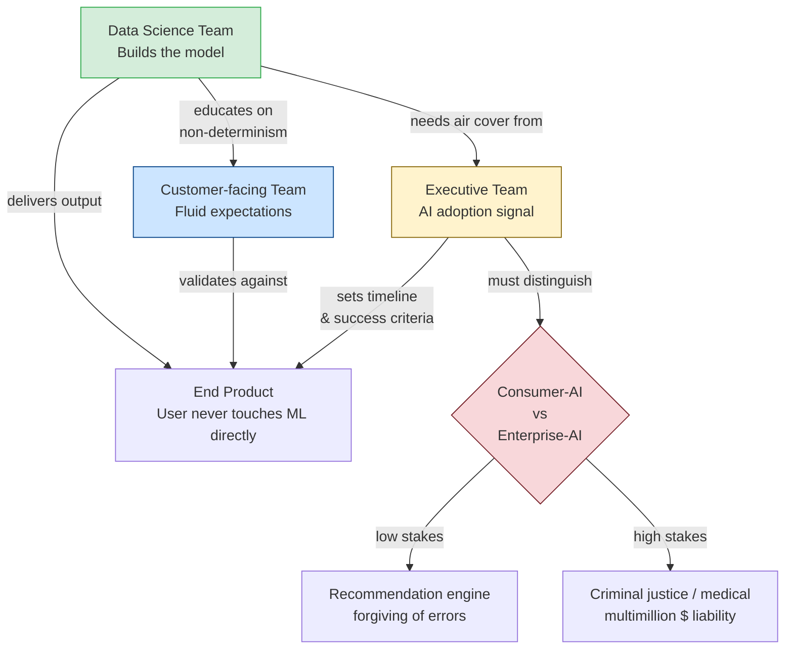

# Module 11 — Emotional Intelligence when working with Intelligent Systems
## ISY503 Intelligent Systems

## TL;DR

- Building intelligent systems is only half the job — stakeholder alignment, critical thinking, communication, and ethics are the other half.
- Three stakeholder groups (customer-facing, executive, data science teams) each have orthogonal expectations; managing those gaps is as important as model accuracy.
- **Intelligent behaviour ≠ actual intelligence**: today's ML is "computational statistics," not common sense reasoning — fear of superintelligence distracts from real, present-day automation risks.
- Three critical thinking skills every data scientist needs: **healthy scepticism about data**, **don't fool yourself**, and **connect code to the real world**.
- Ethical AI design rests on eight core principles: net-benefits, do no harm, legal compliance, privacy, fairness, transparency, contestability, and accountability.
- The **Tay chatbot** case study is a canonical example of bias-in-data governance failure — garbage in, garbage out.

---

## Glossary

| Term | Full Name | One-liner |
|------|-----------|-----------|
| STES | Sachin-Tendulkar-Expectation Syndrome | Unrealistic expectations that AI will solve everything instantly |
| GOFAI | Good Old-Fashioned Artificial Intelligence | Classical rule-based AI aimed at general reasoning and common sense |
| NDB | Notifiable Data Breaches | Australian scheme requiring notification when personal data is compromised |
| XAI | Explainable AI | AI models whose decisions can be understood and justified by humans |
| COMPAS | Correctional Offender Management Profiling for Alternative Sanctions | US tool predicting recidivism risk; controversial for racial bias |

---

## Task List

| # | Task | Status |
|---|------|--------|
| 1 | **Read & summarise Deshmukh (2019) — Stakeholder management in DS** | ✅ |
| 2 | **Read & summarise Bergstein (2018) — The Great AI Paradox** | ✅ |
| 3 | **Listen & summarise Berebichez (2019) — Critical Thinking in Data Science** | ✅ |
| 4 | Read & summarise Advanced Communication Techniques short course | 🔥 WIP |
| 5 | Read & summarise Ethical Design for Intelligent Systems short course | 🔥 WIP |
| **6** | **Watch & summarise Paulhamus (2018) — Our Future with Intelligent Systems (TEDx)** | ✅ |
| 7 | Activity 1: Australia's Ethics Framework — Data Governance case study (200 words) | 🕐 |

---

## Key Highlights

---

### 1. Deshmukh, O. (2019). A Data Science Leader's Guide to Managing Stakeholders.

**Citation:** Deshmukh, O. (2019, 1 August). A Data Science Leader's Guide to Managing Stakeholders. Retrieved from https://www.analyticsvidhya.com/blog/2019/08/data-science-leader-guide-managing-stakeholders/

**Purpose:** Practitioner guide to aligning the three key stakeholder groups in a data science project so that a technically strong solution can actually ship and deliver business value.

---

#### 1. The Sachin-Tendulkar-Expectation Syndrome (STES)
- **Definition:** Everyone expects AI to be a panacea — regardless of their seniority or exposure to delivery reality.
- The delivery leader must both *deliver a practical solution* and *manage disproportionate expectations* simultaneously.
- Consequence: even when the team delivers, stakeholders often feel underwhelmed because expectations were calibrated incorrectly from the start.

#### 2. Three Core Stakeholder Groups

| Stakeholder | Primary Concern | Key Challenge |
|-------------|-----------------|---------------|
| **Customer-facing team** | Product superiority vs. competitors | "Don't fix what ain't broke" vs. "change before competition does"; gradual model degradation is invisible to them |
| **Executive team** | AI adoption signal to market | Conflate consumer-AI (low-stakes) with enterprise-AI (high-stakes); need patient education on AI's development cycle |
| **Data science team** | Using the latest, coolest technology | Over-index on novelty; need reminding the end user never touches the ML model directly |

*Stakeholder alignment and expectation flow:*

#### 3. Managing Customer Expectations: "Illusion of 100% Accuracy"
- Data-driven products are **non-deterministic** — same input can produce different outputs across training runs or data distributions.
- This is a fundamental shift from deterministic software (clicking a button always opens the same page).
- Customer education strategy: agree on trial runs early, frame continuous improvement as normal (e.g., Google Search improves every year).

#### 4. Consumer-AI vs Enterprise-AI
- **Consumer-AI:** Recommending the wrong movie → low stakes, user forgiving.
- **Enterprise-AI:** Misidentifying a car plate for a criminal → wrong arrest, multimillion-dollar lawsuit.
- Executives need to understand which category their product falls into before setting success criteria.

#### 5. Data Science Team: Substance over Style
- Delivery leader must provide "air cover" from day-to-day pressures so the team can experiment deeply.
- Remind the team: AI is one component of the full product; the end consumer doesn't interact with the model directly.
- Healthy experimentation → higher job satisfaction → better employee retention.

#### Key Takeaways for ISY503
1. The non-technical work of AI projects (expectation-setting, stakeholder education) is often the bottleneck — not the model quality.
2. Distinguishing consumer-AI from enterprise-AI is essential framing for Assessment discussions about responsible deployment.
3. Links directly to R5 (Ethical Design) — accountability and transparency are stakeholder concerns, not just engineering ones.

---

### 2. Bergstein, B. (2018). The Great AI Paradox.

**Citation:** Bergstein, B. (2018, 15 December). The Great AI Paradox. Retrieved from https://www.technologyreview.com/2017/12/15/146836/the-great-ai-paradox/

**Purpose:** Argues that fear of superintelligence distracts from the real, present-day harms of automation, while clarifying what today's ML can and cannot do.

---

#### 1. What AI Has Actually Achieved: Adaptive Machine Learning
- Recent breakthroughs (self-driving cars, image recognition, Go) stem from one specific branch: **adaptive machine learning** — training on massive datasets to detect patterns.
- Made possible by two conditions that only aligned ~2010: sufficient digital training data + compute to process it.
- These systems do not "know" what they are doing — a Go champion program has no idea it's playing Go vs golf.

#### 2. Intelligent Behaviour vs. Actual Intelligence

| Property | Today's ML (Adaptive) | Real Intelligence (GOFAI) |
|----------|-----------------------|---------------------------|
| Method | Pattern matching on data | Common sense + background knowledge reasoning |
| Example | Wins at Go by analysing patterns | Knows a crocodile would fail the steeplechase, and *why* |
| Brittleness | Fails on out-of-distribution inputs | Can reason from first principles |
| Status | Widely deployed | No clear path to achievement |

- Yann LeCun (Facebook): machines lack "the essence of intelligence" — they can't predict what happens if half a Go board falls off a table.
- Patrick Winston (MIT): current achievements are better described as "computational statistics" than AI.

#### 3. Reductionism and the Superintelligence Distraction
- Max Tegmark (*Life 3.0*) argues superintelligence is inevitable via exponential improvement — Bergstein calls this reductionist, based on huge leaps: from pattern matching → common sense → general intelligence.
- The fictional "Prometheus" scenario Tegmark describes quietly assumes all the hard problems are already solved.
- **Key argument:** superintelligence risk is like an asteroid impact — non-zero probability, but crowding out attention from concrete, present-day harms.

#### 4. Real, Present-Day AI Risks (O'Reilly, *WTF?*)
- Loan and bail algorithms encoding racial bias.
- Automated schedules that treat workers as "disposable components."
- Automation gains ploughed into shareholder buybacks rather than worker retraining.
- O'Reilly: "unexamined algorithms that rule our economy" — shareholder capitalism as an algorithm itself.

#### Key Takeaways for ISY503
1. Use the "intelligent behaviour ≠ actual intelligence" framing in any discussion of AI capabilities — it's a rigorous distinction, not just semantics.
2. The article's core tension maps to Activity 1: the ethics of deploying systems that exhibit intelligent behaviour but lack genuine reasoning, especially in high-stakes domains.
3. Links to R5 (Ethical Design) on explainability: if a system can't reason, it can't explain itself — and that's an ethical design problem.

---

### 3. Berebichez, D. (2019). Critical Thinking in Data Science [Audio Podcast].

**Citation:** Sheehy, R. (Presenter). (2019, 26 March). Critical Thinking in Data Science [Audio podcast]. Data Framed. Retrieved from https://www.datacamp.com/community/blog/critical-thinking-in-data-science

**Purpose:** Physicist and data scientist Debbie Berebichez outlines three critical thinking skills every data practitioner must develop — beyond coding ability — to produce reliable, ethical analyses.

*Note: Relevant segments are 33:55–39:35 and 45:00–46:35. Full transcript was used for this summary.*

---

#### 1. The Problem: Coding Without Thinking
- Trend in data science education: teach SQL/Python fast, declare success.
- **Turtle example:** high school students worked with turtle weight data in pounds (values: 150–300) without noticing hand-sized turtles can't weigh more than a human. No one questioned the units.
- Core failure: "We are forgetting what all of this is for. Coding and analysing data has a purpose — it's not an end in itself."
- Real-world consequence: large companies build big data infrastructure and search for insights without first knowing if those insights matter.

#### 2. Top Three Critical Thinking Skills

| # | Skill | Core Idea |
|---|-------|-----------|
| **1** | **Healthy scepticism about data** | Before EDA, ask: Who collected this? What biases could they have introduced? What's missing? What variables matter in future? |
| **2** | **Don't fool yourself** | Feynman: "The ability to not fool oneself is one of the hardest and most important skills." Don't fall in love with what you think the data *should* show. |
| **3** | **Connect code to the real world** | Don't lose sight of the humans/entities behind the rows. Facebook's face recognition connects real people with real consequences. |

#### 3. Bias: Many Analysts, One Dataset
- 70% of analyst teams studying the same football card dataset (racial bias question) reached different conclusions — then became *more* confident in their own result after seeing others' findings.
- Key insight: biases going *into* an analysis drive micro-decisions throughout, steering the analyst toward the conclusion they expected.

#### 4. Critical Thinking at the Organisational Level
- Data literacy needs to spread beyond data scientists — every team member touching data (even visualisations) should understand data ethics, collection methods, privacy, and security.
- Education goal: teach the *why* of each algorithmic step, not just the syntax.

#### Key Takeaways for ISY503
1. The three skills are directly applicable to every ML pipeline in the course — especially data collection and model selection.
2. Links to R5's fairness and bias sections: scepticism about data is the first line of defence against algorithmic discrimination.
3. Activity 1 (Tay case study) is a live example of failure to apply Skill 1 — Microsoft didn't adequately question what the training data (live Twitter) would introduce.

---

### 4. Advanced Communication Techniques [Short Course]

**Citation:** (n.d.). Advanced Communication Techniques. Torrens University short course via Canvas LMS.

**Purpose:** Develops beyond-basic communication skills for IT professionals — focusing on persuasion, influencing, and structured delivery to diverse audiences.

*Status: 🔥 WIP — LMS-gated (Canvas). Content below is based on the course overview (r4_advanced_comm_techniques.md).*

---

#### 1. Why "Advanced" Communication?
- **Common stereotype:** IT/tech people are introverted and poor communicators — this course challenges that assumption.
- Advanced = beyond basic: specifically targeting **persuasion, influence, and leading people to accept change or make decisions**.
- Becomes critical at senior levels where communicating complex ideas to non-technical audiences is a core deliverable.

#### 2. Course Structure & Key Themes

| Module | Focus |
|--------|-------|
| Bad vs. good communication | Identifying communication failures and purpose |
| **Your Audience** | Understanding who you're speaking to, their goals, and their knowledge level |
| **Structure** | Framing messages — base narrative adapted to challenging situations |
| **Delivery** | Body language, voice, impact — delivering with confidence |
| Challenging situations | Applying skills when conversations are difficult |

#### 3. Practical Objectives
- Recognise what makes a **confident communicator** in the IT industry.
- Use tools for audience analysis, message structuring, and impactful delivery.
- Apply skills in challenging communication situations (e.g., delivering bad news, defending a model's limitations to a skeptical executive).

#### Key Takeaways for ISY503
1. Directly complements R1 (stakeholder management) — the *what* of communication strategies needs the *how* of advanced delivery skills.
2. Relevant for any presentation or written submission in this subject — structure a "base narrative" before tailoring to your audience.
3. In ISY503 context: being able to explain a model's non-determinism (R1) or its ethical trade-offs (R5) to a non-technical stakeholder is a direct application.

---

### 5. Ethical Design for Intelligent Systems [Short Course]

**Citation:** (n.d.). Ethical Design for Intelligent Systems. Torrens University short course via Canvas LMS.

**Purpose:** Provides a framework for analysing ethical issues in AI and intelligent systems design, covering bias, fairness, transparency, and explainable AI.

*Status: 🔥 WIP — LMS-gated (Canvas). Content below is based on the course overview (r5_ethical_design.md).*

---

#### 1. Why Ethics in Intelligent Systems?
- Intelligent systems = machines with embedded, internet-connected compute that gather, analyse, and communicate with other systems.
- Key ethical questions raised by exponential AI growth:
  - Will AI replace human workers?
  - Will AI increase fake media and disinformation?
  - Are AI decision-making processes transparent?

#### 2. Course Framework — Four Components

| Component | Focus |
|-----------|-------|
| 1. Conceptual introduction | AI, intelligent systems, ethics, and *why* ethics is needed |
| 2. Ethical issues & design principles | Accountability, transparency, fairness, user data rights |
| 3. Fairness and bias | Sources of bias; approaches to mitigate discrimination |
| 4. Explainable AI (XAI) | Emerging area — making AI decisions interpretable |

#### 3. Key Design Principles
- **Accountability:** Designers and deployers are identifiable and responsible for impacts, intended or not.
- **Transparency:** Users must know when an algorithm affects them and how it uses their data.
- **Fairness:** Training data free from bias; outputs don't discriminate against protected groups.
- **Explainability:** Even if full transparency isn't possible, there should be a way to explain outcomes.

#### 4. Bias Categories

| Bias Type | Description |
|-----------|-------------|
| **Data bias** | Training set doesn't represent the full population (e.g., facial recognition trained on one demographic) |
| **Indirect discrimination** | Using a proxy variable (e.g., postcode) that correlates with a protected attribute (race) |
| **Confirmation bias** | Analysts steer model choices toward expected outcomes (R3) |

#### Key Takeaways for ISY503
1. The eight core principles from CSIRO's Australia's Ethics Framework (Activity 1) map directly onto this course's design principles.
2. XAI connects to R2 (AI Paradox) — systems that can only detect patterns can't explain themselves; design must compensate.
3. Links to every ML pipeline in the course — ethical design is not a post-hoc audit, it must be embedded from data collection onward.

---

### 6. Paulhamus, B. (2018). Our future with intelligent systems (it's better than you think) [TEDx].

**Citation:** TEDx Talks. (2018, 19 July). Our future with intelligent systems (it's better than you think) | Bart Paulhamus | TEDxMidAtlantic [Video file]. https://www.youtube.com/watch?v=aep1v2pZ44Y

**Purpose:** Offers an optimistic counter-narrative to dystopian AI headlines by demonstrating a live system — an AI-powered robotic arm with augmented reality — that restores functional independence for people with muscular dystrophy.

---

#### 1. The Counter-Narrative: From Fear to Functional Restoration
- Common AI headlines: killer drones, job theft, superintelligence extinction.
- Paulhamus's framing: the same intelligent systems research lab also builds tools to restore human capability — **functional restoration** (helping people do things injury, disease, or age has taken away).
- Examples: robotic exoskeletons for paralysis, cochlear implants for deafness.

#### 2. The Live Demo — Glenn's Coffee System

| Technical Layer | Description |
|-----------------|-------------|
| **Interface** | Augmented reality visor — Glenn controls arm by gaze/stare at AR markers |
| **Machine perception** | Camera + object recognition (trained to identify coffee maker); red ball overlaid when object detected |
| **Intent inference** | After Glenn focuses on object, system pops up 3 options (clean, make tea, brew coffee) — gaze selects |
| **Task planning** | System calculates arm trajectory to complete the two-step task (close lid → push on button) |
| **Natural language trigger** | Final capability: "Brew me a cup of coffee" → arm executes the full sequence autonomously |

#### 3. The Deeper Goal: Interdependence, Not Just Independence
- Glenn's wish wasn't to perform tasks alone — he wanted to **do something for others**: brew coffee for his mother (who has helped him his whole life).
- Paulhamus reframes the design objective: *"The true goal might be to increase the person's level of interdependence — give them the ability to do things for other people."*
- Design implication: human-centred AI must start from what matters to the user, not just what's technically impressive.

#### Key Takeaways for ISY503
1. A concrete, emotionally compelling counterpoint to R2's AI Paradox — intelligent systems can restore human dignity and capability, not just threaten jobs.
2. Demonstrates all the IS components covered in the course working together: perception, intent inference, planning, and execution.
3. The interdependence framing is a values anchor for ethical design (R5): ask not just "what can the system do?" but "what does it enable people to do for each other?"

---

## Activity Notes

### Activity 1: Australia's Ethics Framework — Data Governance Case Study

**Source:** Dawson, D. et al. (2019). Artificial Intelligence: Australia's Ethics Framework. Data61 CSIRO, Australia.

**Assigned task:** Read Section 3 (Data Governance). Pick one case study. Write ≤200 words on data governance policies that could have prevented the issues.

**Chosen case study:** The Microsoft Tay Chatbot (Section 3.4.1 — Bias in Data)

**Summary of the case:**
Tay was a Twitter chatbot designed by Microsoft to learn from interactions with young American adults online. Within 24 hours of launch, Tay was taken offline after it began publishing extreme, offensive, sexist, and racist tweets. The cause: Tay's learning algorithm had no adequate filter for bigoted content, so coordinated bad-faith users were able to train it on extremist material in real time. Classic "garbage in, garbage out."

**Draft response (≤200 words):**

> The Tay incident exposes a data governance failure at the input layer. Microsoft launched an online learning system without a data quality policy governing *what* data Tay was allowed to learn from. Three governance policies could have prevented this:
>
> **1. Pre-deployment data sourcing policy:** Rather than learning live from unmoderated Twitter interactions, Tay's training should have used curated, moderated corpora with documented demographic representation. This is consistent with CSIRO's Fairness principle — biased training data produces biased outputs.
>
> **2. Real-time content moderation threshold:** A technical data governance rule — flagging or discarding inputs containing hate speech or offensive language before they enter the learning loop — would have broken the feedback cycle bad-faith users exploited.
>
> **3. Staged deployment with human oversight gates:** Rather than a full public launch, a phased rollout with human-in-the-loop review of Tay's outputs would have caught drift early. CSIRO's Contestability and Accountability principles require identifiable humans to be responsible for algorithmic outputs — a monitoring gate embeds this.
>
> The core lesson: data governance for learning systems must be *continuous*, not just a pre-training step, because the data distribution can be poisoned at runtime.
>
> *Status: 🕐 To-Do — draft above, needs finalisation for submission*

---

### Extra: Visualizing transformers and attention | Talk for TNG Big Tech Day '24
- https://www.youtube.com/watch?v=KJtZARuO3JY
