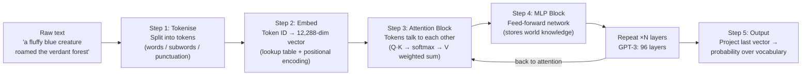
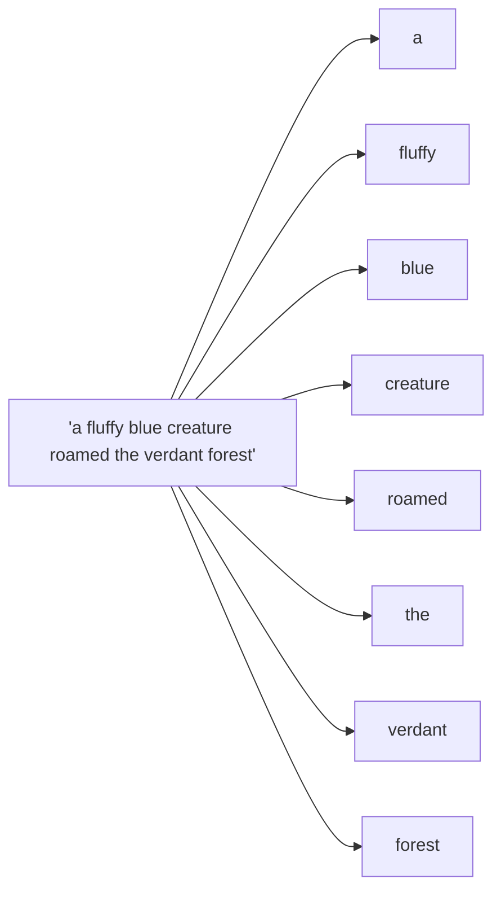
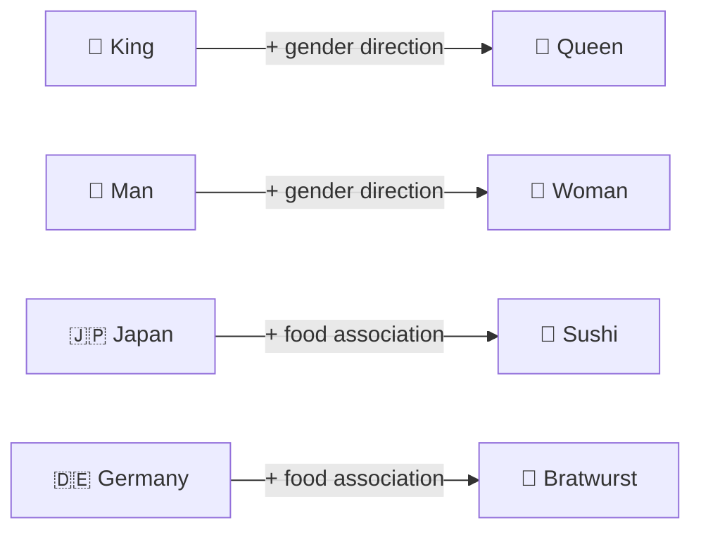
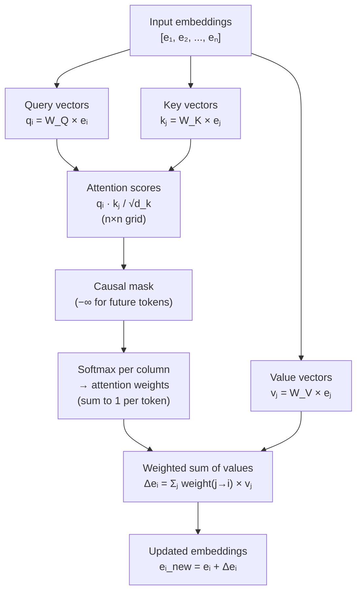
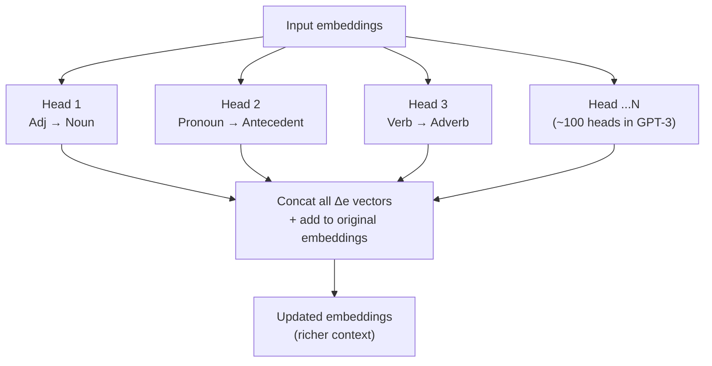
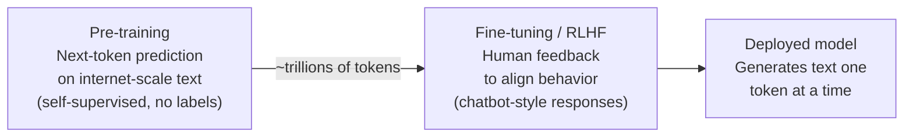

# Transformers & Attention — Visual Study Guide

> Based on: Grant Sanderson (3Blue1Brown). *Visualizing transformers and attention*. TNG Big Tech Day '24.
> Video: https://www.youtube.com/watch?v=KJtZARuO3JY | Series: 3Blue1Brown Deep Learning

---

## TL;DR

- A **transformer** is a function: give it text → it outputs a probability distribution over what token comes next. String this together and you get a chatbot.
- Text is chopped into **tokens** (words/subwords) → each mapped to a high-dimensional **embedding vector** (12,288 dims in GPT-3).
- **Attention** lets every token's vector "talk to" every other token's vector, enriching its meaning with context — *"mole"* in *"one mole of CO₂"* vs. *"the mole on my skin"* encode completely different things by the end.
- Attention uses three learned matrices — **Query (Q), Key (K), Value (V)** — whose job is to ask *what am I looking for?*, answer *what do I contain?*, and then *what should I add?*
- A **single attention head** detects one kind of contextual relationship (e.g., adjective→noun). A full **multi-head attention block** runs ~100 heads in parallel — grammar, co-reference, meaning, tone, all at once.
- After attention comes an **MLP block** — where factual world knowledge lives (e.g., "Michael Jordan plays basketball").
- Stacking attention + MLP layers ~96 times (GPT-3) = progressively richer, context-saturated vectors at the end.
- Transformers dominate because they're **massively parallelisable** (matrix multiplications on GPUs), trained **self-supervised** (no labellers needed), and generalise to **any modality** (text, images, audio — all just tokens).

---

## 1. The Big Picture — What Is a Transformer Doing?

A transformer is a **next-token predictor**. Feed it a string of text; it outputs a probability distribution over all possible next tokens.

```
"To date the cleverest thinker of all time was..."
→ p(Newton)=0.08, p(Einstein)=0.07, p(arguably)=0.05, p(undoubtedly)=0.04, ...
```

**Generating text** = sample from that distribution → append token → run again → repeat.

**Temperature** controls creativity:
- `temperature = 0` → always pick the most likely token → stilted, repetitive output
- `temperature > 0` → random sampling → more natural, creative output

**Building a chatbot** = prepend a system prompt establishing a "helpful AI assistant" persona → append user input → tell the model to generate the assistant's reply → sample token by token.

---

## 2. High-Level Pipeline



The thing that makes deep learning **deep** is this repetition. Each pass through attention + MLP lets vectors absorb richer and richer context. By layer 96, a vector that started as *"one"* now encodes *"one of two roads, symbolising choice, from Robert Frost"* — whatever is needed to predict the next token.

---

## 3. Tokens

**Why tokens, not characters?**

Two reasons:
1. Attention cost scales **quadratically** with sequence length — character-level sequences are ~4× longer → ~16× more computation.
2. Tokens carry *meaning* from the first step. Characters force the network to infer meaning from scratch in early layers.

**Why not full words?**

Very rare words/phrases would almost never appear in training data → can't learn meaningful embeddings for them.

**The sweet spot: Byte-Pair Encoding (BPE)**
- Common words → single token ("the", "king")
- Rarer words → split into subword pieces ("un" + "believ" + "able")
- Punctuation → separate token



---

## 4. Embeddings — Words as Vectors

Each token is mapped to a **high-dimensional vector** — a point in a learned geometric space where meaning has structure.

### 4.1 The Lookup Table

At the start, each token always maps to the same vector (static lookup table). After passing through attention layers, this vector gets enriched with context.

GPT-3 embedding dimension: **12,288** coordinates per token.

### 4.2 Semantic Geometry

Training causes semantically similar words to cluster nearby. But more interestingly, **directions** in the space encode meaning:

```
embedding(woman) − embedding(man) ≈ embedding(queen) − embedding(king)
```

The model learns a *gender direction* such that sliding any word's embedding along it shifts from masculine → feminine.



### 4.3 Why High Dimensions Help — The Superposition Hypothesis

> *Quiz: How many vectors can fit in an N-dimensional space so every pair is perfectly orthogonal?*
> **Answer: exactly N.** That defines dimension.

> *Quiz: How many vectors if they only need to be* almost *orthogonal (88°–92°)?*
> **Answer: exponential in N.** In 100 dimensions → hundreds of thousands of near-orthogonal vectors.

This is why 12,288 dimensions can encode far more than 12,288 distinct concepts — **superposition** packs many more features than the raw dimension count suggests.

### 4.4 Positional Encoding

Because attention has no built-in notion of order, each token's embedding also encodes its **position** in the sequence. This means position is baked into the vector itself — the network doesn't need to process tokens sequentially.

---

## 5. The Attention Mechanism — The Core

Attention allows token vectors to "talk to each other" and update their meanings based on context.

**Motivating example:** the phrase *"a fluffy blue creature roamed the verdant forest."*
- Initially, *creature* only encodes generic creature-ness.
- After attention, it should encode *fluffy blue creature* — having absorbed the adjectives before it.

### 5.1 Three Matrices: Q, K, V

Each attention head has three learned weight matrices:

| Matrix | Symbol | Role | Analogy |
|--------|--------|------|---------|
| **Query** | W_Q | "What am I looking for?" | A question broadcast by this token |
| **Key** | W_K | "What do I contain?" | An answer advertised by each token |
| **Value** | W_V | "What should I add?" | The actual content to transfer |

For every token in the sequence:
```
query = W_Q × embedding   (maps to smaller 64-dim space)
key   = W_K × embedding   (same 64-dim space)
value = W_V × embedding   (maps back to full embedding space)
```

### 5.2 Dot Product = Measuring Alignment

The **dot product** of a query and a key measures how much they "align" (point in the same direction):

```
score(query_i, key_j) = query_i · key_j
```

- **Positive → aligned** → token j is relevant to token i
- **Zero → perpendicular** → unrelated
- **Negative → opposite** → irrelevant / conflicting

In the adjective-noun example: `query(creature)` asks "are there adjectives before me?" — `key(fluffy)` and `key(blue)` point in the same direction, giving high dot products.

### 5.3 Softmax → Attention Weights

Dot products are raw numbers (−∞ to +∞). Convert them to proper weights (0 to 1, sum to 1) with **softmax**:

```
weight(i→j) = softmax(score(query_j, key_i) / √d_k)
```

- Larger dot product → larger weight → more influence
- Division by √d_k: numerical stability (prevents vanishingly small gradients in high dimensions)
- Softmax is differentiable → gradient descent can flow through it

### 5.4 Masking (Causal / Autoregressive Attention)

During training, the model processes the full sequence at once and predicts the next token at every position simultaneously (one training example → thousands of gradient updates).

**Problem:** token at position 5 can "see" token at position 6 and cheat.

**Fix:** set all "future-to-past" attention scores to **−∞** before softmax. After softmax, these become exactly 0. This is **causal masking** (also called masked self-attention).

```
score[i→j] = −∞  if  j > i   (j is later in the sequence than i)
```

### 5.5 Value Weighted Sum → Update the Embedding

Once you know *which* tokens attend to which, use the **value vectors** to compute what change to make:

```
Δembedding(creature) = Σ_j  weight(j→creature) × value(j)
```

For *creature*: only `fluffy` and `blue` have non-zero weights → their value vectors get added together and added to `creature`'s embedding → it now points toward "fluffy blue creature."

### 5.6 Full Single-Head Attention — Summary



---

## 6. Multi-Head Attention

A **single attention head** can only detect one kind of relationship (e.g., adjective-to-noun).

Real language has many concurrent relationships:
- Adverbs modifying verbs
- Pronouns resolving to antecedents
- Subject-verb agreement
- Long-range thematic coherence
- Tone, register, sentiment

**Multi-head attention** runs many independent heads **in parallel**, each with its own W_Q, W_K, W_V:



Each head produces a proposed Δembedding. All proposed changes are added together → the token's vector gets updated with contributions from every relationship type simultaneously.

GPT-3 specifics: **96 heads per layer × 96 layers** = 9,216 attention operations per forward pass.

---

## 7. The MLP Block — Where Facts Live

After each attention block comes a **multi-layer perceptron (MLP)**:
- Simple architecture: two matrix multiplications with a non-linearity between them
- Each token processed **independently** (no cross-token communication here — that's attention's job)

**What lives here?**

DeepMind interpretability researchers found that *factual associations* (e.g., "Michael Jordan → plays basketball") are stored in MLP weights, not attention weights. If that fact can't come from context (it's not in the prompt), it must live somewhere in the parameters — and it's the MLPs.

**The division of labour:**

| Block | Role |
|-------|------|
| **Attention** | Context-sensitive meaning: this *mole* is the animal, not the unit |
| **MLP** | General world knowledge: Jordan plays basketball, Paris is in France |

Despite *"Attention is All You Need"* being the paper title, in terms of raw parameter count, MLPs hold ~⅔ of the model's parameters.

---

## 8. Output — Probability Over Vocabulary

After all N layers of Attention + MLP, the **last token's embedding** has absorbed the full context of the sequence.

A final **linear projection + softmax** maps this vector to a probability distribution over the entire vocabulary (~50,000 tokens for GPT-3):

```
logits = W_output × e_last
probs  = softmax(logits)
```

The highest-probability tokens are the most likely next words. Sample from this distribution (with temperature) to generate the next token.

---

## 9. Training — Learning All Those Weights

The model has **hundreds of billions of tunable parameters** — every entry in every W_Q, W_K, W_V, W_MLP matrix.

### 9.1 Self-Supervised Objective

Training data: massive text scraped from the internet. No human labellers needed.

For each text snippet, the model tries to predict the next token at every position:
```
"TNG technology consulting is a [BLANK]"  →  should predict "leading"
```

### 9.2 Loss Function

**Negative log-likelihood of the correct next token:**

```
loss = −log(p(correct_token))
```

- If model assigns probability ≈ 1 to the correct token → loss ≈ 0
- If model assigns probability ≈ 0 → loss → ∞

Total training loss = average over trillions of examples.

### 9.3 Gradient Descent on a Ridiculous Cost Surface

Imagine a surface where:
- Each axis is one parameter (100 billion axes)
- Height = loss

Training = take tiny downhill steps via **backpropagation** + gradient descent.

Nobody designs what behavior emerges — the model finds whatever local minimum the gradient stumbles into. This is why understanding what a trained model actually does is a fundamentally separate (and largely unsolved) research problem.

### 9.4 Training Efficiency — Why One Example = Thousands of Gradient Updates

Because the model simultaneously predicts next tokens at every position in a sequence:
- One sequence of 2,000 tokens → 2,000 individual prediction tasks
- All processed in parallel on GPUs
- All producing gradients that update the same weights

This is why **scale laws** hold: more data + more parameters + more compute → reliably better models.



---

## 10. Why Transformers Won — Key Properties

### 10.1 Parallelisability

Previous NLP architectures (RNNs, LSTMs) processed text sequentially — token 5 had to wait for tokens 1–4.

Transformers process the whole sequence at once — every token attends to every other token **simultaneously**. This maps perfectly to GPU architecture (massively parallel matrix multiplication).

> More parallelism → more FLOPs per second → can train much bigger models in the same wall-clock time.

### 10.2 Scale Laws (Chinchilla / Kaplan et al.)

Empirically: doubling model size + doubling data → predictable, **qualitative** improvements in capability. These aren't just quantitative bumps — new emergent abilities appear.

Because attention is matrix multiplication (GPU-friendly + differentiable), you can just keep scaling without fundamental architectural changes.

### 10.3 Self-Supervised Pre-training

Next-token prediction is fully self-supervised:
- No human labellers needed for pre-training
- Almost unlimited training data (all text on the internet)
- 99%+ of compute happens here, unsupervised

Human feedback (RLHF) is used afterwards to align style and safety — but requires only a small fraction of the total training budget.

### 10.4 Modality Agnosticism

Tokens don't have to be words. Any discrete chunk of data can be a token:
- Image patches → ViT (Vision Transformer)
- Audio frames → Whisper (speech recognition)
- Code characters → Codex / GitHub Copilot
- Video frames → video models

All modalities become equal citizens in the same embedding space. No bespoke architecture per data type.

---

## 11. Scaling Numbers — GPT-3 Reference

| Parameter | Value |
|-----------|-------|
| Embedding dimension | 12,288 |
| Number of layers | 96 |
| Attention heads per layer | 96 |
| Key/query dimension per head | 128 |
| Total parameters | ~175 billion |
| Vocabulary size | ~50,257 tokens |
| Max context (original) | 2,048 tokens |

---

## 12. Key Concepts Glossary

| Term | Definition |
|------|------------|
| **Token** | The atomic unit of text input — typically a word or subword piece |
| **Embedding** | A high-dimensional vector representation of a token; encodes meaning geometrically |
| **Positional encoding** | Extra information added to the embedding so the model knows where in the sequence a token appears |
| **Attention score** | Dot product of a query and key — measures relevance of one token to another |
| **Softmax** | Converts raw scores → proper probability weights (0–1, sum to 1); differentiable for backprop |
| **Causal masking** | Setting future-token attention scores to −∞ to prevent the model from "cheating" during training |
| **Value vector** | The information that gets transferred from an attending token to the attended token |
| **Multi-head attention** | Running many independent attention heads in parallel, each learning a different type of contextual relationship |
| **MLP block** | Feed-forward network that follows each attention layer; stores factual world knowledge in its weights |
| **Residual connection** | The original embedding is always added back after each block: `e_new = e_old + Δe`; prevents vanishing gradients |
| **Temperature** | Controls randomness in sampling: 0 = always pick top token (deterministic), high = more random |
| **Pre-training** | Self-supervised next-token prediction on massive unlabelled text corpora |
| **RLHF** | Reinforcement Learning from Human Feedback — used after pre-training to align model responses |
| **Superposition hypothesis** | Interpretability idea: models pack far more than N concepts into N dimensions by exploiting near-orthogonal directions |
| **Byte-Pair Encoding (BPE)** | Tokenisation algorithm that merges frequent character pairs into subword tokens |
| **Scale laws** | Empirical relationship between model size, training data, compute, and capability — more of each = better, predictably |

---

## 13. Connection to ISY503 Themes

| Transformer Concept | ISY503 Connection |
|--------------------|-------------------|
| Intelligent behaviour ≠ actual intelligence (Bergstein, R2) | Transformers exhibit remarkable language behaviour but have no common sense, world model, or causal understanding |
| Ethical design / explainability (R5) | Transformers are black boxes — the superposition hypothesis shows even features aren't cleanly separable; XAI is an open research frontier |
| Bias in data (Activity 1, Tay case) | Transformers learn whatever is in their training corpus — biased internet text → biased embeddings; garbage in, garbage out at massive scale |
| Critical thinking: connect code to real world (Berebichez, R3) | "Predicting next tokens" sounds mundane; behind it are billions of real users and real consequences |
| Stakeholder communication (Deshmukh, R1) | Explaining "the model assigns probability distributions" to a non-technical executive is precisely the advanced comms challenge of R4 |

---

*Source: Grant Sanderson (3Blue1Brown). Visualizing transformers and attention, TNG Big Tech Day '24.*
*https://www.youtube.com/watch?v=KJtZARuO3JY*
