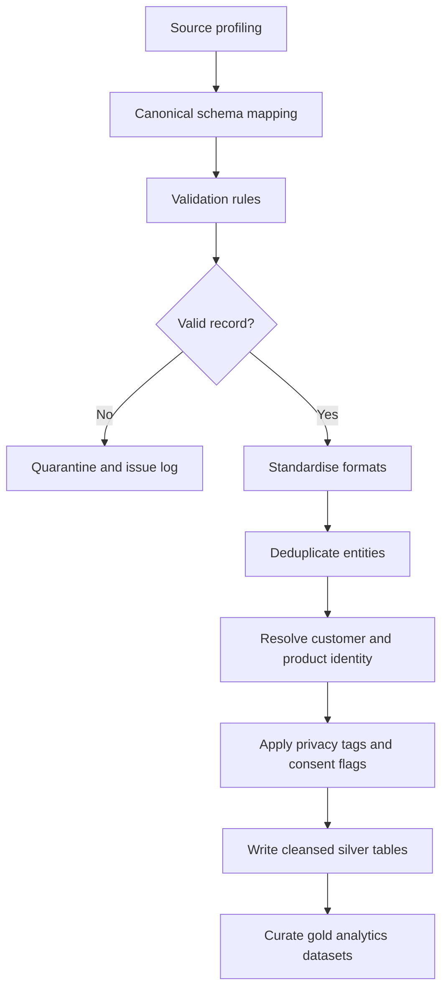
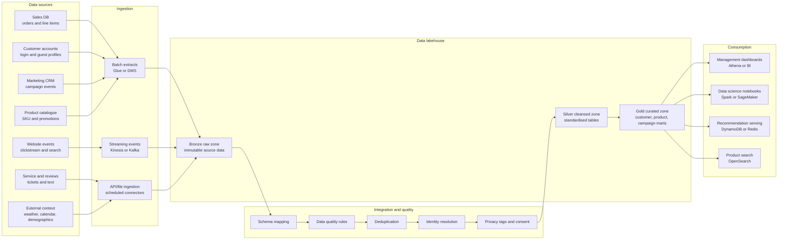
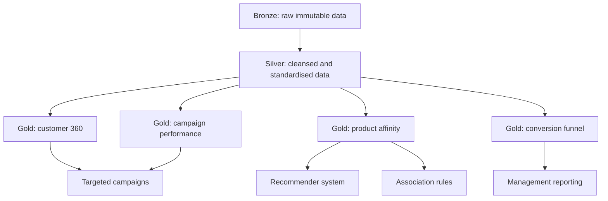
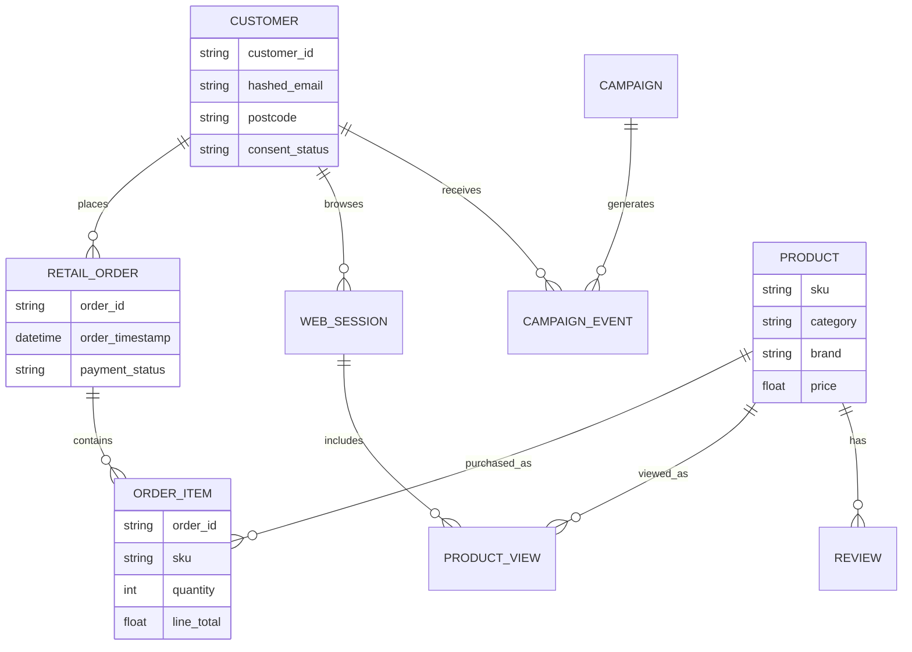

# Big Retail Data Pipeline and Data Lake Design
*BDA601 Big Data and Analytics - Assessment 1 Report Skeleton v1*

## Working Metadata

| Item | Detail |
|---|---|
| Subject | BDA601 - Big Data and Analytics |
| Assessment | Assessment 1 - Design Data Pipeline |
| Case | Big Retail, online retail shop in Adelaide, Australia |
| Length | 1,500 words (+/-10%) |
| Weight | 30% |
| Due | Sunday at end of Module 4; README currently records 28/06/2026 |
| Learning outcomes | SLO a, SLO b, SLO e |
| Current status | v1 scaffold: structure, tables, diagrams, source plan, and draft claims |

---

## Brief Requirements Snapshot

The report must critically analyse the Big Retail case and deliver four visible artefacts:

| Required element | How this skeleton handles it | Evidence target |
|---|---|---|
| Identify data sources aligned to the data-driven strategy | Section 3 data source inventory covers internal and external sources across structured, semi-structured, and unstructured formats | Use Table 2 and add 1-2 explanatory sentences per source category |
| Identify integration challenges and resolutions | Section 4 maps each challenge to a concrete mitigation workflow | Make schema alignment, duplicates, identity resolution, and privacy explicit |
| Design a data lake for storage and retrieval | Section 5 proposes an AWS lakehouse with open-source alternatives | Show storage for all data types, efficient search, and low-latency serving |
| Provide a schematic pipeline diagram | Section 6 includes Mermaid pipeline and lakehouse diagrams | Convert to an image before final submission if Word/PDF is required |

## Rubric Strategy

| Rubric area | Weight | High-distinction move |
|---|---:|---|
| Potential data sources | 25% | Name internal and external sources, classify structure, describe fields, formats, velocity, and business value |
| Integration challenges | 30% | Go beyond "clean data"; show exact steps for schema, dedupe, customer identity, data quality, timestamp, consent, and metadata management |
| Data lake design | 30% | Demonstrate structured, semi-structured, and unstructured storage plus search and low-latency retrieval |
| Diagram and presentation | 15% | Include a clean end-to-end schematic and keep body structure cohesive |

## Suggested Word Budget

| Section | Target words | Notes |
|---|---:|---|
| Executive summary and context | 180-220 | State the business problem and data strategy |
| Data source inventory | 380-430 | Highest scoring area; keep table compact but specific |
| Integration challenges and strategy | 420-470 | Largest section by rubric weight |
| Data lake design and retrieval | 420-470 | Make tool choices defensible |
| Conclusion | 100-130 | Return to targeted campaigns, recommender, product association |
| Total body | 1,500 | Move extended tables and diagrams to appendices if needed |

## Draft Thesis

Big Retail should implement a governed lakehouse-style data pipeline that combines transaction, customer, web behaviour, marketing, product, and external context data into a raw-to-curated data lake. The design should use batch ingestion for stable operational systems, streaming ingestion for clickstream events, explicit data-quality and identity-resolution steps, and a curated serving layer for management dashboards, recommendation models, targeted campaigns, and product association analysis.

---

# Report Draft

## 1. Executive Summary

Big Retail has a clear business problem: website traffic and conversion have fallen even though the company has a cost advantage. Its current static website and separated sales and marketing databases prevent the organisation from using customer behaviour, purchase history, campaign response, and product relationships to personalise the shopping experience. This report proposes a data pipeline and data lake design that can support targeted campaigns, a recommender system, and product association analysis.

The proposed design ingests internal data from sales, marketing, customer accounts, web clickstream, product catalogue, email campaigns, and customer service channels, then enriches it with external data such as location, calendar, weather, competitor pricing, and public review signals. Data is standardised through schema alignment, deduplication, identity resolution, data-quality rules, metadata cataloguing, and privacy controls before being stored in a lakehouse with raw, cleansed, and curated zones. The recommended implementation uses AWS S3 as the data lake, AWS Glue and Apache Spark for transformation, AWS Glue Data Catalog and Lake Formation for governance, Athena or Redshift Spectrum for analytical retrieval, and DynamoDB or OpenSearch as a low-latency serving layer for recommendations and customer/product lookups.

> Refine later: tighten to 150-180 words after the body is final.

## 2. Case Context and Data Strategy Objectives

Big Retail's shift toward big data analytics is justified by the six V's of big data: volume, velocity, variety, veracity, valence, and value. The website already has more than 100,000 visitors per month, giving the organisation enough behavioural volume to detect patterns in browsing, cart abandonment, campaign response, and repeat purchase. However, the current operating model weakens value creation because sales, marketing, and IT hold fragmented data in separate systems. The proposed pipeline follows the analytics lifecycle logic of defining the business problem, preparing data in a controlled analytics environment, and communicating usable outputs to decision makers (EMC Education Services, 2015).

| Business objective | Analytics use case | Data needed | Main audience |
|---|---|---|---|
| Recover website conversion | Funnel and cart-abandonment analysis | Page views, search events, product views, cart events, checkout outcome | Management, marketing, IT |
| Improve campaign targeting | Segmentation and next-best-offer | Customer profile, order history, email opens/clicks, promotion history | Marketing |
| Build recommender system | Personalised products and ranking | Customer-product interactions, purchase history, catalogue metadata, ratings/reviews | Data scientists, website team |
| Discover product association | Market basket analysis | Order line items, product categories, timestamps, campaign context | Merchandising, management |
| Increase customer retention | Churn and customer lifetime value analysis | Repeat purchase cadence, complaints, returns, engagement history | Management, customer service |

> Writing note: add 1-2 citations here from Marr (2021), EMC Education Services (2015), and the BDA module notes to anchor the data-driven strategy and analytics lifecycle.

## 3. Data Source Inventory

Big Retail needs a broad data source inventory because the intended analytics are not possible from transactions alone. Recommenders and targeted campaigns require behavioural, transactional, descriptive, and contextual data. Product association requires reliable order-line data linked to product categories and campaign timing.

**Table 2. Potential data sources for Big Retail**

| Source | Internal or external | Structure | Assumed fields and format | Big data characteristics | Business value |
|---|---|---|---|---|---|
| Sales transaction database | Internal | Structured | `order_id`, `customer_id`, `guest_id`, `sku`, `quantity`, `price`, `discount`, `payment_status`, `order_timestamp`; relational tables or CSV exports | High veracity if controlled; high valence through customer-product-order relationships | Association rules, revenue analysis, conversion measurement |
| Customer account database | Internal | Structured | `customer_id`, name, email, address, postcode, preferences, account creation date; relational tables | PII-sensitive; duplicates likely across sales and marketing systems | Segmentation, personalisation, retention |
| Marketing CRM/email database | Internal | Structured and semi-structured | `campaign_id`, audience segment, send time, open/click/bounce/unsubscribe events; CSV/API/JSON | Medium velocity from campaign events; veracity affected by email client tracking limits | Targeted campaigns and attribution |
| Website clickstream and search logs | Internal | Semi-structured | `session_id`, `visitor_id`, page URL, referrer, search query, product view, cart event, timestamp, device, IP-derived location; JSON events | High volume and velocity; semi-structured; bot noise | Funnel analysis, recommender signals, drop-off diagnosis |
| Product catalogue and promotion data | Internal | Structured and semi-structured | `sku`, category, brand, attributes, stock status, price, images, active promotion, margin; relational/JSON | High variety due to product attributes; frequent changes | Product similarity, offer ranking, stock-aware recommendations |
| Customer service, returns, and reviews | Internal | Structured and unstructured | `ticket_id`, reason code, free-text complaint, return reason, rating, review text; database plus text | Unstructured text with veracity and sentiment issues | Customer pain points, product quality feedback |
| Inventory and fulfilment data | Internal | Structured | `sku`, stock level, warehouse/location, delivery time, stockout flag; relational/API | Operational velocity; must be current for recommendations | Avoid promoting unavailable products |
| Location, demographic, and calendar data | External | Structured | postcode-level population, income bands, holidays, local events; CSV/API | External veracity depends on provider; low velocity | Contextual campaign segmentation |
| Weather data | External | Structured and semi-structured | date, suburb/postcode, temperature, rainfall, weather alerts; API/JSON | Time-series velocity; useful seasonal context | Promotion timing and product demand modelling |
| Competitor pricing and public product signals | External | Semi-structured and unstructured | competitor price, product title, availability, public reviews, social mentions; APIs/scraped text where lawful | High variety; veracity and legality must be managed | Pricing intelligence and demand signals |

**Critical assumptions to confirm later**

| Assumption | Why it matters |
|---|---|
| Logged-in customers and guest checkouts can be linked through hashed email, device/session ID, or later account creation | Enables identity resolution without forcing all visitors to log in |
| Website clickstream events can be added or exported by the IT department | Without behavioural events, recommender and funnel analysis will be weak |
| Marketing and sales databases have overlapping customer fields but inconsistent IDs | Creates a realistic duplicate-resolution challenge required by the rubric |
| External competitor and social data will be collected only through lawful APIs or compliant providers | Avoids privacy, contractual, and data-quality issues |

## 4. Data Integration Challenges and Resolution Strategy

The main integration risk is not the storage technology; it is joining fragmented customer, product, campaign, and event data without creating unreliable identities or privacy exposure. Big Retail should treat integration as a governed pipeline rather than a one-off data dump.

**Table 3. Integration challenges and resolution steps**

| Challenge | Why it appears in Big Retail | Resolution strategy | Output artefact |
|---|---|---|---|
| Schema alignment | Sales, marketing, website, and catalogue systems likely use different field names, data types, and product/customer identifiers | Define canonical schemas for `customer`, `product`, `order`, `campaign`, and `event`; validate incoming data against data contracts | Versioned schema registry and canonical entity model |
| Duplicate customers | Customers may appear in sales and marketing systems, and guest users may later create accounts | Use deterministic matching on hashed email/account ID, then cautious fuzzy matching on name, address, and phone; maintain confidence scores | Master customer table with source links |
| Guest checkout identity | Guest purchases may not map cleanly to web sessions or later accounts | Store privacy-safe `guest_id`, session ID, hashed email where available, and linkage timestamps | Identity graph with transparent lineage |
| Product identifier inconsistency | Product SKUs, catalogue names, and promotion IDs may change over time | Create a product master with stable `sku`, category hierarchy, attributes, and slowly changing dimensions | Product dimension table |
| Batch and streaming mismatch | Transaction and CRM databases are batch-oriented, while clickstream events arrive continuously | Use batch ingestion or CDC for databases and streaming ingestion for web events; watermark and reconcile late-arriving events | Bronze landing zone plus event-time processing rules |
| Data quality and missing values | Address formats, timestamps, duplicate events, bot traffic, and incomplete profiles can distort analysis | Apply validation rules, standardise timestamps to AEST/UTC convention, dedupe event IDs, filter bots, and quarantine invalid records | Data-quality scorecard and quarantine table |
| Privacy and consent | Customer accounts, marketing activity, and behavioural logs contain personal information | Apply data minimisation, encryption, role-based access, consent flags, masking, retention rules, and audit logging aligned to Australian privacy principles | Privacy control matrix and access policy |
| External data reliability | Weather, competitor, and public review data may have inconsistent refresh rates and quality | Record source, extraction time, licence, reliability score, and refresh cadence in metadata | External source register |

**Integration workflow**

*Figure 1. Data integration workflow from source profiling to curated analytics datasets.*

## 5. Proposed Data Lake Storage and Retrieval Design

### 5.1 Recommended Architecture

The recommended v1 design is a lakehouse on cloud object storage. This fits Big Retail because a data lake can store structured and unstructured data at scale and make it available for dashboards, big data processing, real-time analytics, and machine learning (Amazon Web Services, n.d.-a). An AWS implementation is proposed because it combines commercial managed services with open-source-compatible formats and Spark processing.

**Table 4. Proposed storage and retrieval stack**

| Layer | Recommended tool | Open-source equivalent | Role in the design |
|---|---|---|---|
| Batch ingestion | AWS Glue jobs or AWS DMS | Airbyte, Meltano, Debezium | Import sales, marketing, catalogue, and CRM data |
| Streaming ingestion | Amazon Kinesis or Kafka | Apache Kafka | Capture clickstream, search, cart, and checkout events |
| Raw storage | Amazon S3 | MinIO or HDFS | Durable object storage for all raw files |
| Processing | AWS Glue Spark or EMR Spark | Apache Spark | Clean, join, aggregate, and create feature tables |
| Table format | Apache Iceberg or Delta Lake | Apache Iceberg or Delta Lake | ACID-style lakehouse tables, schema evolution, time travel |
| Metadata catalogue | AWS Glue Data Catalog | Hive Metastore, OpenMetadata | Searchable datasets, schemas, ownership, lineage |
| Governance | AWS Lake Formation | Apache Ranger | Fine-grained access controls and auditability |
| Analytical retrieval | Amazon Athena and Redshift Spectrum | Trino or Presto | SQL access for management dashboards and analyst exploration |
| Low-latency serving | DynamoDB, OpenSearch, or ElastiCache | Cassandra, OpenSearch, Redis | Fast product/customer/recommendation lookup for website use |
| ML and BI consumers | SageMaker, Amazon Personalize, QuickSight | Spark MLlib, scikit-learn, Superset | Recommenders, association rules, dashboards |

### 5.2 Lake Zones

**Table 5. Lakehouse zones**

| Zone | Purpose | Stored examples | Format | Access pattern |
|---|---|---|---|---|
| Raw or bronze | Preserve original source data for audit and replay | Source database extracts, raw clickstream JSON, campaign API payloads, review text | CSV, JSON, Avro, images/text where relevant | Restricted engineering access |
| Cleansed or silver | Standardised, deduplicated, privacy-tagged data | Master customer, master product, cleaned orders, standardised events | Partitioned Parquet tables | Data engineering and data science |
| Curated or gold | Business-ready marts and features | Customer 360, product affinity matrix, campaign performance, recommendation features | Parquet/Iceberg or Delta tables | BI, ML, management reporting |
| Serving indexes | Fast retrieval for live use cases | Top-N recommendations, customer segment, product search index | Key-value or search index | Low-latency website/API retrieval |

### 5.3 Retrieval Design

Efficient retrieval should be separated into two patterns. For analytical retrieval, managers and data scientists use SQL engines such as Athena, Redshift Spectrum, or Trino over partitioned Parquet/Iceberg tables. Athena is appropriate for ad-hoc SQL analysis over S3 data without managing query infrastructure (Amazon Web Services, n.d.-d). Tables should be partitioned by date, source, and major business entities such as product category where query patterns justify it. This supports dashboard reporting, campaign evaluation, basket analysis, and exploratory modelling.

For low-latency operational retrieval, the data lake should publish selected gold outputs into serving stores. For example, a recommender model can write precomputed `customer_id -> top_product_ids` records into DynamoDB or Redis, while product search and review text can be indexed in OpenSearch. This avoids forcing the live website to query raw lake files during checkout or browsing, while keeping the data lake as the governed source of truth.

### 5.4 Security, Privacy, and Governance

**Table 6. Security and privacy controls**

| Control | Design decision |
|---|---|
| Data minimisation | Ingest only fields needed for campaign, recommendation, association, and reporting use cases |
| Encryption | Encrypt data in transit and at rest across ingestion, storage, query, and serving layers |
| Access control | Use role-based access: management sees aggregated reports; data scientists receive de-identified analytical datasets; engineers administer pipelines |
| PII handling | Hash emails, mask direct identifiers, separate identity tables from behaviour tables, and tag sensitive columns |
| Consent and marketing preference | Store opt-in, opt-out, unsubscribe, and consent timestamps as first-class fields |
| Audit and lineage | Catalogue each dataset with owner, source, refresh cadence, transformation lineage, and retention period |
| Retention | Define retention windows for clickstream, marketing logs, support text, and derived features |

## 6. Overall Data Pipeline Schematic

*Figure 2. End-to-end Big Retail data pipeline and data lakehouse design.*

*Figure 3. Raw-to-curated lakehouse zones and business outputs.*

## 7. Conclusion

Big Retail's data-driven strategy depends on integrating fragmented customer, sales, marketing, product, website, and contextual data into a governed pipeline. The proposed lakehouse design satisfies the assessment's big data requirements because it can store structured transaction tables, semi-structured clickstream and API data, and unstructured reviews or support text. It also supports efficient retrieval through catalogue-backed SQL query engines and low-latency operational access through serving indexes. Most importantly, the design links technology choices back to business value: better campaign targeting, personalised recommendations, product association insights, and improved conversion recovery.

---

# Appendices

## Appendix A - Rubric Checklist

| Checklist item | Status |
|---|---|
| Internal data sources named | Drafted |
| External data sources named | Drafted |
| Structured data examples included | Drafted |
| Semi-structured data examples included | Drafted |
| Unstructured data examples included | Drafted |
| Data fields and formats listed | Drafted |
| Schema alignment challenge explained | Drafted |
| Duplicate and identity challenge explained | Drafted |
| Privacy and consent challenge explained | Drafted; verify against OAIC APP guidance |
| Storage of all data types demonstrated | Drafted |
| Efficient search demonstrated | Drafted |
| Low-latency retrieval demonstrated | Drafted |
| Pipeline schematic included | Drafted |
| APA references verified | To do |
| Final word count 1,350-1,650 | To do |

## Appendix B - Big Data V's Mapped to Big Retail

| V | Big Retail interpretation | Design response |
|---|---|---|
| Volume | More than 100,000 monthly visitors plus transactions, emails, events, and product data | Object storage, partitioned lake tables, Spark processing |
| Velocity | Clickstream and cart events arrive continuously; sales and marketing data arrive in batches | Streaming plus batch ingestion |
| Variety | Relational transactions, JSON clickstream, text reviews, API data, catalogue media | Lake zones accept structured, semi-structured, and unstructured data |
| Veracity | Duplicate customers, bot traffic, missing fields, inconsistent product names | Data-quality rules, dedupe, source reliability metadata |
| Valence | Customers connect to sessions, campaigns, orders, products, reviews, and categories | Identity graph and product/customer master tables |
| Value | Data must improve campaigns, recommendations, associations, and conversion | Gold marts and serving features aligned to business objectives |

## Appendix C - Entity Model Starter

*Figure 4. Starter entity model for customer-product-order-campaign analysis.*

## Appendix D - Next Draft Tasks

1. Confirm whether the lecturer expects a strict report-only format or allows appendices.
2. Decide whether to keep the AWS implementation or swap to a more open-source stack: Kafka, Spark, Delta Lake or Iceberg, Trino, Superset, OpenMetadata.
3. Add 6-10 final APA references and verify each in-text citation.
4. Convert Mermaid diagrams to PNG/SVG if submitting as DOCX/PDF.
5. Compress the body to 1,500 words and move excess detail to appendices.
6. Add a final "limitations and assumptions" sentence to show critical analysis.

---

# Reference Starter List

Amazon Web Services. (n.d.-a). *What is a data lake?* https://aws.amazon.com/what-is/data-lake/

Amazon Web Services. (n.d.-b). *AWS Glue Documentation*. https://docs.aws.amazon.com/glue/

Amazon Web Services. (n.d.-c). *AWS Lake Formation Documentation*. https://docs.aws.amazon.com/lake-formation/

Amazon Web Services. (n.d.-d). *Amazon Athena Documentation*. https://docs.aws.amazon.com/athena/

Apache Kafka. (n.d.). *Apache Kafka documentation*. https://kafka.apache.org/documentation/

Apache Iceberg. (n.d.). *Apache Iceberg documentation*. https://iceberg.apache.org/docs/latest/

Apache Spark. (n.d.). *Structured Streaming Programming Guide*. https://spark.apache.org/docs/latest/structured-streaming-programming-guide.html

Delta Lake. (n.d.). *Delta Lake documentation*. https://docs.delta.io/

EMC Education Services. (2015). *Data science and big data analytics: Discovering, analyzing, visualizing and presenting data*. John Wiley & Sons.

HEAVY.AI. (n.d.). *Big data analytics - A complete introduction*. https://www.heavy.ai/learn/big-data-analytics

Marr, B. (2021). *Data strategy: How to profit from a world of big data, analytics and artificial intelligence* (2nd ed.). Kogan Page.

Office of the Australian Information Commissioner. (n.d.). *Australian Privacy Principles*. https://www.oaic.gov.au/privacy/australian-privacy-principles

Torrens University Australia. (2024). *BDA601 Assessment 1 brief: Design data pipeline*.
