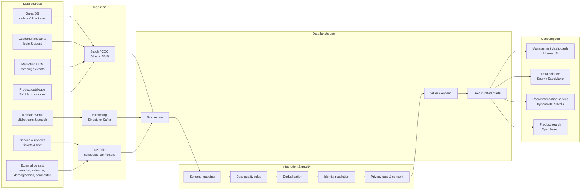
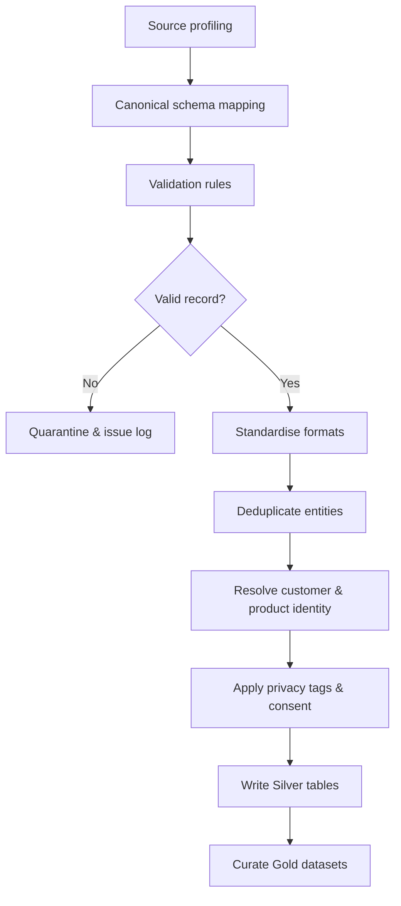
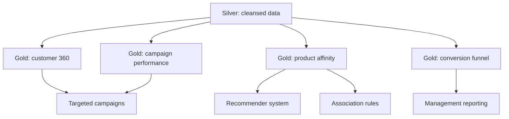

# Designing a Big Data Pipeline and Data Lake for Big Retail

*BDA601 Big Data and Analytics - Assessment 1 - Report (v3, submission-ready draft)*

| Item | Detail |
|---|---|
| Subject | BDA601 - Big Data and Analytics |
| Assessment | Assessment 1 - Design Data Pipeline (Big Retail case) |
| Length | 1,500 words (±10%); tables, figures, appendices, and the AI-acknowledgement excluded from the count |
| Weight | 30% |
| Due | 11.55 pm AEST, Sunday end of Module 4 - 28/06/2026 |
| SLOs assessed | a) evaluate the V's · b) collection/storage + security & privacy · e) communicate findings |

**How each section maps to the rubric** (the spine I write to, not part of the submission):

| Section | Rubric attribute | Weight | HD-band target |
|---|---|---:|---|
| §3 Data sources | Potential data sources | 25% | Internal **and** external; structured, semi-structured **and** unstructured; described characteristics/formats |
| §4 Integration | Identify & resolve integration challenges | 30% | All major issues **named** - schema alignment and duplicates first - each with a resolution step |
| §5 Data lake | Storage & retrieval design | 30% | Stores structured **+** semi/unstructured; efficient search; **and** low-latency retrieval |
| §6 + diagram | Diagram & presentation | 15% | Schematic shows sources → integration → lake components → interactions; cohesive prose |
| §2 | SLO a | - | Each V **evaluated** against Big Retail, not just listed |
| §5.4 | SLO b | - | Security/privacy tied to OAIC Australian Privacy Principles |

---

# Report

## 1. Executive summary

Big Retail, an Adelaide online retailer with more than 100,000 monthly website visitors, has lost sales and conversion despite holding a cost advantage (Torrens University Australia, 2024). The root cause is structural rather than commercial: a static website serves identical content to every visitor, while customer, sales, and marketing data sit in separate departmental databases that cannot be combined to personalise the experience. This report designs the data pipeline that must precede any analytics work. It identifies the internal and external data sources aligned to Big Retail's data-driven goals (targeted campaigns, a recommender system, and product association), articulates the integration challenges that must be resolved before storage, and specifies a governed lakehouse-style data lake on AWS - with open-source equivalents - that stores structured, semi-structured, and unstructured data and serves it efficiently to both managers and data scientists. Key technical terms used throughout are defined in Appendix A.

## 2. Data strategy and the six V's for Big Retail

A data-driven strategy must start from the business problem, not the technology: data projects fail when tools are chosen before the organisation is clear on *why* the work matters (Marr, 2021). For Big Retail the "why" is conversion recovery through personalisation. Evaluating the six V's shows which characteristics actually drive the design rather than treating them as a checklist (Rutherford, 2017).

- **Volume** - moderate but sufficient: 100,000+ monthly visitors plus transactions, emails, and catalogue data give enough behavioural signal for pattern detection. Volume justifies object storage and distributed (Spark) processing but is not the binding constraint.
- **Velocity** - selectively important: only clickstream and cart events are continuous; sales, CRM, and catalogue data are batch. The design therefore needs streaming **and** batch ingestion, not streaming everywhere.
- **Variety** - a primary challenge: relational transactions, JSON clickstream, API feeds, and free-text reviews must coexist, which is precisely what a data lake (not a warehouse) is built to hold.
- **Veracity** - a primary challenge: duplicate customers across sales and marketing systems, guest-checkout gaps, and bot traffic threaten every downstream model, so data quality is treated as a first-class pipeline stage.
- **Valence** - the value unlock: the recommender and product-association use cases depend on *connecting* customers to sessions, orders, products, and campaigns. Raising valence through identity resolution is where most analytical value is created.
- **Value** - the anchor: every source and component below is justified only by its contribution to campaigns, recommendations, association rules, or conversion reporting.

In short, Variety, Veracity, and Valence - not raw Volume - dominate Big Retail's design. Appendix D maps each V to its design response.

## 3. Potential data sources

The intended analytics cannot run on transactions alone; recommenders and targeted campaigns need behavioural, descriptive, and contextual data, and product association needs reliable order-line data linked to categories and campaign timing. The inventory below spans **internal and external** sources and all three structure types. Fields and formats are reasonable assumptions for an online retailer of this size.

**Table 1. Big Retail data-source inventory**

| Source | Int/Ext | Structure | Assumed fields & format | Business value |
|---|---|---|---|---|
| Sales transaction DB | Internal | Structured | `order_id, customer_id, guest_id, sku, qty, price, discount, payment_status, order_ts`; relational / CSV | Association rules, revenue, conversion |
| Customer account DB | Internal | Structured | `customer_id, name, email, address, postcode, prefs, created_at`; relational (PII-sensitive) | Segmentation, personalisation, retention |
| Marketing / email CRM | Internal | Structured + semi | `campaign_id, segment, send_ts, open/click/bounce/unsub events`; CSV / JSON / API | Targeted campaigns, attribution |
| Website clickstream & search logs | Internal | Semi-structured | `session_id, visitor_id, url, referrer, query, product_view, cart_event, ts, device, geo`; JSON events | Funnel analysis, recommender signals |
| Product catalogue & promotions | Internal | Structured + semi | `sku, category, brand, attributes, stock, price, images, promo, margin`; relational / JSON | Similarity, offer ranking, stock-aware recs |
| Customer service, returns & reviews | Internal | Structured + **unstructured** | `ticket_id, reason_code, free-text complaint, return_reason, rating, review_text`; DB + text | Pain points, sentiment, product feedback |
| Location / demographic / calendar | External | Structured | postcode population, income bands, holidays, local events; CSV / API | Contextual campaign segmentation |
| Weather | External | Structured + semi | date, postcode, temperature, rainfall, alerts; API / JSON | Promotion timing, demand modelling |
| Competitor pricing & public signals | External | Semi + **unstructured** | competitor price, title, availability, public reviews / social mentions; API / lawful scrape | Pricing intelligence, demand signals |

These sources fall into four characteristic groups. **Transactional and account data** (sales DB, customer accounts) are highly structured, low-velocity, and high-veracity when controlled, but PII-sensitive and prone to duplication across the sales and marketing systems - they anchor revenue analysis and segmentation. **Behavioural data** (clickstream, search, cart events) is the highest-velocity and highest-volume source; it arrives as semi-structured JSON, carries bot noise, and is the raw signal for funnel analysis and the recommender, yet it depends on the IT team being able to emit or export events. **Descriptive data** (product catalogue, promotions) is a mix of structured attributes and semi-structured media that changes frequently and must be treated as a slowly changing dimension so recommendations stay stock-aware. **Contextual and unstructured data** (reviews, complaint text, weather, demographics, competitor signals) adds the variety that lifts personalisation beyond transactions but brings the weakest veracity and the clearest legal constraints, so it is enriched cautiously.

Together these cover **structured** (transactions, accounts, catalogue), **semi-structured** (clickstream, CRM events, weather/API payloads), and **unstructured** (review text, complaint notes, competitor/social signals) data - the full spread the recommender, campaign, and association use cases require, and the spread a warehouse alone could not hold.

## 4. Data integration challenges and resolution strategy

The hard problem is not storage; it is joining fragmented customer, product, campaign, and event data without fabricating false identities or exposing personal information. Integration is therefore treated as a *governed* stage, not a one-off load - the data-preparation work that, more than the modelling itself, determines the quality and credibility of every downstream result (EMC Education Services, 2015). Schema alignment and duplicate resolution - the two challenges the rubric names explicitly - head the list.

**Table 2. Integration challenges and resolution steps**

| Challenge | Why it appears at Big Retail | Resolution step | Output artefact |
|---|---|---|---|
| **Schema alignment** | Sales, marketing, web, and catalogue systems use different field names, types, and IDs | Define canonical `customer / product / order / campaign / event` schemas; validate incoming data against data contracts | Versioned schema registry + canonical model |
| **Duplicate customers** | Same customer in sales **and** marketing DBs; guests later create accounts | Deterministic match on hashed email / account ID, then *cautious* fuzzy match on name/address/phone with confidence scores | Master customer table with source lineage |
| Guest-checkout identity | Guest orders may not map to web sessions or later accounts | Store privacy-safe `guest_id`, session ID, hashed email, and linkage timestamps | Identity graph with transparent lineage |
| Batch vs streaming mismatch | DB/CRM are batch; clickstream is continuous | Batch/CDC for databases, streaming for events; watermark and reconcile late events on event-time | Bronze landing zone + event-time rules |
| Data quality | Address formats, bot traffic, duplicate events, missing profiles | Validation rules, standardise timestamps to UTC/AEST, dedupe event IDs, filter bots, quarantine bad records | Data-quality scorecard + quarantine table |
| Privacy & consent | Accounts, campaigns, and logs hold PII | Minimisation, encryption, role-based access, consent flags, masking, retention, audit logging (OAIC APPs) | Privacy control matrix |
| External-source reliability | Weather/competitor/review feeds refresh unevenly | Record source, extraction time, licence, reliability score, refresh cadence | External source register |

The two challenges the rubric names deserve fuller treatment. **Schema alignment** fails silently rather than loudly: the sales DB may call a key `cust_id` while marketing calls it `customer_ref` and the catalogue keys products by an internal `item_code` that the promotions feed does not share. Resolving this means agreeing canonical entities (`customer`, `product`, `order`, `campaign`, `event`), publishing them in a versioned schema registry, and validating each incoming feed against a data contract so a renamed or retyped field is rejected at ingestion rather than corrupting a join downstream. **Duplicate customers** are the costlier problem because the case explicitly allows the same person to exist in both the sales and marketing databases and to move between guest checkout, a new account, and an existing login. Resolution is staged: a deterministic pass matches on hashed email or account ID first, and only unmatched records fall through to a cautious fuzzy pass on name, address, and phone, every match carrying a confidence score and full source lineage so a merge can be audited or reversed.

Beyond those two, two resolutions carry real trade-offs worth stating. **Identity matching** must favour precision over recall: aggressive fuzzy matching merges distinct customers, corrupting both recommendations and privacy boundaries, so low-confidence matches are flagged rather than merged. **Batch-vs-streaming** is not a free choice either - streaming everything adds cost and operational complexity for data (sales, catalogue) that changes slowly, so streaming is reserved for clickstream where latency genuinely matters. The end-to-end flow is shown in **Figure 1**; Appendix B (Figure B1) expands the integration stage into its step-by-step validation and resolution sequence.

**Figure 1. End-to-end Big Retail data pipeline and lakehouse (primary schematic).**

## 5. Data lake design: storage, retrieval, security

### 5.1 Architecture

The recommended design is a **lakehouse on cloud object storage**, because a data lake can hold structured and unstructured data at scale and expose it for dashboards, batch processing, and machine learning (Amazon Web Services, n.d.-b). AWS is proposed as the primary stack - Big Retail's team already meets the CCF501 cloud prerequisite - with open-source equivalents listed so the design is portable and not locked in.

**Table 3. Storage and retrieval stack**

| Layer | AWS (primary) | Open-source equivalent | Role |
|---|---|---|---|
| Batch ingestion | Glue / DMS | Airbyte, Debezium | Import sales, CRM, catalogue |
| Streaming ingestion | Kinesis | Apache Kafka | Clickstream, cart, checkout events |
| Raw storage | Amazon S3 | MinIO / HDFS | Durable object storage, all raw files |
| Processing | Glue / EMR Spark | Apache Spark | Clean, join, aggregate, feature build |
| Table format | Iceberg / Delta | Iceberg / Delta | ACID tables, schema evolution, time travel |
| Catalogue | Glue Data Catalog | Hive Metastore, OpenMetadata | Searchable schemas, ownership, lineage |
| Governance | Lake Formation | Apache Ranger | Fine-grained access, audit |
| Analytical query | Athena / Redshift Spectrum | Trino / Presto | SQL for dashboards and analysts |
| Low-latency serving | DynamoDB / OpenSearch | Cassandra / Redis / OpenSearch | Fast recommendation & product lookup |

The AWS-vs-open-source choice is a genuine trade-off: managed services cut operational burden and speed delivery but add cost and vendor lock-in, whereas the open-source stack lowers licensing cost at the price of in-house operations. Open table formats (Iceberg/Delta) and S3-compatible storage keep migration feasible either way.

### 5.2 Lake zones

Data moves through three governed zones plus a serving tier, which is what lets the lake hold every structure type while still serving fast queries:

| Zone | Purpose | Examples | Format |
|---|---|---|---|
| Bronze (raw) | Immutable source data for audit/replay | DB extracts, raw clickstream JSON, review text | CSV, JSON, Avro, text |
| Silver (cleansed) | Standardised, deduplicated, privacy-tagged | Master customer/product, cleaned orders, standardised events | Partitioned Parquet |
| Gold (curated) | Business-ready marts and features | Customer 360, product-affinity matrix, campaign performance | Iceberg / Delta |
| Serving | Fast retrieval for live use | Top-N recommendations, product search index | Key-value / search index |

### 5.3 Retrieval

Retrieval is split to satisfy both audiences and both rubric retrieval requirements. **Efficient search** for managers and data scientists uses SQL engines (Athena, Redshift Spectrum, or Trino) over Parquet/Iceberg tables partitioned by date, source, and category (Amazon Web Services, n.d.-a). **Low-latency retrieval** for the live site is served from precomputed gold outputs pushed into DynamoDB/Redis (e.g. `customer_id → top_product_ids`) and OpenSearch for product/review search - so the website never queries raw lake files during checkout, while the lake stays the governed source of truth.

### 5.4 Security and privacy (SLO b)

Because accounts, campaign data, and behavioural logs contain personal information, collection and storage follow data-protection best practice aligned to the **Australian Privacy Principles** (Office of the Australian Information Commissioner, n.d.): **minimise** to only the fields each use case needs; **encrypt** in transit and at rest; enforce **role-based access** (managers see aggregates, scientists see de-identified analytical sets, engineers administer pipelines); **hash/mask** direct identifiers and separate identity tables from behaviour tables; store **consent** state as first-class fields; and **catalogue** every dataset with owner, lineage, and retention period for auditability.

## 6. Assumptions, limitations, and conclusion

The design rests on assumptions to confirm with Big Retail: that the IT team can export or emit clickstream events; that guests can be linked via hashed email, device/session ID, or later sign-up; that sales and marketing share overlapping (if inconsistent) customer fields; and that external competitor/social data is collected only through lawful APIs or compliant providers. Its limitations are honest ones - identity resolution will never be perfect for guest traffic, external feeds carry variable veracity, and the lakehouse adds operational cost that only pays off once the recommender and campaign use cases are live. Subject to those caveats, the proposed pipeline ingests Big Retail's fragmented internal and external sources, resolves schema and duplicate-identity challenges before storage, and lands data in a governed lakehouse that stores structured, semi-structured, and unstructured data while serving both analytical and low-latency retrieval. Crucially, every component traces back to business value: targeted campaigns, personalised recommendations, product-association insight, and recovered conversion - Appendix C (Figure C1) maps each curated dataset to the business outcome it serves.

---

# References

Amazon Web Services. (n.d.-a). *Amazon Athena documentation*. https://docs.aws.amazon.com/athena/

Amazon Web Services. (n.d.-b). *What is a data lake?* https://aws.amazon.com/what-is/data-lake/

EMC Education Services. (2015). *Data science and big data analytics: Discovering, analyzing, visualizing and presenting data*. John Wiley & Sons.

Marr, B. (2021). *Data strategy: How to profit from a world of big data, analytics and artificial intelligence* (2nd ed.). Kogan Page.

Office of the Australian Information Commissioner. (n.d.). *Australian Privacy Principles*. https://www.oaic.gov.au/privacy/australian-privacy-principles

Rutherford, A. (2017, February 21). *What is big data?* [Video]. YouTube. https://www.youtube.com/watch?v=91tncL3gA6I

Torrens University Australia. (2024). *BDA601 Assessment 1 brief: Design data pipeline*.

---

# Appendices

## Appendix A - Glossary

| Term | Definition |
|---|---|
| Data lake | A store-all repository that holds raw data of any structure until it is needed, applying structure on read. |
| Lakehouse | An architecture that adds warehouse-style ACID tables and SQL querying on top of a data lake's low-cost object storage. |
| Schema-on-read | Structure is applied when data is queried, not when it is stored (contrast schema-on-write in a warehouse). |
| Medallion (Bronze / Silver / Gold) | Layered lake zones: raw landing (Bronze), cleansed and standardised (Silver), business-ready marts (Gold). |
| ELT (land-then-validate) | Load raw data first, then transform and validate it inside the lake (contrast ETL). |
| CDC (Change Data Capture) | Ingesting only the records that changed since the last load, instead of re-copying whole tables. |
| Identity resolution | Linking records that refer to the same customer across sources, despite inconsistent or missing IDs. |
| Event-time watermark | A threshold defining how late a streaming event may arrive before its processing window closes. |
| PII | Personally identifiable information (names, emails, addresses) requiring privacy controls. |
| OAIC APPs | The Australian Privacy Principles, the national baseline for handling personal information. |
| Lineage | A record of where a dataset came from and how it was transformed, used for audit and trust. |
| Parquet / Iceberg / Delta | Columnar file and ACID table formats used for efficient analytical storage in the lake. |

## Appendix B - Integration workflow

Figure B1 expands the "Integration & quality" stage of Figure 1 into its step-by-step validation and entity-resolution sequence, including the quarantine path for records that fail validation.

**Figure B1. Integration workflow (source profiling → curated).**

## Appendix C - Curated datasets and business value

Figure C1 traces how curated (Gold) datasets map to Big Retail's target business outcomes, showing the line of sight from cleansed data to campaigns, recommendations, association rules, and management reporting.

**Figure C1. Curated outputs to business value.**

## Appendix D - The six V's mapped to Big Retail

This table cross-references the evaluation in §2: each V is mapped to its Big Retail interpretation, the concrete design response, and the severity that drives the design.

| V | What it means for Big Retail | Design response | Severity here |
|---|---|---|---|
| Volume | 100,000+ monthly visitors plus transactions, emails, catalogue, and events | S3 object storage and distributed Spark processing | Moderate - not the binding constraint |
| Velocity | Clickstream and cart events are continuous; sales, CRM, and catalogue are batch | Streaming (Kinesis/Kafka) for events plus batch/CDC for databases | Selective |
| Variety | Relational, JSON, API, and free-text data must coexist | Lakehouse zones store structured, semi-structured, and unstructured data | Primary |
| Veracity | Duplicate customers, guest-checkout gaps, and bot traffic | Data-quality rules, deduplication, identity resolution, and quarantine | Primary |
| Valence | Customers link to sessions, orders, products, and campaigns | Identity graph plus customer and product master tables | Primary (value unlock) |
| Value | Every component must serve a business outcome | Gold marts and serving features tied to campaigns, recommendations, association, and conversion | Anchor |

---

# Statement of Acknowledgement

I acknowledge that I have used the following AI tool(s) in the creation of this report:
- Anthropic Claude Opus 4.8

This tool was used to assist with understanding big data concepts, evaluating the six V's against the Big Retail case, structuring the data pipeline and data lake design, improving the clarity of academic language, and supporting APA 7th referencing conventions.

Prompt examples:
1. "For the Big Retail case, which of the six V's of big data most constrain the pipeline design, and how should each map to a concrete design response?"
2. "My data lake validates records after landing them raw in a Bronze zone, while the textbook validates at a Transient Landing zone before Raw - when is each correct, and how do I frame the trade-off critically?"
3. "Format this as APA 7th: Marr, Bernard (2021), Data Strategy, 2nd edition, Kogan Page."

I confirm that the use of these tools has been in accordance with the Torrens University Australia Academic Integrity Policy and the TUA, Think and MDS Position Paper on the Use of AI. I confirm that the final output is authored by me and represents my own critical thinking, analysis, and synthesis of sources. I take full responsibility for the final content of this report.

---

# Planning companion (not part of submission)

## Rubric self-check

| Rubric attribute | Weight | Status in v3 |
|---|---:|---|
| Internal **and** external sources named | 25% | ✅ §3 Table 1 |
| Structured, semi-structured **and** unstructured identified | 25% | ✅ §3 (spread called out in prose) |
| Characteristics, fields, formats described | 25% | ✅ §3 Table 1 |
| Schema alignment + duplicates named first | 30% | ✅ §4 Table 2 (top two rows) |
| All major integration issues + resolution steps | 30% | ✅ §4 Table 2 + trade-off prose |
| Lake stores structured data | 30% | ✅ §5.2 Bronze/Silver/Gold |
| Lake stores semi/unstructured data | 30% | ✅ §5.1–5.2 |
| Efficient search | 30% | ✅ §5.3 (Athena/Trino) |
| Low-latency retrieval | 30% | ✅ §5.3 (DynamoDB/Redis/OpenSearch) |
| Schematic: sources → integration → lake → interactions | 15% | ✅ Figure 1 (in §4 body) |
| Six V's **evaluated** (SLO a) | - | ✅ §2 |
| Security/privacy → OAIC APPs (SLO b) | - | ✅ §5.4 |
| APA citations ↔ references reconciled | - | ✅ all 7 refs cited; AWS n.d. order fixed; Rutherford date corrected |
| Body word count 1,350–1,650 | - | ✅ 1,478 (prose; tables/figures/appendices/acknowledgement excluded) |

## Word budget (body only; tables/figures/appendices/acknowledgement excluded)

| Section | Target | Actual |
|---|---:|---:|
| §1 Executive summary | 150–180 | 144 |
| §2 Six V's | 220–270 | 255 |
| §3 Data sources (prose) | 250–300 | 251 |
| §4 Integration (prose) | 300–340 | 337 |
| §5 Data lake (prose) | 300–340 | 320 |
| §6 Assumptions & conclusion | 120–180 | 171 |
| **Body total** | **≈ 1,480** | **1,478** |

> If the marker counts table text toward the limit, move Table 1 and Table 3 to
> an appendix and reference them - the prose then stands on its own at ~1,480.

## Layout

- **Body:** Figure 1 (the required schematic) sits in §4, where it is cited.
- **Appendices:** A = Glossary; B = Figure B1 (integration workflow); C = Figure C1 (curated → business value); D = the six V's mapped to Big Retail. Each appendix is referenced from the body so none is orphaned.
- No standalone "Figures" section.

## Changes from v2 → v3

1. Rutherford (2017) reference: upload date corrected to **21 February 2017** (video verified - Alasdair Rutherford, Think Data network).
2. AWS `n.d.` entries reordered alphabetically by title: *Amazon Athena documentation* = **n.d.-a**, *What is a data lake?* = **n.d.-b**; in-text cites in §5.1 and §5.3 updated to match.
3. Word-count self-report corrected.
4. Added **Statement of Acknowledgement** (Claude Opus 4.8 only) - excluded from word count.
5. Restructured layout: Figure 1 moved into the body (§4); Figures 2-3 relocated to **Appendix B-C**; added **Appendix A glossary**; removed the standalone "Figures" section.
6. Replaced em-dashes with hyphens throughout.
7. Added **Appendix D** - the six V's mapped to Big Retail (cross-references §2).

## Final-submission tasks

1. Confirm the four §6 assumptions with the lecturer/case facts.
2. Export Mermaid figures (Figure 1, B1, C1) to PNG/SVG if the LMS requires DOCX/PDF.
3. Final APA + grammar pass; complete the academic-integrity declaration.
