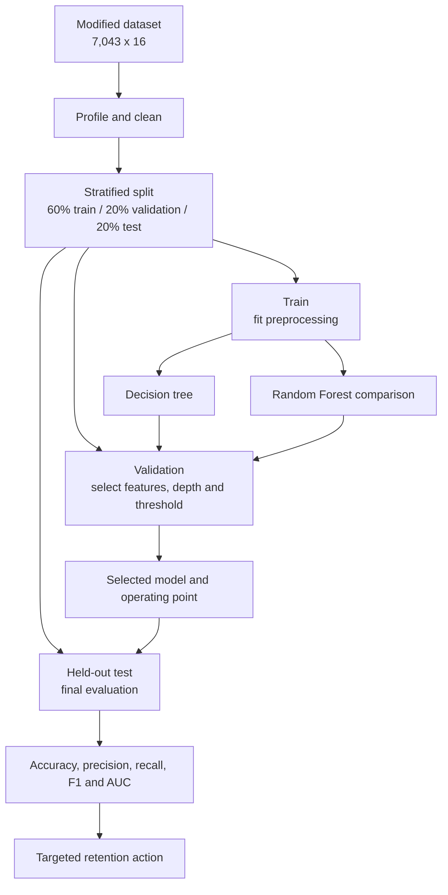
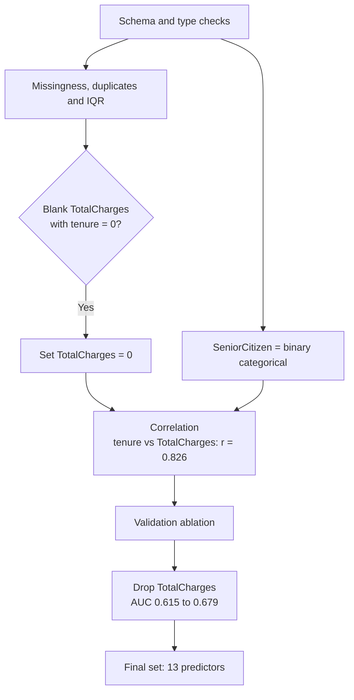

# Predicting Telecommunications Customer Churn

*BDA601 Big Data and Analytics - Assessment 2 - Visualisation and Model Development (v4)*

| Item | Detail |
|---|---|
| Subject | BDA601 - Big Data and Analytics |
| Case | Telco customer churn, modified to 16 attributes |
| Length | 1,000 words (+/-10%) |
| Weight | 30% |
| Due | 11.55 pm AEST, 26/07/2026 |
| Deliverables | Modified CSV, executed PySpark notebook, report PDF |

---

# Report

## 1. Problem and analytical approach

Customer churn is costly because replacing a subscriber generally requires more investment than
retaining one. Using the IBM/Kaggle Telco sample, I removed the five attributes specified in the
brief, producing 7,043 customers and 16 attributes with `Churn` as the target (Kaggle, 2020). I then
built an interpretable decision tree in Spark MLlib and compared it with recall-focused alternatives
(Apache Spark, 2024).
The workflow in Figure 1 follows the analytics lifecycle: prepare the data, fit preprocessing only on
training data, tune on validation, evaluate once on test, and translate performance into a retention
decision (EMC Education Services, 2015).

The deterministic stratification produced 4,225 training, 1,409 validation and 1,409 test customers,
with no overlapping customer IDs and the same churn proportion in each partition. This separation is
important: fitting category indexes or choosing features before the split would allow information
from the held-out customers to influence the model indirectly.

**Figure 1. Leakage-safe churn-analysis workflow.**

## 2. Exploration, cleaning and feature selection

The EDA supplied central-tendency and dispersion statistics plus bar charts, histograms, box plots,
a heatmap and pair plot. Churn is imbalanced: 26.5% leave, so predicting that everyone stays already
achieves 73.5% accuracy. Churn is concentrated among low-tenure, month-to-month customers without
technical support. `SeniorCitizen` was treated as binary categorical, not continuous.

The descriptive statistics reinforced that pattern: median tenure was 10 months among churners and
38 months among customers who stayed. This gap is more informative than the overall mean because the
tenure distribution is skewed. Categorical churn-rate charts also showed that month-to-month contracts
sit well above the 26.5% base churn rate.

Quality checks found no duplicate rows or customer IDs. The 11 blank `TotalCharges` records all had
`tenure = 0`; they were set to zero because those new customers had accumulated no charges, a
domain-informed correction preferable to a global median (Han et al., 2012). IQR checks found no
outliers requiring removal. Although `tenure` and `TotalCharges` were strongly correlated
(`r = 0.826`), correlation alone did not decide removal. A validation ablation compared both feature
sets: dropping `TotalCharges` increased AUC from 0.615 to 0.679 while churn-F1 changed only from 0.522
to 0.520. The final model therefore used 13 predictors (Figure 2).

The IQR checks were diagnostic rather than automatic deletion rules. No tenure or charge observations
fell outside the calculated bounds, but even if they had, a high-value or long-tenure customer could
still be legitimate. This preserves analytical integrity while documenting the anomaly decision.

**Figure 2. Data-quality and feature-selection decisions.**

## 3. Missing-value strategy

The tree identified `Contract` as most important (importance 0.564), followed by `tenure` (0.168)
and `TechSupport` (0.160). I simulated 30% missingness in `Contract`, derived the replacement mode
(`Month-to-month`) from training only, and applied it unchanged to validation and the same held-out
test customers. Accuracy moved from 0.781 to 0.779, but churn-F1 fell from 0.548 to 0.485. Therefore,
stable accuracy masks information loss in the minority class. Mode imputation is reproducible and
retains all rows, but a production system should test an explicit missing category or model-based
imputation. C4.5 fractional instances are a theoretical alternative (Witten et al., 2017), not the
missing-value behavior implemented by Spark MLlib here.

The synthetic mask represents missing completely at random and therefore does not reproduce every
production failure mode. Contract values may instead be missing systematically for particular sales
channels or customer groups. Monitoring missingness by source and churn outcome would be required
before deploying the imputation rule.

## 4. Interpretation of churn analysis

### 4.1 Effectiveness

The held-out decision tree classified 78.1% correctly, only 4.6 percentage points above the naive
baseline. It caught 187 of 374 churners: recall 0.500, precision 0.605 and churn-F1 0.548. This is only
partially satisfactory because half the customers who leave remain undetected. Accuracy alone is
therefore unsuitable for this imbalanced retention problem.

Its confusion matrix contained 913 true negatives, 122 false positives, 187 false negatives and 187
true positives. The symmetric number of caught and missed churners makes the operational weakness
particularly visible: an apparently acceptable headline accuracy still leaves half the retention
opportunity untouched.

### 4.2 Who is churning

The tree and EDA agree: the highest-risk customers are newer subscribers on month-to-month contracts,
without technical support, often using electronic check and paperless billing. Longer contracts and
tenure are associated with lower churn. The practical response is an early-tenure retention programme
that promotes longer commitments and support bundles rather than indiscriminate discounts.

### 4.3 Improving detection

Validation threshold tuning moved the tree cut-off from 0.50 to 0.26, raising test recall from 0.500
to 0.685. Inverse-frequency class weighting raised recall to 0.797. A cross-validated Random Forest
ranked customers best (AUC 0.833); at threshold 0.30 it achieved recall 0.754 and churn-F1 0.618.
The tree remains the explanatory model required by the brief, while the forest is the stronger
candidate for operational scoring. Full comparisons are in Appendix A.

These remedies solve different problems. Weighting changes what the tree treats as costly during
training, threshold tuning changes only the final decision rule, and the forest improves ranking by
combining many trees. The latter sacrifices some interpretability, so its scores should be accompanied
by the simpler tree's business-readable rules.

### 4.4 Illustrative business operating point

Because real financial costs were unavailable, false-negative to false-positive ratios of 2:1, 5:1
and 10:1 were treated as sensitivity scenarios, not measured facts. Under the illustrative 5:1
scenario, validation selected a Random Forest threshold of 0.14. On test this caught 349 of 374
churners (recall 0.933) but generated 486 false alarms and only 0.418 precision (Figure 3). The lower
threshold is defensible only if a missed churner truly costs much more than a retention offer; the
decision belongs to the business budget owner.

Sensitivity confirms that this assumption matters: the 2:1 scenario selects 0.36 and recalls 66.8%,
whereas 10:1 selects 0.08 and recalls 97.6% at only 35.8% precision. No threshold is universally
optimal; it should be approved against real incentive cost and customer lifetime value.

**Figure 3. Cost-ratio sensitivity and the held-out confusion matrix at the illustrative 5:1 operating point.**

## 5. Conclusion

The model provides an interpretable churn profile, but the original tree misses half the churners.
Leakage-safe preprocessing, evidence-based feature reduction and paired missing-value evaluation make
that conclusion defensible. Threshold tuning, weighting and Random Forest improve detection, but the
chosen operating point must balance recovered customers against wasted offers rather than maximise
accuracy mechanically.

A pilot should therefore monitor churn recall, offer acceptance, missingness and model drift before
the scoring model is operationalised across the full customer base.

---

# References

Apache Spark. (2024). *MLlib: Classification and regression*. https://spark.apache.org/docs/latest/ml-classification-regression.html

EMC Education Services. (2015). *Data science and big data analytics: Discovering, analyzing, visualizing and presenting data*. John Wiley & Sons.

Han, J., Pei, J., & Kamber, M. (2012). *Data mining: Concepts and techniques* (3rd ed.). Elsevier.

Kaggle. (2020). *Telco customer churn - IBM sample data sets*. https://www.kaggle.com/blastchar/telco-customer-churn

Witten, I. H., Frank, E., Hall, M. A., & Pal, C. J. (2017). *Data mining: Practical machine learning tools and techniques* (4th ed.). Morgan Kaufmann.

---

# Appendices

## Appendix A - Model comparison

| Model | Threshold | Accuracy | Precision | Recall | Churn-F1 | AUC |
|---|---:|---:|---:|---:|---:|---:|
| Decision tree baseline | 0.50 | 0.781 | 0.605 | 0.500 | 0.548 | 0.568 |
| Decision tree tuned | 0.26 | 0.750 | 0.522 | 0.685 | 0.593 | 0.568 |
| Weighted tree | 0.50 | 0.725 | 0.489 | **0.797** | 0.606 | 0.777 |
| Random Forest baseline | 0.50 | 0.794 | 0.651 | 0.479 | 0.552 | **0.833** |
| Random Forest tuned | 0.30 | 0.753 | 0.524 | 0.754 | **0.618** | **0.833** |

## Appendix B - Cost sensitivity

| FN:FP ratio | Threshold | TN | FP | FN | TP | Recall | Precision | Accuracy |
|---:|---:|---:|---:|---:|---:|---:|---:|---:|
| 2:1 | 0.36 | 838 | 197 | 124 | 250 | 0.668 | 0.559 | 0.772 |
| 5:1 | 0.14 | 549 | 486 | 25 | 349 | 0.933 | 0.418 | 0.637 |
| 10:1 | 0.08 | 379 | 656 | 9 | 365 | 0.976 | 0.358 | 0.528 |

---

# Statement of Acknowledgement

I acknowledge that I used Anthropic Claude Opus 4.8 to assist with structuring the analysis,
debugging PySpark, improving academic clarity and checking APA conventions. The final analysis and
interpretation represent my own critical thinking, and I take responsibility for the submitted work.

---

# Planning companion - not part of submission

- Notebook executed end to end with zero errors.
- Preprocessing estimators are fitted on training only.
- Train/validation/test contain 4,225 / 1,409 / 1,409 customers with no ID overlap.
- Mermaid source and rendered PNGs are stored under `report/figures/`.
- Final PDF export and submission ZIP are intentionally deferred.
