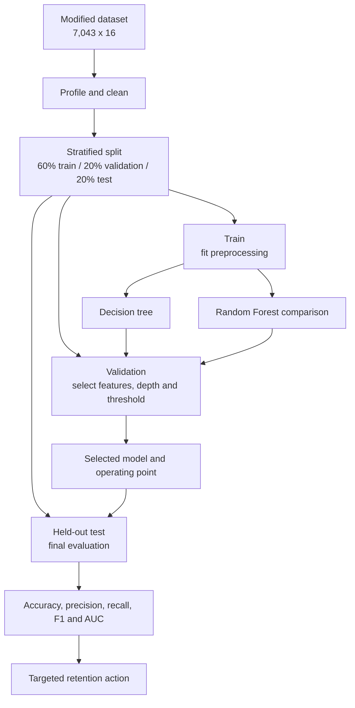
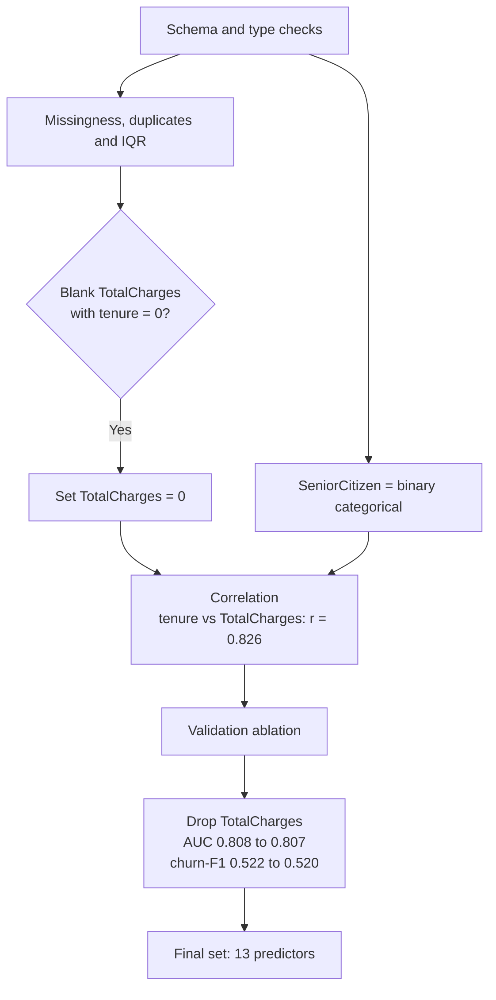
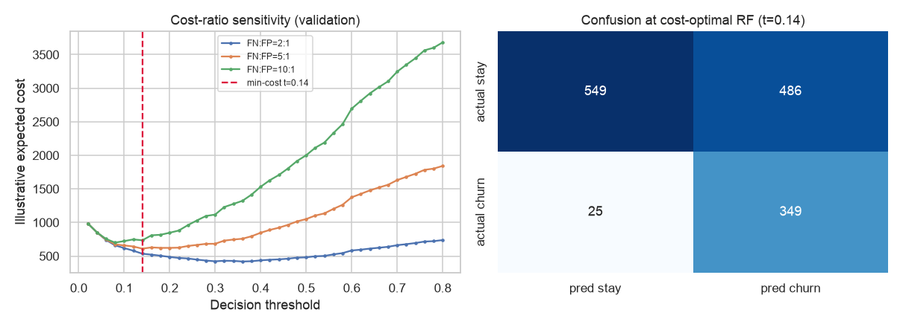

# Predicting Telecommunications Customer Churn

*BDA601 Big Data and Analytics - Assessment 2 - Visualisation and Model Development (v6)*

| Item | Detail |
|---|---|
| Subject | BDA601 - Big Data and Analytics |
| Case | Telco customer churn, modified to 16 attributes |
| Length | 1,000 words (+/-10%) |
| Weight | 30% |
| Due | 11.55 pm AEST, 26/07/2026 |
| Deliverables | Modified CSV, executed PySpark notebook, report PDF |

---

# Report

## 1. Problem and analytical approach

Customer churn is costly because replacing a subscriber generally requires more investment than
retaining one. Using the IBM/Kaggle Telco sample, I removed the five attributes specified in the
brief, producing 7,043 customers and 16 attributes with `Churn` as the target (Kaggle, 2020). I built
an interpretable decision tree in Spark MLlib and compared it with recall-focused alternatives
(Apache Spark, 2024).

Figure 1 follows the analytics lifecycle: prepare the data, fit preprocessing only on training data,
tune on validation, evaluate once on test, and translate performance into a retention decision (EMC
Education Services, 2015). Deterministic stratification produced 4,225 training, 1,409 validation and
1,409 test customers with no overlapping IDs. This prevents held-out customers from influencing
category indexes, feature selection or hyperparameters.

**Figure 1. Leakage-safe churn-analysis workflow.**

## 2. Exploration, cleaning and feature selection

The EDA supplied central-tendency and dispersion statistics plus bar charts, histograms, box plots,
a heatmap and pair plot. Churn is imbalanced: 26.5% leave, so predicting that everyone stays already
achieves 73.5% accuracy. Churn is concentrated among low-tenure, month-to-month customers without
technical support. Median tenure was 10 months among churners and 38 among customers who stayed;
`SeniorCitizen` was treated as binary categorical, not continuous.

Quality checks found no duplicate rows or customer IDs. The 11 blank `TotalCharges` records all had
`tenure = 0`; they were set to zero because these new customers had accumulated no charges, a
domain-informed correction preferable to a global median (Han et al., 2012). IQR checks found no
outliers requiring removal. Even if an extreme had been found, it would require investigation rather
than automatic deletion because a high-value or long-tenure customer may be legitimate.

Although `tenure` and `TotalCharges` were strongly correlated (`r = 0.826`), correlation alone did
not decide removal. Validation ablation showed that dropping `TotalCharges` changed AUC from 0.8084
to 0.8068 and churn-F1 from 0.5223 to 0.5200. This negligible loss was accepted to remove redundancy
and simplify the final 13-predictor model (Figure 2).

**Figure 2. Data-quality and feature-selection decisions.**

## 3. Missing-value strategy

The tree identified `Contract` as most important (importance 0.564), followed by `tenure` (0.168)
and `TechSupport` (0.160). I simulated 30% missingness in `Contract`, derived its replacement mode
(`Month-to-month`) from training only, and applied it unchanged to validation and the same held-out
test customers. Accuracy moved from 0.781 to 0.779, while churn-F1 fell from 0.548 to 0.485. Stable
accuracy therefore masked information loss in the minority class.

Mode imputation is reproducible and retains all rows, but the synthetic mask represents missing
completely at random. Production gaps could instead depend on sales channel or customer group. A
deployed pipeline should monitor missingness by source and compare an explicit missing category or
model-based imputation. C4.5 fractional instances are a theoretical alternative (Witten et al.,
2017), not Spark MLlib's implemented behavior.

## 4. Interpretation of churn analysis

### 4.1 Effectiveness and generalisation

The held-out tree classified 78.1% correctly, only 4.6 percentage points above the naive baseline.
It caught 187 of 374 churners: recall 0.500, precision 0.605 and churn-F1 0.548. Its confusion matrix
contained 913 true negatives, 122 false positives, 187 false negatives and 187 true positives.
Accuracy is therefore unsuitable as the sole measure because half the retention opportunity remains
undetected.

Validation selected `maxDepth = 6`, which acts as pre-pruning by stopping unnecessary recursive
splits. Train-to-test gaps were modest: 1.79 percentage points in accuracy, 3.75 in churn-F1 and 2.23
in AUC (Appendix B). This suggests limited rather than severe overfitting. Test AUC was 0.802, well
above the 0.500 expected from random ranking, although the default classification threshold still
missed many churners. AUC and recall therefore answer different questions: ranking quality can be
useful even when the selected operating point is poor.

### 4.2 Who is churning

The tree and EDA agree, and because a tree is a rule learner its branches read directly as retention
rules that a team can apply without the model:

> **Rule 1 (high risk).** If `Contract = Month-to-month` AND `TechSupport = No` AND `tenure <= 15.5`
> months, flag for retention. This segment holds 1,516 customers and churns at **60.0%** against the
> 26.5% base rate; adding `PaymentMethod = Electronic check` tightens it to 914 customers at **66.2%**.
>
> **Rule 2 (low risk).** If `Contract` is one- or two-year, spend no retention budget. This segment
> holds 3,168 customers and churns at **6.8%**, and only 2.8% on two-year contracts.

The rules bound the retention list: the practical response is an early-tenure programme that converts
month-to-month customers to longer commitments and bundles technical support, rather than
indiscriminate discounts.

### 4.3 Improving detection

Validation threshold tuning moved the tree cut-off from 0.50 to 0.26, raising test recall from 0.500
to 0.685. Inverse-frequency weighting raised recall to 0.797. A cross-validated Random Forest ranked
customers best (AUC 0.833); at threshold 0.30 it achieved recall 0.754 and churn-F1 0.618 (Table 1).
Weighting changes the training objective, threshold tuning changes the decision rule, and the forest
improves ranking by combining trees. The decision tree remains the required explanatory model; the
forest is the stronger operational candidate. Threshold tuning leaves AUC unchanged because it does
not reorder customer risk scores; it only changes where predictions switch from stay to churn.

**Table 1. Held-out comparison of the baseline decision tree and recall-focused alternatives.**

| Model | Threshold | Accuracy | Precision | Recall | Churn-F1 | AUC |
|---|---:|---:|---:|---:|---:|---:|
| Decision tree baseline | 0.50 | 0.781 | 0.605 | 0.500 | 0.548 | 0.802 |
| Decision tree tuned | 0.26 | 0.750 | 0.522 | 0.685 | 0.593 | 0.802 |
| Weighted tree | 0.50 | 0.725 | 0.489 | **0.797** | 0.606 | 0.809 |
| Random Forest baseline | 0.50 | 0.794 | 0.651 | 0.479 | 0.552 | **0.833** |
| Random Forest tuned | 0.30 | 0.753 | 0.524 | 0.754 | **0.618** | **0.833** |

### 4.4 Business operating point and responsible use

Because financial costs were unavailable, false-negative to false-positive ratios of 2:1, 5:1 and
10:1 were sensitivity scenarios, not measured facts (Appendix A). At 5:1, validation selected a Random
Forest threshold of 0.14. Test recall reached 0.933, but precision fell to 0.418 and 486 false alarms
were generated (Figure 3). The business budget owner must validate this trade-off against incentive
cost and customer lifetime value.

**Figure 3. Cost-ratio sensitivity and held-out confusion matrix at the illustrative 5:1 operating point.**

The demographic audit does not establish fairness, but it identifies monitoring needs. Female and
male recall were similar (0.508 and 0.492), while false-positive rates were 0.141 and 0.096. Senior
and non-senior rates were 0.162 and 0.112, respectively, with different churn prevalence and group
sizes (Appendix C). These descriptive gaps cannot be attributed solely to the model because support
and underlying churn rates differ. Deployment should monitor subgroup error rates over time and
investigate data, threshold and service-process causes before using scores for customer treatment.

## 5. Conclusion

The decision tree provides an interpretable churn profile but misses half the churners at its default
threshold. Leakage-safe preprocessing, evidence-based feature reduction and paired missing-value
evaluation make that conclusion defensible. Threshold tuning, weighting and Random Forest improve
detection, but the operating point must balance recovered customers against wasted offers. A pilot
should monitor churn recall, offer acceptance, missingness, subgroup errors and model drift before
full deployment.

---

# References

Apache Spark. (2024). *MLlib: Classification and regression*. https://spark.apache.org/docs/latest/ml-classification-regression.html

EMC Education Services. (2015). *Data science and big data analytics: Discovering, analyzing, visualizing and presenting data*. John Wiley & Sons.

Han, J., Pei, J., & Kamber, M. (2012). *Data mining: Concepts and techniques* (3rd ed.). Elsevier.

Kaggle. (2020). *Telco customer churn - IBM sample data sets*. https://www.kaggle.com/blastchar/telco-customer-churn

Witten, I. H., Frank, E., Hall, M. A., & Pal, C. J. (2017). *Data mining: Practical machine learning tools and techniques* (4th ed.). Morgan Kaufmann.

---

# Appendices

## Appendix A - Cost sensitivity

> Table A1 - Random Forest sensitivity to illustrative false-negative and false-positive cost ratios.

| FN:FP ratio | Threshold | TN | FP | FN | TP | Recall | Precision | Accuracy |
|---:|---:|---:|---:|---:|---:|---:|---:|---:|
| 2:1 | 0.36 | 838 | 197 | 124 | 250 | 0.668 | 0.559 | 0.772 |
| 5:1 | 0.14 | 549 | 486 | 25 | 349 | 0.933 | 0.418 | 0.637 |
| 10:1 | 0.08 | 379 | 656 | 9 | 365 | 0.976 | 0.358 | 0.528 |

## Appendix B - Generalisation diagnostic

> Table B1 - Train and test performance of the baseline decision tree at the default 0.50 threshold.

| Dataset | Support | Accuracy | Precision | Recall | Churn-F1 | AUC |
|---|---:|---:|---:|---:|---:|---:|
| Train | 4,225 | 0.799 | 0.645 | 0.535 | 0.585 | 0.824 |
| Test | 1,409 | 0.781 | 0.605 | 0.500 | 0.548 | 0.802 |

## Appendix C - Held-out demographic error audit

> Table C1 - Held-out decision-tree error rates across gender and senior-citizen groups.

| Attribute | Group | Support | Churn prevalence | Recall | False-positive rate |
|---|---|---:|---:|---:|---:|
| gender | Female | 693 | 0.276 | 0.508 | 0.141 |
| gender | Male | 716 | 0.256 | 0.492 | 0.096 |
| SeniorCitizen | No | 1,183 | 0.235 | 0.478 | 0.112 |
| SeniorCitizen | Yes | 226 | 0.425 | 0.563 | 0.162 |

---

# Statement of Acknowledgement

I acknowledge that I have used the following AI tools in the creation of this report:

- OpenAI ChatGPT (Codex 5.5)
- Anthropic Claude (Opus 4.8)

Both tools were used to assist with understanding classification and customer-churn concepts,
structuring the leakage-safe PySpark workflow, evaluating missing-value and model-improvement
strategies, improving academic clarity, and supporting APA 7th referencing conventions.

Prompt examples:

1. "How should I split this imbalanced churn dataset into training, validation and test sets, and fit the PySpark preprocessing stages without leaking information from held-out customers?"
2. "Contract is the decision tree's most important feature. How can I simulate 30% missingness, apply training-derived mode imputation, and compare performance on the same held-out customer IDs?"
3. "The decision tree achieves 78.1% accuracy but only 50.0% churn recall. Explain why accuracy is misleading here and how threshold tuning, class weighting and Random Forest affect recall, precision, F1 and AUC."

I confirm that the use of these AI tools has been in accordance with the Torrens University Australia
Academic Integrity Policy and TUA, Think and MDS's Position Paper on the Use of AI. I confirm that the
final output is authored by me and represents my own critical thinking, analysis, and synthesis of
sources. I take full responsibility for the final content of this report.

---

# Planning companion - not part of submission

- Notebook executed end to end with zero errors.
- Preprocessing estimators are fitted on training only.
- Train/validation/test contain 4,225 / 1,409 / 1,409 customers with no ID overlap.
- Spark AUC agrees with an independent rank-based calculation.
- Final PDF export and submission ZIP are intentionally deferred.
