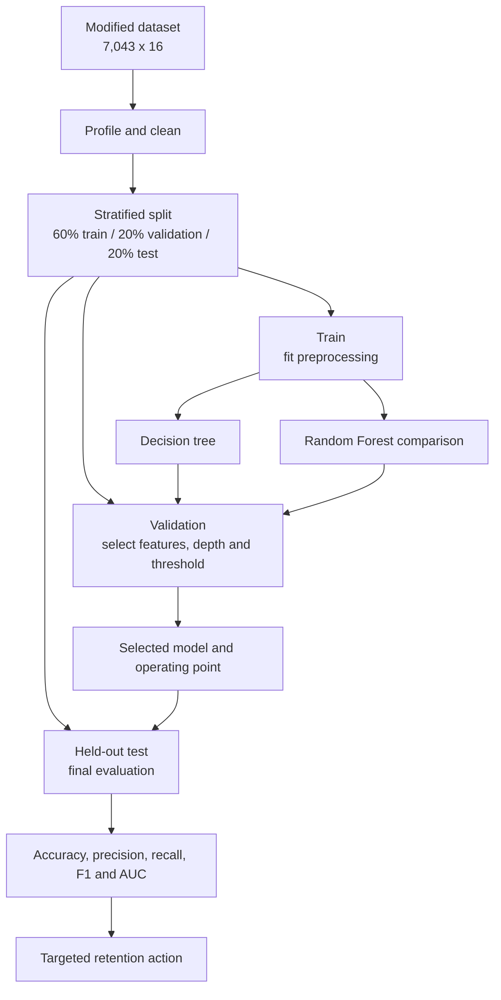
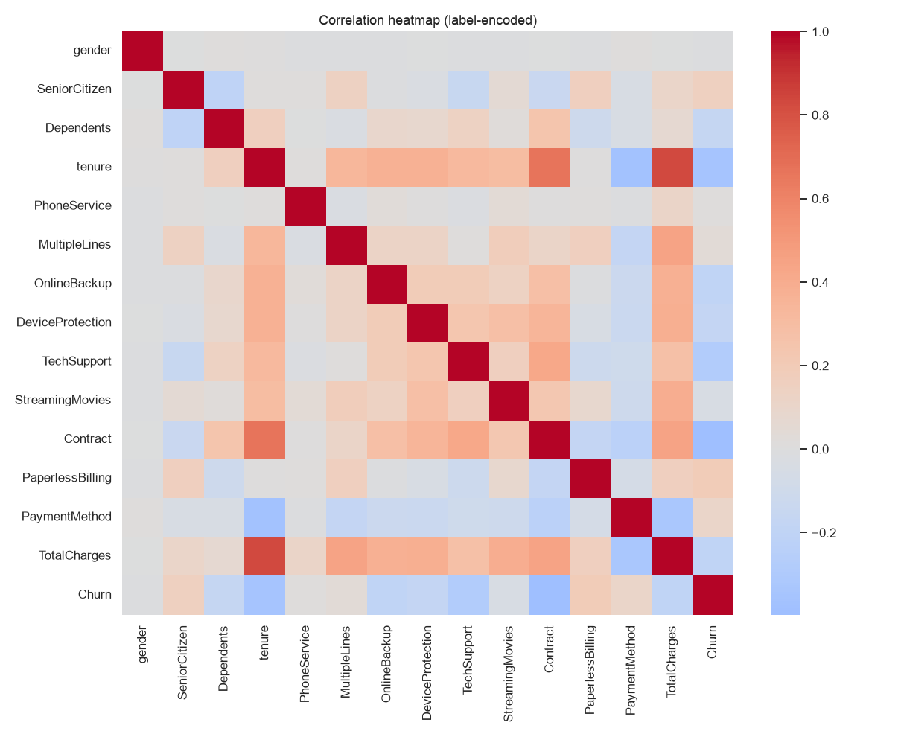
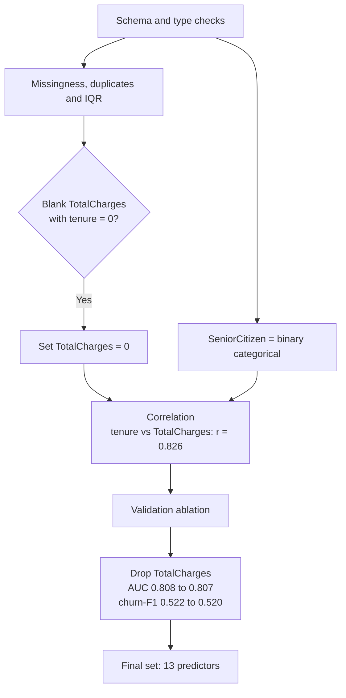
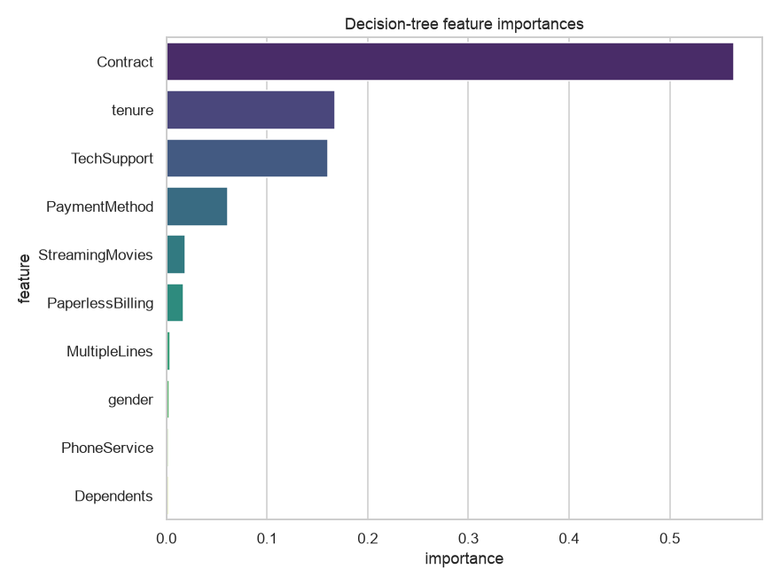
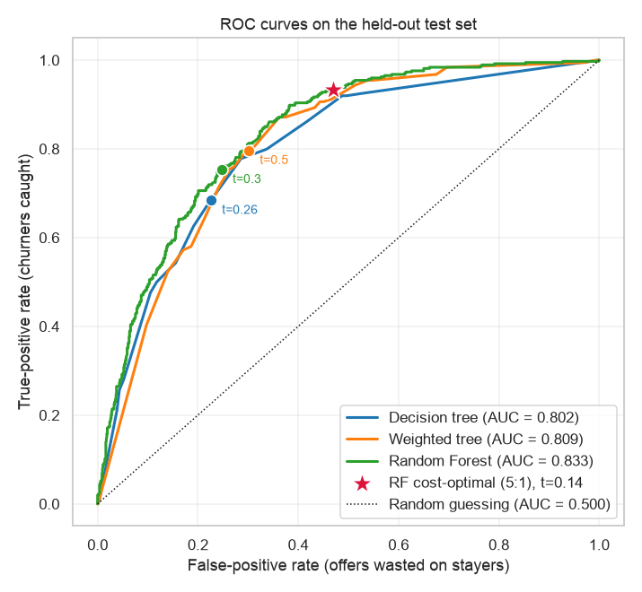
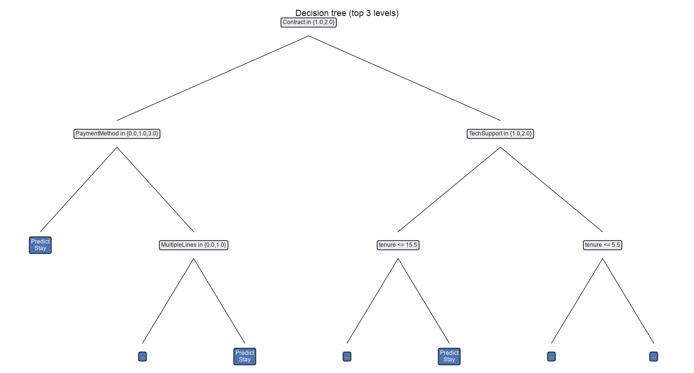

# Predicting Telecommunications Customer Churn

*BDA601 Big Data and Analytics - Assessment 2 - Visualisation and Model Development (v6)*

| Item | Detail |
|---|---|
| Subject | BDA601 - Big Data and Analytics |
| Case | Telco customer churn, modified to 16 attributes |
| Length | 1,000 words minimum |
| Weight | 30% |
| Due | 11.55 pm AEST, 26/07/2026 |
| Deliverables | Report PDF, executed PySpark notebook, modified CSV |

---

# Report

## 1. Problem and analytical approach

Customer churn is costly because replacing a subscriber generally requires more investment than
retaining one. Using the IBM/Kaggle Telco sample, I removed the five attributes specified in the
brief, producing 7,043 customers and 16 attributes with `Churn` as the target (Kaggle, 2020). I built
an interpretable decision tree in Spark MLlib and compared it with recall-focused alternatives
(Apache Spark, 2024).

Figure 1 follows the analytics lifecycle: prepare the data, fit preprocessing only on training data,
tune on validation, evaluate once on test, and translate performance into a retention decision (EMC
Education Services, 2015). Deterministic stratification produced 4,225 training, 1,409 validation and
1,409 test customers with no overlapping IDs. This ordering matters. Every estimator that learns
something from the data - category indexes, the imputation mode, the tree itself - is fitted on the
training split alone, so no held-out customer can influence a decision that is later used to judge
performance on that same customer. The test split is touched exactly once, at the end.

**Figure 1. Leakage-safe churn-analysis workflow.**

## 2. Exploration, cleaning and feature selection

The EDA supplied central-tendency and dispersion statistics plus bar charts, histograms, box plots,
a correlation heatmap and a pair plot. Churn is imbalanced: 26.5% leave, so predicting that everyone
stays already achieves 73.5% accuracy. That single fact sets the standard the model must beat and
explains why accuracy alone cannot be trusted later. Churn is concentrated among low-tenure,
month-to-month customers without technical support. Median tenure was 10 months among churners and 38
among customers who stayed; `SeniorCitizen` was treated as binary categorical, not continuous,
because its integer encoding would otherwise imply a meaningless ordering.

Quality checks found no duplicate rows and no duplicate customer IDs. The 11 blank `TotalCharges`
records all had `tenure = 0`; they were set to zero because these new customers had genuinely
accumulated no charges, a domain-informed correction preferable to a global median (Han et al.,
2012). Imputing the median here would have invented a spending history for customers who had none.
IQR checks found no outliers requiring removal. Even if an extreme had been found, it would require
investigation rather than automatic deletion, because a high-value or long-tenure customer may be
entirely legitimate and is precisely the customer the business least wants to lose.

Feature selection was driven by evidence rather than intuition. The correlation heatmap (Figure 2)
shows `tenure` and `TotalCharges` moving almost in lockstep (`r = 0.826`), which is expected because
total spend accumulates with time on the network. High correlation alone, however, is a reason to
investigate, not to delete: a redundant feature is only worth removing if the model does not need it.
I therefore tested the decision on the validation set. Dropping `TotalCharges` changed AUC from 0.8084
to 0.8068 and churn-F1 from 0.5223 to 0.5200 - a loss of roughly two parts in a thousand. That
negligible cost was accepted in exchange for a simpler, less collinear 13-predictor model (Figure 3).

**Figure 2. Correlation heatmap of the numeric attributes, used to justify feature selection.**

**Figure 3. Data-quality and feature-selection decisions.**

## 3. Missing-value strategy

The brief asks what to do when the *most important* attribute has significant missingness, so the
first step is to establish which attribute that is. The tree's feature importances (Figure 4) identify
`Contract` decisively: importance 0.564, more than three times `tenure` (0.168) and `TechSupport`
(0.160). Because one attribute carries most of the model's signal, deleting rows with a missing
contract is not a neutral act - it would discard a large and probably non-random slice of customers
and bias the sample toward complete records.

**Figure 4. Decision-tree feature importances. `Contract` dominates, which makes it the attribute
tested for missingness.**

I therefore simulated the scenario the brief describes: 30% of `Contract` values were removed at
random, the replacement mode (`Month-to-month`) was derived from the training split only, and it was
applied unchanged to validation and to the same held-out test customers, so before and after are
compared on identical people. Accuracy barely moved, from 0.781 to 0.779, but churn-F1 fell from 0.548
to 0.485. The headline metric therefore stayed still while the metric the business cares about
degraded by more than six points - a compact demonstration of why accuracy must not be read alone on
imbalanced data.

Mode imputation is reproducible, retains every row and needs no extra model, which is why it is the
defensible choice here. Its limitations should still be stated. The synthetic mask makes values
missing completely at random, whereas production gaps usually depend on something - a sales channel
that skips a field, a partner feed that fails. Imputing the mode also injects the majority,
high-churn category, which flatters the dominant split rather than testing it. A deployed pipeline
should monitor missingness by source and compare mode imputation against an explicit "missing"
category or a model-based imputer. C4.5-style fractional instances, which send an incomplete record
down every branch weighted by the training split, are a theoretically superior alternative (Witten et
al., 2017), but they are not what Spark MLlib implements.

## 4. Interpretation of churn analysis

### 4.1 Effectiveness and generalisation

On the held-out test set the tree classified 78.1% of customers correctly. Against the 73.5% naive
baseline that is a gain of only 4.6 percentage points, and the churn class tells a harsher story: of
374 churners the model caught 187 and missed 187. Recall is therefore 0.500, precision 0.605 and
churn-F1 0.548, with a confusion matrix of 913 true negatives, 122 false positives, 187 false
negatives and 187 true positives. Read as a retention tool, the model finds exactly half of the
customers it exists to find. This is **not a satisfactory outcome**: a campaign built on it would
silently forfeit half the recoverable revenue, and the high accuracy would conceal that fact from
anyone reading only the headline number.

Before trying to improve detection, it is worth asking whether the model generalises at all, since a
model that has memorised its training data cannot be trusted on new customers. Validation selected
`maxDepth = 6`, which acts as pre-pruning: growth stops before the tree can carve the training set
into near-pure leaves that describe noise rather than pattern. The train-to-test gaps (Table 1) are
correspondingly modest - 1.79 percentage points in accuracy, 3.75 in churn-F1 and 2.23 in AUC - which
indicates limited rather than severe overfitting. The weakness is genuine, not an artefact of a model
that fell apart on unseen data.

**Table 1. Train and test performance of the baseline decision tree at the default 0.50 threshold.**

| Dataset | Support | Accuracy | Precision | Recall | Churn-F1 | AUC |
|---|---:|---:|---:|---:|---:|---:|
| Train | 4,225 | 0.799 | 0.645 | 0.535 | 0.585 | 0.824 |
| Test | 1,409 | 0.781 | 0.605 | 0.500 | 0.548 | 0.802 |

Test AUC was 0.802, far above the 0.500 expected from random ranking. This looks like a contradiction
- how can a model that misses half the churners rank so well? - and resolving it is central to
reading the results correctly. AUC and recall answer different questions. AUC measures how well the
model *orders* customers by risk, independently of any cut-off; recall measures how many churners a
*particular* cut-off actually catches. The ROC curves (Figure 5) make the distinction visible: each
model traces one fixed curve, and choosing a threshold merely selects a point on it. Tuning the
threshold slides along the curve and cannot change AUC. Only a better model lifts the curve itself,
which is exactly what the Random Forest does.

**Figure 5. Held-out ROC curves. The Random Forest curve dominates the others across the whole range,
which is what its higher AUC means. Circles mark each model's selected threshold and the star marks
the illustrative 5:1 cost-optimal operating point.**

### 4.2 Who is churning

Because a decision tree is a rule learner, its branches can be read directly as retention rules
(Figure 6) rather than paraphrased as a vague profile. Reading the highest- and lowest-risk paths from
the root gives two rules a retention team can apply without running the model at all:

> **Rule 1 (high risk).** If `Contract = Month-to-month` AND `TechSupport = No` AND `tenure <= 15.5`
> months, flag for retention. This segment holds 1,516 customers and churns at **60.0%** against the
> 26.5% base rate; adding `PaymentMethod = Electronic check` tightens it to 914 customers at **66.2%**.
>
> **Rule 2 (low risk).** If `Contract` is one- or two-year, spend no retention budget. This segment
> holds 3,168 customers and churns at **6.8%**, and only 2.8% on two-year contracts alone.

**Figure 6. Top levels of the fitted decision tree. `Contract` is the root split, and the branches
below it are the source of the two rules above.**

The two rules quantify what the EDA suggested and, more usefully, bound the retention list: they
separate roughly 1,500 customers worth spending money on from roughly 3,200 who need none. The driver
is commitment, not demographics. Customers churn while they are new, unlocked and unsupported, and the
practical response follows directly - an early-tenure programme that converts month-to-month customers
onto longer terms and bundles technical support, rather than indiscriminate discounting that pays
customers who were never going to leave.

### 4.3 Improving detection

The 0.500 recall of the baseline is a property of the default 0.50 cut-off, not a hard limit of the
data, so three standard remedies were implemented and measured on the held-out test set (Table 2).

Tuning the decision threshold on validation moved the tree's cut-off from 0.50 to 0.26 and raised test
recall from 0.500 to 0.685, at a cost of 8 points of precision. It is the cheapest intervention
available because it retrains nothing and changes only the decision rule. Inverse-frequency class
weighting, which tells the learner that a churner is worth roughly 2.8 stayers during training, pushed
recall highest of all, to 0.797, and changes the training objective rather than the cut-off. A Random
Forest selected by 3-fold cross-validation ranked customers best (AUC 0.833 against the tree's 0.802),
because averaging many decorrelated trees reduces the variance of any single one; tuned to 0.30 it
reached recall 0.754 with the best churn-F1 of the group (0.618).

The three levers act at different points and are not interchangeable: weighting changes what the model
learns, thresholding changes how its output is cut, and the forest changes how well it ranks. Only the
last improves AUC, which is why the two tuned-threshold rows in Table 2 leave AUC untouched. The
decision tree remains the explanatory model the brief requires and the source of the rules in §4.2;
the Random Forest is the stronger operational candidate for scoring.

**Table 2. Held-out comparison of the baseline decision tree and recall-focused alternatives.**

| Model | Threshold | Accuracy | Precision | Recall | Churn-F1 | AUC |
|---|---:|---:|---:|---:|---:|---:|
| Decision tree baseline | 0.50 | 0.781 | 0.605 | 0.500 | 0.548 | 0.802 |
| Decision tree tuned | 0.26 | 0.750 | 0.522 | 0.685 | 0.593 | 0.802 |
| Weighted tree | 0.50 | 0.725 | 0.489 | **0.797** | 0.606 | 0.809 |
| Random Forest baseline | 0.50 | 0.794 | 0.651 | 0.479 | 0.552 | **0.833** |
| Random Forest tuned | 0.30 | 0.753 | 0.524 | 0.754 | **0.618** | **0.833** |

### 4.4 Business operating point and responsible use

Maximising F1 implicitly assumes a missed churner and a wasted offer are equally costly. They are not:
a false negative forfeits a customer's future value, while a false positive costs only the incentive.
The honest difficulty is that the true ratio cannot be recovered from this dataset - the brief itself
removed `MonthlyCharges`, so customer value is unobservable, and the cost of a retention offer was
never present. Ratios of 2:1, 5:1 and 10:1 are therefore treated as **sensitivity scenarios, not
measured facts**. For each, the threshold minimising expected cost was selected on validation and then
evaluated once on test (Table 3, Figure 7).

**Table 3. Random Forest sensitivity to illustrative false-negative and false-positive cost ratios.**

| FN:FP ratio | Threshold | TN | FP | FN | TP | Recall | Precision | Accuracy |
|---:|---:|---:|---:|---:|---:|---:|---:|---:|
| 2:1 | 0.36 | 838 | 197 | 124 | 250 | 0.668 | 0.559 | 0.772 |
| 5:1 | 0.14 | 549 | 486 | 25 | 349 | 0.933 | 0.418 | 0.637 |
| 10:1 | 0.08 | 379 | 656 | 9 | 365 | 0.976 | 0.358 | 0.528 |

At the 5:1 headline scenario the threshold falls to 0.14 and recall reaches 0.933: only 25 churners
escape, against 187 at the default cut-off. The price is 486 false alarms and accuracy collapsing to
0.637. Note what a threshold of 0.14 means in practice - the model now contacts customers whose
predicted churn risk is *below* the 26.5% population average, which is precisely what a 5:1 cost of
missing someone instructs it to do. The 10:1 row shows where this ends: recall 0.976, but accuracy
0.528, barely better than assuming nobody leaves. The sensible reading is that the cost ratio, not the
model, is the real decision, and it belongs to the budget owner, who must weigh incentive cost against
customer lifetime value.

**Figure 7. Cost-ratio sensitivity and held-out confusion matrix at the illustrative 5:1 operating point.**

Finally, a model that decides who receives an offer should be checked for uneven error rates before it
is deployed. The demographic audit (Table 4) does not establish fairness and is not intended to;
it identifies what must be monitored. Recall is similar across gender (0.508 female, 0.492 male), but
the false-positive rate is not (0.141 against 0.096), meaning women in this sample are contacted
unnecessarily more often. Senior citizens show both a higher false-positive rate (0.162) and a much
higher underlying churn prevalence (0.425), on a small group of 226 customers.

**Table 4. Held-out decision-tree error rates across gender and senior-citizen groups.**

| Attribute | Group | Support | Churn prevalence | Recall | False-positive rate |
|---|---|---:|---:|---:|---:|
| gender | Female | 693 | 0.276 | 0.508 | 0.141 |
| gender | Male | 716 | 0.256 | 0.492 | 0.096 |
| SeniorCitizen | No | 1,183 | 0.235 | 0.478 | 0.112 |
| SeniorCitizen | Yes | 226 | 0.425 | 0.563 | 0.162 |

These gaps cannot be attributed to the model alone, because the groups differ in size, in churn
prevalence and in service mix, and a difference in prevalence will produce a difference in error rates
even from an unbiased classifier. That is the point: the numbers are a prompt to investigate, not a
verdict. Deployment should track subgroup error rates over time and examine data, threshold and
service-process causes before churn scores are used to decide who gets an offer and who does not.

## 5. Conclusion

The decision tree yields an interpretable and actionable churn profile - short-tenure, month-to-month
customers without technical support, a segment that churns at 60% - but at its default threshold it
finds only half the churners, which is not good enough to run a retention budget on. Leakage-safe
preprocessing, evidence-based feature reduction and a paired missing-value test make that verdict
trustworthy rather than an accident of the split. Detection can be improved substantially: threshold
tuning reaches 0.685 recall for free, class weighting 0.797, and a cross-validated Random Forest ranks
customers best at AUC 0.833. But no metric selects the operating point. That is a business decision
about the relative cost of a lost customer and a wasted offer, and it is the one input this dataset
cannot supply. A pilot should therefore fix the cost ratio explicitly with the budget owner, then
monitor churn recall, offer acceptance, missingness by source, subgroup error rates and model drift
before any wider deployment.

---

# References

Apache Spark. (2024). *MLlib: Classification and regression*. https://spark.apache.org/docs/latest/ml-classification-regression.html

EMC Education Services. (2015). *Data science and big data analytics: Discovering, analyzing, visualizing and presenting data*. John Wiley & Sons.

Han, J., Pei, J., & Kamber, M. (2012). *Data mining: Concepts and techniques* (3rd ed.). Elsevier.

Kaggle. (2020). *Telco customer churn - IBM sample data sets*. https://www.kaggle.com/blastchar/telco-customer-churn

Witten, I. H., Frank, E., Hall, M. A., & Pal, C. J. (2017). *Data mining: Practical machine learning tools and techniques* (4th ed.). Morgan Kaufmann.

---

# Appendix A - Glossary

Terms are defined as they are used in this report. Churn is the positive class throughout, so a
"positive" prediction means the model expects the customer to leave.

| Term | Definition |
|---|---|
| **Accuracy** | Share of all customers classified correctly. Misleading on imbalanced data: predicting that nobody churns already scores 73.5% here. |
| **AUC (area under the ROC curve)** | A single number summarising the ROC curve. It is the probability that the model scores a randomly chosen churner above a randomly chosen stayer. 0.5 is random guessing, 1.0 is perfect. It measures ranking, not decisions, so it does not change when the threshold changes. |
| **Base rate** | The proportion of customers who actually churn (26.5%). Any model must be judged against it, not against zero. |
| **Class imbalance** | One outcome is far more common than the other (73.5% stay, 26.5% churn), which inflates accuracy and hides poor performance on the minority class. |
| **Class weighting** | Telling the learner during training that one class matters more. Inverse-frequency weighting here treats one churner as worth roughly 2.8 stayers, raising recall at the cost of precision. |
| **Confusion matrix** | The 2x2 table of true negatives, false positives, false negatives and true positives, from which every other classification metric is derived. |
| **Cross-validation** | Splitting the training data into k folds and training k times, each fold serving once as validation. Used here (k = 3) to choose Random Forest hyperparameters more stably than a single split would. |
| **Decision threshold** | The cut-off applied to the predicted probability of churn. Above it, the customer is flagged. The default 0.50 is a convention, not a law, and moving it trades precision against recall. |
| **False negative (FN)** | A churner the model failed to flag. The customer leaves, unnoticed. The expensive error in this problem. |
| **False positive (FP)** | A stayer the model flagged. A retention offer wasted on someone who was never going to leave. |
| **F1 score (churn)** | The harmonic mean of precision and recall for the churn class. It balances the two errors equally, which is exactly the assumption section 4.4 rejects. |
| **Feature importance** | How much each attribute contributed to the tree's splits, summing to 1. `Contract` scores 0.564 here, which is why it is the attribute tested in the missing-value analysis. |
| **Held-out test set** | The 1,409 customers touched only once, at the very end. Any decision informed by them would make the final numbers optimistic. |
| **Imputation** | Filling a missing value with a substitute. Mode imputation replaces missing categories with the most common one, derived here from the training split only. |
| **Leakage** | When information from held-out data influences training or tuning, producing scores that will not survive contact with new customers. Prevented here by fitting every estimator on the training split alone. |
| **Overfitting** | A model that memorises training data instead of learning a general pattern. Detected by comparing train and test performance (Table 1). |
| **Precision (churn)** | Of the customers the model flagged as churners, the share that really churn. Low precision means wasted retention budget. |
| **Pre-pruning** | Stopping tree growth before it becomes too specific. `maxDepth = 6` was selected on validation for this purpose. |
| **Random Forest** | An ensemble that averages many decorrelated decision trees. It ranks customers better (AUC 0.833) but is not directly readable as rules, which is why the single tree remains the explanatory model. |
| **Recall (churn)** | Of the customers who really churn, the share the model flagged. The metric this problem is actually about: recall of 0.500 means half the churners walk away undetected. |
| **ROC curve** | The true-positive rate plotted against the false-positive rate across every possible threshold. It shows the full menu of trade-offs a model offers; a threshold picks one point on it. |
| **Stratified split** | Splitting the data so that the churn rate is preserved in each of the training, validation and test sets. |
| **True positive (TP) / true negative (TN)** | A churner correctly flagged, and a stayer correctly left alone. |
| **Validation set** | The 1,409 customers used to choose depth, features and thresholds. Kept separate from test so that those choices can be judged honestly. |

---

# Statement of Acknowledgement

I acknowledge that I have used the following AI tools in the creation of this report:

- OpenAI ChatGPT (Codex 5.5)
- Anthropic Claude (Opus 4.8)

Both tools were used to assist with understanding classification and customer-churn concepts,
structuring the leakage-safe PySpark workflow, evaluating missing-value and model-improvement
strategies, improving academic clarity, and supporting APA 7th referencing conventions.

Prompt examples:

1. "How should I split this imbalanced churn dataset into training, validation and test sets, and fit the PySpark preprocessing stages without leaking information from held-out customers?"
2. "Contract is the decision tree's most important feature. How can I simulate 30% missingness, apply training-derived mode imputation, and compare performance on the same held-out customer IDs?"
3. "The decision tree achieves 78.1% accuracy but only 50.0% churn recall. Explain why accuracy is misleading here and how threshold tuning, class weighting and Random Forest affect recall, precision, F1 and AUC."

I confirm that the use of these AI tools has been in accordance with the Torrens University Australia
Academic Integrity Policy and TUA, Think and MDS's Position Paper on the Use of AI. I confirm that the
final output is authored by me and represents my own critical thinking, analysis, and synthesis of
sources. I take full responsibility for the final content of this report.

---

# Planning companion - not part of submission

- Facilitator (week 7 debrief): 1,000 words is a **floor**, not a ceiling. A 2,000-word report draws
  no criticism; a 500-600 word report does. No code may be pasted into the report, but plots generated
  by the code are welcome.
- A1 feedback (93/100) asked to reduce reliance on appendices. This version has **no appendices**:
  every table and figure now sits in the body beside the argument it supports.
- Notebook executed end to end with zero errors; preprocessing fitted on training only.
- Train/validation/test contain 4,225 / 1,409 / 1,409 customers with no ID overlap.
- Spark AUC agrees with an independent rank-based calculation, and the plotted ROC areas agree with
  the reported AUCs.
- Churn rates in the §4.2 rules are computed from the modified dataset, not from `metrics.json`.
