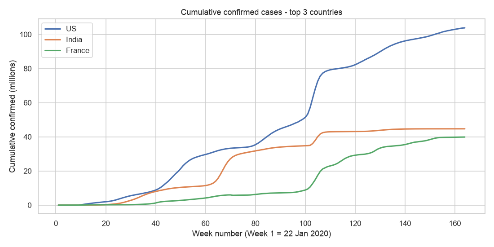
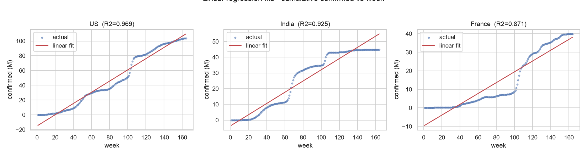
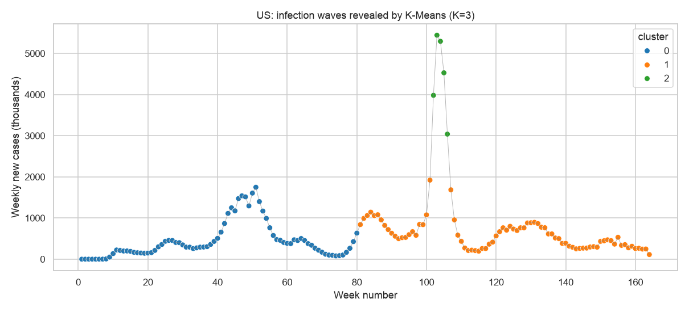
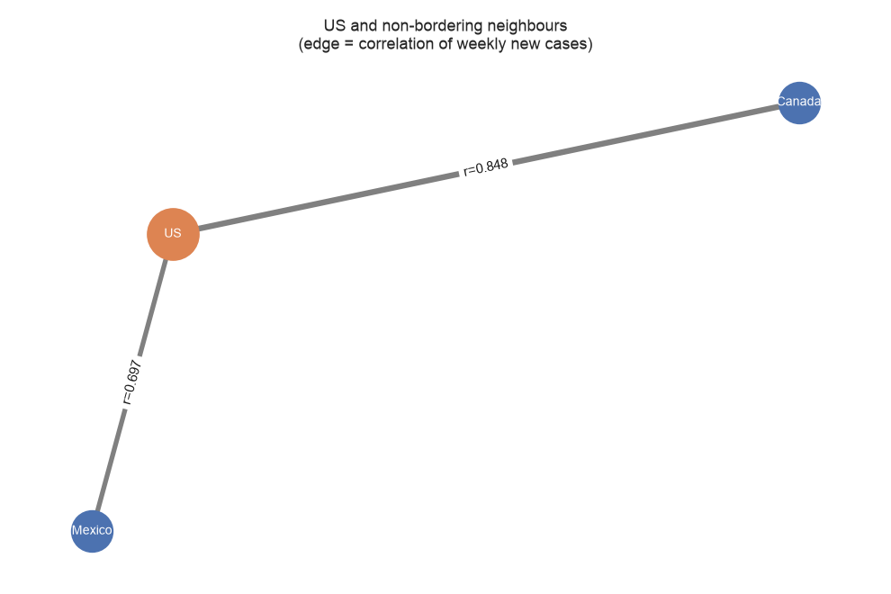
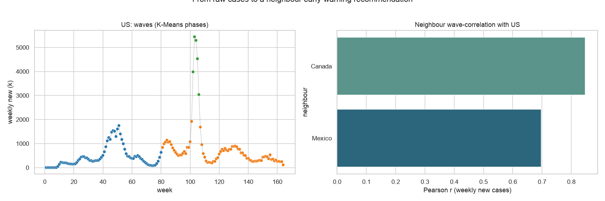

<!-- _class: title -->
<!-- _paginate: false -->

# What the world's worst outbreak can teach its neighbours
## A COVID-19 data story

**Luis Faria** · BDA601 Big Data and Analytics · Assessment 3
Johns Hopkins CSSE confirmed cases · 22 Jan 2020 - 9 Mar 2023

> The US recorded **103 million** cases. The question that matters for its neighbours:
> *could they have seen their own waves coming?*

---

# The approach

Every big-data project runs **prepare → analyse → decide**.

One analytical chain, each step feeding the next:

**top-3 countries → linear regression → pick the most volatile → K-Means waves → graph to neighbours → recommendation**

Tools: **Apache Spark MLlib** (regression + K-Means) · **networkx** (graph) · 164 weeks of data.

---

# The three worst-hit countries

Top 3 by total confirmed: **US 103.8M · India 44.7M · France 39.9M**.
All three rise - but at very different rates and shapes. Which one is the *most volatile*?

---

# Predictive modelling: a line is not enough

- Linear regression of cumulative cases on week number, per country.
- **US is the most volatile** - by the variance of its *weekly new cases* (6.4e11 vs India 2.5e11, France 1.6e11), not merely its size. Slope ~760k cases/week, **R² = 0.97**.
- Key point: even R² = 0.97 **hides** the story - a straight line cannot show *when* the surges hit.

---

# Clustering reveals the waves

- K-Means on `[week, weekly new cases]`, best **K = 3** (silhouette 0.705).
- It isolates a **mega-surge of ~4.46M new cases/week around weeks 102-106** (the Omicron wave, Jan 2022) as its own cluster.
- This **proves** growth was not steady: it came in waves (up - down - up).

---

# Graph analytics: who moves with the US?

- US linked to non-bordering neighbours **Canada** and **Mexico** (they do not border each other).
- Edge = correlation of weekly new cases: **Canada r = 0.85 (strong)**, **Mexico r = 0.70**.
- Canada's waves track the US most closely → the strongest early-warning candidate.

---

# The whole story in one frame

Left: the US waves by phase. Right: how strongly each neighbour correlates.
The line from raw data → phases → a neighbour recommendation.

---

# Recommendations to the neighbours

- **Canada (r = 0.85):** treat the US trajectory as a leading indicator; when the US enters a surge phase, pre-position testing and hospital capacity **1-2 weeks ahead**.
- **Mexico (r = 0.70):** moderate coupling - watch US surges, but weight local signals more heavily.
- **General:** plan capacity for the isolated **Omicron-style mega-surge cluster**, not the steady baseline - that single cluster carried ~8x the average weekly load.

---

# Limitations & close

- **Data:** counts are cumulative and reporting-dependent; the JHU series **stopped 10 Mar 2023**.
- **Method:** `week` is a clustering input, so the phases are partly temporal by construction; "neighbour" is defined by geography, not true population mobility.
- **Next steps:** model weekly new cases directly, add mobility/vaccination data, and test lead-lag (cross-correlation) to quantify the warning window.

**Close:** data turned a wall of numbers into a concrete, actionable warning for neighbours.
