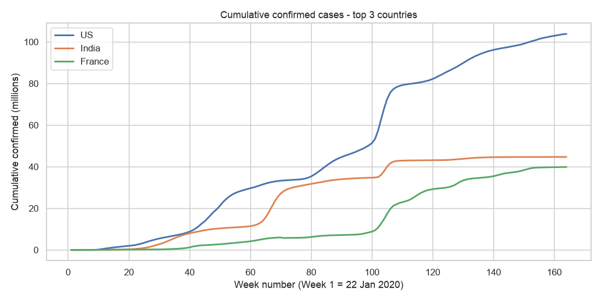
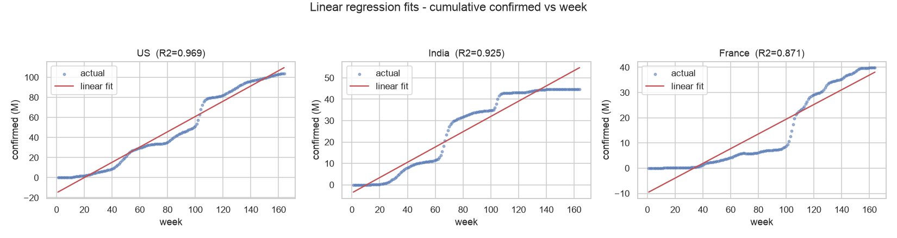
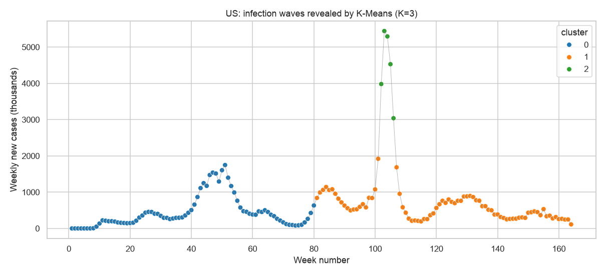
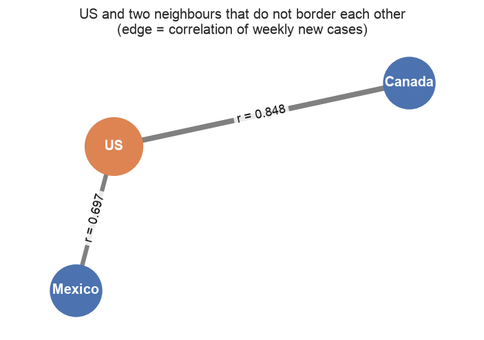
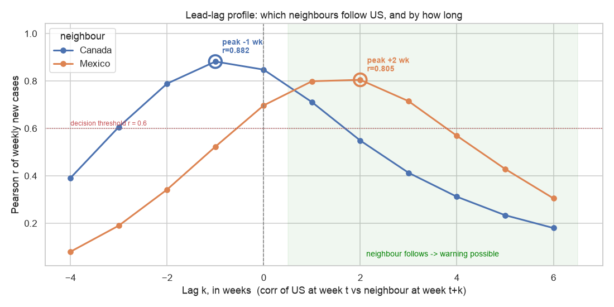
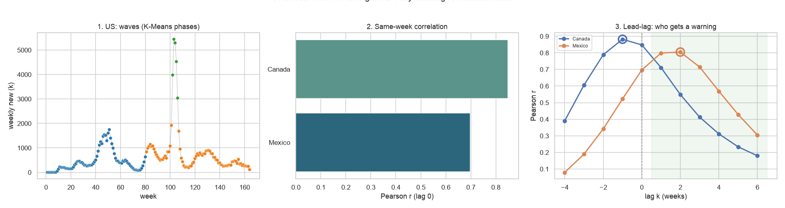

<!-- _class: title -->
<!-- _paginate: false -->

# What the world's worst outbreak can teach its neighbours
## A COVID-19 data story

**Luis Faria** · BDA601 Big Data and Analytics · Assessment 3
Johns Hopkins CSSE confirmed cases · 22 Jan 2020 - 9 Mar 2023

> The US recorded **103 million** cases. The question that matters for its neighbours:
> *could they have seen their own waves coming?*

---

# The approach

Every big-data project runs **prepare → analyse → decide**.

One analytical chain, each step feeding the next:

**top-3 countries → linear regression → pick the most volatile → K-Means waves → graph to neighbours → lead-lag → recommendation**

Tools: **Apache Spark MLlib** (regression + K-Means) · **networkx** (graph) · 164 weeks of data.

---

# The three worst-hit countries

Top 3 by total confirmed: **US 103.8M · India 44.7M · France 39.9M**.
All three rise - but at very different rates and shapes. Which one is the *most volatile*?

---

# Predictive modelling: a line is not enough

- Linear regression of cumulative cases on week number, per country.
- **US is the most volatile** - by the variance of its *weekly new cases* (6.4e11 vs India 2.5e11, France 1.6e11), not merely its size. Slope ~760k cases/week, **R² = 0.97**.
- Key point: even R² = 0.97 **hides** the story - a straight line cannot show *when* the surges hit.

---

# Clustering reveals the waves

- K-Means on `[week, weekly new cases]`, best **K = 3** (silhouette 0.705).
- It isolates a **mega-surge of ~4.46M new cases/week around weeks 102-106** (the Omicron wave, Jan 2022) as its own cluster.
- This **shows** growth was not steady: it came in waves (up - down - up).

---

# Graph analytics: who moves with the US?

- US linked to **Canada** and **Mexico**, two neighbours that do not border *each other*.
- Edge = correlation of weekly new cases **in the same week**: Canada **r = 0.85**, Mexico **r = 0.70**.
- Obvious reading: Canada tracks the US most closely, so warn Canada.
- **But that is the wrong question.** It asks *do these curves look alike?*, not *does my wave arrive after theirs?*

---

# Lead-lag: who can actually be warned?

Correlation of US at week *t* vs neighbour at week *t+k*. **Rule set in advance:** warn only if peak lag ≥ +1 week and r ≥ 0.60.

- **Canada peaks at k = -1** (r = 0.88): moves *with or ahead of* the US → **no warning window**.
- **Mexico peaks at k = +2** (r = 0.81, up from 0.70): follows the US → **~2 weeks of warning**.

---

# The whole story in one frame

Left: US waves by phase. Middle: same-week correlation. Right: the lead-lag profile that overturns it.
Raw data → phases → *who actually gets a warning*.

---

# Recommendations to the neighbours

- **Mexico (lag +2, r = 0.81):** the real early-warning case. When the US enters a surge phase, pre-position testing and hospital capacity **~2 weeks ahead**. Same-week correlation understated this.
- **Canada (lag -1, r = 0.88):** highly correlated but **synchronous** - the US is *not* a leading indicator here. Invest in domestic surveillance; by the time US numbers climb, Canada's already are.
- **General:** plan capacity for the isolated **Omicron-style mega-surge cluster**, not the steady baseline - that single cluster carried ~7x the overall weekly average.

---

# Limitations & close

- **Data:** counts are *confirmed cases*, so they track testing and reporting as much as transmission; this file ends **9 Mar 2023**, and JHU ceased collection on **10 Mar 2023**.
- **Method:** `week` is a clustering input, so phases are partly temporal by construction; "neighbour" is geography, not mobility; one fixed lag averages over three years of variants.
- **Correlation is not causation** - a lagged match may reflect a shared driver, such as a variant reaching the region.
- **Next steps:** mobility and vaccination data, and a time-varying lag per wave.

**Close:** the same-week number said *Canada*. Shifting the series by two weeks said *Mexico* - and that is the recommendation that would actually have bought someone time.
