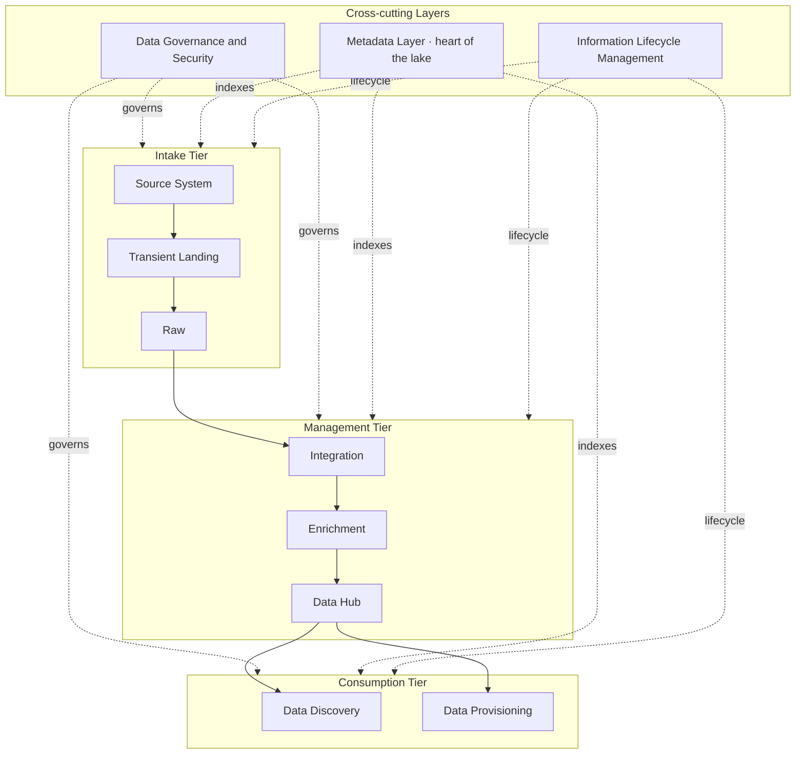
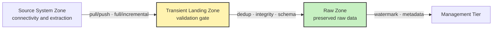

# Module 2 — Data Sourcing and Ingestion

## Task List

> Tip: ✅ = Done, 🔥 = WIP, 🕐 = Not started

| # | Task | Status |
|---|------|--------|
| **1** | Read & summarise Marr (2021) — Sourcing and Collecting Data (Ch. 6) | ✅ |
| **2** | Read & summarise Pasupuleti & Purra (2015) — The Need for Data Lake (Ch. 1) | ✅ |
| **3** | Read & summarise Pasupuleti & Purra (2015) — Data Intake (Ch. 2) | ✅ |
| 4 | Activity 1: Hands-on — Working with MongoDB and PyMongo | 🕐 |
| **5** | Activity 2: Interactive Knowledge Check | ✅ |

---

## Key Highlights

### 1. Marr, B. (2021). Data Strategy — Chapter 6: Sourcing and Collecting

**Citation:** Marr, B. (2021). *Data strategy: How to profit from a world of big data, analytics and artificial intelligence* (2nd ed.). Kogan Page. https://ebookcentral.proquest.com/lib/think/detail.action?docID=6735740

**Purpose:** After deciding *what* you want from data (Chapter 3's business questions), this chapter covers *where to get it* — defining data by structure (structured / semi / unstructured) and by ownership (internal / external), the newer data types worth capturing, and how to source data (including creating it when it doesn't exist).

---

#### 1. Start from strategy, not from the data
- **Sequence matters:** identify business questions first, *then* source the data that answers them. Sourcing is step two, not step one.
- **No data type is inherently better.** Strategic use = finding the data that works for *your* use case. Describe the **ideal datasets** for your objectives, then assess candidates on **ease of access** and **cost-effectiveness**.
- 🔑 Don't deploy a costly ML effort to mine messy social data when the same insight sits in plain clickstream data. Surface-level value others can find too ≠ competitive edge.
- **Timing:** decide *when* to collect — **real-time** for "micro-moments" (a customer passing your shop) vs daily/weekly/monthly (email campaigns). Guided by strategic objectives.

#### 2. Dark data
- **Dark data** = information we *know* exists but can't yet catalogue or analyse (term borrowed from physics' "dark matter").
- Dark because we lack the capability (e.g. archive of video with no computer vision) or it's locked in physical archives.
- As analytic tech improves, more dark data becomes usable. *Example:* **Iron Mountain** digitises clients' paper archives and extracts content + context with CV/NLP.

#### 3. Data by structure

| Type | Definition | Notes |
|---|---|---|
| **Structured** | Data in a fixed field within a defined record — rows/columns with a **schema** | Managed via **SQL** (1970s, "if-this-then-that" logic, no AI needed). Cheap, easy to store/analyse. **~20%** of world data. Less "rich". |
| **Unstructured** | Doesn't fit structured formats — email, web text, social posts, video, photos, audio | **~80%** of data; where undiscovered value lies. Bigger, costlier to store/analyse. |
| **Semi-structured** | Some structure (tags/markers) but unstructured content — e.g. a **tweet** (author, date, length, sentiment tags + free text) | Needs specialist tools (e.g. sentiment analysis via NLP). |

- 🔑 **AI/ML don't "analyse" unstructured data directly** — computer vision and NLP **convert it into structured data** (apply structure/schema), which traditional methods can then process. (e.g. sentiment analytics adds metadata to a tweet.)
- *Scale example:* Walmart ingests **>2.5 PB** of structured data per hour.

#### 4. Internal vs external data

| | **Internal data** | **External data** |
|---|---|---|
| **What** | Data your business owns / can collect itself (sales, HR, CCTV, sensors, web logs) | Info outside your org — public (gov census) or third-party (Amazon, social) |
| **Pros** | Cheap/free, no access issues, tailored to your business | Access without storage/security hassle; great for smaller firms |
| **Cons** | You bear maintenance, security & legal liability; may be insufficient alone | You don't own it, often pay, reliant on a third party |

- 🔑 The most valuable insights usually come from **combining** structured + unstructured **and** internal + external data (e.g. internal sales + bought-in demographics + customer feedback + social logs). *Netflix → House of Cards* commissioned on internal viewer data.

#### 5. Newer data types & sourcing
- **Newer types:** activity data, conversation data, photo/video, location, satellite imagery, sensor data — all still fall under structured/semi/unstructured and internal/external.
- **Conversation data** → content + context → sentiment analysis (but mind **legal/consent** rules on recording).
- **Sensor data** → self-generating but **lacks context in isolation** → combine with other datasets.
- **Accessing external data:** marketplaces & providers (Experian, Nielsen, Corelogic), free sources (WHO, IMF, data.gov / data.gov.uk, census), **Google Trends**, **weather data**, social platforms (give *tools/insights*, not raw personal data).
- **When data doesn't exist:** build products/services that capture it (first-mover advantage — Uber, Nest, John Deere, Springg), or generate **synthetic data** (e.g. via **GANs**) — cheap, privacy-safe, can avoid real-world bias.

#### Key Takeaways for BDA601
1. Directly supports **SLO b)** (best practices in data collection and storage) and feeds **Assessment 1 (Design a Data Pipeline)** — the *sourcing* end of the pipeline.
2. The structured/semi/unstructured framing continues from Module 1's **Variety** V; here it drives *collection* decisions, not just classification.
3. Internal+external and structured+unstructured blending is the recurring "richest insight" message — useful framing for the A1 report.
4. Sets up the next two resources: once you've *sourced* data, you need infrastructure (a **data lake**) to **ingest, store and retrieve** it.

---

### 2. Pasupuleti, P. & Purra, B. S. (2015). Data Lake Development with Big Data — Chapter 1: The Need for Data Lake

**Citation:** Pasupuleti, P. & Purra, B. S. (2015). *Data lake development with big data*. Packt. http://search.ebscohost.com.torrens.idm.oclc.org/login.aspx?direct=true&db=nlebk&AN=1104605&site=ehost-live

**Purpose:** Explains why traditional warehouses fail for big data, defines the **data lake**, lists its benefits and challenges, when to adopt one, and presents the overall **layers + tiers** architecture.

---

#### 1. Why traditional architectures fail
- Earlier systems (COBOL, monolithic processors, OLTP→ETL→OLAP→BI) answered **known questions for business users**, on mostly **structured** data.
- **Schema-on-write** mandates the data model *before* loading — fails when incoming data and the questions are unknown. Leads to **data silos** and no data discovery.
- Two enablers changed the game: **distributed computing** (scales linearly) + **new-age algorithms** (NLP, neural nets, deep learning, graph analytics).

| Traditional systems | Big Data systems |
|---|---|
| Monolithic scale | Distributed scale |
| Relational (RDBMS) | NoSQL, MPP, CEP |
| Low velocity | High-velocity ingestion |
| Mostly structured | Structured **+** unstructured |
| Linear/logistic regression | Random forests, deep learning, NLP |
| Reports & drilldowns | Tag cloud, heat map, advanced viz |

#### 2. Defining a Data Lake
- A **store-all repository** holding **every kind of data in raw format** until someone needs it.
- 🔑 Key attribute: **data is *not* classified when stored** → no upfront prep/cleansing/modelling (which eats most DW time). Enables answering questions you **don't know yet** (vs DW = optimised for known questions).
- **Schema-on-read** (not schema-on-write): store raw, apply structure when consumed.
- What it is **not**: *not Hadoop* (Hadoop is a subset), *not a traditional database* (uses NoSQL/in-memory), and it **complements** a data warehouse rather than replacing it.
- A **data scientist's hunting ground** — raw, granular, ad-hoc, iterative. Models data as **graph** (Neo4J), **document** (MongoDB), **columnar** (HBase), or **key-value** (Riak).

#### 3. Benefits & challenges

| Benefits | Challenges |
|---|---|
| Scale cheaply (HDFS, add clusters) | Complex — many layers/tools → deployment & maintenance effort |
| Plug in disparate sources (multi-structured) | **Governance** is critical — without it the lake becomes a "swamp" of silos |
| Acquire high-velocity data (**Kafka, Flume, Scribe, Chukwa**) | |
| Schema-on-read, store in native format | |
| Reuse SQL (HAWQ, IMPALA), advanced algorithms | |

- **When to adopt:** volumes/velocity beyond a DW; need to onboard new unprepared data fast; want to lower DW total cost; augment internal with external data; need lineage tracking; near-real-time analytics; **Data-as-a-Service (DaaS)** provisioning.

#### 4. Architecture — 3 layers (vertical) + 3 tiers (horizontal flow)

- **Layers** (cut across all tiers):
  - **Data Governance & Security** — access control, authentication (Hadoop + **Kerberos**), data lineage.
  - **Metadata Layer** — *"the heart of the data lake"*; indexes data so users search metadata before accessing data; enables SSBI, DaaS, MLaaS.
  - **Information Lifecycle Management (ILM)** — rules on what to keep/how long; auto purge/archive/down-tier as data value decays.
- **Tiers** (data flows sequentially): **Intake → Management → Consumption.**
  - **Intake tier** → zones: **Source System → Transient Landing → Raw** *(detailed in Ch. 2 below)*.
  - **Management tier** → **Integration → Enrichment → Data Hub** (final cleaned store: Oracle/MS SQL + HBase/Cassandra/MongoDB/Neo4J).
  - **Consumption tier** → **Data Discovery + Data Provisioning** zones (search via Elasticsearch/Solr; governed access).

#### Key Takeaways for BDA601
1. The data lake is the **storage/ingestion infrastructure** behind Module 1's lifecycle and **SLO b)** — and the backbone of the **A1 pipeline design**.
2. **Schema-on-read vs schema-on-write** is the single most quotable distinction — it's *why* lakes suit big data's unknown questions.
3. The **layers + tiers + zones** model is the structural map you'll cite when designing or diagramming a pipeline (use a Mermaid diagram in A1).
4. Connects to **Activity 1**: MongoDB (a document store) is exactly one of the NoSQL engines a lake uses.

---

### 3. Pasupuleti, P. & Purra, B. S. (2015). Data Lake Development with Big Data — Chapter 2: Data Intake

**Citation:** Pasupuleti, P. & Purra, B. S. (2015). *Data lake development with big data*. Packt. http://search.ebscohost.com.torrens.idm.oclc.org/login.aspx?direct=true&db=nlebk&AN=1104605&site=ehost-live (Ch. 2, pp. 29–49)

**Purpose:** A deep dive into the **Intake Tier** — its three zones, how data of each variety is acquired, the validation/integrity checks performed, and how to choose ingestion tools by use case.

---

#### 1. The Intake Tier — three zones (sequential flow)

1. **Source System Zone** → establishes connectivity, extracts data from external sources.
2. **Transient Landing Zone** → intermediate store; basic validity checks before promotion.
3. **Raw Zone** → validated raw data preserved (HDFS) for downstream processing.

#### 2. Source System Zone — acquisition
- **Connectivity** to DBs, file shares, SFTP/REST APIs, sensors/devices/cloud, social APIs (with pooling, retry, time-outs).
- **PULL vs PUSH:** *Pull* = zone polls the source on a schedule; *Push* = source sends data when available.
- **Load type:** **Full load** (first time, full snapshot) vs **Incremental load** (changes since last import).
- **Incremental (CDC) strategies:** **timestamps**, **range partitioning**, **change tables (CDC)**, **triggers**.

| Data variety | Examples | Typical loading |
|---|---|---|
| **Structured** | OLTP, POS, mainframe, ERP, delimited files | Mostly **pulled**, scheduled; full or incremental |
| **Semi-structured** | JSON/RDF/XML, app logs, clickstream | Pull or push; full or incremental |
| **Unstructured** | docs, email, social, RFID/sensor, images/video/audio | Streams (pushed) or batch full-load |

#### 3. Transient Landing Zone — validation gate
- **File validation:**
  - **Duplication check** (3 steps): compare **file name → schema → content (MD5 checksum)**; if all match → drop duplicate.
  - **Integrity check** — message digest computed at source vs on arrival.
  - **Size check** and **periodicity check** (alert if expected files don't arrive).
- **Data integrity:** **record counts**, **column counts**, **schema validation** (handle schema evolution with **Avro / Thrift**).
- 🔑 Without a Transient Zone, raw-zone data quality suffers — this is the **veracity** gatekeeper (ties to Module 1's Veracity V).

#### 4. Raw Storage Zone — preserve + track
- **Watermarking** — unique ID appended per record for lineage tracking.
- **Metadata capture** — source info, table/row/column details, MD5, ingest time, who ingested, retention period → builds a **data dictionary** for discovery.
- **Deep integrity:** **bit-level checks** (guard against **bit rot** on disks), **periodic checksums**, **mirroring** (keep redundant copies).
- **Security & governance** (mask sensitive data) + **ILM retention** (use-by date → archive/down-tier/purge).

#### 5. Practical scenarios + tool selection

- **Scenarios:** (a) product company integrates structured data + social media → improve UX/sales; (b) credit-card bank ingests batch (history, geography, spending) + **real-time transactions** → **fraud detection** with real-time pattern matching + alerts.
- **Architectural guidance — choose tools by use case:**

| Use case | Tools |
|---|---|
| **Structured ingest** (BI, OLAP, reports) | **Sqoop** (RDBMS↔Hadoop, CDC), **WebHDFS** (push to HDFS, no Hadoop on client), Splunk |
| **Streaming / semi & unstructured** (social, recommendations, sensor anomalies) | **Flume**, **Fluentd**, **Kafka**, **Amazon Kinesis**, **Apache Storm** |

- 🔑 No single tool fits all — most lakes **combine** tools; choice is driven by the **use case** and data variety/velocity.

#### Key Takeaways for BDA601
1. This is the **ingestion** core of **SLO b)** and the most concrete material for **Assessment 1 (Design a Data Pipeline)** — zones, checks, and tool choices are exactly what an A1 design diagram needs.
2. The **validation/integrity checks** operationalise **Veracity** — quality is enforced *at intake*, not after.
3. Tool families to remember: **Sqoop/WebHDFS** (structured) vs **Kafka/Flume/Kinesis/Storm** (streaming) — recurring data-engineering interview names.
4. **Velocity** decides architecture: batch (HDFS) vs real-time (in-memory, e.g. Gemfire) — links back to Module 1's V's.
