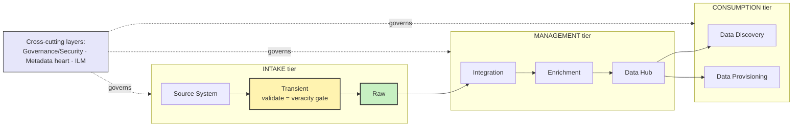

# BDA601 · Module 2 — One-Pager

> **Data Sourcing & Ingestion — the FRONT half of the pipeline**
> A fast, hand-write-it-yourself sheet. Built for 3 pens on a blank A4 (landscape, ~6 zones).

**Pen legend:** 🖤 Black = skeleton / always-true · 🔵 Blue = definitions & examples · 🔴 Red = exam + Assessment 1 hooks

---

## 🖤 The Big Idea (box it, centre of page)
> **Source from STRATEGY, then ingest RAW into a lake at the right SPEED.**
> Sourcing decides *what* data; ingestion decides *how/when* it lands. This is the front of the A1 pipeline.

## 🖤 Zone 1 — Sourcing (Marr, Ch.6)
- 🔵 **Strategy first, data second.** Define the ideal dataset for the question, *then* judge candidates on **access** + **cost**.
- 🔵 **By structure:** Structured ~20% (SQL, cheap) · Unstructured ~80% (text/video/audio, rich but costly) · Semi (tweet = tags + free text).
- 🔵 **By ownership:** Internal (own it, cheap, but you carry security/legal) vs External (gov/3rd-party, no storage hassle, but you don't own it).
- 🔴 **Richest insight = COMBINE** structured+unstructured **and** internal+external (Netflix → *House of Cards*).
- 🔵 **Dark data** = exists but can't yet use (no capability). **Synthetic data** (GANs) = generate when it doesn't exist — cheap, privacy-safe.
- 🔴 **AI doesn't read unstructured directly** — CV/NLP *convert it to structured* (add schema), then classic methods run.

## 🖤 Zone 2 — Lake vs Warehouse ⭐ (the most quotable line)
| | **Warehouse** | **Data Lake** |
|---|---|---|
| Schema applied | **schema-on-WRITE** (model first) | **schema-on-READ** (store raw, structure on use) |
| Data | mostly structured | struct + semi + unstructured |
| Answers | questions you **already know** | questions you **don't know yet** |
| Analogy | 🍷 **adega** (só vinho rotulado) | 📦 **galpão** (joga cru, organiza ao usar) |

- 🔴 **"Warehouse = schema-on-write · Lake = schema-on-read."** ← memorise verbatim.
- 🔵 Lake **complements** the warehouse (≠ replaces, ≠ "just Hadoop"). No governance → lake becomes a **swamp**.
- 🔵 **Why lakes exist (Traditional → Big Data shift):** monolithic→**distributed** · RDBMS→**NoSQL/MPP/CEP** · structured→**+unstructured** · regression→**deep learning/NLP** · reports→**heatmaps/viz**.

## 🖤 Zone 3 — Lake architecture (Pasupuleti & Purra)
**3 cross-cutting LAYERS** · **3 sequential TIERS** — sketch this flow:

- 🔵 Layers (cross-cut all tiers): **Governance/Security** (Kerberos, lineage) · **Metadata = "the HEART"** (search metadata *before* data) · **ILM** (auto archive/down-tier/purge as value decays).
- 🔵 **Lake = NoSQL engines:** graph (**Neo4J**) · document (**MongoDB** ← Activity 1) · columnar (**HBase**) · key-value (**Riak**). Data Hub also keeps Oracle/MS SQL.
- 🔴 **Medallion ↔ textbook map:** Bronze ≈ **Raw** · Silver ≈ **Management** · Gold/Serving ≈ **Consumption**.
- 🔴 **Transient = the VERACITY gate.** My A1 v2 trades the *synchronous* gate for **land-then-validate** (validate *after* Bronze) — legit for streaming, **not** a veracity hole (see Zone 5).

## 🖤 Zone 4 — Ingestion mechanics
- 🔵 **PULL** (zone polls source) vs **PUSH** (source sends). **FULL load** (snapshot) vs **INCREMENTAL** (only changes).
- 🔴 **CDC = Change Data Capture** — grab only what changed. **4 strategies:** timestamps · range partitioning · change tables · triggers.
- 🔵 **Transient validation:** dedup (**filename → schema → MD5 checksum**) · integrity (message digest) · record/column counts · size & periodicity.
- 🔴 **Tools by use case → AWS map:**
  - Structured/batch: **Sqoop**, WebHDFS → **AWS DMS / Glue**
  - Streaming: **Kafka, Flume, Fluentd, Kinesis, Storm** → **Kinesis**
  - Storage: **HDFS** → **Amazon S3**

## 🖤 Zone 5 — Streaming / Kafka 🔥 (today's gold)
- 🖤 **Two layers:** 🌍 *pipes* (cables/CDN — same internet) vs 📮 *post office* (**Kafka/Kinesis** organises events — THIS is the magic).
- 🔵 **5 words:** **Producer · Topic · Partition · Broker · Consumer.**
- 🔴 **Why Kafka is sinistro = DECOUPLING + append-only log:** producer is dumb, log is eternal, consumers independent → add a new consumer tomorrow and **replay** all history.
- 🔴 **"watermark" = TWO meanings:**
  - 📒 *Book (Raw zone):* per-record ID for **lineage/provenance**.
  - ⏱️ *Streaming (v2):* **event-time threshold** — "wait for stragglers up to X, then close the window" (handles late/out-of-order data).
- 🔴 **Streaming forces land-then-validate (ELT):** can't pause a firehose at a Transient gate → land raw in Bronze, validate after. *Same trade-off as Zone 3: v2 swaps the synchronous gate for post-Bronze validation — correct for a firehose.*

## 🔴 Assessment 1 hooks (bottom red strip)
> **A1 = Design a Data Pipeline** · 1500w · 30% · due **28/06/2026** · SLOs **a) b) e)**.
> Easy v2 upgrades from this module: name **schema-on-read** · add a **quarantine zone** (= modern Transient) · elevate **metadata-first** · make **ILM** explicit (not just "retention").

## 🔴 If you only memorise 5 things
1. **Strategy → data** (source for the question, not the other way).
2. **Lake = schema-on-read · Warehouse = schema-on-write.**
3. **Intake zones: Source → Transient (validate!) → Raw.**
4. **CDC** = only what changed (timestamps/partition/change tables/triggers).
5. **Kafka = decoupled append-only log** → replay; **watermark = late-data rule**.

---

### Margin prompts (answer in blue while you write)
1. At your day job (warehouse + ops DB) — which is schema-on-write, which would be the lake?
2. For Big Retail clickstream, who is the Producer and who are the Consumers?

### This-week to-dos (still 🕐 in your notes)
- [ ] Activity 1 — Hands-on **MongoDB + PyMongo** (a document store the lake uses)
