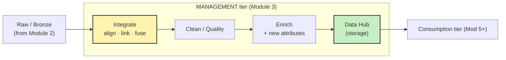

# BDA601 · Module 3 — One-Pager

> **Integration & Storage — the MIDDLE+END of the pipeline (the lake's MANAGEMENT tier)**
> A fast, hand-write-it-yourself sheet. Built for 3 pens on a blank A4 (landscape, ~6 zones).

**Pen legend:** 🖤 Black = skeleton / always-true · 🔵 Blue = definitions & examples · 🔴 Red = exam + Assessment 1 hooks

---

## 🖤 The Big Idea (box it, centre of page)
> **Make many conflicting sources ONE trustworthy view, then STORE it for the right Consistency/Availability trade-off.**
> Module 2 landed RAW data. Module 3 = **integrate → clean → enrich → store**. This is the lake's **management tier**.

## 🖤 Zone 1 — Why integrate (Foote 2019)
- 🔴 **Integration happens BEFORE any analytics.** "Before analytics can be performed, integration has to happen" — data sourced, moved, transformed, provisioned (securely).
- 🔵 **= unify** data from varied sources/formats into one **translated view**. Incompatible/untransformed data = useless.
- 🔵 **4 integration patterns:** **ETL** (clean→store) · **ELT** (store raw→clean later; cloud lakes) · **Data Virtualization** (soft view, no copy; latency cost) · **Streaming** (live events: IoT/fraud).
- 🔴 **Logical (soft) fix > physical rewrite** of legacy data — add metadata/transform rules to route & reconcile; rewriting risks data loss + cost. *(Big firms minimise risk.)*
- 🔴 **5 challenges:** staff · bringing-in data · **synchronization** (sources desync) · incompatible NoSQL tools · no **strategy** (silo-hopping).
- 🔴 **Design rule:** bake in **performance + governance + security** from the *logical architecture*, not bolted on later. (Same "governance ≠ optional" lesson as lake→swamp in Mod 2.)

## 🖤 Zone 2 — The 3-step integration pipeline ⭐ (Dong & Srivastava) — most quotable
| Step | Kills the ambiguity of… | Output |
|---|---|---|
| **1. Schema alignment** | **Semantic** (same concept modelled differently) | mediated schema + attribute match + mapping |
| **2. Record linkage** | **Instance** (same entity written differently) | records partitioned → 1 partition = 1 real entity |
| **3. Data fusion** | **Quality** (sources give conflicting values) | the **true value** chosen per data item |

- 🔵 **Flights example:** 5 sources (2 airlines, airport, fares, codes). `EWR` vs `Newark Liberty`; flight `49` vs `A1-49`; conflicting arrival dates → align, link, fuse.
- 🔴 **"Schema alignment → record linkage → data fusion."** ← memorise verbatim. Big data just amplifies it via the **Vs** (millions of sources; can't compare every pair of billions of records).

## 🖤 Zone 3 — Management tier (Pasupuleti Ch.3 · 🔥 ebook WIP)
**2nd lake component** after intake. After raw lands, give it a unified+trustworthy form, then store:

- 🔵 **Enrichment** = augment data with **new attributes** so later analytics is easier (e.g. add geo/segment columns).
- 🔴 **Tier map:** Intake (Mod 2) → **Management (this module)** → Consumption (later). Medallion: Raw=**Bronze**, Curated/Management=**Silver**, Serving=**Gold**.

## 🖤 Zone 4 — Lake storage = the Data Hub (S3 + ADLS Gen2)
| | **AWS** | **Azure** |
|---|---|---|
| Lake store | **Amazon S3** | **ADLS Gen2** (on Blob) |
| Governance / catalog | Lake Formation · Glue · DataZone | Azure AD · RBAC + **POSIX ACLs** |
| Key perf trick | Glue serverless integration | **Hierarchical Namespace** → *atomic* dir rename (vs O(n) copy) + ABFS |
| Analytics | Athena · EMR · Redshift | HDInsight · Databricks · Synapse |

- 🔴 **The money line: "Performance → less compute (the expensive part) → lower cost."** Faster storage = insights sooner *and* cheaper.
- 🔵 Both: **store-all in original format**, query directly, **separate storage & compute**, governance/security first-class. (S3: >1M lakes.)

## 🖤 Zone 5 — NoSQL taxonomy + CAP ⭐ (today's gold · Siddiqa 2017)
**4 data models** — pick by *shape of data + access*:

| Model | Stores as | Best for | Engines |
|---|---|---|---|
| **Key-value** | key → value (small objects) | sessions, carts, fast lookups | Redis, DynamoDB, Riak, Voldemort |
| **Column-oriented** | columns stored separately | aggregation, warehousing | **HBase, Cassandra, BigTable, Hypertable** |
| **Document** | value = **JSON** doc | profiles, web/content, flexible schema | **MongoDB**, CouchDB, RethinkDB |
| **Graph** | objects + **relationships** | recommendations, fraud, social | **Neo4j**, AllegroGraph, InfiniteGraph |

- 🔴 **CAP (Brewer):** can't have all 3. **Partition-resilience is MANDATORY** (splits are rare but unavoidable) → real choice = **C vs A**.
- 🔴 **CP** (strong consistency, synchronous writes, may go *unavailable*): HBase, BigTable, Redis, MongoDB, **all graph DBs**. — **ACID**.
- 🔴 **AP** (always answers, *eventual* consistency): **Cassandra, DynamoDB, Voldemort**, CouchDB. — **BASE** (Basic-Avail, Soft-state, Eventual).
- 🔵 Relational fails big data (rigid schema, slow to evolve). **HDFS = append-only** (no in-place update). Hadoop/MapReduce = batch.

## 🔴 Assessment 1 hooks (bottom red strip)
> **A1 = Design a Data Pipeline** · 1500w · 30% · due **28/06/2026** · SLOs **a) b) e)**.
> Module 3 = the **middle + end** of your pipeline:
> 1. **Integrate** — name a *schema-alignment → record-linkage → data-fusion* step for your sources.
> 2. **Store** — pick a lake store (S3/ADLS) + a NoSQL model, and **justify via CAP** (do you need CP correctness or AP availability?).
> 3. **Quote:** "performance → less compute → lower cost" + "governance from the logical architecture".
>
> **Dr. Chen wants (Week 3):** analyse data *first* (sources + example **columns/rows**) · align to the **5 Vs (not 6)** · design **logical → physical** · recommend **ONE platform** (justify) · **diagrams/tables = bonus marks**. See [class notes](module03_notes-class.md).

## 🔴 If you only memorise 5 things
1. **Integration comes BEFORE analytics** — governance/security from day one.
2. **Schema alignment → record linkage → data fusion** (semantic / instance / quality).
3. **4 NoSQL models:** key-value · column · document · graph (+ one engine each).
4. **CAP:** partition-resilience mandatory → choose **CP (consistency)** or **AP (availability)**.
5. **Lake storage rule:** performance → less compute → lower cost.

---

### Margin prompts (answer in blue while you write — anchor to your day job)
1. Merging your **warehouse** with an **operational DB**: the same customer has different IDs and a conflicting "last order date" — which part is *record linkage* and which is *data fusion*?
2. A **fraud check** must be correct (→ **CP**), a **sensor firehose** must always accept writes (→ **AP**) — name an engine for each.

### This-week to-dos (from your notes)
- [ ] Activity 1 — Forum post **S3 vs ADLS cost models** (🔥 draft ready — post it)
- [ ] Activity 2 — Module 3 **knowledge check** (LMS)
- [ ] Pull **Pasupuleti Ch.3** PDF (EBSCO) → finish Zone 3 / Resource 3
