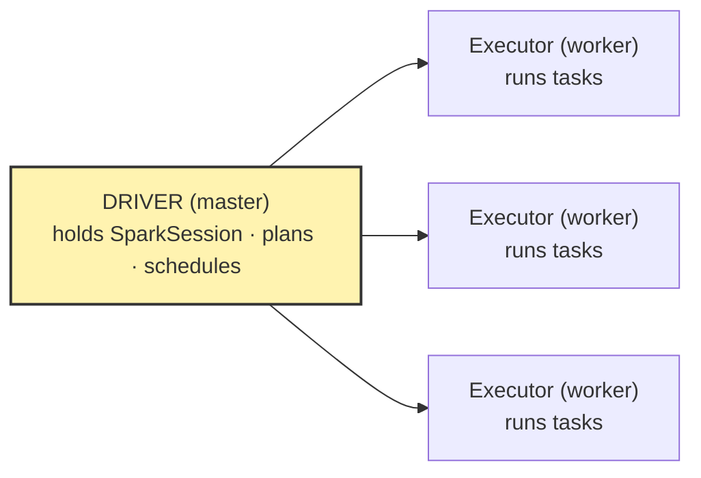

# BDA601 · Module 4 — One-Pager

> **Apache Spark — the ANALYTICS ENGINE that processes the data you stored (the consumption side of the pipeline)**
> A fast, hand-write-it-yourself sheet. Built for 3 pens on a blank A4 (landscape, ~6 zones).

**Pen legend:** 🖤 Black = skeleton / always-true · 🔵 Blue = definitions & examples · 🔴 Red = exam + Assessment 1 hooks

---

## 🖤 The Big Idea (box it, centre of page)
> **Spark is the ENGINE that processes the data - distributed, in-memory, up to 100x faster than Hadoop.**
> Modules 2-3 built the lake (**ingest → integrate → store**). Module 4 = **process it at scale** with **PySpark** (Spark + Python).

## 🖤 Zone 1 — Why Spark (vs Hadoop/MapReduce)
- 🔵 **= open-source distributed processing engine.** Read · transform · aggregate · train ML, all across a cluster.
- 🔴 **Up to 100x faster in memory** (≈10x on disk) than Hadoop. **Why:** **in-memory** compute + **lazy DAG** optimisation.
- 🔵 **Polyglot APIs:** Java · Scala · Python · R · SQL. **Spark + Python = PySpark.**
- 🔴 **One unified stack** (vs Hadoop's stitched tools): **Spark Core · Spark SQL · Streaming · MLlib/ML · GraphX**.
- 🔵 **Runs anywhere** (laptop → YARN/Mesos → cloud); **reads** HDFS, Cassandra, HBase, **S3** (your Mod 3 lake).
- 🔵 Origin: **Matei Zaharia**, UC Berkeley, v1 2012 → Apache flagship → **Databricks**.

## 🖤 Zone 2 — Execution model (driver · executors · DAG)

- 🔵 **Driver** = 1 per app: builds the plan, decides number/composition of tasks. **Executors** = workers that run them.
- 🔴 **DAG** (Directed Acyclic Graph): every **job** is a dependency graph. The **DAGScheduler** optimises stages and **avoids shuffling** (the most expensive operation).

## 🖤 Zone 3 — The abstraction ladder ⭐ (RDD → DataFrame → Dataset)
| Layer | What it is | Use it? |
|---|---|---|
| **RDD** | immutable, distributed JVM objects - the **foundation** | low-level; rarely by hand |
| **DataFrame** | RDD organised into **named columns** = distributed table | ✅ **live here in PySpark** |
| **Dataset** | strongly-typed API, **Java/Scala only** | ❌ no Python Dataset API |

- 🔴 **Transformations** (`map`, `filter`) = **lazy**, return a *new* RDD/DF. **Actions** (`count`, `collect`, `take`) = **trigger** the work + return to driver.
- 🔴 **Lazy eval** → Spark optimises the *whole* query before running. **Lineage** → if a partition is lost, **recompute it** from the transformation log (fault tolerance, not replication).
- 🔵 DataFrames are fast because of **Catalyst** (query optimiser) + **Tungsten** (memory/CPU). 🔴 **Immutable** = every op returns a new DF (same append-only idea as **HDFS**, Mod 3).

## 🖤 Zone 4 — DataFrame API verbs (the day-to-day)
| Job | PySpark |
|---|---|
| Load CSV | `spark.read.csv('f.csv')` |
| View | `df.show(3)` · `df.take(3)` (list) · `df.limit(n)` (new DF) · ⚠️ `df.collect()` **can crash the driver** |
| Columns | `df.select(...)` · `df.withColumn('new', df.x*2)` · `withColumnRenamed` · `drop` · `df.columns` |
| Rows | `df.filter(cond)` · `df.distinct()` · `df.orderBy('c', ascending=False)` · `df.union(df2)` *(same schema!)* |
| Aggregate | `df.groupBy('c').count()` - **always end groupBy with an aggregation** |

## 🖤 Zone 5 — Functions, the UDF trap & joins (today's gold)
- 🔵 **Built-ins** from `pyspark.sql.functions`: **strings** `lower`/`upper`/`substring` *(⚠️ 1-based!)* · **dates** `to_timestamp`/`date_add`/`dayofweek`/`date_format` · **math** `sin`/`log`.
- 🔴 **UDF performance trap:** a **Python UDF** = serialize fn + start a **separate Python process** per worker + serialize data **row by row** → slow + workers crash (Python vs JVM fight for memory). **→ Built-in > UDF, always.** If you must, write it in **Scala/Java** (stays in JVM). **Apache Arrow** = the long-term fix.
- 🔵 **Joins:** `df.join(df2, df.key == df2.key, 'left_outer')`. Types: **inner** (both) · **outer** (either) · **left/right outer**. Tricks: `lpad(col,3,'0')` to match key formats · `df.cache()` + an action to materialise.

## 🔴 Assessment 1 hooks (bottom red strip)
> **A1 = Design a Data Pipeline** · 1500w · 30% · due **28/06/2026** · A1 SLOs **a) b) e)** · Module 4 SLOs **c) d) e)**.
> Module 4 = the **processing/consumption engine** on top of your stored, integrated data:
> 1. **Name** Spark/PySpark as the analytics engine that runs on your lake (S3) data.
> 2. **Justify** it: in-memory + lazy DAG = scale; **one stack** (SQL/ML/streaming) beats stitched Hadoop tools.
> 3. **Design choices:** prefer **DataFrames over RDDs**; **built-ins over UDFs**.

## 🔴 If you only memorise 5 things
1. **Spark = distributed in-memory engine, ~100x Hadoop** (in-memory + lazy DAG).
2. **Driver plans, executors work**; DAGScheduler avoids the **shuffle**.
3. **RDD** (immutable, lineage, lazy) **→ DataFrame** (named columns, *use this*) **→ Dataset** (JVM only).
4. **Transformations are lazy, actions trigger** - and `collect()` can crash the driver.
5. **Built-in functions > UDFs** (serialization across JVM↔Python kills performance).

---

### Margin prompts (answer in blue while you write — anchor to your day job)
1. A warehouse query that aggregates **millions of order rows**: how does `groupBy().count()` + a lazy DAG spread that across a cluster instead of hammering one DB box?
2. You join an **orders** table to a **reference/dimension** table whose keys have leading zeros - which **join type** keeps *all* orders, and which **built-in** fixes the key mismatch?

### This-week to-dos (from your notes)
- [ ] Install/verify **PySpark**; run the **DataFrame + Functions** notebooks on a real CSV
- [ ] Module 4 **Interactive Knowledge Check** (LMS)
- [x] R1-R3 summarised → [module04_notes.md](module04_notes.md)
