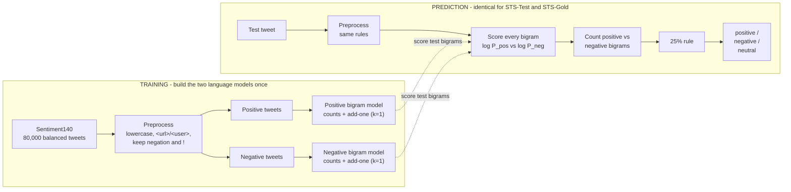

# Twitter Sentiment Analysis Using an N-Gram Language Model

**Student:** Luis Faria | **Subject:** DLE602 Deep Learning | **Assessment 1 — Programming Problems**
**Model:** Bigram probabilistic language model | **Datasets:** STS-Test and STS-Gold (Zhao, Gui & Zhang, 2018)

---

## Introduction

Twitter sentiment analysis assigns positive, negative, or neutral sentiment to short, noisy social-media messages. Zhao, Gui, and Zhang (2018) approached this with deep convolutional neural networks; this assessment instead implements the required probabilistic N-Gram language model. Separate positive and negative bigram models are trained from labelled tweets, and a simple threshold rule decides each tweet's sentiment. The same model, preprocessing, and rule are applied to two of the paper's five datasets — STS-Test and STS-Gold — so their outcomes can be compared on identical terms.

## Implementation method

The classifier uses a bigram model (n = 2) with add-one (Laplace) smoothing over a 49,038-token vocabulary, trained on a balanced 80,000-tweet sample of the Sentiment140 corpus (Go et al., 2009). Tweets are normalised by lowercasing, replacing URLs and usernames with placeholder tokens, stripping the hash symbol while keeping the hashtag word, and retaining exclamation marks and negation. For each test tweet, every bigram is scored under both models; a bigram counts as positive or negative when its smoothed conditional log-probability is higher under that model. Following the brief, a tweet is labelled positive when at least one quarter of its bigrams are positive and outnumber the negative ones, negative by the mirror rule, and neutral otherwise.

*Figure 1. Bigram model's training and prediction pipeline.*

## Results and comparison

The two sources produced clearly different outcomes (Table 1). On STS-Gold the model reached 0.72 accuracy and 0.73 macro-F1; on STS-Test it managed only 0.45 accuracy and 0.40 macro-F1. Three factors explain the gap. First, STS-Gold is a two-class problem, whereas STS-Test adds a neutral class the model struggles with: it predicted neutral for only 38 of 498 tweets, far below the 139 truly neutral ones. With Laplace smoothing almost every bigram leans slightly positive or negative, so the 25% threshold is easily crossed and neutral is rarely chosen. Second, STS-Gold's informal tweet style closely matches the emoticon-labelled training corpus, giving denser, more reliable bigram evidence. Third, both datasets share a positive-leaning bias — predicted positives exceed true positives in each — inherited from the training data. The shared model behaviour is therefore consistent, but its usefulness depends heavily on the target source. A trigram variant performed worse on both datasets (0.42 and 0.55 accuracy), confirming that higher-order N-Grams are too sparse for short tweets, so the bigram is the submitted model.

*Figure 2. Confusion matrices illustrating the model's performance.*

  
  

## Critical reflection

The errors reveal the core limitation of N-Grams. Sarcasm ("worked on 5 bone marrow cases today! All + for cancer!"), emoji sentiment, and long-range negation ("no. it is too big. I'm quite happy") are misread, because local word-pair counts carry no contextual meaning and unseen phrases receive only smoothed probabilities. The model also has no learned concept of neutrality; that class emerges purely from the threshold. These weaknesses are exactly what the deep CNN of Zhao, Gui, and Zhang (2018) addresses through learned word embeddings and wider context.

## Conclusion

The N-Gram model is a transparent, reproducible baseline that classifies tweets reasonably when training and test language overlap, as on STS-Gold, but degrades on harder, multi-class sources such as STS-Test. Its accuracy depends on dataset vocabulary, class balance, and preprocessing rather than genuine language understanding.

---

# Appendices

## Appendix A - Glossary

**Table A1. Glossary of key terms.**

| Term | Definition |
|---|---|
| N-gram | A contiguous sequence of *n* tokens used to model language by counting how often each sequence occurs. |
| Unigram / Bigram / Trigram | N-grams with n = 1, 2, 3. A bigram conditions each word on the **1** previous word; a trigram on the **2** previous words. |
| Language model | A model that assigns a probability to a sequence of words, or predicts the next word given the preceding ones. |
| Markov assumption | The simplification that the next word depends only on the last *n*-1 words, not the full history. Its cost is the loss of long-range context. |
| Maximum Likelihood Estimation (MLE) | Estimating a bigram probability directly from counts: `P(w | prev) = C(prev, w) / C(prev)`. |
| Add-one (Laplace) smoothing | Adding a pseudo-count *k* = 1 to every n-gram so unseen pairs get a small non-zero probability: `(C + k) / (C(context) + k·V)`. Prevents zero probabilities. |
| Vocabulary (V) | The set of distinct tokens seen in training. Here V = 49,038, which sets the denominator term `k·V` in smoothing. |
| Log-probability | The logarithm of a probability. Summing log-probabilities avoids numerical underflow when multiplying many tiny values, and preserves ranking. |
| Out-of-vocabulary (OOV) | A token unseen in training; mapped to a placeholder so the model can still score it via smoothing. |
| 25% rule | The brief's decision rule: label a tweet positive if at least one quarter of its bigrams are positive (and outnumber the negatives), negative by the mirror rule, otherwise neutral. |
| Accuracy | Proportion of tweets whose predicted label matches the true label. |
| Macro-F1 | The unweighted mean of the per-class F1 scores; treats each sentiment class equally regardless of class size. |
| Confusion matrix | A table cross-tabulating true labels (rows) against predicted labels (columns) to expose which classes are confused. |
| Sentiment140 | A 1.6M-tweet corpus auto-labelled by emoticons (0 = negative, 4 = positive); used here as the training source. |
| STS-Test | The Stanford Twitter Sentiment test set (498 manually labelled tweets, three classes including neutral). |
| STS-Gold | A gold-standard Twitter set (2,034 tweets, positive/negative only) from Saif et al. (2013). |

## Appendix B - Results

*Table 1 — Results (bigram model, identical settings)*

| Metric | STS-Test | STS-Gold |
|---|---:|---:|
| Records evaluated | 498 | 2,034 |
| True negative / neutral / positive | 177 / 139 / 182 | 1,402 / 0 / 632 |
| Predicted negative / neutral / positive | 186 / 38 / 274 | 1,110 / 136 / 788 |
| Accuracy | 0.452 | 0.719 |
| Macro-F1 | 0.401 | 0.726 |

---

# Statement of Acknowledgement

I acknowledge that I have used the following AI tool(s) in the creation of this report:
- OpenAI ChatGPT (Codex-5.5)
- Anthropic Claude (Opus 4.8)

These tools were used to assist with understanding N-Gram probabilistic language models and the Markov assumption, structuring the Python classifier pipeline (preprocessing, bigram counting, add-one smoothing, and the 25% decision rule), debugging code and improving comment quality, interpreting the comparison between the two datasets, improving the clarity of academic language, and supporting APA 7th referencing conventions.

Prompt examples:
1. "Explain why add-one (Laplace) smoothing is needed in a bigram language model and how it changes the conditional probability formula."
2. "My classifier predicts neutral for very few tweets - how does the 25% threshold rule interact with smoothing to produce that, and how should I explain it critically in the report?"
3. "Format this as APA 7th: Go, Bhayani & Huang (2009), Twitter sentiment classification using distant supervision, Stanford CS224N project report."

I confirm that the use of these tools has been in accordance with the Torrens University Australia Academic Integrity Policy and the TUA, Think and MDS Position Paper on the Use of AI. I confirm that the final output is authored by me and represents my own critical thinking, analysis, and synthesis of sources. I take full responsibility for the final content of this report.

---

## References

Go, A., Bhayani, R., & Huang, L. (2009). *Twitter sentiment classification using distant supervision* (CS224N Project Report, Stanford). https://cs.stanford.edu/people/alecmgo/papers/TwitterDistantSupervision09.pdf

Saif, H., Fernández, M., He, Y., & Alani, H. (2013). Evaluation datasets for Twitter sentiment analysis: A survey and a new dataset, the STS-Gold. *Proceedings of the 1st International Workshop on Emotion and Sentiment in Social and Expressive Media (ESSEM)*. https://oro.open.ac.uk/40660/

Zhao, J., Gui, X., & Zhang, X. (2018). Deep convolution neural networks for Twitter sentiment analysis. *IEEE Access, 6*, 23253–23260. https://doi.org/10.1109/ACCESS.2017.2776930
