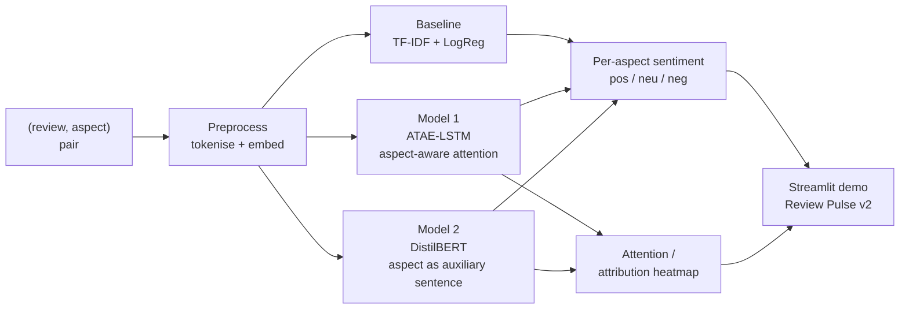

<!--
DLE602 Assessment 2 - Project Proposal Report - DRAFT v1
Body target: 1,000 words (+/-10%). Cover, ToC, captions, tables and references sit outside the count if allowed.
Per-section word targets are noted in italics under each heading - delete before final export.
Outstanding: figures/captions; final word count check.
-->

# Review Pulse v2: Aspect-Based Sentiment Analysis of Customer Reviews with Attention-Based Deep Learning

**Subject:** DLE602 Deep Learning - Assessment 2: Deep Learning Project Proposal Presentation
**Group members:** Luis Guilherme de Barros Andrade Faria (A00187785); Victor Javier Dorantes Meneses (A00179705); Juan Sebastian Martinez Contreras (A00167145)
**Project name:** Review Pulse v2
**Learning facilitator:** Dr Tayab Din Memon
**Date:** July 2026

---

## Table of Contents

1. Abstract
2. Problem Statement, Aim and Research Questions
3. Literature Review
4. Proposed Approach and Methods
5. Project Plan and Risk Management
6. Conclusion
7. References
8. Appendix A - From Assessment 1 to Review Pulse v2

---

## 1. Abstract
*(~90 words)*

Customer reviews carry mixed opinions - praise for one aspect, criticism of another - yet most sentiment systems, including our Assessment 1 N-gram classifier, reduce a review to a single label. This proposal designs **Review Pulse v2**, an aspect-based sentiment analysis (ABSA) system that predicts sentiment per aspect of a review. We compare an attention-based LSTM (ATAE-LSTM) with a fine-tuned transformer (DistilBERT) on the SemEval-2014 benchmark and add an attention-visualisation layer for interpretability. The proposal states the problem, synthesises the literature, sets out the method, and presents a feasible plan toward the Assessment 3 build.

## 2. Problem Statement, Aim and Research Questions
*(~150 words)*

**Problem.** Most sentiment systems assign a single polarity to a whole text. Our Assessment 1 N-gram classifier and the deep CNN of Zhao, Gui and Zhang (2018) both do exactly this. Real customer reviews are mixed: *"the food was great but the service was slow"* carries two opposite opinions, one per aspect. A single label collapses that detail and hides precisely what product, hospitality, and customer-experience teams need to act on.

**Aim.** Design and evaluate an aspect-based sentiment analysis system that predicts sentiment per aspect of a review, compares an attention-based LSTM (ATAE-LSTM) with a fine-tuned transformer (DistilBERT), and provides human-readable attention or attribution visualisations for each prediction.

**Research questions.**
- **RQ1** - How much does explicit aspect conditioning improve sentiment classification on multi-aspect sentences compared with a target-agnostic baseline?
- **RQ2** - How does an attention-LSTM compare with a fine-tuned transformer on the SemEval-2014 aspect sentiment task (accuracy, macro-F1)?
- **RQ3** - What human-readable evidence do attention or attribution visualisations provide for aspect-level predictions?

## 3. Literature Review
*(~350 words)*

Deep learning reset the baseline for sentiment analysis: Zhao, Gui and Zhang (2018) show that a convolutional network over word vectors outperforms hand-engineered features for Twitter sentiment. Yet their model, like our Assessment 1 N-gram classifier, resolves a whole text to a single polarity - the very limitation that aspect-based sentiment analysis (ABSA) exists to remove. Pontiki et al. (2014) reframed the problem in SemEval-2014 Task 4, defining the aspect-level benchmark and annotation scheme we adopt and shifting the question from *"is this review positive?"* to *"which aspect is positive?"*.

The sequence-modelling line answers that question by conditioning on the aspect. Tang et al. (2016) show that target-dependent LSTMs (TD-LSTM) outperform target-agnostic ones by encoding the aspect's position, but they still weight all context words equally. Wang et al. (2016) close that gap with ATAE-LSTM, adding an aspect embedding and an attention mechanism so the model learns *which* words matter for *which* aspect - the design we adopt as our first model and the source of our interpretability layer.

The transformer era diverges from recurrence. Devlin et al. (2019) replace sequential encoding with pretrained bidirectional attention, and Sun, Huang and Qiu (2019) adapt BERT to ABSA by constructing an auxiliary sentence per aspect, recasting classification as sentence-pair inference - the basis of our second (DistilBERT) model. Recent work pushes further: comparative benchmarks report strong transformer results on the same SemEval-2014 sets (Jayakody et al., 2024), and large language models now perform ABSA in zero- and few-shot settings (Simmering & Huoviala, 2023), a shift mapped by a recent systematic review of the field (Hua et al., 2024).

We build on, rather than chase, this frontier. Heavy LLM pipelines rarely pair a light, reproducible model with faithful explanations; and where reviews lack gold aspects, neural aspect discovery (He et al., 2017) can surface them unsupervised - our optional Topic Modelling stage. Our niche is explainable, low-compute aspect sentiment, evaluated honestly against this body of work.

## 4. Proposed Approach and Methods
*(~250 words)*

**Dataset.** We use SemEval-2014 Task 4 - Restaurants (~3k sentences) and Laptops (~3k), each annotated with aspect terms and polarity. The data is already annotated, which removes manual labelling and is a key feasibility factor; the restaurant domain maps cleanly to customer-experience framing.

**Scope.** We focus on **aspect sentiment classification given gold aspect terms** (the well-defined ATSC setting) rather than full end-to-end aspect extraction, which keeps the Assessment 3 build feasible. Extraction - and an optional neural Topic Modelling stage that *discovers* aspects when gold labels are absent - are documented stretch goals, not core deliverables.

**Model progression.** (1) A TF-IDF + logistic-regression sentence-level baseline establishes the aspect gap and ties back to Review Pulse v1. (2) A target-agnostic LSTM tests whether recurrence alone resolves that gap. (3) ATAE-LSTM, an LSTM conditioned on an aspect embedding with aspect-aware attention, tests the value of explicit aspect conditioning. (4) DistilBERT, fine-tuned with the aspect as an auxiliary sentence, is the modern contextual model. (5) An attention or attribution visualisation layer provides indicative, human-readable evidence for each prediction; it is not treated as a causal explanation without additional faithfulness tests.

*Figure 1. Review Pulse v2 pipeline. A (review, aspect) pair flows through shared preprocessing to three comparable models, producing a per-aspect sentiment label and an interpretability heatmap surfaced in the Streamlit demo.*

**Evaluation.** Accuracy and macro-F1 on aspect sentiment, with a per-class breakdown and a focused analysis of sentences containing conflicting aspect sentiment. Qualitative attention or attribution heatmaps assess interpretability. We use fixed seeds, explicit train/dev/test splits, and guard against data leakage. Cross-domain transfer from Restaurants to Laptops remains an optional extension because their aspect distributions differ.

**Deployment.** Assessment 3 ships a Streamlit demo where a user types a review and sees per-aspect sentiment plus the attention heatmap, mirroring the live Review Pulse v1 app.

## 5. Project Plan and Risk Management
*(~140 words)*

The plan runs from this proposal (Module 8) to the Assessment 3 submission (Module 12): data pipeline and classical baseline (Modules 8-9), ATAE-LSTM (Modules 9-10), DistilBERT fine-tuning (Module 10), interpretability and Streamlit demo (Module 11), then evaluation, comparison and report (Modules 11-12), with a submission buffer. The project is scoped to fit three constraints: a fixed academic timeframe, a zero-cost budget (free Colab GPU, open datasets and libraries) and three part-time contributors. Roles split across implementation, literature and project management, with equal presentation time. Critical success factors: pre-annotated data, compute within the free tier, and a working classical/LSTM path even if the transformer underperforms.

Key risks and mitigations: small data risks overfitting (mitigate with dropout, early stopping, and transfer learning); transformer fine-tuning could be heavy (use DistilBERT, contingency ATAE-LSTM only); scope creep (keep extraction and Topic Modelling as gated stretch goals); and attention is not guaranteed to be faithful, so we frame it as indicative, not causal.

## 6. Conclusion
*(~50 words)*

Sentence-level sentiment loses the aspect-level detail that businesses act on. Review Pulse v2 proposes an explainable, low-compute ABSA system that compares an attention-LSTM with a fine-tuned transformer and visualises its reasoning. The proposal sets a feasible, well-scoped path into the Assessment 3 build.

---

**Word count (body, Sections 1-6): ~1,045 words.** *Inside the 900-1,100 valid band for 1,000 +/-10%. Cover page, ToC, the Figure 1 diagram and caption, tables, references and Appendix A are excluded. Re-count after final edits and conversion to the submission template.*

---

## 7. References
*(APA - authors confirmed from the PDFs in `ARTICLES/`; confirm journal volume/issue/pages before final submission)*

Devlin, J., Chang, M.-W., Lee, K., & Toutanova, K. (2019). BERT: Pre-training of deep bidirectional transformers for language understanding. *Proceedings of NAACL-HLT 2019*, 4171-4186. https://aclanthology.org/N19-1423/

He, R., Lee, W. S., Ng, H. T., & Dahlmeier, D. (2017). An unsupervised neural attention model for aspect extraction. *Proceedings of ACL 2017*, 388-397. https://aclanthology.org/P17-1036/

Hua, Y. C., Denny, P., Wicker, J., & Taskova, K. (2024). A systematic review of aspect-based sentiment analysis: Domains, methods, and trends. *Artificial Intelligence Review, 57*(11), Article 296. https://doi.org/10.1007/s10462-024-10906-z

Jayakody, D., Isuranda, K., Malkith, A. V. A., de Silva, N., Ponnamperuma, S. R., Sandamali, G. G. N., & Sudheera, K. L. K. (2024). Aspect-based sentiment analysis techniques: A comparative study. *arXiv* preprint arXiv:2407.02834. https://arxiv.org/abs/2407.02834

Pontiki, M., Galanis, D., Pavlopoulos, J., Papageorgiou, H., Androutsopoulos, I., & Manandhar, S. (2014). SemEval-2014 Task 4: Aspect based sentiment analysis. *Proceedings of SemEval 2014*, 27-35. https://aclanthology.org/S14-2004/

Simmering, P. F., & Huoviala, P. (2023). Large language models for aspect-based sentiment analysis. *arXiv* preprint arXiv:2310.18025. https://arxiv.org/abs/2310.18025

Sun, C., Huang, L., & Qiu, X. (2019). Utilizing BERT for aspect-based sentiment analysis via constructing auxiliary sentence. *Proceedings of NAACL-HLT 2019*, 380-385. https://aclanthology.org/N19-1035/

Tang, D., Qin, B., Feng, X., & Liu, T. (2016). Effective LSTMs for target-dependent sentiment classification. *Proceedings of COLING 2016*, 3298-3307. https://aclanthology.org/C16-1311/

Wang, Y., Huang, M., Zhu, X., & Zhao, L. (2016). Attention-based LSTM for aspect-level sentiment classification. *Proceedings of EMNLP 2016*, 606-615. https://aclanthology.org/D16-1058/

Zhao, J., Gui, X., & Zhang, X. (2018). Deep convolution neural networks for Twitter sentiment analysis. *IEEE Access, 6*, 23253-23260. https://doi.org/10.1109/ACCESS.2017.2776930

---

## Appendix A - From Assessment 1 to Review Pulse v2

Assessment 1 established a transparent sentence-level baseline using observed N-gram counts. Assessment 2 proposes the transition from fixed local probabilities to learned contextual representations and from one sentiment label per text to one label per aspect. The evaluation discipline remains continuous across both assessments.

*Table A1. Knowledge transition from Assessment 1 to the proposed Assessment 2 and 3 project.*

| Assessment 1 - N-gram sentiment | Assessment 2/3 - Review Pulse v2 |
|---|---|
| Count observed word sequences | Learn distributed and contextual representations |
| Fixed Markov context window | LSTM recurrence, aspect-aware attention and Transformer context |
| One sentiment label per tweet | One sentiment label per aspect within a review |
| Add-k smoothing controls sparse counts | Dropout, weight decay, early stopping and transfer learning control overfitting |
| Hand-defined probability and threshold rule | Learned logits optimised through loss and backpropagation |
| Inspect bigram probabilities and error examples | Inspect attention or attribution alongside error examples |
| Accuracy, macro-F1 and confusion matrices | Retain the same metrics, now calculated for aspect-level predictions |

This is also the bridge from Review Pulse v1 to v2. The existing project supplies reusable preprocessing, experiment, metric and interface patterns, while A3 changes the model input from a review alone to a `(review, aspect)` pair. The implementation then compares a sentence-only baseline, aspect-conditioned ATAE-LSTM and fine-tuned DistilBERT before exposing per-aspect predictions in the Streamlit interface.

# Statement of Acknowledgement

We acknowledge that we have used the following AI tools in the preparation of this project proposal:

- OpenAI ChatGPT (Codex 5.5)
- Anthropic Claude (Opus 4.8)

Both tools were used to assist with clarifying aspect-based sentiment analysis (ABSA) concepts and the
progression from N-gram baselines to attention-LSTM and transformer models, structuring the literature
review and its critical synthesis, sanity-checking the SemEval-2014 experimental design against data
leakage, refining academic clarity, and supporting APA 7th referencing conventions. All source papers
were read and verified against the original publications by the group.

Prompt examples:

1. "Given our Assessment 1 N-gram single-label classifier, how do I frame the aspect-level problem so that a sentence like 'the food was great but the service was slow' motivates ABSA over sentence-level sentiment?"
2. "Compare ATAE-LSTM (Wang et al., 2016) and BERT-for-ABSA via auxiliary sentence (Sun et al., 2019) as two contrasting models on SemEval-2014 Task 4, and explain what each adds over a target-agnostic baseline."
3. "Review this project plan for a hypothetical ABSA proposal: are the risks, contingency plan and critical success factors sound and feasible within a fixed academic timeframe and a zero-cost compute budget?"

We confirm that the use of these AI tools has been in accordance with the Torrens University Australia
Academic Integrity Policy and the TUA, Think and MDS Position Paper on the Use of AI. We confirm that the
final output is authored by the group and represents our own critical thinking, analysis, and synthesis
of sources. We take full responsibility for the final content of this report.

---