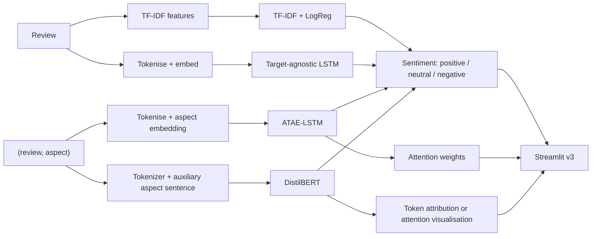

<!--
DLE602 Assessment 2 - Project Proposal Report - v4 Markdown source
Body target: 1,000 words (+/-10%). The declared count covers prose and list items in Sections 1-6 only; it excludes headings, cover details, the Table of Contents, figure/table captions and contents, Mermaid code, references, appendices, and the acknowledgement.
Reproducible count: select from "## 1. Abstract" through the line before "## 7. References"; remove headings, the fenced Mermaid block, Markdown table rows, captions, the example-review line, separators and the declaration; strip Markdown emphasis markers; then apply whitespace-token counting (`wc -w`). Result: 977.
-->

# ReviewPulse v3.0: Aspect-Based Sentiment Analysis of Customer Reviews with Attention-Based Deep Learning

**Subject:** DLE602 Deep Learning - Assessment 2: Deep Learning Project Proposal Presentation 
**Group members:** Luis Guilherme de Barros Andrade Faria (A00187785); Victor Javier Dorantes Meneses (A00179705); Juan Sebastian Martinez Contreras (A00167145) 
**Project name:** ReviewPulse v3.0 
**Learning facilitator:** Dr Tayab Din Memon 
**Date:** July 2026

---

## Table of Contents

1. Abstract
2. Problem Statement, Aim and Research Questions
3. Literature Review
4. Proposed Approach and Methods
5. Project Plan and Risk Management
6. Conclusion
7. References
8. Appendix A - From Assessment 1 to ReviewPulse v3.0
9. Appendix B - Risk Register
10. Statement of Acknowledgement

---

## 1. Abstract

Customer reviews often praise one aspect while criticising another, yet sentence-level sentiment systems - our Assessment 1 N-gram classifier and the ISY503 ReviewPulse v1.0.0/v2.x review-level classifiers alike - reduce a review to one label. This proposal designs **ReviewPulse v3.0**, a new aspect-based sentiment analysis (ABSA) system that predicts sentiment for a specified aspect rather than the whole review. Four models are compared on SemEval-2014 Restaurants: TF-IDF, a target-agnostic LSTM, ATAE-LSTM and DistilBERT. The study evaluates performance, efficiency and indicative token-level evidence, then proposes a Streamlit v3 prototype for Assessment 3.

## 2. Problem Statement, Aim and Research Questions

**Problem.** Most sentiment systems assign one polarity to an entire text. Our Assessment 1 N-gram classifier and the deep CNN of Zhao, Gui and Zhang (2018) do this. However, *"the food was great but the service was slow"* contains opposing opinions about two aspects. A single label hides the detail that product, hospitality and customer-experience teams need to act on.

**Aim.** Design and evaluate a low-compute ABSA system that predicts sentiment for a specified aspect, measures the value of aspect conditioning, compares ATAE-LSTM with DistilBERT, and presents indicative token-level evidence where the model supports attention or attribution.

**Research questions.**

- **RQ1** - How much does explicit aspect conditioning improve sentiment classification on multi-aspect sentences compared with target-agnostic baselines?
- **RQ2** - How do ATAE-LSTM and DistilBERT compare on accuracy, macro-F1 and computational efficiency?
- **RQ3** - What human-readable evidence do attention or attribution visualisations provide for aspect-level predictions?

## 3. Literature Review

Deep learning changed sentiment analysis by learning representations rather than relying only on engineered features. Zhao, Gui and Zhang (2018) report that a convolutional network over word vectors outperforms traditional baselines for Twitter sentiment. Nevertheless, their model, like ReviewPulse v1.0.0, produces one label per text. Pontiki et al. (2014) define SemEval-2014 Task 4 and its aspect-level annotations, shifting the practical question from whether a review is positive to which aspect is positive.

Sequence models address this gap through target conditioning. Tang et al. (2016) show that target-dependent LSTMs improve over target-agnostic variants by representing context around the target, although they do not selectively weight every context token. Wang et al. (2016) add an aspect embedding and attention in ATAE-LSTM, allowing the same sentence to be represented differently for each aspect. This makes ATAE-LSTM a suitable lightweight model and exposes attention weights, but the representation is still learned from a comparatively small benchmark and may overfit.

Transformers offer a different trade-off. Devlin et al. (2019) introduce pretrained bidirectional contextual representations, while Sun, Huang and Qiu (2019) reformulate ABSA as sentence-pair classification using an auxiliary aspect sentence. DistilBERT applies this contextual advantage with lower compute than full BERT, but it remains more expensive than ATAE-LSTM and neither transformer attention nor post-hoc attribution is automatically a faithful causal explanation. Recent transformer benchmarks (Jayakody et al., 2024), zero- and few-shot LLM studies (Simmering & Huoviala, 2023), and the review by Hua et al. (2024) position these models within a rapidly expanding field.

Accordingly, the project does not assume that the Transformer will win. It tests whether pretrained context justifies its additional cost against ATAE-LSTM's lighter, aspect-conditioned design. The comparison therefore combines predictive performance, efficiency and indicative interpretability evidence. Neural aspect discovery (He et al., 2017) remains a possible extension, not a requirement for the core experiment.

## 4. Proposed Approach and Methods

**Dataset and aspect origin.** SemEval-2014 Task 4 Restaurants is the primary domain; Laptops is an optional cross-domain extension. Training and evaluation use the dataset's gold aspect terms. The original `conflict` polarity label is removed from the three-class positive/neutral/negative task and its exclusions are counted and reported. In Streamlit v3, a user instead enters a review and manually specifies one or more aspects. Automatic aspect extraction and Topic Modelling remain outside the core scope.

**Model progression.** TF-IDF with logistic regression and a target-agnostic LSTM consume only the review and establish sentence-level baselines. ATAE-LSTM consumes `(review, aspect)` through an aspect embedding and aspect-aware attention. DistilBERT also consumes `(review, aspect)`, representing the aspect as an auxiliary sentence. This four-model progression isolates recurrence, explicit conditioning and pretrained contextual representation.

*Figure 1. ReviewPulse v3.0 pipeline. The sentence-level baselines receive only the review; the aspect-conditioned models receive a `(review, aspect)` pair. Only attention- or attribution-capable models produce token-level visual evidence.*

**Evaluation.** Accuracy, macro-F1, class-level results and efficiency are reported on fixed train/development/test splits. Splitting is grouped by sentence before aspect instances are formed, preventing the same review from leaking across partitions. A **mixed-polarity multi-aspect subset** contains sentences with at least two aspects associated with different polarities; it tests the cases that one sentence-level label cannot resolve.

*Table 1. Assessment 3 reporting shell. The last column evaluates sentences with at least two aspects carrying different polarities.*

| Model | Accuracy | Macro-F1 | Accuracy on mixed-polarity multi-aspect subset |
|---|---|---|---|
| TF-IDF + logistic regression (review only) | to be reported (A3) | to be reported (A3) | to be reported (A3) |
| Target-agnostic LSTM (review only) | to be reported (A3) | to be reported (A3) | to be reported (A3) |
| ATAE-LSTM (`review, aspect`; attention) | to be reported (A3) | to be reported (A3) | to be reported (A3) |
| DistilBERT (`review, aspect`; auxiliary sentence) | to be reported (A3) | to be reported (A3) | to be reported (A3) |

**Interpretability output.** For predictions from attention- or attribution-capable models, the interface presents the aspect label and indicative token-level evidence. ATAE-LSTM exposes attention weights; DistilBERT uses token attribution or an attention visualisation. Table 2 is an illustrative expected interface output, not an experimental result. TF-IDF and the target-agnostic LSTM are not required to produce heatmaps.

*Table 2. Illustrative expected output for one multi-aspect review. Bold text stands in for token shading. Attention is indicative evidence, not a causal explanation unless faithfulness tests support that interpretation.*

Review: *"The food was great but the service was slow."*

| Aspect | Predicted sentiment | Indicative token-level evidence (bold = highest weight) |
|---|---|---|
| food | positive | the · **food** · was · **great** · but · service · was · slow |
| service | negative | the · food · was · great · but · **service** · was · **slow** |

**Deployment.** The Assessment 3 prototype lets a user enter a review plus one or more aspects, then returns a sentiment for each aspect and model-supported visual evidence.

## 5. Project Plan and Risk Management

Work is divided into dated, reviewable outcomes (Table 3). Luis owns the technical foundation; group ownership marks integration points requiring peer review and shared acceptance. A fixed seed, versioned data audit, saved configurations and a single evaluation script support reproducibility. The group will review milestone evidence at each hand-off and reduce scope before moving a due date. Appendix B records probability, impact, mitigation and a concrete contingency for technical and collaboration risks.

*Table 3. Delivery plan from data audit to Assessment 3 package.*

| Phase | Date | Outcome | Owner |
|---|---|---|---|
| Data + baseline | 18-26 Jul | Audited dataset and TF-IDF baseline | Luis |
| LSTM + ATAE-LSTM | 27 Jul-2 Aug | Checkpoints and metrics | Luis |
| DistilBERT | 3-8 Aug | Trained Transformer | Luis |
| Evaluation + interface | 9-13 Aug | Comparison and Streamlit v3 | Group |
| Report + package | 14-19 Aug | Report, code and ZIP | Group |

The critical path is dataset audit, aspect-safe splitting, model training, common evaluation, interface integration and packaging. Zero-cost compute constrains Transformer experiments, so the accepted minimum product remains the audited baselines, ATAE-LSTM, shared evaluation and working interface. DistilBERT is retained when compute and validation checks pass; optional Laptops transfer, automatic aspect extraction and Topic Modelling are cut first.

## 6. Conclusion

Sentence-level sentiment loses actionable aspect detail. ReviewPulse v3.0 proposes a controlled four-model comparison, with Restaurants as the core domain, explicit aspect-safe evaluation and a dated delivery plan. The prototype will visualise indicative token-level evidence where supported, without presenting attention as model reasoning or a causal explanation.

---

**Word count (Sections 1-6 prose and list items): 977 words.** The count excludes headings, cover details, the Table of Contents, figure/table captions and contents, Mermaid code, references, appendices, and this declaration.

---

## 7. References

Devlin, J., Chang, M.-W., Lee, K., & Toutanova, K. (2019). BERT: Pre-training of deep bidirectional transformers for language understanding. *Proceedings of NAACL-HLT 2019*, 4171-4186. https://aclanthology.org/N19-1423/

He, R., Lee, W. S., Ng, H. T., & Dahlmeier, D. (2017). An unsupervised neural attention model for aspect extraction. *Proceedings of ACL 2017*, 388-397. https://aclanthology.org/P17-1036/

Hua, Y. C., Denny, P., Wicker, J., & Taskova, K. (2024). A systematic review of aspect-based sentiment analysis: Domains, methods, and trends. *Artificial Intelligence Review, 57*(11), Article 296. https://doi.org/10.1007/s10462-024-10906-z

Jayakody, D., Isuranda, K., Malkith, A. V. A., de Silva, N., Ponnamperuma, S. R., Sandamali, G. G. N., & Sudheera, K. L. K. (2024). Aspect-based sentiment analysis techniques: A comparative study. *arXiv* preprint arXiv:2407.02834. https://arxiv.org/abs/2407.02834

Pontiki, M., Galanis, D., Pavlopoulos, J., Papageorgiou, H., Androutsopoulos, I., & Manandhar, S. (2014). SemEval-2014 Task 4: Aspect based sentiment analysis. *Proceedings of SemEval 2014*, 27-35. https://aclanthology.org/S14-2004/

Simmering, P. F., & Huoviala, P. (2023). Large language models for aspect-based sentiment analysis. *arXiv* preprint arXiv:2310.18025. https://arxiv.org/abs/2310.18025

Sun, C., Huang, L., & Qiu, X. (2019). Utilizing BERT for aspect-based sentiment analysis via constructing auxiliary sentence. *Proceedings of NAACL-HLT 2019*, 380-385. https://aclanthology.org/N19-1035/

Tang, D., Qin, B., Feng, X., & Liu, T. (2016). Effective LSTMs for target-dependent sentiment classification. *Proceedings of COLING 2016*, 3298-3307. https://aclanthology.org/C16-1311/

Wang, Y., Huang, M., Zhu, X., & Zhao, L. (2016). Attention-based LSTM for aspect-level sentiment classification. *Proceedings of EMNLP 2016*, 606-615. https://aclanthology.org/D16-1058/

Zhao, J., Gui, X., & Zhang, X. (2018). Deep convolution neural networks for Twitter sentiment analysis. *IEEE Access, 6*, 23253-23260. https://doi.org/10.1109/ACCESS.2017.2776930

---

## Appendix A - From Assessment 1 to ReviewPulse v3.0

This appendix separates two lineages that are easy to conflate: the DLE602 assessment sequence (Assessment 1 to this proposal) and the ReviewPulse product releases (built independently for ISY503). The numbered list states plainly what ReviewPulse v3.0 does and does not inherit from the earlier releases; Table A1 then tracks the narrower Assessment 1 to Assessment 2/3 transition.

1. **DLE602 Assessment 1 - N-gram sentiment classifier.** A conceptual precursor only: a transparent, hand-built bigram model over Twitter data. It is not part of the ReviewPulse codebase and was never released as ReviewPulse v1.0.0.
2. **ReviewPulse v1.0.0 (ISY503, 2026-04-26).** The first ReviewPulse release: a TF-IDF + Logistic Regression baseline and a BiLSTM + GloVe neural model, both predicting one binary sentiment label (positive/negative) per whole Amazon review across four product domains.
3. **ReviewPulse v2.x (ISY503, 2026-04-29 onward).** Adds a fine-tuned DistilBERT transformer alongside the v1.0.0 models, plus a modular package refactor, expanded test coverage and a hardened Streamlit deployment. The prediction unit is unchanged: one label per whole review.
4. **ReviewPulse v3.0 (DLE602, this proposal).** A new implementation, not an extension of the same codebase's results: SemEval-2014 Restaurants replaces the Amazon dataset, the label space becomes three-class aspect sentiment (positive/neutral/negative), and the prediction unit becomes one label per `(review, aspect)` pair. All four models are trained from scratch on this new task; no ReviewPulse v1.0.0/v2.x checkpoint, metric or result is reused as an Assessment 3 outcome.

ReviewPulse v3.0 reuses the ISY503 project's engineering discipline: the preprocessing/training/evaluation package structure, the fixed-seed and versioned-artifact conventions, and the Streamlit deployment pattern. It reuses none of the ISY503 results: the task, dataset, label space, model inputs and evaluation protocol described in Sections 4-5 are all new for this proposal, and the ABSA system remains a design, not a completed build - Table 1 and Table 2 report placeholders, not measured outcomes.

*Table A1. Knowledge transition from Assessment 1 to the proposed Assessment 2 and 3 project.*

| Assessment 1 - N-gram sentiment | Assessment 2/3 - ReviewPulse v3.0 |
|---|---|
| Count observed word sequences | Learn distributed and contextual representations |
| Fixed Markov context window | LSTM recurrence, aspect-aware attention and Transformer context |
| One sentiment label per tweet | One sentiment label per specified aspect within a review |
| Add-k smoothing controls sparse counts | Dropout, weight decay, early stopping and transfer learning control overfitting |
| Hand-defined probability and threshold rule | Learned logits optimised through loss and backpropagation |
| Inspect bigram probabilities and error examples | Inspect attention or attribution where supported, alongside error examples |
| Accuracy, macro-F1 and confusion matrices | Retain the metrics for aspect-level predictions and add efficiency |

ReviewPulse v1.0.0 and v2.x also supply reusable preprocessing, experiment, metric and interface patterns. The Assessment 3 implementation changes the model input from review-only baselines to explicit `(review, aspect)` pairs for ATAE-LSTM and DistilBERT, then exposes per-aspect predictions in Streamlit v3.

## Appendix B - Risk Register

| Risk | Probability | Impact | Mitigation | Contingency |
|---|---|---|---|---|
| Overfitting on the small benchmark | High | High | Stratified development checks, dropout, early stopping and fixed seeds | Reduce model capacity and report variance across seeds |
| Transformer compute exceeds the free tier | Medium | High | DistilBERT, short pilot runs, capped sequence length and checkpointing | Ship ATAE-LSTM as the primary deep model and report the compute constraint |
| Leakage between aspects from the same sentence | Medium | High | Split by sentence identifier before expanding aspect instances; audit overlaps | Rebuild all splits and rerun every affected result |
| Artifact or model loading failure | Medium | High | Pin dependencies, save configs and test a clean-start load before packaging | Bundle a verified lightweight checkpoint and fall back to CPU inference |
| Scope creep from Laptops, extraction or Topic Modelling | High | Medium | Gate all extensions until the core acceptance tests pass | Remove extensions in that order and preserve the Restaurants core |
| Unequal group contribution | Medium | High | Named owners, dated evidence, twice-weekly reviews and a contribution log | Reassign overdue work within 24 hours and document the revised ownership |

# Statement of Acknowledgement

We acknowledge using OpenAI Codex and Anthropic Claude while preparing this project proposal. The tools assisted with clarifying ABSA concepts, structuring critical synthesis, checking the experimental design for leakage, refining academic expression and checking APA 7 conventions. The cited claims were verified against the original publications.

Prompt examples:

1. "Given our Assessment 1 N-gram single-label classifier, how do I frame the aspect-level problem so that a sentence like 'the food was great but the service was slow' motivates ABSA over sentence-level sentiment?"
2. "Compare ATAE-LSTM (Wang et al., 2016) and BERT-for-ABSA via auxiliary sentence (Sun et al., 2019) as contrasting models on SemEval-2014 Task 4, and explain what each adds over a target-agnostic baseline."
3. "Review this ABSA project plan: are its risks, contingency plan and success criteria feasible within a fixed academic timeframe and zero-cost compute budget?"

We confirm that these tools were used in accordance with the Torrens University Australia Academic Integrity Policy and the TUA, Think and MDS Position Paper on the Use of AI. The group retains responsibility for the report's final analysis, synthesis and content.
