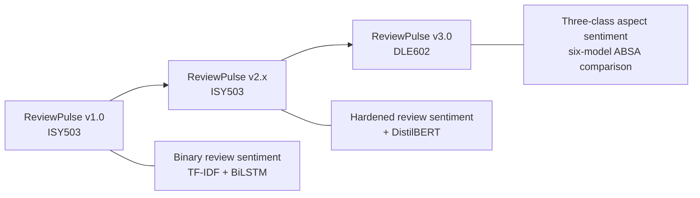
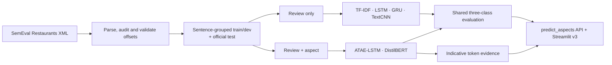
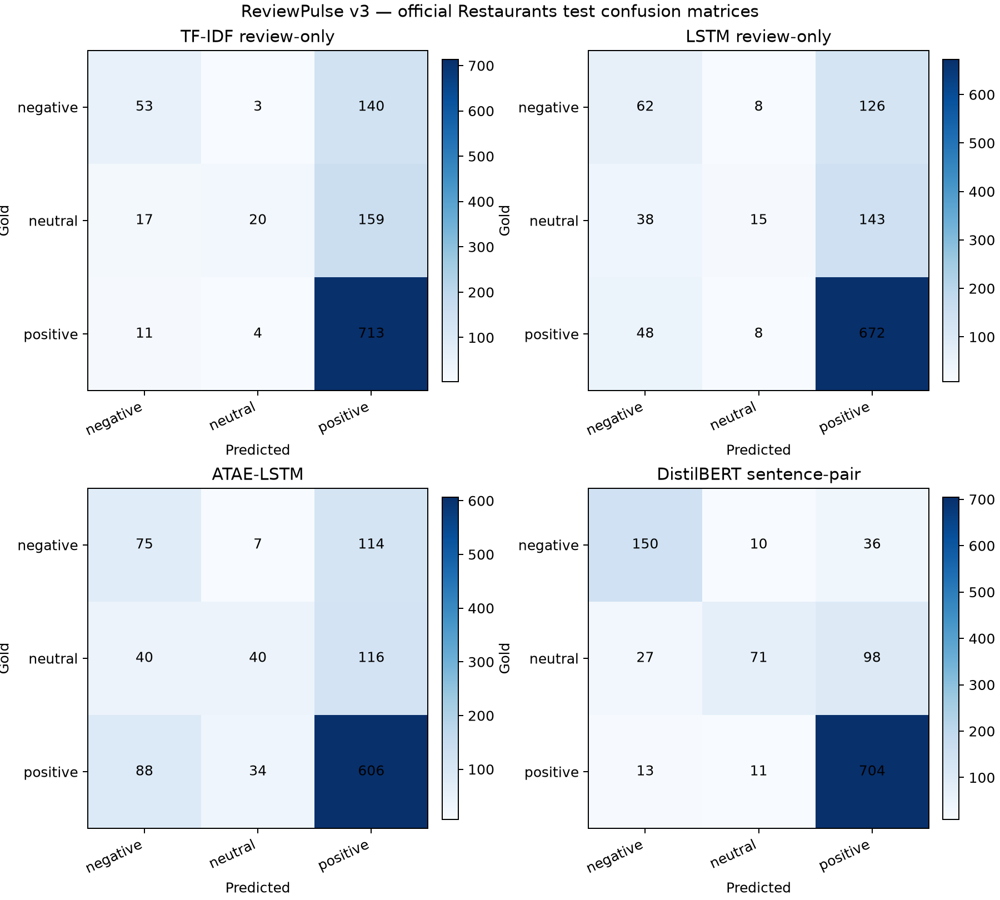

<!--
DLE602 Assessment 3 - Deep Learning Final Project Report - v2 Markdown source
Brief requirement: 1,500 words (+/-10%), i.e. 1,350-1,650 words, Report and Source Code.
The declared count covers prose and list items in Sections 1-6 only. It excludes headings, cover details,
the Table of Contents, Markdown table contents and captions, references and appendices.
Reproducible count: select from "## 1. Project Evolution" through the line before "## 7. References";
remove headings, fenced Mermaid blocks, Markdown table rows, image rows, captions, separators and the word-count declaration;
strip Markdown emphasis markers; then apply whitespace-token counting (`wc -w`).
Canonical four-model source: review-pulse commit bf36c3b3.
Supplemental six-model sources: artifact commit cef08fa and evaluation commit 941148c, merged in 0f02be3.
Release packaging and Git LFS deployment source: merged PR #101, commit 0ef3a26.
No result below is invented or illustrative.
-->

# ReviewPulse v3.0: Aspect-Based Sentiment Analysis - Implementation Report

**Subject:** DLE602 Deep Learning - Assessment 3: Deep Learning Final Project<br>
**Group members:** Luis Guilherme de Barros Andrade Faria (A00187785); Victor Javier Dorantes Meneses (A00179705); Juan Sebastian Martinez Contreras (A00167145)<br>
**Group ID:** [CONFIRM BEFORE SUBMISSION]<br>
**Project:** ReviewPulse v3.0<br>
**Repository:** [lfariabr/review-pulse](https://github.com/lfariabr/review-pulse)<br>
**Learning facilitator:** Dr Tayab Din Memon<br>
**Date:** August 2026

---

## Table of Contents

1. Project Evolution, Problem, Aim and Research Questions
2. Requirements and Scope
3. Data and Implementation Method
4. Deep Learning Principles Applied
5. Results and Critical Analysis
6. Limitations and Conclusion
7. References
8. Appendix A - Supplemental Six-Model Track
9. Appendix B - Project Delivery Record
10. Appendix C - Reproduction Commands
11. Academic Integrity Declaration
12. Statement of Acknowledgement

---

## 1. Project Evolution, Problem, Aim and Research Questions

ReviewPulse began in ISY503 as a review-level binary sentiment classifier: v1.0 established the classical pipeline and v2.x hardened the application and added a Transformer option. Those releases assign one label to a whole review and therefore average away mixed opinions. DLE602 v3.0 implements aspect-based sentiment analysis (ABSA), so *"the food was great but the service was slow"* can produce separate labels for `food` and `service`. This report evaluates the implementation actually built against the research questions submitted in Assessment 2; historical ISY503 checkpoints and metrics are not reused as DLE602 results.



*Figure 1. ReviewPulse evolved from one binary label per Amazon review to one three-class prediction per supplied restaurant aspect.*

**Aim.** Implement and critically evaluate a low-compute ABSA system on SemEval-2014 Restaurants, testing whether explicit aspect conditioning improves sentiment classification, comparing ATAE-LSTM with DistilBERT, and presenting indicative token-level evidence.

**Research questions.** RQ1: does aspect conditioning improve classification on multi-aspect sentences over target-agnostic baselines? RQ2: how do ATAE-LSTM and DistilBERT compare on accuracy, macro-F1 and efficiency? RQ3: what human-readable evidence do attention or attribution outputs provide?

## 2. Requirements and Scope

The submitted four-model ladder comprises TF-IDF, a target-agnostic LSTM, ATAE-LSTM and DistilBERT. All models use the official Restaurants test split, the fixed label order `negative`, `neutral`, `positive`, and one evaluation contract covering accuracy, macro-F1, per-class metrics, confusion matrices, a mixed-polarity multi-aspect subset, training time, inference latency and artifact size. A separate `predict_aspects(review, aspects, model_name)` API and Streamlit v3 page expose ABSA without widening the legacy `predict_sentiment()` contract.

Reproducibility requirements include fixed seeds, sentence-grouped leakage-safe development splits, development macro-F1 checkpoint selection, early stopping and restoration of the best neural checkpoint. The implementation persists configuration, training history and provenance with each artifact. Invalid input, unavailable checkpoints and unsupported evidence views produce explicit errors or states rather than silent fallback.

Automatic aspect extraction, Topic Modelling and Laptops transfer remain outside the implemented core. A target-agnostic GRU and review-only TextCNN were completed only after the four-model gates passed. They are reported as exploratory controls in Appendix A and do not retroactively redefine the Assessment 2 experiment.

## 3. Data and Implementation Method

The dataset is SemEval-2014 Task 4 Restaurants (Pontiki et al., 2014). After the original `conflict` polarity is counted and excluded from the three-class task, the official test set contains 1,120 aspect instances. Of these, 228 instances across 80 sentences form the **mixed-polarity multi-aspect subset**: sentences with at least two retained gold aspects carrying different polarities. This analytical subset is distinct from the removed SemEval `conflict` label.

Development data is derived from the official training partition using seed 42 and grouped by `sentence_id` before sentences are expanded into aspect instances. Consequently, aspects from one sentence cannot leak across training and development. Raw review text and annotated character offsets remain the alignment source; model-specific tokenisation occurs only after offset validation.

TF-IDF with Logistic Regression is the classical review-only baseline. A three-class bidirectional LSTM adds learned embeddings and recurrence while still receiving only the review, following the target-independent control motivated by target-dependent LSTM research (Tang et al., 2016). ATAE-LSTM adds an aspect embedding and aspect-conditioned attention (Wang et al., 2016). DistilBERT, a distilled pretrained Transformer (Sanh et al., 2019), is fine-tuned as a `(review, aspect)` sentence-pair classifier following the auxiliary-sentence ABSA formulation of Sun, Huang and Qiu (2019).

The neural trainers use Adam or AdamW, configured regularisation, development macro-F1 selection, patience-based early stopping and best-checkpoint restoration. Canonical ATAE-LSTM training used CPU, while DistilBERT used Apple MPS. Because the hardware differs, training and latency observations describe the executed environment; they are not a controlled hardware benchmark.

ATAE-LSTM exposes its learned attention distribution. DistilBERT evidence uses gradient × input attribution for the predicted class, aggregates wordpieces onto exact visible spans, and excludes special and aspect-sequence tokens. Both methods return aligned tokens, offsets and normalised within-view scores. Review-only models explicitly report token evidence as unsupported.



*Figure 2. ReviewPulse v3 data, model-input and delivery flow. GRU and TextCNN are exploratory review-only controls.*

The Streamlit workflow accepts one review and comma-separated manual aspects. It validates and de-duplicates the list, preserves input order and scores each aspect independently. A sample generator supports repeatable demonstrations. Missing artifacts, empty reviews, empty aspect lists and unknown models surface controlled messages, allowing the same interface to demonstrate both successful inference and predictable failure handling.

Implementation is separated into data, model, training, inference, evaluation and presentation modules under `src/absa`, with model adapters enforcing one prediction payload. Automated tests cover parsing and split leakage, trainer controls, artifact provenance, all six inference paths, exact evidence offsets, safe heatmap rendering, packaging and legacy compatibility. At the merged release-package baseline, the complete local suite records 271 passing tests and eight expected skips. Appendix C identifies the commands that regenerate the documented evidence.

## 4. Deep Learning Principles Applied

The model ladder isolates a principle at each stage. TF-IDF uses sparse engineered features and acts as a classical control. The LSTM introduces distributed representations and bidirectional recurrence, which model sequential context but still create the same review representation for every aspect. This deliberately exposes why representation learning alone cannot resolve contradictory labels attached to identical review input.

ATAE-LSTM conditions the recurrent representation on an aspect embedding and learns a weighted combination of hidden states. It can therefore read the same sentence differently for `food` and `service`. DistilBERT transfers contextual knowledge from BERT-style pretraining (Devlin et al., 2019) and allows review and aspect tokens to interact throughout the Transformer encoder. Its substantially larger parameter count tests whether pretrained contextual transfer justifies additional compute and storage.

Dropout and weight decay limit overfitting; early stopping and best-checkpoint restoration prevent reporting a convenient final epoch instead of the best observed development checkpoint. The fixed test split, label order and metric implementation support comparison of predictive behaviour. They do not, however, make cross-device timing controlled, nor does one fixed seed establish variance across retraining.

Attention and gradient attribution are treated as diagnostic views rather than model reasoning. Attention can vary without changing a prediction and need not identify causal features (Jain & Wallace, 2019). Accordingly, ReviewPulse labels darker tokens as higher-scored evidence within one aspect view and makes no claim that the view faithfully explains the decision.

## 5. Results and Critical Analysis

**Table 1** reports the canonical four-model experiment on the shared official test set.

| Model | Test accuracy | Test macro-F1 | Mixed accuracy | Mixed macro-F1 | Training | Warm ms/example | Artifact |
|---|---:|---:|---:|---:|---:|---:|---:|
| TF-IDF review-only | 0.7018 | 0.4605 | 0.4430 | 0.3319 | 0.14 s | 0.009 | 0.77 MB |
| LSTM review-only | 0.6687 | 0.4326 | 0.4167 | 0.3264 | 9.32 s | 0.103 | 2.25 MB |
| ATAE-LSTM | 0.6438 | 0.4799 | **0.4737** | **0.4491** | 14.17 s | 0.128 | 2.64 MB |
| DistilBERT sentence-pair | **0.8259** | **0.7231** | **0.6623** | **0.6427** | 133.65 s | 3.506 | 256.11 MB |

*Table 1. Canonical four-model comparison: 1,120 test instances and 228 mixed-polarity instances, commit `bf36c3b3`. Timing is observational across CPU and MPS.*



*Figure 3. Full-test confusion matrices generated by the canonical #84 evaluation runner at commit `bf36c3b3`; rows are gold labels and columns are predictions.*

**RQ1.** Both aspect-conditioned models outperform both review-only neural and classical controls on mixed-polarity accuracy and macro-F1. Against the review-only LSTM, DistilBERT gains 24.6 percentage points of mixed accuracy and 31.6 points of mixed macro-F1. ATAE-LSTM gains 5.7 and 12.3 points respectively. Four-model error analysis found 61 mixed cases where both aspect-conditioned models were correct and both review-only models were wrong, against four in the reverse direction. The result supports the benefit of explicit aspect input specifically where identical review text carries opposing labels.

**RQ2.** DistilBERT leads every predictive metric, but its 256.11 MB artifact is almost 100 times ATAE-LSTM's 2.64 MB artifact. ATAE-LSTM is weaker on full-test accuracy than TF-IDF and the LSTM, yet stronger on mixed macro-F1 and neutral-class discrimination. This is an important negative result: lightweight attention improves the target-sensitive behaviour central to RQ1 without guaranteeing higher aggregate accuracy. DistilBERT took longer and had higher latency in the recorded runs, but numerical timing ratios are not interpreted as architectural speedups because it ran on MPS while ATAE-LSTM ran on CPU.

**Table 2** presents the verified report example used to answer RQ3.

| Model / aspect | Prediction | Confidence | Highest-scored visible tokens |
|---|---|---:|---|
| ATAE-LSTM / food | positive | 86.4% | `Great` 0.241; `food` 0.131; `was` 0.127 |
| ATAE-LSTM / service | positive | 74.2% | `Great` 0.193; `!` 0.132; `dreadful` 0.130 |
| DistilBERT / food | negative | 82.7% | `dreadful` 0.288; `the` 0.163; `service` 0.151 |
| DistilBERT / service | negative | 91.3% | `dreadful` 0.488; `food` 0.095; `service` 0.095 |

*Table 2. Indicative evidence for “Great food but the service was dreadful!” from the verified #85 export. Gold labels are food-positive and service-negative.*

**RQ3.** The evidence changes with the supplied aspect, but neither model resolves both gold labels in this example. ATAE-LSTM predicts both aspects positive; DistilBERT predicts both negative. Some high-scored tokens are sentiment-bearing, while others are function words or belong to the opposite aspect. The visualisation is therefore useful for inspecting model sensitivity and diagnosing errors, not for claiming a faithful or causal explanation.

Across the canonical test set, the four models disagree on 428 instances and all miss 134. These counts demonstrate complementary predictions and shared failures, but the present experiment does not categorise those failures by linguistic phenomenon. Appendix A shows that adding GRU and TextCNN does not overturn the conclusion: neither review-only extension closes the mixed-polarity gap.

## 6. Limitations and Conclusion

The 228-instance mixed subset is comparatively small, and results come from one frozen seed rather than a multi-seed distribution. Apple MPS can remain nondeterministic despite seed control, so provenance identifies exact commits and a shared prediction hash rather than promising bit-identical retraining. Gold aspect terms are supplied manually in the application; automatic extraction and cross-domain Laptops evaluation are unimplemented. Evidence scores are model-specific and normalised within each view, so they should not be compared as absolute importance across models or examples.

ReviewPulse v3.0 nevertheless answers the submitted questions with measured implementation evidence. Explicit aspect conditioning materially improves classification on the mixed-polarity subset. DistilBERT provides the strongest predictions at substantially greater storage cost, while ATAE-LSTM offers a small aspect-aware alternative with stronger mixed-polarity behaviour than the review-only controls. Its attention and DistilBERT attribution provide indicative token-level evidence, not exposed reasoning. The completed GRU and TextCNN extensions reinforce rather than change this result. Next research steps are multi-seed uncertainty estimates, controlled same-device efficiency measurement, cross-domain evaluation and automatic aspect extraction; the remaining delivery step is the reproducible v3.0.0 submission package.

**Word count (Sections 1-6 prose and list items): 1,462 words.**

## 7. References

Devlin, J., Chang, M.-W., Lee, K., & Toutanova, K. (2019). BERT: Pre-training of deep bidirectional transformers for language understanding. *Proceedings of NAACL-HLT 2019*, 4171-4186. https://aclanthology.org/N19-1423/

Jain, S., & Wallace, B. C. (2019). Attention is not explanation. *Proceedings of NAACL-HLT 2019*, 3543-3556. https://aclanthology.org/N19-1357/

Pontiki, M., Galanis, D., Pavlopoulos, J., Papageorgiou, H., Androutsopoulos, I., & Manandhar, S. (2014). SemEval-2014 Task 4: Aspect based sentiment analysis. *Proceedings of SemEval 2014*, 27-35. https://aclanthology.org/S14-2004/

Sanh, V., Debut, L., Chaumond, J., & Wolf, T. (2019). DistilBERT, a distilled version of BERT: Smaller, faster, cheaper and lighter. *Proceedings of the 5th Workshop on Energy Efficient Machine Learning and Cognitive Computing*. https://arxiv.org/abs/1910.01108

Sun, C., Huang, L., & Qiu, X. (2019). Utilizing BERT for aspect-based sentiment analysis via constructing auxiliary sentence. *Proceedings of NAACL-HLT 2019*, 380-385. https://aclanthology.org/N19-1035/

Tang, D., Qin, B., Feng, X., & Liu, T. (2016). Effective LSTMs for target-dependent sentiment classification. *Proceedings of COLING 2016*, 3298-3307. https://aclanthology.org/C16-1311/

Wang, Y., Huang, M., Zhu, X., & Zhao, L. (2016). Attention-based LSTM for aspect-level sentiment classification. *Proceedings of EMNLP 2016*, 606-615. https://aclanthology.org/D16-1058/

## 8. Appendix A - Supplemental Six-Model Track

The supplemental evaluation preserves the four-model experiment and adds target-agnostic GRU and TextCNN records generated under the shared six-model contract. It uses artifact source commit `cef08fa`, evaluation source commit `941148c`, seed 42, prediction SHA-256 `9d439207a8fdcafed5328d513ee4921bfc8b0dc4ecefcb3e7a9622f66f40e196` and the same 1,120 test instances.

| Model | Scope | Test accuracy | Test macro-F1 | Mixed accuracy | Mixed macro-F1 | Training | Artifact |
|---|---|---:|---:|---:|---:|---:|---:|
| TF-IDF | A2 core | 0.7018 | 0.4605 | 0.4430 | 0.3319 | 0.14 s | 0.77 MB |
| LSTM | A2 core | 0.6687 | 0.4326 | 0.4167 | 0.3264 | 8.07 s | 2.25 MB |
| GRU | Exploratory | 0.6750 | 0.4603 | 0.4079 | 0.3156 | 7.02 s | 2.02 MB |
| TextCNN | Exploratory | 0.6893 | 0.4498 | 0.4167 | 0.3106 | 25.13 s | 1.81 MB |
| ATAE-LSTM | A2 core | 0.6438 | 0.4799 | 0.4737 | 0.4491 | 10.84 s | 2.64 MB |
| DistilBERT | A2 core | **0.8250** | **0.7199** | **0.6667** | **0.6473** | 122.08 s | 256.11 MB |

*Table A1. Frozen supplemental six-model comparison. The five smaller models ran on CPU and DistilBERT on MPS; timing is observational.*

GRU uses 10.31% fewer parameters than LSTM and obtains slightly higher full-test macro-F1, but lower mixed macro-F1. TextCNN records zero neutral F1 on the mixed subset. These negative results show that changing the review-only encoder does not supply the missing aspect information. In the shared six-model predictions, 55 mixed cases are correct for both aspect-conditioned models and wrong for all selected review-only models, versus three in the reverse direction; 454 instances contain disagreement and all six models miss 131.

## 9. Appendix B - Project Delivery Record

### Implemented risk outcomes

| Risk | Mitigation applied | Observed outcome / contingency |
|---|---|---|
| Neural overfitting | Development early stopping and best-checkpoint restoration | Selected epoch, history and diagnostic persisted per model |
| Transformer compute/storage | Apple MPS training and explicit artifact measurement | Strongest model, but 256.11 MB; lightweight ATAE remains available |
| Sentence leakage | Group development split by `sentence_id` | Automated disjointness checks pass |
| Artifact loading failure | Explicit paths, validation and controlled UI errors | Missing models fail visibly rather than changing model silently |
| Optional-scope delay | Four-model result frozen before GRU/CNN activation | Six-model track completed without replacing the canonical experiment |
| Unequal contribution | Issue ownership, pull-request review and contribution record | Validation work assigned on 29 July; only completed, evidenced work will be claimed |

### Contribution log

| Contributor | Status | Contribution / assigned validation | Evidence / hand-off |
|---|---|---|---|
| Luis Faria | Completed | Architecture, ABSA implementation, all training/evaluation integration, token evidence, six-model integration, Streamlit integration, Git LFS deployment, release packaging and report consolidation | ReviewPulse PRs #90, #92, #93, #97, #98-#102; academic commits `f3b7247`, `6d50ac0` |
| Victor Dorantes | Assigned 29 Jul; evidence pending | Independently reproduce the constrained installation/tests, validate RQ1/RQ2 results and verify the cited publications | Required evidence: `validation-victor.md`, commands/results and a reviewed PR |
| Juan Martinez | Assigned 29 Jul; evidence pending | Test all six Streamlit models, sample generation, evidence views, controlled errors and v2/v3 release workflow; capture report-ready screenshots | Required evidence: `validation-juan.md`, screenshots, commands/results and a reviewed PR |

Assignments are not treated as completed contributions. The final report will replace each pending status only after the named contributor submits traceable evidence and the group reviews it.

## 10. Appendix C - Reproduction Commands

The restricted SemEval XML files must be acquired separately and placed as documented in the repository. From the verified environment:

```bash
python -m venv .venv
.venv/bin/pip install -r requirements.txt -c constraints-a3.txt
git lfs pull
.venv/bin/python -m pytest -q
.venv/bin/python -m src.absa.data.audit
.venv/bin/python -m src.absa.evaluation.runner --device auto
.venv/bin/python scripts/export_absa_evidence.py
.venv/bin/streamlit run app.py
```

The frozen supplemental evaluation is regenerated by adding
`--models tfidf target_lstm target_gru text_cnn atae_lstm distilbert` to the evaluation command after the six verified artifacts are available.

## 11. Academic Integrity Declaration

We declare that, except where referenced, the work we are submitting for this assessment task is our own work. We have read and are aware of the Academic Integrity Policy and Procedure of Torrens University Australia. We are also aware that we need to keep a copy of all submitted material and any drafts, and we agree to do so.

## 12. Statement of Acknowledgement

We acknowledge that we used the following AI-assisted tools in the creation of this assessment:

- OpenAI Codex
- Anthropic Claude
- CodeRabbit

The tools assisted with scaffolding and reviewing the ABSA implementation, debugging training and evaluation code, checking data-leakage and reproducibility controls, reviewing pull requests, reconciling measured results with their artifacts, improving code documentation and academic clarity, and supporting APA 7th referencing conventions. The cited claims were verified against the original publications, and numerical claims were checked against the frozen ReviewPulse evaluation outputs.

Prompt examples:

1. "Review the shared four-model ABSA evaluation: verify that all models use the official Restaurants test split and that the mixed-polarity subset is computed from gold annotations without confusing it with the SemEval conflict label."
2. "Inspect the DistilBERT, ATAE-LSTM and target-LSTM training loops for device handling, repeated loss construction, seed control, early stopping and best-checkpoint restoration, then propose tests for any regression."
3. "Reconcile the A3 implementation report with the frozen four-model and six-model artifacts, correct unsupported efficiency claims, and keep attention and gradient attribution framed as indicative rather than causal evidence."

We confirm that these tools were used in accordance with the Torrens University Australia Academic Integrity Policy and the TUA, Think and MDS Position Paper on the Use of AI. The group retains responsibility for the final implementation, analysis, synthesis and content of this assessment.
