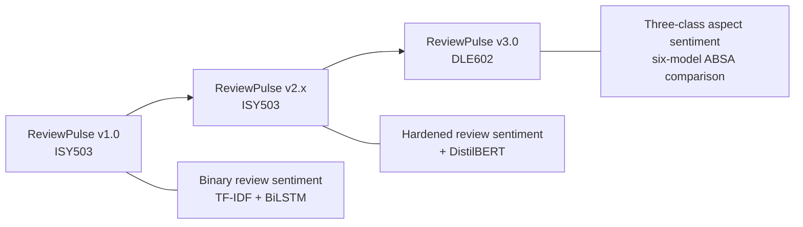
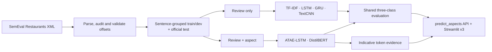
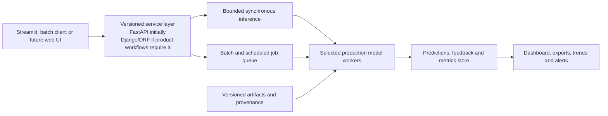

<!--
DLE602 Assessment 3 - Deep Learning Final Project Report - v4 Markdown source
Brief requirement: 1,500 words (+/-10%), i.e. 1,350-1,650 words, Report and Source Code.
The declared count covers prose and list items in Sections 1-6 only. It excludes headings, cover details,
the Table of Contents, Markdown table contents and captions, references and appendices.
Reproducible count: select from "## 1. Project Evolution" through the line before "## 7. References";
remove headings, fenced Mermaid blocks, Markdown table rows, image rows, captions, separators and the word-count declaration;
strip Markdown emphasis markers; then apply whitespace-token counting (`wc -w`).
Canonical four-model source: review-pulse commit bf36c3b3.
Supplemental six-model sources: artifact commit cef08fa and evaluation commit 941148c, merged in 0f02be3.
Release packaging and Git LFS deployment source: merged PR #101, commit 0ef3a26.
Reviewed ReviewPulse baseline for this report: commit 49395f5 (merged PR #117).
No result below is invented or illustrative.
-->

# ReviewPulse v3.0: Aspect-Based Sentiment Analysis - Implementation Report

**Subject:** DLE602 Deep Learning - Assessment 3: Deep Learning Final Project<br>
**Group members:** Luis Guilherme de Barros Andrade Faria (A00187785); Victor Javier Dorantes Meneses (A00179705); Juan Sebastian Martinez Contreras (A00167145)<br>
**Project:** ReviewPulse v3.0<br>
**Repository:** [lfariabr/review-pulse](https://github.com/lfariabr/review-pulse)<br>
**Learning facilitator:** Dr Tayab Din Memon<br>
**Date:** August 2026

---

## Table of Contents

1. Project Evolution, Problem, Aim and Research Questions
2. Requirements and Scope
3. Data and Implementation Method
4. Deep Learning Principles Applied
5. Results and Critical Analysis
6. Limitations and Conclusion
7. References
8. Appendix A - Supplemental Six-Model Track
9. Appendix B - Project Delivery Record
10. Appendix C - Reproduction Commands
11. Appendix D - Future Expansion Roadmap
12. Appendix E - Application Acceptance Evidence
13. Appendix F - Independent Reproduction Record
14. Appendix G - Implementation Walkthrough and Configuration Evidence
15. Appendix H - Code Execution: Lightweight and Complete Packages
16. Academic Integrity Declaration
17. Statement of Acknowledgement

---

## 1. Project Evolution, Problem, Aim and Research Questions

ReviewPulse began in ISY503 as a review-level binary sentiment classifier: v1.0 established the classical pipeline and v2.x hardened the application and added a Transformer option. Those releases assign one label to a whole review and therefore average away mixed opinions. DLE602 v3.0 implements aspect-based sentiment analysis (ABSA), so *"the food was great but the service was slow"* can produce separate labels for `food` and `service`. This report evaluates the completed implementation against the research questions established in Assessment 2, using
  only newly generated DLE602 results; no checkpoint or metric from the earlier ISY503 project is reused.



*Figure 1. ReviewPulse evolved from one binary label per Amazon review to one three-class prediction per supplied restaurant aspect.*

**Aim.** Implement and critically evaluate a low-compute ABSA system on SemEval-2014 Restaurants, testing whether explicit aspect conditioning improves sentiment classification, comparing ATAE-LSTM with DistilBERT, and presenting indicative token-level evidence.

**Research questions.** RQ1: does aspect conditioning improve classification on multi-aspect sentences over target-agnostic baselines? RQ2: how do ATAE-LSTM and DistilBERT compare on accuracy, macro-F1 and efficiency? RQ3: what human-readable evidence do attention or attribution outputs provide?

## 2. Requirements and Scope

The submitted four-model ladder comprises TF-IDF, a target-agnostic LSTM, ATAE-LSTM and DistilBERT. All models use the official Restaurants test split, the fixed label order `negative`, `neutral`, `positive`, and one evaluation contract covering accuracy, macro-F1, per-class metrics, confusion matrices, a mixed-polarity multi-aspect subset, training time, inference latency and artifact size. A separate `predict_aspects(review, aspects, model_name)` API and Streamlit v3 page expose ABSA without widening the legacy `predict_sentiment()` contract.

Reproducibility requirements include fixed seeds, sentence-grouped leakage-safe development splits, development macro-F1 checkpoint selection, early stopping and restoration of the best neural checkpoint. The implementation persists configuration, training history and provenance with each artifact. Invalid input, unavailable checkpoints and unsupported evidence views produce explicit errors or states, never a silent fallback.

Automatic aspect extraction, Topic Modelling and Laptops transfer remain outside the implemented core. A target-agnostic GRU and review-only TextCNN were completed only after the four-model gates passed. They are reported as exploratory controls in Appendix A and do not retroactively redefine the Assessment 2 experiment.

Table 1 is the traceability contract for this report. It carries each literature gap and each scope commitment from Assessment 2 through to the research question or requirement it produced, the measure agreed before implementation began, and the delivered outcome. The scope and the primary evaluation measures were committed in Assessment 2; additional diagnostics, such as the paired disagreement analysis supporting RQ1, are identified here as post-implementation analyses, not pre-agreed thresholds.

| A2 gap / commitment | RQ or requirement | Pre-committed measure | A3 outcome |
|---|---|---|---|
| Sentence-level models emit one label per text, as in ReviewPulse v1/v2; Pontiki et al. (2014) reframe the question as *which* aspect is positive, and Tang et al. (2016) motivate target conditioning | RQ1 | Mixed-polarity accuracy and macro-F1 on the 228-instance subset | Met; paired disagreement analysis added afterwards as a supporting diagnostic |
| Wang et al. (2016) offer a light aspect-conditioned model learned from a small benchmark; Sanh et al. (2019) and Sun et al. (2019) offer pretrained contextual transfer at higher cost | RQ2 | Accuracy, macro-F1, training time, inference latency and artifact size under one contract | Met; timing is observational across CPU and MPS, not a controlled comparison |
| Attention can vary without changing a prediction and need not identify causal features (Jain & Wallace, 2019) | RQ3 | Offset-aligned indicative evidence where the architecture supports it, and an explicit unsupported state otherwise | Met; the observations raised by independent QA are carried as known documented findings, not release blockers (Appendix E) |
| Accepted minimum product: audited baselines, ATAE-LSTM, shared evaluation and a working interface | Scope floor | All named components load and return three-class predictions per aspect under one evaluation contract | Met |
| DistilBERT retained only if compute and validation checks pass | Optional scope | Trained and evaluated under the same contract as the core ladder | Met |
| Reproducibility: fixed seed, sentence-grouped splits, versioned artifacts, single evaluation script | Requirement | Recorded splits, seeds and provenance; constrained clean installation; automated test suite | Met on the pre-release baseline |
| Cut-first list under compute pressure: Laptops transfer, automatic aspect extraction, Topic Modelling, GRU and TextCNN | Scope discipline | Optional work begins only after the core gates pass | Laptops, automatic extraction and Topic Modelling cut as planned; GRU and TextCNN delivered as exploratory extras afterwards |
| Release: public access, reproducible archive, version tag | Delivery | Packaged v3.0.0 release with recorded digests | Met; the deployed application, the reproducible archives and the tagged release are delivered |

*Table 1. Assessment 2 gaps and scope commitments traced to their pre-committed measures and delivered outcomes.*

## 3. Data and Implementation Method

The dataset is SemEval-2014 Task 4 Restaurants (Pontiki et al., 2014). The reproducible audit in Table 2 found 105 original `conflict` annotations: 91 in training and 14 in the official test data. All were counted before exclusion from the three-class task.

| Split | Original aspect instances | Positive | Negative | Neutral | Excluded `conflict` | Retained three-class instances |
|---|---:|---:|---:|---:|---:|---:|
| Train | 3,693 | 2,164 | 805 | 633 | 91 | 3,602 |
| Official test | 1,134 | 728 | 196 | 196 | 14 | 1,120 |
| **Total** | **4,827** | **2,892** | **1,001** | **829** | **105** | **4,722** |

*Table 2. SemEval Restaurants audit before three-class filtering; all annotated offsets were valid.*

The official test set therefore contains 1,120 retained aspect instances. Of these, 228 instances across 80 sentences form the **mixed-polarity multi-aspect subset**: sentences with at least two retained gold aspects carrying different polarities. This analytical subset is distinct from the removed SemEval `conflict` label.

Development data is derived from the official training partition using seed 42 and grouped by `sentence_id` before sentences are expanded into aspect instances. Consequently, aspects from one sentence cannot leak across training and development. The deterministic grouped split contains 2,875 training and 727 development instances. It is not formally class-stratified; instead, label distributions are recorded and audited after grouping. Raw review text and annotated character offsets remain the alignment source; model-specific tokenisation occurs only after offset validation.

TF-IDF with Logistic Regression is the classical review-only baseline. A three-class bidirectional LSTM adds learned embeddings and recurrence while still receiving only the review, following the target-independent control motivated by target-dependent LSTM research (Tang et al., 2016). ATAE-LSTM adds an aspect embedding and aspect-conditioned attention (Wang et al., 2016). DistilBERT, a distilled pretrained Transformer (Sanh et al., 2019), is fine-tuned as a `(review, aspect)` sentence-pair classifier following the auxiliary-sentence ABSA formulation of Sun, Huang and Qiu (2019).

The neural trainers use Adam or AdamW, configured regularisation, development macro-F1 selection, patience-based early stopping and best-checkpoint restoration. Canonical ATAE-LSTM training used CPU, while DistilBERT used Apple MPS. Because the hardware differs, training and latency observations describe the executed environment; they are not a controlled hardware benchmark.

ATAE-LSTM exposes its learned attention distribution. DistilBERT evidence uses gradient × input attribution for the predicted class, aggregates wordpieces onto exact visible spans, and excludes special and aspect-sequence tokens. Both methods return aligned tokens, offsets and normalised within-view scores. Review-only models explicitly report token evidence as unsupported.



*Figure 2. ReviewPulse v3 data, model-input and delivery flow. GRU and TextCNN are exploratory review-only controls.*

The Streamlit workflow accepts one review and comma-separated manual aspects. It validates and de-duplicates the list, preserves input order and scores each aspect independently. A sample generator supports repeatable demonstrations. Missing artifacts, empty reviews, empty aspect lists and unknown models surface controlled messages, allowing the same interface to demonstrate both successful inference and predictable failure handling.

The implementation uses `defusedxml` for safe SemEval XML parsing, `scikit-learn` for the TF-IDF and logistic-regression baseline, `PyTorch` for the LSTM, GRU, TextCNN and ATAE-LSTM models, `transformers` for DistilBERT, `pandas` and `NumPy` for the evidence and evaluation tables, `matplotlib` for the confusion matrices, and `streamlit` for the application; every version is pinned in `constraints-a3.txt` and listed in Appendix G.

Implementation is separated into data, model, training, inference, evaluation and presentation modules under `src/absa`, with model adapters enforcing one prediction payload. Automated tests cover parsing and split leakage, trainer controls, artifact provenance, all six inference paths, exact evidence offsets, safe heatmap rendering, packaging and legacy compatibility. At the merged release-package baseline, the complete local suite records 363 passing tests and three expected skips. Appendix C identifies the commands that regenerate the documented evidence.

## 4. Deep Learning Principles Applied

The model ladder isolates a principle at each stage. TF-IDF uses sparse engineered features and acts as a classical control. The LSTM introduces distributed representations and bidirectional recurrence, which model sequential context but still create the same review representation for every aspect. This deliberately exposes why representation learning alone cannot resolve contradictory labels attached to identical review input.

ATAE-LSTM conditions the recurrent representation on an aspect embedding and learns a weighted combination of hidden states. It can therefore read the same sentence differently for `food` and `service`. DistilBERT transfers contextual knowledge from BERT-style pretraining (Devlin et al., 2019) and allows review and aspect tokens to interact throughout the Transformer encoder. Its substantially larger parameter count tests whether pretrained contextual transfer justifies additional compute and storage.

Dropout and weight decay limit overfitting; early stopping and best-checkpoint restoration prevent reporting a convenient final epoch instead of the best observed development checkpoint. Appendix G records the frozen configuration of every model, the training curve that fixed the selected checkpoint, and the only recorded hyperparameter search in this project, in which widening the TextCNN filters alone reduced development macro-F1 and an improvement appeared only once the filter count was raised. The remaining models used predefined configurations with development macro-F1 checkpoint selection and were not searched. The fixed test split, label order and metric implementation support comparison of predictive behaviour. They do not, however, make cross-device timing controlled, nor does one fixed seed establish variance across retraining.

Attention and gradient attribution are treated as diagnostic views and never as model reasoning. Attention can vary without changing a prediction and need not identify causal features (Jain & Wallace, 2019). Accordingly, ReviewPulse labels darker tokens as higher-scored evidence within one aspect view and makes no claim that the view faithfully explains the decision.

## 5. Results and Critical Analysis

**Table 3** reports the canonical four-model experiment on the shared official test set.

| Model | Test accuracy | Test macro-F1 | Mixed accuracy | Mixed macro-F1 | Training | Warm ms/example | Artifact |
|---|---:|---:|---:|---:|---:|---:|---:|
| TF-IDF review-only | 0.7018 | 0.4605 | 0.4430 | 0.3319 | 0.14 s | 0.009 | 0.77 MB |
| LSTM review-only | 0.6687 | 0.4326 | 0.4167 | 0.3264 | 9.32 s | 0.103 | 2.25 MB |
| ATAE-LSTM | 0.6438 | 0.4799 | **0.4737** | **0.4491** | 14.17 s | 0.128 | 2.64 MB |
| DistilBERT sentence-pair | **0.8259** | **0.7231** | **0.6623** | **0.6427** | 133.65 s | 3.506 | 256.11 MB |

*Table 3. Canonical four-model comparison: 1,120 test instances and 228 mixed-polarity instances, commit `bf36c3b3`. Timing is observational across CPU and MPS.*


*Figure 3. Full-test confusion matrices generated by the canonical #84 evaluation runner at commit `bf36c3b3`; rows are gold labels and columns are predictions.*

**RQ1.** Both aspect-conditioned models outperform both review-only neural and classical controls on mixed-polarity accuracy and macro-F1. Against the review-only LSTM, DistilBERT gains 24.6 percentage points of mixed accuracy and 31.6 points of mixed macro-F1. ATAE-LSTM gains 5.7 and 12.3 points respectively. Four-model error analysis found 61 mixed cases where both aspect-conditioned models were correct and both review-only models were wrong, against four in the reverse direction. The result supports the benefit of explicit aspect input specifically where identical review text carries opposing labels.

**RQ2.** DistilBERT leads every predictive metric, but its 256.11 MB artifact is almost 100 times ATAE-LSTM's 2.64 MB artifact. ATAE-LSTM is weaker on full-test accuracy than TF-IDF and the LSTM, yet stronger on mixed macro-F1 and neutral-class discrimination. This is an important negative result: lightweight attention improves the target-sensitive behaviour central to RQ1 without guaranteeing higher aggregate accuracy. DistilBERT took longer and had higher latency in the recorded runs, but numerical timing ratios are not interpreted as architectural speedups because it ran on MPS while ATAE-LSTM ran on CPU.

The class-level results in Table 4 expose the positive-class dominance hidden by accuracy. DistilBERT leads all three classes, while every smaller model performs substantially worse on neutral examples. ATAE-LSTM nevertheless provides the strongest neutral F1 among the lightweight neural models.

| Model | Negative F1 | Neutral F1 | Positive F1 |
|---|---:|---:|---:|
| TF-IDF review-only | 0.3827 | 0.1794 | 0.8195 |
| LSTM review-only | 0.3605 | 0.1322 | 0.8053 |
| ATAE-LSTM | 0.3759 | **0.2888** | 0.7749 |
| DistilBERT sentence-pair | **0.7772** | **0.4931** | **0.8991** |

*Table 4. Full-test per-class F1 from the canonical four-model evaluation; bold identifies the overall best and the strongest lightweight neutral result.*

**Table 5** presents the verified report example used to answer RQ3.

| Model / aspect | Prediction | Confidence | Highest-scored visible tokens |
|---|---|---:|---|
| ATAE-LSTM / food | positive | 86.4% | `Great` 0.241; `food` 0.131; `was` 0.127 |
| ATAE-LSTM / service | positive | 74.2% | `Great` 0.193; `!` 0.132; `dreadful` 0.130 |
| DistilBERT / food | negative | 82.7% | `dreadful` 0.288; `the` 0.163; `service` 0.151 |
| DistilBERT / service | negative | 91.3% | `dreadful` 0.488; `food` 0.095; `service` 0.095 |

*Table 5. Indicative evidence for “Great food but the service was dreadful!” from the verified #85 export. Gold labels are food-positive and service-negative.*

**RQ3.** The evidence changes with the supplied aspect, but neither model resolves both gold labels in this example. ATAE-LSTM predicts both aspects positive; DistilBERT predicts both negative. Some high-scored tokens are sentiment-bearing, while others are function words or belong to the opposite aspect. The visualisation is therefore useful for inspecting model sensitivity and diagnosing errors, not for claiming a faithful or causal explanation.

Across the canonical test set, the four models disagree on 428 instances and all miss 134. These counts demonstrate complementary predictions and shared failures, but the present experiment does not categorise those failures by linguistic phenomenon. Appendix A shows that adding GRU and TextCNN does not overturn the conclusion: neither review-only extension closes the mixed-polarity gap.

## 6. Limitations and Conclusion

The 228-instance mixed subset is comparatively small, and results come from a single frozen seed; no multi-seed distribution was collected. Apple MPS can remain nondeterministic despite seed control, so provenance identifies exact commits and a shared prediction hash; bit-identical retraining is not promised. Gold aspect terms are supplied manually in the application; automatic extraction and cross-domain Laptops evaluation are unimplemented. Evidence scores are model-specific and normalised within each view, so they should not be compared as absolute importance across models or examples.

ReviewPulse v3.0 nevertheless answers the submitted questions with measured implementation evidence. Explicit aspect conditioning materially improves classification on the mixed-polarity subset. DistilBERT provides the strongest predictions at substantially greater storage cost, while ATAE-LSTM offers a small aspect-aware alternative with stronger mixed-polarity behaviour than the review-only controls. Its attention and DistilBERT attribution provide indicative token-level evidence, not exposed reasoning. The completed GRU and TextCNN extensions reinforce this result without changing it. Next research steps are multi-seed uncertainty estimates, controlled same-device efficiency measurement, cross-domain evaluation and automatic aspect extraction. The reproducible v3.0.0 submission package is delivered, in the two forms described in Appendix H.

**Word count (Sections 1-6 prose and list items): 1,550 words.**

## 7. References

Devlin, J., Chang, M.-W., Lee, K., & Toutanova, K. (2019). BERT: Pre-training of deep bidirectional transformers for language understanding. *Proceedings of NAACL-HLT 2019*, 4171-4186. https://aclanthology.org/N19-1423/

Jain, S., & Wallace, B. C. (2019). Attention is not explanation. *Proceedings of NAACL-HLT 2019*, 3543-3556. https://aclanthology.org/N19-1357/

Pontiki, M., Galanis, D., Pavlopoulos, J., Papageorgiou, H., Androutsopoulos, I., & Manandhar, S. (2014). SemEval-2014 Task 4: Aspect based sentiment analysis. *Proceedings of SemEval 2014*, 27-35. https://aclanthology.org/S14-2004/

Sanh, V., Debut, L., Chaumond, J., & Wolf, T. (2019). DistilBERT, a distilled version of BERT: Smaller, faster, cheaper and lighter. *Proceedings of the 5th Workshop on Energy Efficient Machine Learning and Cognitive Computing*. https://arxiv.org/abs/1910.01108

Sun, C., Huang, L., & Qiu, X. (2019). Utilizing BERT for aspect-based sentiment analysis via constructing auxiliary sentence. *Proceedings of NAACL-HLT 2019*, 380-385. https://aclanthology.org/N19-1035/

Tang, D., Qin, B., Feng, X., & Liu, T. (2016). Effective LSTMs for target-dependent sentiment classification. *Proceedings of COLING 2016*, 3298-3307. https://aclanthology.org/C16-1311/

Wang, Y., Huang, M., Zhu, X., & Zhao, L. (2016). Attention-based LSTM for aspect-level sentiment classification. *Proceedings of EMNLP 2016*, 606-615. https://aclanthology.org/D16-1058/

## 8. Appendix A - Supplemental Six-Model Track

The supplemental evaluation preserves the four-model experiment and adds target-agnostic GRU and TextCNN records generated under the shared six-model contract. It uses artifact source commit `cef08fa`, evaluation source commit `941148c`, seed 42, prediction SHA-256 `9d439207a8fdcafed5328d513ee4921bfc8b0dc4ecefcb3e7a9622f66f40e196` and the same 1,120 test instances.

| Model | Scope | Test accuracy | Test macro-F1 | Mixed accuracy | Mixed macro-F1 | Training | Artifact |
|---|---|---:|---:|---:|---:|---:|---:|
| TF-IDF | A2 core | 0.7018 | 0.4605 | 0.4430 | 0.3319 | 0.14 s | 0.77 MB |
| LSTM | A2 core | 0.6687 | 0.4326 | 0.4167 | 0.3264 | 8.07 s | 2.25 MB |
| GRU | Exploratory | 0.6750 | 0.4603 | 0.4079 | 0.3156 | 7.02 s | 2.02 MB |
| TextCNN | Exploratory | 0.6893 | 0.4498 | 0.4167 | 0.3106 | 25.13 s | 1.81 MB |
| ATAE-LSTM | A2 core | 0.6438 | 0.4799 | 0.4737 | 0.4491 | 10.84 s | 2.64 MB |
| DistilBERT | A2 core | **0.8250** | **0.7199** | **0.6667** | **0.6473** | 122.08 s | 256.11 MB |

*Table A1. Frozen supplemental six-model comparison. The five smaller models ran on CPU and DistilBERT on MPS; timing is observational.*

GRU uses 10.31% fewer parameters than LSTM and obtains slightly higher full-test macro-F1, but lower mixed macro-F1. TextCNN records zero neutral F1 on the mixed subset. These negative results show that changing the review-only encoder does not supply the missing aspect information. In the shared six-model predictions, 55 mixed cases are correct for both aspect-conditioned models and wrong for all selected review-only models, versus three in the reverse direction; 454 instances contain disagreement and all six models miss 131.

## 9. Appendix B - Project Delivery Record

### Implemented risk outcomes

| Risk | Mitigation applied | Observed outcome / contingency |
|---|---|---|
| Neural overfitting | Development early stopping and best-checkpoint restoration | Selected epoch, history and diagnostic persisted per model |
| Transformer compute/storage | Apple MPS training and explicit artifact measurement | Strongest model, but 256.11 MB; lightweight ATAE remains available |
| Sentence leakage | Group development split by `sentence_id` | Automated disjointness checks pass |
| Artifact loading failure | Explicit paths, validation and controlled UI errors | Missing models fail visibly, with no silent substitution |
| Optional-scope delay | Four-model result frozen before GRU/CNN activation | Six-model track completed without replacing the canonical experiment |
| Unequal contribution | Issue ownership, pull-request review and contribution record | Juan delivered independent Streamlit QA in PR #120, hardened in PR #121; Victor delivered independent RQ1/RQ2 validation, a CUDA reproduction and clean frozen-package verification recorded in Appendix F |

*Table B1. Implemented project-risk mitigations, observed outcomes and retained contingencies.*

### Contribution log

| Contributor | Status | Contribution / assigned validation | Evidence / hand-off |
|---|---|---|---|
| Luis Faria | Completed | Architecture, ABSA implementation, all training/evaluation integration, token evidence, six-model integration, Streamlit integration, Git LFS deployment, release packaging and report consolidation | ReviewPulse PRs #90, #92, #93, #97, #98-#102; academic commits `f3b7247`, `6d50ac0` |
| Victor Dorantes | Independent validation and release reproduction delivered | Recomputed stored metrics from the six confusion matrices, independently trained and evaluated the four canonical models on CUDA, validated RQ1/RQ2, verified SemEval provenance and audited the cited publications; then completed clean installation, Git LFS, full-suite, offline-smoke, dataset and shipped-artifact checks | ReviewPulse PR #123, merge commit `8787a73`; `docs/dle602-a3/validation-victor.md`; complete evidence summarised in Appendix F |
| Juan Martinez | Independent QA delivered and reviewed | Executed 12 deployed-Streamlit cases across all six models, multi-aspect inputs, sample generation, evidence views, invalid inputs, model switching and v2/v3 compatibility; recorded predictions, screenshots, three acceptance failures and two stale-state observations that could not be reproduced from the written record; all five are carried as known documented findings, not release blockers | ReviewPulse PR #120, merge commit `1e6689f`; corrective PR #121, merge commit `9071553`; `docs/dle602-a3/validation-juan.md`; companion screenshot record; selected evidence mapped in Appendix E |

*Table B2. Contribution status, assigned validation work and required traceable evidence.*

Assignments are not treated as completed contributions. Juan's executed QA is recorded as evidenced work even where it exposes failures and does not confirm acceptance. Victor's reviewed validation is likewise recorded even though the fresh CUDA DistilBERT result diverges from the frozen result; that divergence strengthens the reproducibility record and does not replace the canonical metrics. His subsequent clean verification of the shipped package closes the operational checks in Appendix F.

## 10. Appendix C - Reproduction Commands

The restricted SemEval XML files must be acquired separately and placed as documented in the repository. From the verified environment:

```bash
python -m venv .venv
.venv/bin/pip install -r requirements.txt -c constraints-a3.txt
git lfs pull
.venv/bin/python -m pytest -q
.venv/bin/python -m src.absa.data.audit
.venv/bin/python -m src.absa.evaluation.runner --device auto
.venv/bin/python scripts/export_absa_evidence.py
.venv/bin/streamlit run app.py
```

The frozen supplemental evaluation is regenerated by adding
`--models tfidf target_lstm target_gru text_cnn atae_lstm distilbert` to the evaluation command after the six verified artifacts are available.

## 11. Appendix D - Future Expansion Roadmap

ReviewPulse v3.0 is intentionally an academic comparison environment and was never built as a production platform. Its six-model ladder, manual gold-aspect input and Streamlit interface make the research questions inspectable, but the same design should not be scaled by simply running every model for every incoming review. Future releases would separate experimental benchmarking from the smaller set of models selected for operational inference.

| Release scenario | Primary objective | Candidate capabilities | Architectural direction |
|---|---|---|---|
| v3.1 - Reproducible service | Harden the existing ABSA workflow without changing its research scope | Three-class probability distributions, confidence calibration, abstention thresholds, CSV/JSON export, batch requests, latency/load tests and model-version metadata | Retain Streamlit as the demonstration client and introduce a versioned inference API |
| v4.0 - Aspect intelligence | Remove the requirement for users to know and enter every aspect | Automatic aspect extraction, user correction, synonym/category normalisation, batch review analysis and emerging-topic discovery | Add an extraction pipeline, persistent result store and analyst dashboard |
| v5.0 - Operational monitoring | Analyse feedback continuously instead of in isolated submissions | Review-platform connectors, scheduled ingestion, trend analysis, alerts, feedback capture, drift monitoring and domain-specific retraining | Add asynchronous jobs, inference workers, PostgreSQL/object storage and observability |
| Later SaaS/enterprise track | Support multiple organisations and governed use | Tenant isolation, authentication, role-based access, audit logs, retention controls, personal-data handling and usage limits | Separate web, API, worker and storage tiers; scale workers independently |

*Table D1. Prospective ReviewPulse release scenarios; listed capabilities are planned, and none is part of the evaluated v3.0 implementation.*

For v3.1, **FastAPI** is the preferred default because the immediate requirement is a small typed HTTP layer around the existing `predict_aspects` and comparison services. Streamlit could remain the visible client while the API provides explicit request schemas, model-version responses and machine-readable errors for batch or third-party consumers. Model execution is compute-bound, so an asynchronous web endpoint alone would not create inference capacity; batch work should instead move through a bounded queue and independently scalable workers.

**Django with Django REST Framework** becomes the stronger alternative if v3.1 is deliberately widened to include user accounts, administrative workflows, permissions, persistent business records or early multi-tenancy. Adopting Django only for model endpoints would add product infrastructure before it is required. The decision is therefore based on release scope: FastAPI for an inference-first service, or Django/DRF when application management becomes a first-class requirement.



*Figure D1. Prospective service evolution; these components are not claimed as part of the evaluated v3.0 implementation.*

The model strategy would also change with scale. TF-IDF, LSTM, GRU and TextCNN remain useful controls for research and regression detection, while operational traffic would normally use one validated aspect-conditioned model, with a second model retained only when its cost, latency or diagnostic value justifies deployment. Cross-domain use in e-commerce, hospitality, software support or other sectors would require new representative data and domain-specific evaluation; Restaurants performance cannot be assumed to transfer unchanged.

## 12. Appendix E - Application Acceptance Evidence

Juan acted as the project's independent QA validator. Working from the deployed application and never from the codebase, he ran 12 authenticated Streamlit cases covering all six models, multi-aspect input, sample generation, model switching, attention and attribution views, invalid input and v2/v3 compatibility, capturing the interface state and screenshot for every case.

Seven cases passed. Five did not, and those proved the most valuable: three acceptance failures and two observations that could not be reproduced from the written record. A wrong prediction was logged as model quality, not an interface defect, and an unreproducible observation was never promoted to a confirmed bug. Independent QA that surfaces a release risk is stronger evidence than a demonstration curated to look green.

Four captures appear below. The complete 12-case record, with every screenshot, is linked at the end of this appendix and kept as `docs/dle602-a3/validation-juan.md` in the repository.

*Figure E1 (EV-01, EV-02). Model selector in the deployed v3 page, with all six ABSA models available and returning predictions.*

*Figure E2 (EV-03). Separate `food` and `service` result cards for the mixed-polarity review. Each model returned one result per aspect, and each missed one gold polarity.*

*Figure E3 (EV-07, EV-08). ATAE-LSTM attention beside DistilBERT attribution, inspected for aspect-specific change and visible-token alignment. Both are indicative evidence, not causal explanations.*

*Figure E4 (EV-10, EV-11). Invalid-input validation state, preserving the exact user-facing message and the stale-result behaviour raised for triage.*

**Complete screenshot record:** [Juan Martinez's full 12-case Streamlit QA evidence](https://laustu-my.sharepoint.com/:w:/g/personal/juan_contreras_student_torrens_edu_au/IQCZCy0A4REuQazXkp8Tsd2cAa_PIJSnHeZKKz41hQLov3g?isSPOFile=1&ovuser=66e44254-c0ce-4745-9255-907eee03faf6%2CLuis.faria%40Student.Torrens.edu.au&wdExp=TEAMS-TREATMENT&web=1&clickparams=eyJBcHBOYW1lIjoiVGVhbXMtRGVza3RvcCIsIkFwcFZlcnNpb24iOiI1MC8yNjA3MTYxNjAxMSJ9). Access requires the shared Torrens/SharePoint permissions.

## 13. Appendix F - Independent Reproduction Record

Victor acts as a second person reproducing the reported results from the repository alone, on a machine that is not the development machine. Its purpose is to establish that the numbers in Section 5 are properties of the artifacts and instructions themselves, reproducible away from one local environment.

The first independent record is kept as `docs/dle602-a3/validation-victor.md` and was merged through ReviewPulse PR #123. On Linux with NVIDIA CUDA, Victor recomputed the stored full-test metrics from all six confusion matrices, reproduced the TF-IDF, LSTM and ATAE-LSTM values in a fresh four-model run, and confirmed the RQ1/RQ2 conclusions. His fresh DistilBERT obtained 0.8366 accuracy and 0.7490 macro-F1, above the frozen 0.8259 and 0.7231; the run is retained as separately versioned evidence because one seed does not guarantee identical Transformer retraining across devices. He then completed a clean validation of the shipped artifacts without retraining; Table F1 records those checks separately from the CUDA experiment.

| Check | Expected | Observed | Result |
|---|---|---|---|
| F1. Constrained installation | `pip install -r requirements.txt -c constraints-a3.txt` succeeds with no undocumented manual step | A fresh checkout installed successfully against `constraints-a3.txt`; no undocumented manual installation step was required | Pass |
| F2. Artifact retrieval | `git lfs pull` materialises all six artifacts; `git lfs ls-files -s` shows no unresolved pointer | `git lfs pull` completed and `git lfs ls-files -s` marked all six artifacts with `*`, including the 268 MB DistilBERT weights | Pass |
| F3. Test suite | Clean clone reports 357 passed and 9 skipped; the skips are the documented licensed-data absences | The complete suite reported 366 passed and 48 warnings in 64.99 seconds, with zero skips because this checkout contained the licensed corpus and prediction evidence | Pass |
| F4. Offline smoke | `scripts/smoke_absa.py` returns one prediction per aspect with no SemEval data present | With the SemEval XML unavailable, the forced-offline smoke loaded the four canonical artifacts and returned one prediction per supplied aspect without attempting corpus or network access | Pass |
| F5. Dataset audit | Official retained test count 1,120; mixed-polarity subset 228 instances across 80 sentences | The audit verified 3,693 train and 1,134 raw test annotations, 91/14 excluded `conflict` labels and zero invalid offsets; the retained test contains 1,120 instances, of which 228 across 80 sentences form the mixed-polarity subset | Pass |
| F6. Headline results | Table 3 accuracy and macro-F1 reproduce from the shipped artifacts | Direct evaluation of the materialised artifacts reproduced TF-IDF, LSTM and ATAE-LSTM exactly; the shipped DistilBERT matched the separately frozen supplemental record, while the older Table 3 artifact and fresh CUDA retraining remain distinct versioned results | Pass with provenance note |
| F7. Reference verification | Each cited work is checked against the original publication and supports the claim made | Seven cited works were audited and all six ACL Anthology records matched; Victor correctly raised that the arXiv page alone did not establish the DistilBERT venue, which the official EMC² programme and hosted workshop paper independently confirmed | Pass |

*Table F1. Independent reproduction checks, expected values and outcomes.*

The DistilBERT venue query demonstrates the purpose of independent review. The source Victor initially checked supported the authors, title and year but not the workshop claim, so he reported the uncertainty instead of assuming it away. The [official EMC² NeurIPS 2019 programme](https://www.emc2-ai.org/neurips-19) and [hosted workshop paper](https://www.emc2-ai.org/assets/docs/neurips-19/emc2-neurips19-paper-33.pdf) identify the work as part of the 5th Workshop on Energy Efficient Machine Learning and Cognitive Computing; the report citation therefore remains unchanged. Victor audited the earlier report baseline, but its seven-entry bibliography is unchanged in this version.

Where an observed value differs from the expected value, the difference is recorded as observed and explained, never adjusted. A reproduction that surfaces a genuine discrepancy is more valuable to this report than one that confirms every figure. F3 differs from the clean-room expectation because Victor's checkout contained the licensed corpus and frozen prediction evidence, so the provenance tests ran instead of skipping.

### F.1 Scope of the independent evidence

Victor's independent record covers the clean constrained installation, Git LFS materialisation, complete suite, forced-offline smoke test, dataset audit and shipped-artifact evaluation. Every status in Table F1 is based on observed command output from the recorded environment.

### F.2 Canonical shipped artifact results

Table F2 reports values obtained directly from the materialised shipped artifacts. They match the frozen supplemental artifact set. The older report row and the fresh retraining row remain separate versioned DistilBERT results.

| Model | Test accuracy | Test macro-F1 | Mixed accuracy | Mixed macro-F1 |
|---|---:|---:|---:|---:|
| TF-IDF | 0.7018 | 0.4605 | 0.4430 | 0.3319 |
| LSTM | 0.6687 | 0.4326 | 0.4167 | 0.3264 |
| ATAE-LSTM | 0.6438 | 0.4799 | 0.4737 | 0.4491 |
| DistilBERT shipped suplemental artifact | 0.8250 | 0.7199 | 0.6667 | 0.6473 |
| DistilBERT retrained (not shipped) | 0.8366 | 0.7490 | 0.7061 | 0.6956 |

*Table F2. Materialised shipped four-model artifact results on 1,120 retained official test instances and the 228-instance mixed-polarity subset drawn from 80 sentences.*

### F.3 Experimental branch

The `ABSA-Experimental` branch is a bounded research track and is not the source of the canonical Table 3 artifacts. Commits `52c18fd` and `4aa8c68` add compact-encoder experiments, their scripts and an optional Streamlit connection while keeping the entry points separate from `src.absa.training.runner` and `src.absa.evaluation.runner`. The branch compares domain-adapted BERT-Mini with a compressed BERT-Small candidate under a strict sub-100 MB artifact limit.

| Candidate | Precision | Artifact | Test accuracy | Test macro-F1 |
|---|---|---:|---:|---:|
| Tuned BERT-Mini | FP32 | 43.31 MB | 0.7598 | 0.6531 |
| BERT-Small | FP16 | 55.55 MB | 0.7938 | 0.6951 |

*Table F3. Experimental compact-encoder results. BERT-Small FP16 is stronger within the storage constraint, while both candidates remain below the fresh 256.11 MB DistilBERT result (0.8366 accuracy, 0.7490 macro-F1).*

The experiment supports an artifact-size and predictive-quality comparison only. FP16 verification was performed on CUDA and does not establish CPU or MPS portability or latency. An initial verifier also exposed the need to exclude SemEval `conflict` labels; the corrected path uses `split_official_data` and therefore matches the canonical negative/neutral/positive task. None of these experimental values replaces the shipped four-model record.

## 14. Appendix G - Implementation Walkthrough and Configuration Evidence

This appendix records what the system was fed, what it was built from, how it was configured and what it printed. Every value is read from the frozen artifacts; nothing here was retrained for the report.

### G.1 Parsed dataset

The parser reads the SemEval XML, validates every annotated character offset against the raw sentence and expands each sentence into one instance per aspect term. Table G1 shows three parsed records in the form the models receive them. All three are official test-split sentences already quoted as attributed demonstration samples in the application; the corpus itself is not redistributed.

| `sentence_id` | Review sentence | Aspect | Gold polarity | Offsets valid |
|---|---|---|---|---|
| `11351513#832512#0` | Great food but the service was dreadful! | `food` | positive | Yes |
| `11351513#832512#0` | Great food but the service was dreadful! | `service` | negative | Yes |
| `33060905#1138585#0` | i went in one day asking for a table for a group and was greeted by a very rude hostess. | `hostess` | negative | Yes |

*Table G1. Three parsed aspect instances as supplied to the models. One sentence yields one record per annotated aspect, which is the structural reason a review-level label cannot answer the task.*

The audit command reports the corpus itself. Listing G1 is its verbatim output, and it is the source of Table 2. Listings G1 to G3 are pasted terminal transcripts instead of screenshots: the text stays legible at any page size, carries no local file paths, and can be searched and re-run by a reader.

```text
$ python -m src.absa.data.audit
{
  "train": {
    "aspect_examples": 3693,
    "sentences_with_aspects": 2021,
    "polarity_counts": {"conflict": 91, "negative": 805, "neutral": 633, "positive": 2164},
    "offset_valid": 3693,
    "offset_invalid": 0,
    "invalid_offsets": []
  },
  "test": {
    "aspect_examples": 1134,
    "sentences_with_aspects": 606,
    "polarity_counts": {"conflict": 14, "negative": 196, "neutral": 196, "positive": 728},
    "offset_valid": 1134,
    "offset_invalid": 0,
    "invalid_offsets": []
  }
}
```

*Listing G1. Dataset audit command and output. Zero invalid offsets is the precondition for the offset-aligned token evidence reported in Section 5.*

### G.2 Libraries and frozen versions

| Library | Role in the system | Frozen version |
|---|---|---|
| Python | Runtime | 3.12.10 |
| `defusedxml` | Safe SemEval XML parsing | 0.7.1 |
| `scikit-learn` | TF-IDF vectoriser and logistic regression | 1.8.0 |
| `PyTorch` | LSTM, GRU, TextCNN and ATAE-LSTM | 2.13.0 |
| `transformers` | DistilBERT sentence-pair classifier | 5.14.1 |
| `pandas` / `NumPy` | Evaluation and evidence tables | 3.0.3 / 2.5.1 |
| `matplotlib` | Confusion-matrix figures | 3.11.0 |
| `streamlit` | Application interface | 1.59.2 |

*Table G2. Libraries and the versions pinned in `constraints-a3.txt`, which is the file a reader installs against.*

### G.3 Frozen model configurations

| Model | Batch | Learning rate | Weight decay | Max length | Best epoch | Other |
|---|---:|---:|---:|---:|---:|---|
| Target LSTM | 64 | 1e-3 | 1e-4 | 80 | 8 | Adam, patience 2 |
| Target GRU | 64 | 1e-3 | 1e-4 | 80 | 8 | Adam, embedding 100, hidden 128, dropout 0.5 |
| TextCNN | 64 | 1e-3 | 1e-4 | 80 | 6 | Adam, embedding 100, filters (3,4,5)x100, dropout 0.5 |
| ATAE-LSTM | 64 | 1e-3 | 1e-4 | 80 | 6 | Adam, aspect max length 12, patience 2 |
| DistilBERT | 8 | 2e-5 | 1e-2 | 128 | 2 | AdamW, `distilbert-base-uncased`, patience 2 |

*Table G3. Configuration persisted alongside each artifact, seed 42 throughout. TF-IDF is omitted because it is not a neural trainer: it uses logistic regression, lbfgs, `max_iter` 1000 and 1-2 grams.*

Table G4 shows why the best epoch is not simply the last one. ATAE-LSTM training loss falls monotonically to epoch 8 while development macro-F1 peaks at epoch 6 and then declines, so the restored checkpoint is epoch 6.

| Epoch | Training loss | Development macro-F1 |
|---:|---:|---:|
| 1 | 0.9637 | 0.3350 |
| 2 | 0.8695 | 0.3591 |
| 3 | 0.8150 | 0.4624 |
| 4 | 0.7607 | 0.5023 |
| 5 | 0.7173 | 0.4863 |
| 6 | 0.6578 | **0.5370** |
| 7 | 0.6063 | 0.5325 |
| 8 | 0.5560 | 0.5297 |

*Table G4. ATAE-LSTM training history. The 0.0073 macro-F1 decline after the best epoch is below the 0.02 threshold recorded in the overfitting diagnostic, so the run is treated as stable at this seed, not materially overfitted.*

### G.4 The one recorded hyperparameter search

Only TextCNN was searched. The search selected on development macro-F1 alone; the official test split took no part in it, which the record states explicitly as `official_test_evaluated: false`.

| Filter widths | Filters | Development macro-F1 | Parameters | Training time |
|---|---:|---:|---:|---:|
| (2, 3, 4) | 64 | 0.4309 | 393,371 | 7.7 s |
| (3, 4, 5) | 64 | 0.3776 | 412,571 | 8.9 s |
| (3, 4, 5) | 100 | **0.4722** | 456,203 | 12.1 s |

*Table G5. TextCNN configuration search, seed 42, four epochs per candidate.*

The result is more informative than the winner. Widening the filters from (2,3,4) to (3,4,5) at the same filter count made the model **worse**, from 0.4309 to 0.3776; macro-F1 only improved, to 0.4722, once the filter count rose to 100. The search therefore provides no evidence that widening alone helped, and the improvement appeared only after capacity increased. It cannot isolate a causal hyperparameter effect: three candidates at one seed leave the wider filters untested at the higher filter count, and no variance estimate is available. What the search does establish is that the selected configuration still records zero neutral F1 on the mixed-polarity subset in Appendix A. Searching a review-only encoder does not supply the aspect signal it never receives.

### G.5 Verified end-to-end run

Listing G2 is the verbatim output of the smoke check, which loads each canonical artifact and scores a two-aspect review. The smoke path reads the artifacts only and does not open the SemEval dataset, which is why it also passed in a clean-room clone where no corpus was present.

```text
$ python scripts/smoke_absa.py
absa_tfidf: food=positive, service=positive
absa_target_lstm: food=negative, service=negative
absa_atae_lstm: food=positive, service=positive
absa_distilbert: food=negative, service=negative
```

*Listing G2. Four-model prediction for "The food was great but the service was slow." Every model returns one label per aspect, which is the delivered contract; no model resolves both gold labels here, which is the honest limitation reported in Section 5.*

Listing G3 is the Python that produces the aspect-conditioned evidence, run against the frozen ATAE-LSTM artifact, together with its output. It is the code behind Table 5, and re-running it reproduces that table's ATAE-LSTM rows exactly.

```python
from src.absa.inference.api import predict_aspects
from src.absa.inference.predictors import get_predictor

review = "Great food but the service was dreadful!"
predictor = get_predictor("absa_atae_lstm")
results = predict_aspects(review, ["food", "service"], "absa_atae_lstm", predictor)

for item in results:
    top = sorted(item["token_evidence"]["tokens"], key=lambda t: -t["score"])[:3]
    tokens = ", ".join(f"{t['token']}[{t['start']}:{t['end']}]={t['score']:.3f}" for t in top)
    print(f"{item['aspect']:>7} -> {item['label']:<8} {item['confidence']:.3f} | {tokens}")
```

```text
   food -> positive 0.864 | Great[0:5]=0.241, food[6:10]=0.131, was[27:30]=0.127
service -> positive 0.742 | Great[0:5]=0.193, ![39:40]=0.132, dreadful[31:39]=0.130
```

*Listing G3. Aspect-conditioned inference and token evidence. Each token carries the character offsets that locate it in the original review, so the evidence view is aligned to the raw text itself, never to model-internal subword units. The attention distribution changes with the supplied aspect while the predicted label does not, which is precisely the RQ3 caveat drawn from Jain and Wallace (2019).*

## 15. Appendix H - Code Execution: Lightweight and Complete Packages

Two archives are submitted from the same commit, differing only in which trained artifacts they carry. Both are built by `scripts/build_a3_package.py`, which rejects unresolved Git LFS pointers and writes a SHA-256 manifest; repeated builds of one mode produce an identical digest. Appendix C lists the underlying commands.

| Package | Build mode | Size | v3 models | Needs SemEval corpus |
|---|---|---:|---:|---|
| Lightweight | `--artifact-mode lightweight` | approx. 52 MB | 5 of 6 | No |
| Complete | `--artifact-mode all` | approx. 288 MB | 6 of 6 | No |

*Table H1. The two submitted archives. The difference is the single v3 DistilBERT directory. Both are supplied: where the upload limit refuses the larger file, it is provided through a shared link recorded with the submission.*

The procedure is identical for both, and neither reads the dataset, because the trained artifacts are shipped:

```bash
unzip ReviewPulse-v3.0.0-DLE602-A3.zip && cd ReviewPulse-v3.0.0
python3 -m venv .venv && source .venv/bin/activate   # Windows: .venv\Scripts\activate
pip install -r requirements.txt -c constraints-a3.txt
python -m pytest -q
streamlit run app.py
```

The constraint file pins the versions in Table G2. Inference runs on CPU in both packages, so no accelerator is required.

Only the v3 DistilBERT directory is excluded from the lightweight archive, since at roughly 256 MB it accounts for the entire size difference. Selecting **DistilBERT sentence-pair** there reports the model unavailable and returns no prediction: a missing artifact is always reported and never silently substituted. The only network dependency in the submission sits elsewhere, in the preserved ISY503 workflow and not in any v3 result: the legacy `outputs/distilbert.pt` stores only the classification head and fine-tuned layers, so its base encoder is fetched from `distilbert-base-uncased` and reports itself unavailable offline without a cache. The five v3 artifacts are read straight from disk.

| Environment | Passed | Skipped | Additional skips |
|---|---:|---:|---|
| Development machine | 363 | 3 | Legacy Amazon `.review` corpus is not redistributed |
| GitHub clone, complete artifacts | 357 | 9 | 6 sample-provenance checks need the non-redistributed `predictions.csv` |
| Extracted lightweight archive | approx. 355 | approx. 11 | 2 package-builder checks need Git metadata, absent from a ZIP |

*Table H2. Expected test outcomes by environment. Every skip is an intentional absence of licensed data or Git metadata; none is a failure, and none is removed by redistributing data the project cannot license.*

On the complete package, `python scripts/smoke_absa.py` clean-loads all four canonical models, as shown in Listing G2. It is deliberately unusable on the lightweight package, which excludes the model it exercises; `scripts/smoke_target_gru.py` and `scripts/smoke_text_cnn.py` are the equivalent checks there.

## 16. Academic Integrity Declaration

We declare that, except where referenced, the work we are submitting for this assessment task is our own work. We have read and are aware of the Academic Integrity Policy and Procedure of Torrens University Australia. We are also aware that we need to keep a copy of all submitted material and any drafts, and we agree to do so.

## 17. Statement of Acknowledgement

We acknowledge that we used the following AI-assisted tools in the creation of this assessment:

- OpenAI Codex
- Anthropic Claude
- CodeRabbit

The tools assisted with scaffolding and reviewing the ABSA implementation, debugging training and evaluation code, checking data-leakage and reproducibility controls, reviewing pull requests, reconciling measured results with their artifacts, improving code documentation and academic clarity, and supporting APA 7th referencing conventions. The cited claims were verified against the original publications, and numerical claims were checked against the frozen ReviewPulse evaluation outputs.

Prompt examples:

1. "Review the shared four-model ABSA evaluation: verify that all models use the official Restaurants test split and that the mixed-polarity subset is computed from gold annotations without confusing it with the SemEval conflict label."
2. "Inspect the DistilBERT, ATAE-LSTM and target-LSTM training loops for device handling, repeated loss construction, seed control, early stopping and best-checkpoint restoration, then propose tests for any regression."
3. "Reconcile the A3 implementation report with the frozen four-model and six-model artifacts, correct unsupported efficiency claims, and keep attention and gradient attribution framed as indicative rather than causal evidence."

We confirm that these tools were used in accordance with the Torrens University Australia Academic Integrity Policy and the TUA, Think and MDS Position Paper on the Use of AI. The group retains responsibility for the final implementation, analysis, synthesis and content of this assessment.
