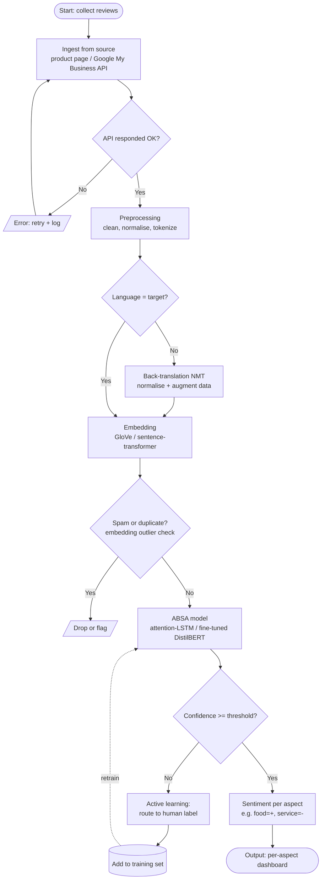

# DLE602 · Module 3 - Discussion Forum Drafts

> Draft responses for the three Module 3 "Interactive Knowledge Sharing" activities (NLP / Speech / Computer Vision).
> Each asks for: an application you care about, the DL algorithms/datasets/models behind it, and a flowchart showing input, output, decision points, processes, and possible errors.
> Keep tone: human, specific, builder-not-spectator. No corporate filler.

---

## Activity 1 - Interactive Knowledge Sharing: NLP ✅

> *Task: pick an NLP application with wider societal impact; propose the DL algorithms, datasets and models; then build a flowchart (input → process → output, with decision points and errors) and post it to the forum.*

### The application: ReviewPulse (aspect-based sentiment analysis)

**Problem.** Companies receive thousands of reviews (product pages, Google My Business) and either read them by hand or get only a star average. ReviewPulse plugs into any review source and returns **sentiment per aspect** - "food positive, service negative" - instead of one blended label.

**Data.** Raw reviews (text + star) via scraping/API; for training, aspect-labelled datasets such as **SemEval-2014 Task 4** plus the client's own reviews.

**Why deep learning fits.** A review is unstructured text where context and negation matter ("not bad" is positive). Embeddings + attention capture this; bag-of-words / n-grams cannot. This is the classical-to-deep step the subject is built around (Goodfellow et al., 2016, Ch.12; Zhao et al., 2018).

### DL algorithms to improve the training data

The interesting angle is data-centric: use deep learning to make the *dataset* better, not just the model.

| Technique (DL) | What it does for the data | Anchor |
|---|---|---|
| **Back-translation** (NMT encoder-decoder) | EN→FR→EN generates paraphrases → more variety, zero new labels | Goodfellow §12.4.5 (seq2seq) |
| **Contextual augmentation** (BERT masked-token) | swaps words for context-plausible substitutes | transformers |
| **Pseudo-labeling / weak supervision** (pretrained transformer) | pre-labels raw reviews → bootstraps the dataset | Zhao's pretrained embeddings; BERT zero-shot |
| **Active learning** (uncertainty sampling) | model picks the uncertain cases for a human to label → high-value labels, less effort | training loop |
| **Embedding-based cleaning** (GloVe / sentence-transformer) | dedup, spam/outlier detection, cluster-balanced sampling | M3 embeddings |
| **Synthetic generation with an LLM** (optional) | creates reviews for rare aspects to balance classes | GenAI |

### Flowchart (Mermaid)

> Renders on GitHub / [mermaid.live](https://mermaid.live) / VS Code. Export PNG or SVG and drop it into the Word doc for the forum post.

**Rubric elements, mapped:**
- **Input:** Start + ingestion (product / Google My Business)
- **Decision points:** API OK? · language target? · spam/duplicate? · confidence >= threshold?
- **Processes:** preprocess → embedding → ABSA model
- **Errors:** API failure (retry), spam dropped, low confidence → human
- **Data loop:** active learning feeds the dataset back (the "improve the training data" piece, visualised)
- **Output:** per-aspect sentiment dashboard

**Forum one-liner:** "Instead of just training a model, I use DL to *improve the dataset itself* - back-translation adds variety, active learning prioritises what to label, embeddings strip spam. Better data beats a fancier model."

*Citations: Goodfellow, Bengio & Courville (2016), Ch.12; Zhao, Gui & Zhang (2018).*

---

## Activity 2 - Interactive Knowledge Sharing: Speech Recognition 🕐

> *Task: same structure (app → DL algorithms/datasets/models → flowchart), for a speech-recognition application.*

**Candidate angle (to develop):** voice-driven accessibility or a noise-robust meeting transcriber. Natural anchor = **Noda et al. (2015)** - denoising autoencoder (audio) + CNN (lip-reading) + multi-stream HMM for noise robustness. Flowchart skeleton: noisy audio (+ optional video) in → denoise → feature extraction → acoustic model → decode to text → confidence-gated output.

---

## Activity 3 - Interactive Knowledge Sharing: Computer Vision 🕐

> *Task: same structure, for a computer-vision application.*

**Candidate angle (to develop):** product-image quality check or storefront/menu OCR feeding ReviewPulse. Anchor = Goodfellow §12.2 (CNNs, preprocessing, augmentation). Flowchart skeleton: image in → standardise/normalise (GCN/LCN) → augment (train only) → CNN → detection/label → confidence-gated output.

---

### Notes for posting
- All three are participation-graded; substance + citing the module readings is what scores.
- Activity 1 is post-ready - swap nothing unless you want to point it at a different domain (clinic, customer feedback).
- Activities 2 and 3 are stubs: pick an app you actually care about, then reuse the Activity 1 template (problem → data → why-DL → flowchart).
- The flowchart deliverable is a Word doc - render the Mermaid, export the image, paste it in.
