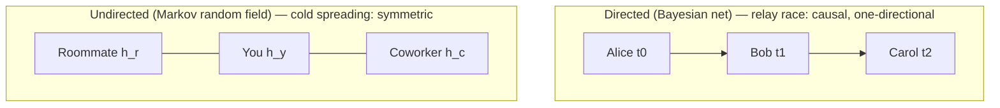
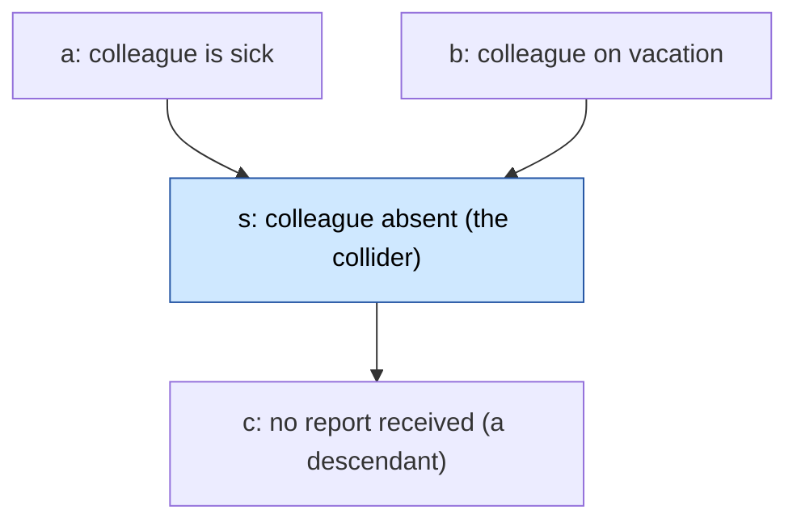
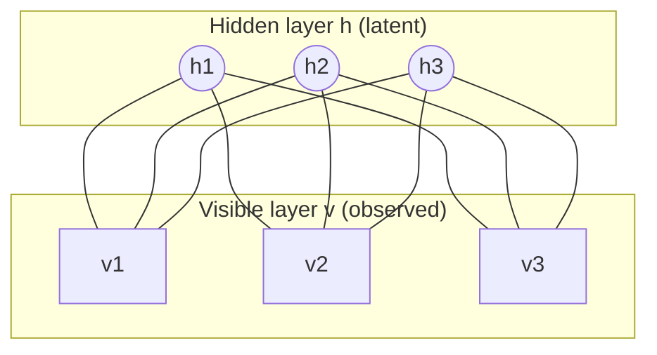

# Module 10 — Structured Probabilistic Models for Deep Learning

## TL;DR
- **A structured probabilistic model (a.k.a. graphical model) describes a probability distribution with a graph:** nodes = random variables, edges = *direct* interactions. The whole point is what you **leave out** - a missing edge asserts a conditional independence, and that is what buys the savings.
- **Why it matters:** a naive lookup table over `n` discrete variables with `k` values each needs `kⁿ` parameters (a 32×32 RGB image → `2³⁰⁷²`, more than atoms in the universe). Structure slashes this - the relay-race example drops from ~1,000,000 to ~19,899 parameters (×50). Fewer parameters → less memory, less data to estimate, cheaper inference and sampling.
- **Two languages (Activity 1's answer):** **directed** (Bayesian / belief networks, DAGs, `p(x)=Πp(xᵢ|Paᵢ)`) fit *causal, one-directional* stories and sample cheaply (ancestral sampling); **undirected** (Markov random fields, cliques + factors `φ(C)`, partition function `Z`) fit *symmetric, mutual* interactions. Neither is superior - each can encode independences the other cannot (immorality vs chordless loops).
- **The recurring headaches:** the partition function `Z` and exact **inference** are usually **intractable** (#P-hard) → deep learning leans on **energy-based models** (RBMs), **Gibbs sampling**, and **variational (approximate) inference**.
- **The DL twist (16.7):** deep models use *many* latent variables with dense, matrix-parametrised connectivity and let training *invent* the latent semantics (uninterpretable but scalable) - the opposite of traditional GMs' few, hand-designed, interpretable latent nodes. **The RBM** (`E(v,h) = −bᵀv − cᵀh − vᵀWh`) is the canonical example.
- **This is the 4th family from Module 9's thesis:** "deep probabilistic models" = graphical models. Module 10 is the *language* under RBMs/DBNs, HMMs, and every latent-variable model in the course.

> *Sources for the claims above: Goodfellow, Bengio & Courville (2016) Ch.16; Murphy (1998); Airoldi (2007) - full citations in Key Highlights below.*

## Task List

| # | Task | Status |
|---|------|--------|
| **1** | Read & summarise Goodfellow, Bengio & Courville (2016) — *Deep Learning* Ch.16 (Structured Probabilistic Models) | ✅ |
| **2** | Read & summarise Murphy, K. (1998) — *A Brief Introduction to Graphical Models and Bayesian Networks* | ✅ |
| **3** | Read & summarise Airoldi, E. M. (2007) — *Getting Started in Probabilistic Graphical Models* (PLoS Comput Biol) | ✅ |
| 4 | Activity 1: Directed versus Undirected — why do both exist? (≤100 words, forum) | 🕐 |
| 5 | Activity 2: Advantages of Structured Modelling — how does cheaper representation help DL? (≤100 words, forum) | 🕐 |
| 6 | Activity 3: Graphical Models for COVID-19 — could COVID researchers benefit? (Airoldi-based, ≤100 words, forum) | 🕐 |

---

## Key Highlights

### 1. Goodfellow, I., Bengio, Y. & Courville, A. (2016). *Deep Learning*, Ch. 16 — Structured Probabilistic Models for Deep Learning.

**Citation:** Goodfellow, I., Bengio, Y. & Courville, A. (2016). *Deep learning* (Ch. 16). Cambridge, MA: MIT Press. https://www.deeplearningbook.org/contents/graphical_models.html

**Purpose:** The spine of the module. Explains *why* modelling a joint distribution over many variables is intractable, how a graph fixes it by encoding only direct interactions, the two graph languages (directed/undirected), the machinery (partition function, energy-based models, separation, sampling, inference), and the distinctive way deep learning uses all of it (§16.7).

---

#### 1. §16.1 — The challenge of *unstructured* modelling (the motivation)
- **The table blows up.** To store `P(x)` over `n` discrete variables of `k` values each as a lookup table costs `kⁿ` parameters. For a tiny 32×32 RGB image, that is `2³⁰⁷²` — over `10⁸⁰⁰` times the number of atoms in the universe.
- **Three costs of the naive table:** **memory** (storing it), **statistical efficiency** (astronomically many parameters need astronomically much data → severe overfitting), and **runtime** (inference *and* sampling both scan the whole table).
- **Real distributions are simpler:** most variables interact only *indirectly*. **Relay race (Alice→Bob→Carol):** Bob's time depends on Alice's; Carol's depends on Bob's; Carol depends on Alice *only through* Bob. Model just the two direct interactions, drop the indirect one.
- **Payoff:** structured models model **only direct interactions** → far fewer parameters, reliable estimation from less data, dramatically cheaper storage/inference/sampling.

#### 2. §16.2 — Using graphs to describe structure
- **Nodes = random variables; edges = direct interactions.** Indirect interactions are *implied*, never drawn. Two families: **directed acyclic graphs** and **undirected graphs**.

| | **Directed** (Bayesian / belief network) | **Undirected** (Markov random field / Markov network) |
|---|---|---|
| Edge | arrow `a → b`: `b`'s distribution defined *given* `a` | plain edge: symmetric affinity, **no** conditional distribution |
| Factorisation | `p(x) = Πᵢ p(xᵢ &#124; Pa_G(xᵢ))` (local CPDs) | `p̃(x) = Π_C φ(C)` over cliques, then `p(x)=p̃(x)/Z` |
| Best when | clear **causal**, one-directional story (relay race) | **symmetric / mutual** interaction, no clean direction (spreading a cold) |
| Sampling | **ancestral sampling** — cheap, topological order | **Gibbs sampling** — expensive, multipass |
| Parameter cost | `O(kᵐ)` where `m` = max vars in one CPD (vs `O(kⁿ)`) | cheap iff all cliques are small |

**The two families side by side** — same idea (draw only direct interactions), opposite edge semantics:

*Directed: an arrow `A → B` is a **factorisation** statement - `B`'s distribution is defined by a conditional `p(B|A)`, i.e. `A` appears on the right of `B`'s conditioning bar. It is **not** intrinsically causal; a causal reading (Alice runs before Bob, so only Alice's time enters Bob's) is an **optional interpretation** you add when the domain justifies it. Undirected: plain edges = mutual affinity (you and your roommate infect each other either way); roommate↔coworker interact only indirectly through you.*

- **Directed cost win (relay race):** discretise each time into 100 bins → a full table needs **999,999** values; three conditional tables need **19,899** — a **×50** reduction. General rule: `O(kⁿ) → O(kᵐ)` when each node has few parents (`m ≪ n`).
- **Undirected specifics:** a **clique potential** `φ(C) ≥ 0` scores the affinity of a clique's joint states; the product is *unnormalised*.
- **Partition function `Z`** (§16.2.3): `Z = Σ/∫ p̃(x)` normalises to a valid distribution (a **Gibbs distribution**). Borrowed from statistical physics; **usually intractable** in deep learning → forces approximation. `Z` can even *fail to exist* if a continuous integral diverges.
- **Energy-based models (EBMs, §16.2.4):** set `p̃(x) = exp(−E(x))` — guarantees positivity, allows *unconstrained* optimisation. Any such distribution is a **Boltzmann distribution**; latent-variable EBMs = **Boltzmann machines**. Each energy term = an **"expert"** enforcing one soft constraint (**product of experts**, Hinton). **Free energy** `F(x) = −log Σ_h exp(−E(x,h))`.
- **Separation & d-separation (§16.2.5):** which variables are conditionally independent given others. **Undirected (*separation*):** a path is **active** iff *every* intermediate node is unobserved; observing any node on it blocks it. **Directed (*d-separation*)** flips the rule at colliders: a path is active iff **every non-collider on it is unobserved AND every collider is observed (or has an observed descendant)**. The **V-structure / collider** (`a → s ← b`) is the twist: `a` and `b` are independent **until you observe `s`** (or any descendant) — then they become dependent = **explaining away**.

*Marginally, "sick" and "on vacation" are unrelated. But **observe the absence** (shaded `s`) and they start competing to explain it — learn she is on vacation and the probability she is also sick drops. Observing the descendant `c` (no report) opens the same path. This is why a chordless collider must be **moralized** when converting directed → undirected.*
- **Converting between the two (§16.2.6):** **moralization** (directed→undirected: "marry" unmarried co-parents of a shared child, drop arrows); **triangulation / chordal graph** (undirected→directed: add chords to loops ≥4, then orient without cycles). Each conversion can *lose* independence information. **Immorality** = the substructure directed models capture that undirected ones cannot.
- **Factor graphs (§16.2.7):** bipartite graphs (variable circles + factor squares) that remove the ambiguity of *which* factors sit on a clique.

#### 3. §16.3 — Sampling
- **Ancestral sampling** (directed only): topologically sort, then sample each variable after its parents. Fast and simple, but only directed models, and awkward when conditioning variables come *after* the target.
- **Gibbs sampling** (undirected): iteratively resample each `xᵢ` from `p(xᵢ | neighbours)`; one pass is *not* a fair sample — must repeat many times to converge. Expensive, and hard to know when it has mixed.

#### 4. §16.4–16.6 — Advantages, learning dependencies, inference
- **Advantages (§16.4):** cut the cost of representation, learning, and inference — *by choosing not to model certain interactions*. "**Graphical models convey information by leaving edges out.**" They also **separate representation of knowledge from inference**, making models easier to design and debug.
- **Learning dependencies (§16.5):** either **structure learning** (greedy search over graphs, score = training accuracy − complexity penalty; expensive) *or* introduce **latent variables `h`** that capture dependencies between visibles indirectly (`vᵢ → h → vⱼ`). Deep learning prefers latent variables — a fixed structure + parameter learning, no discrete search. Latent variables double as a **feature mapping** `E[h|v]` for downstream classifiers.
- **Inference & approximate inference (§16.6):** exact inference (`p(h|v)`) is **#P-hard** in general — even with structure. Deep learning resorts to **variational inference**: approximate the true `p(h|v)` with a tractable `q(h|v)` as close as possible.

#### 5. §16.7 — The deep-learning approach (the section Tayab flagged as unique)

| | **Traditional graphical models** | **Deep learning graphical models** |
|---|---|---|
| Latent variables | few, hand-designed, **interpretable** (disease, topic, student ability) | **many**, training *invents* them, hard to interpret |
| Connectivity | sparse, individually chosen edges | dense, **matrix-parametrised** layer-to-layer blocks |
| Inference of choice | exact / **loopy belief propagation** | **Gibbs sampling** / variational — loopy BP almost *never* used |
| Philosophy | simplify until everything is exactly computable | **tolerance of the unknown** — grow model power until it's *just* trainable |

- **Example — the Restricted Boltzmann Machine (RBM):** energy `E(v,h) = −bᵀv − cᵀh − vᵀWh`; "restricted" = **no visible-visible or hidden-hidden edges** → `p(h|v)=Πᵢ p(hᵢ|v)` and `p(v|h)=Πᵢ p(vᵢ|h)` are factorial, giving **efficient block Gibbs sampling** and easy derivatives (`∂E/∂Wᵢⱼ = −vᵢhⱼ`). It embodies the whole DL recipe: layers, matrix connectivity, dense interaction, learned (unspecified) latent semantics.

*Every hidden unit connects to every visible unit (dense, one weight matrix `W`) — but **no edges inside a layer**. That "restriction" is exactly what makes `p(h|v)` factorial and block Gibbs sampling cheap.*

#### Key Takeaways for DLE602
1. **This is the "deep probabilistic models" family from Module 9.** The Ch.15 thesis ("FF/RNN, autoencoders **and deep probabilistic models** all learn and exploit representations") — this chapter *is* that last family; RBMs/DBMs learn `h` as a representation via `E[h|v]`, exactly the §15 story in graphical-model language.
2. **Activity 1 lives in §16.2:** directed = causal/one-directional + cheap sampling; undirected = symmetric interactions + natural for approximate inference. Neither dominates.
3. **Activity 2 lives in §16.4:** cheaper representation ⇒ fewer parameters ⇒ less data, less memory, tractable-ish inference/sampling ⇒ DL can *scale* to high-dimensional data (images, audio, text) that a lookup table could never touch.
4. **Day-job hook (St Cat's):** the **explaining-away / V-structure** is your "why is this student flagged?" problem — *absent-from-class* has two competing causes (genuinely disengaged vs one-off sick day); observing one explains away the other. And a **latent "engagement" variable** driving many observed signals (attendance, effort marks, LMS logins) is exactly §16.5's argument for hidden variables over hand-wired SQL rules.

---

### 2. Murphy, K. (1998). A Brief Introduction to Graphical Models and Bayesian Networks.

**Citation:** Murphy, K. (1998). *A brief introduction to graphical models and Bayesian networks*. Retrieved from https://www.cs.ubc.ca/~murphyk/Bayes/bnintro.html

**Purpose:** The friendly, example-driven companion to Goodfellow Ch.16, focused on **directed** models (Bayesian networks). Walks the full lifecycle — representation, inference, learning, decision theory, applications — through the classic *water sprinkler* network. Best resource for building intuition and for the "why directed models are popular" half of Activity 1.

---

#### 1. Representation — the water sprinkler network
- **Graphical models = "a marriage between probability theory and graph theory"** (Jordan): probability is the *glue* that keeps a modular system consistent; the graph is the human-readable interface **and** an efficient data structure. Mixture models, factor analysis, HMMs, Kalman filters, Ising models are all special cases.
- **Nodes = random variables; (lack of) arcs = conditional independence** → compact joint. **Undirected (MRF):** simple separation (A ⊥ B | C if C blocks every path). **Directed (BN):** arcs carry direction.
- **Why directed models are popular:** an arc `A → B` *can* be given a causal reading ("**A causes B**") - but only as an **optional interpretation you assume**, not something the arrow guarantees (formally it just says `B`'s CPD is conditioned on `A`). Under that assumption it becomes a useful guide for building structure; directed models also encode **deterministic** relationships and are **easier to learn** (fit to data).
- **Sprinkler network:** `Cloudy → {Sprinkler, Rain} → WetGrass`. Each node has a **Conditional Probability Table (CPT)**. **Rule:** a node is independent of its ancestors given its parents. Chain rule `P(C,S,R,W)=P(C)P(S|C)P(R|C,S)P(W|C,S,R)` simplifies (via independences) to `P(C)P(S|C)P(R|C)P(W|S,R)`. Space: `O(2ⁿ) → O(n·2ᵏ)` (`k` = max fan-in).
- **"Bayesian" networks aren't necessarily Bayesian** — the name comes from using *Bayes' rule* for inference; parameters are often fit with frequentist methods.

#### 2. Inference and reasoning
- **Diagnostic (bottom-up)** = effect → cause (wet grass → probably rain). **Causal / generative (top-down)** = cause → effect (cloudy → probably wet). BNs are **generative** — they specify how causes generate effects.
- **Explaining away** (the key phenomenon): two causes *compete* to explain an observed effect → they become **conditionally dependent given the child**, even if marginally independent. = **Berkson's paradox / selection bias.** Vivid example: among **college admits** (brainy OR sporty), being brainy makes you *less* likely to be sporty, because either trait alone already explains admission.
- **Bayes Ball / d-separation:** a ball can/can't travel A→B depending on which nodes are observed; the **converging-arrows (V-structure)** case is where observing the child *opens* the path (explaining away). This is *why* you must **moralize** when converting to undirected.
- **Temporal models:** **DBNs** generalise **HMMs** (one discrete hidden + one observed node per slice) and **Kalman filters / LDS** (linear-Gaussian). Specified by intra-slice + inter-slice topology (a 2TBN).

#### 3. Inference algorithms & learning
- **Exact inference:** **variable elimination** ("push sums in"); **junction tree / dynamic programming** for multiple marginals — cost is exponential in the graph's **induced width** (minimising it is NP-hard).
- **Approximate inference** (needed when the induced width is large, since **exact marginal computation is #P-hard**): **variational / mean-field**, **MCMC** (Gibbs, Metropolis-Hastings), **loopy belief propagation**, cutset conditioning. *(Guaranteed-accuracy approximation is itself hard in the worst case, but these heuristics work well in practice.)*
- **Learning — the 4 cases:**

| Structure | Observability | Method |
|---|---|---|
| Known | Full | **Maximum Likelihood** (just counting, for multinomials) |
| Known | Partial | **EM** (or gradient ascent) — inference becomes a subroutine |
| Unknown | Full | **Search** through model space (BIC / MDL score) |
| Unknown | Partial | **EM + structure search** (Structural EM) |

- **Structure learning is NP-hard** (super-exponential number of DAGs); scored by likelihood − complexity penalty (**BIC**, which *asymptotically* coincides with an **MDL**-style penalty under the usual regularity assumptions - Occam's razor). Hidden nodes can make a model dramatically more compact (his example: 45 vs 708 parameters).

#### 4. Decision theory & applications
- **Decision theory = probability theory + utility theory** → **influence diagrams** (add utility + action nodes) → optimal policy (reinforcement learning when the model is complex).
- **Real fielded systems:** Microsoft Office Assistant + 30 troubleshooters; **QMR-DT** (medical diagnosis: hidden disease layer → observed symptom layer, so dense that only approximate inference works); NASA's **Vista** (space-shuttle telemetry). Also genetics, speech (HMMs), tracking (Kalman), coding (turbocodes).

#### Key Takeaways for DLE602
1. **Best intuition source for Activity 1's "directed" half** — the causal reading of arrows, deterministic relations, and easier learning are the concrete "good reasons directed models exist."
2. **Explaining away is the one phenomenon to be able to explain out loud** — it recurs in Goodfellow's V-structure and is the most exam-friendly, and the most *day-job-relevant* (competing causes for a flagged student).
3. **The 4-case learning table is the practical map** — it tells you which algorithm (MLE / EM / search) any real modelling problem needs, from full observability to hidden variables + unknown structure.

---

### 3. Airoldi, E. M. (2007). Getting Started in Probabilistic Graphical Models.

**Citation:** Airoldi, E. M. (2007). Getting started in probabilistic graphical models: E252. *PLoS Computational Biology, 3*(12), e252. https://doi.org/10.1371/journal.pcbi.0030252

**Purpose:** A short, dense *applications* paper showing PGMs as a **common conceptual architecture that bridges biology and statistics**. It is the source for **Activity 3 (COVID-19)** — read it not for biology depth but to see how the same graphical-model workflow lets domain scientists and modellers collaborate on messy real-world data.

---

#### 1. PGMs as a bridge between two worlds
- **The core claim:** PGMs "offer a common conceptual architecture where **biological and mathematical objects** can be expressed with a common, intuitive formalism" → enables communication **across the mathematical divide** and joint development of tools. The graph is the shared language.
- **Formal definition (matches Goodfellow/Murphy):** nodes = random variables (observed = **shaded**, latent = **unshaded**), arcs = statistical dependencies / biological hypotheses, plus constants (**parameters** in the frequentist view, **hyper-parameters** in the Bayesian view). **Plate notation** = a box for iid replicates.

#### 2. The workflow (the transferable part)
1. **Draw a "cartoon model"** of the domain — identify the objects (genes, functional processes).
2. **Split observable vs latent:** gene *transcript abundance* is measurable (via SAGE); *functional processes* are **latent**, operationally defined as gene sets with similar temporal regulation.
3. **Translate** biological players → random variables and connections → statistical dependencies (**this defines the model structure**).
4. **Fit** the model (assign numbers to unknowns) and **interpret** in the original problem's terms.
5. **Assess goodness of fit → critically review assumptions → propose new, testable hypotheses.** PGMs drive an **iterative loop of scientific discovery**.

#### 3. The machinery (a compact echo of Ch.16 / Murphy)
- **Likelihood function** = the main quantity (`Pr(Y|a,b)`); the **complete likelihood** `Pr(Y,X|a,b)` (with latent `X`) is usually easy even when the marginal likelihood is **intractable**.
- **Estimation** (find the constants/parameters) vs **inference** (find distributions of latent variables) — two distinct tasks.
- **Three approximate-inference strategies** (same trio as the textbook): **MCMC** (Gibbs, Metropolis-Hastings — sampling-based), **EM**, and **variational methods** (optimisation-based; **Jensen's inequality** → a lower bound on the likelihood; minimise **KL divergence** to the true posterior). Software: **BUGS** (MCMC), **VIBES** (variational).
- **`K` = dimensionality** (number of latent contexts) — chosen by model selection (**BIC**, held-out likelihood, cross-validation).
- **Caveat:** the graph is informative **but not exhaustive** — probabilistic assumptions and sampling details it can't show often matter a lot in practice.
- **Applications:** ancestral population structure, **HIV mutation patterns**, phylogenetic trees, breast-cancer status from gene expression, C. elegans literature mining.

#### Key Takeaways for DLE602
1. **Activity 3 (COVID-19) is answered by analogy to this paper.** COVID research has the same object types: **observable** measurements (PCR/antigen results, symptoms, hospitalisations, genome sequences) and **latent** quantities you can't probe directly (true infection state, transmission chains, variant lineages, population immunity). Because PGMs bridge messy domain data and statistics, COVID modellers **would** benefit — for transmission-network inference, phylogenetics of variants, and honest uncertainty — the same way genomics did. *(Cite Airoldi's bridge claim + the HIV-mutation and phylogenetic-tree precedents.)*
2. **It shows PGMs beyond deep learning** — a reminder that the graphical-model formalism is a *general scientific* tool, not just an RBM detail; good breadth to signal in a report.
3. **Reinforces the module's inference trio** — MCMC / EM / variational appear in *all three* resources, so they are the safe "core machinery" to name in any Module 10 answer.
