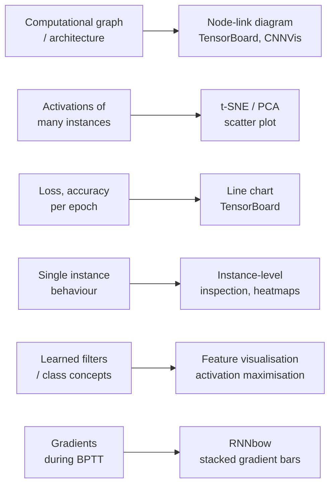

# Module 11 — Visual Analytics in Deep Learning

## TL;DR
- **The problem:** deep nets work but nobody can say *why*. Millions of parameters, stacked non-linear transformations, no readable decision path. Visual analytics is the field that turns those internals into pictures a human can reason about - to **explain, interpret, debug and improve** models (Hohman et al., 2018).
- **The organising framework (memorise this):** Hohman et al. survey the field with the **Five W's and How** - **Why** visualise (interpretability, debugging, model comparison, teaching) · **Who** (model developers · model users · non-experts) · **What** (computational graph, learned parameters, individual units/activations, gradients, neurons as high-dimensional space, aggregated metrics) · **How** (node-link diagrams, dimensionality reduction + scatter plots, line charts, instance-based analysis, interactive experimentation, attribution/feature-visualisation algorithms) · **When** (during training vs after training) · **Where** (application domains + the hybrid VIS/AI research community).
- **Their one-sentence template:** *"To interpret representations learned by deep models (why), model developers (who) visualise neuron activations in CNNs (what) using t-SNE embeddings (how) after training (when) to solve an urban planning problem (where)."* Any tool - including yours - can be positioned in that sentence.
- **Two worked systems:** **CNNComparator** (Zeng et al., 2017) compares **two snapshots of the same CNN** (epoch 10 vs epoch 100) across four linked views to connect *parameter change* to *performance change*. **RNNbow** (Cashman et al., 2017) visualises **gradients rather than activations** during backprop-through-time, making the **vanishing gradient** visible as a decaying stacked bar.
- **Activations vs gradients (the sharpest distinction in this module):** activations show *how the network decides*; gradients show *how the network learns*. Most of the work Hohman et al. survey is activation-based, and much of it runs after training; RNNbow is the gradient-based, during-training counterexample.
- **The practical CNN toolkit (Pal, 2019):** model summary → access individual layers → visualise **filters** → **activation maximisation** (what the model *expects*) → **occlusion maps** (which region matters) → **saliency maps** (per-pixel gradient) → **Grad-CAM** (gradient-weighted class activation) → **layerwise output** (edges early, objects late). The snow-leopard-vs-Arabian-leopard example is the whole motivation: without visualisation you cannot tell whether your model learned *the leopard* or *the snow*.
- **Open problems:** scalability (visual + system), proper design studies/user evaluation, human-AI pairing, **bias detection**, and defending against **adversarial attacks**.

> *Sources for the claims above: Hohman, Kahng, Pienta & Chau (2018); Zeng et al. (2017); Cashman, Patterson, Mosca & Chang (2017); Pal (2019) - full citations in Key Highlights below.*

## Task List

| # | Task | Status |
|---|------|--------|
| **1** | Read & summarise Hohman, F., Kahng, M., Pienta, R. & Chau, H. (2018) — *Visual Analytics in Deep Learning: An Interrogative Survey for the Next Frontiers* | ✅ |
| **2** | Read & summarise Zeng, H. et al. (2017) — *CNNComparator: Comparative Analytics of Convolutional Neural Networks* | ✅ |
| **3** | Read & summarise Cashman, D. et al. (2017) — *RNNbow: Visualizing Learning via Backpropagation Gradients in RNNs* | ✅ |
| **4** | Read & summarise Pal, S. (2019) — *A Guide to Understanding CNNs Using Visualization* | ✅ |
| 5 | Activity 1: Opinion Matters — react to Hohman et al.'s claim about visual analytics as an integral component of modern AI (≤100 words, forum) | 🕐 |
| 6 | Activity 2: Interactive Learning Activity — play with playground.tensorflow.org and report the experience (≤100 words, forum) | 🕐 |
| 7 | Activity 3: Discussion — will you use visual analytics in A3? (no submission, live discussion) | 🕐 |

---

## The module in one picture

```mermaid
flowchart LR
    subgraph WHY["WHY visualise"]
        W1[Interpretability<br/>& explainability]
        W2[Debugging<br/>& improving]
        W3[Comparing<br/>& selecting models]
        W4[Teaching<br/>DL concepts]
    end
    subgraph WHO["WHO"]
        O1[Model developers]
        O2[Model users]
        O3[Non-experts]
    end
    subgraph WHAT["WHAT to visualise"]
        T1[Computational graph]
        T2[Learned params<br/>weights, filters]
        T3[Units: activations<br/>+ gradients]
        T4[Neurons as<br/>high-dim space]
        T5[Aggregated:<br/>groups + metrics]
    end
    subgraph HOW["HOW"]
        H1[Node-link diagrams]
        H2[Dim-reduction<br/>+ scatter plots]
        H3[Line charts]
        H4[Instance analysis]
        H5[Interactive<br/>experimentation]
        H6[Attribution &<br/>feature vis]
    end
    subgraph WHEN["WHEN"]
        N1[During training]
        N2[After training]
    end
    WHY --> WHO --> WHAT --> HOW --> WHEN
```

**What maps to How** (the pairing worth memorising):

---

## Key Highlights

### 1. Hohman, F., Kahng, M., Pienta, R. & Chau, H. (2018). Visual analytics in deep learning: An interrogative survey for the next frontiers.

**Citation:** Hohman, F., Kahng, M., Pienta, R. & Chau, H. (2018). *Visual analytics in deep learning: An interrogative survey for the next frontiers*. Retrieved from https://arxiv.org/pdf/1801.06889.pdf

**Purpose:** The essential resource. A comprehensive survey of visualisation and visual analytics for deep learning, organised by a **human-centred interrogative framework** (the Five W's and How), which both summarises the state of the art and gives you a template for positioning any new tool - including your own A3 work.

---

#### 1. Why visualise deep learning (§4)

| Reason | What it means | Representative work |
|---|---|---|
| **Interpretability & explainability** | Understand *how* a model decides and *what* representations it learned, so we can place trust in it. The dominant motivation. | Lipton's *Mythos of Model Interpretability*; Montavon et al. |
| **Debugging & improving models** | Model building is an iterative design process; finding the right depth, width and hyperparameters is nontrivial. Visualisation speeds up the loop. | DeepEyes, Blocks, TensorBoard |
| **Comparing & selecting models** | Not debugging - all candidates trained fine. Pick the best on accuracy/loss/generalisability, or compare snapshots of one model over epochs. | CNNComparator (resource 2) |
| **Teaching DL concepts** | Educate non-experts, build intuition via direct manipulation instead of code. | TensorFlow Playground, Teachable Machines, Distill articles |

- **Important nuance on definitions:** there is **no agreed formal definition** of interpretability/explainability. Montavon et al. separate them: an **interpretation** maps an abstract concept (e.g. a predicted class) into a human-sensible domain; an **explanation** is the collection of interpretable-domain features that produced a given decision (e.g. a heatmap over pixels). Lipton adds that *an explanation can show predictions without elucidating the mechanism*. Miller argues explanations should be structured the way **humans** accept them (drawing on philosophy, psychology, cognitive science), not the way AI researchers intuit.
- **Interpretation as qualitative evidence:** applied papers increasingly include a visualisation section to *qualitatively support* their quantitative results - multilingual NMT embeddings, DQN policies on Atari, population prediction from satellite imagery, autonomous driving, medical imaging (MRI), urban planning.

#### 2. Who uses it (§5) - three non-mutually-exclusive groups

| Group | Knowledge | Typical tools |
|---|---|---|
| **Model developers & builders** | Deepest. Build, tune, deploy nets; want fine-grained control and exposed hyperparameters. | TensorBoard, DeepEyes, Blocks, ML-o-scope, DGMTracker |
| **Model users** | Some technical background, network novices. Use known architectures, pretrained weights, domain applications. Includes ML artists. | ActiVis (deployed at Facebook), LSTMVis, Embedding Projector |
| **Non-experts** | Little/no DL knowledge. Educational focus, or just consumers of AI-powered products. | TensorFlow Playground, ShapeShop, Teachable Machines, ConvNetJS |

- LSTMVis usefully sub-divides model users into **architects** (build new methods), **trainers** (domain experts applying LSTMs) and **end users** (use pretrained models).

#### 3. What can be visualised (§6)

- **Computational graph / network architecture** - the *dataflow* graph (how data moves through operations to train, test, checkpoint). Distinct from the weights.
- **Learned model parameters** - (a) **edge weights** updated during backprop; (b) **convolutional filters**, which can be rendered as an alternate explanation of what the model learned.
- **Individual computational units** - (a) **activations** recovered at each layer during inference (instance-level observation); (b) **gradients** for error measurement, which flow along the same edges but in the opposite direction, showing how much error is produced and where it is distributed.
- **Neurons in high-dimensional space** - treat each neuron in a layer as a *dimension*, so a data instance is a vector; the net becomes a **feature generator** and its embedding can be reduced to 2D/3D.
- **Aggregated information** - (a) **groups of instances** (compare activation distributions across classes to reveal decision boundaries); (b) **model metrics** (loss, accuracy per epoch) which scale where instance-level analysis does not, and are the key indicators of learning vs overfitting.

#### 4. How to visualise (§7) - the six techniques

| Technique | Used for | Strength | Weakness |
|---|---|---|---|
| **Node-link diagrams** | Architecture and dataflow graphs; neurons as nodes, weights as links (encode magnitude/sign by colour or thickness) | Intuitive, familiar; the TensorBoard standard | **"Hairball"** clutter at scale; needs edge bundling (CNNVis) or extraction of high-degree nodes |
| **Dimensionality reduction + scatter plots** | Embeddings, activations; PCA / **t-SNE** to 2D or 3D | Reveals clusters, class separation, evolution over epochs | Quality depends heavily on the algorithm; **t-SNE is very sensitive to hyperparameters** (perplexity, iterations); 3D-on-2D screens hurts distance judgement |
| **Line charts for temporal metrics** | Loss / accuracy / error per epoch | The staple for training, comparison and selection; supports live updates | Abstracts the whole model to one number |
| **Instance-based analysis & exploration** | Single instances as *unit tests*; misclassified instances; colour-coded text activations; confusion matrices (Blocks) | Concrete, human-scale; experts build personal instance collections with known ground truth | Doesn't generalise; groups of instances (ActiVis, ConceptVector) partly fix this |
| **Interactive experimentation** | "What if?" direct manipulation - *explorable explanations*; webcam input, hand-drawn digits, sketch-to-image GANs, Adversarial Playground; exposing hyperparameters (TF Playground) | Builds intuition without code; superb for teaching | Limited to small models; more demo than diagnosis |
| **Algorithms for attribution & feature visualisation** | **Attribution/saliency heatmaps** (which input regions drove the classification) and **feature visualisation** (synthesise an image representative of a class, e.g. class activation maximisation via gradient ascent) | Directly answers "what did it learn / where did it look"; from the AI-CV community | Usually **static, non-interactive**; some methods have been shown to **fail to give correct results**; trustworthiness questioned (do neurons have consistent meaning?) |

#### 5. When and where (§8-§9)

- **During training:** run alongside the model in a browser, poll the latest status, redraw metric charts every epoch. Developers use these to decide whether the model (1) has begun to learn at all, (2) is converging, or (3) has overfitted. *Deep View* even defines its own **discriminability** and **density** metrics to spot overfitting early without waiting.
- **After training:** assume a trained model as input - Embedding Projector, Deep Visualization Toolbox, ActiVis, RNNVis, LSTMVis. **Most attribution and feature-visualisation algorithms are after-training by nature.**
- **Where (domains):** NMT, reinforcement learning, social good, autonomous vehicles, medical imaging, urban planning. **Where (models):** overwhelmingly CNNs + image data, then RNN/LSTM + sequence data, now GANs (DGMTracker, GANViz).
- **The community** is *hybrid* (VIS + AI), *apace* (workshops and arXiv preprints outpace journals) and *open-sourced* by norm - code links inside preprints are now expected, which helps reproducibility.

#### 6. Research directions & open problems (§10) - the source of exam/essay material

1. **Furthering interpretability** - new visual representations + interactions (VIS side), faster/cheaper attribution methods (AI side), combined into rich interfaces.
2. **System & visual scalability** - millions of parameters produce clutter; dimensionality reduction has a hard limit on point count; web-based tools need real-time interaction.
3. **Design studies for evaluation** - utility *and* usability. Most AI-side works include no user study; multi-coordinated-view interfaces can overwhelm; bring in HCI/UX people. Also: **quantifying interpretability**.
4. **The human role** - producing visualisations that are actually *human-understandable*; comparing machine and human baselines; **human-AI pairing / artificial intelligence augmentation** (the machine suggests, the human steers).
5. **Social good & bias detection** - Google **Facets** previews datasets for class imbalance before training; interactive work on fair vs unfair threshold classifiers (loan granting) shows *equal opportunity is not automatically preserved*; humans are themselves biased decision makers.
6. **Protecting against adversarial attacks** - imperceptible perturbations can completely fool classifiers; Adversarial Playground lets users tune attack type and strength and watch the misclassification. The authors argue visualisation should go beyond *showing* attacks to *detecting and defending*.

#### Key Takeaways for DLE602

1. **Activity 1 ("Opinion Matters") is answered directly by §10.5 and §10.1.** The quote - visual analytics as "an integral component in addressing pressing issues in modern AI ... from discerning model bias, understanding models, to promoting AI safety" - is supported by Facets (bias), the Five W's *Why* section (understanding), and §10.6 (adversarial attacks = safety). A *credible* agree-with-caveats position: agree on the diagnostic value, but note the survey's own admissions - **no agreed definition of interpretability**, some attribution methods **fail to give correct results**, and most tools have **no user study**. That caveat is what separates a distinction-level 100 words from a summary.
2. **Use the Five W's sentence to frame your A3.** Filling in the template forces you to say who the visualisation is for and when it runs - which is exactly what the Module 11 A3 task in the README asks ("explore visual analytics and how it may help explain, interpret, debug, and improve neural networks in the project").
3. **The survey is the map; resources 2, 3 and 4 are the worked examples.** CNNComparator = *comparing & selecting models* (why) using *learned parameters* (what). RNNbow = *debugging* (why) using *gradients* (what) *during training* (when). Pal = *interpretability* (why) using *attribution & feature visualisation* (how) *after training* (when).

---

### 2. Zeng, H., Haleem, H., Plantaz, X., Cao, N. & Qu, H. (2017). CNNComparator: Comparative analytics of convolutional neural networks.

**Citation:** Zeng, H., Haleem, H., Plantaz, X., Cao, N. & Qu, H. (2017). *CNNComparator: Comparative analytics of convolutional neural networks*. Retrieved from https://vadl2017.github.io/paper/vadl_0108-paper.pdf

**Purpose:** A visual analytics system that compares **two snapshots of the same CNN taken at different epochs**, so a developer can see not just *that* accuracy improved but *which parameters changed and where* - closing the gap between "loss went down" and "here is what the network actually learned."

---

#### 1. The problem it attacks

- Training a CNN is "a substantial amount of trial and error." Users normally only see **accuracy and loss**; they have no view of what happened to the **parameters** that produced that improvement.
- Two named challenges: **scalability** (millions of parameters - which ones matter?) and **interpretability** (a raw parameter tells you nothing about its effect on performance).
- Deliberate scope limit: they compare **two snapshots within one training run**, not two independent runs, because different **random initialisations** make cross-run comparison uninterpretable. Honest and worth citing.

#### 2. Design principles and analytic tasks

- Built on Shneiderman's mantra: **"overview first, zoom and filter, then details on demand."**
- Top-down levels of detail: **model → layer → channel → neuron.**
- Comparison strategy from Gleicher et al.'s three categories - **juxtaposition** (side by side), **superposition** (overlay), **explicit encoding** (encode the difference directly). CNNComparator uses **juxtaposition + explicit encoding**.

| Task | What the user must be able to do |
|---|---|
| **T1 Global exploration** | Spot the biggest differences at a glance (most-changed layer, performance gap) |
| **T2 Detail exploration** | For a selected layer, see the distribution of changes and which parameters moved most |
| **T3 Insight exploration** | Locate *where* weights changed and where channels activate |
| **T4 Correlation exploration** | See which features stay relevant across snapshots and how a layer activates on the same input |

#### 3. The four linked views

| View | Encoding | Answers |
|---|---|---|
| **Network architecture view** | Layers laid out; **Euclidean distance** between parameter sets, mapped to colour (darker = more different) | Which layer changed most? (T1) |
| **Difference distribution view** | Histogram + stacked chart, binned by **absolute** weight change, coloured by **relative percent difference** `d(x,y) = 2·abs(x−y) / (abs(x)+abs(y)) ∈ [0,2]` for `(x,y) ≠ (0,0)`, with `d(0,0) = 0` (used because ordinary relative change breaks when the denominator ≈ 0) | Are the changes big or small, and how are they distributed? (T2) |
| **Convolutional operation view** | 4D kernels flattened into a **2D pixel map**: input channel maps, kernel columns, output channel maps; colour encodes the difference; zoom / hover / click | *Where* are the changes? (T3) |
| **Performance comparison view** | Side-by-side bar charts of class probabilities for a chosen image, plus top-activating **image patches** (selective search + ranking by activation) | Did the change help, and what does the channel actually detect? (T1, T4) |

#### 4. The case study (AlexNet, 17-category flowers, epoch 10 vs 100)

- Trained AlexNet on the 17-category flower dataset: **97.2% train / 72.79% validation** accuracy after 100 epochs (note the gap - overfitting is visible in the numbers themselves).
- `conv5` showed the largest difference. Filtering out the small changes revealed that some neurons were **highly activated** and some channels far darker than others.
- **The insight:** at **epoch 100** the model captures **detailed image patches**; at **epoch 10** it fixates on **abstract** patches - which is why epoch 10 misclassifies more.
- **The counter-insight (the good bit):** even at epoch 100 the model misclassified a **daffodil as a buttercup**, because that snapshot's feature extraction had latched onto **yellow** - the dominant colour of class 14. This is a colour shortcut, exactly the failure mode Pal's leopard/snow example warns about.

#### 5. Stated limitations

- **Scalability** remains the major challenge; visualising all neuron parameters causes severe visual clutter.
- Change locations are **quite random**, so more domain-knowledge-driven filtering is needed.
- Metrics are simple (Euclidean distance); better difference measures should be explored.
- Only **two snapshots, one training run**; comparing different architectures/hyperparameters is harder and remains future work. Showing **temporal trends across epochs** would be more natural than picking two numbers.

#### Key Takeaways for DLE602

1. **This is the "comparing & selecting models" cell of Hohman's Why, and the "learned model parameters" cell of What.** Cite it when you need a concrete example of visualisation used for *model selection* rather than explanation.
2. **The daffodil-as-buttercup finding is a portable example of a shortcut feature** - and it links straight back to Module 9's representation learning (a model can learn a compact but *wrong* representation). If your A3 model beats a baseline, this is the argument for checking *why* before trusting it.
3. **Practical transfer to A3:** you do not need CNNComparator itself. Saving model checkpoints at two epochs and plotting weight-difference distributions plus side-by-side prediction bars is a ~30-line reproduction of the core idea, and it demonstrates SLO `d)` (apply/evaluate) rather than just describing a tool.

---

### 3. Cashman, D., Patterson, G., Mosca, A. & Chang, R. (2017). RNNbow: Visualizing learning via backpropagation gradients in recurrent neural networks.

**Citation:** Cashman, D., Patterson, G., Mosca, A. & Chang, R. (2017). *RNNbow: Visualizing learning via backpropagation gradients in recurrent neural networks*. Retrieved from https://vadl2017.github.io/paper/vadl_0107-paper.pdf

**Purpose:** An interactive web tool that visualises **gradient flow during backpropagation through time**, making the **vanishing gradient** directly visible. At time of writing, the authors state it is the only neural network visualisation that visualises gradient flow.

---

#### 1. The key distinction: gradients, not activations

- **Activations** = the network's responses during **inference** - which neurons fire on a given input. Instructive for *how the network makes decisions*, but says little about *how it learns*.
- **Learning happens via gradient descent.** So to analyse whether (and how well) a network is learning, you must inspect **gradients**.
- Consequence: RNNbow is used **during training** (to decide whether hyperparameters need to change), not at test time like most tools.
- Bonus property: because it visualises the gradient and not the input space, it is **domain-agnostic** - it works for characters, words, video frames, medical records. Most CNN visualisations are locked to image data.

#### 2. The RNN recap it builds on (worth re-reading with Module 8)

- `h_i = tanh(W·h_{i-1} + U·x_i)` and `y_i = σ(V·h_i)`; `W`, `U`, `V` shared across unrolled cells.
- Training partitions data into batches; the RNN unrolls once per element (batch size 25 here = 25 unrolled cells); losses at **every** output are summed and backpropagated by **BPTT**.
- **Why long-range matters:** to produce *"the man ... his"*, the gradient from the loss at `t = i+5` must still be non-zero at `t = i`. If it decays first, the model cannot learn the dependency - the **vanishing gradient problem**. Fixes involve hidden size, depth, architecture (stacks/grids) and cell type (**LSTM**, **GRU**) - choices the paper says are "mystifying" to most users, which is exactly why a diagnostic view helps.
- **RNNbow only visualises the gradients of `W`, because `W` controls the memory of the RNN.**

#### 3. The interface (four areas)

| Area | Shows | Read it as |
|---|---|---|
| **1. Prediction & true labels** | True label per timestep, with the RNN's prediction below, **green = correct, red = wrong** | Grounds you in the actual data |
| **2. Per-batch gradients** | Stacked bar per timestep; **height = gradient magnitude** at that step; each band = how far in the **future** the loss that produced it occurred (darkest = current step's own loss) | **Dark bars = short gradient horizon** (only local losses); **lighter/more distributed = longer-term dependencies being learned** |
| **3. Gradient horizon** | Hovering a band projects the gradient due to that **single** loss backwards in time | The **vanishing gradient made visible** - watch the decay rate |
| **4. Overview of all batches** | Max gradient per batch (300 batches), clickable/hoverable | Navigates you to where the model is learning **most** |

- Design choice worth noting: they visualise the **max** rather than the mean per batch, because batches are an artefact of training - the user cares about the most informative **elements**, not the most informative batch.

#### 4. Itemised gradients: the method and its cost

- Standard backprop uses dynamic programming to compute the whole gradient in one pass - **O(n)** - but that memoisation *destroys* the per-source breakdown RNNbow needs.
- They remove one level of dynamic programming to record **itemised gradients** (indexed by the timestep whose loss produced them), at cost **O(n²)** in batch size.
- Data volume: **O(H·N·n)** gradients per pass (H = hidden size, N = training set size, n = batch size). With `n=25, H=100`, a full pass would produce **2,500× the size of the training data**.
- Mitigations: record gradients only **every 100 batches** (99% of batches use fast backprop); **average gradients across hidden nodes** (avoids occlusion and matches the goal of seeing general training rate); and truncate the backward walk at **k** steps, since the summand ratio `M_j / M_{j+1} = W·tanh'_j · (h_{j-1}/h_j)` decays (W starts near 0 and regularisation keeps it small; `tanh' ∈ (0,1]`). They chose **k = 5** empirically and note a richer architecture would need a larger k.

#### 5. Use case findings (character-level RNN on the Linux kernel, generating C)

- **Burn-in:** gradient magnitude starts very small then plateaus - early training updates weights slowly.
- **Early vs late training:** early batches are **dark** (gradient dominated by local, 0-2 step losses); later batches are **lighter and more distributed** (longer-term dependencies being learned). A clean visual signature of learning progress.
- **Vanishing gradient** is unmistakable in the gradient-horizon view (area 3) as monotonic decay backwards in time.
- **Maximal-gradient batch:** the largest gradient came from predicting `a` instead of `(` inside a `for` loop - i.e. the RNN had **not learned the iterator grammar of C**. Two conclusions: the model is learning from genuine mistakes (not overfitting), and **training is not finished**.

#### 6. Stated limitations

- Positioned for **non-experts**, not power users (who would build custom analytics in their own pipelines).
- The interface does not support more than a few hundred batches; real training runs hundreds of thousands. Needs aggregation + drilldown, and a heuristic to point users at interesting batches.
- The stacked bar chart likely will not scale past batch size ~50 (at `n=25, k=5` it already draws 125 marks).

#### Key Takeaways for DLE602

1. **This is the module's sharpest single idea: activations explain *deciding*, gradients explain *learning*.** If you memorise one sentence from Module 11 for an exam or forum post, make it that one.
2. **It ties Module 11 back to Module 8 (RNN/LSTM).** The vanishing gradient you learned about abstractly is here rendered as a decaying stacked bar - and the reason LSTM/GRU cells exist becomes a *visual* argument rather than a formula.
3. **Relevance to Review Pulse / A3:** if your project uses a BiLSTM, RNNbow's argument is directly usable - "we can inspect whether the model is learning long-range aspect-sentiment dependencies or just local n-gram cues." You do not need the tool; logging gradient norms per timestep and plotting them reproduces the core diagnostic.
4. **The O(n²) / 2,500× data-volume point is a good honest-limitation citation** - visual analytics is not free, and the paper is explicit about the compute/insight trade-off.

---

### 4. Pal, S. (2019). A guide to understanding convolutional neural networks (CNNs) using visualization.

**Citation:** Pal, S. (2019, 6 May). *A guide to understanding convolutional neural networks (CNNs) using visualization* [Web log post]. Retrieved from https://www.analyticsvidhya.com/blog/2019/05/understanding-visualizing-neural-networks/

**Purpose:** The hands-on counterpart to the survey - a code-first walkthrough (Keras + VGG16 pretrained on ImageNet) of six CNN visualisation techniques, with the explicit goal of extracting insight to **tune** the model, not just admire it.

---

#### 1. Why visualise at all - the leopard example

- Task: classify **snow leopards** vs **Arabian leopards**. Snow leopard images have snow backgrounds; Arabian leopard images have desert backgrounds.
- **The trap:** the model may simply learn to classify **snow vs desert** and still score well. Nothing in the accuracy number reveals this.
- **The point:** *"Visualization helps us see what features are guiding the model's decision for classifying an image."* This is the same failure the CNNComparator daffodil/buttercup case exposed, and the same "shortcut feature" idea from Module 9.

#### 2. Setup and layer access

- `VGG16(weights='imagenet', include_top=True)` then `model.summary()` - check input/output shapes match the problem, count trainable vs non-trainable parameters (matters when fine-tuning only a subset of layers), and sanity-check whether the GPU can hold the model.
- Individual layers are accessible via `model.layers`; `i.get_config()` gives layer characteristics (filters, kernel size, strides, padding, activation, initialisers) and `i.get_weights()` gives the weights. Example: `block5_conv1` has **512 filters**, `3×3` kernel, `relu`, `trainable: True`.

#### 3. The six techniques

| Technique | Question it answers | Mechanism |
|---|---|---|
| **Filter visualisation** | What are the building blocks? | Plot the learned kernels directly (VGG16 uses only `3×3` filters throughout) |
| **Activation maximisation** | What does the model **expect** a class to look like? | Optimise a **random input image** so that the chosen class/neuron's activation is maximised (gradient of activation loss w.r.t. the input). For "Indian elephant" the synthesised image shows **tusks, large eyes, trunk** - evidence the dataset is adequate. If it instead showed trees/long grass, that is a signal the training set lacks habitat diversity. |
| **Occlusion maps** | Which **region of this input** matters? | Slide an occluding patch across the image, re-predict each time, record the class probability as a pixel value → heatmap. Probability **drops** where the occluded region was important. The car-logo example: mask the logo and you cannot identify the manufacturer either. |
| **Saliency maps** | Which **individual pixels** matter? | Gradient of the output class score w.r.t. **every input pixel**; positive gradients mean increasing that pixel raises the class score. **Guided backpropagation** truncates negative gradients to 0, so only positively-influencing pixels show - producing a cleaner map. |
| **Grad-CAM (gradient-weighted class activation maps)** | Coarse **localisation** of the evidence | (1) take the final conv layer's feature map (`14×14×512` for VGG16); (2) compute the gradient of the output w.r.t. those feature maps; (3) global-average-pool the gradients; (4) weight each feature map by its pooled gradient. Produces a coarse heatmap of the important regions for the predicted concept. |
| **Layerwise output visualisation** | What does the model see **at each depth**? | Build intermediate `Model(inputs=model.input, outputs=layer.output)` per layer and plot the feature maps. **Early layers → low-level features (edges); deeper layers → object parts** (roof, exhaust of a car). Directly informs which layers to reuse for feature extraction or style transfer. |

#### 4. Occlusion vs saliency vs Grad-CAM - the distinction to keep straight

| | Granularity | Needs gradients? | Cost |
|---|---|---|---|
| **Occlusion map** | Patch-level | No - purely forward passes | Expensive (one forward pass per patch position) |
| **Saliency map** | Pixel-level | Yes (one backward pass) | Cheap, but noisy |
| **Grad-CAM** | Coarse region, class-specific | Yes (gradients into the last conv layer) | Cheap, and the standard modern choice |

- Also flagged in the closing notes: **TensorSpace** (loads your model and visualises it interactively, multiple model formats) and **Activation Atlases**.

#### Key Takeaways for DLE602

1. **This is the resource to actually run.** It maps 1:1 onto Hohman's **§7.6 "Algorithms for attribution & feature visualisation"** and gives you the code to produce a real figure for your A3 report - which is what turns Module 11 from a reading week into evidence for SLO `d)`.
2. **Activation maximisation is a dataset-diagnosis tool, not just a pretty picture.** The elephant example shows the reasoning: if the synthesised class image shows *context* (grass, trees) rather than the *object*, your training data is too narrow. That is a concrete, defensible sentence for an A3 limitations section.
3. **Pick one technique and do it properly.** Grad-CAM on a handful of correctly- and incorrectly-classified test instances is more persuasive than six half-done visualisations, and it directly serves the README's Module 11 A3 task ("explain, interpret, debug, and improve neural networks in the project").
4. **Caveat worth carrying from resource 1:** Hohman et al. note that some attribution methods have been shown to **fail to give correct results**, and that researchers remain sceptical about whether feature visualisations faithfully reflect neuron meaning. Present your heatmaps as *evidence*, not *proof*.
